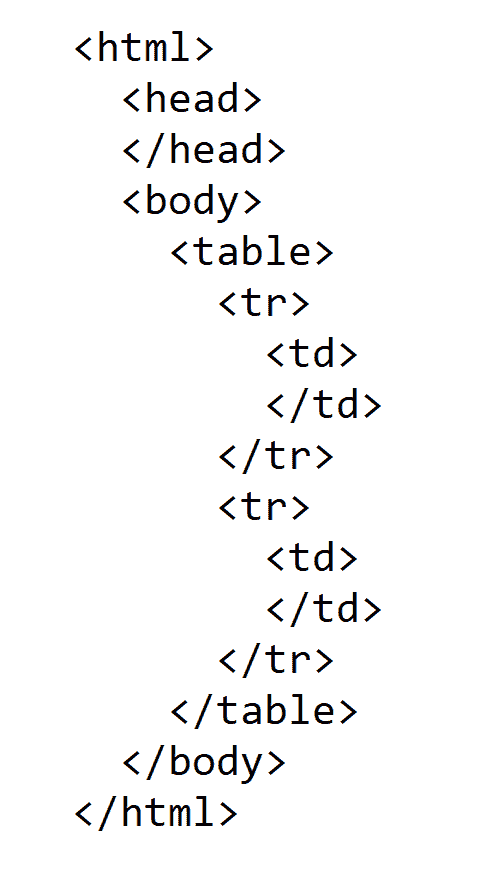
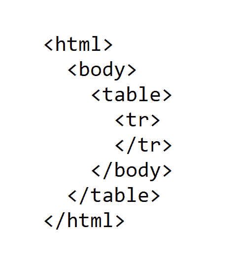

# 使用 SQL 验证字符串是否为 HTML

> 原文：[`towardsdatascience.com/validate-a-string-as-html-using-sql-d70e81149a2?source=collection_archive---------14-----------------------#2023-01-19`](https://towardsdatascience.com/validate-a-string-as-html-using-sql-d70e81149a2?source=collection_archive---------14-----------------------#2023-01-19)

## 是否可以仅通过 SQL 检查字符串是否包含有效的 HTML？

[](https://medium.com/@dhruvbird?source=post_page-----d70e81149a2--------------------------------)[](https://towardsdatascience.com/?source=post_page-----d70e81149a2--------------------------------) [Dhruv Matani](https://medium.com/@dhruvbird?source=post_page-----d70e81149a2--------------------------------)

·

[关注](https://medium.com/m/signin?actionUrl=https%3A%2F%2Fmedium.com%2F_%2Fsubscribe%2Fuser%2F63f5d5495279&operation=register&redirect=https%3A%2F%2Ftowardsdatascience.com%2Fvalidate-a-string-as-html-using-sql-d70e81149a2&user=Dhruv+Matani&userId=63f5d5495279&source=post_page-63f5d5495279----d70e81149a2---------------------post_header-----------) 发表在 [Towards Data Science](https://towardsdatascience.com/?source=post_page-----d70e81149a2--------------------------------) ·10 min read·2023 年 1 月 19 日[](https://medium.com/m/signin?actionUrl=https%3A%2F%2Fmedium.com%2F_%2Fvote%2Ftowards-data-science%2Fd70e81149a2&operation=register&redirect=https%3A%2F%2Ftowardsdatascience.com%2Fvalidate-a-string-as-html-using-sql-d70e81149a2&user=Dhruv+Matani&userId=63f5d5495279&source=-----d70e81149a2---------------------clap_footer-----------)

--

[](https://medium.com/m/signin?actionUrl=https%3A%2F%2Fmedium.com%2F_%2Fbookmark%2Fp%2Fd70e81149a2&operation=register&redirect=https%3A%2F%2Ftowardsdatascience.com%2Fvalidate-a-string-as-html-using-sql-d70e81149a2&source=-----d70e81149a2---------------------bookmark_footer-----------)

图片由 [Valery Sysoev](https://unsplash.com/@valerysysoev?utm_source=medium&utm_medium=referral) 提供，来源于 [Unsplash](https://unsplash.com/?utm_source=medium&utm_medium=referral)

检查一个字符串是否为有效的 HTML 是一个非常复杂的任务，并不是简单就能完成的。事实上，编写一个通用的 HTML 字符串验证器是一项相当复杂的任务，这里不打算深入探讨。如果你想在 PostgreSQL 中验证一个包含有效 XML/HTML 的字符串，你应该使用 [XML 数据类型](https://p2d2.cz/files/xml.pdf) 或 [XML 函数](https://www.postgresql.org/docs/9.1/functions-xml.html) 库。

## 先前的文章

1.  使用 SQL 验证平衡括号

1.  [SQL 中的最少会议室问题](https://medium.com/towards-data-science/minimum-meeting-rooms-problem-in-sql-4d3a92365bdf)

# 问题陈述

我们希望编写一个 SQL 查询，当输入一个字符串时，能够返回 TRUE 或 FALSE，基于提供的字符串是否为有效的 HTML。

也就是说，让我们深入探讨验证字符串是否是有效 HTML 的受限问题。为了本文的目的，我们如何定义有效的 HTML？

1.  应包含平衡的开闭命名标签。例如，<html> 应与其后的 </html> 配对。

1.  正确配对的平衡标签。例如，<a><b></b></a> 是有效的，而 <a><b></a></b> 是无效的。

1.  唯一允许的未配对标签是<br>和<br/>。

1.  我们假设没有如 <a/b> 这样的格式错误的标签。

1.  我们假设文本本身不包含 < 和 > 字符，并且它们被正确地转义为 *&lt;* 和 *&gt;*。

1.  HTML 标签内部没有属性。例如，*<body>* 是有效的，但 *<body class=”foo”>* 是无效的。

# 额外背景

XML/[HTML 不能使用正则表达式解析](https://blog.codinghorror.com/parsing-html-the-cthulhu-way/)，因为 HTML 不是一种正则语言。

我们希望能够验证以下 HTML 文档。

## 有效的文档

```py
<html>
  <head>
  </head>
<html>
```

```py
<html>
  <body>
    <table>
      <tr><td>Hello</td></tr>
      <tr>
        <td>
          <table><tr><td>World</td></tr></table>
        </td>
      </tr>
    </table>
  </body>
</html>
```

```py
<html>
  <body>
    <div>Hello</div>
  </body>
</html>
```

## 无效的文档

[1] 在下面的文档中，*</head>* 标签丢失。

```py
<html>
  <head>
</html>
```

[2] 在下面的文档中，*</html>* 标签出现在 *</head>* 标签之前。

```py
<html>
  <head>
  </html>
</head>
```

# 两种解决方案的预处理

首先，我们将输入字符串分词，提取文档字符串中出现的开标签和闭标签。我们使用下面的方法将 HTML 标签提取到一个单独的表中，每行代表文档中的一个 HTML 标签。

```py
SELECT
  REGEXP_MATCHES(page, '</?[^>]+>', 'g') AS html_tag
FROM html_string
```

这个表格随后再次处理，以便为每行分配以下内容：

1.  **row_num**：行号。

1.  **root_tag**：如果标签是开标签，它与 **html_tag** 相同，否则它是去除 / 字符后的标签，以便闭标签的对应开标签在此列中存在。

1.  **delta**：根据这是开 HTML 标签还是闭 HTML 标签，值为 +1 或 -1。

```py
SELECT
  ROW_NUMBER() OVER () AS row_num,
  html_tag[1],
  REPLACE(html_tag[1], '/', '') AS root_tag,
  CASE WHEN html_tag[1] LIKE '%/%' THEN -1 ELSE +1 END AS delta
FROM page_as_rows
```

然后，我们移除所有未配对的标签（即不应有开闭配对的标签）。对于本文，有且仅有两个这样的标签，即<br>和<br/>。

```py
unpaired_tags(tag_name) AS (
  -- Lets track tags that don't need a close tag and then
  -- use this set to eliminate such tags from our list of
  -- tags since they tags won't contribute to making the
  -- input string invalid HTML.
  VALUES('<br>'), ('<br/>')
),

only_paired_tags AS (
  -- Use the set "unpaired_tags" to keep only tags that
  -- have an open and close pair.
  SELECT
    *
  FROM tags_numbered
  WHERE root_tag NOT IN (SELECT tag_name from unpaired_tags)
),
```

# 第一个解决方案：不正确的解决方案

第一个解决方案看似正确，但未能正确识别我们上面提到的第二个无效文档为无效 HTML。

这个解决方案的主要思路是查看每个输入标签的前缀，并为每种遇到的标签类型维护一个单独的计数器。我们可以通过对 root_tag 列进行分组来实现这一点。

1.  我们计算每个根标签的累计和。如果累计和变为负数（对于任何标签前缀），则意味着在开标签之前存在一个闭标签。

1.  我们检查最后前缀中标签的运行总和（基本上是整个文档）。如果这个运行总和对任何标签的值不为 0，则文档无效。我们在上面已经涵盖了负面案例。如果这个总和为正，则表示我们在某处有一个未关闭的打开标签。

```py
WITH page_as_rows AS (
  -- This returns a single row for every HTML open or close
  -- tag in the original string. We assume an HTML tag to be
  -- a string enclosed in angle brackets with an optional /
  -- to indicate a close tag.
  SELECT
    REGEXP_MATCHES(page, '</?[^>]+>', 'g') AS html_tag
  FROM html_string
),

tags_numbered AS (
  -- Let's number the rows so that we know what order the tags
  -- are present in the original input string (document). We
  -- also replace the close tag with the open tag (by removing
  -- the / character) so that we can later match up an open and
  -- a close tag. We keep track of whether a tag is an open or
  -- close tag by assigning the value +1 or -1 (in a column
  -- named delta) along with each row. This will later help
  -- us determine if any prefix of the input string is a
  -- valid intermediate state for an HTML document.
  SELECT
    ROW_NUMBER() OVER () AS row_num,
    html_tag[1],
    REPLACE(html_tag[1], '/', '') AS root_tag,
    CASE WHEN html_tag[1] LIKE '%/%' THEN -1 ELSE +1 END AS delta
  FROM page_as_rows
),

unpaired_tags(tag_name) AS (
  -- Lets track tags that don't need a close tag and then
  -- use this set to eliminate such tags from our list of
  -- tags since they tags won't contribute to making the
  -- input string invalid HTML.
  VALUES('<br>'), ('<br/>')
),

only_paired_tags AS (
  -- Use the set "unpaired_tags" to keep only tags that
  -- have an open and close pair.
  SELECT
    *
  FROM tags_numbered
  WHERE root_tag NOT IN (SELECT tag_name from unpaired_tags)
),

self_joined AS (
  -- This the main logic. We generate a prefix of the document
  -- ending at every tag. We generate O(n²) such prefixes and
  -- use that to check if that prefix is a valid prefix of any
  -- HTML document.
  SELECT
    rhs.row_num, lhs.html_tag, lhs.root_tag, lhs.delta
  FROM only_paired_tags lhs INNER JOIN only_paired_tags rhs
  ON lhs.row_num <= rhs.row_num
  ORDER BY rhs.row_num ASC, lhs.row_num ASC
),

grouped AS (
  -- Do check validity, we need to first determine:
  -- 1\. If we have seen a close tag before its corresponding
  --    open tag. If this happens, then nthe running sum
  --    for one of the tag elements will become negative (<0).
  -- 2\. If the final row of aggregated tag running sums has
  --    all zeros. If there is a value that is greater than 0
  --    it indicates that we have an open tag without a
  --    corresponding close tag. While this is a valid
  --    "intermediate" state to be in, it is NOT a valid
  --    "final" state to be in.
  SELECT
    row_num, root_tag, SUM(delta) AS delta_sum
  FROM self_joined
  GROUP BY 1, 2
),

min_max_for_prefix AS (
  -- Compute the MIN and MAX delta sums across all tags
  -- for every prefix of the input string.
  SELECT
    row_num,
    MIN(delta_sum) AS min_delta_sum,
    MAX(delta_sum) AS max_delta_sum
  FROM grouped
  GROUP BY 1
  ORDER BY row_num ASC
),

overall_min_max AS (
  -- Then check if any of the running sums are negative OR
  -- if the running sum for the entire document is a value
  -- other than 0.
  SELECT
    MIN(min_delta_sum) AS overall_min,
    MAX(
      CASE WHEN row_num = (
        SELECT MAX(row_num) FROM min_max_for_prefix
      ) THEN max_delta_sum ELSE NULL END
    ) AS last_row_max
  FROM min_max_for_prefix
)

SELECT * FROM overall_min_max;
```

此解决方案未能使第二个无效的 HTML 文档失效，因为我们未能跟踪关闭标签相对于文档中其他标签的出现顺序。虽然我们正确检查了关闭标签是否在其对应的打开标签之后出现，但我们没有检查在此关闭标签和其对应的打开标签之间是否有其他未关闭的打开标签。

例如，在下面的示例中，第 2 行的 <head> 标签没有关闭，而封闭的 <html> 标签（第 1 行）已被第 3 行的 </html> 标签关闭。

```py
1  <html>
2    <head>
3    </html>
4  </head>
```

**运行时复杂度**：此解决方案的运行时复杂度为**O(n²)**，其中**n**是文档中的标签数量。这是因为我们将每个标签与之前的每个其他标签连接。这是整个解决方案中的主要成本。

# 第二种解决方案：由内而外的解决方案

“*由内而外的解决方案*”从最内层的匹配 HTML 标签对开始处理字符串。此解决方案依赖于在有效的 HTML 文档中，至少有一个匹配的打开/关闭标签对相邻出现。

如果我们移除这个匹配对，那么我们可以找到并消除下一个匹配对，直到没有更多标签（在有效的 HTML 文档中）。我们知道在一个包含 2N 个标签的文档中，我们最多会执行 N 次匹配和消除过程来达到一个空的标签列表。如果在 N 轮匹配和消除之后，我们仍然有一些标签剩下，这表明这是一个无效的 HTML 文档。

**示例-1**：对于下面的输入，

```py
<html>
  <head>
  </head>
  <body>
    <table>
      <tr>
        <td>
        </td>
      </tr>
      <tr>
        <td>
        </td>
      </tr>
    </table>
  </body>
</html>
```

这是递归执行的样子，下面的动画展示了打开/关闭标签对的匹配和消除顺序。



第二种解决方案处理有效的 HTML 字符串（作者提供的图片）

**示例-2**：对于下面的输入，

```py
<html>
  <body>
    <table>
      <tr>
      </tr>
    </body>
  </table>
</html>
```

这是递归执行的样子，下面的动画展示了打开/关闭标签对的匹配和消除顺序。由于这是无效的输入，处理在没有匹配的相邻标签对可以处理时停止。



第二种解决方案处理无效的 HTML 字符串（作者提供的图片）

```py
-- Actual solution
WITH RECURSIVE page_as_rows AS (
  -- This returns a single row for every HTML open or close
  -- tag in the original string. We assume an HTML tag to be
  -- a string enclosed in angle brackets with an optional /
  -- to indicate a close tag.
  SELECT
    REGEXP_MATCHES(page, '</?[^>]+>', 'g') AS html_tag
  FROM html_string
),

tags_numbered AS (
  -- Let's number the rows so that we know what order the tags
  -- are present in the original input string (document). We
  -- also replace the close tag with the open tag (by removing
  -- the / character) so that we can later match up an open and
  -- a close tag. We keep track of whether a tag is an open or
  -- close tag by assigning the value +1 or -1 (in a column
  -- named delta) along with each row. This will later help
  -- us determine if any prefix of the input string is a
  -- valid intermediate state for an HTML document.
  SELECT
    ROW_NUMBER() OVER () AS row_num,
    html_tag[1] AS html_tag,
    REPLACE(html_tag[1], '/', '') AS root_tag,
    CASE WHEN html_tag[1] LIKE '%/%' THEN -1 ELSE +1 END AS delta
  FROM page_as_rows
),

unpaired_tags(tag_name) AS (
  -- Lets track tags that don't need a close tag and then
  -- use this set to eliminate such tags from our list of
  -- tags since they tags won't contribute to making the
  -- input string invalid HTML.
  VALUES('<br>'), ('<br/>')
),

only_paired_tags AS (
  -- Use the set "unpaired_tags" to keep only tags that
  -- have an open and close pair.
  SELECT
    *
  FROM tags_numbered
  WHERE root_tag NOT IN (SELECT tag_name from unpaired_tags)
),

max_num_rounds AS (
  -- The maximum number of recursive rounds of paired tag
  -- elimination that we want to run.
  SELECT
    COUNT(1) / 2 + 2 AS max_rounds
  FROM only_paired_tags
),

-- This recursive query matches and eliminates paired tags in an
-- "inside out" manner by locating adjacent matching paired tags
-- and removing them.
eliminate_paired_tags AS (
  SELECT
    row_num,
    html_tag,
    root_tag,
    delta,
    (SELECT max_rounds FROM max_num_rounds) AS iters
  FROM only_paired_tags

  UNION ALL

  (
    WITH lead_lag AS (
      SELECT
        row_num,
        html_tag,
        root_tag,
        delta,
        iters - 1 AS iters,
        LAG(root_tag) OVER(ORDER BY row_num ASC) AS lag_root_tag,
        LAG(delta) OVER(ORDER BY row_num ASC) AS lag_delta,
        LEAD(root_tag) OVER(ORDER BY row_num ASC) AS lead_root_tag,
        LEAD(delta) OVER(ORDER BY row_num ASC) AS lead_delta
      FROM eliminate_paired_tags
      WHERE iters - 1 > -1
    ),

    truncated AS (
      SELECT
        row_num,
        html_tag,
        root_tag,
        delta,
        iters
      FROM lead_lag
      -- Eliminate correctly paired tags. We eliminate a pair of rows
      -- independently.
      --
      -- 1\. If a row contains an open tag and is followed by a
      -- corresponding close tag, we can eliminate the row with
      -- this open tag.
      --
      -- 2\. If a row contains an close tag and is preceeded by a
      -- corresponding open tag, we can eliminate the row with
      -- this close tag.
      WHERE NOT (
        (
          root_tag = lag_root_tag AND delta = -1 AND lag_delta = +1
        ) OR (
          root_tag = lead_root_tag AND delta = +1 AND lead_delta = -1
        )
      )
    )

    SELECT * FROM truncated
  )

),

from_last_round AS (
  SELECT * FROM eliminate_paired_tags
  WHERE iters = 0
)

SELECT
  CASE
    WHEN COUNT(1) > 0
      THEN 'Invalid HTML'
      ELSE 'Valid HTML'
    END
  AS validation_status
FROM from_last_round; 
```

**运行时复杂度**：此解决方案的运行时复杂度为**O(n²)**，其中**n**是文档中的标签数量。我们分析了有效和无效输入的成本：

1.  **有效输入**：在最坏的情况下，我们将消除一对标签，并且需要 **O(n)** 轮来消除文档中的所有 **n/2** 对标签。在每轮中，我们需要保留并重新处理所有剩余的行。我们从 n 行数据开始，在最坏的情况下每个递归步骤减少 2 行。因此，行数的减少为 n, n-2, n-4, n-6, …, 0（n/2 次），总和为 O(n²)。

1.  **无效输入**：在无效输入的情况下，我们将无法匹配一对开/关标签，并且在整个 **n** 次递归轮中不会消除任何行。因此，每轮中的行数看起来是 n, n, n, …, n（n 次），总和为 O(n²)。

# SQL Fiddle

该帖中所有解决方案的 SQL Fiddle 链接可以在 [这里](http://sqlfiddle.com/#!17/e7d84/26) 找到。

# 结论

我们看到了一种检查字符串是否为有效 HTML 的方法。该方法利用递归 CTE 迭代地减少每一步的问题集大小。

SQL 中的递归 CTE 是强大的工具，如果创意使用，可以解决各种问题。然而，递归 CTE 并不很节省空间。传统的命令式编程语言允许你进行原地更新，而递归 CTE 需要你在每一步都复制数据。
