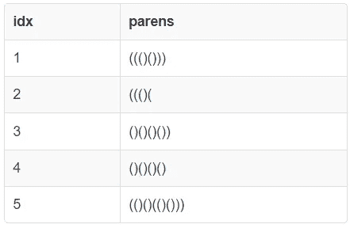
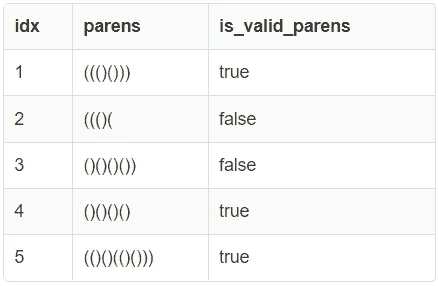

# 使用 SQL 验证平衡括号

> 原文：[`towardsdatascience.com/validate-balanced-parenthesis-using-sql-5bb79732d772?source=collection_archive---------22-----------------------#2023-01-04`](https://towardsdatascience.com/validate-balanced-parenthesis-using-sql-5bb79732d772?source=collection_archive---------22-----------------------#2023-01-04)

## 使用 SQL 检查一个包含开括号和闭括号的字符串的格式是否正确

[](https://medium.com/@dhruvbird?source=post_page-----5bb79732d772--------------------------------)[](https://towardsdatascience.com/?source=post_page-----5bb79732d772--------------------------------) [Dhruv Matani](https://medium.com/@dhruvbird?source=post_page-----5bb79732d772--------------------------------)

·

[关注](https://medium.com/m/signin?actionUrl=https%3A%2F%2Fmedium.com%2F_%2Fsubscribe%2Fuser%2F63f5d5495279&operation=register&redirect=https%3A%2F%2Ftowardsdatascience.com%2Fvalidate-balanced-parenthesis-using-sql-5bb79732d772&user=Dhruv+Matani&userId=63f5d5495279&source=post_page-63f5d5495279----5bb79732d772---------------------post_header-----------) 发表在 [Towards Data Science](https://towardsdatascience.com/?source=post_page-----5bb79732d772--------------------------------) ·5 分钟阅读·2023 年 1 月 4 日[](https://medium.com/m/signin?actionUrl=https%3A%2F%2Fmedium.com%2F_%2Fvote%2Ftowards-data-science%2F5bb79732d772&operation=register&redirect=https%3A%2F%2Ftowardsdatascience.com%2Fvalidate-balanced-parenthesis-using-sql-5bb79732d772&user=Dhruv+Matani&userId=63f5d5495279&source=-----5bb79732d772---------------------clap_footer-----------)

--

[](https://medium.com/m/signin?actionUrl=https%3A%2F%2Fmedium.com%2F_%2Fbookmark%2Fp%2F5bb79732d772&operation=register&redirect=https%3A%2F%2Ftowardsdatascience.com%2Fvalidate-balanced-parenthesis-using-sql-5bb79732d772&source=-----5bb79732d772---------------------bookmark_footer-----------)

验证一个字符串是否包含平衡的括号是一个实际问题，来源于各种实际场景中的字符串/表达式解析/验证。本文将探讨如何仅使用声明式 SQL 来验证一个只包含开括号‘(’和闭括号‘)’的字符串。


照片由 [Elena Mozhvilo](https://unsplash.com/@miracleday?utm_source=medium&utm_medium=referral) 提供，来源于 [Unsplash](https://unsplash.com/?utm_source=medium&utm_medium=referral)

之前的文章: [SQL 中数组的最长递增子序列](https://medium.com/@dhruvbird/longest-increasing-subsequence-of-an-array-in-sql-3202888c637f)

# 问题陈述

给定一个只包含开括号和闭括号的字符串，你能确定这些括号是否是平衡的吗？平衡的意思是：

1.  每个开括号 ‘(’ 后面必须有一个匹配的闭括号 ‘)’。

1.  一个闭括号 ‘)’ 总是与一个出现在它之前的开括号 ‘(’ 配对。

以下是**有效**的平衡括号字符串示例：

1.  ((()()))

1.  ()()()()

1.  (()()(()()))

以下是**无效**的平衡括号示例：

1.  ((()( — 这里，第一个和最后一个开括号没有匹配的闭括号

1.  ()()()()) — 这里，最后一个闭括号没有匹配任何其他未匹配的开括号

# 问题陈述的在线覆盖

1.  [Bradfield CS](https://bradfieldcs.com/algos/stacks/balanced-parentheses/)

1.  [Leetcode](https://leetcode.com/problems/valid-parentheses/)

1.  [Geeksforgeeks](https://www.geeksforgeeks.org/check-for-balanced-parentheses-in-an-expression/)

# 输入表模式

输入表有 2 列：

1.  **idx**：问题索引。即第一个待检查的字符串将有 idx = 1，第二个待检查的字符串将有 idx = 2，依此类推。

1.  **括号**：一个只包含开括号和闭括号的字符串。这个字符串需要检查是否结构正确。

```py
CREATE TABLE inputs(idx SERIAL PRIMARY KEY, parens TEXT NOT NULL);

INSERT INTO inputs(parens) VALUES
('((()()))'), ('((()('), ('()()()())'), ('()()()()'), ('(()()(()()))');

SELECT * FROM inputs;
```



平衡括号问题的输入表（作者提供的图片）

# 解决方案：维护一个运行计数器：O(n)

在命令式编程语言中，这个问题通常通过维护一个栈来解决，每当在输入字符串中遇到一个 ‘(’ 时，就将其压入栈中。因此，栈中只包含 ‘(’ 字符。每当在输入中看到 ‘)’ 时，就将其与栈顶的 ‘(’ 匹配，并将 ‘)’ 字符弹出。

由于我们**只有一种类型的开括号（和闭括号）**，我们可以去除栈，**只维护一个计数器**，用于计数到目前为止看到的未匹配的 ‘(’ 字符。每当遇到一个 ‘(’ 字符时，我们就增加计数器，每当遇到一个 ‘)’ 字符时，我们就减少计数器。

1.  **负计数器值**：如果计数器的值达到负值 (< 0)，则表示有未匹配的闭括号。

1.  **最终计数器值**：在处理完输入字符串中的所有字符后，如果计数器的值 != 0，则表示有问题。正值表示输入中有未匹配的 ‘(’ 字符，而负值已经在上面考虑过。

这个解决方案的 SQL 代码如下：

```py
WITH as_split AS (
  -- First split each input string such that every character is on its
  -- own row. We ensure that we tag each input row with the original
  -- index of the input string from which it came so that we know which
  -- problem it is a part of.
  SELECT
    idx,
    UNNEST(
      STRING_TO_ARRAY(
        parens, NULL
      )
    ) AS ch
  FROM inputs
),

with_annotation AS (
  -- Annotate characters from each problem (unique index) with its
  -- position using ROW_NUMBER(). Also annotate an open paren with
  -- +1 and a close paren with a -1 number, so that we can maintain
  -- a running sum of these counters later.
  SELECT
    idx,
    ch,
    ROW_NUMBER() OVER(PARTITION BY idx) AS row_num,
    CASE WHEN ch = '(' THEN +1 ELSE -1 END AS ctr
  FROM as_split
),

with_running_sum AS (
  -- Find the running sum for characters in each problem. Note that we are
  -- solving all the problems at once (think "batch API") instead of feeding
  -- feeding each problem once into the solution machine.
  SELECT
    idx,
    ch,
    ctr,
    row_num,
    SUM(ctr) OVER(PARTITION BY idx ORDER BY row_num ASC) AS running_sum,
    MAX(row_num) OVER(PARTITION BY idx) AS max_row_num
  FROM with_annotation
),

with_result AS (
  -- The result is valid only if we never hit a negative running sum
  -- (which indicates that we have an extra close paren than a corresponding
  -- open paren) and if we end with a running sum of 0\. If we end with a
  -- running sum > 0 then we have an additional open paren that is not
  -- matched with a corresponding close paren.
  SELECT
    idx,
    CASE WHEN MIN(running_sum) < 0 THEN TRUE ELSE FALSE END AS has_negative,
    CASE WHEN SUM(
      CASE WHEN row_num = max_row_num THEN running_sum ELSE 0 END
    ) = 0 THEN TRUE ELSE FALSE END AS ends_with_zero_sum
  FROM with_running_sum
  GROUP BY 1
)

SELECT
  lhs.idx,
  rhs.parens,
  CASE
    WHEN has_negative OR NOT ends_with_zero_sum THEN FALSE
    ELSE TRUE END
  AS is_valid_parens
FROM with_result lhs INNER JOIN inputs rhs
ON lhs.idx = rhs.idx
ORDER BY lhs.idx ASC;
```

在上述解决方案中，使用了相当多的中间表来帮助可读性，并将各种处理步骤分开。

这是我们第一次在 SQL 中使用[UNNEST](https://www.postgresql.org/docs/9.2/functions-array.html)关键字。这也是我第一次编写一个批量处理多个输入并一次性解决的解决方案。我利用了**idx**字段，它表示输入字符串的索引。所有中间表都使用**idx**字段来分离不同问题的解决方案。



O(n)解决方案的结果（作者提供的图片）

**估计成本：** 在一个具有 5 个不同输入行的表上，该查询的估计成本为[45k](https://explain.depesz.com/s/mN2y)。这个成本大部分似乎来自于使用窗口聚合函数。

虽然我标记了运行时间为**O(n)**，但这取决于数据库引擎如何内部执行查询。例如，如果引擎发现使用**ROW_NUMBER()**分配的**row_num**列结果具有该列值严格递增，并且数据库能够在 CTE 表中保持这一行顺序，那么它可以避免在遇到**ORDER BY**子句时在窗口函数执行中进行排序。

```py
SUM(ctr) OVER(PARTITION BY idx ORDER BY row_num ASC) AS running_sum,
```

上述**ORDER BY**在**OVER()**子句中是至关重要的，以确保我们得到的是一个运行总和，而不是整个分区的总体总和。

# SQL Fiddle

这篇文章中 SQL Fiddle 解决方案的链接可以在[这里](http://sqlfiddle.com/#!17/e83e88/20)找到。

# 扩展和练习

1.  如果我们有多种括号类型，比如方括号[]，花括号{}。你会如何演变解决方案来适应这一变化？

1.  如果组成开括号和闭括号对的字符串不是固定的，而是在另一个维度表中指定的，你会如何演变解决方案来适应这一变化？

我们将看到（在后续文章中）这些扩展如何解决 SQL 从业者遇到的实际问题。
