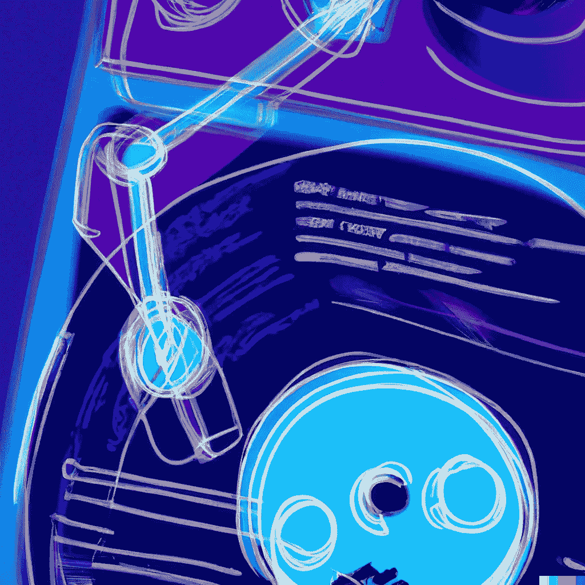
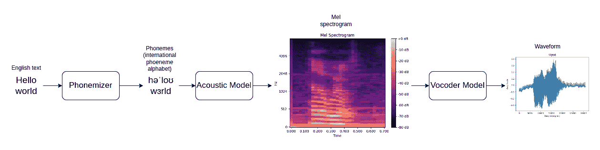
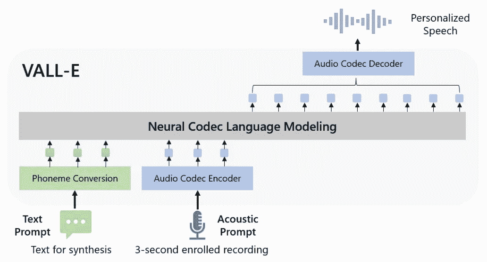
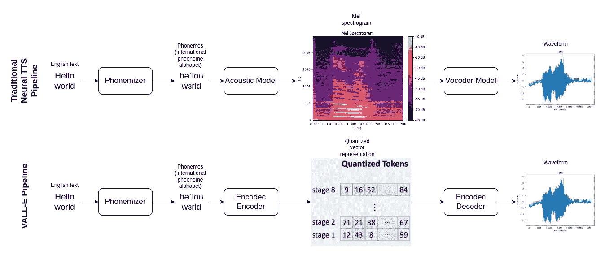
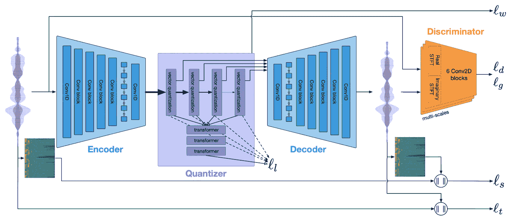
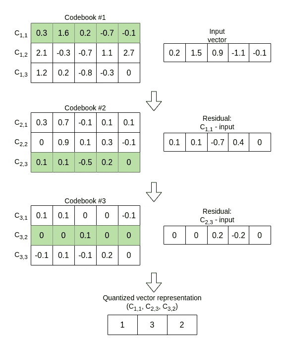
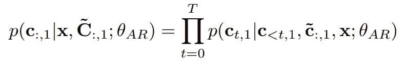
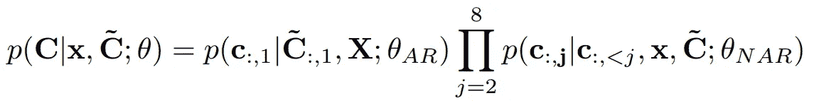
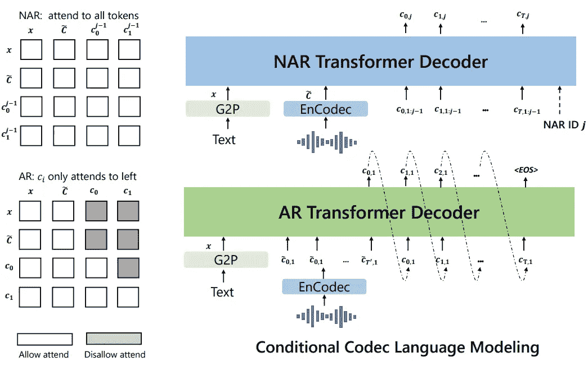

# VALL-E — 语音合成的未来？

> 原文：[`towardsdatascience.com/vall-e-the-future-of-text-to-speech-d090b6ede07b?source=collection_archive---------4-----------------------#2023-04-14`](https://towardsdatascience.com/vall-e-the-future-of-text-to-speech-d090b6ede07b?source=collection_archive---------4-----------------------#2023-04-14)

## 微软研究院新文本到语音模型的论文解析

[](https://medium.com/@erap129?source=post_page-----d090b6ede07b--------------------------------)[](https://towardsdatascience.com/?source=post_page-----d090b6ede07b--------------------------------) [Elad Rapaport](https://medium.com/@erap129?source=post_page-----d090b6ede07b--------------------------------)

·

[关注](https://medium.com/m/signin?actionUrl=https%3A%2F%2Fmedium.com%2F_%2Fsubscribe%2Fuser%2Fd2d1ff8f0490&operation=register&redirect=https%3A%2F%2Ftowardsdatascience.com%2Fvall-e-the-future-of-text-to-speech-d090b6ede07b&user=Elad+Rapaport&userId=d2d1ff8f0490&source=post_page-d2d1ff8f0490----d090b6ede07b---------------------post_header-----------) 发表在 [Towards Data Science](https://towardsdatascience.com/?source=post_page-----d090b6ede07b--------------------------------) ·15 min read·2023 年 4 月 14 日[](https://medium.com/m/signin?actionUrl=https%3A%2F%2Fmedium.com%2F_%2Fvote%2Ftowards-data-science%2Fd090b6ede07b&operation=register&redirect=https%3A%2F%2Ftowardsdatascience.com%2Fvall-e-the-future-of-text-to-speech-d090b6ede07b&user=Elad+Rapaport&userId=d2d1ff8f0490&source=-----d090b6ede07b---------------------clap_footer-----------)

--

[](https://medium.com/m/signin?actionUrl=https%3A%2F%2Fmedium.com%2F_%2Fbookmark%2Fp%2Fd090b6ede07b&operation=register&redirect=https%3A%2F%2Ftowardsdatascience.com%2Fvall-e-the-future-of-text-to-speech-d090b6ede07b&source=-----d090b6ede07b---------------------bookmark_footer-----------)

DALL-E 2：一个接收文本输入的一侧，另一侧输出声波的唱片机。数字艺术。

大家好，

在本文中，我们将深入探讨微软研究院开发的一种新兴的文本到语音模型，名为 VALL-E。介绍这项工作的论文已于 2023 年 1 月 5 日发布，从那时起，它在网上获得了广泛关注。值得注意的是，撰写本文时，没有发布预训练模型，目前唯一的选择是自行训练该模型。

尽管本文提出的想法新颖有趣，值得深入探讨，不管我是否能立即用它克隆我的声音。

本文将按以下结构组织：

+   第一部分 — 语音合成介绍，基本概念

+   第二部分 — VALL-E: 作为语言模型的语音合成

+   第三部分 — Encodec: VALL-E 背后的工作马

+   第四部分 — VALL-E 的问题定义与训练

+   第五部分 — 一些编码

+   第六部分 — 结论与未来展望

# 第一部分 — 语音合成介绍，基本概念

语音合成技术并不新鲜，自 1939 年贝尔实验室推出的第一个电子语音合成器“Voder”以来，这项技术就已经存在，并且当时需要手动操作。此后，该领域取得了令人难以置信的发展，直到 2017 年左右，主流技术仍是连接语音合成。这项技术基于连接预录制的语音片段以生成可理解的语音。尽管这种技术可以产生逼真的效果，但其缺点显而易见——它无法生成预录数据库中不存在的新声音，也无法生成不同语调或情感的语音。

快进到深度学习时代。如今，语音合成的主流策略总结在图 1 中。让我们来看看它的不同部分。



图 1\. 一个模型神经语音合成流程图。作者提供的图像。

+   首先，我们有一个音素化器，将文本转化为音素。音素是词语发音的文本表示（例如——“tomato”这个词在美式和英式口音中有不同的音素），这种表示帮助下游模型获得更好的结果。

+   之后，我们会有一个声学模型将这些音素转化为梅尔频谱图，这是一种在时间-频率域中表示音频的方式。频谱图是通过对原始音频波形的重叠时间窗口应用短时傅里叶变换（STFT）获得的（这里是一个关于梅尔频谱图的出色解释——[`medium.com/analytics-vidhya/understanding-the-mel-spectrogram-fca2afa2ce53`](https://medium.com/analytics-vidhya/understanding-the-mel-spectrogram-fca2afa2ce53)）。当然，在这种情况下，频谱图是由统计模型创建的，因为实时语音合成中不存在输入音频。最近的模型架构示例包括 Tacotron2、DeepVoice 3 和 TransformerTTS。

+   最终阶段是将 Mel 频谱图转换为波形。波形通常以 24/48 kHz 的采样率进行采样，每个样本被数字化为 16 位数值。这些数字表示每时刻的气压量，即我们最终听到的声音。为什么我们不能简单地将频谱图确定性地转换为波形？因为这需要在时间域上进行大量的上采样，这需要创建频谱图中不存在的信息，同时频谱图不包含相位信息（只有频率）。因此，就像将音素转换为 Mel 频谱图一样，在这里我们也需要一个统计模型来将频谱图转换为波形，这些模型称为 Vocoders。Vocoders 的例子包括 WaveNet、WaveRNN 和 MelGAN。

此外，还有最近的模型如 VITS 和 YourTTS，它们使用端到端模型从文本输入生成波形。另一个这样的端到端系统的例子是 Deepmind 的一篇论文《End-to-End Adversarial Text-to-Speech》（Yannic Kilcher 在此处进行了极好的解释 — [`www.youtube.com/watch?v=WTB2p4bqtXU`](https://www.youtube.com/watch?v=WTB2p4bqtXU)）。在这篇论文中，他们采用了类似 GAN 的训练过程来生成真实的语音声波。他们还需要解决对齐问题，即生成样本中的单词发音与真实样本中的单词发音在时间上对齐的程度。这个问题不会“自动解决”，需要在模型架构中进行明确处理。

这些端到端 TTS 模型的主要缺点是其极其复杂性。文本和语音是如此不同的模态，这要求复杂的模型显式地解决对齐、说话者身份和语言等问题，使得这些模型高度复杂。VALL-E 的魅力在于，它将生成语言模型的相对简单性巧妙地应用于语音生成领域。对于像我这样刚接触 TTS 和语音领域，并且有一定 NLP 经验的人来说，它提供了一个很好的切入点。

这简短的概述无法充分体现 TTS（文本转语音）这一广阔领域的深度，研究和理解它可能需要一生的时间（我鼓励你深入探讨）。然而，我们今天要讨论的是 VALL-E，所以请允许我直接切入主题。

# 第二部分 — VALL-E: 语言模型的文本转语音

与其他文本到语音系统一样，VALL-E 的输入是音素化的文本，输出是相应的声音波形。此外，VALL-E 采用了提示机制，其中 3 秒的音频样本作为额外输入提供给模型。这允许生成与给定音频提示条件相关的输入文本的语音发声——实际上，这意味着能够进行零-shot 语音生成，即从训练数据中未见过的声音生成语音。VALL-E 的高层结构见图 2。



图 2\. VALL-E 的高层结构。图片来自原始论文[1]。

让我们理解一下这个管道中的过程。首先，我们对文本进行音素转换，这是一种标准程序，我们已经了解过，不需要任何学习机制。为了让模型处理这些音素，我们有一个音素嵌入层，该层将音素词汇表中的索引向量作为输入，并输出对应于输入索引的嵌入矩阵。

3 秒的音频提示（输出语音的条件）被送入音频编解码器编码器。在 VALL-E 中，他们使用了一个预训练的音频编码器——Encodec（由 Facebook Research 开发——[`arxiv.org/abs/2210.13438`](https://arxiv.org/abs/2210.13438)）。Encodec 以语音波形为输入，通过递归向量量化（RVQ）和编码-解码神经架构输出其压缩的离散表示。我们将在本文的第三部分深入探讨 Encodec，但现在可以假设它通过将音频信号分割成固定时间窗口并为每个窗口分配来自已知音频嵌入词汇表的表示，从而输出音频信号的离散表示（概念上，与词嵌入非常相似）。

一旦模型接收到这两个输入，它就可以像自回归语言模型一样输出下一个离散音频表示。由于音频表示来自 Encodec 学习的固定词汇表，我们可以简单地将其视为从固定词汇表中预测下一个单词（在我们的例子中是声音表示）。在这些声音表示被预测之后，它们通过 Encodec 模型的解码器部分被转换回原始的波形表示。

在图 3 中，我们将 VALL-E 的管道与传统的神经 TTS 管道进行比较。我们看到主要的区别在于音频的中间表示。在 VALL-E 中，他们放弃了 Mel 谱图，使用了由 Encodec 模型创建的表示。然而值得注意的是，Encodec 在底层也使用了谱图表示，因此它在这个架构中仍然有所使用，尽管不那么显著。



图 3\. VALL-E 流水线与传统神经 TTS 流水线的对比。图片由作者提供。

在 VALL-E 论文的结果部分，他们展示了在 LibriSpeech 数据集上超越了之前的最先进的零样本 TTS 模型 YourTTS，在几个指标上，包括基于人类的评估（如相似性均值选项评分（SMOS））和基于算法的评估（如词错误率（WER））。在一个有趣的消融研究中，他们表明，音素提示有助于生成内容（通过降低 WER），而音频提示有助于说话人相似性（通过提高说话人相似性指标）。

我们现在将深入探讨 Encodec 模型，该模型负责将音频转换为离散标记并再转换回来，并且是本文中使用语言模型方法进行音频生成的基础。

# 第三部分 — Encodec：VALL-E 背后的主力

在图 4 中，我们可以看到 Encodec 架构。它是一个编码器-解码器架构，通过重建任务学习音频信号的压缩表示。让我们详细了解其不同部分，以理解其内部运作。



图 4\. Encodec 架构。图片取自原始论文 [2]。

在最左侧，我们有原始波形，其采样频率为 24/48 kHz，每个样本由 16 位（65536 选项）表示。原始信号传递给编码器，编码器包括用于下采样的 1D 卷积操作和用于序列建模的两层 LSTM。编码器的输出是 75/150 潜在时间步（与原始的 24/48K 比较！），深度维度为 128。

解码器仅仅是编码器的镜像版本，使用转置卷积来对潜在空间进行上采样并构建音频波形（这是对转置卷积的一个很好的解释 `towardsdatascience.com/what-is-transposed-convolutional-layer-40e5e6e31c11`）。

有趣的部分当然是量化器。Encodec 如何对声音的连续域进行量化？使用一种叫做残差向量量化（RVQ）的技术，该技术包括将输入向量投影到给定大小代码本中的最近条目。让我们详细解析这句话。首先，什么是代码本？

对于 VALL-E 的情况，代码本是一个大小为 1024 的向量字典，其中每个条目表示一个大小为 128 的向量。我们在向量量化中的目标是将某个向量映射到代码本中最接近的向量（例如通过欧几里得距离），之后可以通过该向量在代码本中的索引来表示它（假设每个人都能访问代码本）。当然，这样我们会丢失大量的信息。如果代码本中的向量都不能准确地类似于我们的向量怎么办？这就是 RVQ 中的“残差”！

在图 5 中，我展示了如何使用残差向量量化对向量进行量化。在这个例子中，我们有 3 个代码本。输入向量与第一个代码本中的每一个向量进行比较，并分配给最接近的一个（C1,1）。然后，计算 C1,1 与输入之间的残差，我们尝试将残差匹配到下一个代码本，以此类推，直到我们遍历完所有的代码本。最终的 RVQ 表示是每个代码本中匹配的索引（在我们的例子中是 1、3、2）。这种编码方法非常高效。如果我们有 8 个代码本，每个包含 1024 个条目——我们可以用仅仅 1024*8=8192 个数字表示 1024⁸=1.2e+24 种不同的向量！当然，发送方和接收方必须持有相同的代码本，这种量化方法才能有效。如果你想深入了解 RVQ，比如代码本是如何训练的，我推荐阅读另一篇 Encodec 所基于的论文《SoundStream》——[`arxiv.org/abs/2107.03312`](https://arxiv.org/abs/2107.03312)（是的，这确实是一个深奥的领域）。



图 5\. 残差向量量化示例。图片由作者提供。

回到图 4 中的 Encodec 流程，我们来注意与其训练过程相关的 3 个额外细节：

1.  梅尔频谱图是从输入音频和生成音频中创建的。这些频谱图进行比较，比较信号用于作为损失来指导模型训练。

1.  使用了几个鉴别器来比较原始波形和合成波形的短时傅里叶变换（STFT）。这种 GAN 损失与梅尔频谱图比较给出的信号不同，并且对 Encodec 有用。

1.  量化器包含用于进一步压缩音频信号的变压器。这**不是**VALL-E 中预测下一个语音标记的变压器，尽管可能会造成混淆。要进一步理解 Encodec 中的变压器，我建议阅读 Aleksa Gordic 的论文或观看视频——[`www.youtube.com/watch?v=mV7bhf6b2Hs`](https://www.youtube.com/watch?v=mV7bhf6b2Hs)。

让我们总结一下我们目前所知道的。VALL-E 是一个文本到语音模型，其操作模式类似于语言模型，预测给定提示的下一个离散音频标记，该提示由音素化文本和音频输入组成。这些离散标记由另一个名为 Encodec 的模型学习（Encodec 本身基于 SoundStream），它使用编码器-解码器架构和残差向量量化将音频转换为离散代码。

# 第四部分——VALL-E 的问题表述和训练

VALL-E 包含两个变压器模型，用于处理输入数据（音素化文本和音频）——一个自回归（AR）变压器仅关注过去的数据，而一个非自回归（NAR）变压器关注所有时间点。让我们看看原因。

VALL-E 使用了八个不同的编码本作为 Encodec 模型的一部分，其中每个编码本包含 1024 个条目。第一个量化器（编码本）的编码由 AR 模型根据方程 1 进行处理。让我们首先澄清一些术语：

+   C 代表生成的输出 — 作为离散音频编码

+   C~ 是 3 秒的输入声学提示

+   x 是作为音素序列的输入文本

+   C:,₁ 代表来自第一个量化器/编码本的数据

因此，方程 1 显示，第一个量化器的输出基于输入数据以及第一个量化器的前时间步的输出（就像自回归语言模型一样）。



方程 1。自回归模型 — 应用于第一个量化器。图片来源于原始论文 [1]。

在方程 2 中，我们可以看到量化器 2 到 8 的编码生成过程。与之前的情况不同，这里每个量化器的输出都基于前一个量化器的所有时间步（例如，在计算量化器 #7 的编码时，模型依赖于量化器 1 到 6 生成的数据）。与自回归模型不同，这种方式允许在单个量化器中并行生成所有时间步，因为它仅依赖于前一个量化器的编码，而不是当前量化器的前时间步。作者强调了这一点，因为在需要实时生成语音的文本转语音模型中，快速推理尤为重要。



方程 1。非自回归模型 — 应用于第二到第八个量化器。图片来源于原始论文 [1]。

方程 1 和 2 在图 6 中以视觉方式呈现，图中展示了 AR 和 NAR 模型，并突出了它们之间的区别。我们可以看到，自回归变换器仅用于预测 C:,₁，即第一个量化器的标记。在此过程中，它关注于之前生成的标记。NAR 变换器关注于之前的量化器，而不是之前的时间步（当前量化器的前标记在 NAR 模型中不可用）。



图 6。VALL-E 中的自回归（AR）和非自回归（NAR）模型。图片来源于原始论文 [1]。

VALL-E 已经在 LibriLight 数据集上的 60K 小时音频中进行了训练，数据集包含 7000 个不同的说话者（比之前的最先进技术多出 100 倍以上的数据）。该数据集仅包含音频，因此用于标记的自动语音识别模型被使用。Encodec 模型作为预训练模型使用，VALL-E 并未对其进行微调。

在训练中，从 LibriLight 中随机抽取了 10-20 秒的样本。对于声学提示，从相同的语句中提取了另外 3 秒。他们使用了 16 个 Tesla V-100 GPU 来训练模型，相较于大型最先进语言模型，这一配置相当简朴！

我们了解了流程和数据，现在让我们尝试在 GitHub 中使用非官方的 Pytorch 实现的 VALL-E。

# 第五部分 — 一些编码

VALL-E 在 GitHub 上没有官方实现，因此在我的实验中，我将依赖于已发布的非官方版本 — [`github.com/enhuiz/vall-e`](https://github.com/enhuiz/vall-e)。此外，还没有发布模型检查点，因此你必须从头开始训练。

还有一个 Google Colab 笔记本可供参考一个简单的训练示例 — [`colab.research.google.com/drive/1wEze0kQ0gt9B3bQmmbtbSXCoCTpq5vg-?usp=sharing`](https://colab.research.google.com/drive/1wEze0kQ0gt9B3bQmmbtbSXCoCTpq5vg-?usp=sharing)。在这个例子中，他们在一个“hello world”的单句上过拟合了模型，并展示了模型能够重现这个单句。我对两件事感兴趣：

1.  我想用自己的声音复制他们的“hello world”实验，只是为了确认流水线正常工作

1.  我想复制 James Skelton 在 Paperspace 上做的实验 — [`blog.paperspace.com/training-vall-e-from-scratch-on-your-own-voice-samples/`](https://blog.paperspace.com/training-vall-e-from-scratch-on-your-own-voice-samples/)，他在自己的少量录音上训练了一个模型，并成功用它复制了他的声音（在他已经录制的东西上）

为什么要进行有限的实验？因为从头开始训练这个模型需要很多资源，而我目前没有，另外我认为迟早会发布预训练模型。

那么我是怎么成功的呢？我设法复制了“hello world”的实验，但不幸的是，我没能复制 Paperspace 的实验 — 我只得到了一个产生混乱声音的模型，它模糊地提醒了我的声音。这可能是因为资源不足（我在 Google Colab 实例上进行训练，它在 12 小时后会超时）。但我仍然想和你一起讨论整个过程。我的 VALL-E 笔记本版本在这里 — [`colab.research.google.com/drive/1NNOsvfiOfGeV-BBgGkwf0pyGAwAgx3Gi#scrollTo=SbWtNBVg_Tfd`](https://colab.research.google.com/drive/1NNOsvfiOfGeV-BBgGkwf0pyGAwAgx3Gi#scrollTo=SbWtNBVg_Tfd)。

一旦在 Colab 笔记本中运行以下行 —

```py
!git clone --recurse-submodules https://github.com/enhuiz/vall-e.git
```

你会在文件浏览器中看到一个名为`vall-e`的目录。路径`content/vall-e/data/test`包含了“hello world”实验的数据。请注意，它包含两个文件，因为只有一个文件会出问题。要复制这个实验，只需使用`!rm content/vall-e/data/test/*`删除数据目录中的文件，录制自己说“Hello world”，并将其保存为两个带有不同名称的.wav 文件。将.wav 文件放入包含两个文本文件（文本文件的名称应与带有`.normalized.txt`后缀的.wav 文件相同）的数据目录中。

接着，你将运行这两个单元格：

```py
!python -m vall_e.emb.qnt data/test
```

```py
!python -m vall_e.emb.g2p data/test
```

第一个单元将对你自己的数据运行 Encodec 模型并进行量化，就像我们之前讨论的那样。第二个单元将把文本“hello world”转换为音素。

之后，处理过的数据已经准备好，你可以运行执行训练过程的单元。NAR 和 AR 模型有独立的训练（记住，如前所述，NAR 模型训练依赖于 AR 模型，但 AR 模型仅使用和生成第一个量化器数据，因此与 NAR 模型独立）。

```py
!python -m vall_e.train yaml=config/test/ar.yml
```

```py
!python -m vall_e.train yaml=config/test/nar.yml
```

模型训练完成后，你将运行此单元：

```py
!mkdir -p zoo
!python -m vall_e.export zoo/ar.pt yaml=config/test/ar.yml
!python -m vall_e.export zoo/nar.pt yaml=config/test/nar.yml
```

这将最新的模型检查点（已自动创建）保存到名为`zoo`的目录中。

最终，你将使用以下内容进行模型推理：

```py
!python -m vall_e 'hello world' /content/vall-e/data/test/hello_world.wav toy.wav --ar-ckpt zoo/ar.pt --nar-ckpt zoo/nar.pt
```

这将使用文本提示“Hello world”以及相同的语音提示来运行模型。它将生成的样本保存为`toy.wav`，然后你可以使用以下内容来收听：

```py
from IPython.display import Audio
Audio('toy.wav')
```

就这样！你创建了自己的 VALL-E“Hello world”。除非你拥有大量计算资源，否则最好等待一个预训练的模型，以进一步使用这个模型。

# 第六部分 — 结论与未来展望

在这篇文章中，我们了解了 VALL-E，这是一种由微软研究院开发的新型文本到语音架构。VALL-E 以类似语言模型的方式生成音频，这使其与最近的先进方法有所区别，后者通常是端到端的或遵循文本->谱图->波形创建流程。

我们还讨论了 Encodec 模型，它执行音频量化，并在 VALL-E 的训练中用作预训练模型。Encodec 本身很吸引人，能够使用残差向量量化创建超压缩的音频表示。VALL-E 的创建者利用了这一特性，并在此量化之上构建了一个生成的“语言”模型。

最终，我们看到了一些代码，并用自己的声音重复了来自非官方代码的“hello world”实验。该论文的官方代码尚未发布，模型检查点也未发布。看到和使用一个预训练的 VALL-E 模型会很有趣，我相信它迟早会出现。不过，这次是一次有趣的学习旅程。

下次见！

Elad

# 参考文献

[1] [`arxiv.org/abs/2301.02111`](https://arxiv.org/abs/2301.02111) — VALL-E 论文（神经编解码语言模型是零-shot 文本到语音合成器）

[2] [`arxiv.org/abs/2301.02111`](https://arxiv.org/abs/2301.02111) — Encodec 论文（高保真神经音频压缩）

[3] [`wiki.aalto.fi/display/ITSP/Concatenative+speech+synthesis`](https://wiki.aalto.fi/display/ITSP/Concatenative+speech+synthesis) — 拼接语音合成的解释

[4] [`www.youtube.com/watch?v=aLBedWj-5CQ&t=1s`](https://www.youtube.com/watch?v=aLBedWj-5CQ&t=1s) — 深入了解语音合成的聚会（HuggingFace）

[5] [`www.youtube.com/watch?v=MA8PCvmr8B0`](https://www.youtube.com/watch?v=MA8PCvmr8B0) — 推动神经文本到语音的前沿（微软研究院）

[6] [`www.youtube.com/watch?v=G9k-2mYl6Vo&t=5593s`](https://www.youtube.com/watch?v=G9k-2mYl6Vo&t=5593s) — John Tan Chong Min 关于 VALL-E 的优秀视频

[7] [`www.youtube.com/watch?v=mV7bhf6b2Hs`](https://www.youtube.com/watch?v=mV7bhf6b2Hs) — Aleksa Gordic 关于 Encodec 的优秀视频
