# 深度学习中的梯度爆炸与消失问题

> 原文：[`towardsdatascience.com/vanishing-exploding-gradient-problem-neural-networks-101-c8f48ec6a80b`](https://towardsdatascience.com/vanishing-exploding-gradient-problem-neural-networks-101-c8f48ec6a80b)

## 如何确保你的神经网络不会“死掉”或“爆炸”

[](https://medium.com/@egorhowell?source=post_page-----c8f48ec6a80b--------------------------------)[](https://towardsdatascience.com/?source=post_page-----c8f48ec6a80b--------------------------------) [Egor Howell](https://medium.com/@egorhowell?source=post_page-----c8f48ec6a80b--------------------------------)

·发布于 [Towards Data Science](https://towardsdatascience.com/?source=post_page-----c8f48ec6a80b--------------------------------) ·阅读时间 9 分钟·2023 年 12 月 8 日

--

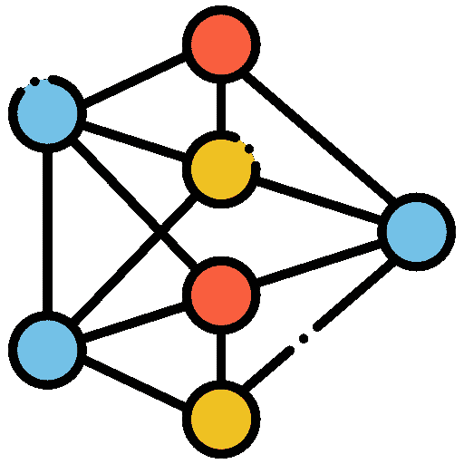

[`www.flaticon.com/free-icons/neural-network`](https://www.flaticon.com/free-icons/neural-network)。标题=”神经网络图标。” 神经网络图标由 Paul J. 创建 — Flaticon。

# 什么是梯度消失与梯度爆炸？

在我之前的一篇文章中，我们解释了神经网络如何通过反向传播算法进行学习。主要思路是我们从输出层开始，将误差“传播”到输入层，在这个过程中根据损失函数更新权重。如果你对此不熟悉，我强烈建议你查看那篇文章：

[](/forward-pass-backpropagation-neural-networks-101-3a75996ada3b?source=post_page-----c8f48ec6a80b--------------------------------) ## 前向传播与反向传播：神经网络 101

### 解释神经网络如何通过手动和使用 PyTorch 的代码“训练”和“学习”数据中的模式

[towardsdatascience.com

权重通过其相对于损失函数的偏导数进行更新。问题在于，当我们接近网络的下层时，这些梯度变得越来越小。这导致下层的权重在训练网络时几乎没有变化。这被称为*梯度消失问题*。

相反，梯度也可能在各层中持续增大。这就是*梯度爆炸问题*，它主要是[***递归神经网络***](https://en.wikipedia.org/wiki/Recurrent_neural_network)中的一个问题。

然而，2010 年由[***Xavier Glorot***](https://www.linkedin.com/in/xglorot/?originalSubdomain=ca)和[***Yoshua Bengio***](https://en.wikipedia.org/wiki/Yoshua_Bengio)发布的[***论文***](https://proceedings.mlr.press/v9/glorot10a/glorot10a.pdf)诊断了导致梯度出现问题的几个原因。主要的罪魁祸首是***sigmoid 激活函数***和权重的初始化方式（通常来自标准正态分布）。这种组合导致了层间方差的变化，直到它们在 sigmoid 函数的极端边缘*饱和*。

以下是 sigmoid 函数的数学方程和图示。请注意，在其极端情况下，梯度变为零。因此，在这些饱和点没有“学习”发生。

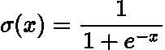

Sigmoid 函数。方程由作者使用 LaTeX 编写。

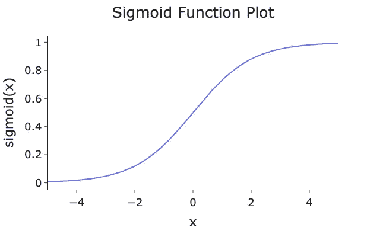

Sigmoid 函数。由作者在 Python 中生成的图示。

我们现在将介绍一些可以减少训练过程中梯度消失或爆炸的技术。

> 如果你想了解更多关于激活函数及其优缺点的信息，请查看我之前的帖子：

[](/activation-functions-non-linearity-neural-networks-101-ab0036a2e701?source=post_page-----c8f48ec6a80b--------------------------------) ## 激活函数与非线性：神经网络 101

### 解释神经网络为何能学习（几乎）任何和一切

towardsdatascience.com

# Glorot/Xavier 初始化

幸运的是，论文的作者提出了中和上述问题的方法。他们建议了一种新的权重初始化方法，命名为 Glorot 初始化，以作者命名，确保层间的方差保持不变。

上述论文中包含了完整的数学细节，但他们提出的初始化策略是：

**正态分布**

对于正态分布***X ~ N(0, 𝜎²)***，权重将如下初始化：

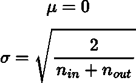

Glorot 正态分布初始化的均值和方差。方程由作者使用 LaTeX 编写。

如果***n_in*** ***=*** ***n_out***，则我们有[***LeCun 初始化***](https://wandb.ai/sauravmaheshkar/initialization/reports/A-Gentle-Introduction-To-Weight-Initialization-for-Neural-Networks--Vmlldzo2ODExMTg)以计算机科学家[***Yann LeCun***](https://en.wikipedia.org/wiki/Yann_LeCun)命名。这个初始化方法是在 Glorot 的论文发表前十年，即 1990 年代提出的。

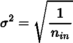

LeCun 初始化。方程由作者使用 LaTeX 编写。

**均匀分布**

对于均匀分布***X ~ U(-a, a)***：

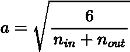

Glorot 均匀分布初始化的均值和方差。方程由作者在 LaTeX 中编写。

使用这些初始化设置我们的神经网络可以更快地收敛，因为在训练开始时权重不会过小或过大。

以上表达式仅适用于 sigmoid 和[***tanh***](https://medium.com/towards-data-science/activation-functions-non-linearity-neural-networks-101-ab0036a2e701)激活函数。例如，对于***ReLU***（修正线性单元）激活函数，正常分布方差需要使用***1/n_in***进行初始化。

有兴趣的读者可以在***这里***找到完整的激活函数及其对应的初始化列表。

# 更好的激活函数

## ReLU

对于大多数行业标准的神经网络，sigmoid 激活函数已被大量弃用，取而代之的是 ReLU，因为它对大正值不会饱和（它也更具计算效率）：

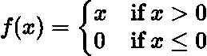

ReLU 函数。方程由作者在 LaTeX 中编写。

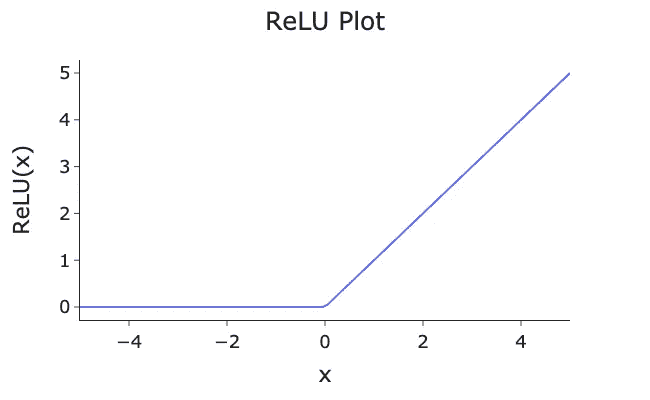

ReLU 激活函数。图由作者在 Python 中生成。

然而，ReLU 并不完美，且受到[***dying ReLU 问题***](https://datascience.stackexchange.com/questions/5706/what-is-the-dying-relu-problem-in-neural-networks)的影响***。*** 这是指神经元开始“死亡”，因为它们只输出零，因为它们的输入加权和总是负的。这导致零梯度，从而网络停止“学习”任何东西。这对较大的学习率特别糟糕。

ReLU 可以很容易地在[***PyTorch***](https://pytorch.org/)中应用，如下所示：

```py
import torch
import torch.nn as nn
from torch.nn.functional import relu

class Model(nn.Module):
    def __init__(self):
        super(SimpleNet, self).__init__()
        self.input_layer = nn.Linear(in_features=10, out_features=20) 
        self.output_layer = nn.Linear(in_features=20, out_features=1) 

    def forward(self, x):
        x = relu(self.input_layer(x))
        x = self.output_layer(x)
        return x
```

## Leaky ReLU

你可以通过使用经典 ReLU 函数的变体来解决这个问题，例如[***‘Leaky’ ReLU***](https://www.educative.io/answers/what-is-leaky_relu#)，其中负输入不是零，而是具有一些浅坡度的梯度***α***：

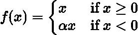

Leaky ReLU 函数。方程由作者在 LaTeX 中编写。

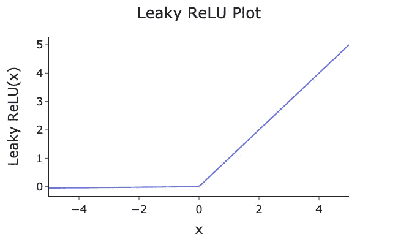

Leaky ReLU，注意负 x 值的小梯度。图由作者在 Python 中生成。

Leaky ReLU 通常[超越](https://ai.stackexchange.com/questions/40576/why-use-relu-over-leaky-relu)经典 ReLU，因为它减少了这种“死亡神经元”问题的可能性，从而实现更稳健的学习。通常发现更大的“泄漏”更好，但要适度。

还有其他变体也常常改善基本 ReLU 的性能：

+   [**随机 Leaky ReLU (RReLU)**](https://paperswithcode.com/method/rrelu)：在训练过程中，超参数***α***被随机初始化。

+   [**参数化 Leaky ReLU (PReLU):**](https://www.educative.io/answers/what-is-parametric-relu) 在训练过程中超参数 ***α*** 会被学习。

你可以在 PyTorch 中应用 Leaky ReLU，如下所示：

```py
import torch
import torch.nn as nn

class Model(nn.Module):
    def __init__(self):
        super(Model, self).__init__()
        self.input_layer = nn.Linear(in_features=10, out_features=20) 
        self.output_layer = nn.Linear(in_features=20, out_features=1) 

        self.leaky_relu = nn.LeakyReLU(negative_slope=0.1)

    def forward(self, x):
        x = self.leaky_relu(self.input_layer(x))
        x = self.output_layer(x)
        return x
```

## 指数线性单元

我们将考虑的最后一个激活函数是 [***指数线性单元***](https://paperswithcode.com/method/elu)（ELU）。

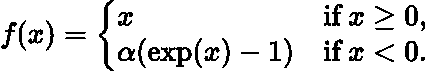

ELU 函数。作者使用 LaTeX 表示的方程。

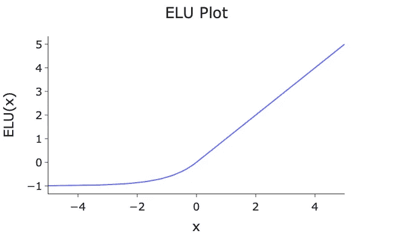

ELU，注意负值的指数值。图像由作者在 Python 中生成。

ELU 和 ReLU 之间的主要区别是：

+   *对于负值，ELU 函数不为零，因此缓解了普通 ReLU 的神经元死亡问题。*

+   *它的梯度对于负输入是非零的。*

+   *由于指数计算，ELU 的计算速度比 ReLU 及其变体要慢。*

+   *ELU 通常比 ReLU 性能更好*

PyTorch 中的 ELU：

```py
import torch
import torch.nn as nn

class Model(nn.Module):
    def __init__(self):
        super(Model, self).__init__()
        self.input_layer = nn.Linear(in_features=10, out_features=20) 
        self.output_layer = nn.Linear(in_features=20, out_features=1) 

        self.elu = nn.ELU()

    def forward(self, x):
        x = self.elu(self.input_layer(x))
        x = self.output_layer(x)
        return x
```

## 选择哪个？

有这么多激活函数，很难知道选择哪个。一般规则是 ***ELU > Leaky ReLU > ReLU > tanh > sigmoid***。然而，计算速度可能会影响你的模型，所以你可能需要重新考虑选择哪个激活函数。最好考虑一下你的问题并尝试几种，看看哪个最适合。

用于生成这些激活函数图的代码可以在我的 GitHub 上找到：

[](https://github.com/egorhowell/Medium-Articles/blob/main/Data%20Science%20Basics/activation_functions.py?source=post_page-----c8f48ec6a80b--------------------------------) [## Medium-Articles/Data Science Basics/activation_functions.py at main · egorhowell/Medium-Articles

### 我在我的 Medium 博客/文章中使用的代码。通过创建一个账户为 egorhowell/Medium-Articles 开发做贡献……

github.com](https://github.com/egorhowell/Medium-Articles/blob/main/Data%20Science%20Basics/activation_functions.py?source=post_page-----c8f48ec6a80b--------------------------------)

# 批量归一化

使用 Glorot 初始化和 ReLU（及其变体）激活函数有助于减少算法开始时梯度消失/爆炸的可能性，但在训练过程中没有帮助。

防止训练过程中梯度消失/爆炸的一种方法是 [***批量归一化***](https://en.wikipedia.org/wiki/Batch_normalization#:~:text=Batch%20normalization%20%28also%20known%20as,%2Dcentering%20and%20re%2Dscaling.)（BN）。这个过程在激活函数应用之前或之后零中心化和重新归一化输出或输入。然后，它会对结果进行平移和缩放，使每一层都有自己“学习”的均值和方差。

这类似于我们在训练前对特征进行缩放和归一化的原因。它确保所有特征处于同一水平，并且较大值的特征不会淹没较小值的特征。批量归一化是在每一层的输出之后应用这一过程，因为它们是下一层的输入！

> 关于为什么我们需要归一化特征的详细解释在这里。

算法如下所示：

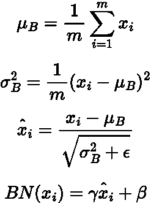

批量归一化算法。方程由作者在 LaTeX 中生成。

其中：

+   ***x_i*** 是批量归一化层的输入。

+   ***μ_B*** 是批次的均值。

+   ***σ²_B*** 是批次的方差。

+   ***ϵ*** 是为数值稳定性（避免除以零）添加的小常数。

+   ***γ*** 是在训练过程中学习的缩放参数。

+   ***β*** 是在训练过程中学习的偏移参数。

我们可以通过它使其更清晰。第一部分只是计算网络中每层输入或输出的均值和方差。这些输出随后使用均值和方差进行归一化。最后一部分是使用 ***γ*** 超参数进行缩放，使用 ***β*** 超参数进行偏移。这些超参数由网络学习，这使得 BN 如此强大。每一层都会有其自定义的变换！

另一件重要的事情是，在训练期间，BN 会跟踪[***指数移动平均***](https://en.wikipedia.org/wiki/Moving_average#:~:text=An%20exponential%20moving%20average%20%28EMA,decreases%20exponentially%2C%20never%20reaching%20zero.)（EMA）的均值和方差。这在预测时使用，因为你不能真的将 BN 应用于单个预测行，这在推理过程中发生。

你可以在 PyTorch 中按如下方式应用 BN：

```py
import torch
import torch.nn as nn

class Model(nn.Module):
    def __init__(self):
        super(Model, self).__init__()
        self.input_layer = nn.Linear(20, 10) 
        self.bn1 = nn.BatchNorm1d(10)
        self.hidden_layer = nn.Linear(10, 5)
        self.bn2 = nn.BatchNorm1d(5)
        self.output_layer = nn.Linear(5, 1)

    def forward(self, x):
        x = self.input_layer(x)
        x = self.bn1(x)
        x = nn.ReLU()(x)

        x = self.hidden_layer(x)
        x = self.bn2(x)
        x = nn.ReLU()(x)

        x = self.output_layer(x)
        return x
```

如你所见，我们在所有隐藏层之间插入一个批量归一化层。

批量归一化已被证明能改善深度神经网络的训练，并减少梯度消失问题的影响。然而，每个 epoch 的训练速度较慢，因为我们需要将隐藏层的输出通过批量归一化层，这增加了网络中的总参数数量。

> 批量归一化也可以作为正则化器！

# 梯度裁剪

减少梯度消失/爆炸几率的最终方法是将梯度裁剪到某个最大阈值。例如，我们可以将梯度裁剪到最大值 1。这样，任何大于 1 的梯度都会被“裁剪”到 1。这种技术通常应用于递归神经网络（RNN），因为很难对 RNN 应用批量归一化（batch norm）。

这是一个如何在 PyTorch 中应用梯度裁剪的示例：

```py
optimizer.zero_grad() 
output = model(data)
loss = criterion(output, target)
loss.backward()

# Apply gradient clipping
torch.nn.utils.clip_grad_norm_(model.parameters(), max_norm=2.0)

optimizer.step()
```

这里 `max_norm` 是梯度被裁剪的阈值。

# 总结与进一步思考

消失和爆炸梯度的发生是由于神经网络层之间的方差变化以及由于反向传播时的乘法效应导致梯度减少。在这篇文章中，我们讨论了三种减少这种效应的方法：更好的激活函数、批量归一化和梯度裁剪。在我看来，批量归一化与 ReLU 激活函数结合使用可能是最好的选择。批量归一化通过规范化和缩放输入来确保每层之间的方差保持恒定。

# 另一个信息！

我有一个免费的通讯，[**Dishing the Data**](https://dishingthedata.substack.com/)，每周分享成为更好的数据科学家的技巧。没有“空洞的内容”或“点击诱饵”，只有来自实践数据科学家的纯粹可操作见解。

[](https://newsletter.egorhowell.com/?source=post_page-----c8f48ec6a80b--------------------------------) [## Dishing The Data | Egor Howell | Substack

### 如何成为更好的数据科学家。点击阅读《Dishing The Data》，由 Egor Howell 发表的 Substack 出版物…

[newsletter.egorhowell.com](https://newsletter.egorhowell.com/?source=post_page-----c8f48ec6a80b--------------------------------)

# 联系我！

+   [**YouTube**](https://www.youtube.com/@egorhowell)

+   [**LinkedIn**](https://www.linkedin.com/in/egor-howell-092a721b3/)

+   [**Twitter**](https://twitter.com/EgorHowell)

+   [**GitHub**](https://github.com/egorhowell)

# 参考资料与进一步阅读

+   [*Andrej Karpathy 神经网络课程*](https://www.youtube.com/watch?v=i94OvYb6noo)

+   [*PyTorch 网站*](https://pytorch.org/)

+   [*《动手学习机器学习：使用 Scikit-Learn、Keras 和 TensorFlow（第 2 版）》，奥雷利安·热龙，2019 年 9 月。出版商：O'Reilly 媒体公司，ISBN: 9781492032649*](https://www.oreilly.com/library/view/hands-on-machine-learning/9781492032632/)*.*

+   *关于消失梯度研究的论文：* [*https://proceedings.mlr.press/v9/glorot10a/glorot10a.pdf*](https://proceedings.mlr.press/v9/glorot10a/glorot10a.pdf)

+   *批量归一化的精彩视觉解释*

+   [*关于消失梯度问题的精彩视频*](https://www.youtube.com/watch?v=8z3DFk4VxRo)
