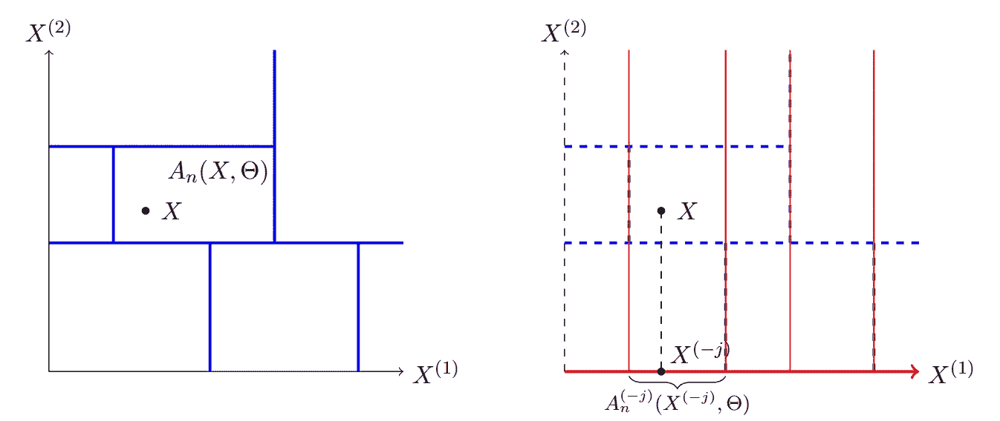

# 随机森林中的变量重要性

> 原文：[`towardsdatascience.com/variable-importance-in-random-forests-20c6690e44e0?source=collection_archive---------2-----------------------#2023-11-03`](https://towardsdatascience.com/variable-importance-in-random-forests-20c6690e44e0?source=collection_archive---------2-----------------------#2023-11-03)

## 传统方法与新发展

[](https://medium.com/@jeffrey_85949?source=post_page-----20c6690e44e0--------------------------------)[](https://towardsdatascience.com/?source=post_page-----20c6690e44e0--------------------------------) [Jeffrey Näf](https://medium.com/@jeffrey_85949?source=post_page-----20c6690e44e0--------------------------------)

·

[关注](https://medium.com/m/signin?actionUrl=https%3A%2F%2Fmedium.com%2F_%2Fsubscribe%2Fuser%2Fca780798011a&operation=register&redirect=https%3A%2F%2Ftowardsdatascience.com%2Fvariable-importance-in-random-forests-20c6690e44e0&user=Jeffrey+N%C3%A4f&userId=ca780798011a&source=post_page-ca780798011a----20c6690e44e0---------------------post_header-----------) 发表在 [Towards Data Science](https://towardsdatascience.com/?source=post_page-----20c6690e44e0--------------------------------) ·15 分钟阅读·2023 年 11 月 3 日[](https://medium.com/m/signin?actionUrl=https%3A%2F%2Fmedium.com%2F_%2Fvote%2Ftowards-data-science%2F20c6690e44e0&operation=register&redirect=https%3A%2F%2Ftowardsdatascience.com%2Fvariable-importance-in-random-forests-20c6690e44e0&user=Jeffrey+N%C3%A4f&userId=ca780798011a&source=-----20c6690e44e0---------------------clap_footer-----------)

--

[](https://medium.com/m/signin?actionUrl=https%3A%2F%2Fmedium.com%2F_%2Fbookmark%2Fp%2F20c6690e44e0&operation=register&redirect=https%3A%2F%2Ftowardsdatascience.com%2Fvariable-importance-in-random-forests-20c6690e44e0&source=-----20c6690e44e0---------------------bookmark_footer-----------)

（分布式）随机森林的特点。本文中：产生变量重要性的能力。来源：作者。

随机森林及其推广（特别是广义随机森林（GRF）和分布随机森林（DRF））是强大且易于使用的机器学习方法，任何数据科学家都不应缺少它们。这些方法不仅在大量数据集上表现稳健而无需调优，还能轻松处理[缺失值](https://medium.com/towards-data-science/random-forests-and-missing-values-3daaea103db0)，甚至提供[置信区间](https://medium.com/towards-data-science/inference-for-distributional-random-forests-64610bbb3927)。本文重点讨论它们能够提供的另一个特性：特征重要性的概念。具体来说，我们关注：

1.  传统的随机森林（RF）用于预测给定 p 个预测变量时变量 *Y* 的条件期望 ***X***。

1.  [分布随机森林](https://medium.com/towards-data-science/drf-a-random-forest-for-almost-everything-625fa5c3bcb8)，用于预测给定 *p* 个预测变量 ***X*** 时 d-变量 ***Y*** 的整个条件分布。

不幸的是，与许多现代机器学习方法一样，这些森林缺乏可解释性。即，涉及的操作过多，似乎无法确定预测变量与 *Y* 之间的实际功能关系。解决此问题的一种常见方法是定义变量重要性度量（VIMP），至少可以帮助决定哪些预测变量是重要的。通常，这有两个不同的目标：

(1) 寻找少量具有最大准确度的变量，

(2) 检测和排名所有影响变量，以便进一步探索。

(1) 和 (2) 之间的差异很重要，只要 ***X*** 中的元素之间存在依赖关系（几乎总是如此）。例如，如果两个变量与 *Y* 高度相关且彼此相关，则可以在目标 (1) 中移除其中一个输入，而不会影响准确度，因为这两个变量传达了相同的信息。然而，对于目标 (2)，两个变量都应包含在内，因为这两个变量在实际应用中可能对领域专家有不同的含义。

今天我们专注于（1），并试图找到较少数量的预测因子，这些因子展示了或多或少相同的预测准确性。例如，在下面的工资示例中，我们能够将预测因子的数量从 79 减少到大约 20，仅有少量准确性损失。这些最重要的预测因子包含了如年龄和教育等众所周知影响工资的变量。此外，还有许多关于（2）的精彩文章，使用 Shapley 值，例如这篇或这篇。也有非常近期且令人兴奋的[学术文献](https://hal.science/hal-03232621/document)讨论如何高效计算与随机森林结合的 Shapley 值。这些是第二篇文章的材料。

今天我们关注的两个度量实际上是更通用的变量重要性度量，可以用于任何方法，基于我们将要讨论的丢弃重学原则。然而，我们在此仅专注于树基方法。此外，我们不会详细解释这些方法，而是专注于它们的应用及为何新版本优于传统版本。


随机森林变量重要性度量概述。均值减少纯度（MDI）和均值减少准确性（MDA）都是由 Breiman 提出的。然而，由于其经验性，本方法仍存在若干问题，最近由 Sobol-MDA 解决。来源：作者

## 起始

RF 的变量重要性度量实际上与 RF 本身一样古老。**均值减少准确性（MDA）**这一方法最早由 Breiman 在其开创性的随机森林论文中提出[1]。其原理很简单：对于每一个维度 *j=1,…,p*，将完整预测的准确性与当 *X_j* 被随机置换时的预测准确性进行比较。这一想法是打破 *X_j* 和 *Y* 之间的关系，并将 *X_j* 不参与预测 *Y* 的准确性与它可能有用的情况进行比较。

MDA 在 R 和 Python 中有各种不同的版本实现：


MDA 的不同版本，在不同包中实现。来源：[3]中的表 1

不幸的是，以这种方式排列变量 *X_j* 不仅打破了它与 *Y* 的关系，也打破了它与 ***X*** 中其他变量的关系。如果 *X_j* 与所有其他变量独立，这不是问题，但一旦存在依赖关系，就会成为问题。因此，[3] 证明了只要 ***X*** 中存在依赖关系，MDA 就会收敛到一些荒谬的结果。特别是，MDA 可能会给予一个对预测 *Y* 并不重要的变量 *X_j* 高重要性，但这个变量与另一个对预测 *Y* 实际上很重要的变量，比如 *X_l*，高度相关（如下例所示）。同时，它可能无法检测到实际相关的变量，这在 [3, Section 2.1] 的大量文献中得到了证明。从直觉上讲，我们希望测量的是如果不包括 *X_j* 模型的性能，而我们测量的是使用排列的 *X_j* 变量的模型性能。

第二种传统的准确性度量是 **均值减少不纯度（MDI）**，它是对所有分裂在给定协变量上的节点的不纯度加权减少的总和，平均到森林中的所有树。不幸的是，MDI 从一开始就定义不明确（不清楚它应该度量什么），且几篇论文强调了这种方法的实际问题（例如 [5]）。因此，我们不会详细讨论 MDI，因为 MDA 通常是首选。

## 现代发展 I: Sobol-MDA

长时间以来，我认为这些稍显非正式的度量是我们能做到的最好方法。一篇改变了这一点的论文最近才发表。在这篇论文中，作者理论上证明了上述流行度量实际上存在很大缺陷，并未测量我们想要测量的内容。因此，第一个问题可能是：我们实际上想要测量什么？一个潜在的答案是：Sobol 指数（最早在计算机科学文献中提出）：


让我们来详细了解一下。首先，*tau(****X****)=E[ Y |* ***X****]* 是我们希望估计的条件期望函数。由于它是随机 ***X*** 的函数，因此这是一个随机变量。现在 ***X****^{(-j)}* 是移除协变量 *j* 的 *p-1* 向量。因此，*ST^{(j)}* 是移除第 *j* 个输出变量后解释方差的减少量。

以上是更传统的度量方式。然而，对我来说，写作：


更直观。在这里，*d* 是两个随机向量之间的距离，对于上述的 *ST^{(j)}*，这个距离就是通常的欧几里得距离。因此，*ST^{(j)}* 的上半部分只是测量了我们想要的（*tau(****X****)*) 和没有变量 *j* 时得到的之间的平均平方距离。


问题变成了如何有效地估计这个距离。事实证明，直观的“丢弃和重新学习”原则就足够了：简单地使用随机森林估计 *tau(****X****)*，然后丢弃 *X_j* 并重新拟合随机森林以获得 *tau(****X^{(-j)}****)* 的估计值，就可以得到一致的估计量：


其中 *tau_n(****X****_i)* 是对测试点 ***X****_i* 使用所有 *p* 个预测变量的随机森林估计值，同样 *tau_n(****X****_i^{(-j)})* 是仅使用 *p-1* 个预测变量的重新拟合森林。

然而，这意味着森林需要重新拟合 *p* 次，当 *p* 很大时效率不高！因此，[3] 中的作者开发了他们所称的 **Sobol-MDA**。与每次重新拟合森林不同，该方法仅拟合一次森林。然后，将测试点丢弃到同一森林中，结果预测“投影”以形成公式 (1) 中的度量。也就是说，*X_j* 上的分裂会被简单忽略（记住目标是获得没有 *X_j* 的估计）。作者能够表明，使用这种投影方法计算上述公式 (1) 也能得到一致的估计量！这确实是一个很棒的想法，使得该算法即使在高维情况下也能适用。



投影方法的示意图。左侧是 RF 对二维空间的划分。右侧的投影方法忽略了 X² 中的分裂，从而在进行预测时将其移除。可以看出，点 X 被投影到右侧的 X^{(-j)} 上。来源：[3] 中的图 1

该方法在 R 语言中实现于 [soboldMDA](https://gitlab.com/drti/sobolmda) 包中，基于非常快速的 [ranger](https://cran.r-project.org/web/packages/ranger/ranger.pdf) 包。

## 现代发展 II：基于 MMD 的敏感性指数

通过使用距离 *d* 的公式，产生了一个自然的问题：是否可以使用不同的距离来获得更复杂问题的变量重要性度量。其中一个近期的例子是使用 MMD 距离作为 *d*：


MMD 距离是一个很棒的工具，它允许通过使用核 *k*（如高斯核）相对轻松地构建分布之间的距离：


目前我将细节留给后续文章。最重要的结论是*I^{(j)}*考虑了比条件期望更一般的目标。它将变量*X_j*视为重要，只要它以任何方式影响*Y*的分布。可能是*X_j*仅改变方差或分位数，而条件均值*Y*保持不变（见下面的例子）。在这种情况下，Sobol-MDA 将不会识别*X_j*为重要，但 MMD 方法会。这并不一定意味着它更好，它只是另一种工具：如果你关注预测条件期望，*ST^{(j)}*是合适的度量。然而，如果你关注预测分布的其他方面，尤其是分位数，*I^{(j)}*会更适合。再次强调，*I^{(j)}*可以通过使用丢弃重学原则（每次去掉变量$j$时重新拟合 DRF），或者使用与 Sobol-MDA 相同的投影方法来一致地估计。基于丢弃重学的实现附在本文末尾。我们在这里将这种方法称为**MMD-MDA**。

## 模拟数据

现在我们用一个简单的模拟例子来说明这两种现代度量方法：我们首先从[Gitlab](https://gitlab.com/drti/sobolmda)下载并安装 Sobol-MDA 包，然后加载这个例子所需的所有包：

```py
library(kernlab)
library(drf)
library(Matrix)
library(DescTools)
library(mice)
library(sobolMDA)
source("compute_drf_vimp.R") ##Contents of this file can be found below
source("evaluation.R") ##Contents of this file can be found below
```

然后我们从这个简单的例子中进行模拟：我们将*X_1, X_2, X_4, …, X_10*独立地在（-1,1）之间均匀分布，并通过取*X_3=X_1 + 均匀误差*来创建*X_1*和*X_3*之间的依赖关系。然后我们模拟*Y*为


```py
##Simulate Data that experiences both a mean as well as sd shift

# Simulate from X
x1 <- runif(n,-1,1)
x2 <- runif(n,-1,1)
X0 <- matrix(runif(7*n,-1,1), nrow=n, ncol=7)
x3 <- x1+ runif(n,-1,1)
X <- cbind(x1,x2, x3, X0)

# Simulate dependent variable Y
Y <- as.matrix(rnorm(n,mean = 0.8*(x1 > 0), sd = 1 + 1*(x2 > 0)))
colnames(X)<-paste0("X", 1:10)

head(cbind(Y,X)) 
```

然后我们分析 Sobol-MDA 方法以估计给定***X***的*Y*的条件期望：

```py
## Variable importance for conditional Expectation Estimation

XY <- as.data.frame(cbind(Xfull, Y))
colnames(XY) <- c(paste('X', 1:(ncol(XY)-1), sep=''), 'Y')
num.trees <- 500
forest <- sobolMDA::ranger(Y ~., data = XY, num.trees = num.trees, importance = 'sobolMDA')
sobolMDA <- forest$variable.importance
names(sobolMDA) <- colnames(X)

sort(sobolMDA, decreasing = T)

          X1           X8           X7           X6           X5           X9 
 0.062220958  0.021946135  0.016818860  0.016777223 -0.001290326 -0.001540919 
          X3          X10           X4           X2 
-0.001578540 -0.007400854 -0.008299478 -0.020334150 
```

如所见，它正确识别出*X_1*是最重要的变量，而其他变量则被同等排序（不）重要。这是合理的，因为*Y*的条件期望仅由*X_1*改变。关键是，尽管存在*X_1*和*X_3*之间的依赖关系，该度量仍然能够做到这一点。因此，我们在这个例子中成功实现了上述目标（1）。另一方面，我们也可以看看传统的 MDA：

```py
forest <- sobolMDA::ranger(Y ~., data = XY, num.trees = num.trees, importance = 'permutation')
MDA <- forest$variable.importance
names(MDA) <- colnames(X)

sort(MDA, decreasing = T)

          X1           X3           X6           X7           X8           X2 
 0.464516976  0.118147061  0.063969310  0.032741521  0.029004312 -0.004494380 
          X4           X9          X10           X5 
-0.009977733 -0.011030996 -0.014281844 -0.018062544 
```

在这种情况下，尽管它正确识别了*X_1*作为最重要的变量，但它还将*X_3*排在第二位，其值似乎明显高于其他变量。这尽管*X_3*与*X_2, X_4,…, X_10*一样不重要！

但如果我们更普遍地关注预测*Y*的分布，例如估计分位数呢？在这种情况下，我们需要一个能够识别*X_2*对*Y*条件方差影响的度量方法。在这里，MMD 变量重要性度量方法发挥作用：

```py
MMDVimp <- compute_drf_vimp(X=X,Y=Y)
sort(MMDVimp, decreasing = T)

         X2          X1         X10          X6          X8          X3 
0.683315006 0.318517259 0.014066410 0.009904518 0.006859128 0.005529749 
         X7          X9          X4          X5 
0.003476256 0.003290550 0.002417677 0.002036174 
```

再次，该度量能够正确识别重要的内容：*X_1* 和 *X_2* 是两个最重要的变量。尽管 *X_1* 和 *X_3* 之间存在依赖关系，它仍然能够做到这一点。有趣的是，它还给予 *X_2* 的方差变化比 *X_1* 的期望变化更高的重要性。

## 实际数据

最后，我展示了一个实际数据应用来演示变量重要性度量。注意，使用 DRF，我们甚至可以查看多变量 ***Y***，但为了简化，我们专注于单变量设置，并考虑来自美国人口普查局的 2018 年美国社区调查的工资数据。在第一篇 [DRF 论文](https://www.jmlr.org/papers/v23/21-0585.html) 中，我们从美国人口普查局的 2018 年美国社区调查中获得了约 100 万名全职员工的数据，从中提取了工资信息及所有可能与工资相关的协变量。这些数据非常适合用来试验像 DRF 这样的方法（实际上我们只会使用其中的一小部分进行分析）。我们加载的数据可以在 [这里](https://github.com/lorismichel/drf/blob/master/applications/wage_data/data/datasets/wage_benchmark.Rdata) 找到。

```py
# Load data (https://github.com/lorismichel/drf/blob/master/applications/wage_data/data/datasets/wage_benchmark.Rdata)
load("wage_benchmark.Rdata")

##Define the training data

n<-1000

Xtrain<-X[1:n,] 
Ytrain<-Y[1:n,]
Xtrain<-cbind(Xtrain,Ytrain[,"male"])
colnames(Xtrain)[ncol(Xtrain)]<-"male"
Ytrain<-Ytrain[,1, drop=F]

##Define the test data
ntest<-2000
Xtest<-X[(n+1):(n+ntest),]  
Ytest<-Y[(n+1):(n+ntest),]
Xtest<-cbind(Xtest,Ytest[,"male"])
colnames(Xtest)[ncol(Xtest)]<-"male"
Ytest<-Ytest[,1, drop=F]
```

我们现在计算两个变量重要性度量（这会花费一些时间，因为仅实现了丢弃再学习方法用于 DRF）：

```py
# Calculate variable importance for both measures
# 1\. Sobol-MDA
XY <- as.data.frame(cbind(Xtrain, Ytrain))
colnames(XY) <- c(paste('X', 1:(ncol(XY)-1), sep=''), 'Y')
num.trees <- 500
forest <- sobolMDA::ranger(Y ~., data = XY, num.trees = num.trees, importance = 'sobolMDA')
SobolMDA <- forest$variable.importance
names(SobolMDA) <- colnames(Xtrain)

# 2\. MMD-MDA
MMDVimp <- compute_drf_vimp(X=Xtrain,Y=Ytrain,silent=T)

print("Top 10 most important variables for conditional Expectation estimation")
sort(SobolMDA, decreasing = T)[1:10]
print("Top 5 most important variables for conditional Distribution estimation")
sort(MMDVimp, decreasing = T)[1:10]
```

```py
Sobol-MDA:

education_level                   age                  male 
          0.073506769           0.027079349           0.013722756 
        occupation_11         occupation_43           industry_54 
          0.013550320           0.010025332           0.007744589 
          industry_44         occupation_23         occupation_15 
          0.006657918           0.005772662           0.004610835 
marital_never married 
          0.004545964 
```

```py
MMD-MDA:

education_level                   age                  male 
          0.420316085           0.109212519           0.027356393 
        occupation_43         occupation_11 marital_never married 
          0.016861954           0.014122583           0.003449910 
        occupation_29       marital_married           industry_81 
          0.002272629           0.002085207           0.001152210 
          industry_72 
          0.000984725
```

在这种情况下，这两种变量重要性度量在哪些变量重要上有相当一致的意见。虽然这不是因果分析，但变量 “年龄”、“教育水平”和“性别” 确实被这两种度量视为非常重要的，这一点也很令人欣慰。

为了获得一小组预测变量，现在可以对 *j=1,…p-1* 进行操作，

(I) 移除最不重要的变量

(II) 在测试集上计算损失（例如均方误差）

(III) 重新计算剩余变量的变量重要性

(IV) 重复直到满足某个停止标准

比如，如果损失增加超过 5%，可以停止。为了简化本文，我仅使用上面保存的相同变量重要性值，即“SobolMDA”和“MMDVimp”。也就是说，我忽略了步骤（III），只考虑（I）、（II）和（IV）。当估计目标是完整的条件分布时，步骤（II）也不是完全清楚的。我们使用称为 MMD 损失的度量，这在我们的论文中有更详细的描述 ([4])。这种损失考虑了我们在预测分布时所犯的错误。对于条件均值，我们简单地使用均方误差。这在下面找到的函数“evalall”中完成：

```py
# Remove variables one-by-one accoring to the importance values saved in SobolMDA
# and MMDVimp.
evallistSobol<-evalall(SobolMDA, X=Xtrain ,Y=Ytrain ,Xtest, Ytest, metrics=c("MSE"), num.trees )
evallistMMD<-evalall(MMDVimp, X=Xtrain ,Y=Ytrain ,Xtest, Ytest, metrics=c("MMD"), num.trees )

plot(evallistSobol$evalMSE, type="l", lwd=2, cex=0.8, col="darkgreen", main="MSE loss" , xlab="Number of Variables removed", ylab="Values")
plot(evallistMMD$evalMMD, type="l", lwd=2, cex=0.8, col="darkgreen", main="MMD loss" , xlab="Number of Variables removed", ylab="Values")
```

这导致以下两张图片：


注意到这两者都有些许波动线条，这首先是由于我没有重新计算重要性测量，例如，省略了步骤(III)，其次是森林的随机性。除此之外，图形很好地展示了每次移除变量后错误如何逐渐增加。这种增加对于最不重要的变量开始时很慢，然后对于最重要的变量加速，正如预期的那样。特别是，如果移除 50 个最不重要的变量，损失几乎保持不变！实际上，在这两种情况下，移除约 70 个变量而损失增加不超过 6%是可能的。不过，需要注意的是，许多预测变量是单独编码的分类变量的一部分，因此在移除预测变量时需要小心，因为它们对应于一个分类变量的水平。然而，在实际应用中，这可能仍然是可取的。

## 结论

在本文中，我们探讨了随机森林中变量重要性的现代方法，目标是获得一个小的预测变量或协变量集合，既考虑条件期望，也更一般地考虑条件分布。我们在工资数据示例中看到，这可以显著减少预测变量，同时保持几乎相同的准确度。

如上所述，所呈现的测量方法并不严格限制于随机森林，但原则上可以更一般地使用。然而，森林允许优雅的投影方法，使得可以计算所有变量的*重要性测量*，而无需每次都重新拟合森林（！）这在[3]和[4]中都有描述。

## 文献

[1] Breiman, L. (2001). 随机森林。机器学习, 45(1):5–32。

[2] Breiman, L. (2003a). 设置、使用和理解随机森林 v3.1。技术报告，UC Berkeley，统计系。

[3] Bénard, C., Da Veiga, S., 和 Scornet, E. (2022). 随机森林的均值减少准确度：不一致性及通过 Sobol-MDA 的实际解决方案。Biometrika, 109(4):881–900。

[4] Clément Bénard, Jeffrey Näf, 和 Julie Josse. 基于 MMD 的分布随机森林变量重要性，2023。

[5] Strobl, C., Boulesteix, A.-L., Zeileis, A., 和 Hothorn, T. (2007). 随机森林变量重要性测量中的偏差：说明、来源和解决方案。BMC Bioinformatics, 8:25。

## 附录：代码

```py
 #### Contents of compute_drf_vimp.R ######

#' Variable importance for Distributional Random Forests
#'
#' @param X Matrix with input training data.
#' @param Y Matrix with output training data.
#' @param X_test Matrix with input testing data. If NULL, out-of-bag estimates are used.
#' @param num.trees Number of trees to fit DRF. Default value is 500 trees.
#' @param silent If FALSE, print variable iteration number, otherwise nothing is print. Default is FALSE.
#'
#' @return The list of importance values for all input variables.
#' @export
#'
#' @examples
compute_drf_vimp <- function(X, Y, X_test = NULL, num.trees = 500, silent = FALSE){

  # fit initial DRF
  bandwidth_Y <- drf:::medianHeuristic(Y)
  k_Y <- rbfdot(sigma = bandwidth_Y)
  K <- kernelMatrix(k_Y, Y, Y)
  DRF <- drf(X, Y, num.trees = num.trees)
  wall <- predict(DRF, X_test)$weights

  # compute normalization constant
  wbar <- colMeans(wall)
  wall_wbar <- sweep(wall, 2, wbar, "-")
  I0 <- as.numeric(sum(diag(wall_wbar %*% K %*% t(wall_wbar))))

  # compute drf importance dropping variables one by one
  I <- sapply(1:ncol(X), function(j) {
    if (!silent){print(paste0('Running importance for variable X', j, '...'))}
    DRFj <- drf(X = X[, -j, drop=F], Y = Y, num.trees = num.trees) 
    DRFpredj <- predict(DRFj, X_test[, -j])
    wj <- DRFpredj$weights
    Ij <- sum(diag((wj - wall) %*% K %*% t(wj - wall)))/I0
    return(Ij)
  })

  # compute retraining bias
  DRF0 <- drf(X = X, Y = Y, num.trees = num.trees)
  DRFpred0 = predict(DRF0, X_test)
  w0 <- DRFpred0$weights
  vimp0 <- sum(diag((w0 - wall) %*% K %*% t(w0 - wall)))/I0

  # compute final importance (remove bias & truncate negative values)
  vimp <- sapply(I - vimp0, function(x){max(0,x)})

  names(vimp)<-colnames(X)

  return(vimp)

} 
```

```py
#### Contents of evaluation.R ######

compute_mmd_loss <- function(Y_train, Y_test, weights){
  # Y_train <- scale(Y_train)
  # Y_test <- scale(Y_test)
  bandwidth_Y <- (1/drf:::medianHeuristic(Y_train))²
  k_Y <- rbfdot(sigma = bandwidth_Y)
  K_train <- matrix(kernelMatrix(k_Y, Y_train, Y_train), ncol = nrow(Y_train))
  K_cross <- matrix(kernelMatrix(k_Y, Y_test, Y_train), ncol = nrow(Y_train))
  weights <- matrix(weights, ncol = ncol(weights))
  t1 <- diag(weights%*%K_train%*%t(weights))
  t2 <- diag(K_cross%*%t(weights))
  mmd_loss <- mean(t1) - 2*mean(t2)
  mmd_loss
}

evalall <- function(Vimp, X ,Y ,Xtest, Ytest, metrics=c("MMD","MSE"), num.trees ){

  if (ncol(Ytest) > 1 & "MSE" %in% metrics){
    metrics <- metrics[!( metrics %in% "MSE") ]
  }

  # Sort for increasing importance, such that the least important variables are removed first
  Vimp<-sort(Vimp)

  if ( is.null(names(Vimp)) ){
    stop("Need names for later")  
  }

  evalMMD<-matrix(0, nrow=ncol(X))
  evalMSE<-matrix(0, nrow=ncol(X))

  ###Idea: Create a function that takes a variable importance measure and does this loop!!

  for (j in 1:ncol(X)){

    if (j==1){

      if ("MMD" %in% metrics){

        DRFred<- drf(X=X,Y=Y)
        weights<- predict(DRFred, newdata=Xtest)$weights
        evalMMD[j]<-compute_mmd_loss(Y_train=Y, Y_test=Ytest, weights)

      }

      if ("MSE" %in% metrics){

        XY <- as.data.frame(cbind(X, Y))
        colnames(XY) <- c(paste('X', 1:(ncol(XY)-1), sep=''), 'Y')
        RFfull <- sobolMDA::ranger(Y ~., data = XY, num.trees = num.trees)
        XtestRF<-Xtest
        colnames(XtestRF) <- paste('X', 1:ncol(XtestRF), sep='')
        predRF<-predict(RFfull, data=XtestRF)
        evalMSE[j] <- mean((Ytest - predRF$predictions)²)

      }

    }else{

      if ("MMD" %in% metrics){

        DRFred<- drf(X=X[,!(colnames(X) %in% names(Vimp[1:(j-1)])), drop=F],Y=Y)
        weights<- predict(DRFred, newdata=Xtest[,!(colnames(Xtest) %in% names(Vimp[1:(j-1)])), drop=F])$weights
        evalMMD[j]<-compute_mmd_loss(Y_train=Y, Y_test=Ytest, weights)

      }

      if ("MSE" %in% metrics){

        XY <- as.data.frame(cbind(X[,!(colnames(X) %in% names(Vimp[1:(j-1)])), drop=F], Y))
        colnames(XY) <- c(paste('X', 1:(ncol(XY)-1), sep=''), 'Y')
        RFfull <- sobolMDA::ranger(Y ~., data = XY, num.trees = num.trees)
        XtestRF<-Xtest[,!(colnames(Xtest) %in% names(Vimp[1:(j-1)])), drop=F]
        colnames(XtestRF) <- paste('X', 1:ncol(XtestRF), sep='')
        predRF<-predict(RFfull, data=XtestRF)
        evalMSE[j] <- mean((Ytest - predRF$predictions)²)

        # DRFall <- drf(X=X[,!(colnames(X) %in% names(Vimp[1:(j-1)])), drop=F], Y=Y, num.trees=num.trees)
        # quantpredictall<-predict(DRFall, newdata=Xtest[,!(colnames(Xtest) %in% names(Vimp[1:(j-1)])), drop=F], functional="quantile",quantiles=c(0.5))
        # evalMAD[j] <- mean(sapply(1:nrow(Xtest), function(j)  abs(Ytest[j] - quantpredictall$quantile[,,"q=0.5"][j]) ))
      }

    }

  }

  return(list(Vimp=Vimp, evalMMD=evalMMD, evalMSE=evalMSE ))

} 
```
