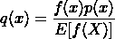

# 重要性采样的方差减少

> 原文：[`towardsdatascience.com/variance-reduction-with-importance-sampling-4e5ca4b1c5a7`](https://towardsdatascience.com/variance-reduction-with-importance-sampling-4e5ca4b1c5a7)

## 数学解释和 Python 实现

[](https://medium.com/@hrmnmichaels?source=post_page-----4e5ca4b1c5a7--------------------------------)[](https://towardsdatascience.com/?source=post_page-----4e5ca4b1c5a7--------------------------------) [Oliver S](https://medium.com/@hrmnmichaels?source=post_page-----4e5ca4b1c5a7--------------------------------)

·发布于[Towards Data Science](https://towardsdatascience.com/?source=post_page-----4e5ca4b1c5a7--------------------------------) ·阅读时长 6 分钟 ·2023 年 1 月 23 日

--


图片来源：[Edge2Edge Media](https://unsplash.com/@edge2edgemedia?utm_source=unsplash&utm_medium=referral&utm_content=creditCopyText) 在[Unsplash](https://unsplash.com/photos/uKlneQRwaxY?utm_source=unsplash&utm_medium=referral&utm_content=creditCopyText)

在之前的文章中，我介绍了[不同的数值采样技术](https://medium.com/towards-data-science/introduction-to-sampling-methods-c934b64b6b08)，其中之一是重要性采样。在那篇文章中，我们使用了这一技术来允许从复杂的分布中采样，而从这些分布中采样在其他情况下是不切实际的。然而，重要性采样还有另一个常见用途，即方差降低：通过选择合适的建议分布，我们可以降低估计量的方差——这就是我们在这里要讨论的内容。

# 重要性采样回顾

假设我们不仅仅想计算随机变量 `X` 的期望 `E[X]`，而是该变量函数的期望 `f[X]`。在连续情况下，这可以计算为：


我们可以通过数值近似，即蒙特卡洛方法，来近似这个期望，通过从分布 `p` 中采样 `n` 个随机值，然后计算样本均值：


重要性采样背后的想法是使用一个简单的重新表述技巧，将期望写为


— 给出 `f(x)p(x)/q(x)` 在分布 `q` 下的期望！通过这种方式，我们可以通过从 `q` 中采样来计算样本均值：


# 方差减少

标准蒙特卡洛估计量的方差为：


改编后的重要性采样估计器的方差为：


因此，作为第一步，我们确实观察到方差的差异，这意味着我们很有可能找到减少方差的方法。实际上，选择`q`可以将方差减少到 0：



（将这个术语插入上述方程中，并设想`f(x)p(x)`互相抵消——留下`Var[E[f(X)]]=0`。）

自然地，我们不知道`E[f(X)]`，毕竟我们进行采样的原因是为了找到`f`的期望值。

然而，我们可以将`E[f(X)]`视为某种归一化常数，并从中获得一个重要的见解：我们应该构造`q`，使其在`f(x)p(x)`较高的地方具有高密度。有了这些，我们进入一个实际例子并应用这一学习。

# 实际例子

为了演示，我们选择一个尖锐的函数`f`和一个与其重叠不太好的概率分布`p`。为简化起见，我们将两者都设置为正态分布，例如`f = N(5, 1)`和`p = N(9, 2)`：


图片由作者提供

我希望选择两个正态分布不会让读者感到困惑，因此让我们重申一下我们要做的事情：我们想计算`E[f(X)]`，其中`X`是遵循分布`p`的随机变量——也就是说，我们想计算`p`下`f`的均值。注意，这个均值不是通常与正态分布相关的均值（这是 x 轴上的一个值，即分布的众数），而是我们现在关注的`p`下 y 值的均值：在这个例子中是~0.36——这是一个鲜为人知且使用较少的值。

为了在数值上近似这一点，如上所述，我们现在将从分布`p`中抽样值`x`，并计算`f(x)`的经验均值。

从直觉上可以理解为什么从这个分布中采样是不好的，希望前面的部分能够对此有更好的解释：对于从`p`中抽样的大多数值，`f`将接近 0——但对于一些抽样值，`f`将非常大——因此我们得到一个大的方差。

因此，按照上述介绍的思路，我们现在提出了一个新的分布`q = N(5.8, 1)`，它满足推导出的标准，即在`f(x)p(x)`较高的区域其密度也较高：


图片由作者提供

注意，找到这个函数并不是很简单，现实世界中还有许多更复杂的情况。我们必须尽量满足标准，同时还要注意满足重要性采样要求，即`p`覆盖`q`等。对于这个例子，我实际上绘制了`p(x)f(x)`，然后选择了最接近的`q`。

## Python 实现

让我们用 Python 进行编码。首先，我们引入必要的函数和分布，为了方便使用 `functools.partials` 来获得一个表示具有固定均值/标准差的正态分布的函数：

```py
MEAN_F, STD_F = 5, 1
MEAN_P, STD_P = 9, 2
MEAN_Q, STD_Q = 5.8, 1

def normal_dist(
    mean: float, standard_deviation: float, x: np.ndarray
) -> np.ndarray:
    return (
        1
        / (standard_deviation * np.sqrt(2 * np.pi))
        * np.exp(-0.5 * ((x - mean) / standard_deviation) ** 2)
    )

f = partial(normal_dist, MEAN_F, STD_F)
p = partial(normal_dist, MEAN_P, STD_P)
q = partial(normal_dist, MEAN_Q, STD_Q)
```

然后，我们生成上述图表以供参考：

```py
x = np.linspace(0, 15, 100)
plt.plot(x, f(x), "b-", label="f")
plt.plot(x, p(x), "r-", label="p")
plt.plot(x, q(x), "y-", label="q")
plt.legend()
plt.show()
```

最后，我们进入（重要性）采样部分。首先，我们计算 `E[f(X)]` 的直接蒙特卡罗估计器。我们从 `p` 中生成随机样本 `x`，并计算 `f(x)` 的均值：

```py
x_p = np.random.normal(loc=MEAN_P, scale=STD_P, size=NUM_SAMPLES)
y_p = f(x_p)
```

现在我们应用重要性采样，即从 `q` 中抽样并通过重要性权重进行修正：

```py
x_q = np.random.normal(loc=MEAN_Q, scale=STD_Q, size=NUM_SAMPLES)
y_q = f(x_q) * p(x_q) / q(x_q)
```

综合起来：

```py
from functools import partial

import matplotlib.pyplot as plt
import numpy as np

NUM_SAMPLES = 1000000
MEAN_F, STD_F = 5, 1
MEAN_P, STD_P = 9, 2
MEAN_Q, STD_Q = 5.8, 1

def normal_dist(
    mean: float, standard_deviation: float, x: np.ndarray
) -> np.ndarray:
    return (
        1
        / (standard_deviation * np.sqrt(2 * np.pi))
        * np.exp(-0.5 * ((x - mean) / standard_deviation) ** 2)
    )

f = partial(normal_dist, MEAN_F, STD_F)
p = partial(normal_dist, MEAN_P, STD_P)
q = partial(normal_dist, MEAN_Q, STD_Q)

x = np.linspace(0, 15, 100)
plt.plot(x, f(x), "b-", label="f")
plt.plot(x, p(x), "r-", label="p")
plt.plot(x, q(x), "y-", label="q")
plt.legend()
plt.show()

x_p = np.random.normal(loc=MEAN_P, scale=STD_P, size=NUM_SAMPLES)
y_p = f(x_p)

x_q = np.random.normal(loc=MEAN_Q, scale=STD_Q, size=NUM_SAMPLES)
y_q = f(x_q) * p(x_q) / q(x_q)

print(
    f"Original mean / variance: {np.mean(y_p):.6f} / {np.var(y_p):.6f}"
)
print(
    f"Importance sampling mean / variance: {np.mean(y_q):.6f} / {np.var(y_q):.6f}"
)
```

输出结果将类似于：

`原始均值 / 方差: 0.036139 / 0.007696 重要性采样均值 / 方差: 0.036015 / 0.000027`

因此，我们仍然获得了正确的均值，但方差减少了约 100 倍！

# 结论

重要性采样是一个巧妙的重构技巧，使我们能够通过从不同的提案分布中采样来计算期望值和其他矩。它不仅允许从复杂的、否则难以采样的分布中采样，还改变了结果估计器的方差。在这篇文章中，我们展示了如何利用这一点来减少方差。特别地，我们证明并展示了在 `p(x)f(x)`（原始分布和问题函数的乘积）高的区域选择具有高概率的提案分布可以获得最佳结果。

感谢阅读！

本文是关于采样系列的第二部分。你可以在这里找到其他部分：

+   第一部分: [采样方法介绍](https://medium.com/towards-data-science/introduction-to-sampling-methods-c934b64b6b08)

+   第三部分: [马尔可夫链蒙特卡罗（MCMC）方法介绍](https://medium.com/towards-data-science/introduction-to-markov-chain-monte-carlo-mcmc-methods-b5bad18bc243)
