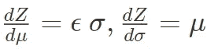

# 使用 Gumbel Softmax 的离散分布变分自编码器（VAE）

> 原文：[`towardsdatascience.com/variational-autoencoder-vae-with-discrete-distribution-using-gumbel-softmax-b3f749b3417e`](https://towardsdatascience.com/variational-autoencoder-vae-with-discrete-distribution-using-gumbel-softmax-b3f749b3417e)

## 理论与 PyTorch 实现

[](https://medium.com/@alexml0123?source=post_page-----b3f749b3417e--------------------------------)[](https://towardsdatascience.com/?source=post_page-----b3f749b3417e--------------------------------) [Alexey Kravets](https://medium.com/@alexml0123?source=post_page-----b3f749b3417e--------------------------------)

·发表于 [Towards Data Science](https://towardsdatascience.com/?source=post_page-----b3f749b3417e--------------------------------) ·17 分钟阅读·2023 年 8 月 9 日

--


[`unsplash.com/photos/sbVu5zitZt0`](https://unsplash.com/photos/sbVu5zitZt0)

由于这篇文章将会很详尽，我将为读者提供一个索引以便更好地导航：

1.  介绍

1.  变分自编码器（VAEs）简要介绍

1.  Kullback–Leibler (KL) 散度

1.  VAE 损失

1.  重参数化技巧

1.  从分类分布中采样与 Gumbel-Max 技巧

1.  实现

## 介绍

生成模型如今变得非常流行，这要归功于它们能够通过学习和捕捉训练数据的基础概率分布来生成具有固有变异性的全新样本。

我们可以识别出两大主要的生成模型家族：生成对抗网络（GANs）、变分自编码器（VAEs）和扩散模型。在这篇文章中，我们将深入探讨 VAEs，特别是关注具有分类潜在空间的 VAEs。

## 变分自编码器（VAEs）简要介绍

变分自编码器（VAEs）是一种用于无监督机器学习的深度神经网络。它们属于自编码器家族，自编码器是设计用于通过压缩然后重构数据来学习高效数据表示的神经网络。

VAEs 的主要思想是学习**潜在空间**中的数据概率分布。这个潜在空间是输入数据的低维表示，其中每个点对应于一个特定的数据样本。例如，给定一个维度为 3 的潜在空间中的向量，我们可以认为第一个维度表示眼睛的形状，第二个维度表示胡须的多少，第三个维度表示生成的人的脸上的肤色。

VAEs 具有两个关键组件：

1.  **编码器**：编码器网络接收输入数据，并将其映射到潜在空间中一个概率分布的*参数*（通常是高斯分布）。编码器不是直接在潜在空间中产生一个单一的点，而是输出分布的均值和方差。

    输出一个分布而不是潜在空间中的单个点作为正则化，这样当我们在潜在空间中选择一个随机点时，解码这个数据点后我们总能得到一个有意义的图像。

1.  **解码器**：解码器网络从潜在空间中采样，并将其重建回原始数据空间。它使用类似于编码器的过程但相反，将潜在表示转换回数据空间。

让我们来说明这个过程：


VAE 编码器-解码器图示，图片由作者提供 (1)

其中 *x* 是输入图像，*z* 是潜在空间中的一个采样向量，μ 和 σ 是潜在空间参数，其中μ是均值向量，σ是标准差向量。最后，*x’* 是从潜在变量重建的图像。

我们希望这个**潜在空间具备两个特性**：

1.  潜在空间中接近的点应输出相似的图片。

1.  从潜在空间中采样的任何点都应产生与训练数据相似的东西，即，如果我们训练的是人的面孔，它不应产生任何有 3 只眼睛或 4 只耳朵的面孔。

要实现第一个目标，我们需要让编码器将相似的图片映射到接近的潜在空间参数，然后解码器将它们映射回看起来相似的图片——这通过图像重建损失来实现。为了实现第二个目标，我们需要添加一个正则化项。这个正则化项是编码器返回的参数与均值为 0、方差为 1 的标准高斯分布——N(0,1)之间的 Kullback–Leibler（KL）散度。通过保持潜在空间接近 N(0,1)，我们确保编码器不会为每个样本产生相距过远的分布（通过使均值非常不同和方差非常小），这会导致过拟合。如果发生这种情况，在潜在空间中采样一个远离任何训练点的值将无法产生有意义的图像。

## Kullback–Leibler (KL) 散度

KL 散度，简称 Kullback-Leibler 散度，是衡量一个概率分布与另一个分布的不同程度的指标。给定两个概率分布 P(X)和 Q(X)，其中 X 是随机变量，KL(Q || P)表示从 Q 到 P 的 KL 散度，是一个非负值，表示使用 Q 来近似 P 时信息的丧失程度。它不是对称度量，即 KL(Q || P)通常不同于 KL(P || Q)。连续和离散变量的公式如下：


KL 散度，离散情况 (2)


KL 散度，连续情况 (3)

但是这个公式的直觉是什么？它是如何推导出来的？

假设我们有一个包含 **从分布 P(x) 中抽样得到的观察数据** — {x1, x2, …, xn} 的数据集，我们想要比较这些观察数据在真实分布 P(x) 和近似分布 Q(x) 下的生成可能性。在概率分布下观察整个数据集的可能性可以通过每个观察数据的个体概率的乘积来计算：

+   在 P(x) 下的数据似然：L_P = P(x1) * P(x2) * … * P(xn)

+   在 Q(x) 下的数据似然：L_Q = Q(x1) * Q(x2) * … * Q(xn)

通过比较比率 L_P / L_Q，我们可以比较它们的相似度。如果比率接近 1，则近似分布与真实分布相似；而如果这个比率很高，意味着根据近似分布从真实分布中抽样的序列的可能性显著较低，则两个分布不同。显然，这个比率不能小于 1，因为数据是从真实分布 P(x) 中抽样的。

对这个比率两边取对数，我们得到：


比率 L_P / L_Q 的对数 (4)

现在，如果我们对数据集上真实分布 P(x) 的对数进行期望计算，我们得到期望对数似然比：


比率 L_P / L_Q 的期望对数 (5)

这不过是 KL 散度！作为额外的内容，让我们深入了解 KL 散度如何与交叉熵相关联。细心的读者可能已经认识到：

公式中的 Σ P(x) * log(P(x)) 是 **P(x) 的熵的负值**，而 Σ P(x) * log(Q(x)) 是 **P(x) 和 Q(x) 之间的交叉熵**。所以，我们有：


KL 散度作为交叉熵和熵之间的差异 (6)

现在，真实数据分布 P(x) 的熵是一个不依赖于近似分布 Q(x) 的常数。因此，**最小化期望对数似然比 E[log(L_P / L_Q)] 等同于最小化真实分布 P(x) 和近似分布 Q(x) 之间的交叉熵 H(P, Q)**。

## VAE 损失

在“变分自编码器（VAEs）简介”部分，我们提供了关于如何优化 VAEs 的一些直觉，并且潜在空间应该满足 2 个属性，以在从潜在空间抽样 **任何** 随机数据点时生成有意义的图像，这由重构损失和 KL 散度正则化强制执行。在本节中，我们将深入探讨这两个方面的数学。

给定一些从潜在变量 z 生成的训练数据 x = {x1, x2, …, xn}，我们的目标是最大化这些数据的似然，以训练我们的变分自编码器模型。数据的似然由以下公式给出：


数据似然 (7)

我们将潜在变量积分出去，因为它是不可观察的。

现在，*p(x|z)*可以通过解码器网络轻松计算，而*p(z)*被假定为高斯分布。然而，我们面临一个大问题——在有限的时间内计算这个积分实际上是不可能的，因为我们需要在所有潜在空间上进行积分。因此，我们使用贝叶斯规则以不同的方式计算我们的*p(x)*：


p(x)的贝叶斯规则 (8)

现在，*p(z|x)*是难以处理的。*p*(*z*∣*x*)的难处理性源于我们需要对每个数据点*x*的所有可能值*z*计算*p*(*z*∣*x*)的积分。形式上，这个积分可以表示为：


p(z|x)的贝叶斯规则 (9)

由于这种难处理性，在 VAE 中，我们 resort 使用一个近似分布（在我们情况下是高斯分布）*q*(*z*∣*x*)，这更容易处理且计算上可行。这个近似分布是通过编码器网络学习的：


p(z|x)的近似分布 (10)

现在我们已经准备好所有元素，可以用解码器网络计算的*p(x|z)*来近似*p(x)*，以及由编码器*q*近似的*p(z|x)*。对方程 9 的两边应用对数并进行一些代数变换，我们得到：


p(x)的对数概率 (11)

现在，对两边应用期望算子：


p(x)的对数概率的期望 (12)

这等于：


p(x)的对数概率的期望 — 不同形式 (13)

在上图中，第一个项是重建项，即我们的模型从潜在变量重建训练数据*x*的效果。第二个项是*z*的先验——*N(0,1)*与来自编码器的样本之间的 KL 散度。第三个项是编码器和解码器后验之间的 KL 散度，这是难以处理的。如果我们忽略最后一项，我们得到数据似然的下界，因为 KL 总是≥0，这称为证据下界（ELBO）。因此，我们最终得到：


证据下界（ELBO） (14)

因此，在训练 VAE 时，我们尝试最大化 ELBO，这等同于最大化我们数据的概率。

## 重参数化技巧

让我们先了解重参数化技巧，因为理解这一点对于理解 Gumbel-Softmax 使用类似的东西至关重要。

正如我们在第一部分中所看到的，编码器输出正态分布的均值和方差参数，然后我们从具有这些参数的正态变量中抽取一个随机向量，并通过解码器传递这个潜在向量以重建初始图像。为了最小化重建损失并使网络学习，我们需要从这个重建损失中进行反向传播，但存在一个问题——**潜在变量 Z，即从高斯中抽样的变量，是不可微分的**。想一想——你如何对一个样本进行求导？因此，我们不能使用反向传播。解决方案是使用重新参数化技巧。

为了使随机变量*Z*可微分，我们需要将其分为一个可微分的确定性部分和一个不可微分的随机部分。任何来自随机正态分布的样本 *Z ~ N(μ, σ)* 可以写成：

*Z = μ + N(0,1) = σ = μ +* ***ε*** *σ* 其中 ***ε ~*** *N(0,1)*

所以**μ和σ是确定的**，我们可以对其进行反向传播，而**ε是随机部分**，我们不能对其进行反向传播。因此，我们可以对μ和σ进行求导：



随机变量 Z 对均值和标准差的导数 (15)

…以**学习潜在空间中正态分布的均值和标准差**。

## 从分类分布中进行抽样 & Gumbel-Max 技巧

如果我们希望将潜在空间建模为分类分布，而不是具有连续潜在分布的情况，会怎么样？你会问，为什么有人要这样做？好吧，离散表示在许多情况下是有用的，例如在强化学习问题中采样离散动作、生成离散文本标记等等。

那么我们如何从分类分布中进行抽样并学习其参数，使其可微分？我们可以重复使用重新参数化技巧的想法，将其调整到这个问题上！

首先，让我们尝试理解如何从分类分布中进行抽样。假设我们有以下概率向量：

*theta* = [0.05, 0.25, 0.7] 代表以下类别——[红色, 蓝色, 白色]。为了进行抽样，我们需要一个随机源，通常使用 0 到 1 之间的均匀分布。请记住，在均匀分布中，0 到 1 之间的抽样是同样可能的。因此，我们从均匀分布中抽样，并将其转换为分类分布，我们可以根据我们的概率*theta*进行切片。我们定义一个累计和向量 *theta_cum* = [0.05, 0.3, 1]，它代表下面的图。

给定来自均匀分布的样本，例如 0.31，我们选择累计概率超过生成随机数的类别。

*argmax(theta_cum ≥ U(0,1)) = argmax([False, True, True])* 这对应于示例中的“蓝色”，因为 argmax 选择第一个对应于*True*的索引。


累积概率分类分布，图像作者提供 (16)

现在，我们可以用另一种方式从分类分布中采样 — 不是使用均匀分布，而是使用定义为的 Gumbel 分布：


Gumbel 分布 (17)

假设我们有一个 (log) 概率向量，如之前所示

*theta = [log(alpha1), log(alpha2), log(alpha3)],* 这些是我们希望通过反向传播估计的参数。为了使用反向传播，我们复现了重新参数化技巧部分中所做的 — 拥有一个确定性部分，即作为我们参数的类别对数概率和一个由随机标准 Gumbel 噪声给出的随机部分。

要使用 Gumbel 从分类分布中采样，我们可以按以下步骤操作：

*argmax([log(alpha1) + G1, log(alpha2) + G2, log(alpha3) + G3])*

其中 *theta* 是确定性部分，Gumbel 噪声是随机部分。我们可以通过这两个部分的和进行传播。然而，**argmax 不是一个可微的** 函数。因此，我们用具有温度 **τ** 的 **Softmax** 替代它，以使一切可微。于是，类别的概率 *yi* 变成：


使用 Gumbel-Softmax 分布采样 (18)

低 **τ** 会使 Softmax 更接近 argmax，而较高的 **τ** 会使其更接近均匀分布。实际上，当我们将温度降低到如 1e-05 这样的非常低的值时，概率几乎像选择 argmax，即我们基本上是从离散分布中采样。

## 实现

我们以 MNIST 数据集为例 (许可：公共领域 / 来源：[`yann.lecun.com/exdb/mnist/`](http://yann.lecun.com/exdb/mnist/)，也可以在 *torchvision.datasets* 中找到)，目标是学习一个生成模型，假设图像是二值的。潜在变量大小假设为 20，包含 10 个分类变量（10 个数字）。先验是一个包含 10 个类别的分类分布，均匀先验概率为 1/10。

**1.** 首先实现 Gumbel softmax 函数 `gumbel_softmax`。如前所述，这由每个类别的对数概率（logits）之和加上 Gumbel 分布给出的随机性构成。在 3 个类别的情况下，我们有：

*softmax([log(alpha1) + G1, log(alpha2) + G2, log(alpha3) + G3])* 使用 Softmax 替代 argmax 以实现可微性。

```py
def sample_gumbel(shape, eps=1e-20):
    # sample from a uniform distribution
    U = torch.rand(shape)
    if is_cuda:
        U = U.cuda()
    return -torch.log(-torch.log(U + eps) + eps)

def gumbel_softmax_sample(logits, temperature):
    y = logits + sample_gumbel(logits.size())
    return F.softmax(y / temperature, dim=-1)

def gumbel_softmax(logits, temperature, hard=False):
    y = gumbel_softmax_sample(logits, temperature)

    if not hard:
        return y.view(-1, latent_dim * categorical_dim)

    shape = y.size()
    _, ind = y.max(dim=-1)
    y_hard = torch.zeros_like(y).view(-1, shape[-1])
    y_hard.scatter_(1, ind.view(-1, 1), 1)
    y_hard = y_hard.view(*shape)
    # skip the gradient of y_hard
    y_hard = (y_hard - y).detach() + y 
    return y_hard.view(-1, latent_dim * categorical_dim)
```

**附注：**

我们可以注意到 `gambel_softmax` 函数中的一个小技巧——如果参数 `hard` 为 True，我们使用 *argmax* 而不是 softmax。在评估时，我们通常使用 *argmax*（这是我们在 `model.sample_img` 中所做的），而在训练期间，我们使用 softmax，因为 *argmax* 操作是不可微分的。然而，这不是必需的，我们也可以在训练期间使用 *argmax*，通过 **跳过** `y_hard` 在 `gumbel_softmax` 函数中的梯度并对 softmax `y` 进行微分。一个简短的示例会有所阐明：

```py
skip_d = False

a = torch.Tensor([1])
a.requires_grad = True

b = torch.Tensor([2])
b.requires_grad = True

c = 2 * (a + b)

if skip_d:
    d = c ** 2
    d = (d - c).detach() + c
else:
    d = c ** 2

f = d * 4
f.retain_grad()
d.retain_grad()
c.retain_grad()

loss = f * 3
loss.backward()

print(loss)
print(a.grad, b.grad, c.grad, d.grad, f.grad)
# Loss value: tensor([432.])
# (tensor([288.]), tensor([288.]), tensor([144.]), tensor([12.]), tensor([3.]))

# Running the same with skip_d = True we get:
# tensor([432.])
# (tensor([24.]), tensor([24.]), tensor([12.]), tensor([12.]), tensor([3.]))
```

当 *skip_d = False* 时，我们有：

dl/df = 3

dl/dd = dl/df * df/dd = (3) * (4) = 12

dl/dc = dl/df * df/dd * dd/dc = (3) * (4) * (2 * c) = 144

dl/da = dl/df * df/dd * dd/dc * dc/da = (3) * (4) * (2 * c) * (2) = 288

dl/db = dl/df * df/dd * dd/dc * dc/db = (3) * (4) * (2 * c) * (2) = 288

当 *skip_d = True:* dl/df = 3

dl/dd = dl/df * df/dd = (3) * (4) = 12

dl/dc = dl/df * df/dd = (3) * (4) = 12

从现在开始，我们跳过 dd/dc，即我们将梯度 dl/dc = dl/dd。

dl/da = dl/df * df/dd * dc/da = (3) * (4) * (2) = 24

dl/db = dl/df * df/dd * dc/db = (3) * (4) * (2) = 24

在上述示例中，*loss* 的值是相同的，但梯度却不同。在我们的模型中，值不会相同，因为当 `hard=True` 时我们将 `latent_z` 设置为 `y_hard`，而当 `hard=False` 时设置为 softmax `y`，但 `y` 的反向传播梯度在两种情况下都是相同的。

**2.** 现在让我们定义我们的 VAE 模型。编码器将图像映射到分类变量的对数概率，由 3 个线性层和 ReLU 非线性层组成。解码器将潜在空间向量映射回图像空间，由 3 个线性层、2 个 ReLU 非线性层和最后一个 sigmoid 非线性层组成。Sigmoid 直接输出概率，这很方便，因为我们将 MNIST 图像（每个像素）建模为 Bernoulli 变量。

```py
class VAE_model(nn.Module):
    def __init__(self):
        super(VAE_model, self).__init__()
        self.fc1 = nn.Linear(784, 512)
        self.fc2 = nn.Linear(512, 256)
        self.fc3 = nn.Linear(256, latent_dim * categorical_dim)
        self.fc4 = nn.Linear(latent_dim * categorical_dim, 256)
        self.fc5 = nn.Linear(256, 512)
        self.fc6 = nn.Linear(512, 784)
        self.relu = nn.ReLU()
        self.sigmoid = nn.Sigmoid()

    def encode(self, x):
        h1 = self.relu(self.fc1(x))
        h2 = self.relu(self.fc2(h1))
        return self.relu(self.fc3(h2))

    def decode(self, z):
        h4 = self.relu(self.fc4(z))
        h5 = self.relu(self.fc5(h4))
        return self.sigmoid(self.fc6(h5))
```

在前向函数中，我们首先通过编码器计算 logits，使用 Gumbel Softmax：

```py
logits_z = self.encode(data.view(-1, 
logits_z = logits_z.view(-1, latent_dim, categorical_dim)
latent_z = gumbel_softmax(logits_z, temp)
latent_z = latent_z.view(-1, latent_dim * categorical_dim)
```

然后，我们解码它们，给出每个像素的 Bernoulli 概率。我们可以从中采样，以生成具有概率参数的图像：

```py
probs_x = self.decode(latent_z)
# we assumed distribution of the data is Bernoulli
dist_x = torch.distributions.Bernoulli(probs=probs_x, validate_args=False)
```

接下来，让我们计算 ELBO 损失


EBLO 损失 (19)

对于第一项（重建损失），我们需要计算在我们估计的模型下真实数据的对数似然，这告诉我们真实图像在我们模型下的可能性。我们之前从解码器计算了 `dist_x`，这就是我们用来估计该概率的：

```py
# reconstruction loss - log probabilities of the data
rec_loss = dist_x.log_prob(data.view(-1, 784)).sum(dim=-1)
```

然后，我们计算由 KL 散度给出的正则化，该散度是由 10 类别的分类分布与均匀先验概率 1/10 之间的差异和潜在空间的分类参数给出的：

```py
# KL divergence loss
KL = (posterior_distrib.probs * (logits_z_log - prior_distrib.probs.log())).view(-1, latent_dim * categorical_dim).sum(dim=-1)
```

包括训练函数和绘图工具在内的完整代码如下：

```py
torch.manual_seed(0)

batch_size = 100
temperature = 1.0
seed = 0
log_interval = 10
hard = False
is_cuda = torch.cuda.is_available()
torch.manual_seed(seed)
if is_cuda:
    torch.cuda.manual_seed(seed)
kwargs = {'num_workers': 1, 'pin_memory': True} if is_cuda else {}
train_loader = torch.utils.data.DataLoader(
    datasets.MNIST('./data/MNIST', train=True, download=True,
                   transform=transforms.ToTensor()),
    batch_size=batch_size, shuffle=True, **kwargs)

def sample_gumbel(shape, eps=1e-20):
    # sample from a uniform distribution
    U = torch.rand(shape)
    if is_cuda:
        U = U.cuda()
    return -torch.log(-torch.log(U + eps) + eps)

def gumbel_softmax_sample(logits, temperature):
    y = logits + sample_gumbel(logits.size())
    return F.softmax(y / temperature, dim=-1)

def gumbel_softmax(logits, temperature, hard=False):
    y = gumbel_softmax_sample(logits, temperature)

    if not hard:
        return y.view(-1, latent_dim * categorical_dim)

    shape = y.size()
    _, ind = y.max(dim=-1)
    y_hard = torch.zeros_like(y).view(-1, shape[-1])
    y_hard.scatter_(1, ind.view(-1, 1), 1)
    y_hard = y_hard.view(*shape)
    # skip the gradient of y_hard
    y_hard = (y_hard - y).detach() + y 
    return y_hard.view(-1, latent_dim * categorical_dim)

class VAE_model(nn.Module):
    def __init__(self):
        super(VAE_model, self).__init__()
        self.fc1 = nn.Linear(784, 512)
        self.fc2 = nn.Linear(512, 256)
        self.fc3 = nn.Linear(256, latent_dim * categorical_dim)
        self.fc4 = nn.Linear(latent_dim * categorical_dim, 256)
        self.fc5 = nn.Linear(256, 512)
        self.fc6 = nn.Linear(512, 784)
        self.relu = nn.ReLU()
        self.sigmoid = nn.Sigmoid()

    def sample_img(self, img, temp, random=True):
        # evaluation
        with torch.no_grad():
            logits_z = self.encode(img.view(-1, 784))
            logits_z = logits_z.view(-1, latent_dim, categorical_dim)
            if random:
                latent_z = gumbel_softmax(logits_z, temp, True)
            else:
                latent_z = logits_z.view(-1, latent_dim * categorical_dim)
            logits_x = self.decode(latent_z)
            # probs instead of logits because we have sigmoid activation 
            # in the decoder
            dist_x = torch.distributions.Bernoulli(probs=logits_x)
            sampled_img = dist_x.sample()
        return sampled_img

    def encode(self, x):
        h1 = self.relu(self.fc1(x))
        h2 = self.relu(self.fc2(h1))
        return self.relu(self.fc3(h2))

    def decode(self, z):
        h4 = self.relu(self.fc4(z))
        h5 = self.relu(self.fc5(h4))
        return self.sigmoid(self.fc6(h5))

    def forward(self, data, temp, hard):
        logits_z = self.encode(data.view(-1, 784))
        logits_z = logits_z.view(-1, latent_dim, categorical_dim)

        # estimated posterior probabiity coefficients
        probs_z = F.softmax(logits_z, dim=-1)
        posterior_distrib = torch.distributions.Categorical(probs=probs_z)
        # categorical prior
        probs_prior = torch.ones_like(logits_z)/categorical_dim
        prior_distrib = torch.distributions.Categorical(probs=probs_prior)

        latent_z = gumbel_softmax(logits_z, temp)
        latent_z = latent_z.view(-1, latent_dim * categorical_dim)

        probs_x = self.decode(latent_z)
        # we assumed distribution of the data is Bernoulli
        dist_x = torch.distributions.Bernoulli(probs=probs_x, validate_args=False)
        # Losses
        # reconstruction loss - log probabilities of the data
        rec_loss = dist_x.log_prob(data.view(-1, 784)).sum(dim=-1)
        logits_z_log = F.log_softmax(logits_z, dim=-1)
        # KL divergence loss
        KL = (posterior_distrib.probs * (logits_z_log - prior_distrib.probs.log())).view(-1, latent_dim * categorical_dim).sum(dim=-1)
        elbo = rec_loss - KL
        loss = -elbo.mean()
        return loss

def train(epoch, model, optimizer):
    model.train()
    train_loss = 0
    temp = temperature
    for batch_idx, (data, _) in enumerate(train_loader):
        if is_cuda:
            data = data.cuda()
        optimizer.zero_grad()
        loss = model(data, temp, hard)
        loss.backward()
        train_loss += loss.item() * len(data)
        optimizer.step()
        if batch_idx % 100 == 1:
            temp = np.maximum(temp * np.exp(-ANNEAL_RATE * batch_idx), temp_min)
        if batch_idx % log_interval == 0:
            print('Train Epoch: {} [{}/{} ({:.0f}%)]\tLoss: {:.6f}'.format(
                epoch, batch_idx * len(data), len(train_loader.dataset),
                       100\. * batch_idx / len(train_loader),
                       loss.item()))
            print("Temperature : ", temp)

            sampled = model.sample_img(data[0].view(-1, 28*28), temp).view(28, 28).detach().cpu()
            fig, axs = plt.subplots(1, 2, figsize=(6,4))
            fig.suptitle('Reconstructed vs Real')
            axs[0].imshow(sampled.reshape(28,28))
            axs[0].axis('off')
            axs[1].imshow(data[0].reshape(28,28).detach().cpu())
            axs[1].axis('off')
            plt.show()
    print('====> Epoch: {} Average loss: {:.4f}'.format(
        epoch, train_loss / len(train_loader.dataset)))

### Train
temp_min = 0.5
ANNEAL_RATE = 0.00003
latent_dim = 20
categorical_dim = 10
my_model = VAE_model()
my_model.to('cuda:0')
optimizer = optim.Adam(my_model.parameters(), lr=1e-3)
for epoch in range(3):
    train(epoch, my_model, optimizer)
```

在训练开始时，我们有较高的损失和糟糕的重建效果：


重建与真实，训练的**开始**，作者图像（20）

在训练接近尾声时，我们得到了相当好的重建效果和显著降低的损失。显然，我们可以继续训练更长时间，以获得更好的重建效果。


重建与真实，训练的**结束**，作者图像（21）

## 结论

在这篇文章中，我们发现 VAE 也可以用分类潜在空间来建模。当我们想在强化学习问题中采样离散动作或生成文本的离散标记时，这非常有用。在尝试对 *argmax* 操作进行微分以选择分类变量时，我们遇到了一个问题，因为 *argmax* 是不可微分的，但 thanks to Gumbel Softmax 和重新参数化技巧的启发，解决了这个问题。

[](https://medium.com/@alexml0123/membership?source=post_page-----b3f749b3417e--------------------------------) [## 使用我的推荐链接加入 Medium — Alexey Kravets

### 作为 Medium 的会员，你的部分会员费会分配给你阅读的作者，并且你可以完全访问所有故事…

medium.com](https://medium.com/@alexml0123/membership?source=post_page-----b3f749b3417e--------------------------------)

## 参考资料

[1] [`jhui.github.io/2017/03/06/Variational-autoencoders/`](https://jhui.github.io/2017/03/06/Variational-autoencoders/)

[2] [`blog.evjang.com/2016/11/tutorial-categorical-variational.html`](https://blog.evjang.com/2016/11/tutorial-categorical-variational.html)

[3] [`www.youtube.com/watch?v=Q3HU2vEhD5Y&list=PL5-TkQAfAZFbzxjBHtzdVCWE0Zbhomg7r&index=19`](https://www.youtube.com/watch?v=Q3HU2vEhD5Y&list=PL5-TkQAfAZFbzxjBHtzdVCWE0Zbhomg7r&index=19)

[4] [`arxiv.org/pdf/1611.01144.pdf`](https://arxiv.org/pdf/1611.01144.pdf)

[5] [`github.com/shaabhishek/gumbel-softmax-pytorch`](https://github.com/shaabhishek/gumbel-softmax-pytorch)
