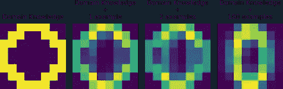
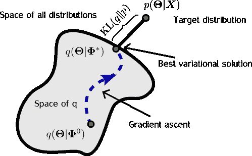
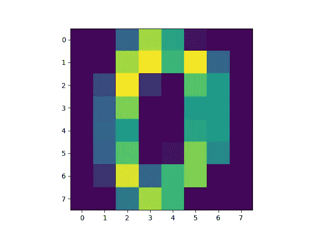
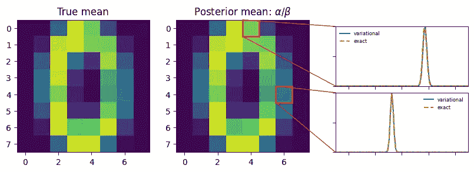
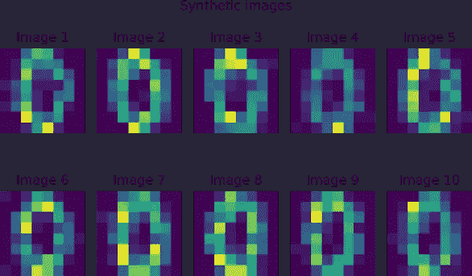

# 变分推断：基础知识

> 原文：[`towardsdatascience.com/variational-inference-the-basics-f70ac511bcea?source=collection_archive---------1-----------------------#2023-06-16`](https://towardsdatascience.com/variational-inference-the-basics-f70ac511bcea?source=collection_archive---------1-----------------------#2023-06-16)

[](https://medium.com/@hylke.donker?source=post_page-----f70ac511bcea--------------------------------)[](https://towardsdatascience.com/?source=post_page-----f70ac511bcea--------------------------------) [Hylke C. Donker](https://medium.com/@hylke.donker?source=post_page-----f70ac511bcea--------------------------------)

·

[关注](https://medium.com/m/signin?actionUrl=https%3A%2F%2Fmedium.com%2F_%2Fsubscribe%2Fuser%2Fea1bfe4db7a8&operation=register&redirect=https%3A%2F%2Ftowardsdatascience.com%2Fvariational-inference-the-basics-f70ac511bcea&user=Hylke+C.+Donker&userId=ea1bfe4db7a8&source=post_page-ea1bfe4db7a8----f70ac511bcea---------------------post_header-----------) 发表在 [数据科学前沿](https://towardsdatascience.com/?source=post_page-----f70ac511bcea--------------------------------) ·9 分钟阅读·2023 年 6 月 16 日[](https://medium.com/m/signin?actionUrl=https%3A%2F%2Fmedium.com%2F_%2Fvote%2Ftowards-data-science%2Ff70ac511bcea&operation=register&redirect=https%3A%2F%2Ftowardsdatascience.com%2Fvariational-inference-the-basics-f70ac511bcea&user=Hylke+C.+Donker&userId=ea1bfe4db7a8&source=-----f70ac511bcea---------------------clap_footer-----------)

--

[](https://medium.com/m/signin?actionUrl=https%3A%2F%2Fmedium.com%2F_%2Fbookmark%2Fp%2Ff70ac511bcea&operation=register&redirect=https%3A%2F%2Ftowardsdatascience.com%2Fvariational-inference-the-basics-f70ac511bcea&source=-----f70ac511bcea---------------------bookmark_footer-----------)

我们生活在量化的时代。然而，严格的量化比说起来容易做起来难。在生物等复杂系统中，数据的收集可能既困难又昂贵。而在医疗和金融等高风险应用中，考虑不确定性至关重要。变分推断——一种处于人工智能研究前沿的方法——是一种解决这些问题的方式。

本教程将介绍变分推断的基础知识：何时、为何以及如何使用变分推断。

# 变分推断何时有用？

变分推断在以下三个密切相关的用例中非常有吸引力：

1\. 如果你拥有少量数据（即观察值较少），

2\. 如果你关心不确定性，

3\. 用于生成建模。

我们将在我们的实例中讨论每种用例。

## 1\. 变分推断与少量数据



图 1：变分推断允许你在领域知识与样本信息之间进行权衡。图像由作者提供。

有时候，数据收集是昂贵的。例如，DNA 或 RNA 测量每次观察可能会花费几千欧元。在这种情况下，你可以用领域知识代替额外的样本进行硬编码。变分推断可以帮助你在收集更多样本时系统性地“减少”领域知识，并更多地依赖于数据（见图 1）。

## 2\. 不确定性的变分推断

对于安全关键型应用，如金融和医疗保健，确定性很重要。不确定性可以影响模型的所有方面，最明显的是预测输出。模型的参数（例如权重和偏置）则不那么明显。你可以将参数赋予一个分布，使其变得模糊，而不是通常的数字数组——权重和偏置。变分推断允许你推断出合理值的范围。

## 3\. 用于生成建模的变分推断

生成模型提供了数据生成的完整规范。例如，如何生成猫或狗的图像。通常，有一个潜在表示 ***z*** 具有语义意义（例如，***z*** 描述了一只暹罗猫）。通过一系列（非线性）变换和采样步骤，***z*** 被转换为实际的图像 ***x***（例如，暹罗猫的像素值）。变分推断是一种推断和从潜在语义空间 ***z*** 进行采样的方法。一个著名的例子是 [变分自编码器](https://en.wikipedia.org/wiki/Variational_autoencode)。

# 变分推断是什么？

从本质上讲，变分推断是一种贝叶斯方法[1]。从贝叶斯的角度来看，你仍然让机器像往常一样从数据中学习。不同的是，你给模型一个提示（[先验](https://en.wikipedia.org/wiki/Prior_probability)），并允许解（[后验](https://en.wikipedia.org/wiki/Posterior_probability)）变得更加模糊。更具体地说，假设你有一个训练集 ***X =* [*x***₁, ***x***₂,..,***x****ₘ*]ᵗ，共有 *m* 个样本。我们使用贝叶斯定理：

*p*(***Θ***|***X***) ***=*** *p*(***X***|***Θ***)*p*(***Θ***) /*p*(***X****),*

推断一个范围——一个分布——的解决方案***Θ***。这与传统的机器学习方法形成对比，后者通过最小化损失 *ℒ(****Θ, X****) =* ln *p*(***X***|***Θ***)来寻找一个特定的解决方案***Θ****。贝叶斯推断的核心在于找到一种方法来确定 *p*(***Θ***|***X***): 给定训练集 ***X*** 的参数 ***Θ*** 的*后验*分布。一般来说，这是一个困难的问题。实际上，有两种方法用于求解 *p*(***Θ***|***X***): (i) 使用模拟（[马尔科夫链蒙特卡罗](https://en.wikipedia.org/wiki/Markov_chain_Monte_Carlo)）或 (ii) 通过优化。

变分推断涉及选项 (ii)。

## 证据下界（ELBO）



图 2: **变分推断的示意图。** 我们寻找一个接近 p(Θ|X) 的分布 q(Θ)。图像由作者提供。

变分推断的核心思想是寻找一个分布 *q*(***Θ***)，作为 *p*(***Θ***|***X***) 的替代（代理）。然后我们尝试通过改变 ***Φ*** 的值，使 *q*[***Θ|Φ***(***X***)] 看起来类似于 *p*(***Θ***|***X***)(见图 2)。这通过最大化证据下界（ELBO）来完成：

*ℒ*(***Φ***) *=* E[ln *p*(***X***,***Θ***) — ln *q*(***Θ|Φ***)],

其中期望 E[·] 是对 *q*(***Θ|Φ***) 进行的。 （注意 ***Φ*** 隐式依赖于数据集 ***X***，但为了方便书写，我们将忽略这一显式依赖。）

对 *ℒ* 进行基于梯度的优化时，乍一看，我们必须在对 ***Φ*** 求导时小心，因为 E[·] 对 *q*(***Θ|Φ***) 的依赖。幸运的是，像 [JAX](https://jax.readthedocs.io/en/latest/) 这样的自动梯度包支持重参数化技巧 [2]，允许你直接从随机样本（例如伽马分布的样本）中进行求导，而无需依赖高方差的黑箱变分方法 [3]。简而言之：使用一批 **[*Θ***₁, ***Θ***₂,..] ~ *q*(***Θ|Φ***) 来估计 ∇ℒ(Φ)，然后让你的自动梯度包处理细节。

# 从头开始进行变分推断



图 3: 来自 scikit-learn 的手写“零”的示例图像。图像由作者提供。

为了巩固我们的理解，让我们从头开始使用 [JAX](https://jax.readthedocs.io/en/latest/) 实现变分推断。在这个例子中，你将对来自 [scikit-learn](https://scikit-learn.org/) 的手写数字进行生成模型训练。你可以按照 [Colab notebook](https://colab.research.google.com/drive/1NPZfRkhrFfX8flbUJqfgKZ2z1w5JXs1R?usp=sharing) 进行操作。

为了简单起见，我们将只分析数字“零”。

```py
from sklearn import datasets

digits = datasets.load_digits()
is_zero = digits.target == 0
X_train = digits.images[is_zero]

# Flatten image grid to a vector.
n_pixels = 64  # 8-by-8.
X_train = X_train.reshape((-1, n_pixels))
```

每张图像是一个 8x8 的离散像素值数组，范围从 0 到 16。由于像素是计数数据，我们使用 [泊松分布](https://en.wikipedia.org/wiki/Poisson_distribution) 和伽马 *先验* 来对像素 ***x*** 进行建模，其中 ***Θ*** 是速率参数。速率 ***Θ*** 决定了像素的平均强度。因此，*联合分布* 为：

*p*(***x***,***Θ***) ***=*** 泊松(***x***|***Θ***)伽马(***Θ***|***a***, ***b***),

其中 ***a*** 和 ***b*** 是 [伽马分布](https://en.wikipedia.org/wiki/Gamma_distribution) 的形状参数和速率参数。


图 4: 使用数字“零”的领域知识作为先验。图像由作者提供。

先验——在这种情况下是 Gamma(***Θ***|***a***, ***b***)——是你注入领域知识的地方（用例 1）。例如，你可能对“平均”的数字零是什么样子有一些想法（见图 4）。你可以使用这些 *a priori* 信息来指导你选择 ***a*** 和 ***b***。为了使用图 4 作为先验信息——我们称之为 ***x***₀——并将其重要性作为两个例子来加权，然后设置 ***a*** = 2***x***₀； **b** = 2。

用 Python 写出来的代码如下：

```py
import jax.numpy as jnp
import jax.scipy as jsp

# Hyperparameters of the model.
a = 2\. * x_domain_knowledge
b = 2.

def log_joint(θ):
  log_likelihood = jnp.sum(jsp.stats.gamma.logpdf(θ, a, scale=1./b))
  log_likelihood += jnp.sum(jsp.stats.poisson.logpmf(X_train, θ))
  return log_likelihood
```

请注意，我们使用了 [JAX](https://jax.readthedocs.io/) 实现的 numpy 和 scipy，以便我们可以进行求导。

接下来，我们需要选择一个替代分布 *q*(***Θ|Φ***)。提醒一下，我们的目标是改变 ***Φ*** 使得替代分布 *q*(***Θ|Φ***) 匹配 *p*(***Θ|X***)。因此，*q*(***Θ***) 的选择决定了近似的水平（我们在上下文允许的地方省略对 ***Φ*** 的依赖）。为了说明问题，我们选择一个由 gamma 分布组成的变分分布：

*q*(***Θ|Φ***) = Gamma(***Θ***|***α***,***β***),

其中我们使用了简写 ***Φ*** = {***α***,***β***}。

接下来，为了实现证据下界 *ℒ*(***Φ***) = E[ln *p*(***X***,***Θ***) — ln *q*(***Θ|Φ***)]，首先写下期望括号内的项：

```py
@partial(vmap, in_axes=(0, None, None))
def evidence_lower_bound(θ_i, alpha, inv_beta):
  elbo = log_joint(θ_i) - jnp.sum(jsp.stats.gamma.logpdf(θ_i, alpha, scale=inv_beta))
  return elbo
```

在这里，我们使用了 JAX 的 [vmap](https://jax.readthedocs.io/en/latest/_autosummary/jax.vmap.html) 来矢量化函数，以便我们可以在批量 **[*Θ***₁, ***Θ***₂,..,***Θ***₁₂₈]ᵗ 上运行它。

为了完成 *ℒ*(***Φ***) 的实现，我们对变分分布 ***Θ****ᵢ* ~ *q*(***Θ***) 的实现进行平均。

```py
def loss(Φ: dict, key):
  """Stochastic estimate of evidence lower bound."""
  alpha = jnp.exp(Φ['log_alpha'])
  inv_beta = jnp.exp(-Φ['log_beta'])

  # Sample a batch from variational distribution q.
  batch_size = 128
  batch_shape = [batch_size, n_pixels]
  θ_samples = random.gamma(key, alpha , shape=batch_shape) * inv_beta

  # Compute Monte Carlo estimate of evidence lower bound.
  elbo_loss = jnp.mean(evidence_lower_bound(θ_samples, alpha, inv_beta))

  # Turn elbo into a loss.
  return -elbo_loss
```

关于这些参数，有几个要点需要注意：

+   我们将 ***Φ*** 打包为一个字典（或者技术上说是一个 [pytree](https://jax.readthedocs.io/en/latest/pytrees.html)），其中包含 ln(***α***), 和 ln(***β***)。这个技巧确保了 ***α***>0 和 ***β***>0——这是 gamma 分布施加的一个要求——在优化过程中。

+   *loss* 是 ELBO 的随机估计。在 JAX 中，我们每次采样时都需要一个新的伪随机数生成器（PRNG）*key*。在这种情况下，我们使用 *key* 采样 **[*Θ***₁, ***Θ***₂,..,***Θ***₁₂₈]ᵗ。

这完成了模型 *p*(***x***,***Θ***)、变分分布 *q*(***Θ***) 和损失 *ℒ*(***Φ***) 的规范说明。

## 模型训练

接下来，我们通过改变 ***Φ*** = {***α***,***β***} 来最小化损失 *ℒ*(***Φ***)，使 *q*(***Θ|Φ***) 匹配后验 *p*(***Θ***|***X***)。怎么做？使用传统的梯度下降法！为了方便，我们使用了 [Optax](https://github.com/deepmind/optax) 中的 Adam 优化器，并用先验 ***α = a*** 和 ***β = b*** 初始化参数 [记住，先验是 Gamma(***Θ***|***a***, ***b***) 并且编码了我们的领域知识]。

```py
# Initialise parameters using prior.
Φ = {
    'log_alpha': jnp.log(a),
    'log_beta': jnp.full(fill_value=jnp.log(b), shape=[n_pixels]),
}

loss_val_grad = jit(jax.value_and_grad(loss))
optimiser = optax.adam(learning_rate=0.2)
opt_state = optimiser.init(Φ)
```

在这里，我们使用[*value_and_grad*](https://jax.readthedocs.io/en/latest/_autosummary/jax.value_and_grad.html)同时评估 ELBO 及其导数。这对于监控收敛非常方便！然后我们使用[*jit*](https://jax.readthedocs.io/en/latest/jax-101/02-jitting.html)*)* 即时编译结果函数，使其更加高效。

最终，我们将训练模型 5000 步。由于*损失*是随机的，对于每次评估，我们需要为其提供一个伪随机数生成器（PRNG）密钥。我们通过分配 5000 个密钥来实现这一点，使用[随机拆分](https://jax.readthedocs.io/en/latest/_autosummary/jax.random.split.html)。

```py
n_iter = 5_000
keys = random.split(random.PRNGKey(42), num=n_iter)

for i, key in enumerate(keys):
  elbo, grads = loss_val_grad(Φ, key)
  updates, opt_state = optimiser.update(grads, opt_state)
  Φ = optax.apply_updates(Φ, updates)
```

恭喜！你已经成功地使用变分推断训练了第一个模型！

你可以通过[这里在 Colab 上](https://colab.research.google.com/drive/1NPZfRkhrFfX8flbUJqfgKZ2z1w5JXs1R?usp=sharing)访问包含完整代码的笔记本。

## 结果



图 5：变分分布与精确后验分布的比较。图片来源：作者。

让我们退一步欣赏一下我们所构建的（图 5）。对于每个像素，替代的 *q*(***Θ***) 描述了关于平均像素强度的 uncertainty（用例 2）。特别地，我们选择的 *q*(***Θ***) 捕捉了两个互补的元素：

+   典型的像素强度。

+   图像间强度的变化程度（变异性）。

结果表明，我们选择的联合分布 *p*(***x***,***Θ***) 有一个精确的解：

*p*(***Θ|X) =*** Gamma(***Θ***|***a +*** Σ***x***ᵢ, *m* + ***b***),

其中 *m* 是训练集中样本的数量 ***X***。在这里，我们可以明确看到领域知识——以 **a** 和 **b** 形式体现——在我们收集更多样本 ***x***ᵢ 时如何被调节。

我们可以轻松比较学到的形状 ***α*** 和速率 ***β*** 与真实值 ***a +*** Σ***x***ᵢ 和 *m* + ***b***。在图 5 中，我们比较了两个特定像素的分布——*q*(***Θ|Φ***) 与 *p*(***Θ|X) —***。结果令人惊叹，完美匹配！

## 附加：生成合成图像



图 6：使用变分推断生成的合成图像。图片来源：作者。

变分推断非常适合生成建模（用例 3）。有了替代后验 *q*(***Θ***)，生成新的合成图像是简单的。两步过程是：

+   样本像素强度 ***Θ ~*** *q*(***Θ***).

```py
# Extract parameters of q.
alpha = jnp.exp(Φ['log_alpha'])
inv_beta = jnp.exp(-Φ['log_beta'])

# 1) Generate pixel-level intensities for 10 images.
key_θ, key_x = random.split(key)
m_new_images = 10
new_batch_shape = [m_new_images, n_pixels]
θ_samples = random.gamma(key_θ, alpha , shape=new_batch_shape) * inv_beta
```

+   使用 ***x*** ~ 泊松(***x***|***Θ***) 采样图像。

```py
# 2) Sample image from intensities.
X_synthetic = random.poisson(key_x, θ_samples)
```

你可以在图 6 中看到结果。请注意，“零”字符的锐度稍逊于预期。这是我们建模假设的一部分：我们将像素建模为相互独立而非相关。要考虑像素相关性，你可以扩展模型以聚类像素强度：这称为泊松分解[4]。

# 摘要

在本教程中，我们介绍了变分推断的基础知识，并将其应用于一个玩具示例：学习手写数字零。得益于自动求导，从头实现变分推断只需几行 Python 代码。

变分推断在数据较少的情况下特别强大。我们展示了如何融合和权衡领域知识与数据中的信息。推断的替代分布 *q*(***Θ***) 提供了模型参数的“模糊”表示，而不是一个固定值。如果你处于一个不确定性重要的高风险应用中，这种方法是理想的！最后，我们展示了生成模型。只要你能从 *q*(***Θ***) 中采样，生成合成样本就很容易。

总结来说，通过利用变分推断的力量，我们可以解决复杂问题，使我们能够做出明智的决策、量化不确定性，并最终释放数据科学的真正潜力。

## 致谢

我想感谢 Dorien Neijzen 和 [Martin Banchero](https://medium.com/u/3c052f2ab36b?source=post_page-----f70ac511bcea--------------------------------) 的校对。

## 参考文献：

[1] Blei, David M., Alp Kucukelbir, 和 Jon D. McAuliffe. “[变分推断：统计学家的综述.](https://doi.org/10.1080/01621459.2017.1285773)” *美国统计协会杂志* 112.518 (2017): 859–877.

[2] Figurnov, Mikhail, Shakir Mohamed, 和 Andriy Mnih. “[隐式重新参数化梯度.](https://proceedings.neurips.cc/paper/2018/file/92c8c96e4c37100777c7190b76d28233-Paper.pdf)” 《神经信息处理系统进展》 31 (2018).

[3] Ranganath, Rajesh, Sean Gerrish, 和 David Blei. “[黑箱变分推断](http://proceedings.mlr.press/v33/ranganath14.pdf).” *人工智能与统计学*. PMLR, 2014.

[4] Gopalan, Prem, Jake M. Hofman, 和 David M. Blei. “[可扩展推荐与泊松分解.](https://arxiv.org/abs/1311.1704)” *arXiv 预印本 arXiv:1311.1704* (2013).
