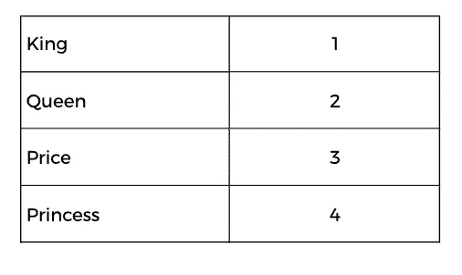
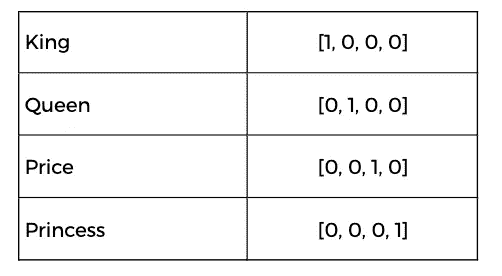
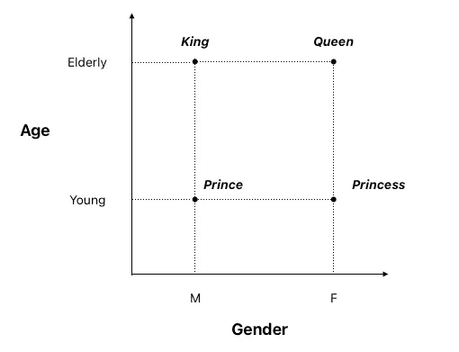
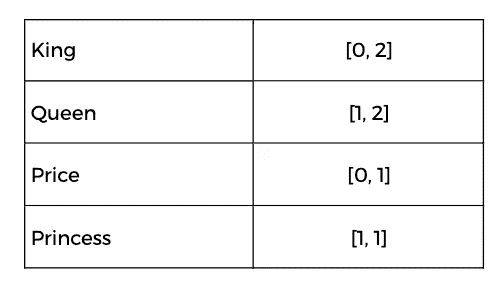

# 机器学习中的向量表示

> 原文：[`towardsdatascience.com/vector-representations-for-machine-learning-5047c50aaeff`](https://towardsdatascience.com/vector-representations-for-machine-learning-5047c50aaeff)

## *数据科学家如何将现实世界的对象转换为数值表示以开发机器学习模型*

[](https://medium.com/@theDrewDag?source=post_page-----5047c50aaeff--------------------------------)[](https://towardsdatascience.com/?source=post_page-----5047c50aaeff--------------------------------) [安德烈亚·达戈斯提诺](https://medium.com/@theDrewDag?source=post_page-----5047c50aaeff--------------------------------)

·发表于 [Towards Data Science](https://towardsdatascience.com/?source=post_page-----5047c50aaeff--------------------------------) ·8 分钟阅读·2023 年 4 月 25 日

--


照片由 [Sigmund](https://unsplash.com/@sigmund?utm_source=medium&utm_medium=referral) 提供，来自 [Unsplash](https://unsplash.com/?utm_source=medium&utm_medium=referral)

机器学习工程师利用世界的数值表示来构建和训练预测算法。

在监督学习的背景下，这些表示方式使计算机能够学习它们与目标变量之间的关系。

假设一个向量仅仅是一个数字列表。

```py
X = [1, 2, 3, 4, 5]
```

这个列表与目标变量 `y` 相关。

```py
X = [1, 2, 3, 4, 5]; y = 1
```

机器学习模型学习特征与目标之间的关系，并输出预测——在这种情况下，是一种将一个类别标识为数字 1 的分类。

在这篇文章中，**我将写关于如何使用向量以数值格式表示复杂概念。**

> 其理论基础是机器学习模型无法从以非数值格式提供的观察数据中学习。

文本、图像、声音和其他输入观察数据必须首先转化为适合学习的数值格式。

有多种技术可以将现象转化为向量，这取决于我们处理的数据类型。

+   我们将从介绍**One-Hot 编码**的概念开始，这是一种用于将单词表示为数值向量的技术。

+   接下来，我们将探讨这种技术的局限性，并介绍**嵌入**的概念，这是一种可以将单词、图像、声音等表示为比 One-Hot 编码所需的成千上万个类别更小的数值向量的技术。

+   我们还将提到**TF-IDF 和词袋模型**，它们在文本向量化中至关重要。

# 我们如何将现象编码为向量？

我们将以文本为例继续讨论。这个例子非常明显，因为正如我们所猜测的那样，机器学习模型不能直接使用文本进行学习。我们需要首先将每个字符或词汇转换为数字。

假设我们想创建词汇的数值表示

+   国王

+   皇后

+   王子

+   公主

对这些词汇进行编码的最简单方法是依次为每个词汇分配一个数字。



作者提供的图片

词汇已正确转换为数值格式，按照映射关系

```py
map = {
 "King": 1,
 "Queen": 2,
 "Prince": 3,
 "Princess": 4
}
```

但有一个问题。如果我们将这些数据提供给任何预测模型，**它会为王子和公主分配更高的数学值，使它们比国王和皇后更重要。**

显然，这将为模型提供错误的信息，导致模型学习错误的关系。我们需要使我们的数值表示更为精确。

## One-Hot Encoding

为了解决上述数值表示问题，可以使用**One-Hot Encoding**技术。

在这种情况下，每个词将由一个数值向量表示，向量的大小等于需要表示的词总数。**该向量的所有值都为零，只有一个值表示特定的词。**

例如，对于“国王”、“皇后”、“王子”和“公主”这四个词，每个词将由一个包含四个元素的数组表示，其中值“1”在对应于该词的位置，所有其他位置的值为“0”。

该技术解决了在数值表示中为词汇分配更高数学值的问题，这些词汇在数量上并不比其他词汇更重要。



作者提供的图片

现在，我们的模型为数据集中每个词（在此案例中仅包含 4 个词）具有“平衡”的向量表示。

但是……**如果我们的词汇表由成千上万甚至数百万个词汇组成呢**？考虑到意大利词典中大约有 270,000 个词汇，应用 One-Hot Encoding 至少会有问题。

执行这种编码所需的计算资源将是相当可观的，最终的表示将是“仅仅”平衡的：*没有关于词汇之间关系的信息。*

## 嵌入

为了克服 One-Hot Encoding 的局限性，可以使用称为**嵌入**的技术。这允许将词汇表示为可控大小的数值向量，相较于 One-Hot Encoding 所需的成千上万的类别。

其想法是创建一个数值表示词汇的方式，这种表示方式考虑了**词汇之间的语义关系。**

实际上，每个词汇都表示为一个实数向量，其中每个维度表示词义的不同方面。

> 理解嵌入很简单：相关的单词应该在向量空间中靠得很近，而不相关的单词则应该相距较远。

让我们尝试创建一个图表，捕捉前面提到的一些单词特征。



作者提供的图像

我们可以看到*王子*和*公主*的词语彼此多么接近，就像*国王*和*女王*一样。

假设性别变量只能取两个值，M 和 F（我们使用 0 和 1），而年龄变量只能取三个值[年轻、中年、老年]（我们使用 0、1、2），我们可以看到嵌入如何表示这些关系。



作者提供的图像

这种表示通过使用性别和年龄维度，成功捕捉了个体的贵族地位。

在 X 轴上移动，我们可以观察到这两个贵族如何在表示性别差异的维度上等距（0：男性，1：女性）。而在 Y 轴上移动，我们可以观察到年龄是如何通过嵌入距离 Y 轴的方式来表示的。

这样，**词嵌入可以作为机器学习模型的输入，使得复杂的概念能以数字格式更准确地表示**。

在这个例子中我们只有两个维度。实际上，神经网络是通过特定任务来训练的，以在多个维度上找到这些表示。

为了更好地理解，**像 GPT-3 这样的模型使用了超过 12,000 维**。

## 行业的一个里程碑

嵌入表示不仅可以用于单词，还可以用于表示图像、声音等。

向量表示的使用在当今的机器学习中至关重要。深度学习领域的各种创新和技术源于向量化的概念。

> 像 GPT-3.5 这样的模型通过结合向量表示、经过充分研究的优化算法和大量计算资源而产生。

理论上，这种方法没有限制。

**更多的数据 → 更高质量的向量 → 使用这些向量的模型进行更好的训练。**

## 嵌入的局限性

尽管嵌入是一种非常有用的技术，用于以数字格式表示复杂概念，但它们也有局限性。

特别重要的是要强调，嵌入是从训练数据中构建的，**因此可能会受到数据中任何偏见的影响**。

如前所述，嵌入的质量取决于训练数据的质量。如果训练数据不代表模型将使用的领域，嵌入可能无法捕捉概念之间所有的语义关系。

此外，嵌入可能需要大量的内存来存储，特别是当维度数量很大时。这对于需要在资源受限的设备上运行的机器学习模型，尤其是移动设备，可能特别有问题。

# 其他文本表示方式

由于文本是我们周围最常见的数据格式（只需想到互联网上大量的文本数据），一些文本向量化技术是常见且众所周知的。

其中之一是**TF-IDF 转换**，这是一种文本向量化技术，根据词在文档中的频率及其在语料库中的总体频率，为每个词分配一个权重。

这样，文档中出现频率较高但在语料库中出现频率较低的词汇将比那些在各处频繁出现的词汇具有更高的权重。这种技术在自然语言处理领域用于文本分析中被广泛使用。

我邀请有兴趣的读者通过阅读以下文章来了解更多关于 TF-IDF 模型的知识

[## Text Clustering with TF-IDF in Python](https://medium.com/mlearning-ai/text-clustering-with-tf-idf-in-python-c94cd26a31e7?source=post_page-----5047c50aaeff--------------------------------)

### 文本聚类的简单管道解释。完整示例和代码

[medium.com](https://medium.com/mlearning-ai/text-clustering-with-tf-idf-in-python-c94cd26a31e7?source=post_page-----5047c50aaeff--------------------------------)

TF-IDF 基于**词袋模型，该模型将文档表示为一个无序的词汇集合，忽略句子结构和词序。**

通过这种方式，词袋模型可以用来表示任何文档为一组数值，其中每个数值代表一个词在文档中的频率。当然，这并不能充分表示词汇之间的关系，这一点由词嵌入（embeddings）提供。

# 结论

在这篇文章中，我们已经看到如何使用向量以数字格式表示复杂的概念。

对数据科学家来说，以向量化的方式思考是重要的。像这样的疑问

+   *我如何将这个刺激转换成一个数字？*

+   *神经网络如何解释这些数据？*

+   *我如何改善这个表示？*

这些问题至关重要，能够充分回答这些问题的团队将创造出更好的系统。

数据科学家从向量的角度看待世界。

**如果你想支持我的内容创作活动，请随意通过下面的推荐链接加入 Medium 的会员计划**。我将获得你投资的一部分，你将能够无缝访问 Medium 上丰富的数据科学及更多领域的文章。

[## Join Medium with my referral link - Andrea D'Agostino](https://medium.com/@theDrewDag/membership?source=post_page-----5047c50aaeff--------------------------------)

### 阅读 Andrea D'Agostino（以及 Medium 上的其他数千位作家的）每个故事。你的会员费直接……

[medium.com](https://medium.com/@theDrewDag/membership?source=post_page-----5047c50aaeff--------------------------------)

# 推荐阅读

对于有兴趣的人，这里是我推荐的每个机器学习相关主题的书单。这些书籍在我看来是**必读**的，并且对我的职业生涯产生了深远的影响。

*免责声明：这些是亚马逊的附属链接。我将从亚马逊那里获得少量佣金作为推荐费。您的体验不会改变，您不会被收取额外费用，但这将帮助我扩大业务并制作更多有关人工智能的内容。*

+   **机器学习简介：** [*自信的数据技能：掌握数据处理的基本知识，提升你的职业生涯*](https://amzn.to/3ZzKTz6) 由 Kirill Eremenko 编著

+   **Sklearn / PyTorch：** [*用 PyTorch 和 Scikit-Learn 进行机器学习：使用 Python 开发机器学习和深度学习模型*](https://amzn.to/3Gcavve) 由 Sebastian Raschka 编著

+   **Sklearn / TensorFlow：** [*动手实践机器学习：使用 Scikit-Learn、Keras 和 TensorFlow*](https://amzn.to/433F4Nm) 由 Aurelien Géron 编著

+   **自然语言处理：** [*文本作为数据：机器学习与社会科学的新框架*](https://amzn.to/3zvH43j) 由 Justin Grimmer 编著

+   **数据可视化：** [*用数据讲故事：商务专业人士的数据可视化指南*](https://amzn.to/3HUtGtB) 由 Cole Knaflic 编著

# 有用的链接（由我编写）

+   **学习如何在 Python 中进行顶级探索性数据分析：** *Python 中的探索性数据分析 — 分步过程*

+   **学习 PyTorch 的基础知识：** *PyTorch 入门：从训练循环到预测*

+   **学习 TensorFlow 的基础知识：** [*入门 TensorFlow 2.0 — 深度学习简介*](https://medium.com/towards-data-science/a-comprehensive-introduction-to-tensorflows-sequential-api-and-model-for-deep-learning-c5e31aee49fa)

+   **使用 TF-IDF 在 Python 中进行文本聚类：** [*使用 TF-IDF 在 Python 中进行文本聚类*](https://medium.com/mlearning-ai/text-clustering-with-tf-idf-in-python-c94cd26a31e7)
