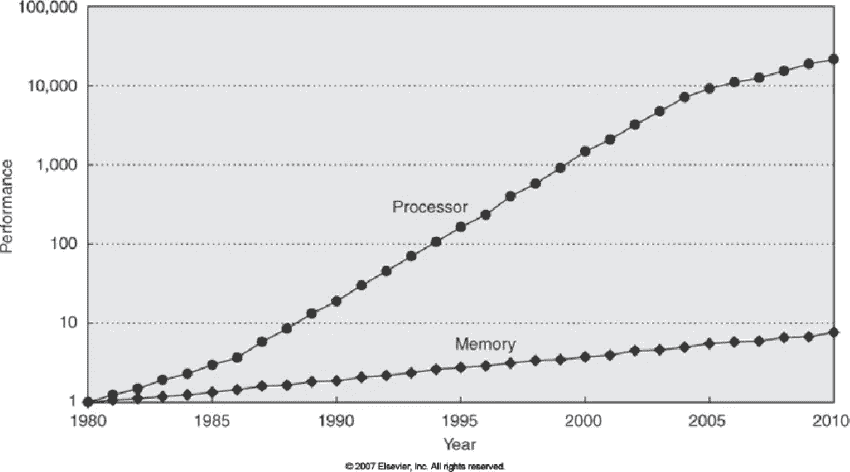
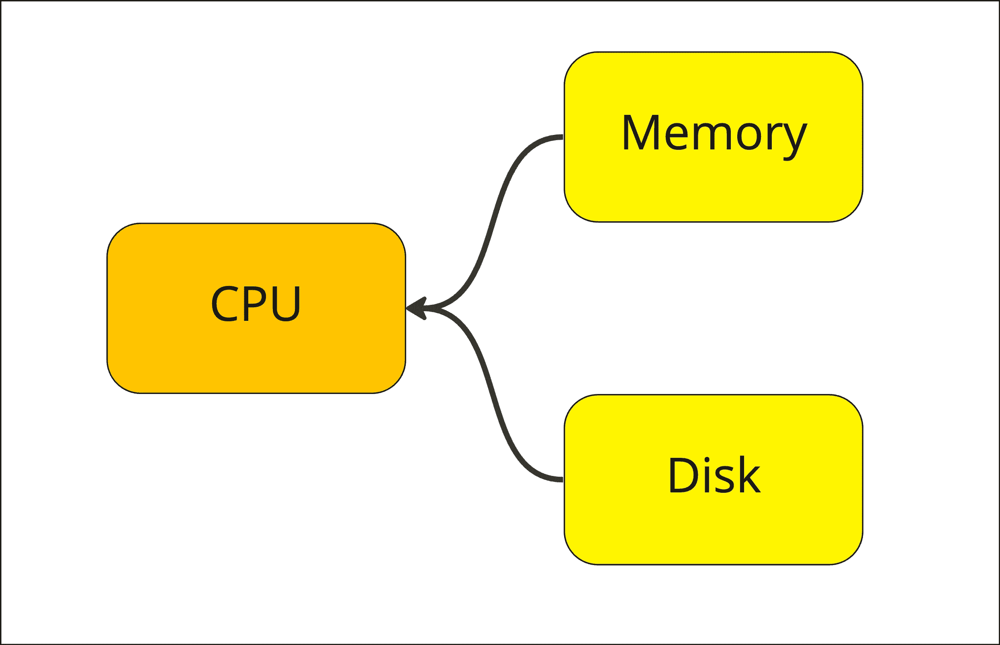
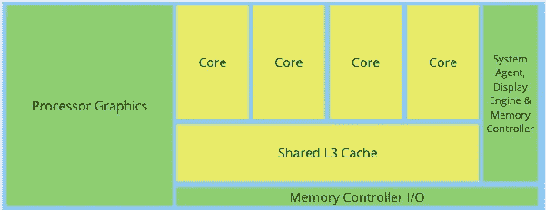

# 向量化：是什么以及它是如何工作的？

> 原文：[`towardsdatascience.com/vectorisation-what-is-it-and-how-does-it-work-1dd9cef48407?source=collection_archive---------6-----------------------#2023-04-13`](https://towardsdatascience.com/vectorisation-what-is-it-and-how-does-it-work-1dd9cef48407?source=collection_archive---------6-----------------------#2023-04-13)


图片由[Mariana Beltrán](https://unsplash.com/ja/@ostranenie?utm_source=unsplash&utm_medium=referral&utm_content=creditCopyText)提供，来自[Unsplash](https://unsplash.com/s/photos/greek-columns?utm_source=unsplash&utm_medium=referral&utm_content=creditCopyText)

## O(n)比 O(1)更快，缓存行，Pandas 2.0 和列的持续增长

[](https://markjamison03.medium.com/?source=post_page-----1dd9cef48407--------------------------------)[](https://towardsdatascience.com/?source=post_page-----1dd9cef48407--------------------------------) [Mark Jamison](https://markjamison03.medium.com/?source=post_page-----1dd9cef48407--------------------------------)

·

[关注](https://medium.com/m/signin?actionUrl=https%3A%2F%2Fmedium.com%2F_%2Fsubscribe%2Fuser%2F19b7fdef1d09&operation=register&redirect=https%3A%2F%2Ftowardsdatascience.com%2Fvectorisation-what-is-it-and-how-does-it-work-1dd9cef48407&user=Mark+Jamison&userId=19b7fdef1d09&source=post_page-19b7fdef1d09----1dd9cef48407---------------------post_header-----------) 发布在 [Towards Data Science](https://towardsdatascience.com/?source=post_page-----1dd9cef48407--------------------------------) ·10 min read·Apr 13, 2023[](https://medium.com/m/signin?actionUrl=https%3A%2F%2Fmedium.com%2F_%2Fvote%2Ftowards-data-science%2F1dd9cef48407&operation=register&redirect=https%3A%2F%2Ftowardsdatascience.com%2Fvectorisation-what-is-it-and-how-does-it-work-1dd9cef48407&user=Mark+Jamison&userId=19b7fdef1d09&source=-----1dd9cef48407---------------------clap_footer-----------)

--

[](https://medium.com/m/signin?actionUrl=https%3A%2F%2Fmedium.com%2F_%2Fbookmark%2Fp%2F1dd9cef48407&operation=register&redirect=https%3A%2F%2Ftowardsdatascience.com%2Fvectorisation-what-is-it-and-how-does-it-work-1dd9cef48407&source=-----1dd9cef48407---------------------bookmark_footer-----------)

这是本文的第二次迭代。在完成第一次迭代后，我让它静置一段时间进行编辑，因为标题看起来不太好——一个关于向量化的 13 分钟长篇，其中包含与数据库理论和历史趋势的松散联系。

在等待重新草拟时，我发现了几个关于新版本 Pandas 2.0 的性能比较——尤其是与 Polars 的比较。此时我必须坦白——Pandas 对我而言是起点，我甚至还没有 `pip install` Polars 进行测试。我总是犹豫在尚未得到广泛支持的新工具和流行工具之间进行替换，直到：

+   现有工具开始失败（我在 SQL 聚合后使用的数据不够大）。

+   有一些其他明显有力的证据支持采用。

然而，新版 Pandas 2.0 性能相对较差确实让我产生了疑问——如果 Polars 在内存操作中如此快速，它是如何实现的？

## Polars 的作者写了我原来的文章（但更好）。

向量化。Polars 之所以快速，是因为原作者设计了整个系统以向量化为核心。在[这篇‘hello world’文章](https://www.pola.rs/posts/i-wrote-one-of-the-fastest-dataframe-libraries/)中，Polars 作者 Ritchie Vink 通过清晰简洁的语言和简单的视觉效果解释了 Polars 如何实现其目标——因为它不仅仅是以向量化为理念进行构建，而是*完全*围绕这些原则构建的。

这篇文章的其余部分并非仅仅是重述那些内容，而是通过回顾一些想法和历史背景，阐明我们如何将基于列（或数组）的计算变得更加‘主流’，以及这如何开始渗透到现代数据科学工具包中。

## “我不在乎你的花哨数据结构是什么，但我知道数组会胜过它。”

上述内容出自[这次讲座](https://www.youtube.com/watch?v=WDIkqP4JbkE)由 Scott Meyers 主讲，他将上述引言归于一位支持数组的算法交易公司 CTO。这个想法在 Polars 文章中也有所提及，但概念相同——在实际应用中，有时你需要抛弃基本的[时间复杂度分析](https://en.wikipedia.org/wiki/Time_complexity)，因为 O(n) 算法可以超越 O(1) 算法。

我来自非计算机科学背景，但大学（特别是美国大学）提供的大量在线材料使我能够学习一些基础的‘算法’和‘数据结构’课程。根据我所见，联合目标可以（可能总结得很糟糕）如下：

+   使用逻辑来提出一个涉及最少步骤（算法）的过程。

+   组织你的数据，以便选择具有最小步骤的算法（数据结构）。

理解两者核心概念的重要性在于众多公司用大量的[Leetcode](https://leetcode.com/)动态规划或二叉搜索树等与日常无关的题目来考察他们的候选人。一个典型的例子是——在查找东西时使用哈希映射而不是数组。这是因为：

+   哈希映射的查找是 O(1)

+   （未排序的）数组是 O(n)，因为你可能需要遍历整个数组

为什么上述情况并不总是成立？因为*“O(1)算法比 O(n)算法更快”*是不完整的。真正的说法应该是*“O(1)算法比 O(n)算法更快，***前提是起始点相同****”*。

## 在纽约驾驶法拉利

现代 CPU 被描述为类似于在纽约驾驶一辆法拉利。毋庸置疑，这个比喻显然来自于一个认为开车唯一目的就是从 A 点到 B 点的计算机科学家，但这一点依然成立。如果你只是不断地停车和启动（尽管停车和启动*非常非常*快），为什么需要这样一辆快车呢？

将‘车’替换为‘处理器’，我们就看到了现代 CPU。这是因为**处理器速度与内存速度之间的相对速度改进（尽管近年来速度提升变得较慢）**。这一点在 Herb Sutter 的[C++导向讲座](https://www.youtube.com/watch?v=L7zSU9HI-6I)中得到了很好的阐述（如果你只想了解概述，可以从 12:00 开始观看约 20 分钟），下面的图表也很好地展示了这一点：



新的向量时代的机会和选择——[ResearchGate 上的科学图](https://www.researchgate.net/figure/CPU-memory-performance-gap-Modelled-after-Computer-Architecture-Hennessy-John-L_fig1_273029990)

简单来说，我们有一个“[摩尔定律](https://en.wikipedia.org/wiki/Moore's_law)引发的”处理器操作速度和将数据送到处理器的速度之间的差距。**如果处理器大部分时间都在空闲等待新数据进行操作，那么就没有必要拥有如此快速的处理器**。

## 我们如何规避这个问题？缓存、缓存和更多缓存

下面是许多人对计算机架构的标准印象（[跳到 Herb Sutter 讲座的 22:30，观看这个有趣的例子](https://www.youtube.com/watch?v=L7zSU9HI-6I)）：



作者提供的图片

换句话说——我们有：

+   我们的 CPU 执行任务

+   我们的内存（或 RAM）‘快速’访问

+   我们的磁盘访问速度慢

如上图所示，内存可能相对于从硬盘检索数据是快的——但相对于我们当前处理器的数量和速度，检索速度确实不快。为了解决这个问题，硬件开发者决定将内存*放置到*CPU（或‘芯片’）上。**这些被称为缓存，每个处理核心都有多个。** 每个核心包括：

+   L1 缓存：这是最快的，并分为指令缓存（存储你代码转化成的指令）和数据缓存（存储你操作的变量）

+   L2 缓存：比 L1 大，但较慢

然后，机器上的所有核心共享一个 L3 缓存——同样比 L1 和 L2 大，但再次较慢。

下图基于来自 Intel 白皮书的放大照片（[Intel 架构基础知识（v.1, Jan. 2014）](https://www.intel.co.uk/content/www/uk/en/intelligent-systems/embedded-systems-training/ia-introduction-basics-paper.html?wapkw=white+paper+introduction+to+intel+architecture)），展示了 Intel i7 处理器的 4 核心 CPU 布局——L1 和 L2 缓存*在*每个‘核心’部分内：



图片由作者提供——原图见此文档：[Intel 架构基础知识（v.1, Jan. 2014）](https://www.intel.co.uk/content/www/uk/en/intelligent-systems/embedded-systems-training/ia-introduction-basics-paper.html?wapkw=white+paper+introduction+to+intel+architecture)

但这同样适用于更新的 PC。我在 Macbook Air M2 上写这篇文章， [在维基百科上快速查阅](https://en.wikipedia.org/wiki/Apple_M2)表明 M2 芯片包含 L1、L2 和一个共享的‘最后一级缓存’（L3）。

## 那么，从缓存中检索数据比从内存中快多少呢？

对此——一图胜千言——或者更具体地说，是一个动画。来自游戏软件优化公司 Overbyte 的以下链接展示了相对性能的极端差异：[`www.overbyte.com.au/misc/Lesson3/CacheFun.html`](http://www.overbyte.com.au/misc/Lesson3/CacheFun.html)。

速度在机器之间有所不同，但——以标准的[‘时钟周期’](https://en.wikipedia.org/wiki/Clock_rate)单位来衡量，我们大致有：

+   L1：~1–3x 时钟周期

+   L2：~10x 时钟周期

+   L3：~40x 时钟周期

+   主内存：~100–300x 时钟周期

换句话说：如果我们的数据在 L1 内存中，我们的计算机会比从主内存中提取数据快 30–300 倍。主内存指的是 RAM，而非硬盘。当你的 CPU 在 L1 缓存中找不到数据时，它会搜索 L2，然后是 L3，最后到主内存**每次这些搜索失败都会标记为‘缓存未命中’。** 缓存未命中越少，你的代码执行越快。

## 那么，我如何将数据加载到缓存中？缓存行

你的 CPU 为你完成了这一切。基于你的代码，这些代码被翻译成指令集（最低级的命令——即使汇编也被汇编成[指令](https://en.wikipedia.org/wiki/Instruction_set_architecture)），你的 CPU 将数据加载到缓存中。然后它对数据进行操作并将结果存储在缓存中。

特别是，如果你定义以下内容：

```py
x = 1
y = 2
x + y
```

你的 CPU 不仅仅是将整数 `x` 和 `y` 加载到缓存中——**它实际上加载的是‘缓存行’。** [缓存行](https://en.algorithmica.org/hpc/cpu-cache/cache-lines/) 是 CPU 处理数据的最底层单位。一个缓存行将包含你需要的数据，但也包括内存中*周围*的其他数据，这些数据构成了整个缓存行——通常是一个 64 字节的连续内存块。

不仅如此，CPU 还被设计来进行聪明的数据优化提取。为什么？因为这很慢——所以我们越早将数据加载到缓存中进行操作，就越早解决数据存储便宜而处理器快速之间的瓶颈。

+   处理器对数据进行操作的速度

+   将数据提供给处理器所需的时间——在缓存中

为了做到这一点，CPU 实现了类似于[预取](https://en.wikipedia.org/wiki/Cache_prefetching)的功能——这意味着识别程序内存访问中的模式，并预测你将会使用哪些内存。

## 总结

可能最好的总结方式是回答（最后）我们最初的问题——什么是向量化？

+   向量化是充分利用你超快处理器的手段

+   它通过将数据组织成可预测的连续块（数组）来完成这一点，这些数据块可以一起加载（缓存行）并进行预取

+   这可以防止你的 CPU 在等待从 L2/L3 缓存[或更糟](https://www.youtube.com/watch?v=HQ47glxcxr0)——主内存中加载数据时无所事事

但为什么是现在？如果这看起来如此明显，为什么这不是一直以来的基础？

## 发生了什么变化？相对的历史进展

之前的计算机科学家并不是愚蠢的（正好相反）而错过了这个显而易见的想法。相反，我们现在正在开发最适合的工具包：

+   我们当前的硬件格局

+   我们当前的使用案例

由于历史进展（上面的摩尔定律图表），我们正处于这样的情况：

+   数据存储便宜而处理器迅速

+   我们有广泛的数据分析使用案例来推动决策制定（无论是自动化还是非自动化）

结果是，由于*相对*的进步，我们现在面临一个瓶颈——将所有这些数据输入到我们超快的处理器中。而且为了清楚起见，这个问题并不新鲜。如上图所示，这已经是一个多年来逐渐扩大的问题，但我们应用了 L1/L2 缓存的权宜之计；因为这意味着大多数人不必担心这个问题。

但是现在差距 *如此* 巨大，数据规模也在不断增长，以至于问题需要在更接近源头的地方解决。**换句话说，如果你想让你的数据以闪电般的速度被操作，那么不要把工作推给 CPU 设计师，而是自己动手，并将数据存储在数组中。**

## Kdb+、Dremel 和 BigQuery，PyArrow

一般来说，当我们处理数据时，通常有两种方式：

+   在内存中

+   在磁盘上

对我来说，这仅仅意味着数据是否一般存储在一个数据 *库* 或者数据 *框架* 中。Polars，以及最近的 Pandas 2.0，未必做了完全新的事情，而是更多地重新设计了我们内存中数据的表示方式，使其更接近于在磁盘上通常的存储方式。

为什么？因为我们在如何以可以快速过滤和汇总的数据存储方式上取得了显著进展——那么为什么不在内存中以能够利用这些进展的方式来表示数据呢？我们完全可以采纳像 [Kdb+](https://code.kx.com/q/) 这样的技术驱动思想，并将其实现于内存数据存储方式中。

## 迈向一致的方法

Polars 基于 PyArrow——这是 [Apache Arrow 内存列式数据格式](https://arrow.apache.org/) 的 Python 实现。新版本的 [Pandas 2.0](https://pandas.pydata.org/docs/user_guide/pyarrow.html#pyarrow-functionality) 也是如此。PyArrow 在从磁盘加载 [Apache Parquet](https://parquet.apache.org/) 格式的数据时表现特别好。Parquet 基本上是原始 [Dremel 论文](https://static.googleusercontent.com/media/research.google.com/en//pubs/archive/36632.pdf) 中描述的列格式。[Dremel](http://www.goldsborough.me/distributed-systems/2019/05/18/21-09-00-a_look_at_dremel/) 是支撑 Google Big Query 的分析引擎。

要点是：这些都是相互关联的概念，最新的内存数据科学工具并不一定是一个彻底的变化，而是朝着一个日益一致的理念迈进，这个理念支撑着我们的数据分析工具。我们将数据存储在数组/列中——**既在磁盘上 *也* 在内存中**。

为什么？因为这是考虑到处理硬件、数据存储成本和内存数据检索速度之间的相对速度改进后，做事的最佳方式。

## 结论：Wes McKinney 的简历

这可能看起来是一个奇怪的结论话题，但通过 Pandas 创始人的职业生涯可以看出上述向语言无关、一致的数据操作和建模方法的轨迹。他最初在 [AQR Capital Management](https://www.aqr.com/) 使用电子表格处理数据，然后创建并推广了 Pandas（利用 NumPy 的向量友好型 [ndarray](https://numpy.org/doc/stable/reference/generated/numpy.ndarray.html)），现在他 [深度参与 Apache Arrow](https://www.youtube.com/watch?v=Hqi_Bw_0y8Q)。

他的职业生涯与现代“数据科学堆栈”（至少在 Python 中）朝着更加面向列的内存数据表示方式的演变紧密相连。看起来数组的推广势不可挡，并且我个人认为这种趋势不会放缓。请原谅这句双关语。
