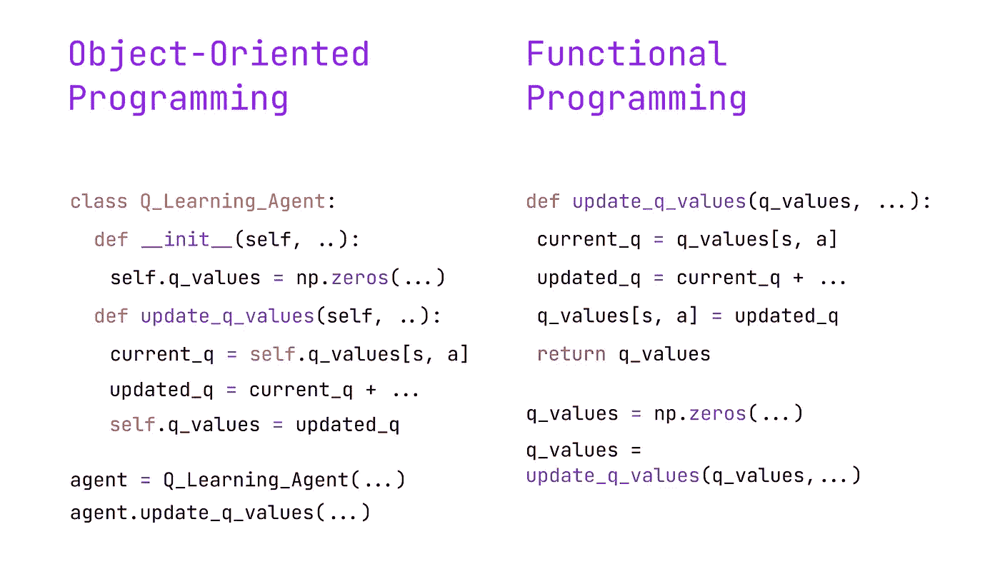
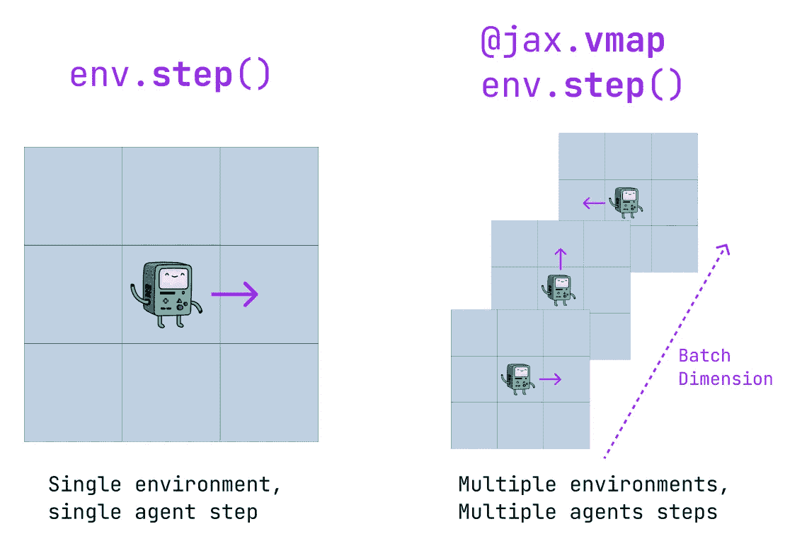
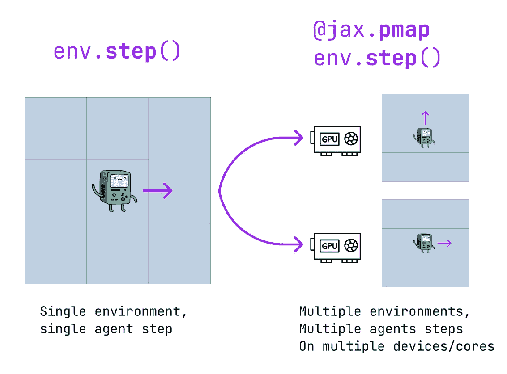
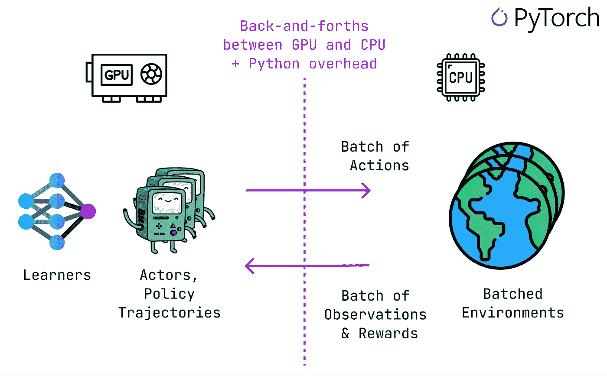
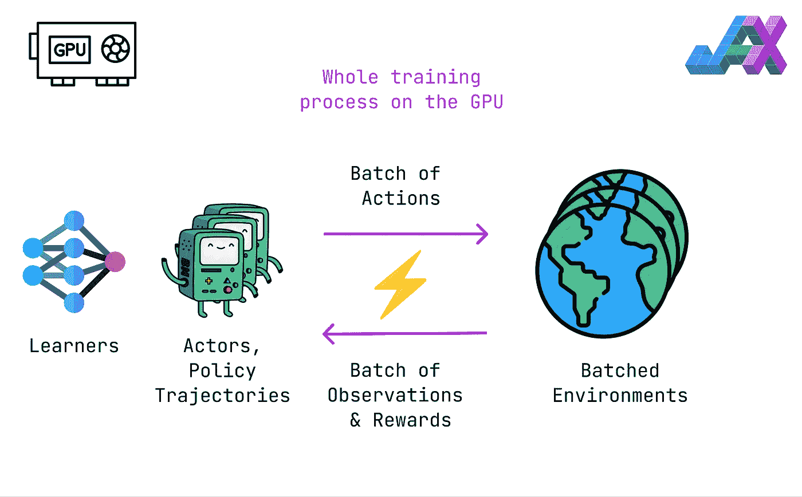
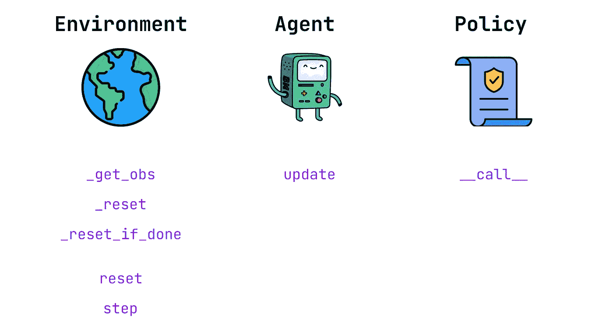
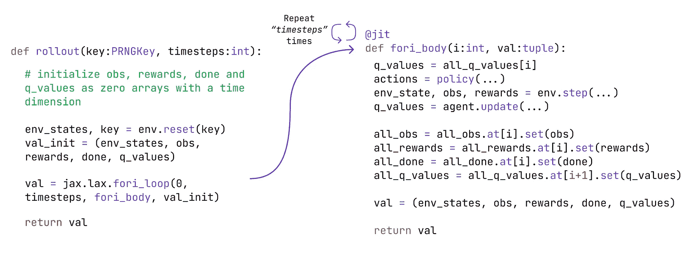

# 使用 JAX 向量化和并行化 RL 环境：以光速进行 Q 学习⚡

> 原文：[`towardsdatascience.com/vectorize-and-parallelize-rl-environments-with-jax-q-learning-at-the-speed-of-light-49d07373adf5?source=collection_archive---------1-----------------------#2023-10-15`](https://towardsdatascience.com/vectorize-and-parallelize-rl-environments-with-jax-q-learning-at-the-speed-of-light-49d07373adf5?source=collection_archive---------1-----------------------#2023-10-15)

## 在这篇文章中，我们学习如何向量化一个 RL 环境，并在 CPU 上并行训练 30 个 Q 学习代理，每秒进行 180 万次迭代。

[](https://medium.com/@ryanpegoud?source=post_page-----49d07373adf5--------------------------------)[](https://towardsdatascience.com/?source=post_page-----49d07373adf5--------------------------------) [Ryan Pégoud](https://medium.com/@ryanpegoud?source=post_page-----49d07373adf5--------------------------------)

·

[关注](https://medium.com/m/signin?actionUrl=https%3A%2F%2Fmedium.com%2F_%2Fsubscribe%2Fuser%2F27fba63b402e&operation=register&redirect=https%3A%2F%2Ftowardsdatascience.com%2Fvectorize-and-parallelize-rl-environments-with-jax-q-learning-at-the-speed-of-light-49d07373adf5&user=Ryan+P%C3%A9goud&userId=27fba63b402e&source=post_page-27fba63b402e----49d07373adf5---------------------post_header-----------) 发表在 [Towards Data Science](https://towardsdatascience.com/?source=post_page-----49d07373adf5--------------------------------) · 11 分钟阅读 · 2023 年 10 月 15 日[](https://medium.com/m/signin?actionUrl=https%3A%2F%2Fmedium.com%2F_%2Fvote%2Ftowards-data-science%2F49d07373adf5&operation=register&redirect=https%3A%2F%2Ftowardsdatascience.com%2Fvectorize-and-parallelize-rl-environments-with-jax-q-learning-at-the-speed-of-light-49d07373adf5&user=Ryan+P%C3%A9goud&userId=27fba63b402e&source=-----49d07373adf5---------------------clap_footer-----------)

--

[](https://medium.com/m/signin?actionUrl=https%3A%2F%2Fmedium.com%2F_%2Fbookmark%2Fp%2F49d07373adf5&operation=register&redirect=https%3A%2F%2Ftowardsdatascience.com%2Fvectorize-and-parallelize-rl-environments-with-jax-q-learning-at-the-speed-of-light-49d07373adf5&source=-----49d07373adf5---------------------bookmark_footer-----------)

图片来源于 [Google DeepMind](https://unsplash.com/fr/@googledeepmind) 的 [Unsplash](https://unsplash.com/fr)

在前面的故事中，我们介绍了**时序差分学习**，特别是**Q 学习**，并将其应用于 GridWorld 的背景中。

[](/temporal-difference-learning-and-the-importance-of-exploration-an-illustrated-guide-5f9c3371413a?source=post_page-----49d07373adf5--------------------------------) ## 时间差分学习和探索的重要性：图解指南

### 在动态网格世界中比较无模型（Q-learning）和有模型（Dyna-Q 和 Dyna-Q+）的 TD 方法。

[towardsdatascience.com

虽然这个实现用于展示这些算法在性能和探索机制上的差异，***但速度非常慢***。

实际上，环境和代理主要使用**Numpy**编写，这在强化学习中并非标准，尽管它使代码易于理解和调试。

在这篇文章中，我们将看到如何通过**向量化环境**和无缝**并行化**数十个代理的训练来扩展强化学习实验。特别地，本文涵盖了：

+   JAX 基础和强化学习的有用功能

+   向量化环境及其高速原因

+   在 JAX 中实现环境、策略和 Q-learning 代理

+   单代理训练

+   如何并行化代理训练，以及这有多简单！

*本文中展示的所有代码均可在* [***GitHub***](https://github.com/RPegoud)*上找到：*

[](https://github.com/RPegoud/jym?source=post_page-----49d07373adf5--------------------------------) [## GitHub - RPegoud/jym: JAX 实现的 RL 算法和向量化环境

### JAX 实现的 RL 算法和向量化环境 - GitHub - RPegoud/jym: JAX 实现的 RL…

github.com](https://github.com/RPegoud/jym?source=post_page-----49d07373adf5--------------------------------)

# JAX 基础

JAX 是 Google 开发的*另一种*Python 深度学习框架，被 DeepMind 等公司广泛使用。

> “JAX 是[Autograd](https://github.com/hips/autograd)（自动微分）和[XLA](https://www.tensorflow.org/xla)（加速线性代数，TensorFlow 编译器）的结合，旨在实现高性能数值计算。” — [官方文档](https://jax.readthedocs.io/en/latest/index.html)

与大多数 Python 开发人员习惯的不同，JAX 不采用**面向对象编程**（OOP）范式，而是采用**函数式编程（FP）[1]**。

简而言之，它依赖于***纯函数***（**确定性**和**无副作用**）以及***不可变的数据结构*（**不是在原地修改数据，而是**创建具有所需修改的新数据结构**）作为主要构建块。因此，FP 鼓励一种更具函数性和数学性的编程方法，使其非常适合于数值计算和机器学习任务。

让我们通过查看 Q 更新函数的伪代码来说明这两种范式之间的差异：

+   **面向对象** 方法依赖于一个包含各种 ***状态变量***（如 Q 值）的 ***类实例***。更新函数被定义为一个类方法，它 **更新实例的 *内部状态***。

+   **函数式编程** 方法依赖于 ***纯函数***。实际上，这个 Q 更新是 **确定性的**，因为 Q 值作为参数传递。因此，对这个函数的任何调用只要 **输入相同** 就会产生 **相同的输出**，而类方法的输出可能依赖于实例的内部状态。此外，**数据结构** 如数组在 **全局范围** 内被 **定义** 和 **修改**。



在 **面向对象编程** 和 **函数式编程** 中实现 Q 更新（作者制作）

因此，JAX 提供了各种 **函数装饰器**，在 RL 的上下文中尤为有用：

+   [**vmap**](https://jax.readthedocs.io/en/latest/_autosummary/jax.vmap.html#jax.vmap) **（向量化映射）**：允许作用于单个样本的函数应用于一个 **批次**。例如，如果 *env.step()* 是一个在单个环境中执行一步的函数，那么 *vmap(env.step)()* 是一个在 **多个环境** 中执行一步的函数。换句话说，vmap 为函数添加了一个 **批次维度**。



使用 **vmap** 向量化的 **step** 函数示例（作者制作）

+   **j**[**it**](https://jax.readthedocs.io/en/latest/_autosummary/jax.jit.html#jax.jit) **（即时编译）**：允许 JAX 执行 “*JAX Python 函数的即时编译*” 使其 **兼容 XLA**。本质上，使用 jit 允许我们 **编译函数** 并提供 **显著的速度提升**（以在首次编译函数时的一些额外开销为代价）。

+   [**pmap**](https://jax.readthedocs.io/en/latest/_autosummary/jax.pmap.html#jax.pmap) **（并行映射）**：类似于 vmap，pmap 实现了简便的并行化。然而，它不是为函数添加批次维度，而是复制函数并在 **多个 XLA 设备** 上执行它。*注意：应用 pmap 时，jit 也会被* ***自动*** *应用*。



使用 **pmap** 并行化的 **step** 函数示例（作者制作）

既然我们已经掌握了 JAX 的基础知识，我们将探讨如何通过向量化环境获得巨大的速度提升。

# 向量化环境：

首先，什么是向量化环境，它解决了什么问题？

在大多数情况下，RL 实验由于 **CPU-GPU 数据传输** 而 **变慢**。深度学习 RL 算法如 **近端策略优化**（PPO）使用神经网络来近似策略。

像深度学习中的常规做法一样，神经网络在**训练**和**推理**时使用**GPU**。然而，在大多数情况下，**环境**运行在**CPU**上（即使在使用多个环境并行的情况下也是如此）。

这意味着，通过策略（神经网络）选择动作并从环境中接收观察和奖励的常规 RL 循环需要**不断的来回交换**，这**影响了性能**。

此外，使用诸如 PyTorch 的框架而不进行*“jitting”*可能会导致一些开销，因为 GPU 可能需要等待 Python 将观察和奖励从 CPU 发送回来。



通常的 RL 批量训练设置在**PyTorch**中（由作者制作）

另一方面，JAX 使我们能够轻松地在 GPU 上运行批量环境，消除由 GPU-CPU 数据传输引起的摩擦。

此外，随着 jit 将我们的 JAX 代码编译为 XLA，执行不再（或至少减少）受到 Python 低效的影响。



RL 批量训练设置在**JAX**中（由作者制作）

有关**元学习 RL 研究**的更多细节和令人兴奋的应用，我强烈推荐[Chris Lu](https://chrislu.page/blog/meta-disco/)的这篇博客文章。

# 环境、代理和策略实现：

让我们查看 RL 实验中不同部分的实现。以下是我们需要的基本函数的高级概述：



简单 RL 设置所需的类方法（由作者制作）

## 环境

该实现遵循[Nikolaj Goodger](https://medium.com/@ngoodger_7766)在其关于在 JAX 中编写环境的精彩文章中提供的方案。

[](https://medium.com/@ngoodger_7766/writing-an-rl-environment-in-jax-9f74338898ba?source=post_page-----49d07373adf5--------------------------------) [## 在 JAX 中编写 RL 环境

### 如何以 1.25 亿步/秒运行 CartPole

medium.com](https://medium.com/@ngoodger_7766/writing-an-rl-environment-in-jax-9f74338898ba?source=post_page-----49d07373adf5--------------------------------)

让我们从环境及其方法的**高级视图**开始。这是实现 JAX 环境的一般计划：

让我们更详细地查看类方法（*作为提醒，函数以“_”开头的是* ***私有的*** *，不应在类的作用域之外调用*）：

+   **_get_obs**：此方法将环境状态转换为代理的观察。在**部分可观察**或**随机**环境中，应用于状态的处理函数将在这里。

+   **_reset**：由于我们将并行运行多个代理，因此我们需要一个方法来在完成一个回合后进行单独的重置。

+   **_reset_if_done**：此方法将在每一步调用，并在“done”标志设置为 True 时触发 _reset。

+   **reset**：此方法在实验开始时被调用，以获取每个代理的初始状态以及相关的随机密钥。

+   **步骤**：给定一个状态和一个动作，环境返回一个观察（新状态）、一个奖励和更新后的“done”标志。

实际上，GridWorld 环境的通用实现如下：

请注意，如前所述，所有类方法都遵循**函数式编程**范式。实际上，我们从未更新类实例的内部状态。此外，**类属性**都是**常量**，在实例化后不会被修改。

让我们更仔细地看一下：

+   **__init__:** 在我们的 GridWorld 中，可用的动作是**[**0, 1, 2, 3**]**。这些动作通过*自我移动*转化为二维数组，并在步骤函数中添加到状态中。

+   **_get_obs:** 我们的环境是**确定性**和**完全可观察的**，因此代理直接接收到状态，而不是处理后的观察。

+   **_reset_if_done:** 参数*env_state*对应于(state, key)元组，其中 key 是一个[*jax.random.PRNGKey*](https://jax.readthedocs.io/en/latest/jax.random.html)*.* 如果*done*标志被设置为 True，该函数会返回初始状态，然而，我们不能在 JAX jitted 函数中使用传统的 Python 控制流。使用[*jax.lax.cond*](https://jax.readthedocs.io/en/latest/notebooks/Common_Gotchas_in_JAX.html#cond)，我们实际上得到一个等效的表达式：

```py
def cond(condition, true_fun, false_fun, operand):
  if condition: # if done flag == True
    return true_fun(operand)  # return self._reset(key)
  else:
    return false_fun(operand) # return env_state
```

+   **step:** 我们将动作转换为移动，并将其添加到当前状态中（*jax.numpy.clip*确保代理保持在网格内）。然后我们更新*env_state*元组，然后检查环境是否需要重置。由于步骤函数在训练中频繁使用，对其进行 jitting 可以显著提高性能。*@partial(jit, static_argnums=(0, )*装饰器表示该类方法的“*self*”参数应被视为**静态**。换句话说，**类属性是常量**，在对步骤函数的连续调用中不会改变。

## Q-Learning 代理

Q-learning 代理由**update**函数定义，以及一个静态的**学习率**和**折扣因子**。

再次强调，当对更新函数进行 jitting 时，我们将“self”参数传递为静态。同时，请注意，*q_values*矩阵是就地修改的，使用*set()*，其值未作为类属性存储。

## Epsilon-Greedy 策略

最后，本实验中使用的策略是标准的**epsilon-greedy 策略**。一个重要细节是它使用**随机平局**，这意味着如果最大 Q 值不是唯一的，动作将从**最大 Q 值中**进行**均匀采样**（*使用 argmax 会始终返回具有最大 Q 值的第一个动作*）。如果 Q 值被初始化为零矩阵，这一点尤其重要，因为动作 0（向右移动）将始终被选择。

否则，策略可以通过这段代码总结：

```py
action = lax.cond(
            explore, # if p < epsilon
            _random_action_fn, # select a random action given the key
            _greedy_action_fn, # select the greedy action w.r.t Q-values
            operand=subkey, # use subkey as an argument for the above funcs
        )
return action, subkey
```

注意，当我们在 JAX 中使用***key***时*（例如这里我们采样了一个随机浮点数并使用了 random.choice）*，通常的做法是之后拆分 key*（即“转到新的随机状态”，更多细节见[*这里*](https://jax.readthedocs.io/en/latest/jax-101/05-random-numbers.html#random-numbers-in-jax)）。*

# 单代理训练循环：

现在我们有了所有必要的组件，让我们训练一个单一的代理。

这是一个***Pythonic***的训练循环，正如你所见，我们基本上是使用策略选择一个动作，在环境中执行一步，并更新 Q 值，直到一个回合结束。然后我们重复这个过程***N***回合。正如我们稍后会看到的，这种训练代理的方式相当**低效**，但它以一种可读的方式总结了算法的关键步骤：

在单个 CPU 上，我们在 11 秒内完成了 10,000 个回合，以每秒 881 个回合和 21,680 步的速度。

```py
100%|██████████| 10000/10000 [00:11<00:00, 881.86it/s]
Total Number of steps: 238 488
Number of steps per second: 21 680
```

现在，让我们使用 JAX 语法重复相同的训练循环。以下是**rollout**函数的高级描述：



使用**JAX 语法**的训练 rollout 函数（作者制作）

总结一下，rollout 函数：

1.  **初始化** **观察值**、**奖励**和**完成**标志为空数组，维度等于时间步的数量，使用*jax.numpy.zeros.* **Q 值**被初始化为一个形状为**[**timesteps**+1**, grid_dimension_x, grid_dimension_y, n_actions**]**的空矩阵。

1.  调用***env.reset()***函数来获取初始状态

1.  使用***jax.lax.fori_loop()***函数调用***fori_body()***函数***N***次，其中***N***是***timestep***参数

1.  ***fori_body()***函数的行为类似于之前的 Python 循环。在选择一个动作、执行一步并计算 Q 更新后，我们在原地更新 obs、rewards、done 和 q_values 数组*（Q 更新目标是时间步***t+1****）*。

这种额外的复杂性导致了**85 倍加速**，我们现在以大约**183 万步每秒**的速度训练我们的代理。请注意，这里训练是在***单个 CPU***上进行的，因为环境较为简单。

然而，**端到端的向量化应用于** **复杂环境**和**受益于多 GPU 的算法**时**效果更佳**（[Chris Lu 的文章](https://chrislu.page/blog/meta-disco/)报告了 CleanRL PyTorch PPO 实现与 JAX 复现之间惊人的**4000 倍加速**）。

```py
100%|██████████| 1000000/1000000 [00:00<00:00, 1837563.94it/s]
Total Number of steps: 1 000 000
Number of steps per second: 1 837 563
```

在训练我们的代理后，我们绘制了 GridWorld 中每个单元格（即*状态*）的最大 Q 值，并观察到它已经有效地学会了从初始状态（右下角）到目标（左上角）的路径。

GridWorld 中每个单元格的最大 Q 值的热图表示（作者制作）

# **并行代理训练循环：**

如承诺的那样，现在我们已经编写了训练 **单个代理** 所需的函数，剩下的工作就是在批处理环境中训练 **多个代理**，几乎没有其他工作！

由于 **vmap** 的帮助，我们可以快速将之前的函数转换为处理数据批次。我们只需指定预期的输入和输出形状，例如对于 ***env.step:***

+   **in_axes** = ((0,0), 0) 表示输入形状，由 *env_state* 元组（维度 (0, 0)）和一个 *observation*（维度 0）组成。

+   **out_axes** = ((0, 0), 0, 0, 0) 表示输出形状，输出为 ((env_state), obs, reward, done)。

+   现在，我们可以在一个 **array** 的 *env_states* 和 *actions* 上调用 ***v_step***，并接收一个处理后的 **array**，其中包含 *env_states*、*observations*、*rewards* 和 *done flags*。

+   注意，我们还对所有批处理函数进行了 **jit** 优化以提高性能（可以说，对 *env.reset()* 进行 jit 优化是多余的，因为它在我们的训练函数中只调用一次）。

我们必须做的最后一个调整是 **为我们的数组添加批处理维度**，以考虑每个代理的数据。

通过这样做，我们获得了一个函数，可以在 **并行** 训练 **多个代理**，与单个代理函数相比，只需最小的调整：

使用这个版本的训练函数，我们得到了类似的性能：

```py
100%|██████████| 100000/100000 [00:02<00:00, 49036.11it/s]
Total Number of steps: 100 000 * 30 = 3 000 000
Number of steps per second: 49 036 * 30 = 1 471 080
```

就这些了！感谢你读到这里，希望这篇文章为你提供了有关在 **JAX** 中实现矢量化环境的有用介绍。

如果你喜欢这篇文章，请考虑 **分享** 这篇文章并 **收藏** 我的 GitHub 仓库，谢谢你的支持！ 🙏

[](https://github.com/RPegoud/jym?source=post_page-----49d07373adf5--------------------------------) [## GitHub - RPegoud/jym: JAX 实现的 RL 算法和矢量化环境

### JAX 实现的 RL 算法和矢量化环境 - GitHub - RPegoud/jym: JAX 实现的 RL...

[github.com](https://github.com/RPegoud/jym?source=post_page-----49d07373adf5--------------------------------)

最后，对于那些希望深入了解的人，这里有一个 **有用的资源** 列表，帮助我入门 JAX 并撰写这篇文章：

# 精心策划的 JAX 文章和资源汇总：

[1] Coderized, (函数式编程) [*最纯粹的编码风格，几乎不可能出错*](https://www.youtube.com/watch?v=HlgG395PQWw&t=254s), YouTube

[2] Aleksa Gordić, [*从零到英雄的 JAX YouTube 播放列表*](https://www.youtube.com/watch?v=SstuvS-tVc0&list=PLBoQnSflObckOARbMK9Lt98Id0AKcZurq) *(2022), The AI Epiphany*

[3] Nikolaj Goodger, [*用 JAX 编写 RL 环境*](https://medium.com/@ngoodger_7766/writing-an-rl-environment-in-jax-9f74338898ba) *(2021)*

[4] Chris Lu*,* [*通过 PureJaxRL 实现 4000 倍加速和元进化发现*](https://chrislu.page/blog/meta-disco/) *(2023),* [牛津大学](https://www.ox.ac.uk/), [Foerster 人工智能研究实验室](https://www.foersterlab.com/)

[5] Nicholas Vadivelu，[*Awesome-JAX*](https://github.com/n2cholas/awesome-jax) *(2020)*，一个 JAX 库、项目和资源的列表

[6] JAX 官方文档，[*使用 PyTorch 数据加载训练简单神经网络*](https://jax.readthedocs.io/en/latest/notebooks/Neural_Network_and_Data_Loading.html)
