# 使用 Modelbit 通过 Git 进行机器学习模型部署的版本控制

> 原文：[`towardsdatascience.com/version-control-your-ml-model-deployment-with-git-using-modelbit-1b3d76411436?source=collection_archive---------8-----------------------#2023-05-10`](https://towardsdatascience.com/version-control-your-ml-model-deployment-with-git-using-modelbit-1b3d76411436?source=collection_archive---------8-----------------------#2023-05-10)

## 开发、部署和跟踪！

[](https://medium.com/@avi_chawla?source=post_page-----1b3d76411436--------------------------------)[](https://towardsdatascience.com/?source=post_page-----1b3d76411436--------------------------------) [阿维·乔拉](https://medium.com/@avi_chawla?source=post_page-----1b3d76411436--------------------------------)

·

[关注](https://medium.com/m/signin?actionUrl=https%3A%2F%2Fmedium.com%2F_%2Fsubscribe%2Fuser%2F5d33decdf4c4&operation=register&redirect=https%3A%2F%2Ftowardsdatascience.com%2Fversion-control-your-ml-model-deployment-with-git-using-modelbit-1b3d76411436&user=Avi+Chawla&userId=5d33decdf4c4&source=post_page-5d33decdf4c4----1b3d76411436---------------------post_header-----------) 发表于 [Towards Data Science](https://towardsdatascience.com/?source=post_page-----1b3d76411436--------------------------------) ·7 min read·May 10, 2023[](https://medium.com/m/signin?actionUrl=https%3A%2F%2Fmedium.com%2F_%2Fvote%2Ftowards-data-science%2F1b3d76411436&operation=register&redirect=https%3A%2F%2Ftowardsdatascience.com%2Fversion-control-your-ml-model-deployment-with-git-using-modelbit-1b3d76411436&user=Avi+Chawla&userId=5d33decdf4c4&source=-----1b3d76411436---------------------clap_footer-----------)

--

[](https://medium.com/m/signin?actionUrl=https%3A%2F%2Fmedium.com%2F_%2Fbookmark%2Fp%2F1b3d76411436&operation=register&redirect=https%3A%2F%2Ftowardsdatascience.com%2Fversion-control-your-ml-model-deployment-with-git-using-modelbit-1b3d76411436&source=-----1b3d76411436---------------------bookmark_footer-----------)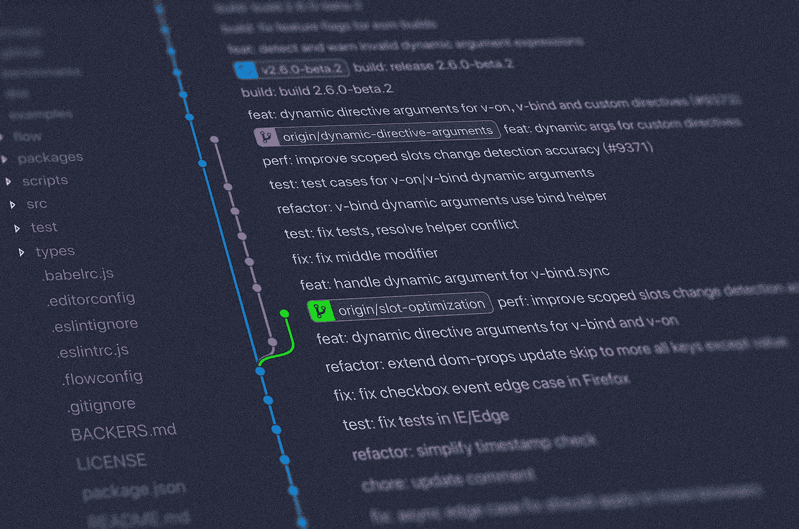

[Yancy Min](https://unsplash.com/@yancymin?utm_source=medium&utm_medium=referral)的照片，来源于[Unsplash](https://unsplash.com/?utm_source=medium&utm_medium=referral)

# 介绍

版本控制对所有开发过程至关重要，允许开发者随时间跟踪软件变更（代码、配置、数据等）。

此外，它促进团队成员之间的合作，使他们能够在同一代码库上共同工作，而不会干扰彼此的工作。

在数据团队中，版本控制在部署模型时尤为关键。

它使他们能够准确识别发生了什么变化、何时发生变化以及是谁进行了更改——这是在部署过程中诊断和解决出现的问题或模型在部署后表现不佳时至关重要的信息。

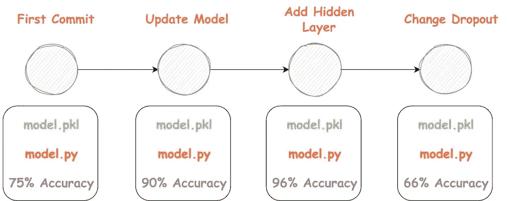

模型版本控制（作者提供的图片）

在这种情况下，基于 git 的功能可以提供快速回滚到先前版本的能力。

因此，在本文中，我将展示如何利用 Git 功能为你的模型部署提供支持。

更具体地，我们将使用 Modelbit 的 git 功能进行部署，并将 GitHub 与 Modelbit 同步以实现协作功能。

让我们开始吧 🚀！

# Git 对数据团队的重要性

在深入了解如何操作之前，让我们先建立更多关于基于 git 的版本控制的动机，以及它为何至关重要。

## #1）协作

随着数据科学项目越来越大，有效的协作变得越来越重要。

使用版本控制，团队可以在相同的代码库/数据上工作，并改进相同的模型，而不会干扰彼此的工作。

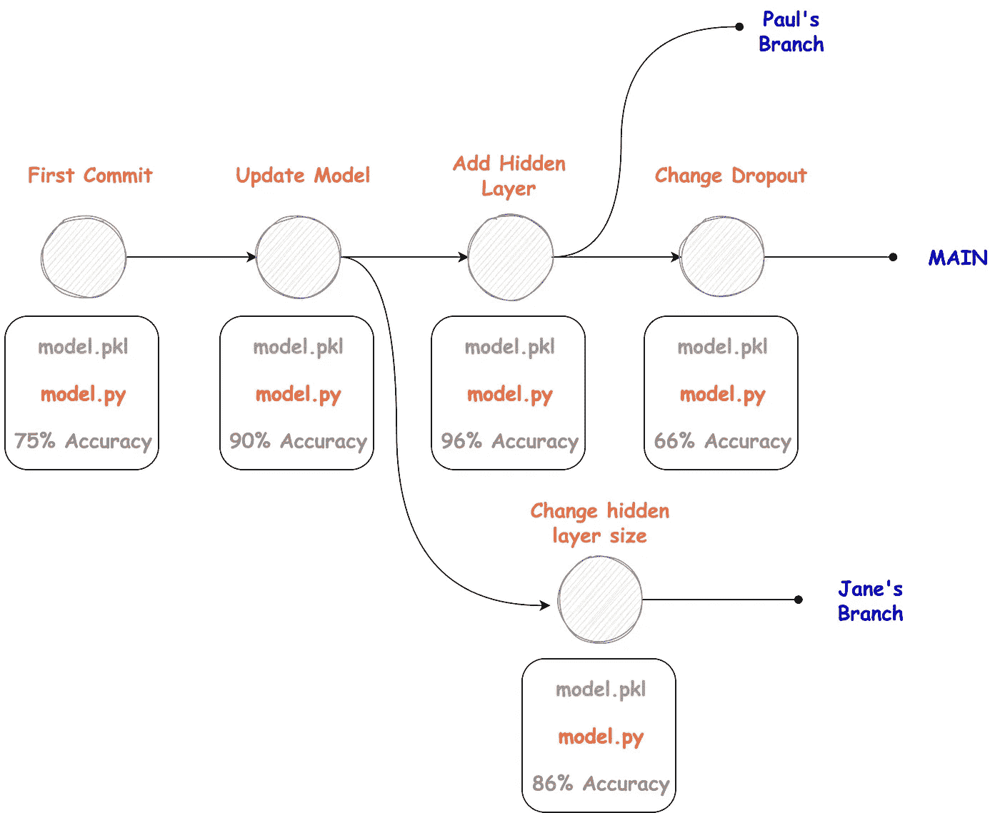

分支模型（作者提供的图片）

此外，还可以轻松跟踪更改，审查彼此的工作，并解决冲突（如有）。

## #2）可重复性

可重复性是构建可靠机器学习的关键方面之一。在一个系统上工作而在另一个系统上不起作用反映了不良的可重复性实践。

你可能会好奇，这为何重要？

它确保了结果可以被他人复制和验证，从而提高了你工作的整体可信度。

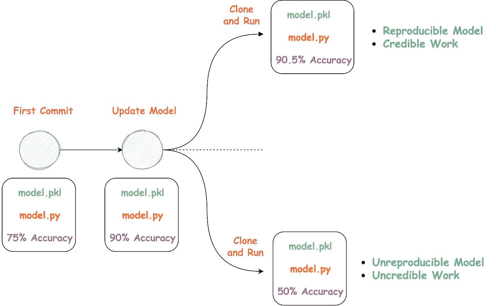

使用版本控制的可重复性（作者提供的图片）

版本控制使你能够跟踪用于生成特定结果的确切代码版本和配置，从而使将来复制结果变得更加容易。

这对于许多人可以使用的开源项目尤其有用。

## #3）持续集成和部署（CI/CD）

CI/CD 使团队能够快速有效地构建、测试和部署代码。

在机器学习中，持续集成（CI）可能涉及自动构建和测试对 ML 模型的更改，一旦这些更改被提交到代码库。

在持续部署（CD）中，目标是将模型的最新更改反映出来，一旦它们通过了测试。因此，它应该无缝更新生产中的更改，使最新版本的模型对最终用户可用。

既然我们知道了版本控制从开发和部署的角度为何重要，那么让我们看看如何利用 git 基于的功能在 Modelbit 的部署阶段。

# 本地仓库与 Modelbit 集成

Modelbit 完全由 git 驱动。因此，每当你推送模型进行部署时，它会将部署内部维护为 git 仓库。

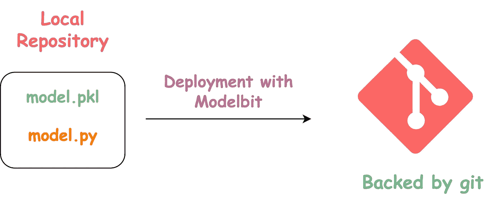

基于 Git 的部署（作者图片）

由于支持 git，它本地提供了所有版本控制的优点，适用于你的部署、模型和数据集。

更进一步，你可以从本地计算机克隆到远程 git 仓库，并执行所有 git 命令，如 `git pull`、`git push` 或进行分支等。

## 连接到 Modelbit git 仓库

要访问 Modelbit git 仓库，你需要添加一个 SSH 密钥，以将你的本地计算机连接到 Modelbit。

打开终端并运行以下命令：

```py
ssh-keygen -t rsa -b 4096 -C "My SSH key"
```

这将创建一个 SSH 密钥。要查看它，请运行以下命令：

```py
cat ~/.ssh/id_rsa.pub
```

> 上述命令取自[官方 GitHub 文档](https://docs.github.com/en/authentication/connecting-to-github-with-ssh/generating-a-new-ssh-key-and-adding-it-to-the-ssh-agent)。

现在，复制 `cat` 命令的完整输出，并转到 Modelbit 仪表盘中的 Git 设置。点击“添加密钥”，然后粘贴上面获得的输出。如下所示：

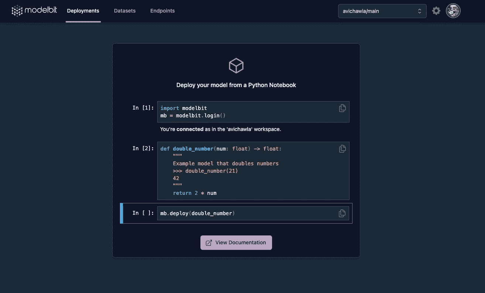

添加 SSH 密钥（作者图片）

完成了！

现在我们已连接到 Modelbit 的远程 git 仓库。

## 部署模型

让我们从 Jupyter Notebook 推送一个模型用于部署。我不会详细说明，因为我已经在之前的博客中讲过这个。

[](/deploy-machine-learning-models-right-from-your-jupyter-notebook-3241d47408cd?source=post_page-----1b3d76411436--------------------------------) ## 直接从 Jupyter Notebook 部署机器学习模型

### 用一行代码部署机器学习模型

towardsdatascience.com

简而言之，你应该训练一个模型，定义一个预测函数，并将这个函数对象推送用于部署，如下所示：

```py
## Train Model
from sklearn.linear_model import LinearRegression
model = LinearRegression().fit(x, y)

## Define Prediction function
def Linear_Model(input_x):

    if isinstance(input_x, (int, float)):    ## check input type
        return model.predict([[input_x]])[0] ## prediction

    else:
        return None

## Deploy it
import modelbit
mb = modelbit.login() ## authenticate the notebook here.
mb.deploy(Linear_Model)
```

一旦我们部署了一个模型，我们会在 Modelbit 仪表盘中看到以下内容：

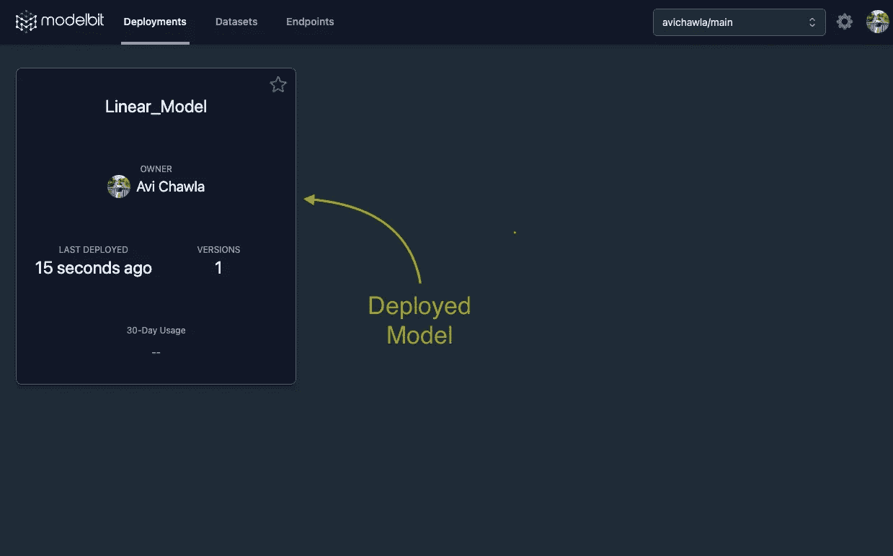

部署仪表盘（作者图片）

## 克隆 Modelbit 仓库

让我们克隆到这个仓库以查看其内容。在终端中运行以下命令。

```py
modelbit clone my_linear_model
```

这将克隆到 Modelbit 的 git 仓库，并创建一个名为 `my_linear_model` 的文件夹。

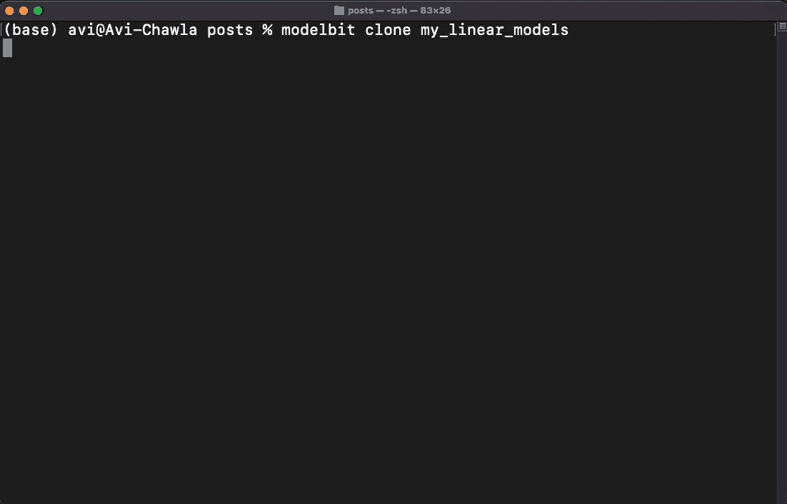

克隆部署仓库（作者图片）

一旦你运行命令，复制获得的链接以进行认证。

如上所示，克隆创建了一个新的本地仓库，数据集、部署和端点**在 Modelbit 的远程 git 仓库的主分支中**。

当前的仓库结构如下：

```py
my_linear_models
├── bin
├── datasets
├── endpoints
└── deployments
    └── Linear_Model
        ├── source.py ## source code
        └── data
            └── model.pkl ## model pickle
```

## 将更改推送到 Modelbit

现在我们已经克隆到远程仓库，我们可以在本地进行任何更改并推送它们。

让我们将一个虚拟 CSV 文件添加到 `Linear_Model` 文件夹，提交到本地仓库，并推送到远程仓库。

```py
my_linear_models
├── bin
├── datasets
├── endpoints
└── deployments
    └── Linear_Model
        ├── source.py ## source code
        ├── dummy_data.csv ## added locally
        └── data
            └── model.pkl ## model pickle
```

让我们将 CSV 文件添加到暂存区：

```py
git add deployments/Linear_Model/git dummy_data.csv
```

接下来，让我们将其提交到本地仓库：

```py
git commit -m "Add dummy data csv"
```

最后，让我们推送它：

```py
git push
```

这样，虚拟 CSV 文件已被提交到远程 Modelbit git 仓库。

> 注意：我们将 CSV 添加到`Linear_Model`文件夹而不是`datasets`文件夹是有原因的。`datasets`文件夹仅支持通过 SQL 查询的数据集。这些查询的结果在运行时可用于运行部署。目前还不支持其他自定义数据集。

## 分支

如果您希望在远程 Modelbit 仓库中创建和工作于一个单独的分支，这也是可能的。

按如下方式从仪表盘创建新分支：

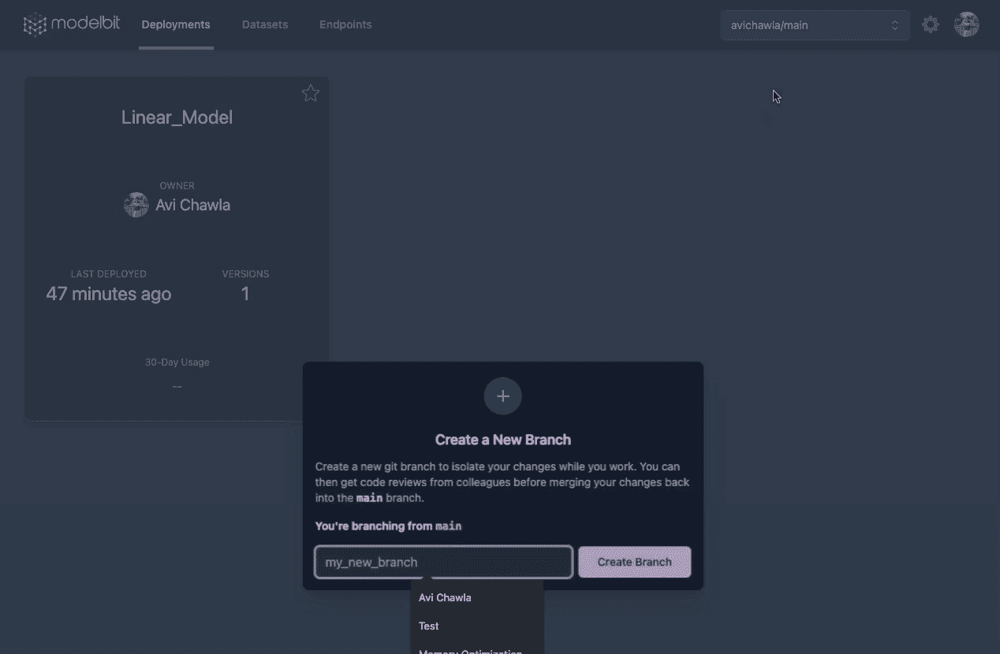

分支远程仓库（图片由作者提供）

接下来，假设我们希望在这个分支上本地改进我们的模型。在你的笔记本中，你可以按如下方式切换到这个新分支：

```py
## notebook.ipynb

mb.switch_branch("another_branch")
```

现在，从笔记本中进行的所有新部署（以及其他提交，如果有的话）将推送到远程 Modelbit git 仓库的`another_branch`分支。

# 同步 GitHub

远程 Modelbit 仓库可以与您的个人 GitHub 仓库自动同步。

这对于在 Modelbit 部署上执行基于 GitHub 的代码审查、CI/CD 和 Pull Request 工作流特别有用。

## #1）创建一个新的 GitHub 仓库

下面，我在 GitHub 上创建了一个空仓库。

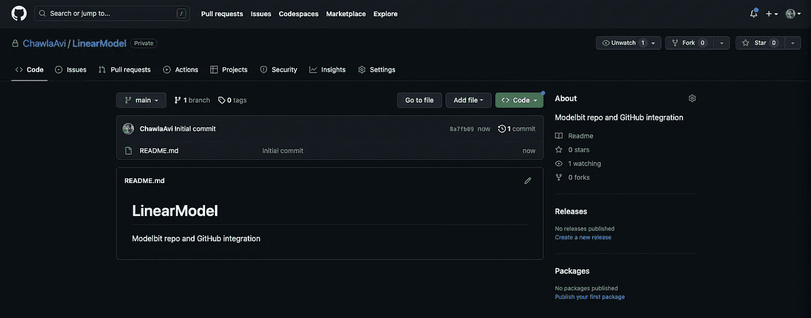

新的 GitHub 仓库（图片由作者提供）

接下来，我们应该授予 Modelbit 对这个仓库的写权限。

## #2 复制 GitHub 仓库的 SSH URL

在`Code` — `SSH`下，复制 URL。

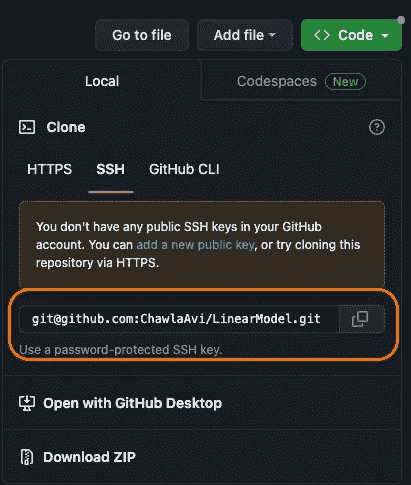

仓库 SSH URL（图片由作者提供）

## #3）在 Modelbit 中添加 Git 远程

在仪表盘中，转到`Git Settings`，`Add Git Remote`，粘贴复制的仓库 URL，然后`Connect Remote`。


将 Git 远程添加到 Modelbit（图片由作者提供）

## #4）授予 Modelbit 写权限

从上述同步面板中，复制部署密钥：

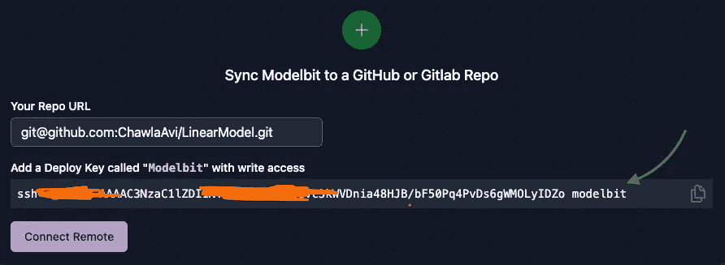

部署密钥（图片由作者提供）

现在转到 GitHub 仓库的`Settings`，`Deploy keys`，`Add deploy key`。粘贴密钥，给它一个标题，**授予写权限**，然后点击`Add key`。

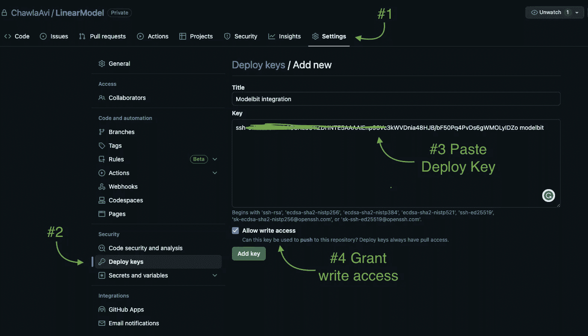

在 GitHub 仓库中添加部署密钥（图片由作者提供）

完成！GitHub 仓库已自动更新：

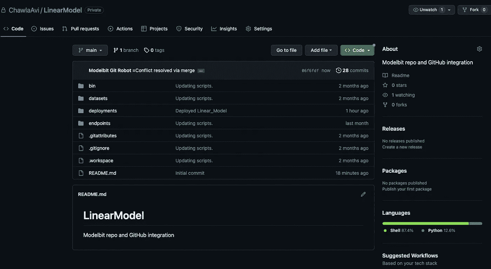

GitHub 中的部署代码（图片由作者提供）

现在，远程 Modelbit git 仓库与您的 GitHub 仓库已同步，您可以将其用于各种协作工作。

# 结论

至此，我们的博客结束了。

在这篇文章中，我们学习了 Git 功能对数据团队的重要性，以及如何通过 Modelbit 使用 git 来支持模型部署。

接下来，我们查看了如何将 Modelbit 内部创建的远程 git 仓库连接到个人 GitHub 仓库。

话虽如此，Modelbit 仍处于开发初期，目前可能还不是其他服务（如 Heroku）的终极替代品。

然而，根据我在使用 Modelbit 和 Heroku 的经验，我认为 Modelbit 的部署过程更为简化，不论是对经验丰富的用户还是新手都更为友好。

我期待看到他们的后续发展！

感谢阅读！
