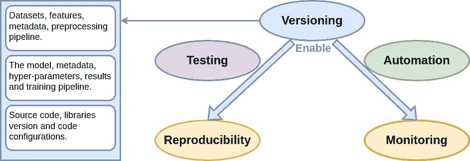

# 实践中的版本控制：数据、机器学习模型和代码

> 原文：[`towardsdatascience.com/version-controlling-in-practice-data-ml-model-and-code-e13c518067dc`](https://towardsdatascience.com/version-controlling-in-practice-data-ml-model-and-code-e13c518067dc)

## MLOps 中版本管理的逐步指南

[](https://medium.com/@chimso1994?source=post_page-----e13c518067dc--------------------------------)[](https://towardsdatascience.com/?source=post_page-----e13c518067dc--------------------------------) [Chayma Zatout](https://medium.com/@chimso1994?source=post_page-----e13c518067dc--------------------------------)

·发表于[数据科学前沿](https://towardsdatascience.com/?source=post_page-----e13c518067dc--------------------------------) ·13 分钟阅读·2023 年 12 月 2 日

--


照片由 [Christopher Gower](https://unsplash.com/@cgower?utm_source=medium&utm_medium=referral) 提供，来源于 [Unsplash](https://unsplash.com/?utm_source=medium&utm_medium=referral)

版本控制是一个至关重要的实践！没有它，你的项目可能会变得杂乱无章，使得回滚到任何期望的点变得困难。你可能会丧失重要的模型配置、权重、来自长期训练的实验结果，甚至整个项目本身。你也可能会在代码出现问题时与队友产生分歧和冲突，从而阻碍有效的合作。在本文中，我们通过一个实际的例子来探讨版本控制的重要性，例子中使用了一些该领域最常见的工具。本文的完整代码库可以在[相关仓库](https://github.com/Chim-SO/hand-written-digits-classification)中访问。

**目录：**

· 1\. 介绍

· 2\. 工具

· 3\. 设置你的项目

∘ 3.1\. 项目文件夹

∘ 3.2\. 项目环境

· 4\. 代码版本管理

· 5\. 数据版本管理

· 6\. 模型版本管理

· 结论

# 1\. 介绍



版本控制是记录文件或文件集随时间变化的实践，使用版本控制系统，以便我们可以在以后回忆特定版本。在 MLOps 中，版本控制是我认为在开始机器学习项目时需要考虑的首要原则之一。为了确保我们充分利用所有好处，版本控制应应用于不同的机器学习工作流步骤，包括***数据***、***机器学习模型***（ML 模型）和***代码***。

**为什么要进行版本控制？** 使用版本控制来管理代码、数据和模型可以实现***可重复性***（这是另一个重要的 MLOps 原则），通过允许在任何时间点重新创建项目的特定状态；***跟踪***和***监控***变化，通过建立系统化的方法来捕捉、记录和管理开发生命周期中的变化；***协作***，通过跟踪不同贡献者所做的更改，并高效地合并这些更改，以及其他许多重要的好处，如***错误恢复***和***可追溯性***。

**版本控制用例？** 让我们考虑一个具体的场景，在手写数字分类项目中，我们将用作本文的示例。

+   **代码。** 假设我们引入了优化以提高速度。然而，部署后，用户报告了预测中出现了意外的不准确。得益于项目的强大代码版本控制实践，我们可以迅速识别出与错误相关的提交，并在解决错误、修复并重新集成到主项目版本之前，暂时回滚部署。

+   **数据。** 假设我们决定扩展数据集以增强模型的泛化能力。然而，在扩展的数据集用于训练后，观察到模型性能出现了意外的变化。因此，我们审查版本控制历史，确定可能导致问题的具体扩展技术，并迅速回滚到数据集的先前版本。然后，我们共同优化数据扩展方法，确保只有经过验证的更改才会重新集成到主项目版本中。

+   **机器学习模型。** 假设现在，我们开始优化模型架构以提高准确性。我们实施了一个卷积神经网络（CNN）以改进特征提取，并将其集成到主项目中。然而，在部署过程中，出现了细微的差异，影响了实时预测。因此，我们回滚到之前更稳定的模型版本。接着，我们共同解决问题，进行彻底测试，然后将优化后的模型重新集成到主项目版本中。

尽管这篇文章专注于如何在项目中使用版本控制，但它也是我 MLOps 文章系列的一部分。此外，通过阅读我之前和之后的教程，你将能够从工作流程到模型部署和跟踪，创建自己的端到端 MLOps 项目。

如果你对 MLOps 感兴趣，可以查看我的文章：

+   *教程 1：MLOps 的关键开始：探索其基本组件*

+   *教程 2：面向初学者的 MLOps 工作流程介绍*

+   [*教程 3: MLOps 原则介绍*](https://medium.com/towards-data-science/introduction-to-mlops-principles-c5d73a00aa76)

+   [*教程 4: 以 MLOps 为导向构建机器学习项目*](https://medium.com/towards-data-science/structuring-your-machine-learning-project-with-mlops-in-mind-41a8d65987c9)

+   [*教程 5: 实践中的版本控制：数据、ML 模型和代码*](https://medium.com/towards-data-science/version-controlling-in-practice-data-ml-model-and-code-e13c518067dc)

+   *教程 6: 实践中的测试：代码、数据和 ML 模型*

+   *教程 7: 实践中的追踪：代码、数据和 ML 模型*

# 2. 工具


在进行机器学习项目或任何计算机科学项目时，在开始编程之前，需要选择合适的工具。工具的选择取决于项目需求、团队专业技能、数据量和成本等不同因素。

在本文中，选择了以下工具：

+   **Python** 作为编程语言，结合了丰富的生态系统、社区支持、学习的便捷性、多功能性、集成能力、广泛的库、数据科学工具、可扩展性以及行业采用，这些因素共同促成了它在机器学习项目领域的突出地位。

+   **Git** 用于代码版本控制。Git，全称为全球信息跟踪器，是一种开源的分布式版本控制系统（DVCS），广泛用于软件开发中以跟踪项目开发过程中源代码的更改。它是一个关键工具，能够有效管理代码更改、无缝协作并保持可靠的版本历史。它已成为行业标准，被全球开发者用于各种规模的项目。

+   **DVC** 用于数据版本控制。DVC，全称为数据版本控制，是一种开源版本控制系统，广泛用于数据管理。它旨在管理大规模数据集、使项目可重现以及促进更好的协作。它在 Git 仓库之上运行，具有类似的感觉和流程。DVC 的一个关键特性是数据版本控制：它允许将数据集与代码分开进行版本控制。因此，数据可以被跟踪、共享，并在不同版本之间轻松切换。

+   **MLflow** 用于模型版本控制。它是一个开源平台，旨在管理端到端的机器学习生命周期并促进 ML 从业者之间的协作。其与流行库的兼容性和强大的社区支持使其成为以统一且可扩展的方式管理完整机器学习生命周期的有吸引力的选择。

# 3. 设置你的项目

在开始之前，确保你的系统上已安装 Git 和 DVC。如果尚未安装，你可以从[官方 Git 网站](https://git-scm.com/book/en/v2/Getting-Started-Installing-Git)和[官方 DVC 网站](https://dvc.org/doc/install)下载并安装，或者如果你使用的是 Ubuntu，可以直接执行以下命令：

```py
sudo apt install git-all # to install git
pip install dvc # to install DVD (do not install it for now!)
```

然而，强烈建议在安装 DVD 之前创建一个虚拟环境；因此，我们将在创建虚拟环境后几分钟内进行安装。此外，请注意：

> DVC 并不替代或包含 Git。你必须在系统中安装 `git`，以启用数据版本控制和快速实验等重要功能（推荐）。 [1]

## 3.1\. 项目文件夹

让我们开始设置项目文件夹！为此，有几种方法，包括：

+   **从头创建文件夹：** 这是最直接的方法，但需要手动添加标准文件并随后构建项目。我不推荐在中大型项目中使用这种方法。

+   **导入现有模板：** 这是进行简单维护、易于协作以及确保良好透明性、可重复性和可重用性的最佳选择。本文中，我们将使用以下项目结构，用于通过[这个 Github 模板](https://github.com/Chim-SO/mlops-template)或这个[Cookiecutter MLOps 仓库](https://github.com/Chim-SO/cookiecutter-mlops)创建的机器学习项目，但可以随意探索其他模板。如果你渴望深入了解 ML 项目结构，我邀请你阅读我专门讨论这一主题的文章：[*考虑 MLOps 的机器学习项目结构*](https://medium.com/towards-data-science/structuring-your-machine-learning-project-with-mlops-in-mind-41a8d65987c9)。


使用[这个 Github 模板](https://github.com/Chim-SO/mlops-template)或这个[Cookiecutter MLOps 仓库](https://github.com/Chim-SO/cookiecutter-mlops)的项目结构

+   **克隆/分叉现有项目：** 当处理现有项目时，这通常是最佳选择。它支持协作和代码重用。对于本文，可以随意克隆或分叉我的仓库，以便轻松重用提供的代码。要克隆项目，请使用：

```py
# Clone repository:
git clone git@github.com:Chim-SO/hand-written-digits-classification.git
```

使用 Github 模板或克隆 Github 仓库需要对 Github 有一定的了解。不过，请放心！你仍然可以跟随本教程，我将为你提供必要的命令和解释。

## 3.2\. 项目环境

另一个重要步骤是设置虚拟环境，这是软件开发中的最佳实践，可以增强项目隔离、依赖管理、可重复性、协作和整体项目整洁性。

+   首先创建一个名为 `handwritten-digits-classification-env` 的虚拟环境并激活它：

```py
python -m venv venv/handwritten-digits-classification-env
source venv/handwritten-digits-classification-env/bin/activate
```

+   在那之后，通常在使用 GPU 时，我们需要更新环境以适应适当的 Cuda 版本（有关详细信息，请参见这篇文章）。然而，为了使本教程简单易懂，并且项目要求较简单，因为数据和模型都不大，所以不需要 GPU。

+   最后，我们通过执行以下命令来安装需求和 DVC：

```py
pip install -r requirements.txt 
pip install dvc
```

# 4\. 代码版本控制

在设置好仓库后，我们现在准备开始版本控制！在本教程中，我们采用一种简单的功能分支工作流。这种工作流涉及为每个新功能创建一个专门的分支，而不是直接更改主分支。然后，我们使用变基/合并方法将功能分支无缝集成到主分支中。

+   我们首先列出所有分支，并检查当前所在的分支，通常用星号（`*`）标记：

```py
git branch # List local branches
* master

git branch -r # List remote branches
remotes/origin/HEAD -> origin/master
origin/master

git branch -a # List all local and remote branches
* master
remotes/origin/HEAD -> origin/master
remotes/origin/master
```

这里我只有一个分支，即主分支，并且它是当前分支。

+   如果你还不在主分支上，请使用以下命令切换到它：

```py
git checkout master # switch to the main directory
git pull origin master # mendatory when working in collaboration but you can skip it now
```

+   我们首先创建一个名为`feature/data`的分支，在其中添加所有与数据处理相关的代码：

```py
git branch feature/data # to create a branch
git checkout feature/data # to switch to the created branch
# or use the combined creation and switch command
git checkout -b feature/data
```

+   在添加了所有必要的代码后，我们通过使用`merge`命令将代码导入主分支，该命令将命名分支中的更改并入当前工作分支：

```py
git checkout master # switch to the main directory
git merge feature/data # apply changes to master
```

+   类似地，我们创建了另一个名为`feature/model`的分支，在其中添加了所有与模型创建、训练和验证相关的代码，并将其合并到主分支中：

```py
# Model branch creation:
git checkout master # switch to the main directory
git checkout -b feature/model

# Development ...

# Merge branch
git checkout master # switch to the main directory
git merge feature/model # apply changes to master
```

此时，我们可以说我们创建了代码的简单第一个版本！现在是时候标记这个特定点，添加一个标签，如下所示：

```py
git tag -a v1.0 -m "Version 1.0"
```

整个工作流描述如下：


每个圆圈代表一个提交，可以使用以下命令显示：

```py
git log --pretty=format:"%h - %an, %ar : %s"
```


**回到我们的代码问题示例：**

+   假设在部署后出现了问题，我们决定暂时将部署回滚到之前的版本：

```py
git revert <commit-hash>  # Revert the merge commit
```

撤销操作通过创建一个新的提交来撤销指定提交所做的修改，但我们可能需要解决在此过程中出现的任何冲突，类似于常规合并中发生的情况。

+   通过使用提交历史，我们识别出模型分支中的一个特定优化可能导致了这个问题。因此，创建了一个名为`hotfix/inference-bug`的热修复分支来解决这个错误：

```py
git checkout -b hotfix/inference-bug
```

+   然后我们对代码进行必要的修正并提交更改：

```py
git commit -m "Fix bug in digit classification during inference"
```

+   错误修复经过彻底测试，并且如果我们真的在团队中工作，还会为代码审查打开一个新的拉取请求，最终热修复被合并到主分支中：

```py
git checkout main
git merge hotfix/inference-bug
```

修复了错误的代码重新部署到生产环境。

# 5\. 数据版本控制

现在代码准备好了，我们可以将数据集下载到其第一个版本，然后将其转换为`csv`格式。

+   首先，我们需要确保存储数据的文件夹未被 git 忽略。这通过检查`.gitignore`文件并移除/注释掉排除数据文件夹的行来完成。如果你使用的是我提供的模板，请注释掉第 79 行。

+   现在，我们开始创建一个分支`feature/data-csv`，在项目文件夹内初始化 DVC 项目，最后将创建的文件添加到 Git 中：

```py
# Branch creation:
git checkout master # switch to the main directory
git pull origin master # mendatory when working in collaboration but you can skip it now
git checkout -b feature/data-dvc

# DVC initialisation: 
dvc init

# Add to Git the created files:
git commit -m "chore: Initialize DVC."
```

+   然后，我们下载我们的数据集，将其添加到 DVC 中，并将新的 DVC 文件添加到 git 中：

```py
# Download data
python src/data/ingestion.py -r data/raw

# Add data to dvc
dvc add data/raw/test_images.gz data/raw/test_labels.gz data/raw/train_images.gz data/raw/train_labels.gz

#Add dvc files to git and commit
git add data/raw/.gitignore data/raw/test_images.gz.dvc data/raw/test_labels.gz.dvc data/raw/train_images.gz.dvc data/raw/train_labels.gz.dvc
git commit -m "Add raw data"
```

将文件添加到 dvc 将生成存储在新文件中的元数据，文件扩展名为`.dvc`。另外，请注意，即使数据文件夹由 git 跟踪，但一旦我们将其添加到 DVC 中，它会创建`.gitignore`并将数据路径添加到其中，因此它将被忽略。

+   我们还将其转换为`csv`格式，并将生成的文件`data/preprocessed/train.csv`和`data/preprocessed/test.csv`以与之前相同的方式添加到 DVC 中：

```py
# transform data:
python src/data/build_features.py -r data/raw/ -p data/processed/

# Add to dvc: 
dvc add data/processed/train.csv data/processed/test.csv

#Add dvc files to git and commit
git add data/processed/.gitignore data/processed/test.csv.dvc data/processed/train.csv.dvc
git commit -m "Add processed data"
```

目前，数据已下载并创建。下一步是合并到主分支并添加 git 标签：

```py
# Apply changes:
git checkout master # switch to the main directory
git pull origin master # mendatory when working in collaboration, you can skip it now
git merge feature/data-dvc # apply changes to master

# Tag this point:
git tag -a v1.1 -m "Data collected and processed"
```

**回到我们的数据问题示例：**

+   假设我们对处理过的数据进行了离线增强，并将其添加到 DVC 中：

```py
# Add to dvc after update: 
dvc add data/processed/train.csv data/processed/test.csv
git add data/processed/test.csv.dvc data/processed/train.csv.dvc
git commit -m "Data augmentation offline"
```

+   然而，训练后，模型表现不佳，因此我们决定重新使用之前的版本，如下所示：

```py
git checkout data/processed/test.csv.dvc data/processed/train.csv.dvc
dvc checkout data/processed/test.csv.dvc data/processed/train.csv.dvc
```

# 6\. 模型版本控制

如前所述，我们使用 MLflow 来跟踪和管理我们的模型。由于目前我们将在本地工作，我们启动一个本地的 MLflow Tracking Server：

```py
mlflow server --host 127.0.0.1 --port 8080
```

+   创建一个分支，我们在其中训练并保存模型：

```py
# Branch creation:
git checkout master # switch to the main directory
git checkout -b feature/model-dvc
```

+   现在，我们初始化 MLflow 运行上下文以启动一个运行，训练模型，然后使用 MLflow 保存模型：

```py
# Create model:
model = create_model(x_train[0].shape)

# Log parameters:
loss = 'categorical_crossentropy'
metric = 'accuracy'

# Train:
model.compile(loss=loss, optimizer='adam', metrics=[metric])
history = model.fit(x_train, y_train, epochs=epochs, batch_size=batch_size, verbose=1,
                    validation_data=(x_val, y_val))

# ....

# Set tracking server uri for logging
mlflow.set_tracking_uri(config['mlflow']['tracking_uri'])

# Create an MLflow Experiment
mlflow.set_experiment(config['mlflow']['experiment_name'])

# Start an MLflow run
with mlflow.start_run():
   # Save model:
   signature = infer_signature(x_train, y_train)
   mlflow.tensorflow.log_model(model, output_path, signature=signature)
   #Log other metrics and parametrics:
   # Next tutorial.
```

+   合并到主分支并添加 git 标签：

```py
# Apply changes:
git checkout master # switch to the main directory
git merge feature/model-mlflow # apply changes to master

# Tag this point:
git tag -a v1.2 -m "Model versioning mlflow"
```

+   使用以下命令训练模型：

```py
python -m src.models.cnn.train -c configs/cnn.yaml
```

其中`configs/cnn.yaml`文件包含一些配置参数，如批量大小和训练轮次。

+   我们可以在 MLflow UI 中查看运行结果，只需在浏览器中导航到之前的 URL。点击实验名称`cnn`以列出其相关的运行，然后点击为运行生成的随机名称：


+   通过点击运行名称，显示 RUN 页面，其中显示了执行的详细信息：


当你使用 MLflow 保存模型时，它会创建一个包含以下内容的目录结构：

+   `data`文件夹包含序列化的模型参数文件。

+   `MLmodel`文件，包含有关模型的元数据，如框架、模型签名及其他属性。

+   `conda.yaml`、`python_env.yaml`和`requirements.txt`文件，这些文件帮助重建相同的环境以便加载模型。

它还提供了对模型架构的深入理解，并展示了如何执行预测，支持 *Spark DataFrame* 和 *Pandas DataFrame* 两种灵活的选择。MLflow 的另一个显著特点是能够保留生成模型的提交 ID。此外，它引入了一个简单的模型注册选项，这是一个将在后续文章中探讨的话题。

# 结论

我们来到了本文的结尾。在这篇文章中，我们通过一个实际示例学习了如何对机器学习项目中的三个元素：代码、数据和机器学习模型进行版本控制。版本控制是 MLOps 的一个基本原则，它能实现细致的跟踪、无缝的协作以及机器学习工作流程的强大可复现性。本文的完整代码库可在 [相关的仓库](https://github.com/Chim-SO/hand-written-digits-classification) 中访问。

感谢阅读本文。您可以在我的 [GitHub 个人主页](https://github.com/Chim-SO?tab=repositories) 中找到我提供的所有不同教程的示例。如果您喜欢我的教程，请通过关注我和订阅来支持我。这样，您将收到我新文章的通知。如果您有任何问题或建议，请随时留言。

[](/a-key-start-to-mlops-exploring-its-essential-components-27646238372d?source=post_page-----e13c518067dc--------------------------------) ## MLOps 的关键起点：探索其基本组件

### 初学者友好的 MLOps 介绍

towardsdatascience.com

# 参考文献

[1] [`dvc.org/doc/install`](https://dvc.org/doc/install)

# 图片来源

本文中所有未在说明中提及来源的图片和图表均由作者提供。
