# VIM 教程 — 像专业人士一样编辑文本

> 原文：[`towardsdatascience.com/vim-tutorial-edit-text-like-a-pro-ea13e45010f5`](https://towardsdatascience.com/vim-tutorial-edit-text-like-a-pro-ea13e45010f5)

## 易于遵循的 Vim 文本编辑器教程

[](https://medium.com/@fmnobar?source=post_page-----ea13e45010f5--------------------------------)[](https://towardsdatascience.com/?source=post_page-----ea13e45010f5--------------------------------) [Farzad Mahmoodinobar](https://medium.com/@fmnobar?source=post_page-----ea13e45010f5--------------------------------)

·发布于 [Towards Data Science](https://towardsdatascience.com/?source=post_page-----ea13e45010f5--------------------------------) ·12 分钟阅读·2023 年 3 月 6 日

--


图片由 [Pereanu Sebastian](https://unsplash.com/@sebastian123) 在 [Unsplash](https://unsplash.com/photos/qFH7-yKoxik) 上提供

Vim 是一个功能强大且高度可定制的文本编辑器，自 1991 年以来一直存在。它以其模式编辑界面而闻名——这意味着它允许用户在不同的模式之间切换，用于编辑、导航和选择文本。Vim 被程序员和其他需要快速高效方式编辑和操作文本文件的高级用户广泛使用。使用 Vim 的主要优势之一是其速度和效率。一旦你掌握了命令和界面，你可以用几个击键执行复杂的编辑任务。

在这篇文章中，我们将介绍 Vim 中最常用的命令。我在本节之后包含了一个速查表，供将来参考。速查表之后是命令的详细教程。我建议首先阅读详细教程部分，然后在未来使用时，你可以简单地参考速查表。

开始吧！

*(除非另有说明，否则所有图片均由作者提供。)*

[](https://medium.com/@fmnobar/membership?source=post_page-----ea13e45010f5--------------------------------) [## 通过我的推荐链接加入 Medium - Farzad Mahmoodinobar

### 阅读 Farzad (以及 Medium 上其他作者) 的每一个故事。你的会员费直接支持 Farzad 和其他人……

medium.com](https://medium.com/@fmnobar/membership?source=post_page-----ea13e45010f5--------------------------------)

# 重要 Vim 命令概览表

下表总结了一些你需要了解的重要 Vim 命令。每个命令在下一节中有更详细的描述。

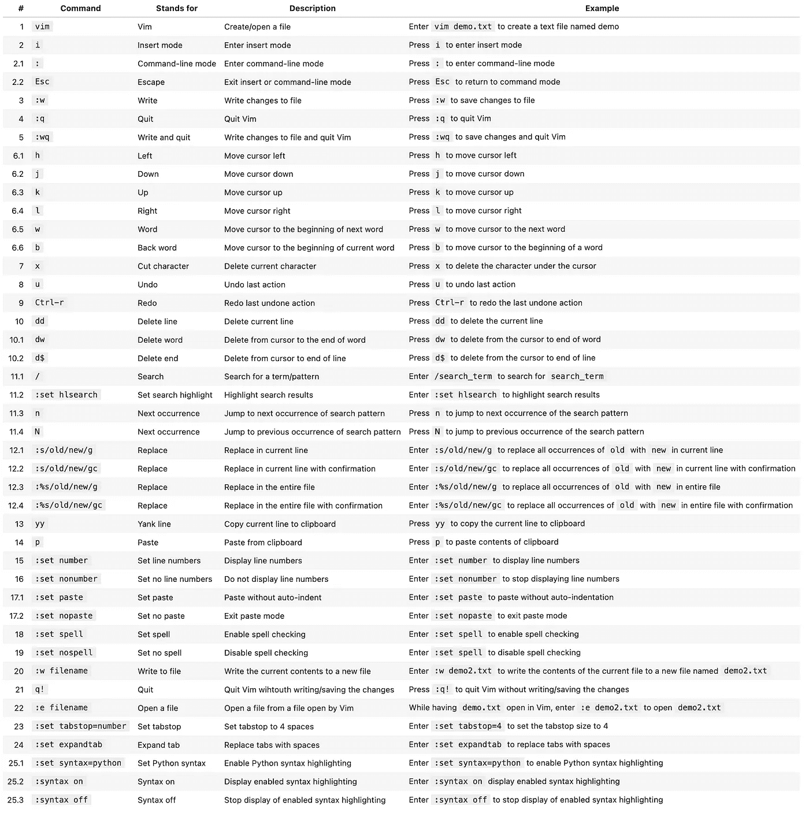

Vim 命令速查表

# Vim 命令 — 详细教程与实现

在本节中，我们将详细介绍一些最常用的 Vim 命令。我们还将把每个命令应用于文本文件以查看结果。我们将使用命令行界面（CLI）来运行 Vim 命令（如果你需要复习 CLI，可以访问这个 [CLI 教程]()）。如果你准备好了，打开 CLI，开始吧！

## 1\. “`vim"` — 创建文件

首先，我们将创建一个名为 `demo.txt` 的文件，以便可以在该文本文件中应用命令，如下所示：

```py
vim demo.txt
```

这个命令使用 Vim 在 CLI 中创建一个文本文件。一旦运行此命令，你将在 CLI 中看到一个类似于这张图片的空白页面：

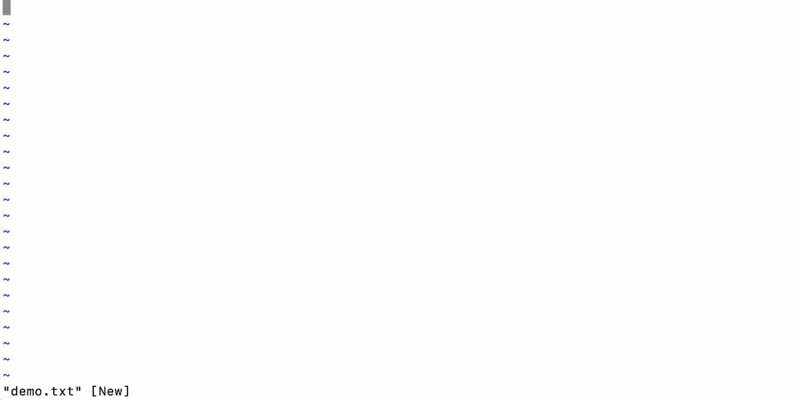

如你所见，文件是空的，我们只能在左下角看到文件名。让我们看看如何在文本文件中添加一些文本。

## 2\. “i” — 插入

`i` 命令代表“insert”，用于进入 Vim 的插入模式。当你处于插入模式时，可以像在任何其他文本编辑器中一样输入和编辑文本。要使用此命令，只需在普通模式下按 `i`。

继续按 `i`，然后输入以下内容：

```py
Topic: VIM Tutorial

Author: Farzad Nobar

If you find this helpful, follow me on Medium at: https://medium.com/@fmnobar
```

确保不要按其他任何键。以下是此时我 CLI 的样子：

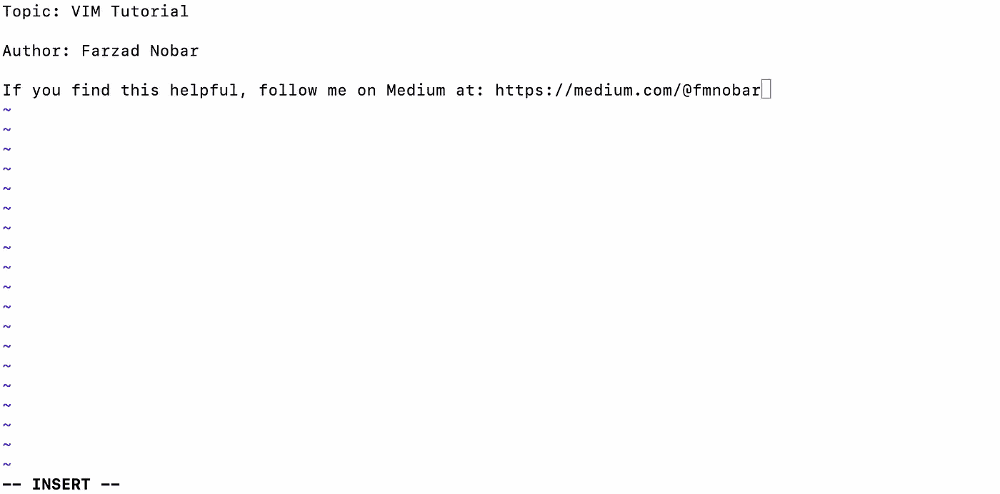

我们可以在该图片中看到文本，并且在最底部我们可以看到我们处于 `— INSERT —` 模式。为了退出该模式，只需按下键盘上的 Escape 键（确保在进入下一步之前执行此操作）。

到目前为止，我们已经在文件中添加了这些文本，但尚未保存更改。接下来我们来看看这个问题。

## 3\. “:w” — 写入

`:w` 命令代表“write”，用于在 Vim 中保存对文件的更改。要使用此命令，只需在普通模式下输入 `:w` 并按下回车键（或 Enter）。这将保存对文件所做的任何更改，以下是更改后我的 CLI 的样子：

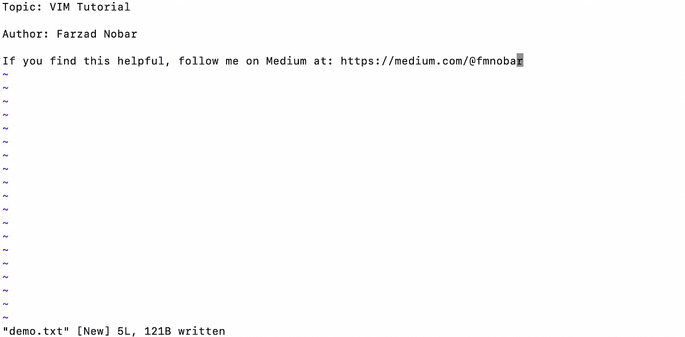

> **专业提示：** 请注意，“Write”命令是在`:`之后输入的。在 Vim 中，我们通过输入命令 `:` 进入“命令”模式。换句话说，我们首先通过输入 `:` 进入命令模式，然后输入 `w`，这就成为了“Write”命令。我们可以随时通过按下 Escape 键退出命令模式。我们将在接下来的部分中更多地使用命令模式。

现在我们已经保存了更改，接下来我们可以退出（即关闭）文件。

## 4\. "`:q"` — 退出

`:q` 命令代表“quit”，用于退出 Vim。要使用此命令，只需在普通模式下输入 `:q`（然后按下回车/Enter）。如果文件中有未保存的更改，Vim 会提示你在退出之前保存这些更改。

## 5\. “:wq” — 写入并退出

`:wq`命令代表“写入并退出”，用于将更改保存到文件并退出 Vim（而不是像之前的示例那样分开进行）。要使用此命令，在普通模式下键入`:wq`。这将保存你对文件所做的任何更改并退出 Vim。

## 6\. “h”、“j”、“k”、“l”、“w”、“b” — 文本文件中的导航

这些命令用于在 Vim 中移动光标。`h`将光标向左移动，`j`向下移动，`k`向上移动，`l`向右移动。`w`将光标移动到下一个单词的开头，`b`将光标移动到当前单词的开头。这些命令在普通模式下使用。

为了练习这些，请使用以下命令打开我们创建的文件：

```py
vim demo.txt
```

现在你已经在 Vim 中打开了文件，你可以使用导航键进行移动——试试看吧！

> **技巧提示：** 请注意，打开现有文件和创建新文件的命令是相同的。如果文件已存在，Vim 将打开现有文件。如果文件不存在，Vim 将创建一个新文件。

## 7\. “x” — 删除

`x`命令用于删除光标下的字符。要使用此命令，只需将光标放在你要删除的字符上，并在普通模式下按`x`即可。

让我们用这个来删除“Topic”中的“ic”字母。我看到的结果如下：

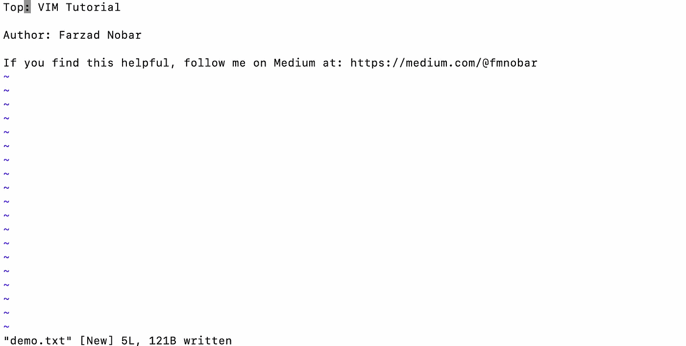

但如果我们不小心删除了这些呢？让我们看看下一步如何撤销这个操作。

## 8\. “u” — 撤销

`u`命令用于在 Vim 中撤销更改。要使用此命令，只需在普通模式下按`u`即可。

我按了`u`两次，删除操作被撤销，如下所示：

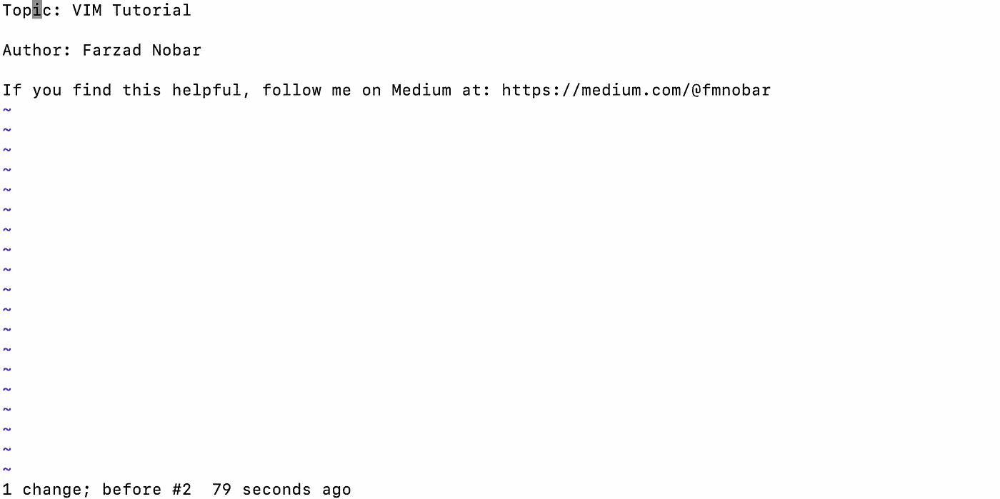

## 9\. “Ctrl-r” — 重做

`Ctrl-r`命令用于在 Vim 中重做更改。要使用此命令，只需在普通模式下按`Ctrl-r`即可。

假设我们又改变了主意，实际上我们是要删除那两个字母。我按了`Ctrl-r`两次，在下面的截图中我们可以看到字母再次被删除：

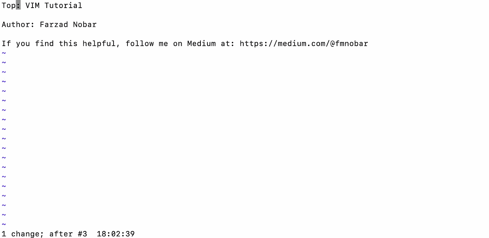

好的。我们先暂时保留这些更改。接下来我们来谈谈如何使用 Vim 搜索术语。

## 10\. “dd” — 删除行

`dd`命令用于在 Vim 中删除整行。要使用此命令，只需在普通模式下按`dd`即可。

## 11\. “/search_term” — 搜索

`/`命令用于在 Vim 中搜索术语。要使用此命令，键入`/`后跟你要搜索的术语，然后按回车。Vim 将突出显示文件中术语的下一个出现位置。

试试看吧。我使用`/medium`搜索了“medium”，结果如下：

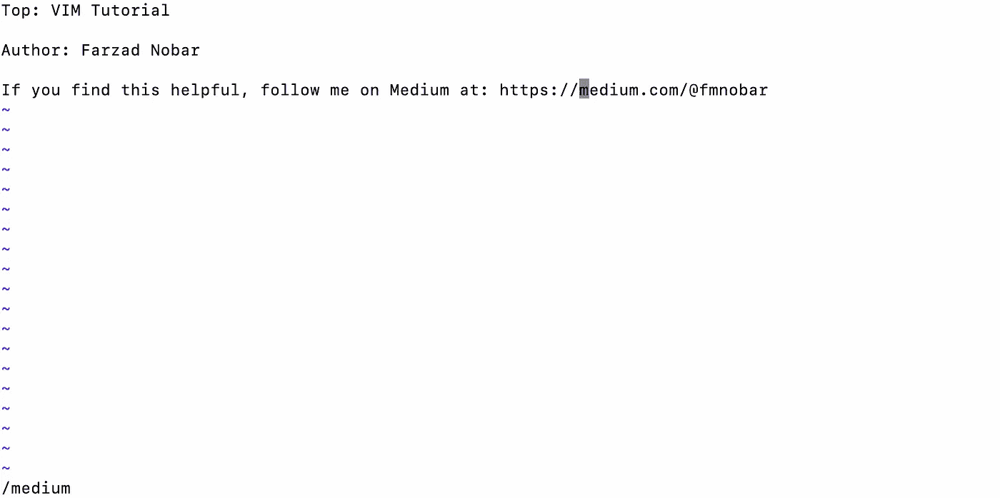

正如我们在图片中看到的，光标跳到了文本最后一行的“medium”一词的开头。

现在让我们使用 `:set hlsearch` 高亮显示搜索结果，现在搜索的词汇（例如本例中的“medium”）被高亮显示，如下图所示：

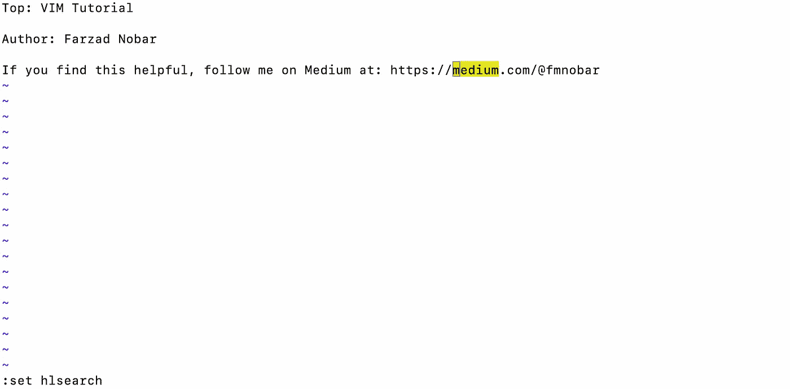

我们可以使用 `:set nohlsearch` 关闭此高亮搜索。

## 12\. “:s/search_term/replace_term/g” — 替换

`:s/search_term/replace_term/g` 命令用于在 Vim 中替换所有出现的词汇。要使用此命令，在普通模式下键入 `:s/search_term/replace_term/g` 并按回车键。Vim 将用替换词汇替换所有出现的搜索词汇。

我通过使用以下命令将“Tutorial”替换为“guideline”进行尝试：`:s/Tutorial/Guideline/g`

以下是结果：

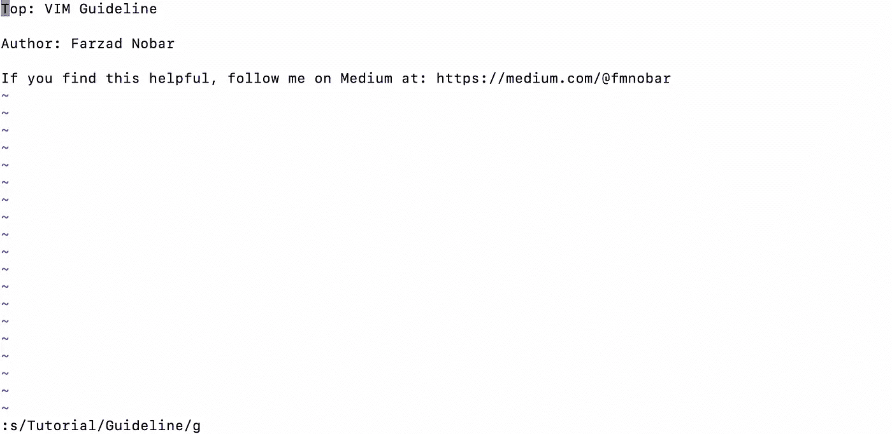

接下来，让我们讨论一下如何完成文本复制并粘贴的操作。

## 13\. “yy” — 剪切

`yy` 命令用于在 Vim 中复制一行文本。要使用此命令，只需将光标放在要复制的行上，并在普通模式下按 `yy`。

## 14\. “p” — 粘贴

`p` 命令用于粘贴已被剪切或删除的文本。要使用此命令，只需在普通模式下按 `p` 键即可。

让我们尝试剪切和粘贴命令。首先在文件的开头按 `yy`，然后按 `p`，看看会发生什么。请注意，按下 `yy` 后实际上没有明显的变化，但实际情况是在后台进行的。一旦按下 `p`，你将看到结果。我碰巧按了两次 `p`，以下是结果：

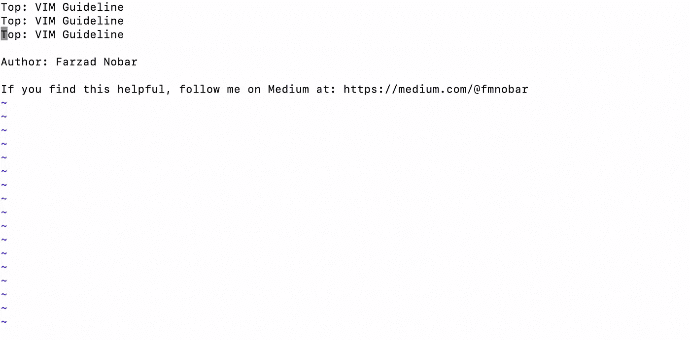

## 15\. "`:set number"` — 显示行号

`:set number` 命令用于在 Vim 中显示行号。要使用此命令，在普通模式下键入 `:set number`。

这个命令不言而喻。以下是我输入命令后 CLI 的样子：

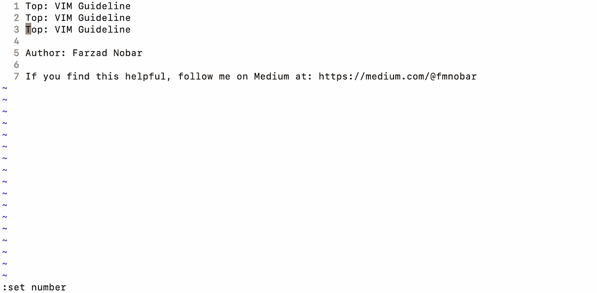

## 16\. “:set nonumber” — 隐藏行号

`:set nonumber` 命令用于在 Vim 中隐藏行号。要使用此命令，在普通模式下键入 `:set nonumber`。

以下是隐藏行号的结果：

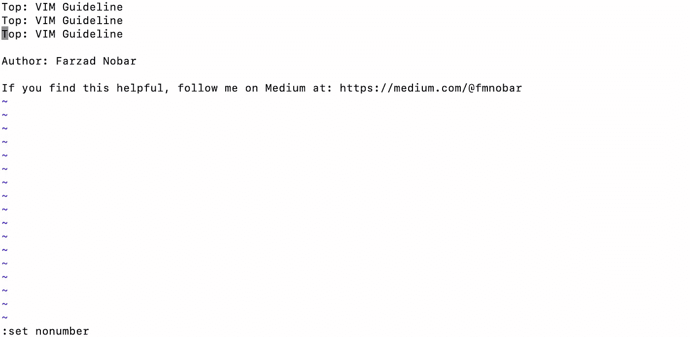

## 17\. “:set paste” — 无自动缩进的粘贴

`:set paste` 命令用于粘贴文本而不进行自动缩进。要使用此命令，在普通模式下键入 `:set paste`，然后粘贴文本，最后键入 `:set nopaste` 退出粘贴模式。此命令的一个应用场景是粘贴对缩进敏感的文本输入，例如编程脚本（例如 Python 中的 for 循环等）。

## 18\. “:set spell” — 拼写检查

`:set spell` 命令用于启用 Vim 的拼写检查。要使用此命令，在普通模式下键入 `:set spell`。Vim 会高亮显示任何拼写错误的单词。

让我们看看 Vim 是否在我们的文件中识别出了什么：

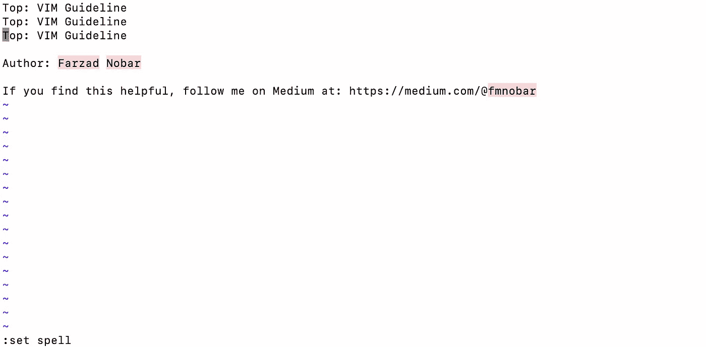

正如预期的那样，我的名字被突出显示，Vim 未将其识别为正确拼写的词——我不会把这个放在心上！

## 19\. “:set nospell” — 禁用拼写检查

`:set nospell`命令用于在 Vim 中禁用拼写检查。要使用此命令，请在正常模式下输入`:set nospell`。

## 20\. “:w filename” — 写入文件

`:w filename`命令用于将当前文件的内容写入一个具有指定文件名的新文件。要使用此命令，请在正常模式下输入`:w filename`。

试试这个。我将首先使用以下命令将文件内容保存到名为`demo2.txt`的新文件中：`:w demo2.txt`。然后我关闭了 Vim（使用`:q!`），接着查看文件（使用 CLI 中的`ls`命令），看到新文件`demo2.txt`现在被添加到了那里。让我们用 Vim 打开它，看看它的样子：

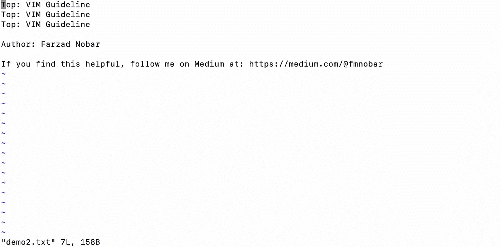

## 21\. “:q!” — 不保存退出

`:q!`命令用于退出 Vim 而不保存对文件的任何更改。要使用此命令，请在正常模式下输入`:q!`。如果你在之前的例子中注意到，我使用`:q!`退出了 Vim，因此我们期望更改没有被保存。让我们打开`demo.txt`并进行验证。结果如下：

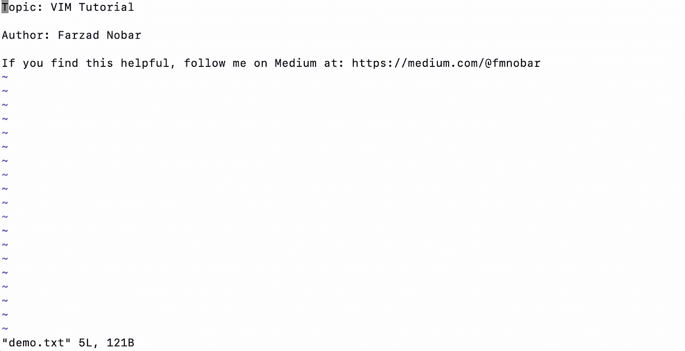

正如预期的那样，修改没有被保存，我最终得到了原始文件。

## 22\. “:e filename” — 打开一个文件

`:e filename`命令用于在 Vim 中打开一个文件。要使用此命令，请在正常模式下输入`:e filename`。

现在我们已经打开了`demo.txt`文件，接下来使用以下命令打开第二个名为`demo2.txt`的文件，结果如下：


正如预期的那样，第二个文件已被打开。

## 23\. “:set tabstop=4” — 设置制表符宽度

`:set tabstop=4`命令用于将 Vim 中的制表符宽度设置为 4 个空格。要使用此命令，请在正常模式下输入`:set tabstop=4`。

试试这个。我将首先将 tabstop 设置为 4，进入插入模式，然后在文件第二行的开头添加一个制表符，结果如下：

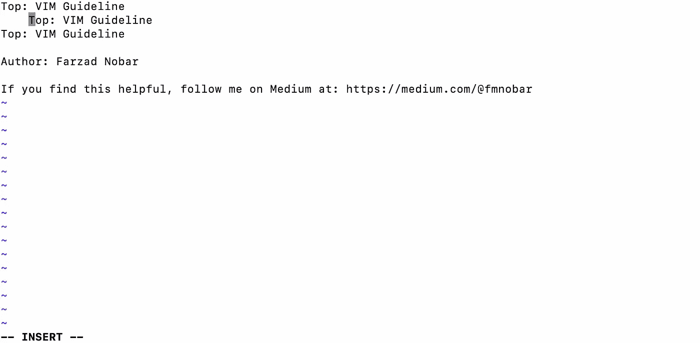

现在让我们将 tabstop 大小更改为 8，看看它如何变化：

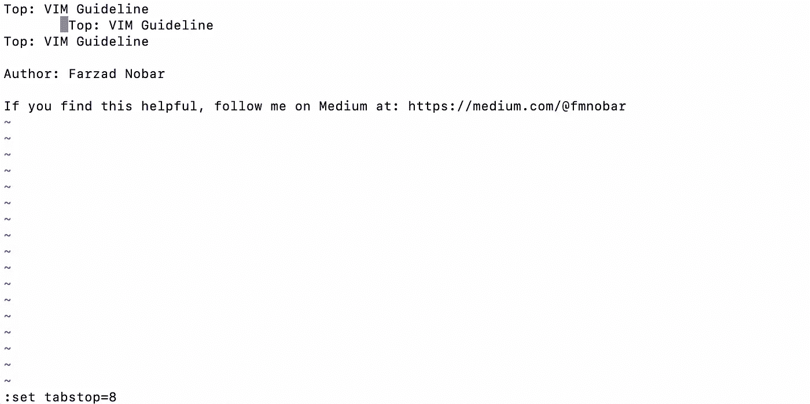

请注意，现有的制表符在文件中自动应用了更改，制表符大小从 4 增加到 8，如上图所示。

## 24\. “:set expandtab” — 使用空格代替制表符

`:set expandtab`命令用于在 Vim 中将制表符替换为空格。要使用此命令，请在正常模式下输入`:set expandtab`。这个命令一目了然，我们可以继续下一个命令。

## 25\. “:set syntax=python” — 语法高亮

`:set syntax=python`命令用于在 Vim 中启用 Python 代码的语法高亮显示。要使用此命令，请在正常模式下输入`:set syntax=python`。

我很想包括这一点，因为它与我的工作有关，并且我每天都在使用 Python。为了测试这一点，让我们采取以下步骤：

1\. 使用 Vim 打开一个新的 Python 文件，方法是：`vim demo.py` 2\. 粘贴以下命令（从我关于[多变量分析](https://medium.com/towards-data-science/multivariate-analysis-going-beyond-one-variable-at-a-time-5d341bd4daca)的帖子中选择）

```py
# Import libraries
import numpy as np
import pandas as pd
import seaborn as sns
from scipy import stats
import matplotlib.pyplot as plt
%matplotlib inline

# Show all columns/rows of the dataframe
pd.set_option("display.max_columns", None)
pd.set_option("display.max_rows", None)

# Read the data
df = pd.read_csv('auto-cleaned.csv')

# Return top 5 rows of the dataframe
df.head()
```

以下是我看到的结果：

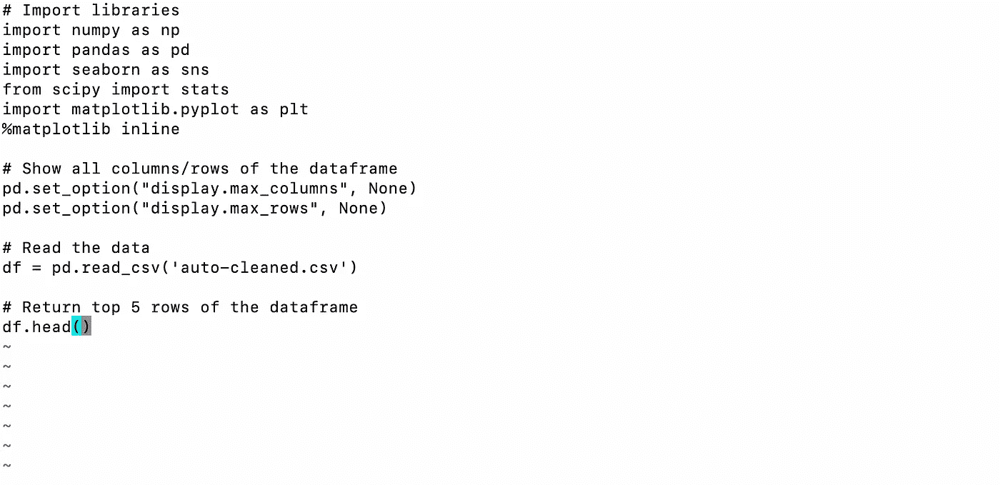

3\. 然后我通过使用`:set syntax=python`将语法设置为 Python

4\. 然后我通过使用`:syntax on`来开启语法高亮

以下是结果，它符合预期的 Python 语法：

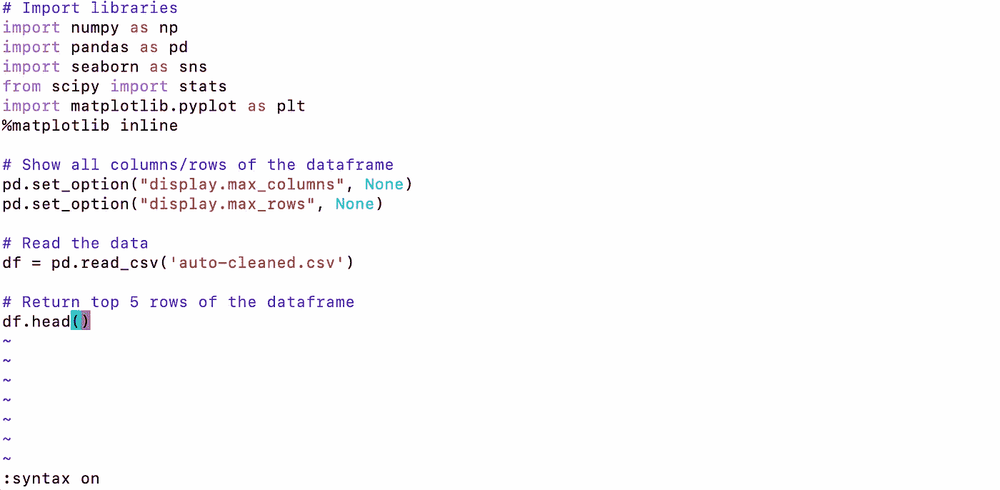

正如预期的那样，Python 语法得到了识别和颜色编码。

# 结论

在这篇文章中，我们介绍了 Vim，这是一个在命令行界面（CLI）中使用的多功能文本编辑器，被程序员和高级用户所利用。然后我们逐步讲解了一些在 Vim 中最常用的命令及其示例。我希望通过本教程，你对使用 Vim 感到更加舒适，并开始将其整合到你日常的文本编辑活动中。

# 感谢阅读！

如果你觉得这篇文章对你有帮助，请在 Medium 上关注我并订阅以接收我最新的帖子！
