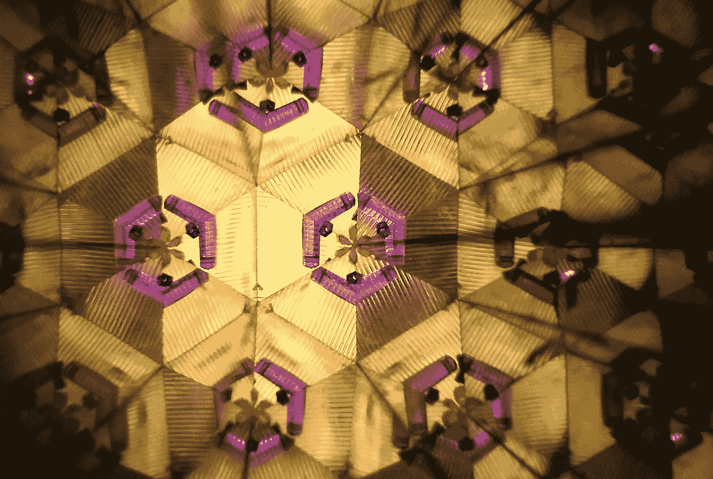
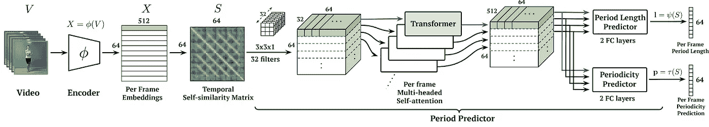
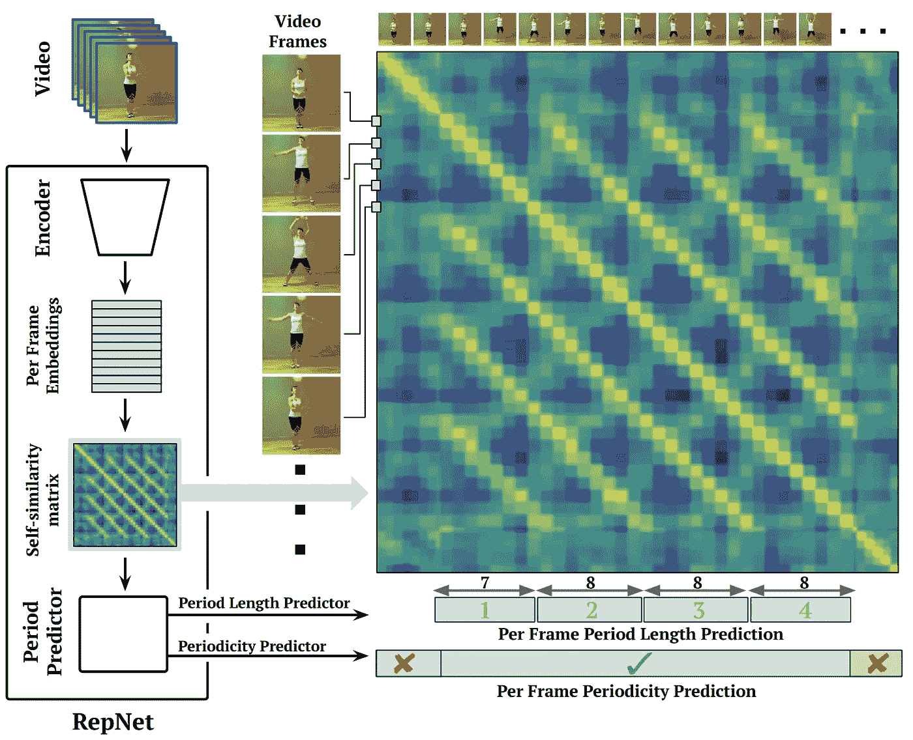
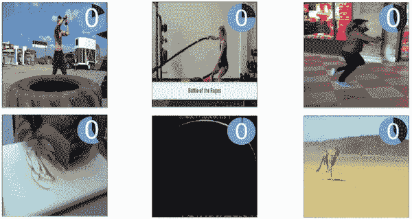
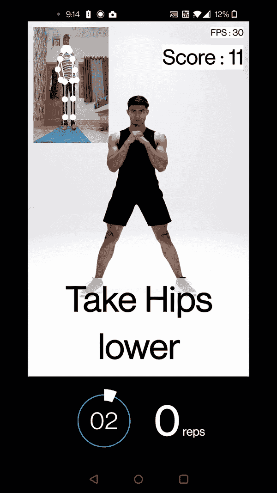
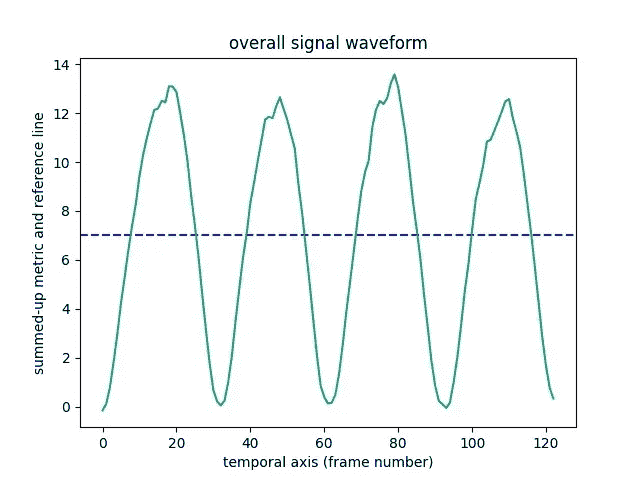
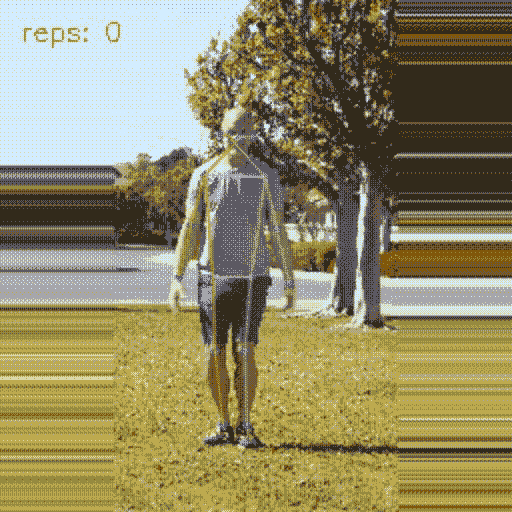
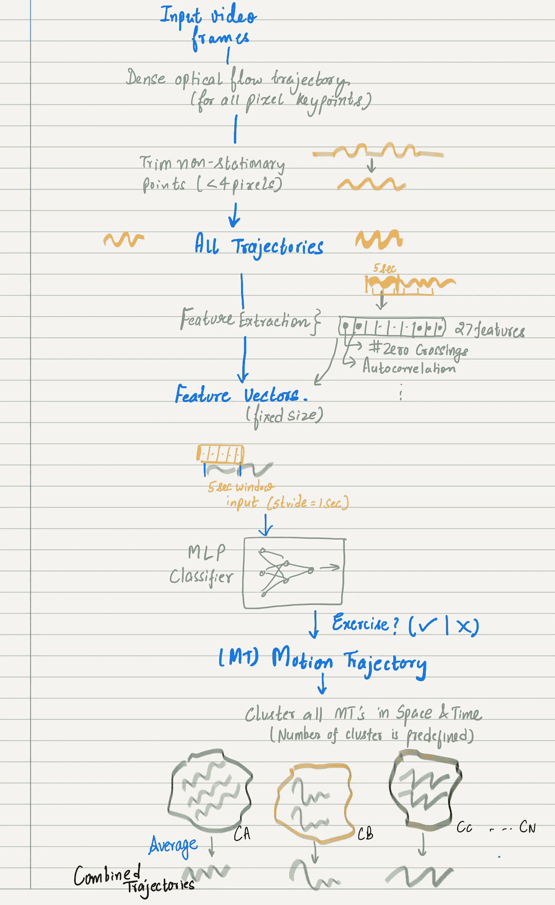
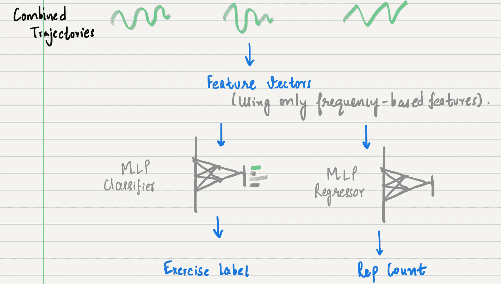
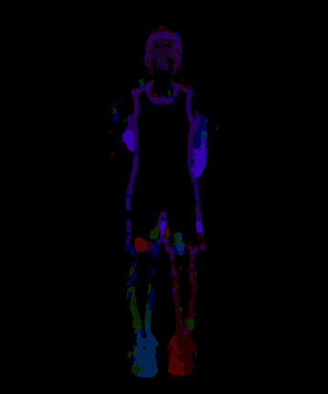

# 视觉基础的重复计数在实际应用中的探索

> 原文：[`towardsdatascience.com/vision-based-rep-counting-in-the-wild-cb9a4d1bdb7e?source=collection_archive---------10-----------------------#2023-02-21`](https://towardsdatascience.com/vision-based-rep-counting-in-the-wild-cb9a4d1bdb7e?source=collection_archive---------10-----------------------#2023-02-21)

## 对视觉基础重复计数的不同方法进行回顾

[](https://medium.com/@aakashagrawal?source=post_page-----cb9a4d1bdb7e--------------------------------)[](https://towardsdatascience.com/?source=post_page-----cb9a4d1bdb7e--------------------------------) [Aakash Agrawal](https://medium.com/@aakashagrawal?source=post_page-----cb9a4d1bdb7e--------------------------------)

·

[关注](https://medium.com/m/signin?actionUrl=https%3A%2F%2Fmedium.com%2F_%2Fsubscribe%2Fuser%2F93ce827b6548&operation=register&redirect=https%3A%2F%2Ftowardsdatascience.com%2Fvision-based-rep-counting-in-the-wild-cb9a4d1bdb7e&user=Aakash+Agrawal&userId=93ce827b6548&source=post_page-93ce827b6548----cb9a4d1bdb7e---------------------post_header-----------) 发表在 [Towards Data Science](https://towardsdatascience.com/?source=post_page-----cb9a4d1bdb7e--------------------------------) ·9 分钟阅读·2023 年 2 月 21 日[](https://medium.com/m/signin?actionUrl=https%3A%2F%2Fmedium.com%2F_%2Fvote%2Ftowards-data-science%2Fcb9a4d1bdb7e&operation=register&redirect=https%3A%2F%2Ftowardsdatascience.com%2Fvision-based-rep-counting-in-the-wild-cb9a4d1bdb7e&user=Aakash+Agrawal&userId=93ce827b6548&source=-----cb9a4d1bdb7e---------------------clap_footer-----------)

--

[](https://medium.com/m/signin?actionUrl=https%3A%2F%2Fmedium.com%2F_%2Fbookmark%2Fp%2Fcb9a4d1bdb7e&operation=register&redirect=https%3A%2F%2Ftowardsdatascience.com%2Fvision-based-rep-counting-in-the-wild-cb9a4d1bdb7e&source=-----cb9a4d1bdb7e---------------------bookmark_footer-----------)

src: 图片由 [@paragdmehta](https://unsplash.com/@paragdmehta) 提供，展示了一个重复的模式。

*在这篇文章中，我尝试解释我对不同视觉基础的重复计数技术的探索，并讨论它们的优缺点。具体而言，我重点介绍了计算机视觉在重复计数中应用的五种主要方式。*

穿戴式传感器在重复和组计数中非常受欢迎。由于这些传感器价格昂贵，而且在大多数情况下仅限于跟踪特定的身体部位，近年来，越来越多的关注转向了使用视觉基础的方法进行重复计数。

从活动监控、运动和游戏中的无数应用，到帮助了解生物事件（心跳、脉搏计数等）发生的次数，重复计数是学术界和工业界积极解决的问题。

**关键词：** *重复计数、计算机视觉、姿态估计。*

# 目录

+   ***RepNet: 无类别的重复计数应用***

+   ***基于规则的姿态估计运动重复计数***

+   ***基于信号处理的运动重复计数***

+   ***GymCam***

+   ***基于深度学习的光流方法进行重复计数***

我们在博客中讨论的大多数技术不会是通用的，而是专门针对特定问题（例如锻炼）。此外，若要深入了解该技术，请参阅提供的参考文献。

# 1. RepNet: 无类别的重复计数应用

*论文：* [Counting Out Time: 无类别的视频重复计数](https://arxiv.org/pdf/2006.15418.pdf) [1]



图：RepNet 体系结构。源：[`arxiv.org/pdf/2006.15418.pdf`](https://arxiv.org/pdf/2006.15418.pdf)

在重复计数方面最突出的工作之一是 **RepNet**，这是一个端到端的深度学习模型，可以准确预测广泛的重复运动计数。

RepNet 模型接收视频流作为输入，并预测两个输出：

***每帧周期长度：*** 对于每一个重复动作的帧，我们希望知道该动作的周期长度（以时间单位表示）。

***每帧周期性：*** 表示当前帧是否为重复的一部分的分数。

RepNet 模型的几个关键亮点包括：**时间自相似矩阵（TSM）：**



图：RepNet 利用时间自相似矩阵（TSM）。源：[`arxiv.org/pdf/2006.15418.pdf`](https://arxiv.org/pdf/2006.15418.pdf)

1.  **TSM** 是这种重复计数技术的亮点。它是 RepNet 体系结构的信息瓶颈。该矩阵通过计算两个嵌入之间的成对相似性函数来帮助将帧彼此关联起来。

1.  还可以通过（使用启发式方法）从这些 TSM 推断重复次数，这使得 RepNet 模型的预测具有解释性。

1.  多样化的真实世界重复视频确保这些 TSM 足够多样化，因此 RepNet 除了重复计数之外还有一系列应用。

这种重复计数方法最令人印象深刻的一点是它是*无类别的*（通用的），适用于广泛的重复动作。RepNet 模型是流行的 Transformers 在计算机视觉中应用的经典实例。



源：[`arxiv.org/pdf/2006.15418.pdf`](https://arxiv.org/pdf/2006.15418.pdf)

然而，该模型存在一定限制，因为输入视频中的帧数必须有限。这可以归因于 TSM 的大小等于输入帧的数量。

该模型相当庞大且复杂，因此在移动应用程序或任何生产环境中部署这一模型将是相当具有挑战性的，并可能存在延迟问题。

# 2\. 基于规则的姿态估计重复计数

*博客：* [使用计算机视觉赢得互动](https://blog.cult.fit/posts/winning-interactivity-using-computer-vision) [2]

这是行业中最常见的想法。许多健康和健身初创公司一直在努力构建准确、轻量化的最先进姿态估计模型，这些模型可以用来准确计算运动中的重复次数，并提供姿势纠正反馈等。

## 涉及的主要步骤：

+   给定一个特定的练习，你首先需要为该练习中的状态制定定义（规则）。一个练习中可以有多个状态。例如，**深蹲**练习可以分为两个状态，即下半部状态和上半部状态。在运动过程中，做练习的人将从一个状态转移到另一个状态。这些状态规则可以看作是运动过程中**激活**区域的表示。

+   例如，对于深蹲，这些规则可以是（*th*指阈值）：

```py
down: (left_knee_hip_dist_y < th1 and right_knee_hip_dist_y < th2)
up: (left_knee_hip_dist_y > th3 and right_knee_hip_dist_y > th4) 
```

+   在推理过程中，我们首先实时计算模型中姿态关键点的度量（角度、归一化的距离），并检查某个特定规则是否被激活，然后使用标志进行重复计数。



来源：[使用计算机视觉赢得互动](https://blog.cult.fit/posts/winning-interactivity-using-computer-vision)。图片由作者提供。

该方法的主要优点之一是重复计数**快速**且**准确**，**延迟**非常低。然而，一些主要的缺点包括：

+   这不是通用的重复计数。

+   姿态估计模型对背景噪音非常敏感，因此对重复计数也有影响。

+   ***可扩展性问题：*** 手动编写规则是一个耗时的过程。我们还需要测试不同角度、方向、姿势等的规则变体。想象一下为语料库中的数百种练习编写规则。

# 3\. 使用信号处理思想进行重复计数

*博客：* [使用信号处理思想构建运动重复计数器](https://medium.com/towards-data-science/building-an-exercise-rep-counter-using-ideas-from-signal-processing-fcdf14e76f81) [3]

**目标：** *使用零交叉和峰值检测等信号处理思想来制作一个运动重复计数器。*

这种方法与基于规则的重复计数非常相似，只是需要手动编写不同状态的规则。这种方法通过推断参考线（可以视为状态边界）来***半自动化***状态计算方法，使用训练师的视频来进行特定运动/练习，然后使用该参考线来计数任何视频中的该练习的重复次数。

在这里，我们将运动视为关键点度量的波形集合。这些度量包括不同身体关键点之间的角度和距离，关键点是通过姿态估计模型（Tensorflow 的 [**Movenet**](https://www.tensorflow.org/hub/tutorials/movenet) 姿态估计模型）计算的。

## 主要步骤：

1.  我们首先使用训练师参考视频（作为输入）计算关键点之间的度量（距离和角度）。这些度量在时间上表示为信号。

1.  我们过滤掉所有静态信号，并创建非静态信号的组合信号。然后，我们使用汇总信号的均值计算参考线。

1.  在推断过程中，我们首先在测试用户输入视频上计算度量，并实时计算整体组合信号。

1.  我们创建一个固定大小的移动窗口，并检查整体信号（来自 3）与参考线（来自 2）的交点。这个交点表明重复动作已经完成。



使用零交叉思想的结果。图片由作者提供。 源

这种方法快速、易于实施且相当准确。然而，主要的缺点包括以下几点：

+   重复计数是 ***独占性的*** 和 ***非通用的***。

+   对背景噪音高度敏感。

+   ***缩放问题***：需要使用参考视频计算零交叉线来进行任何活动（同时确保视频没有噪音）。

# 4\. GymCam

*论文：* [在不受约束的场景中检测、识别和跟踪同时进行的运动](https://smashlab.io/publications/gymcam/)[4]

GymCam 是一个基于视觉的系统，用于自动化的运动重复计数和跟踪。它基于这样的假设：任何在健身房内的重复运动都属于某种运动。在这里，系统的输入是来自摄像头的视频流，输出是多个与运动相关的度量，包括重复计数。

## 步骤总结



GymCam：主要步骤。图片由作者提供。

1.  *使用密集的* [***光流***](https://docs.opencv.org/3.4/d4/dee/tutorial_optical_flow.html) *算法检测视频中的所有潜在运动轨迹。* 运动轨迹也可能是非运动活动的结果，例如热身、用户的步态、到处走动等。

1.  *检测所有* ***运动*** *轨迹在场景中。* 他们是怎么做到的？首先，他们执行一个特征提取步骤，从任何轨迹的 5 秒窗口中提取手工特征。他们使用一个[MLP](https://en.wikipedia.org/wiki/Multilayer_perceptron) 基于的二分类器模型，该模型输入特征并输出该输入轨迹（特征）是否与运动相关的概率。

1.  ***聚类*** *运动轨迹在空间和时间上的练习。* 聚类后，通过将所有属于给定聚类的轨迹合并生成一个平均运动轨迹。请注意，聚类的数量是预定义的。这些平均轨迹随后用于计数和跟踪练习的重复次数。

1.  ***重复计数*** *和* ***运动识别：*** 平均轨迹然后被转换为特征向量，这些特征向量被输入到 MLP 回归模型和 MLP 分类模型中，以分别推断重复计数和运动标签。



从组合轨迹中进行重复计数和练习识别。图片由作者提供。

该系统的一些显著特点是：它是一个***端到端*** 系统，可以在现实世界环境中执行重复计数。***光流*** 识别所有运动，因此即使用户**几乎**不可见，也足以跟踪运动并执行重复计数。

系统存在的问题：

+   ***多个用户重叠*** 在视频中进行运动。因此，很难确定这些用户的确切边界并推断重复次数。

+   ***噪声敏感：*** 噪声人类行为，如热身、休息、用户的步态等，可能会表现出周期性，因此可能对重复计数产生不必要的贡献。

+   重复计数不是通用的：该系统仅限于运动重复计数。

# 5\. 基于 DL 的光流方法

*博客:* 使用深度学习和光流算法的运动计数应用 [5]

另一个有趣的思路是利用视觉解决重复计数问题，即光流方法。

## 主要步骤

1.  *使用密集光流算法查找重复活动中视频帧的颜色编码表示。* 这里的关键在于不同的重复运动状态将有不同的颜色编码。



密集光流将向下运动编码为绿色，将向上运动编码为紫色。Gif 由作者提供。

关于光流算法的详细信息，请参见**opencv**文档 [这里](https://docs.opencv.org/3.4/d4/dee/tutorial_optical_flow.html)（以及实现）。

2\. *数据集创建*：下一步是生成一个带有颜色编码的图像和视频数据集，并将其标注为不同的运动状态（如向上或向下）。

3\. *模型训练*：下一步涉及训练一个普通的 CNN 模型，以对帧进行多类分类。在测试时，将来自光流的颜色编码帧输入到模型中，模型预测运动状态之一并捕获类别标签。这基本上是一个通过模型进行的颜色匹配问题，因为模型更为健壮。

该方法准确且容易在生产环境中部署。然而，缺点往往超过优点：

+   重复计数是 ***独占性*** 和 ***类别依赖性*** 的。

+   ***扩展问题***：每次将新运动添加到语料库时，都需要标注数据集并训练模型。

+   ***方向敏感性***：相同的动作在不同的方向上会有不同的颜色编码，从而导致错误的模型预测。这是该方法的主要限制之一。

+   ***噪声敏感性***：背景中的任何轻微噪声都会改变这些颜色编码，从而影响模型的预测。

# 参考文献

[1]. Dwibedi, Debidatta 和 Aytar, Yusuf 和 Tompson, Jonathan 和 Sermanet, Pierre 和 Zisserman, Andrew. 计时：在实际环境中进行类无关的视频重复计数。IEEE/CVF 计算机视觉与模式识别会议（CVPR）。DOI: [`doi.org/10.48550/arxiv.1902.09868`](https://doi.org/10.48550/arxiv.1902.09868)

[2]. Aakash Agrawal. [利用计算机视觉赢得交互性](https://blog.cult.fit/posts/winning-interactivity-using-computer-vision)。 [The .fit 方式](https://blog.cult.fit/)。

[3]. Aakash Agrawal. [利用信号处理中的想法构建一个运动重复计数器](https://medium.com/towards-data-science/building-an-exercise-rep-counter-using-ideas-from-signal-processing-fcdf14e76f81)。Towards Data Science。

[4]. Rushil Khurana, Karan Ahuja, Zac Yu, Jennifer Mankoff, Chris Harrison, 和 Mayank Goel. 2019\. GymCam：在不受约束的场景中检测、识别和跟踪同时进行的运动。Proc. ACM Interact. Mob. Wearable Ubiquitous Technol. 2, 4, Article 185\. DOI: [`doi.org/10.1145/3287063`](https://doi.org/10.1145/3287063)

[5]. Art Kulakov. 我如何使用深度学习和光流算法创建健身动作计数应用程序。Towards Data Science。

我希望你喜欢探索一些基于视觉的重复计数技术。大多数想法都很容易实现和部署。我希望了解任何阅读这篇博客的人的反馈。我很乐意回答有关上述任何概念的疑问/问题。欢迎反馈。你可以通过 [Linkedin](https://www.linkedin.com/in/akash2016123/) 联系我。

## 感谢阅读！
