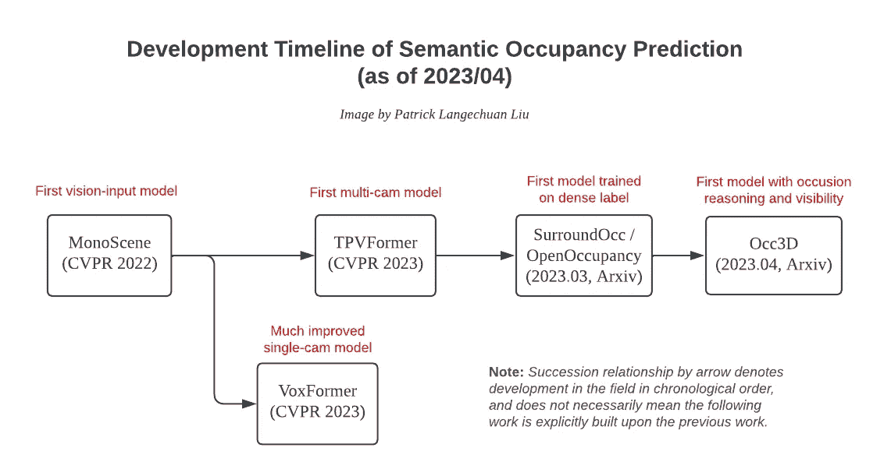

# 面向视觉的语义占用预测用于自动驾驶

> 原文：[`towardsdatascience.com/vision-centric-semantic-occupancy-prediction-for-autonomous-driving-16a46dbd6f65`](https://towardsdatascience.com/vision-centric-semantic-occupancy-prediction-for-autonomous-driving-16a46dbd6f65)

## 关于 2023 年上半年学术“占用网络”的综述

 [Patrick Langechuan Liu](https://medium.com/@patrickllgc?source=post_page-----16a46dbd6f65--------------------------------)

·发布在[Towards Data Science](https://towardsdatascience.com/?source=post_page-----16a46dbd6f65--------------------------------) ·阅读时间 11 分钟·2023 年 5 月 29 日

--

现有的 3D 物体检测方法在自动驾驶中的一个关键痛点是它们通常输出简洁的 3D 边界框，忽略了更精细的几何细节，并且在处理一般的、超出词汇表的物体时表现不佳。这一痛点存在于单目 3D 物体检测和 BEV 多摄像头物体检测中。为了解决这个问题，**占用网络**作为一种面向视觉的通用障碍检测解决方案，首次在[特斯拉在 CVPR 2022 的主题演讲](https://www.youtube.com/watch?v=jPCV4GKX9Dw)中介绍，并在[AI Day 2022](https://www.youtube.com/watch?v=ODSJsviD_SU)中推广。更多细节请参见之前关于可行驶空间的博客系列。

 [## 自动驾驶中的可行驶空间——行业概况

### 截至 2023 年的行业应用最新趋势

medium.com](https://medium.com/@patrickllgc/drivable-space-in-autonomous-driving-the-industry-7a4624b94d41?source=post_page-----16a46dbd6f65--------------------------------)

在学术界，与占用网络相对应的感知轨道被称为 **语义占用预测（SOP）**，有时也称为 **语义场景完成（SSC）**，两者之间有一些细微的区别。语义占用预测为场景中的每个体素分配占用状态和语义标签。这是一种通用且足够表达的表示方式，可以描述已知类别但形状不规则或不在已知白名单中的物体。本文将回顾截至 2023 年初的语义占用预测的最新方法。这个领域在学术界受到广泛关注，顶级会议上提交了大量论文，今年的 CVPR 也有一个[占用预测挑战](https://opendrivelab.com/AD23Challenge.html#rules)。

# 语义场景完成 vs 语义占用预测

语义场景完成（SSC）的概念最初在 SSCNet 论文（CVPR 2017）中提出，后来由 SemanticKITTI（ICCV 2019）普及，该数据集提供了官方数据集和比赛赛道。最近，出现了一种略有不同的任务语义占用预测（SOP）。SSC 和 SOP 都旨在预测给定空间位置处体素的占用状态和语义类别，但存在一些细微差别。首先，SSC 的输入模式是由 LiDAR 或其他主动深度传感器收集的部分 3D 数据，因此称为 3D 语义场景的“完成”。SOP 使用 2D 图像，可能是多摄像头和多帧的。除此之外，SSC 通常关注静态场景，而 SOP 也可以处理动态物体。总之，**SOP 似乎是更通用和更受欢迎的术语**，在本文中，我们将交替使用语义占用预测、语义场景完成和占用网络。

> MonoScene 的开创性工作首次使用单目图像在 SemanticKITTI 上进行语义占用预测任务。它仍然将任务称为 SSC，这可能是因为 SemanticKITTI 主要包含静态场景。后续研究更倾向于使用 SOP 这一术语，将任务扩展到 NuScenes 和 Waymo 等其他数据集，并处理动态物体。

# 开创性工作的高级总结

我将首先总结过去一年研究的爆炸性增长，然后跟进各种技术细节的总结。下面是一个总结待审阅工作的整体发展脉络的图示。值得注意的是，该领域仍在快速发展，并且尚未趋向于一个普遍接受的数据集和评估指标。

语义占用预测领域的发展时间线（来源：作者创作）

## MonoScene（CVPR 2022），首次尝试视觉输入

[MonoScene](https://arxiv.org/abs/2112.00726)是首个仅使用**RGB 图像作为输入**来重建户外场景的工作，相较于以往研究中使用的激光雷达点云。它是一个单摄像头解决方案，专注于前摄像头的 SemanticKITTI 数据集。

MonoScene 的架构（来源：[MonoScene](https://arxiv.org/abs/2112.00726)）

论文提出了许多想法，但似乎只有一个设计选择至关重要——FLoSP（Feature Line of Sight Projection）。这个想法类似于沿视线传播特征的思想，也被[OFT](https://arxiv.org/abs/1811.08188)（BMVC 2019）或[Lift-Splat-Shoot](https://arxiv.org/abs/2008.05711)（ECCV 2020）所采用。其他新颖性如 Context Relation Prior 和直接优化度量的独特损失，根据消融研究看来似乎不那么有用。

## VoxFormer (CVPR 2023)，显著改进了 monoScene

[VoxFormer](https://arxiv.org/abs/2302.12251)的关键见解在于 SOP/SSC 必须同时解决两个问题：可见区域的场景重建和遮挡区域的场景幻觉。VoxFormer 提出了一种**重建和密集化**的方法。在第一次重建阶段，论文利用单目深度方法将 RGB 像素提升为伪 LiDAR 点云，然后将其体素化为初始查询提案。在第二次密集化阶段，这些稀疏的查询通过图像特征增强，并利用自注意力进行标签传播以生成密集预测。VoxFormer 在 SemanticKITTI 上的性能**显著优于 MonoScene**，且仍为单摄像头解决方案。图像特征增强架构大量借鉴了[BEVFormer](https://arxiv.org/abs/2203.17270)的变形注意力思想。

VoxFormer 的架构（来源：[VoxFormer](https://arxiv.org/abs/2302.12251)）

## TPVFormer (CVPR 2023)，首次多摄像头尝试

[TPVFormer](https://arxiv.org/abs/2302.07817)是首个将 3D 语义占用预测推广到**多摄像头**设置的工作，并将 SOP/SSC 的理念从 SemanticKITTI 扩展到 NuScenes。

TPVFormer 的架构（来源：[TPVFormer](https://arxiv.org/abs/2302.07817)）

TPVFormer 将 BEV 的理念扩展到三个正交轴。这允许在不压制任何轴的情况下建模 3D，避免了立方复杂度。具体来说，TPVFormer 提出了两个步骤的注意力来生成 TPV 特征。首先，它使用图像交叉注意力（ICA）来获取 TPV 特征。这本质上借鉴了[BEVFormer](https://arxiv.org/abs/2203.17270)的思想，并扩展到其他两个正交方向以形成 TriPlane View 特征。然后，它使用交叉视图混合注意力（CVHA）通过关注其他两个方向来增强每个 TPV 特征。

预测比 TPVFormer 中的监督更密集，但仍然存在间隙和孔洞（来源：[TPVFormer](https://arxiv.org/abs/2302.07817)）

TPVFormer 使用了来自普通 NuScenes 数据集的稀疏激光雷达点进行监督，没有任何多帧密集化或重建。尽管在训练时进行的监督是稀疏的，但它声称模型能够在推理时预测所有体素的更密集和一致的体积占据。然而，这种*密集*的预测仍然不如后来的研究，如使用密集 NuScenes 数据集的 SurroundOcc 那样密集。

## SurroundOcc（Arxiv 2023/03）和 OpenOccupancy（Arxiv 2023/03），是首次尝试密集标签监督

[**SurroundOcc**](https://arxiv.org/abs/2303.09551)认为密集预测需要**密集标签**。论文成功证明了更密集的标签可以显著提高之前方法（如 TPVFormer）的性能，提升近 3 倍。其最大贡献是生成密集占据真实数据的管道，无需昂贵的人为标注。

SurroundOcc 的 GT 生成管道（来源：[SurroundOcc](https://arxiv.org/abs/2303.09551)）

密集占据标签的生成涉及两个步骤：多帧数据汇总和密集化。首先，将动态物体和静态场景的多帧激光雷达点分别拼接在一起。累计的数据比单帧测量更密集，但仍然存在许多孔洞，需要进一步密集化。密集化是通过三角网格的泊松表面重建和最近邻（NN）将标签传播到新填充的体素上来完成的。

[**OpenOccupancy**](https://arxiv.org/abs/2303.03991)与 SurroundOcc 同时期且在精神上相似。与 SurroundOcc 一样，OpenOccupancy 也使用了一个管道，该管道首先分别汇总动态物体和静态场景的多帧激光雷达测量数据。为了进一步密集化，OpenOccupancy 采用了**Augment-and-Purify**（AAP）方法，而不是[SurroundOcc](https://arxiv.org/abs/2303.09551)所采用的泊松重建方法。具体来说，一个基线模型使用汇总的原始标签进行训练，然后用其预测结果与原始标签融合以生成更密集的标签（即“增强”）。这种更密集的标签大约密集 2 倍，并由人工标注者进行手动精炼（即“净化”）。总共投入了 4000 小时的人工时间来精炼 nuScenes 的标签，大约每 20 秒的片段需要 4 小时的人工时间。

SurroundOcc 的架构（来源：[SurroundOcc](https://arxiv.org/abs/2303.09551)）

CONet 的架构（来源：[OpenOccupancy](https://arxiv.org/abs/2303.03991)）

与密集标签生成管道的贡献相比，SurroundOcc 和 OpenOccupancy 的网络架构不如创新。SurroundOcc 主要基于[BEVFormer](https://arxiv.org/abs/2203.17270)，通过粗到细的步骤来增强 3D 特征。OpenOccupancy 提出了 CONet（级联占用网络），其方法类似于[Lift-Splat-Shoot](https://arxiv.org/abs/2008.05711)，将 2D 特征提升到 3D，然后通过级联方案增强 3D 特征。

## Occ3D（Arxiv 2023/04），首次尝试遮挡推理

[Occ3D](https://arxiv.org/abs/2304.14365)还提出了一种生成密集占用标签的管道，包括点云聚合、点标注和遮挡处理。这是首篇**明确处理密集标签的可见性和遮挡推理**的论文。可见性和遮挡推理对于 SOP 模型的车载部署至关重要。在训练过程中，必须对遮挡和可见性进行特殊处理，以避免对不可观察场景的过度幻想导致假阳性。

值得注意的是，激光雷达的可见性与相机的可见性不同。激光雷达的可见性描述了**完整性**，因为有些体素在多帧数据聚合后仍不可观察。这在整个序列中是一致的。同时，相机的可见性关注于**检测的可能性**，而且在每个时间戳上不同。评估只在激光雷达和相机视图中的“可见”体素上进行。

> 在密集标签的准备过程中，Occ3D 仅依赖于多帧数据聚合，没有像 SurroundOcc 和 OpenOccupancy 那样的第二阶段密集化。作者声称，对于 Waymo 数据集，标签在没有密集化的情况下已经相当密集。对于 nuScenes，尽管点云聚合后标注仍有孔洞，但 Poisson 重建导致结果不准确，因此没有执行密集化步骤。也许 OpenOccupancy 的 Augment-and-Purify 方法在这种情况下更为实用。

CTF-Occ 在 Occ3D 中的架构（来源：[Occ3D](https://arxiv.org/abs/2304.14365)）

Occ3D 还提出了一种神经网络架构：粗到细占用（CTF-Occ）。粗到细的思想与 OpenOccupancy 和 SurroundOcc 中的基本相同。CTF-Occ 提出了增量标记选择以减少计算负担。它还提出了一种隐式解码器，用于输出任何给定点的语义标签，类似于占用网络的思想。

# 技术细节比较

上述关于语义占用预测的研究总结在下表中，包括网络架构、训练损失、评估指标以及检测范围和分辨率。

最近的语义占用预测论文技术细节的比较截至 2023 年 4 月（来源：作者创建，[文本版](https://github.com/patrick-llgc/Learning-Deep-Learning/blob/master/topics/topic_occupancy_network.md)）

## **网络架构**

大多数研究基于已验证的 BEV 感知最先进方法，如[BEVFormer](https://arxiv.org/abs/2203.17270)和[Lift, Splat, Shoot](https://arxiv.org/abs/2008.05711)。架构主要分为两个阶段：2D 到 3D 特征提升和 3D 特征增强。有关更详细的总结，请参见上表。架构似乎已基本趋于一致。**最重要的是密集占用注释生成管道，以及训练过程中的密集监督**。

以下是[SurroundOcc](https://arxiv.org/abs/2303.09551)、[OpenOccupancy](https://arxiv.org/abs/2303.03991)和[Occ3D](https://arxiv.org/abs/2304.14365)中生成密集占用标签的自动标记管道的总结。

[SurroundOcc](https://arxiv.org/abs/2303.09551)、[OpenOccupancy](https://arxiv.org/abs/2303.03991)和[Occ3D](https://arxiv.org/abs/2304.14365)中密集标签管道的总结（来源：作者创建）

## 训练损失

语义占用预测任务与语义分割非常相似，SOP 需要对 3D 空间中的每个体素预测一个语义标签，而语义分割需要对每个测量点（无论是图像中的像素，还是激光雷达扫描中的 3D 点）进行预测。语义分割的主要损失函数是交叉熵损失和[Lovasz 损失](https://openaccess.thecvf.com/content_cvpr_2018/papers/Berman_The_LovaSz-Softmax_Loss_CVPR_2018_paper.pdf)。Lovasz 扩展使得神经网络可以直接优化平均交集-并集（IoU）指标。

可能受到 Lovasz 的启发，monoScene 提出了几种其他损失函数，可以直接优化评估指标。然而，它们似乎较为深奥，并未完全通过消融研究得到支持。

## 评估指标

主要指标是几何占用预测的 IoU（一个体素是否被占用）和语义分类的 mIoU（平均 IoU）。这些指标可能**不适合工业应用**。

基于视觉的 SOP 任务需要成熟以满足工业使用并取代激光雷达。虽然 IoU 指标中计算了精度和召回率，但精度在 ADAS（高级驾驶员辅助系统）应用中始终更为重要，以避免[虚假刹车](https://electrek.co/2022/06/03/tesla-respond-increase-phantom-braking-complaints/)，只要我们还有司机在驾驶。

## 检测范围和分辨率

目前所有跟踪算法在自车周围预测 50 米的范围。体素分辨率从 SemanticKITTI 的 0.2 米到 NuScenes 和 Waymo 数据集的 0.4 米或 0.5 米不等。这是一个良好的起点，但可能仍然**不适用于工业应用**。

一个更合理的分辨率和范围可能是 50 米范围内的 0.2 米，以及 50 米到 100 米范围内的 0.4 米。

# 相关任务

有两个与 SOP 相关的任务，即周围深度图和激光雷达语义分割，我们将在下面简要回顾。

周围深度图预测任务（例如 [FSM](https://arxiv.org/abs/2104.00152) 和 [SurroundDepth](https://arxiv.org/abs/2204.03636)）扩展了单目深度预测，并利用重叠摄像头视场中的一致性来进一步提升性能。它更多关注测量源，通过为图像中的每个像素赋予深度值（自下而上），而 SOP 则更多关注 BEV 空间中的应用目标（自上而下）。Lift-Splat-Shoot 与 BEVFormer 在 BEV 感知中的类似情况也是如此，前者是自下而上的方法，后者是自上而下的。

激光雷达语义分割专注于为激光雷达扫描中的每个点云分配语义类别标签。现实世界中的 3D 感知本质上是稀疏和不完整的。为了全面的语义理解，单纯解析稀疏测量而忽略未观察到的场景结构是不够的。

# 主要收获

+   语义占用预测中的神经网络架构似乎已经基本收敛。最重要的是自动标签管道，以生成密集的占用标签和训练过程中的密集监督。

+   当前常用数据集采用的检测范围和体素分辨率对于工业应用来说是不够的。我们需要更大的检测范围（例如 100 米）和更细的分辨率（例如 0.2 米）。

+   目前的评估指标对于工业应用也显得不够。对于 ADAS 应用，精确度比召回率更为重要，以避免频繁的虚假刹车。

+   语义占用预测的未来方向可能包括场景流估计。这将有助于预测未知障碍物的未来轨迹，并在自车轨迹规划过程中进行碰撞避免。

> 注：本博客文章中的所有图片均由作者创作，或来自公开的学术论文。详情请参见图注。

# 参考文献

+   [**SSCNet**: 从单幅深度图像进行语义场景补全](https://arxiv.org/abs/1611.08974)，CVPR 2017

+   [**SemanticKITTI**: 用于激光雷达序列语义场景理解的数据集](https://arxiv.org/abs/1904.01416)，ICCV 2019

+   [**MonoScene**: 单目 3D 语义场景补全](https://arxiv.org/abs/2112.00726)，CVPR 2022

+   [**VoxFormer**: 基于相机的稀疏体素变换器用于 3D 语义场景补全](https://arxiv.org/abs/2302.12251)，CVPR 2023

+   [**TPVFormer**: 三视角视图用于基于视觉的 3D 语义占用预测](https://arxiv.org/abs/2302.07817)，CVPR 2023

+   [**Occ3D**: 自主驾驶的大规模 3D 占用预测基准](https://arxiv.org/abs/2304.14365)，Arxiv 2023/04

+   [**SurroundOcc**: 自主驾驶的多摄像头 3D 占用预测](https://arxiv.org/abs/2303.09551)，Arxiv 2023/03

+   [**OpenOccupancy**: 周围语义占用感知的大规模基准](https://arxiv.org/abs/2303.03991)，Arxiv 2023/03

+   [**SimpleOccupancy**: 自主驾驶中 3D 占用估计的简单尝试](https://arxiv.org/abs/2303.10076)，Arxiv 2023/03

+   [**OccFormer**: 基于视觉的 3D 语义占用预测的双路径变换器](https://arxiv.org/abs/2304.05316)，Arxiv 2023/04

+   [**BEVFormer**: 通过时空变换器从多摄像头图像学习鸟瞰视图表示](https://arxiv.org/abs/2203.17270)，ECCV 2022

+   [**FSM**: 来自多摄像头的完整周围单目深度](https://arxiv.org/abs/2104.00152)，ICRA 2021

+   [**SurroundDepth**: 通过周围视图纠缠进行自监督多摄像头深度估计](https://arxiv.org/abs/2204.03636)，CoRL 2022

+   [**Lift, Splat, Shoot (LSS)**: 通过隐式反投影到 3D 来编码来自任意相机设备的图像](https://arxiv.org/abs/2008.05711)，ECCV 2020

+   [**OFT**: 单目 3D 物体检测的正射特征变换](https://arxiv.org/abs/1811.08188)，BMVC 2019
