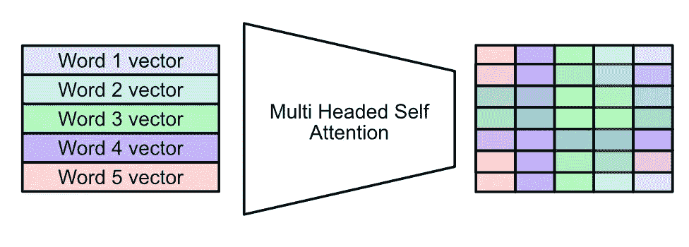

# 使用冻结的大型语言模型进行视觉问答

> 原文：[`towardsdatascience.com/visual-question-answering-with-frozen-large-language-models-353d42791054`](https://towardsdatascience.com/visual-question-answering-with-frozen-large-language-models-353d42791054)

## 与大型语言模型讨论图像，而无需在图像上训练大型语言模型。

[](https://medium.com/@danielwarfield1?source=post_page-----353d42791054--------------------------------)[](https://towardsdatascience.com/?source=post_page-----353d42791054--------------------------------) [Daniel Warfield](https://medium.com/@danielwarfield1?source=post_page-----353d42791054--------------------------------)

·发表于 [Towards Data Science](https://towardsdatascience.com/?source=post_page-----353d42791054--------------------------------) ·18 分钟阅读·2023 年 10 月 9 日

--


“弥合模态”，由 MidJourney 制作。除非另有说明，否则所有图像均由作者提供。

在这篇文章中，我们将使用 Q-Former，一种弥合计算机视觉和自然语言模型的技术，来创建一个视觉问答系统。我们将讨论必要的理论，参照 [BLIP-2 论文](https://arxiv.org/abs/2301.12597)，然后实现一个可以与大型语言模型讨论图像的系统。


我们将构建的内容

**谁会觉得这篇文章有用？** 对计算机视觉、自然语言处理和多模态建模感兴趣的数据科学家。

**这篇文章的难度如何？** 中级。如果你没有一些计算机视觉和自然语言处理的经验，你可能会觉得有些困难。

**前提条件：** 对变换器、嵌入和编码器-解码器有较高的熟悉度。所有这些主题在以下文章中都有涵盖：

## Transformers — 直观且全面的解释

### 探索现代机器学习的浪潮：一步一步拆解变换器

towardsdatascience.com](/transformers-intuitively-and-exhaustively-explained-58a5c5df8dbb?source=post_page-----353d42791054--------------------------------)

# 视觉语言建模的简要时间线

视觉语言建模真正起步于 2016 年，随着论文 [VQA: Visual Question Answering](https://arxiv.org/pdf/1505.00468.pdf) 的发布，该论文正式提出了以下问题类别：

> 给定一张图片和关于这张图片的自然语言问题，任务是提供一个准确的自然语言回答——[VQA: 视觉问答](https://arxiv.org/pdf/1505.00468.pdf)

在 2016 年，当 VQA（视觉问答）被普及时，典型的方法看起来是这样的：


2016 年的一个 VQA 模型使用 LSTM 将问题嵌入向量，使用现有的计算机视觉网络将图像嵌入向量，然后通过一个密集层在正确的输出选择中考虑这两个向量。来自[VQA: 视觉问答](https://arxiv.org/pdf/1505.00468.pdf)。

在 VQA 的早期阶段，从头开始训练视觉和语言组件，将输出传递到密集网络，并选择 n 个可能输出中的一个作为响应是合适的。

随着视觉和语言模型变得更强大，视觉问答让位于**视觉语言建模（VLM）**，它通常被认为是对视觉问答的扩展。现代视觉语言模型不仅可以回答“这张图片中有车吗”这样简单的问题，还可以询问图片中是什么类型的车，然后询问这辆车的驾驶情况、这辆车出演过的最受欢迎的电影等。


这是视觉语言建模实际应用的一个例子。这个特定的例子来自[BLIP-2 论文](https://arxiv.org/pdf/2301.12597.pdf)，我们将用它作为本帖的参考。

从 VQA 到 VLM 的转变在很大程度上是由于将大型语言模型融入视觉系统，提供了复杂的推理能力和开箱即用的百科知识。

视觉语言建模的难点是，一直以来都是**多模态**。你需要擅长图像、自然语言，并且需要让它们良好地协同工作。随着视觉和语言模型的不断扩大，用于将它们结合起来进行视觉语言建模的系统变得越来越复杂。

这带来了实际问题。大型语言模型是巨大的，因此更新它们的参数以学习一些新任务是昂贵的（比如，几千到几百万美元的费用）。此外，当在完全新模式的数据上训练模型时，该模型通常会**灾难性遗忘**；这是一个术语，用于描述模型在调整到新用例时遗忘关键信息的情况。如果你随意将图像编码器和大型语言模型结合起来，你可能会得到一个对图像和文本理解都很差的模型。

[BLIP-2 论文](https://arxiv.org/abs/2301.12597)提出了 Q-Former 来解决灾难性遗忘问题，并且通过利用现有模型来降低成本。

# Q-Former 的简要介绍

如果你想在一个周末从零开始构建一个 VQA 系统，你可以考虑以下方法：

1.  通过标题生成器处理你想讨论的图像

1.  将用户提出的问题和生成的标题结合起来，使用一些模板创建 LLM 的提示。

1.  将该提示传递给 LLM，LLM 将返回最终输出。


一个天真的方法成功的流程图。用户提出了一个能够从生成的标题中回答的问题。

如果你问的是关于图像主题的简单问题，这种方法可能会奏效，但如果你有更晦涩的问题，你可能就会失望了。


一个天真的方法未成功的流程图。用户提出了一个无法从生成的标题中回答的问题。

Q-Former 作为查询 transformer（因此得名）用于根据图像转换用户的查询。**其目的是根据用户的提示从图像中提取正确的信息，并将其提供给 LLM。**


Q-Former 所做的概念图。它利用提示和图像来构建 LLM 的输入。实际上，Q-Former 并不生成文本，而是生成高维嵌入，但这就是概念的本质。

# BLIP-2 架构

在我们真正深入之前，先对其进行高层次的了解。


Q-Former 的稍微准确一点的描述，以及周围的组件。图像编码器将图像嵌入其最重要的部分，文本编码器对用户的提示做同样的处理，而 Q-Former 将它们结合起来，为 LLM 创建输入。

BLIP-2 架构中存在 Q-Former 的组件如下：

+   **图像编码器：** 一个预训练模型，将图像嵌入到抽象表示中，从而使图像分类等任务变得更容易。实际上，你可以将其看作是提取图像的重要内容。一个流行的例子是 CLIP。

+   **文本编码器：** 一个预训练模型，将文本嵌入到抽象表示中。这些模型通常将单词视为高维空间中的点，相似的单词会位于该空间中的相似点。一个流行的例子是 Word2Vec。

+   **LLM：** 一个经过训练的大型语言模型，用于执行通用语言任务。类似于聊天 GPT。

+   **Q-Former：** 一个将嵌入的图像和嵌入的提示结合成与 LLM 兼容的格式的 transformer 模型。Q-Former 的主要工作是正确地上下文化这两种输入，并以有利于文本生成的方式将其提供给 LLM。

由于 Q-Former 的灵活性，可以在 BLIP-2 中使用不同的编码器和 LLM。我在这篇文章中不会深入探讨这些内容，但我将很快撰写一篇关于 CLIP 图像编码的文章，并且我有一篇关于 LLM 和文本嵌入的文章，可能对不熟悉的人有所帮助：

[](/transformers-intuitively-and-exhaustively-explained-58a5c5df8dbb?source=post_page-----353d42791054--------------------------------) [## Transformers — 直观且详尽的解释

### 探索现代机器学习的浪潮：逐步拆解 transformer

[Transformers 直观且详尽的解释](https://medium.com/towards-data-science/transformers-intuitively-and-exhaustively-explained-58a5c5df8dbb)

# Q-Former，简而言之


Q-Former 的高层次概念图

首先，需要对注意力有一个整体理解，因为它构成了 Q-Former 架构的主要部分。我在[这篇文章](https://medium.com/@danielwarfield1/transformers-intuitively-and-exhaustively-explained-58a5c5df8dbb)中直观且详尽地讲解了注意力机制，但基本上，注意力机制会生成修改过的输入副本，然后将这些副本混合在一起。

如果我们将文本输入“What Color is the Background”通过自注意力机制处理，那么句子中每个词的向量将与其他每个词的向量结合。这将产生一个抽象矩阵，其中包含输入中所有词的上下文信息。



多头自注意力，简而言之。这一机制在数学上将不同输入（在这个例子中是词语）的向量结合起来，生成一个矩阵，该矩阵编码了整个输入的更深层次的含义。在[这篇文章](https://medium.com/towards-data-science/transformers-intuitively-and-exhaustively-explained-58a5c5df8dbb)中直观且详尽地解释了这一点。

即使你对注意力机制有所了解，可能仍不清楚为什么自注意力块会被分成两半。实际上，Q-Former 中的两个自注意力块实际上是一个。自注意力机制左侧的输入可以与自注意力机制右侧的输入完全互动，反之亦然。这个划分不是基于模型的工作原理，而是基于模型的训练方式。我们将在下一节中详细讨论，但要点是：由于 Q-Former 的训练方式，自注意力块擅长处理仅图像、仅文本以及同时处理这两者。因此，它有点像两个注意力块，但实际上是一个大的注意力块。


一个概念图展示了 Q-Former 中的自注意力机制如何既隔离文本和图像表示，又促进它们的交互。这是在训练的引导阶段完成的，我们将在下一节中讨论。

图表左下角学习到的标记本质上是模型在第一个自注意力块中使用的学习常量。我们稍后会详细讨论它们，但简而言之，我喜欢从两种方式来理解它们：

1.  如果你从文本的自注意力角度考虑它们，它们在决定文本如何最初介绍给图像。

1.  如果你从与图像互动的角度考虑它们，它们作为初始化，最终会通过图像进行修改，最终成为模型的提示。

此外，如本节的第一张图片所示，有虚线递归连接将两个前馈网络的输出连接回输入。整个区域被描绘为黄色的是一个 Q-Former 块。这些块堆叠在一起以创建完整的 Q-Former。

这就是所有组件，这可能会让人惊讶。仅仅从组件来看，并不明显为什么 Q-Former 在桥接图像和文本方面表现得特别好。要理解这一点，你需要了解 Q-Former 是如何训练的。

# Q-Former 的训练方式

Q-Former 的训练可以分为两个阶段：引导和生成学习预训练。引导阶段可以进一步分为三个子阶段。我们将逐步探讨所有这些。

这些训练阶段的命名可能会有些困惑。什么是“引导”？为什么会有预训练步骤却没有“训练步骤”？我认为这些阶段的命名是以下定义的结果：

+   **引导**是指使用可能不完全适合最终用例的数据，以将模型从随机初始化状态提升到在相关任务中表现良好的状态的过程。

+   **预训练**是指使用大量数据将模型调整到一个普遍良好的状态，为最终任务做好准备。

+   **微调**是指将预训练模型进行调整，并提供少量任务特定数据，以优化其最终建模任务。

BLIP-2 的核心优势之一是**零样本性能**。BLIP-2 承诺能够在没有针对 VQA 数据集进行微调的情况下，出色地完成诸如视觉问答等任务。它使用带有图片说明的图像数据集（这些说明解释了图像的内容）来进行引导和预训练，但从未实际对 VQA 进行微调。

## 引导

引导阶段旨在鼓励模型在需要理解文本和图像的各种任务中表现良好。就像我的[自监督学习帖子](https://medium.com/towards-data-science/self-supervised-learning-using-projection-heads-b77af3911d33)一样，你可以将其视为一种“游戏”，模型学习为视觉问答的最终任务做准备。

引导阶段有三个子阶段。这些将在后续部分中探讨，但总的来说：

1.  **图像-文本对比学习**：模型学习如何将属于一组的图像-字幕对分在一起，并通过 [对比学习](https://medium.com/towards-data-science/self-supervised-learning-using-projection-heads-b77af3911d33) 将不属于一组的图像-字幕对分开。

1.  **图像基础的文本生成：** 将字幕分成两部分，隐藏的和未隐藏的部分，并尝试根据未隐藏的部分和图像来猜测隐藏的部分。

1.  **图像-文本匹配：** 将 Q-Former 的输出传入 [牺牲密集网络](https://medium.com/towards-data-science/self-supervised-learning-using-projection-heads-b77af3911d33)，该网络将输出转换为二元分类，然后使用此二元分类来决定一个字幕是否属于某个图像。

## 图像-文本对比学习


图像-文本对比学习的实际操作。图像侧的所有向量（即 LLM 的输入）都与文本侧的类标记进行比较。在这个例子中，相似度很高，因为图像和文本匹配。我们希望，如果图像和文本不匹配，最大相似度分数会很低。

在这种自举模式中，Q-Former 中的自注意力机制被分为两部分。这是通过应用于注意力层的掩码完成的，称为“单模态自注意力掩码”。这是一个复杂的短语，但表示一个简单的概念：

**在自注意力机制中，每次文本侧与图像侧互动时，只需将值设置为零。**

这实际上阻止了 Q-Former 图像侧和文本侧之间的所有通信。

这种训练方法还使用了一个特殊的标记，称为“类”标记。这个想法受到 [BERT](https://arxiv.org/abs/1810.04805) 的启发，这是一个我将来会详细介绍的里程碑。基本上，你有一个任意的标记，让模型知道“嘿，我们现在在进行图像-文本对比学习”。然后，你会忽略文本侧除了类标记之外的任何其他输出，并使用它来计算损失。因此，模型知道当“类”标记出现时，它是特殊的，并会尝试学习如何操控左侧的视觉和右侧的文本，以最大化对比损失的性能。

**对比损失，本质上，是将匹配对拉近而将不匹配对拉远的任务。** [我有一篇更详细地介绍对比损失的文章](https://medium.com/towards-data-science/self-supervised-learning-using-projection-heads-b77af3911d33)，但本质上，对比损失会查看一组图像及其标题，并尝试让模型学习哪些图像属于哪些标题。在我们的案例中，这通过计算两侧向量的相似度并找到最大相似度值来实现。匹配的文本和图像对应该具有较大的相似度分数，而不匹配的对应该具有较小的相似度分数。

通过执行这种自举操作，我们鼓励模型学习对齐图像和文本。**换句话说，我们正在训练模型来学习哪些图像与某段文本相关，哪些则不相关。**


单模态自注意力的概念图，这是在此训练阶段使用的掩码策略。请注意图像端和文本端都有完全的注意力，但两者之间没有注意力。

## 图像基础文本生成


“图像基础文本生成”预训练步骤的概念图。在这里，Q-Former 的一个输入文本部分被隐藏，Q-Former 的任务是尝试填补隐藏的文本。

在这种自举模式下，我们要求 Q-Former 完成一个部分隐藏的标题。我们应用了“多模态因果自注意力掩码”，允许 Q-Former 的文本端与图像端交互，但隐藏了部分需要由 Q-Former 预测的标题。我们还将“类别”标记替换为“解码器”标记，以让模型知道它应该执行什么任务。


多模态因果自注意力的概念图；这是在此训练阶段使用的掩码策略。请注意，除了那些模型应输出的标记外，所有标记之间都允许完全的注意力。

## 图像-文本匹配


“图像-文本匹配”预训练步骤的概念图。在这个阶段没有使用掩码，允许所有文本和图像标记在自注意力机制中进行交互。请注意，输出是错误的，因为图像与文本“A Painting of a Monster Truck”不兼容。

在这种预训练模式下，我们创建了一个临时线性分类器（一个密集网络），并将 Q-Former 的所有输出标记输入其中。这个线性分类器将标记投影为“真实”或“虚假”预测，用于训练模型预测输入文本是否与输入图像匹配。不同的组合对，无论是匹配还是不匹配的组合，都被输入到模型中。

我在这篇文章中讨论了使用密集网络来投影模型输出用于某些预训练任务的概念。本质上，线性分类器用于训练，但在推理时被丢弃，这有助于模型学习文本和图像的一般表示，但有助于防止模型在任务中过于专业化；如此专业化，以至于在将标记传递给 LLM 的实际任务中表现较差。

你可以把 Q-Former 想象成“理解文本和图像”的部分，而临时线性分类器则是“将这种理解转化为是或否的回答”的部分。在这一步之后，我们会丢弃“将这种理解转化为是或否的回答”的部分，保留一般的文本和图像理解。

## 从自举中得到什么

在上一节中，我们讨论了自举的三个阶段：图像-文本对比学习、图像基础文本生成和图像-文本匹配。通过优化 Q-Former 以完成这些各种任务，Q-Former 被鼓励建立图像和文本的强表示，并建立一个强大的系统来关联这两者。

## 关于学习到的标记的说明

如前所述，学习到的标记（在 BLIP-2 论文中称为“查询向量”）与图像和文本交互以提取关键信息。为了进一步阐述这一点，我想分享 BLIP-2 论文中关于查询向量的以下引文：

关于查询向量的一般情况：

> 查询通过自注意力层相互作用，并通过交叉注意力层（插入每隔一个变换器块）与冻结的图像特征互动。查询还可以通过相同的自注意力层与文本交互。

关于自举阶段如何与查询向量相关：

> 我们的目标是训练 Q-Former，使查询能够学习提取对文本最具信息性的视觉表示。

关于查询向量如何关联文本和图像信息：

> 由于 Q-Former 的架构不允许冻结的图像编码器和文本标记之间直接交互，因此生成文本所需的信息必须首先由查询提取，然后通过自注意力层传递给文本标记。因此，查询被迫提取能够捕捉文本所有信息的视觉特征。

# **预训练**

现在我们有了一个在文本和图像上具有良好内部表示的 Q-Former，我们可以将其连接到 LLM 上，并使用它来训练 Q-Former。


[BLIP-2](https://arxiv.org/pdf/2301.12597.pdf) 的生成预训练图

我们可以将图像的描述分成两部分，一个前缀和一个后缀。我们可以通过整个 BLIP-2 架构传递前缀，并修改 Q-Former 的权重以鼓励 LLM 的输出为后缀。从概念上讲，这使图像和文本的表示在 Q-Former 中与特定 LLM 模型的需求对齐。

# 理论总结

太好了，现在我们了解了 BLIP-2 架构；组件、Q-Former（其核心组件）如何工作以及如何进行训练。在下一节中，我们将使用预训练的 BLIP-2 进行图像描述、VQA，甚至进行小型图像基础对话。


整个[BLIP-2](https://arxiv.org/pdf/2301.12597.pdf)架构


在[BLIP-2 论文](https://arxiv.org/pdf/2301.12597.pdf)中定义的 BLIP-2 架构与 Q-Former 的关系。这里我们可以看到 Q-Former 的输入、学习到的查询、三种训练引导策略和支持这些策略的三种掩码。一个微妙的说明：BLIP-2 每隔一个块就将图像暴露给 Q-Former。我邀请你自行思考这样做的理由。对我来说，这感觉像是一种残差连接，鼓励对图像进行反复且越来越复杂的分析。没有图像访问权限的块可以形成复杂的关系，然后在随后的块中与图像进行比较。

# 使用 Hugging Face 的 Q-Former 进行 VQA

在未来的帖子中，我会从零开始编写和训练一个 Q-Former，但我认为你会同意这篇帖子已经足够长了。现在让我们使用预构建的解决方案来实验 Q-Formers。

完整的笔记本可以在这里查看：

[](https://github.com/DanielWarfield1/MLWritingAndResearch/blob/main/VQAWithQFormer.ipynb?source=post_page-----353d42791054--------------------------------) [## MLWritingAndResearch/VQAWithQFormer.ipynb at main · DanielWarfield1/MLWritingAndResearch

### 用于机器学习写作和研究的笔记本示例 - MLWritingAndResearch/VQAWithQFormer.ipynb at main ·…

github.com](https://github.com/DanielWarfield1/MLWritingAndResearch/blob/main/VQAWithQFormer.ipynb?source=post_page-----353d42791054--------------------------------)

由 SalesForce 内的机器学习团队 LAVIS（发布 BLIP-2 论文的团队）慷慨地提供了 Hugging Face 上的端到端预训练解决方案：

```py
"""Downloading the BLIP-2 Architecture
loading as an 8 bit integer to save on GPU memory. This may have some impact on
performance.
"""

from transformers import AutoProcessor, Blip2ForConditionalGeneration
import torch

processor = AutoProcessor.from_pretrained("Salesforce/blip2-opt-2.7b")
model = Blip2ForConditionalGeneration.from_pretrained("Salesforce/blip2-opt-2.7b", device_map="auto", load_in_8bit=True) # load in int8
```

如你所见，BLIP-2 包含两个部分；一个处理器和一个模型。首先，让我们探讨处理器。

## 处理器

在 HuggingFace 提供的示例中，处理器用于在将输入（包括文本和图像）传递给 BLIP-2 之前进行预处理。让我们加载一张图像，生成一些文本，并将其传递给处理器，看看结果如何。

```py
"""Loading and displaying a sample image
"""

import requests
from PIL import Image

url = 'https://github.com/DanielWarfield1/MLWritingAndResearch/blob/main/Assets/Images/pexels-thuany-marcante-1805053.jpg?raw=true'
image = Image.open(requests.get(url, stream=True).raw).convert('RGB')

print(f'Image dimensions: {image.width}px X {image.height}px')

dsfact = 15
display(image.resize((int(image.width/dsfact), int(image.height/dsfact))))
```


我们将使用的一个示例图像

将这张图片和一些示例文本传递给处理器后，我们可以看到从处理器获得了一个字典：

```py
"""Exploring the outputs of the processor
"""
processor_result = processor(image, text='a prompt from the user about the image', return_tensors="pt").to("cpu", torch.float16)
processor_result.keys()
```


从处理器获得的 pixel_values 是将图像缩小到 224 x 224 的变换，颜色值被标准化到适合建模的范围。

```py
"""Understanding resolution and plotting one of the color channels
"""

import matplotlib.pyplot as plt

#printing the processed image shape
print(f'processed image shape: {processor_result["pixel_values"].numpy().shape}')

#extracting one of the color channels from the processed image
print('single color channel:')
processed_im_c0 = processor_result['pixel_values'].numpy()[0,0]

#rendering
plt.imshow(processed_im_c0, interpolation='nearest')
plt.show()
```


```py
"""Understanding the distribution of values allong each color channel,
both in the processed image and in the original image
"""

bins = 100

#extracting all color channels from the processed image
processed_im_c1 = processor_result['pixel_values'].numpy()[0,1]
processed_im_c2 = processor_result['pixel_values'].numpy()[0,2]

#plotting modified pixel value distributions

plt.figure()
plt.hist([processed_im_c0.flatten(),
          processed_im_c1.flatten(),
          processed_im_c2.flatten()], bins, stacked=True, density = True)
plt.title('processed image value distribution')
plt.show()

#plotting original pixel value distributions
import numpy as np
image_np = np.array(image)

plt.figure()
plt.hist([image_np[:,:,0].flatten(),
          image_np[:,:,1].flatten(),
          image_np[:,:,2].flatten()], bins, stacked=True, density = True)
plt.title('raw image value distribution')
plt.show()
```


处理过的图像的值被缩减到一个合理的范围，并且它们似乎平均接近于零


原始图像的值具有偏倚分布，覆盖了更宽的值范围

从处理器获得的 input_ids 是词片索引。句子的各个部分被分配了单独的索引，这些索引后来被用于词向量嵌入器，然后应用于 BLIP-2。

```py
"""Exploring the input_ids from the processor given a variety of prompts
"""

print('input_ids for "a short prompt":')
sampres = processor(image, text='a short prompt', return_tensors="pt").to("cpu", torch.float16)
print(sampres['input_ids'])

print('input_ids for "a much much much much longer prompt":')
sampres = processor(image, text='a much much much much longer prompt', return_tensors="pt").to("cpu", torch.float16)
print(sampres['input_ids'])

print('input_ids for "alongcompoundword":')
sampres = processor(image, text='alongcompoundword', return_tensors="pt").to("cpu", torch.float16)
print(sampres['input_ids'])
```


由于我们是在推断模型，因此处理器提供的掩码只是全 1，允许模型看到所有输入值。

```py
"""Understanding the mask from the processor
"""

print('input_ids for "a short prompt":')
sampres = processor(image, text='a short prompt', return_tensors="pt").to("cpu", torch.float16)
print(sampres['input_ids'])
print('mask for "a short prompt":')
print(sampres['attention_mask'])
```


## 调用模型

现在我们对处理器的功能有了初步了解，我们可以开始使用它将数据传递给 BLIP-2，并开始生成输出。

**图像标题生成：** 如果你提供图像而没有文本，BLIP-2 将为图像生成标题。

```py
"""Getting BLIP-2 to describe the image, unprompted
this is done by only passing the image, not the text
"""
inputs = processor(image, return_tensors="pt").to(device, torch.float16)

generated_ids = model.generate(**inputs, max_new_tokens=20)
generated_text = processor.batch_decode(generated_ids, skip_special_tokens=True)[0].strip()
print(generated_text)
```


**提示图像标题生成：** 如果你为标题提供一个前缀，BLIP-2 将尝试完成这个标题。

```py
"""Prompted caption example 1
"""

prompt = "this is a picture of"

inputs = processor(image, text=prompt, return_tensors="pt").to(device, torch.float16)

generated_ids = model.generate(**inputs, max_new_tokens=20)
generated_text = processor.batch_decode(generated_ids, skip_special_tokens=True)[0].strip()
print(generated_text)
```


完成提示“这是一张……的图片”的结果

```py
"""Prompted caption example 2
"""

prompt = "the weather looks"

inputs = processor(image, text=prompt, return_tensors="pt").to(device, torch.float16)

generated_ids = model.generate(**inputs, max_new_tokens=20)
generated_text = processor.batch_decode(generated_ids, skip_special_tokens=True)[0].strip()
print(generated_text)
```


完成提示“天气看起来……”的结果

**视觉问答：** 通过调用格式化特殊查询的 BLIP-2，可以实现视觉问答，而无需经过视觉问答数据的训练。

```py
prompt = "Question: what season is it? Answer:"

inputs = processor(image, text=prompt, return_tensors="pt").to(device, torch.float16)

generated_ids = model.generate(**inputs, max_new_tokens=20)
generated_text = processor.batch_decode(generated_ids, skip_special_tokens=True)[0].strip()
print(generated_text)
```


**基于视觉的对话：** 我们可以将提示格式化成类似对话的内容，从而与模型就图像进行对话。

```py
"""Visual Conversation
conversing about the image
"""

#imagine these are generated by a person as a response to output, rather than pre-defined.
questions = [
    "What's in this photo?",
    "What is vernacular architecture?"
]

#defining the state of the conversation as it progresses, to be passed to the model
conv_state = ''

#asking all questions in order
for question in questions:
    #updating the conversational state with the question
    conv_state = conv_state+' Question: ' + question + ' Answer: '

    #passing the state thus far to the model
    inputs = processor(image, text=conv_state, return_tensors="pt").to(device, torch.float16)

    #generating a response
    generated_ids = model.generate(**inputs, max_new_tokens=40)
    generated_text = processor.batch_decode(generated_ids, skip_special_tokens=True)[0].strip()

    #rendering conversation
    print('Question: '+question)
    print('Answer: ' + generated_text)

    #updating the conversational state with the answer
    conv_state = conv_state + generated_text + '\n'
```


# 结论

在这篇文章中，我们回顾了多模态图像和语言建模的发展历史；从最初的视觉问答，到现代阶段使用大型语言模型和图像编码器。我们描述了一种将图像暴露给大型语言模型的方法，即 BLIP-2 架构，并描述了其最重要组件 Q-Former 的内部工作原理。接着，我们探索了 BLIP-2 在标题生成、视觉问答和基于视觉的对话中的实际应用。

# 关注以获取更多信息！

我描述机器学习领域的论文和概念，重点是提供实用和直观的解释。我计划在未来的文章中从零开始实现一个 Q-Former。

**归属声明：** 本文档中的所有图片均由**丹尼尔·沃菲尔德**创作，除非另有来源说明。您可以将此帖中的任何图片用于非商业目的，只要您注明此文章，[`danielwarfield.dev`](https://danielwarfield.dev/)，或两者皆可。
