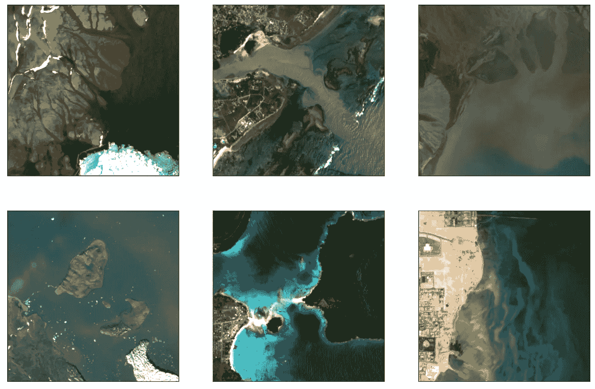
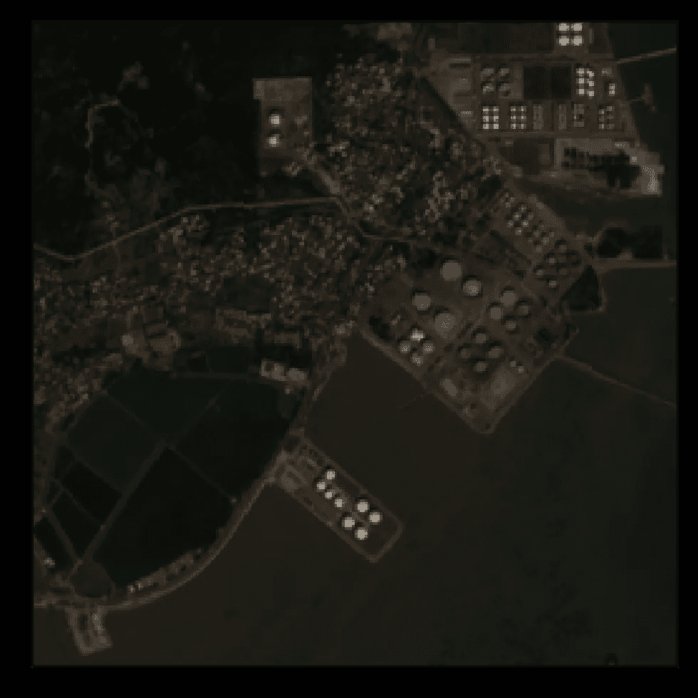
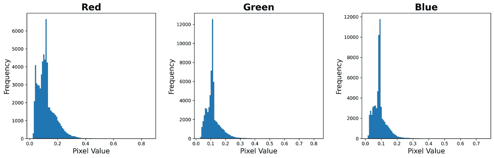
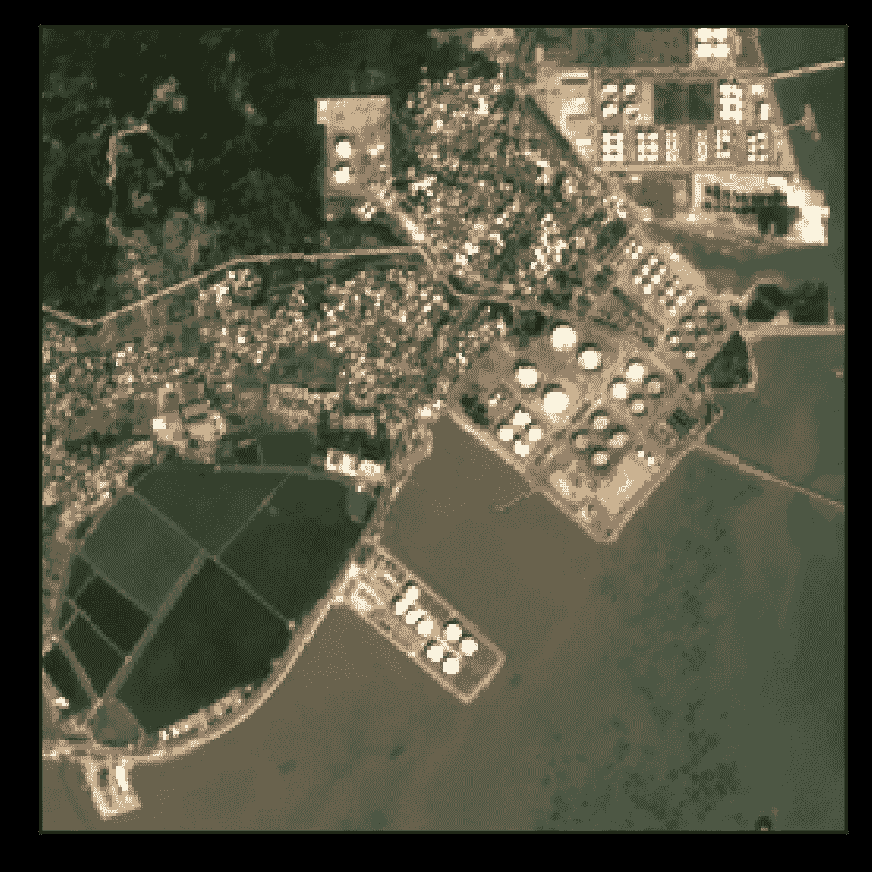
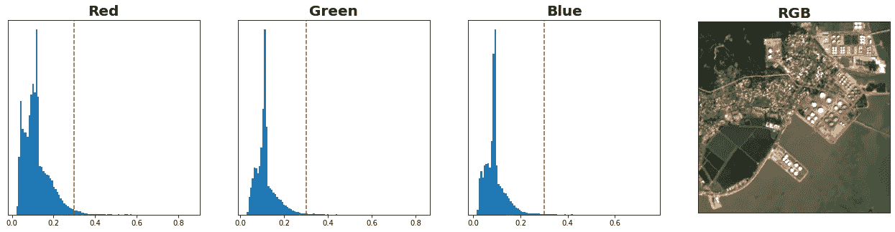
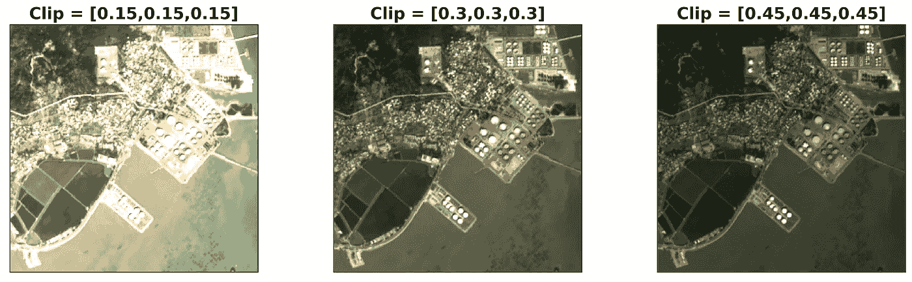
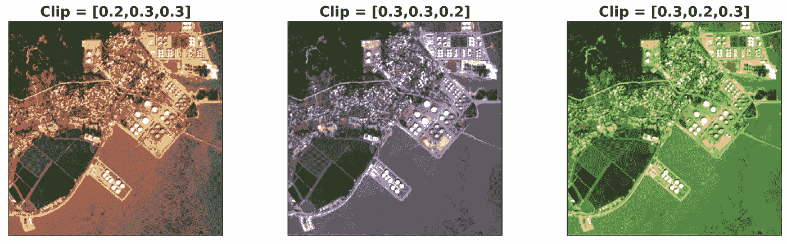

# 使用 Python 可视化卫星图像的 RGB 通道

> 原文：[`towardsdatascience.com/visualising-the-rgb-channels-of-satellite-images-with-python-6d541af1f98d`](https://towardsdatascience.com/visualising-the-rgb-channels-of-satellite-images-with-python-6d541af1f98d)

## 在可视化卫星图像时，如何处理多个光谱波段、大像素值和倾斜的 RGB 通道

[](https://conorosullyds.medium.com/?source=post_page-----6d541af1f98d--------------------------------)[](https://towardsdatascience.com/?source=post_page-----6d541af1f98d--------------------------------) [Conor O'Sullivan](https://conorosullyds.medium.com/?source=post_page-----6d541af1f98d--------------------------------)

·发表于 [Towards Data Science](https://towardsdatascience.com/?source=post_page-----6d541af1f98d--------------------------------) ·阅读时长 6 分钟·2023 年 4 月 11 日

--



（来源：[SWED](https://openmldata.ukho.gov.uk/))

卫星图像包含大量信息。缺点是它们的可视化并不简单。与普通图像不同，卫星图像可能具有：

+   **超过 12 个通道**

+   **大像素值**

+   **倾斜的像素值**

我们将讨论这些关键考虑因素。然后，我们将这些因素考虑到一个 Python 函数中，这样你在组合 RGB 通道时就能拥有更大的灵活性。具体来说，它允许你调整图像的**亮度**和**色调**。代码已给出，完整项目可以在 [GitHub](https://github.com/conorosully/medium-articles/blob/master/src/remote%20sensing/visualise_rgb_bands.ipynb) 上找到。

# 导入和数据集

我们的第一个导入是 [地理空间数据抽象库](https://gdal.org/index.html)（gdal）。这在处理遥感数据时非常有用。我们还引入了更多标准的 Python 包（第 4-5 行）。最后，glob 用于处理文件路径（第 7 行）。

```py
# Imports
from osgeo import gdal

import numpy as np
import matplotlib.pyplot as plt

import glob
```

我们将可视化来自测试集的图像 [**Sentinel-2 水边数据集**](https://openmldata.ukho.gov.uk/#:~:text=Sentinel%2D2%20Water%20Edges%20Dataset%20contains%20pairs%20of%20images%20and,non%2Dwater%20(0).) **(**SWED)。该数据集包含来自 49 个位置的 98 张海岸线图像。我们将在下方加载这些图像的所有路径。

```py
#Load paths
paths = glob.glob("../data/SWED/test/images/*")
```

# 关键考虑因素

## 光谱波段数量

我们加载第一张图像（第 2 行），并输出其形状（第 3 行）。这给出的值为**（12,256,256）**。换句话说，每张图像由 12 个通道的 256x256 像素组成。如果这是一个普通图像，我们会期望其维度为（256,256,3）。也就是说，每个像素有 3 个通道——RGB。

```py
#Load first image
img = gdal.Open(paths[0]).ReadAsArray()
img.shape #(12,256,256)
```

12 个通道是[哨兵-2 光谱带](https://en.wikipedia.org/wiki/Sentinel-2)。每个光谱带测量的是从地球表面反射的不同波长的电磁辐射。这包括人眼无法看到的红外光。在可视化图像时，我们只对可见光光谱带感兴趣。

对于我们的特定图像，显光带位于位置 3（红色）、2（绿色）和 1（蓝色）。我们在下面选择这些。我们还转置了数组，使其维度为（256,256,3）。

```py
#Get RGB image
rgb = img[[3,2,1]].transpose(1,2,0)
```

## 大像素值

为了捕捉尽可能多的细节，卫星图像具有大的动态范围。因此，像素值不会落入典型的[0, 255]范围内。对于我们的图像，打印最小和最大像素值给出的是**150 和 8600**。

```py
# Pixel range 
print(rgb.min(),rgb.max()) #150 8,600
```

哨兵-2 图像具有[最大反射值为 10000](https://docs.digitalearthafrica.org/en/latest/data_specs/Sentinel-2_Level-2A_specs.html)。虽然像素值有时会高于此值，但在可视化 RGB 通道时，我们可以忽略这些大值。因此，我们通过将图像除以 10000 并剪裁到 0 和 1 之间来缩放图像。这确保所有像素值都在 0 和 1 之间。

```py
#Scale image
rgb = np.clip(rgb/10000,0,1)
```

## 偏向的像素值

现在我们可以使用 matplotlib 显示我们的卫星图像（第 2 行）。你会注意到图像的亮度/对比度较低。这在显示 RGB 通道时是典型的。

```py
#Display RGB image
plt.imshow(rgb)
```



图 1：低亮度的 RGB 通道（来源：作者）（数据集：[SWED](https://openmldata.ukho.gov.uk/)）

如前所述，卫星图像的动态范围很大。这是为了捕捉更广泛的像素范围——从非常亮到非常暗。结果是，像素往往**偏向**较低的值。你可以在下面的直方图中看到这一点。这些直方图显示了上述图像的 RGB 通道的像素频率。



图 2：卫星图像 RGB 通道的偏向像素值（来源：作者）

```py
#Display histograms of pixel intesity for each band
fig, axs = plt.subplots(1,3,figsize=(18,5))
fig.patch.set_facecolor('xkcd:white')

labels = ['Red','Green','Blue']
for i,ax in enumerate(axs):
    ax.hist(rgb[:,:,i].flatten(),bins=100)
    ax.set_title(labels[i],size=20,fontweight="bold")
    ax.set_xlabel("Pixel Value",size=15)
    ax.set_ylabel("Frequency",size =15) 
```

获取更好图像的一个简单方法是剪裁每个通道的像素值范围（第 2 行）。我们只取像素值从 0 到 0.3，并将它们缩放回 0 到 1 之间。在**图 3**中，你可以看到结果图像更亮。

```py
# Clip RGB image to 0.3
rgb = np.clip(rgb,0,0.3)/0.3

plt.imshow(rgb)
```



图 3：高亮度的 RGB 通道（来源：作者）（数据集：[SWED](https://openmldata.ukho.gov.uk/)）

# 整合所有内容

对于快速可视化，上述内容足矣。如果你想对过程有更多控制，可以使用下面的函数。这将缩放图像，选择 RGB 通道，并使用不同的截止值剪裁每个通道。还有一个显示选项，将输出带有所选截止值的 RGB 直方图。

```py
def visualise_rgb(img,clip=[0.3,0.3,0.3],display=True):
        """Visulaise RGB image with given clip values and return image"""

        # Scale image
        img = np.clip(img/10000,0,1)

        # Get RGB channels
        rgb = img[[3,2,1]]

        #clip rgb values
        rgb[0] = np.clip(rgb[0],0,clip[0])/clip[0]
        rgb[1] = np.clip(rgb[1],0,clip[1])/clip[1]
        rgb[2] = np.clip(rgb[2],0,clip[2])/clip[2]

        rgb = rgb.transpose(1,2,0)

        if display:

                #Display histograms of pixel intesity with given clip values
                fig, axs = plt.subplots(1,4,figsize=(22,5))
                fig.patch.set_facecolor('xkcd:white')

                labels = ['Red','Green','Blue']
                for i,ax in enumerate(axs[0:3]):
                        ax.hist(img[3-i].flatten(),bins=100)
                        ax.set_title(labels[i],size=20,fontweight="bold")
                        ax.axvline(clip[i],color="red",linestyle="--")
                        ax.set_yticks([])

                #Display RGB image
                axs[3].imshow(rgb)
                axs[3].set_title("RGB",size=20,fontweight="bold")
                axs[3].set_xticks([])
                axs[3].set_yticks([])

        return rgb
```

你可以在下面看到这个功能的实际效果。在这个案例中，我们使用 0.3 的截止值剪切每个通道。**图 4** 显示了这些截止值的直方图和结果 RGB 图像。这在尝试不同截止值时可能会很有用。

```py
img = gdal.Open(paths[0]).ReadAsArray()
rgb = visualise_rgb(img,[0.3,0.3,0.3])
```



图 4：RGB 通道可视化功能的输出（来源：作者）（数据集：[SWED](https://openmldata.ukho.gov.uk/)）

## 调整亮度

不同的图像会有不同的最佳截止值。实际上，本文的封面图像是使用 3 个不同的值创建的。上述功能使调整这些值变得简单。在**图 5**中，你可以看到调整截止值如何改变亮度。

```py
rgb_1 = visualise_rgb(img,[0.15,0.15,0.15],display=False)
rgb_2 = visualise_rgb(img,[0.3,0.3,0.3],display=False)
rgb_3 = visualise_rgb(img,[0.45,0.45,0.45],display=False)
```



图 5：调整卫星图像的亮度（来源：作者）（数据集：[SWED](https://openmldata.ukho.gov.uk/)）

## 调整颜色（色调）

它还可以让你对每个颜色通道有更多控制。如**图 6**所示，如果我们降低某个通道的截止值，该颜色将变得更加突出。这可以帮助你微调可视化效果。

```py
rgb_1 = visualise_rgb(img,[0.2,0.3,0.3],display=False)
rgb_2 = visualise_rgb(img,[0.3,0.3,0.2],display=False)
rgb_3 = visualise_rgb(img,[0.3,0.2,0.3],display=False)
```



图 6：调整卫星图像的颜色（来源：作者）（数据集：[SWED](https://openmldata.ukho.gov.uk/)）

在处理遥感数据时，通常重要的是可视化你的图像。这将帮助你建立对问题的直觉。也许更重要的是，你可以创建用于向他人解释工作的美丽图像。上述功能将帮助你创建最引人注目的图像。请记住，你可能需要根据你的卫星图像数据集进行调整。

希望你喜欢这篇文章！你可以通过成为我的 [**推荐会员**](https://conorosullyds.medium.com/membership) 来支持我 **:)**

[](https://conorosullyds.medium.com/membership?source=post_page-----6d541af1f98d--------------------------------) [## 通过我的推荐链接加入 Medium — Conor O’Sullivan

### 作为 Medium 会员，你的会员费的一部分将会分配给你阅读的作者，你将可以访问所有故事…

conorosullyds.medium.com](https://conorosullyds.medium.com/membership?source=post_page-----6d541af1f98d--------------------------------)

| [Twitter](https://twitter.com/conorosullyDS) | [YouTube](https://www.youtube.com/channel/UChsoWqJbEjBwrn00Zvghi4w) | [Newsletter](https://mailchi.mp/aa82a5ce1dc0/signup) — 免费注册获取 [Python SHAP 课程](https://adataodyssey.com/courses/shap-with-python/)

## 数据集

**Sentinel-2 水边数据集**（SWED）（许可：[Sentinel 数据法律声明](https://sentinel.esa.int/documents/247904/690755/Sentinel_Data_Legal_Notice)） [`openmldata.ukho.gov.uk/`](https://openmldata.ukho.gov.uk/)

## 参考文献

GISGeography，**Sentinel 2 波段及组合**（2022），[`gisgeography.com/sentinel-2-bands-combinations/`](https://gisgeography.com/sentinel-2-bands-combinations/)

Csaba，**在 Python 中创建 Sentinel-2 RGB 合成图像**（2021），[`www.satmapper.hu/en/rgb-images/`](https://www.satmapper.hu/en/rgb-images/)
