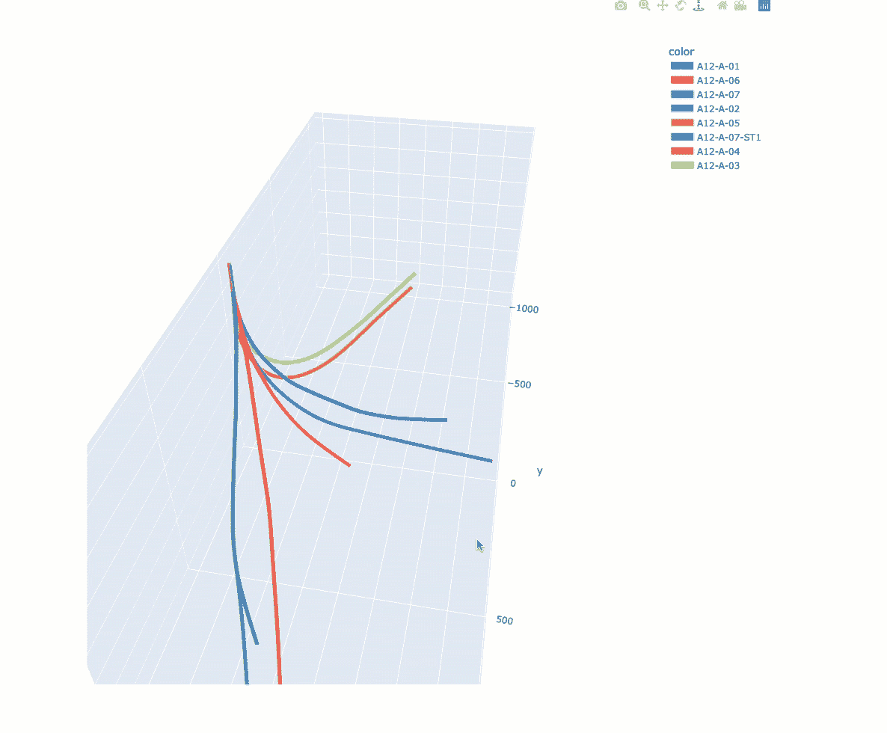

# 使用 Plotly Express 在 3D 线图上可视化井路径

> 原文：[`towardsdatascience.com/visualising-well-paths-on-3d-line-plots-with-plotly-express-de73ca73dea3`](https://towardsdatascience.com/visualising-well-paths-on-3d-line-plots-with-plotly-express-de73ca73dea3)

## 使用 Plotly Express 的 3D 线图

[](https://andymcdonaldgeo.medium.com/?source=post_page-----de73ca73dea3--------------------------------)[](https://towardsdatascience.com/?source=post_page-----de73ca73dea3--------------------------------) [Andy McDonald](https://andymcdonaldgeo.medium.com/?source=post_page-----de73ca73dea3--------------------------------)

·发布于 [Towards Data Science](https://towardsdatascience.com/?source=post_page-----de73ca73dea3--------------------------------) ·阅读时间 7 分钟·2023 年 6 月 4 日

--


使用 Plotly Express 进行的 3D 井路径可视化。图片由作者提供。

可视化是我们理解井记录数据和地下数据的关键任务之一。这包括在井记录图、散点图和直方图上查看数据。通过这样做，我们可以对数据有一个可靠的理解。然而，处理 2D 图有时是不够的，我们需要通过 3D 增加额外的维度。

在岩石物理学和地球科学中，3D 可视化的一个优秀应用案例是可视化井的路径。

在石油和天然气勘探的早期阶段，井是垂直钻入地下的。然而，随着技术的进步，行业从垂直钻探转向水平钻探，最终使用地质导向的创新技术钻探复杂的井路径。

井路径几何的这种演变突显了在三维中可视化井路径的重要性。这样做可以让我们更好地理解井如何穿透地质层，并规划未来的井以避免碰撞或问题。

在本文中，我们将探讨如何利用记录井位置的井调查数据，并使用 Plotly Express 的 3D 线图展示这些数据。

# 数据

在这个简短的教程中，我们将使用来自荷兰北海区域八口井的勘探数据。这些数据来源于提供免费使用的井记录数据的[NLOG.nl](https://www.nlog.nl)网站，这些数据是过去几十年中获取的。

这些文件包含以下列：

+   **MD**：测量深度（米）

+   **INC**：钻孔倾斜度（度）

+   **AZI**：钻孔方位角（度）

+   **TVD**：真实垂直深度（米）

+   **XOFFSET**：井在 X 方向上的位置（米）

+   **YOFFSET**：井在 Y 方向的位置（米）


为了简化数据加载，每个文件中的列名都是相同的。

数据集的完整细节可以在文章末尾找到。

此外，本教程中使用的所有井数据都具有相同的来源。我将在未来的文章中讲解如何将 XOFFSET 和 YOFFSET 转换为网格坐标。

# 设置数据

首先，我们需要导入多个库。对于这篇文章，我们将相对简单地导入[**pandas**](https://pandas.pydata.org) — 用于读取我们的`csv`数据，和[**Plotly** **Express**](https://plotly.com/python/plotly-express/) — 用于创建我们的可视化，还有[**os**](https://docs.python.org/3/library/os.html) — 用于读取包含文件的目录。

```py
import pandas as pd
import plotly.express as px

import os
```

我们可以通过几种方式将数据加载到 Python 和[**Pandas**](http://pandas.pydata.org)中。

为了简化操作，我保留了长形式的代码，以帮助那些新手理解发生了什么。

首先，我们需要创建一个空列表来存储我们的文件路径。

```py
# Create empty list to store file paths
survey_data = []
```

接下来，我们将创建一个变量来存储包含调查数据的 CSV 文件的文件路径位置。

```py
# Set up the file path location. This can be a relative or absolute path
file_path = 'Data/Notebook 43/'
```

最后，我们可以遍历`file_path`目录中的每个文件，并检查是否有扩展名为.csv 的文件。一旦找到这些文件，完整的文件路径将被附加到 file_path 列表中。

```py
# Loop through each file within the file_path location
for f in os.listdir(file_path):
    # Check for CSV files
    if f.endswith('.csv'):
        # Add CSV file location to the survey_data list
        survey_data.append(f'{file_path}{f}')

survey_data
```

当我们查看`survey_data`列表时，我们得到以下内容：

```py
['Data/Notebook 43/NLOG - A12-A-01 - Survey.csv',
 'Data/Notebook 43/NLOG - A12-A-06 - Survey.csv',
 'Data/Notebook 43/NLOG - A12-A-07 - Survey.csv',
 'Data/Notebook 43/NLOG - A12-A-02 - Survey.csv',
 'Data/Notebook 43/NLOG - A12-A-05 - Survey.csv',
 'Data/Notebook 43/NLOG - A12-A-07-ST1 - Survey.csv',
 'Data/Notebook 43/NLOG - A12-A-04 - Survey.csv',
 'Data/Notebook 43/NLOG - A12-A-03 - Survey.csv']
```

一旦我们有了文件路径，我们需要使用 pandas 中的`.concat`和`map`函数将它们合并成一个[**pandas**](http://pandas.pydata.org)数据框。

```py
df = pd.concat(map(pd.read_csv, survey_data))
```

当我们查看数据框（`df`）时，我们将得到以下内容。


这是来自八个荷兰部门石油和天然气井的合并井调查数据的数据框。图片由作者提供。

或者，如果你是一个更高级的 Python 用户，并且希望寻找更高效的方法将多个文件直接加载到[**pandas**](http://pandas.pydata.org)数据框中，你可以使用以下函数。

如你所见，它更加紧凑。

```py
# Alternatively:
import glob
df = pd.concat(map(pd.read_csv, glob.glob('Data/Notebook 43/*.csv')))
```

为了确认我们已经加载了所有的井数据，我们可以调用**WELL**列并查看其中的唯一值。

```py
df['WELL'].unique()
```

这将返回一个包含 8 个井的数组。

```py
array(['A12-A-01', 'A12-A-06', 'A12-A-07', 'A12-A-02', 'A12-A-05',
       'A12-A-07-ST1', 'A12-A-04', 'A12-A-03'], dtype=object)
```

# 创建一个交互式的 Plotly Express 3D 折线图

对于这个例子，我们将使用[Plotly Express 的 3D 折线图](https://plotly.com/python/3d-line-plots/)而不是使用 matplotlib 的 3D 图。从我的经验来看，这种方式生成和处理 3D 图似乎更快、更高效、更简便。

要创建我们的[3D 折线图（Line Plot）](https://plotly.com/python/3d-line-plots/)，我们首先需要创建一个图形并将其分配给`px.line_3d()`。

在此函数中，我们将传入我们的 XOFFSET、YOFFSET、TVD 和 WELL 列。

这将允许我们绘制每个井的 X、Y 和 TVD（真实垂直深度）位置，并通过 WELL 列用颜色区分它们。

```py
fig = px.line_3d(x=df.XOFFSET, 
                 y=df.YOFFSET, 
                 z=df.TVD, 
                 color=df.WELL)
fig.show()
```

一旦我们运行上述代码，我们会得到如下图形。


Plotly Express 3D 线条图显示了在调整比例和线条之前的井路径情况。图片由作者提供。

从图中可以明显看出，我们需要调整它，以获得更好的效果。

这个图表存在一些问题，我们需要解决：

+   整体图形较小

+   线条宽度非常细

+   井路径颠倒了

我们可以通过一些调整来解决这个问题。

首先，我们将更新图表的布局，并定义一个`width`和`height`参数。

然后，我们将更新包含 TVD 测量的 z 轴，并将其设置为反向比例。

最后，我们可以通过调用`update_traces()`来加粗线条。

```py
fig = px.line_3d(x=df.XOFFSET, 
                 y=df.YOFFSET, 
                 z=df.TVD, 
                 color=df.WELL)

fig.update_layout(width=800, 
                  height=800,
                  autosize=False,
                  scene={'zaxis':{'autorange':'reversed'}})

fig.update_traces(line={'width':10})

fig.show()
```

当我们运行上述代码时，我们会得到如下互动图形。



Plotly Express 3D 线条图显示了在调整比例和线条后井路径的情况。图片由作者提供。

我们可以看到，井路径现在正确定位，并且我们有了一个稍微大的图形进行操作。

以这种方式可视化数据使我们能够看到井的去向，以及是否有任何井的侧钻。如果我们专注于规划未来的井，我们能够在过程早期识别任何潜在问题。

# 总结

清晰地可视化井路径是理解井位置的绝佳方法。它不仅可以显示井在地下的位置，还能显示相对于其他附近井的位置。

在这个简短的教程中，我们已经了解了如何利用 Python 和 Plotly Express 库，在互动 3D 图上可视化多个井路径。这使我们能够以易用的方式深入了解井的具体位置。

在你的下一个项目中试试看吧。

# 数据详情

本教程中使用的数据下载自[**NLOG.nl**](https://www.nlog.nl/en/welcome-nlog)，这是一个包含整个荷兰北海区域井记录数据的网站。数据可以免费下载和使用。数据许可证的完整细节可以在[**这里**](https://www.nlog.nl/en/disclaimer)找到，但知识产权部分提供了使用的摘要：

> *NLOG.NL 不对通过本网站提供的信息（域名、商标权、专利及其他知识产权除外）主张任何权利。用户可以在不事先获得 NLOG.NL 的书面许可或合法授权方同意的情况下，复制、下载、公开、分发或简化本网站提供的信息。用户还可以复制、重复、处理或编辑这些信息和/或布局，前提是标明 NLOG.NL 作为来源。*

*感谢阅读。在离开之前，你一定要订阅我的内容，将我的文章直接送到你的收件箱。* [***你可以在这里完成订阅！***](https://andymcdonaldgeo.medium.com/subscribe)*或者，你也可以* [***注册我的新闻通讯***](https://fabulous-founder-2965.ck.page/2ca286e572) *以便将额外的内容直接免费送到你的收件箱。*

*其次，你可以通过注册会员获得完整的 Medium 体验，并支持成千上万的其他作家和我。它只需每月 $5，你将全面访问所有精彩的 Medium 文章，并有机会通过写作赚取收入。*

*如果你通过* [***我的链接***](https://andymcdonaldgeo.medium.com/membership)***注册***，*你将直接用部分费用支持我，而且不会增加你的成本。如果你这样做了，非常感谢你的支持。*
