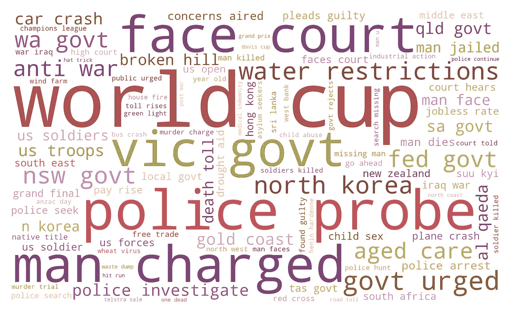
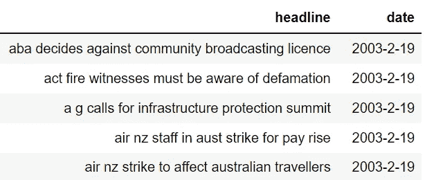
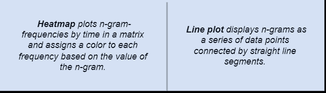
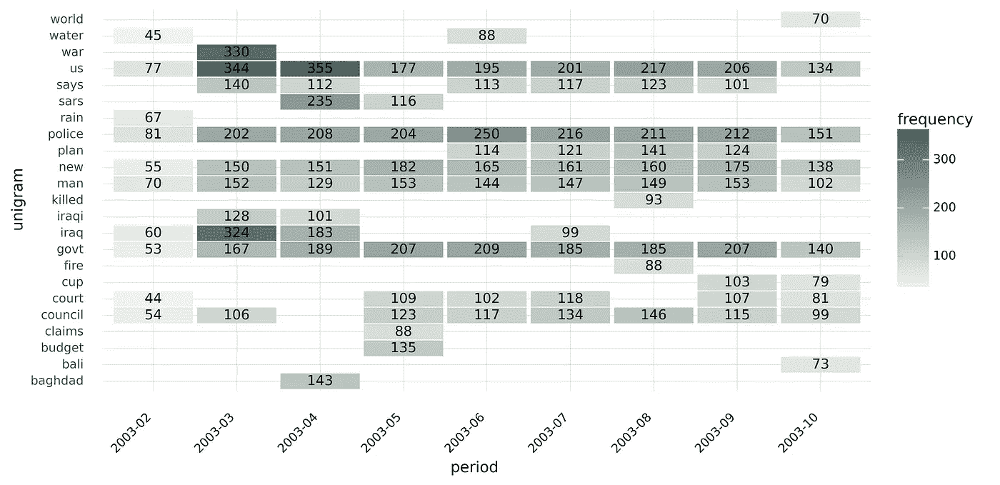
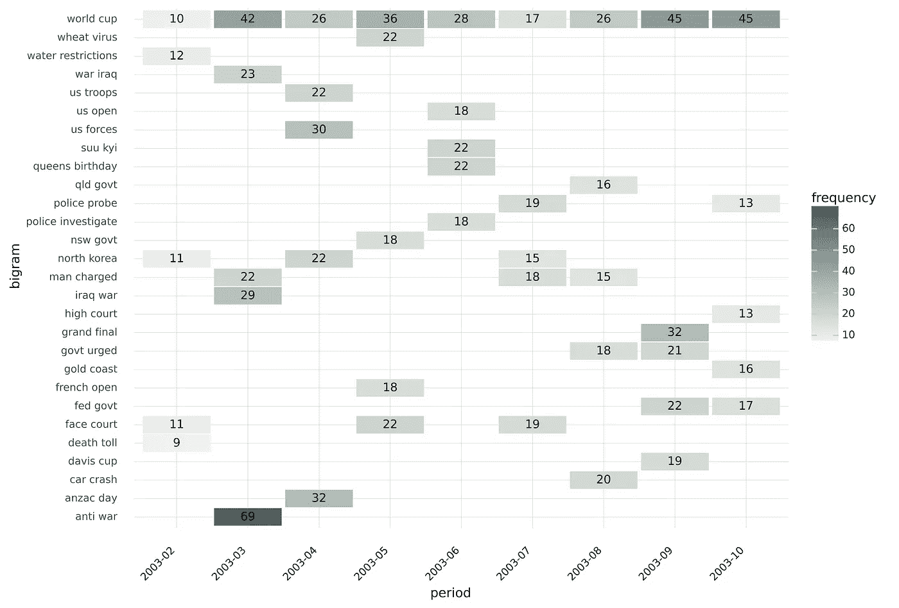
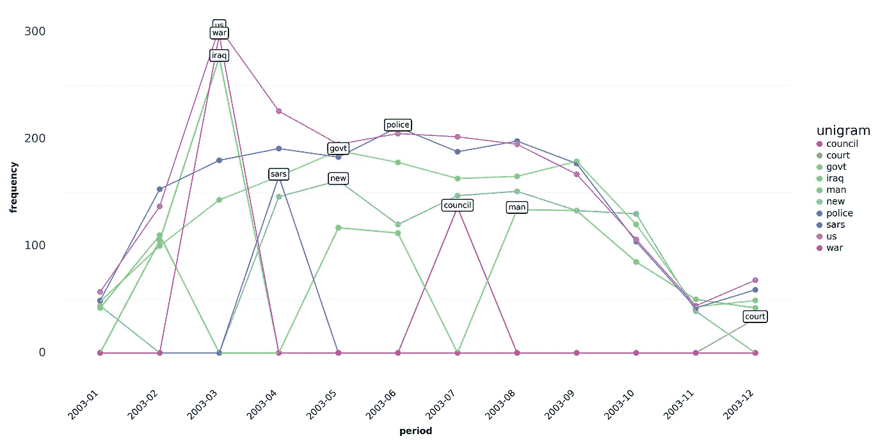
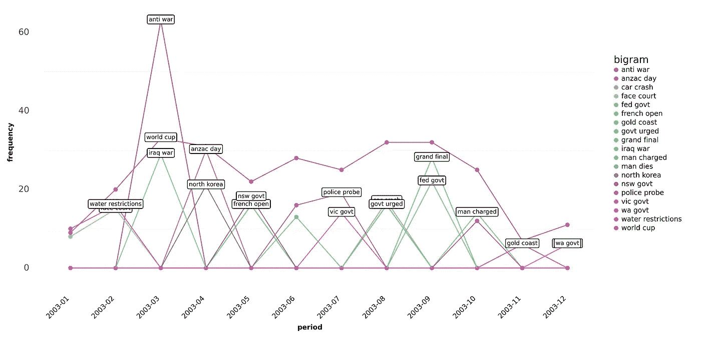

# Arabica 中的可视化模块加速了文本数据的探索

> 原文：[`towardsdatascience.com/visualization-module-in-arabica-speeds-up-text-data-exploration-47114ad646ce`](https://towardsdatascience.com/visualization-module-in-arabica-speeds-up-text-data-exploration-47114ad646ce)

## Arabica 现在提供了 unigram、bigram 和 trigram 词云、热图和折线图，以进一步加速时间序列文本数据分析。

[](https://petrkorab.medium.com/?source=post_page-----47114ad646ce--------------------------------)[](https://towardsdatascience.com/?source=post_page-----47114ad646ce--------------------------------) [Petr Korab](https://petrkorab.medium.com/?source=post_page-----47114ad646ce--------------------------------)

·发表于 [Towards Data Science](https://towardsdatascience.com/?source=post_page-----47114ad646ce--------------------------------) ·阅读时长 6 分钟·2023 年 1 月 9 日

--



图 1\. Bigram 词云，作者提供的图像。

# 介绍

Arabica 是一个用于探索性文本数据分析的 Python 库，专注于从时间序列的角度分析文本。它反映了许多文本数据集作为时间上重复观察的经验现实。**时间序列文本数据**包括新闻文章标题、研究文章摘要和元数据、产品评论、社交网络通信等。 [**Arabica**](https://pypi.org/project/arabica/) 通过提供这些方法简化了这些数据集的探索性分析（EDA）：

+   **arabica_freq:** 描述性 n-gram 分析和时间序列 n-gram 分析，用于基于 n-gram 的文本数据集 EDA

+   **cappuccino:** 用于数据的可视化探索。

本文介绍了**Cappuccino**，Arabica 的时间序列文本数据探索性分析可视化模块。请阅读[文档](https://arabica.readthedocs.io/en/latest/index.html)和教程这里以获取对 Arabica 的一般介绍。

***EDIT Jan 2023****: Arabica 已经更新。请查看* [***文档***](https://arabica.readthedocs.io/en/latest/index.html) *以获取参数的完整列表。*

# 2\. Cappuccino，探索性文本数据分析的可视化

实现的图表包括**词云**（unigram、bigram 和 trigram 版本）、**热图**和**折线图**。它们帮助发现（1）**最频繁的 n-grams**，反映其时间序列特征（词云）和（2）**n-grams 随时间的发展**（热图、折线图）。

这些图表设计用于演示、报告和实证研究。因此，它们具有**高分辨率**（像素取决于图表中显示的数据范围）。

Cappuccino 依赖于[*matplotlib*](https://matplotlib.org/)、[*worcloud*](https://pypi.org/project/wordcloud/)、和[*plotnine*](https://plotnine.readthedocs.io/en/stable/)来创建和展示图表，同时使用[*cleantext*](https://pypi.org/project/cleantext/#description)和[*NTLK*](https://www.nltk.org/)停用词语料库进行预处理。*Plotnine* 将广泛使用的[*ggplot2*](https://ggplot2.tidyverse.org/)库实现到了 Python 中。要求在这里。

方法的参数如下：

```py
def cappuccino(text: str,                # Text
               time: str,                # Time
               plot: str = '',           # Chart type: 'wordcloud'/'heatmap'/'line'
               ngram: int = '',          # N-gram size, 1 = unigram, 2 = bigram, 3 = trigram
               time_freq: str= '',       # Aggregation period: 'Y'/'M'', if no aggregation: 'ungroup'
               max_words int = '',       # Max number for most frequent n-grams displayed for each period
               stopwords: [],            # Languages for stop words
               skip: [ ],                # Remove additional strings
               numbers: bool = False,    # Remove numbers
               punct: bool = False,      # Remove punctuation
               lower_case: bool = False  # Lowercase text
)
```

# 3\. 描述性 n-gram 可视化

Arabica 中的描述性分析提供了 n-gram 频率计算，但不对特定时期进行汇总。简单来说，首先计算每个文本记录的 n-grams 频率，其次，将这些频率对整个数据集进行汇总，最后，将这些频率可视化到图表中。

## 词云

让我们以[**百万新闻标题**](https://www.kaggle.com/datasets/therohk/million-headlines?resource=download)为例，这些新闻标题按日发布，数据集的时间范围是 2003–2–19 到 2016–09–18。该数据集由澳大利亚广播公司提供，采用[CC0: 公共领域](https://creativecommons.org/publicdomain/zero/1.0/)许可证。我们将数据子集化为前 50,000 条标题。

首先，使用 `pip install arabica` 安装 Arabica，然后导入 Cappuccino：

```py
from arabica import cappuccino
```

使用 `pandas` 读取数据后，数据如下所示：



图 2\. 百万新闻标题数据

我们将文本转换为小写，清理数据中的标点符号和数字，去除英文停用词和其他不需要的字符串（*“g”*、*“br”*），并绘制包含 100 个最频繁单词的词云：

```py
cappuccino(text = data['headline'],
           time = data['date'],
           plot = 'wordcloud',
           ngram = 1,               # n-gram size, 1 = unigram, 2 = bigram, 3 = trigram
           time_freq = 'ungroup',   # no period aggregation
           max_words = 100,         # displays 100 most frequent words
           stopwords = ['english'], # remove English stopwords
           skip = ['g','br'],       # remove additional strings
           numbers = True,          # remove numbers
           punct = True,            # remove punctuation
           lower_case = True        # lowercase text
) 
```

它返回词云：


图 3\. 词云，作者图片。

在将 `ngram = 2` 更改后，我们获得了包含 100 个最频繁二元组的词云（见封面图片）。另外，`ngram = 3` 显示最频繁的三元组：


图 4\. 词云 — 三元组，作者图片。

# 4\. 时间序列 n-gram 可视化

时间序列文本数据通常显示出随时间变化的波动。选举前的政治声明和新冠疫情期间的新闻标题就是很好的例子。为了展示时间段内的 n-grams，Arabica 实现了**热图**和**折线图**用于按月和按年展示。



作者图片，来源：Draw.io

## **热图**

一个显示每个月十个最频繁单词的**热图**，代码如下：

```py
cappuccino(text = data['headline'],
           time = data['date'],
           plot = 'heatmap',
           ngram = 1,               # n-gram size, 1 = unigram, 2 = bigram
           time_freq = 'M',         # monthly aggregation
           max_words = 10,          # displays 10 most frequent words for each period
           stopwords = ['english'], # remove English stopwords
           skip = ['g', 'br'],      # remove additional strings
           numbers = True,          # remove numbers
           punct = True,            # remove punctuation
           lower_case = True        # lowercase text
) 
```

单元词热图是输出结果：



图 5\. 热图 — 单元词，作者图片。

单元组热图让我们首次了解数据的时间变异性。我们可以清晰地识别数据中的重要模式：

> **最常见的 n-grams**：“us”、“警察”、“新”、“人”。
> 
> **离群值**（仅在一个周期内出现的术语）：“战争”、“wa”、“雨”、“被杀”、“伊拉克”、“担忧”、“预算”、“巴厘岛”。

我们可以考虑在分析的后期去除离群值。或者，通过更改 `ngram = 2` 和 `max_words = 5` 创建一个**二元组** **热图**，显示每个周期中最常见的五个二元组。



图 6\. 热图 — 二元组，作者提供的图像。

## **线图**

通过更改 `plot = ‘line’` 显示带有 n-grams 的**线图**。通过将 `ngram` 参数设置为 1 和 `max_words = 5`，我们为每个周期中的五个最常见的词创建一个线图：



图 7\. 线图 — 单元组，作者提供的图像。

类似地，通过更改 `ngram = 2` 和 `max_words = 3`，二元组线图看起来像这样：



图 8\. 线图 — 二元组，作者提供的图像。

# 最终备注

Cappuccino 在可视化探索具有时间序列特征的文本数据方面大有帮助。只需一行代码，我们就能预处理数据并提供数据集的初步探索性视图。以下是一些建议：

+   可视化的频率也取决于数据中**时间维度的长度**。在长时间序列中，月度图无法清晰显示数据，而在短时间序列（少于一年）的年频率图则无法提供时间上的变异性。

+   根据项目中的数据集选择合适的**可视化形式**。对于 n-gram 变异性高的数据集（见图 8），线图不是一个好的选择。在这种情况下，即使每个周期中有许多 n-grams，热图也能更好地显示数据。

我们可以用 Arabica 回答的一些问题是 (1) 特定领域（经济学、生物学等）的概念如何随时间演变，使用**研究文章元数据**，(2) 在总统竞选期间，哪些关键主题被强调，使用**Twitter 推文**，(3) 公司应该改进品牌和沟通的哪些部分，使用**客户产品评论**。

本教程中的完整代码在我的 [GitHub](https://github.com/PetrKorab/Arabica/blob/main/docs/examples/cappuccino_examples.ipynb)。欲了解更多示例，请阅读 [文档](https://arabica.readthedocs.io/en/latest/index.html) 和关于 *arabica_freq* 方法的 [教程](https://medium.com/towards-data-science/text-as-time-series-arabica-1-0-brings-new-features-for-exploratory-text-data-analysis-88eaabb84deb)。

***编辑：*** *Arabica 现在有了一个* ***情感和结构性断裂*** *分析模块。阅读更多内容并查看这些教程中的实际应用：*

+   ***时间序列文本数据中的情感分析和结构性突破***

+   ***N-gram 和情感分析的客户满意度测量***

+   [***研究文章元数据描述快速简便***](https://pub.towardsai.net/research-article-meta-data-description-made-quick-and-easy-57754e54b550)

*你喜欢这篇文章吗？你可以邀请我* [*喝咖啡*](https://www.buymeacoffee.com/petrkorab) *并支持我的写作。你也可以订阅我的* [*电子邮件列表*](https://medium.com/subscribe/@petrkorab) *以获取关于我新文章的通知。谢谢！*


照片由 [Kanwardeep Kaur](https://unsplash.com/@kavar05?utm_source=medium&utm_medium=referral) 拍摄，来源于 [Unsplash](https://unsplash.com/?utm_source=medium&utm_medium=referral)
