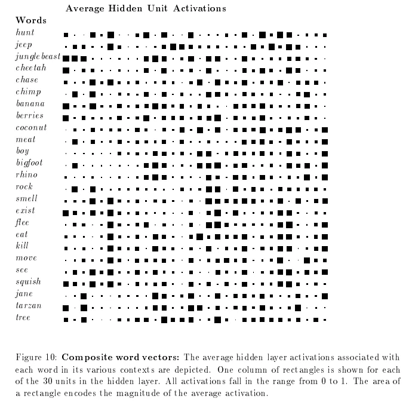
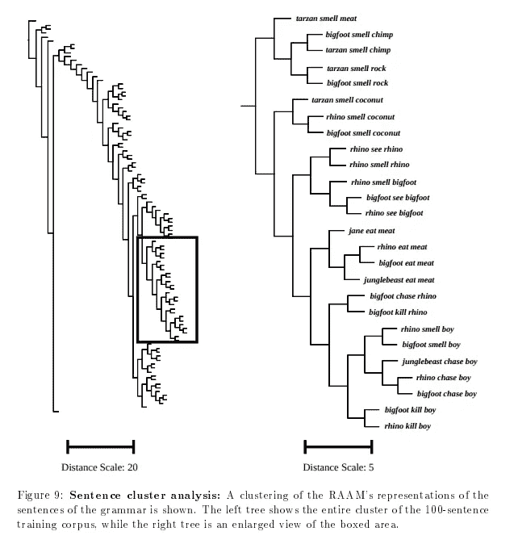
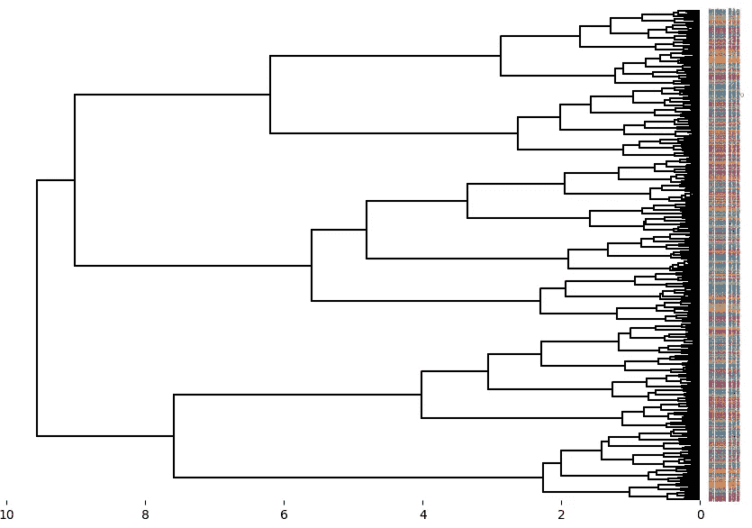
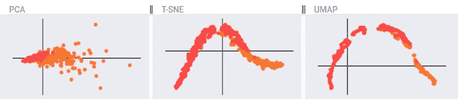
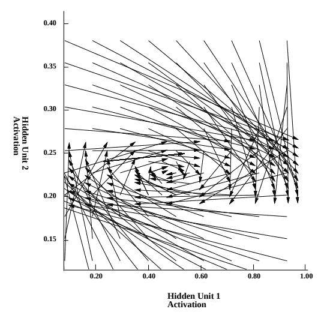

# 嵌入的可视化

> 原文：[`towardsdatascience.com/visualizations-of-embeddings-2910580df7f4?source=collection_archive---------0-----------------------#2023-05-27`](https://towardsdatascience.com/visualizations-of-embeddings-2910580df7f4?source=collection_archive---------0-----------------------#2023-05-27)

## 可视化高维数据的方式不止一种。在这里，我们回顾了人工智能的发展历史，以探索这些可视化的演变。

 [Douglas Blank, PhD](https://medium.com/@doug.blank?source=post_page-----2910580df7f4--------------------------------)

·

[关注](https://medium.com/m/signin?actionUrl=https%3A%2F%2Fmedium.com%2F_%2Fsubscribe%2Fuser%2F66e2bac7e7d8&operation=register&redirect=https%3A%2F%2Ftowardsdatascience.com%2Fvisualizations-of-embeddings-2910580df7f4&user=Douglas+Blank%2C+PhD&userId=66e2bac7e7d8&source=post_page-66e2bac7e7d8----2910580df7f4---------------------post_header-----------) 发表在 [Towards Data Science](https://towardsdatascience.com/?source=post_page-----2910580df7f4--------------------------------) ·7 分钟阅读·2023 年 5 月 27 日

--

我在 1990 年将我的第一篇关于人工智能的论文提交到一个小型地方会议——“中西部人工智能与认知科学学会”。在那些日子里，人工智能领域完全被“符号”研究所定义。这种方法被称为“古老的人工智能”或 GOFAI（发音为“go fi”，类似“wifi”）。我们这些现在被称为“深度学习”的研究者不得不真的争论我们所研究的内容*是否应被视为*人工智能。

被排除在人工智能之外是把双刃剑。一方面，我不同意当时定义的人工智能的基本信条。基本假设是“符号”和“符号处理”必须是所有人工智能的基础。因此，我很高兴能在一个甚至不被认为是人工智能的领域工作。另一方面，如果你不将自己的想法包装成至少与人工智能相关的内容，就很难找到愿意倾听你意见的人。

这个小型会议接受了关于“人工智能”和“认知科学”的论文——我视此为对“符号处理”之外的想法的邀请。所以我提交了我的第一篇论文，并且被接受了！论文展示了一种处理自然语言的神经网络方法。我们这个领域的许多人称这种神经网络研究为“连接主义”，但现在这种研究，如前所述，会被标记为“深度学习”（DL）——尽管我的初期研究并不深……只有三层！现代 DL 系统可以由数百层组成。

我的论文在会议上被接受了，我于 1990 年在伊利诺伊州的卡本代尔进行了展示。后来，会议组织者 John Dinsmore 邀请我提交论文的一个版本用于他正在编辑的一本书。我觉得自己无法独立完成论文，于是邀请了两位研究生朋友（Lisa Meeden 和 Jim Marshall）加入我。他们同意了，我们最终在书中完成了一章。这本书的标题是“[符号与连接主义范式：弥合差距](https://www.google.com/books/edition/The_Symbolic_and_Connectionist_Paradigms/ET2YAgAAQBAJ)”。我们的论文很契合书的主题。我们将论文标题为“[探索符号/亚符号连续体：RAAM 的案例研究](https://repository.brynmawr.edu/compsci_pubs/32/)”。令我高兴的是，这本书聚焦于这两种人工智能方法之间的分裂。我认为这个领域至今仍在挣扎于这种分歧。

关于我初期研究的更多内容，我会稍后再说。现在我想谈谈这个领域如何处理“嵌入”的可视化。首先，我们当时并没有称这些向量为“嵌入”。大多数研究使用了“隐层表示”这样的术语。这包括了连接主义系统为解决问题而学习的任何内部表示。按照我们当时的定义，有三种层：“输入”（在这里你插入数据集）、“输出”（在这里你放置期望的输出或“目标”）以及其他所有层——即“隐层”。隐层是网络激活在输入和输出之间流动的地方。隐层激活通常是高维的，并且是网络学习到的“概念”的表示。

像今天一样，视觉化这些高维向量被认为有助于深入理解这些系统的工作原理及其常见故障。在我们书中的章节中，我们使用了三种类型的可视化：

1.  所谓的“Hinton 图”

1.  聚类图，或树状图

1.  投影到二维空间

第一种方法是 [Hinton 和 Shallice 在 1991 年](https://www.cs.toronto.edu/~hinton/absps/lesioning.pdf) 使用的一个新创意。（这就是我们今天所知道的 Geoffrey Hinton。更多内容将在未来的文章中介绍）。这个图表是一个简单的想法，实用性有限。基本想法是，激活、权重或任何类型的数值数据可以用盒子表示：白色盒子（通常表示正数）和黑色盒子（通常表示负数）。此外，盒子的大小表示相对于模拟神经元中的最大值和最小值的值的大小。

这是我们论文中的表示，显示了网络隐藏层中的平均“嵌入”作为对网络呈现的单词的表示：

我们论文中的图 10。

Hinton 图确实有助于可视化数据中的模式。但它们并不真正有助于理解表示之间的关系，也无助于在维度数目大大增加时的理解。现代嵌入可以有数千维。

为了帮助解决这些问题，我们转向第二种方法：聚类图或 *树状图*。这些图表显示了任意两个模式之间的距离（无论如何定义）作为一个层次树。以下是我们论文中使用欧几里得距离的一个示例：

我们论文中的图 9。

这与 Hinton 图中显示的信息相同，但格式更加实用。在这里，我们可以看到个别模式之间以及整体模式之间的内部关系。请注意，垂直排序无关紧要：分支点的水平位置是图表的有意义方面。

在上面的树状图中，我们手动构建了整体图像，基于程序计算出的树簇。今天，有自动构建这种树和图像的方法。然而，当模式的数量远超过几十个时，图表可能变得难以理解。这是今天由 matplotlib 制作的一个示例。你可以在这里了解更多关于 API 的信息：[matplotlib 树状图](https://docs.scipy.org/doc/scipy/reference/generated/scipy.cluster.hierarchy.dendrogram.html)。

现代树状图，包含大量模式。图像由作者制作。

最后，我们来到了最后一种方法，也就是今天主要使用的方法：投影方法。这种方法使用算法找到一种将嵌入的维度数减少到更容易被人类理解的数量（例如，2 或 3 维）并绘制为散点图的方法。

在 1990 年，投影高维数据到较小维度集的主要方法是[主成分分析](https://en.wikipedia.org/wiki/Principal_component_analysis)（简称 PCA）。维度降维是一个活跃的研究领域，目前仍在不断开发新的方法。

目前最常用的降维算法包括：

1.  PCA

1.  t-SNE

1.  UMAP

哪种方法最好？这实际上取决于数据的细节以及你创建维度降维的目标。

PCA 可能是总体上最好的方法，因为它是确定性的，并且允许你从高维空间创建到降维空间的映射。这对于在一个数据集上训练，然后检查测试数据集在学习空间中的投影非常有用。然而，PCA 可能会受到未缩放数据的影响，并可能导致一个“点球”，这对结构模式的洞察较少。

t-SNE，即 t-分布随机邻域嵌入，由 Roweis 和 Hinton（是的，就是那个 Hinton）于 2002 年创建。这是一种学习型投影，可以利用未缩放的数据。然而，t-SNE 的一个缺点是它不会创建映射，而只是一个用于寻找聚类的学习方法。也就是说，与具有**Projection.fit()**和**Projection.transform()**方法的其他算法不同，t-SNE 只能进行拟合。（有些实现，如[openTSNE](https://pypi.org/project/openTSNE/)，提供了转换映射。然而，openTSNE 似乎与其他算法非常不同，速度较慢，支持度也低于其他形式。）

最后，还有 UMAP，即均匀流形近似与投影。该方法由[McInnes 和 Healy 于 2018 年创建](https://arxiv.org/abs/1802.03426v1)。对于许多高维空间，这可能是最佳的折中方案，因为它计算开销相对较小，但能够在降维中保留重要的表示结构。

这是一个将维度降维算法应用于 sklearn 中可用的未缩放乳腺癌数据的示例：

三种投影方法的降维示例，包括 PCA、t-SNE 和 UMAP。图像由作者制作。

你可以自己测试维度降维算法，以找到适合你用例的最佳方法，并使用[Kangas DataGrid](https://github.com/comet-ml/kangas/wiki/Embedding)创建如上所示的图像。

如前所述，维度缩减仍然是一个活跃的研究领域。我完全期待在这一领域看到持续的改进，包括可视化信息在深度学习网络中的流动。以下是我们书籍章节中的一个最终示例，展示了激活在我们模型的表示空间中的流动：

图 7 来自我们的论文。神经网络解码部分中单步的隐藏层激活。

***对人工智能、机器学习和数据科学中的想法来源感兴趣吗？请考虑点赞和订阅。告诉我你感兴趣的内容！***
