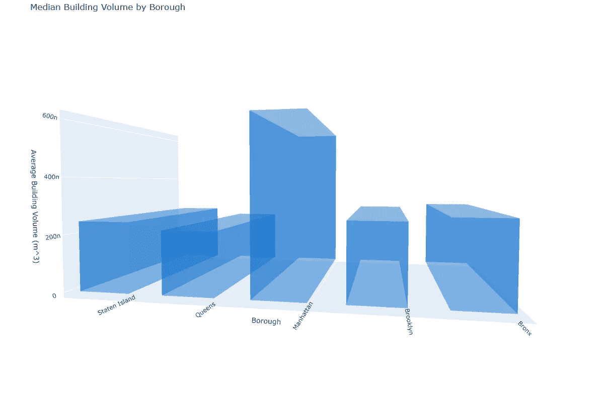

# 纽约市的可视化

> 原文：[`towardsdatascience.com/visualizations-of-new-york-city-f7b4772e9518`](https://towardsdatascience.com/visualizations-of-new-york-city-f7b4772e9518)

## 使用 Python 和 Plotly 让 NYC 开放数据生动起来

[](https://medium.com/@anthonybaum?source=post_page-----f7b4772e9518--------------------------------)[](https://towardsdatascience.com/?source=post_page-----f7b4772e9518--------------------------------) [Anthony Baum](https://medium.com/@anthonybaum?source=post_page-----f7b4772e9518--------------------------------)

·发表于 [Towards Data Science](https://towardsdatascience.com/?source=post_page-----f7b4772e9518--------------------------------) ·阅读时间 9 分钟·2023 年 8 月 18 日

--


图片由 [Fabien BELLANGER](https://unsplash.com/@fabbel78?utm_source=medium&utm_medium=referral) 提供，来源于 [Unsplash](https://unsplash.com/?utm_source=medium&utm_medium=referral)

纽约市的 [开放数据平台](https://opendata.cityofnewyork.us/) 是一个令人惊叹的信息来源。城市收集和生成的所有公共数据都 [依法](https://opendata.cityofnewyork.us/open-data-law/) 通过该门户提供，并且对公众免费使用。

数据集涵盖了交通、住房和机动车事故等信息，甚至包括中央公园松鼠普查和公园护林员报告的攻击性乌龟遭遇情况。

像这些地理、基础设施和社会学数据集代表了现实世界的过程和事件。即使你与纽约市或城市地区没有联系，或者对它们兴趣不大，它们也为你提供了一个机会，让你处理的数据更接近于你在专业角色中会遇到的数据，而不像 MNIST 或泰坦尼克号乘客那样。更好的是，它们几乎一样容易获取。

我们将演示这些数据集的使用有多么简单，并在此过程中构建一些有趣的可视化。

为了尽可能简洁地保持代码块，这里是本文中所有代码所需的模块：

```py
import folium
import geopandas as gpd
import matplotlib.pyplot as plt
import numpy as np
import pandas as pd
import plotly.express as px
import plotly.graph_objects as go
import requests
from scipy.stats import gaussian_kde
import seaborn as sns
from shapely.geometry import Point, shape, box, Polygon
```

如果你想自己复制任何内容，确保它们已经安装。

# 建筑物足迹

[数据集](https://data.cityofnewyork.us/Housing-Development/Building-Footprints/nqwf-w8eh)

这是我最喜欢玩的数据集之一。数据包括 NYC 大多数建筑物的足迹多边形、年龄和高度。

我们将从数据提取开始，分开于可视化代码，因为我们使用此数据集制作了几个不同的可视化。

```py
# Pull data
api_endpoint = 'https://data.cityofnewyork.us/resource/qb5r-6dgf.json'
limit = 1000  # Number of rows per request
offset = 0   # Starting offset
data_frames = []  # List to hold chunks of data

# Loop to fetch data iteratively
# while offset <= 100000: # uncomment this and comment while True to fetch a 
#   sample much faster
while True: # while True will take a long time but gets all the data
    url = f"{api_endpoint}?$limit={limit}&$offset={offset}"
    chunk = pd.read_json(url)
    if chunk.empty:
        break  # Stop the loop when no more data is returned
    data_frames.append(chunk)
    offset += limit

# Concatenate all chunks into a single DataFrame
data = pd.concat(data_frames, ignore_index=True)

# Convert the 'the_geom' column from a dictionary to a Shapely geometry object
data['geometry'] = data['the_geom'].apply(lambda x: shape(x))

# Convert the Pandas DataFrame to a GeoDataFrame
gdf = gpd.GeoDataFrame(data, geometry='geometry', crs="EPSG:4326")

# Convert 'MultiPolygon' to representative points for visualization
gdf['centroid'] = gdf['geometry'].centroid.to_crs(epsg=3395).centroid.to_crs(epsg=4326)

# Get rid of columns we don't need anymore
keep_cols = ['cnstrct_yr', 'heightroof', 'geometry', 'centroid']
gdf = gdf[keep_cols]
```

这为我们提供了一个工作数据集，长得像这样。


几何列是建筑轮廓的多边形，重心列是轮廓中心的单一点，即建筑位置的单一经纬度。现在我们可以深入到有趣的部分了。

## 新旧建筑的对比

此时，城市已成为旧褐石房、密集的独栋住宅和排屋、方块形公寓楼以及俯瞰河流的玻璃塔楼的混合体。

比如我们想找一个历史悠久的社区居住，可能希望有很多老旧建筑来增加一些历史魅力。在许多美国城市，尤其是在东北部，1930 年代及之前的建筑被称为“战前建筑”或口语中的“prewars”。

为了找到适合我们需求的社区，我们可以使用散点图在地图上标记每栋建筑的重心位置，并使用 KDE 图突出显示战前建筑的高密度。

```py
# Create the bounding box from the provided corner points
bounding_box = box(-74.0294, 40.685, -73.91695, 40.742)

# Filter the GeoDataFrame using the bounding polygon
gdf = gdf[gdf['centroid'].within(bounding_box)]

# Create a new column for building decade
gdf['decade'] = (gdf['cnstrct_yr'] // 10) * 10

# Remove rows where 'cnstrct_yr' is NaN
gdf = gdf[gdf['cnstrct_yr'].notna()]

# Get unique decades
unique_decades = sorted(gdf['decade'].unique())

# Use the Cividis colorscale and split it for our unique decades
colorscale = px.colors.sequential.Cividis
num_decades = len(unique_decades)
colors = [colorscale[i * len(colorscale) // num_decades] for i in range(num_decades)]
color_map = dict(zip(unique_decades, colors))

# Filter the data for buildings built in the 1930s and earlier
old_buildings = gdf[gdf['decade'] <= 1930]

# Create a new figure for better control
fig = go.Figure()

# Add the traces for each decade
for decade, color in color_map.items():
    subset = gdf[gdf['decade'] == decade]
    # Add the original trace with showlegend set to False
    fig.add_trace(go.Scattermapbox(
        lat=subset['centroid'].y,
        lon=subset['centroid'].x,
        mode='markers',
        marker=go.scattermapbox.Marker(
            size=3,
            color=color,
            opacity=0.8
        ),
        text=decade,
        name=str(int(decade)),
        hoverinfo='none',
        showlegend=False
    ))
    # Add a dummy trace with larger markers for the legend
    #   placed outside the visible map
    fig.add_trace(go.Scattermapbox(
        lat=[90],  # Latitude outside the visible map
        lon=[0],   # Longitude outside the visible map
        mode='markers',
        marker=go.scattermapbox.Marker(
            size=10,
            color=color,
            opacity=1
        ),
        legendgroup=str(int(decade)),
        showlegend=True,
        name=str(int(decade)),
        hoverinfo='none'
    ))

# Add heatmap for older buildings
fig.add_trace(go.Densitymapbox(
    lat=old_buildings['centroid'].y,
    lon=old_buildings['centroid'].x,
    radius=4,
    colorscale="Greens",
    opacity=1,
    name="Density of Prewar Buildings",
    showlegend=True,
    zmax=3,
    zmin=0,
    showscale=False
))

fig.update_layout(
    title='Buildings by Decade with Density Underlay for Prewar Buildings',
    autosize=True,
    mapbox=dict(
        accesstoken=None,
        bearing=0,
        center=dict(lat=40.71359, lon=-73.97216),
        pitch=0,
        zoom=12.6,
        style='carto-positron'
    ),
    height=800,
    width=1200,
    legend=dict(tracegroupgap=0)
)

# Display the map
fig.show()
```


显示战前建筑数量较多的街道和社区。图表由 Plotly 创建。

如果你对纽约市熟悉，这些数据中的一些结果并不令人惊讶，但有些可能会让人感到意外。科布尔希尔和西村的经典褐石房排是显而易见的。但是，我实际上没有预料到格林点和威廉斯堡（布鲁克林北端）有如此多的老建筑。

## 建筑尺寸

由于数据集中有建筑轮廓和屋顶高度，我们可以计算建筑体积。然后，我们可以通过行政区可视化建筑的平均大小以进行比较。

为了实现这一点，我们将使用建筑轮廓的几何形状和屋顶高度来计算数据中每栋建筑的体积。我们将使用每个轮廓的重心来确定其所在的行政区。

```py
# ...following from data pull code block

# Define borough bounding boxes
# These are very loose bounds and a more thorough analysis should use a higher
#   precision polygon. 
boroughs = {
    "Manhattan": box(-74.02, 40.70, -73.91, 40.88),
    "Bronx": box(-73.93, 40.80, -73.79, 40.92),
    "Brooklyn": box(-74.05, 40.57, -73.85, 40.74),
    "Queens": box(-73.94, 40.54, -73.70, 40.80),
    "Staten Island": box(-74.26, 40.50, -74.03, 40.65)
}

# Assign borough to each building based on its centroid
def assign_borough(centroid):
    for borough, bbox in boroughs.items():
        if bbox.contains(centroid):
            return borough
    return None

# Assuming the gdf variable already contains your data
gdf['borough'] = gdf['centroid'].apply(assign_borough)

# Calculate building volume using footprint area and height
gdf['volume'] = gdf['geometry'].area * gdf['heightroof']

# Compute average volume by borough
avg_volume_by_borough = gdf.groupby('borough')['volume'].median()

# Create 3D bar shapes using surface plots
def create_3d_bar(x, y, z, dx, dy, dz):
    # Define vertices of the bar
    x_data = [[x, x, x+dx, x+dx, x], [x, x, x+dx, x+dx, x]]
    y_data = [[y, y+dy, y+dy, y, y], [y, y+dy, y+dy, y, y]]
    z_data = [[z, z, z, z, z], [z+dz, z+dz, z+dz, z+dz, z+dz]]
    return go.Surface(
        x=x_data, 
        y=y_data, 
        z=z_data, 
        colorscale=[[0, 'blue'], [1, 'blue']], 
        showscale=False,
        opacity=0.5
    )

# Define bar dimensions
dx = 0.4
dy = 0.4

# Create figure
fig = go.Figure()

# Add bars to the figure
for i, borough in enumerate(avg_volume_by_borough.index):
    fig.add_trace(create_3d_bar(i, 0, 0, dx, dy, avg_volume_by_borough[borough]))

# Define the layout with adjusted aspect ratio for wider chart area
fig.update_layout(
    title='Average Building Volume by Borough',
    scene=dict(
        xaxis=dict(
            title='Borough',
            tickvals=list(range(len(avg_volume_by_borough))),
            ticktext=avg_volume_by_borough.index
        ),
        yaxis=dict(title='', visible=False),
        zaxis=dict(title='Average Building Volume (m³)'),
        aspectratio=dict(x=3, y=2, z=1.5)  # Adjusting the aspect ratio for wider x-axis
    ),
    margin=dict(t=40, b=40, l=60, r=60)
)

fig.show()
```



各区建筑体积的体积柱状图。图表由 Plotly 创建。

曼哈顿的建筑更大这一点并不令人惊讶。然而，你可能会预期其他三个区之间存在更大的差异，尤其是布鲁克林的塔楼俯瞰东河与斯塔滕岛明显的纽约市郊外风貌之间的差异。

四个外区都有大量低密度住房。特别是皇后区，其面积巨大，比第二大区布鲁克林大 56%。

我们可以在建筑尺寸分布的箱形图中看到这一点。请注意体积是对数化的，以更好地展示外区与曼哈顿大量高楼之间的差异。


皇后区的小型独栋住宅数量较大，相较于斯塔滕岛尤为明显。

# WiFi 热点

[数据集](https://data.cityofnewyork.us/City-Government/NYC-Wi-Fi-Hotspot-Locations/yjub-udmw)

纽约市在全市范围内运营 wifi 热点，其位置可通过开放数据门户访问。这些只是市政府运营的热点，所以像星巴克这样的地方不包括在内。

我们可以直接从门户网站读取 JSON 文件并创建位置地图。

```py
# Define the URL
url = "https://data.cityofnewyork.us/resource/yjub-udmw.json"

# Send a GET request
response = requests.get(url)

# Load the response into a JSON
data = response.json()

# Convert the JSON data into a DataFrame
df = pd.DataFrame(data)

# Convert lat and lon columns to float
df['latitude'] = df['latitude'].astype(float)
df['longitude'] = df['longitude'].astype(float)

# Map the borough codes to borough names
borough_dict = {'1': 'Manhattan', '2': 'Bronx', '3': 'Brooklyn', '4': 'Queens', '5': 'Staten Island'}
df['borough'] = df['borough'].map(borough_dict)

# Replace the 'token' with your own Mapbox access token
px.set_mapbox_access_token('token')

fig = px.density_mapbox(
    df,
    lat='latitude',
    lon='longitude',
    zoom=10,
    mapbox_style="carto-positron",
    title="Distribution of WiFi Hotspots in NYC",
    radius=6
)

fig.update_layout(
    height=800,
    width=1200
)

fig.show()
```


纽约市运营的 wifi 热点的位置。图表由 Plotly 创建。

纽约市的大多数地铁站都有免费 wifi，这在地图上显示得非常清晰。中央公园两侧延伸出的高密度热点区域大多是地铁站。

你还可以通过寻找排列成不自然直线的地点，清楚地看到两条主要的地铁线路通向皇后区和布鲁克林。

# 松鼠普查

[数据集](https://data.cityofnewyork.us/Environment/2018-Central-Park-Squirrel-Census-Squirrel-Data/vfnx-vebw)

松鼠普查（[`www.thesquirrelcensus.com/`](https://www.thesquirrelcensus.com/)）是一个科学、设计和讲故事的项目，专注于东部灰松鼠（Sciurus carolinensis）。他们统计松鼠数量并将结果公之于众。

这些数据包含了 3,023 次观察的松鼠数据，包括位置坐标、年龄、主要和次要毛色、高度、活动、通讯以及松鼠与人类之间的互动。

现在让我们提出一个有趣的问题。

*中央公园中最吵的松鼠在哪里？*

数据中有三个字段表示松鼠发出的不同噪音/叫声：‘kuks’、‘quaas’和‘moans’。我们将任何噪音视为吵闹，并创建一个密度图以显示吵闹的松鼠聚集在哪里。

```py
# Pull data
data_url = 'https://data.cityofnewyork.us/api/views/vfnx-vebw/rows.csv?accessType=DOWNLOAD'
squirrels = pd.read_csv(
    data_url,
    usecols=['X', 'Y', 'Kuks', 'Quaas', 'Moans']
)

# Create column denoting that the squirrel made any kind of noise
squirrels['noisy'] = squirrels[['Kuks', 'Quaas', 'Moans']].any(axis=1)

# Filter out the quiet squirrels
noisy_squirrels = squirrels[squirrels['noisy']]

# Convert noisy column to integer
noisy_squirrels['noisy'] = noisy_squirrels['noisy'].astype(int)

# Create the density heatmap
fig = px.density_mapbox(
    noisy_squirrels, lat='Y', lon='X', z='noisy', radius=50,
    center=dict(lat=40.783, lon=-73.969),  # Center coordinates for Central Park
    zoom=13,
    mapbox_style="stamen-terrain",
    #mapbox_style="stamen-watercolor",
    color_continuous_scale=["white", "orange", "red"],
    range_color=[0, 5], # Adjusting the range for color scale
)

# Set the bearing to orient Central Park horizontally
fig.update_layout(
    mapbox_bearing=0,
    height=700,
    width=1000,
    title='Density of Noisy Squirrel Observations',
    showlegend=False,
    coloraxis_showscale=False
)

fig.show()
```


松鼠发出声音的观察密度图。图表由 Plotly 创建。

看起来上西区的松鼠有最多的发言权。

# 最后的说明

在 NYC Open Data 上还有大量数据可以深入探索，确保自己查看。大多数大城市也有自己的开放数据计划。值得注意的广泛数据计划包括[洛杉矶](https://data.lacity.org/)、[多伦多](https://open.toronto.ca/)、[伦敦](https://data.london.gov.uk/)和[新加坡](https://beta.data.gov.sg/)。

NYC Open Data 是公共领域数据，根据[开放数据常见问题](https://opendata.cityofnewyork.us/faq/) “对开放数据的使用没有限制”，包括商业用途。有关详细信息，请参阅[使用条款](https://opendata.cityofnewyork.us/overview/#termsofuse)。

本帖中所有代码均可在[GitHub](https://github.com/wxbaum/visualizing-nyc)上获得，我已经将 MIT 许可证附加到仓库中，以便你可以自由使用其中的任何内容。
