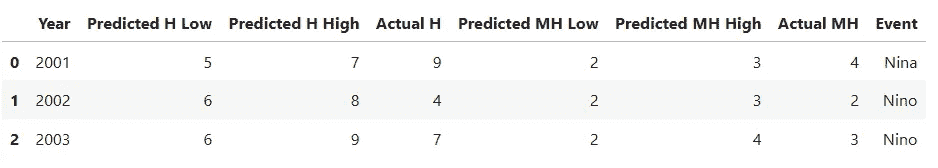
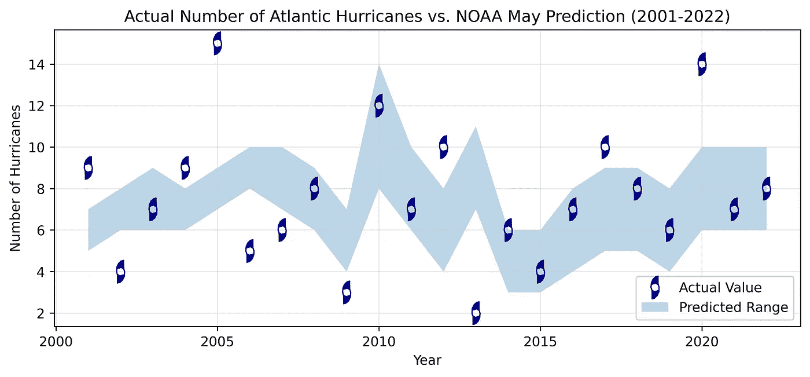
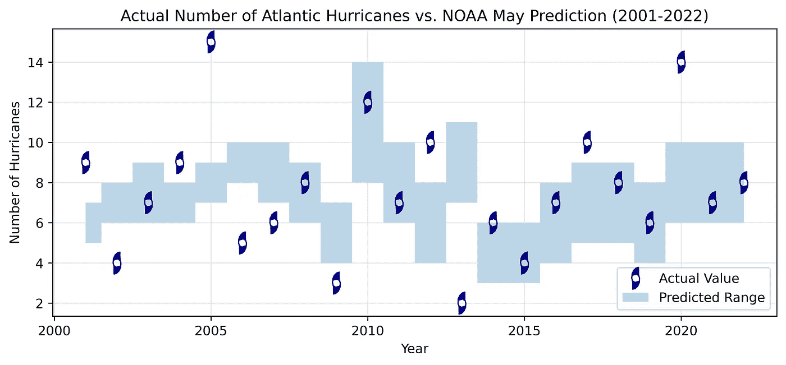
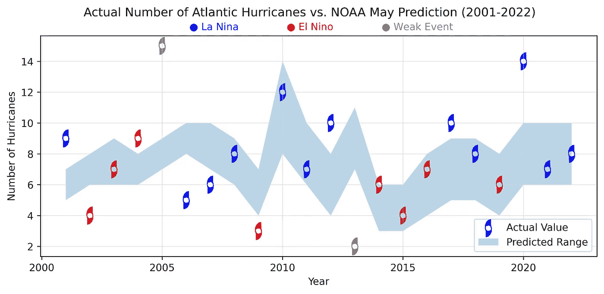
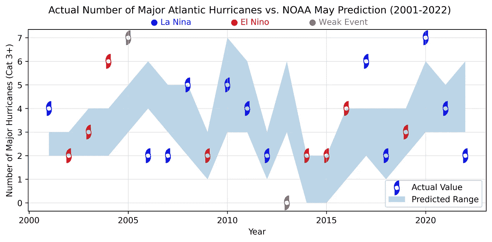
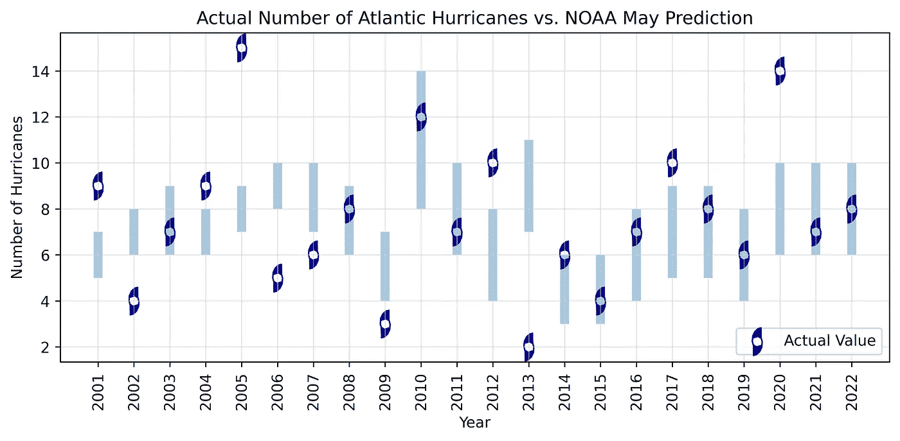
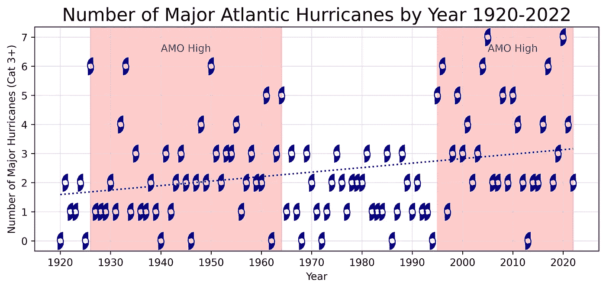
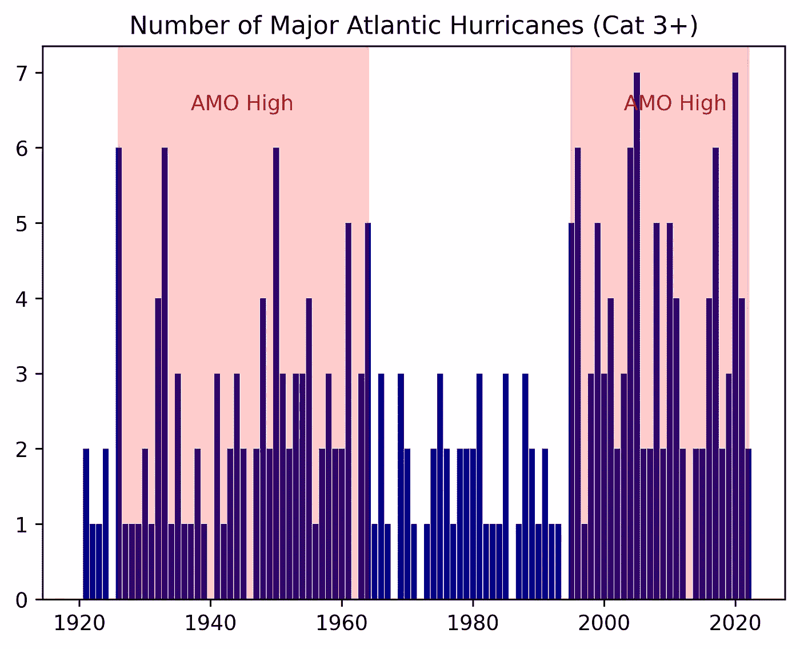
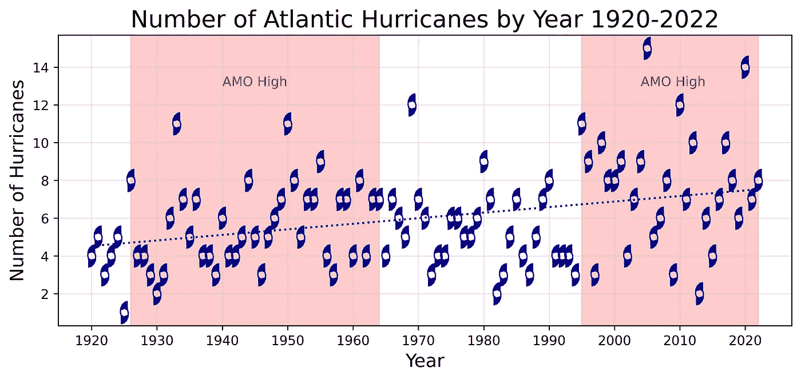

# 使用 Matplotlib 可视化数据范围

> 原文：[`towardsdatascience.com/visualize-data-ranges-with-matplotlib-df815363a619`](https://towardsdatascience.com/visualize-data-ranges-with-matplotlib-df815363a619)

## 基准测试 NOAA 的飓风展望

[](https://medium.com/@lee_vaughan?source=post_page-----df815363a619--------------------------------)[](https://towardsdatascience.com/?source=post_page-----df815363a619--------------------------------) [李·沃恩](https://medium.com/@lee_vaughan?source=post_page-----df815363a619--------------------------------)

·发表于[数据科学进阶](https://towardsdatascience.com/?source=post_page-----df815363a619--------------------------------) ·阅读时间 10 分钟·2023 年 9 月 26 日

--


莱昂纳多 AI DreamShaper_v7 模型的太空飓风

绘制*离散*数据很简单；表示*范围*数据则更复杂。幸运的是，Python 的 matplotlib 库提供了一个内置函数`fill_between()`，可以轻松可视化数据范围。在这个*快速成功的数据科学*项目中，我们将利用它来基准测试国家海洋和大气管理局的年度飓风展望。

# 数据集

每年 5 月，NOAA 发布其“大西洋飓风展望”报告，涵盖 6 月至 11 月的飓风季节。这些展望包括对命名风暴、飓风和主要飓风（定义为三级及以上）的预测范围。你可以在[这里](https://www.cpc.ncep.noaa.gov/products/outlooks/hurricane2021/May/hurricane.shtml)找到 2021 年的示例报告[1]。NOAA/国家气象局的数据由美国政府提供，作为[开放数据](https://psl.noaa.gov/disclaimer/)，可以自由使用。

为了基准测试这些预测的准确性，我们将使用维基百科提供的年度飓风季节总结。这些总结提供了每年的*实际*风暴和飓风数量。你可以在[这里](https://en.wikipedia.org/wiki/2021_Atlantic_hurricane_season)找到 2021 季节的条目[2]。维基百科页面在[*CC BY-SA 4.0*](https://creativecommons.org/licenses/by-sa/4.0/)许可下提供。

维基百科还包括[*拉尼娜*](https://en.wikipedia.org/wiki/La_Ni%C3%B1a)和[*厄尔尼诺*](https://en.wikipedia.org/wiki/El_Ni%C3%B1o)事件的列表[3][4]。这些代表了每隔几年在太平洋发生的天气模式。在拉尼娜年，东太平洋的水温低于正常水平，导致其上方的空气变冷。厄尔尼诺年则相反。

拉尼娜现象有利于大西洋盆地飓风活动的增强，而厄尔尼诺则[抑制飓风发展](https://www.climate.gov/news-features/blogs/enso/impacts-el-ni%C3%B1o-and-la-ni%C3%B1a-hurricane-season) [5]。为此，我们还将对这些事件进行颜色编码。

为了方便，我已经将 2001–2022 年的所有信息汇总并存储为 CSV 文件，保存在这个[Gist](https://gist.github.com/rlvaugh/54cb45ad5ffe54f4383dd4515e20b526)中。

> NOAA 每年*八月*都会发布*更新*的飓风预测，因此在选择数据和引用预测时需要小心。我们将使用*五月*的预测。

# 安装库

我们将使用 pandas 进行数据处理，使用 matplotlib 进行绘图。可以通过以下任一方式进行安装：

`conda install matplotlib pandas`

或

`pip install matplotlib pandas`

# 代码

以下代码在 JupyterLab 中编写，并按单元描述。

## 导入模块

除了进行数据分析和绘图，我们还将制作一个自定义标记来表示飓风。为此，我们需要导入 NumPy（Python 的数值分析包）和一个用于处理折线的 matplotlib 模块，称为`mpath`。

```py
import numpy as np
import matplotlib.pyplot as plt
import matplotlib.path as mpath
import pandas as pd
```

## 加载数据集

CSV 文件包含了预测飓风（H）和主要飓风（MH）的低值和高值。它还包括实际的飓风和主要飓风数量，以及是否属于拉尼娜或厄尔尼诺事件。过渡年被标记为“弱事件”。

```py
df = pd.read_csv('https://bit.ly/44YgahT')
df.head(3)
```



## 定义绘制飓风标记的函数

虽然我们*可以*使用一个简单的圆圈来在散点图上标记实际的飓风数量，但经典的飓风图标岂不是看起来更好？

不幸的是，matplotlib 没有自带飓风标记。然而，在 Stack Overflow 上提供了绘制飓风标记的代码，我在下面重复了这段代码（Stack Overflow 内容是[*cc-wiki*](https://creativecommons.org/licenses/by-sa/3.0/) 许可的） [6]。

这个函数使用了 matplotlib 的`mpath`模块，该模块返回一个`[<class 'matplotlib.path.Path'>](https://matplotlib.org/stable/api/path_api.html)`对象，表示一系列的线段和曲线段。该代码如何工作对于这个项目并不重要，但如果你想看到详细的解释，可以访问代码片段开始处的 Stack Overflow 链接。

```py
# The following code was adapted from Stack Overflow:
# https://stackoverflow.com/questions/44726675/custom-markers-using-python-matplotlib
# Asked by: https://stackoverflow.com/users/5689281/kushal
# Answered by: https://stackoverflow.com/users/4124317/importanceofbeingernest

def get_hurricane_symbol():
    """Return a hurricane warning symbol as a matplotlib path."""
    # Create a numpy array for the symbol's coordinates and codes:
    coordinates = np.array([[2.444, 7.553],
                            [0.513, 7.046],
                            [-1.243, 5.433],
                            [-2.353, 2.975],
                            [-2.578, 0.092],
                            [-2.075, -1.795],
                            [-0.336, -2.870],
                            [2.609, -2.016]])

    # Shift the x-coordinates:
    coordinates[:, 0] -= 0.098

    # Define path codes:
    codes = [1] + [2] * (len(coordinates) - 2) + [2]

    # Duplicate and reverse the coordinates:
    coordinates = np.append(coordinates, -coordinates[::-1], axis=0)

    # Duplicate the codes:
    codes += codes

    # Create and return the matplotlib path:
    return mpath.Path(3 * coordinates, codes, closed=False)
```

## 绘制实际飓风与预测飓风

以下代码使用 matplotlib 的`[fill_between()](https://matplotlib.org/stable/api/_as_gen/matplotlib.pyplot.fill_between.html)`方法来捕捉 NOAA 对每年的飓风预测数量。它需要 DataFrame 列名作为`x`参数，`y1`的最小值和`y2`的最大值。添加`label`参数可确保范围阴影会在图例中进行引用。

```py
# Call the function to build the hurricane marker:
symbol = get_hurricane_symbol()

# Initialize the figure:
plt.figure(figsize=(10, 4))

# Plot the actual number of hurricanes per year:
plt.plot(df.Year, df['Actual H'], 
         label='Actual Value', 
         marker=symbol, 
         markersize=17, 
         c='darkblue', 
         linestyle='None', 
         lw=1)

# Shade NOAA's predicted range of hurricanes for each year:
plt.fill_between(x=df.Year, 
                 y1=df['Predicted H Low'], 
                 y2=df['Predicted H High'],
                 alpha=0.3, 
                 label='Predicted Range')

plt.xlabel('Year')
plt.ylabel('Number of Hurricanes')
plt.legend(loc='lower right')
plt.grid(True, c='lightgrey', alpha=0.5)
plt.title('Actual Number of Atlantic Hurricanes vs. \
NOAA May Prediction (2001-2022)');

# Optional code to save the figure:
# plt.savefig('range_plot.png', bbox_inches='tight', dpi=600)
```



范围图（作者）

这个简单而优雅的图表充满了有用的信息。例如，在过去的 22 年中，实际的飓风数量有*11 次*落在预测范围内。这与掷硬币的准确性相同。最近，NOAA 开始使用更广泛的范围，这增加了准确性但降低了精确度。

## 改变填充样式

我非常喜欢之前的预测范围填充样式，但*确实*还有其他选择。在这个例子中，我们将`step`参数传递给`fill_between()`方法。现在，我们得到的是离散的垂直条，而不是连续的多边形。

```py
plt.figure(figsize=(10, 4))
plt.plot(df.Year, df['Actual H'], 
         label='Actual Value', 
         marker=symbol, 
         markersize=17, 
         c='darkblue', 
         linestyle='None', 
         lw=1)
plt.fill_between(x=df.Year, 
                 y1=df['Predicted H Low'], 
                 y2=df['Predicted H High'],
                 step='mid',
                 alpha=0.3, 
                 label='Predicted Range')
plt.xlabel('Year')
plt.ylabel('Number of Hurricanes')
plt.legend(loc='lower right')
plt.grid(True, c='lightgrey', alpha=0.5)
plt.title('Actual Number of Atlantic Hurricanes vs. \
NOAA May Prediction (2001-2022)');
```



使用“step”参数的范围图（作者）

## 添加厄尔尼诺和拉尼娜事件

为了评估厄尔尼诺和拉尼娜事件对飓风数量和强度的影响，让我们利用数据框中的“事件”列。

首先，我们需要制作一个将事件映射到颜色的字典。由于拉尼娜代表冷却事件，我们将使用蓝色。厄尔尼诺的暖事件将是红色，而弱事件将是无特征的灰色。

我们将在图形标题下方添加一个单独的自定义图例。注意使用`$\u25CF$`来绘制圆圈。这是来自实用的[STIX 字体集合](http://mirrors.ibiblio.org/CTAN/fonts/stix/doc/stix.pdf)的一个符号。

```py
# Plot the predicted ranges and color the actual values by event.
# Define a dictionary to map text colors to matplotlib colors:
color_mapping = {'Nina': 'blue', 
                 'Nino': 'red', 
                 'Weak Event': 'grey'}
# Map the Event column to colors. Use black if x not found:
df['colors_mapped'] = df['Event'].apply(lambda x: color_mapping.get(x, 'k'))

plt.figure(figsize=(10, 4))
plt.scatter(df.Year, df['Actual H'], 
            label='Actual Value', 
            marker=symbol, 
            s=300, 
            c=df.colors_mapped, 
            linestyle='None', 
            lw=1)
plt.fill_between(x=df.Year, 
                 y1=df['Predicted H Low'], 
                 y2=df['Predicted H High'], 
                 alpha=0.3, 
                 label='Predicted Range')
plt.xlabel('Year')
plt.ylabel('Number of Hurricanes')
plt.legend(loc='lower right')
plt.grid(True, c='lightgrey', alpha=0.5)

# Add event legend as title:
plt.suptitle('Actual Number of Atlantic Hurricanes vs. NOAA May Prediction (2001-2022)')
plt.figtext(0.4, 0.9, '$\u25CF$ La Nina', fontsize='medium', c='b', ha ='right')
plt.figtext(0.5, 0.9, '$\u25CF$ El Nino', fontsize='medium', c='r', ha ='center')
plt.figtext(0.6, 0.9, '$\u25CF$ Weak Event', fontsize='medium', c='grey', ha ='left');
```



按天气事件着色的范围图（作者）

这些结果似乎支持了厄尔尼诺事件抑制大西洋飓风形成的理论，至少相对于拉尼娜事件。为了查看它们是否也影响飓风*强度*，让我们绘制主要飓风数据。

## 绘制主要飓风

主要飓风定义为 3 级或更高级别的飓风。以下代码更新了这些值的图示。

```py
plt.figure(figsize=(10, 4))
plt.scatter(df.Year, df['Actual MH'], 
            label='Actual Value', 
            marker=symbol, s=300, 
            c=df.colors_mapped, 
            linestyle='None', 
            lw=1)
plt.fill_between(x=df.Year, 
                 y1=df['Predicted MH Low'], 
                 y2=df['Predicted MH High'], 
                 alpha=0.3, 
                 label='Predicted Range')
plt.xlabel('Year')
plt.ylabel('Number of Major Hurricanes (Cat 3+)')
plt.legend(loc='lower right')
plt.grid(True, c='lightgrey', alpha=0.5)

# Add event legend as title:
plt.suptitle('Actual Number of Major Atlantic Hurricanes vs. NOAA May Prediction (2001-2022)')
plt.figtext(0.4, 0.9, '$\u25CF$ La Nina', fontsize='medium', c='b', ha ='right')
plt.figtext(0.5, 0.9, '$\u25CF$ El Nino', fontsize='medium', c='r', ha ='center')
plt.figtext(0.6, 0.9, '$\u25CF$ Weak Event', fontsize='medium', c='grey', ha ='left');
```



按天气事件颜色编码的主要飓风范围图（作者）

除了 2004 年，某些来源将其归类为[弱事件](https://ggweather.com/enso/oni.htm)，这张图表支持了在厄尔尼诺事件期间飓风形成被抑制的观点[7]。对于主要飓风，预测准确性也稍好，22 个中有 13 个落在预测范围内。

## 使用垂直线绘制范围

另一种绘制范围的方法是使用 matplotlib 的`vlines()`方法来绘制垂直线。这是`fill_between()`方法的一个有吸引力的替代方案，尽管它更费力且不会自动将范围包含在图例中。

```py
# Redraw plot with vertical lines for ranges:
plt.figure(figsize=(10, 4))

# Use a scatter plot for actual values:
plt.scatter(df.index, df['Actual H'], 
            label='Actual Value', 
            marker=symbol, 
            c='darkblue', 
            s=350)

# Draw vertical lines for the predicted ranges:
for i, row in df.iterrows():
    plt.vlines(x=i, 
               ymin=row['Predicted H Low'], 
               ymax=row['Predicted H High'], 
               alpha=0.4, 
               lw=6, 
               zorder=0)

x = range(len(df))
plt.xticks(x, df.Year, rotation=90)
plt.xlabel('Year')
plt.ylabel('Number of Hurricanes')
plt.legend(loc='lower right')
plt.grid(True, color='lightgray', alpha=0.5)
plt.title('Actual Number of Atlantic Hurricanes vs. NOAA May Prediction');
```



使用垂直线表示范围的范围图（作者）

## 评估大西洋多年代际振荡

我们现在已经涵盖了`fill_between()`方法，但既然我们手头有所有这些数据，不妨花点时间研究一个关于飓风形成的有趣理论，这涉及到*大西洋多年代际振荡（AMO）[8]*。

AMO 是由北大西洋海表温度的几十年变率定义的特征。关于 AMO 知之甚少；它可能代表一个持续的周期性气候驱动因素或只是一个短暂特征[9]。

*AMO 指数*是通过从*全球*平均海表温度（SST）异常中减去*北大西洋*SST 异常来计算的[9]。当 AMO 指数较高时，海表温度通常较温暖，可能会促使飓风活动和强度增加。

由于这是一个长波长现象，我们需要一个从 1920 年左右开始计算飓风的数据库。我已经记录了维基百科在这一时间段的飓风列表，并将其存储在这个[Gist](https://gist.github.com/rlvaugh/c26313470c49ec67acf23628339151f7)中。

> 应注意，在使用飞机（20 世纪 40 年代中期）和卫星数据（20 世纪 60 年代中期）之前的风暴计数不够可靠。例如，1886 年到 1910 年的计数估算被认为有每年零到四场风暴的低估偏差[10]。

在下一个图中，AMO 指数的边界取自[维基百科](https://en.wikipedia.org/wiki/Atlantic_multidecadal_oscillation)和[NOAA](https://www.aoml.noaa.gov/ocd/ocdweb/ESR_GOMIEA/amo.html#:~:text=The%20Atlantic%20Multidecadal%20Oscillation%20%28AMO%29%20is%20a%20climate,%28Enfield%20et%20al.%2C%202001%3B%20McCabe%20et%20al.%2C%202004%29.) [8][11]。

```py
# Load the 1920-2022 hurricane dataset:
df = pd.read_csv('https://bit.ly/3sZnvQX')

# Plot major hurricanes per year with regression line and AMO shading:
plt.figure(figsize=(10, 4))

plt.plot(df.Year, df.MH, 
         label='Actual Value', 
         marker=symbol, 
         markersize=17, 
         c='darkblue', 
         linestyle='None', 
         lw=1)

plt.xlabel('Year')
plt.xticks(range(1920, 2021, 10))
plt.ylabel('Number of Major Hurricanes (Cat 3+)')
plt.grid(True, c='lightgrey', alpha=0.5)
plt.title('Number of Major Atlantic Hurricanes by Year 1920-2022', 
          fontsize=18)

# Add a shaded span for AMO highs:
plt.text(1940, 6.5, 'AMO High', c='firebrick')
plt.axvspan(1926, 1964, 
           color='red', 
           alpha=0.2)

plt.text(2005, 6.5, 'AMO High', c='firebrick')
plt.axvspan(1995, 2022, 
           color='red', 
           alpha=0.2)

# Calculate m (slope) and b (intercept) of linear regression line:
m, b = np.polyfit(df.Year, df.MH, 1)

# Add linear regression line to plot:
plt.plot(df.Year, m*df.Year+b, c='darkblue', ls=':');
```



每年主要飓风数量，包括回归线和 AMO 指数高期（作者提供）

以下是以柱状图形式呈现的相同数据：



包含 AMO 指数高期的主要飓风柱状图（作者提供）

这是这段时间内*所有*大西洋飓风的散点图。AMO 效应在风暴频率上的表现不太明显。



每年总飓风数量，包括回归线和 AMO 指数高期（作者提供）

尽管科学家认识到 AMO 指数与主要飓风数量之间的明显关系，但目前的数据还不足以得出确切结论。正如你可能预料的那样，最近 AMO 高期主要飓风增加的最流行解释是人为气候变化。

# 总结

matplotlib 的`fill_between()`方法是显示图上*范围*值的便捷方式。在这个项目中，我们用它来展示 NOAA 的年度飓风预测与实际结果的对比。此外，我们还使用了 matplotlib 的`mpath`模块绘制自定义标记来表示飓风。最终结果是一个吸引人且易于解析的信息图。

我们还在图中添加了厄尔尼诺、拉尼娜和 AMO 事件。结果支持了既有观察结果，即厄尔尼诺似乎抑制了大西洋飓风，而 AMO 指数高期事件似乎促进了它们。

# 引用

1.  气候预测中心互联网团队, 2001, “NOAA 2021 年大西洋飓风季节展望，” [气候预测中心 — 大西洋飓风展望 (noaa.gov)](https://www.cpc.ncep.noaa.gov/products/outlooks/hurricane2021/May/hurricane.shtml)

1.  维基百科贡献者，“2021 年大西洋飓风季节，” *维基百科，自由百科全书,* [`en.wikipedia.org/w/index.php?title=2021_Atlantic_hurricane_season&oldid=1175731221`](https://en.wikipedia.org/w/index.php?title=2021_Atlantic_hurricane_season&oldid=1175731221) (访问日期：2023 年 9 月 19 日).

1.  维基百科贡献者，“厄尔尼诺，” *维基百科，自由百科全书,* [`en.wikipedia.org/w/index.php?title=El_Ni%C3%B1o&oldid=1174548902`](https://en.wikipedia.org/w/index.php?title=El_Ni%C3%B1o&oldid=1174548902) (访问日期：2023 年 9 月 19 日).

1.  维基百科贡献者，“拉尼娜，” *维基百科，自由百科全书,* [`en.wikipedia.org/w/index.php?title=La_Ni%C3%B1a&oldid=1174382856`](https://en.wikipedia.org/w/index.php?title=La_Ni%C3%B1a&oldid=1174382856) (访问日期：2023 年 9 月 19 日).

1.  Bell, Gerry, 2014, “厄尔尼诺和拉尼娜对飓风季节的影响，” *NOAA 气候.gov*, [Impacts of El Niño and La Niña on the hurricane season | NOAA Climate.gov](https://www.climate.gov/news-features/blogs/enso/impacts-el-ni%C3%B1o-and-la-ni%C3%B1a-hurricane-season).

1.  ImportanceOfBeingErnest, “使用 matplotlib 的自定义标记，” *Stack Overflow,* 2017 年 6 月 24 日, [Custom markers using Python (matplotlib) — Stack Overflow](https://stackoverflow.com/questions/44726675/custom-markers-using-python-matplotlib) (访问日期：2023 年 9 月 19 日).

1.  Null, Jan, 2023, “厄尔尼诺和拉尼娜年份及强度，” *金门大桥天气服务*, [El Niño and La Niña Years and Intensities (ggweather.com)](https://ggweather.com/enso/oni.htm) (访问日期：2023 年 9 月 19 日).

1.  维基百科贡献者，“大西洋多年代际振荡，” *维基百科，自由百科全书,* [`en.wikipedia.org/w/index.php?title=Atlantic_multidecadal_oscillation&oldid=1175329341`](https://en.wikipedia.org/w/index.php?title=Atlantic_multidecadal_oscillation&oldid=1175329341) (访问日期：2023 年 9 月 19 日).

1.  Knudsen, M., Seidenkrantz, MS., Jacobsen, B. *等,* “追踪过去 8,000 年的大西洋多年代际振荡，” *自然通讯* **2**, 178 (2011). [`doi.org/10.1038/ncomms1186`](https://doi.org/10.1038/ncomms1186).

1.  维基百科贡献者，“大西洋飓风记录列表，” *维基百科，自由百科全书,* [`en.wikipedia.org/w/index.php?title=List_of_Atlantic_hurricane_records&oldid=1168214070`](https://en.wikipedia.org/w/index.php?title=List_of_Atlantic_hurricane_records&oldid=1168214070) (访问日期：2023 年 9 月 19 日).

1.  NOAA, 2017 年，“大西洋多年代振荡低频气候模式”，*大西洋海洋气象实验室*，[墨西哥湾 ESR (noaa.gov)](https://www.aoml.noaa.gov/ocd/ocdweb/ESR_GOMIEA/amo.html#:~:text=The%20Atlantic%20Multidecadal%20Oscillation%20%28AMO%29%20is%20a%20climate,%28Enfield%20et%20al.%2C%202001%3B%20McCabe%20et%20al.%2C%202004%29.).

# 谢谢！

感谢阅读。我的目标是帮助你提升 Python 技能，并且在过程中享受乐趣。请关注我，未来会有更多*快速成功的数据科学*项目。
