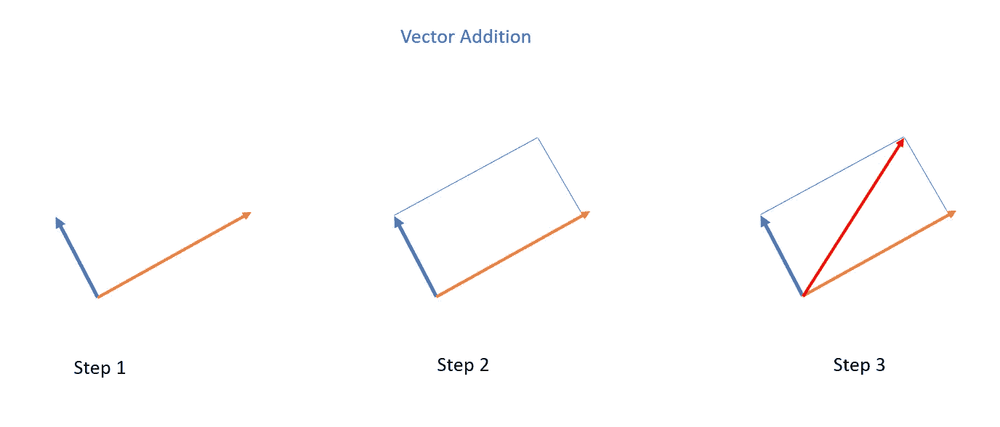
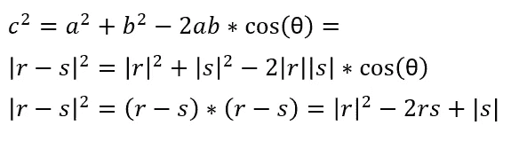
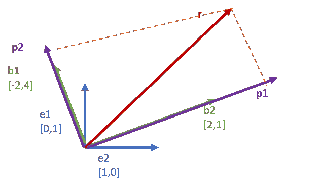
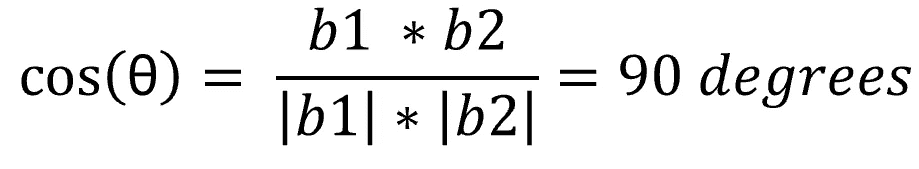

# 视觉化线性代数以入门机器学习：第一部分

> 原文：[`towardsdatascience.com/visualized-linear-algebra-to-get-started-with-machine-learning-part-1-245c2b6487f0`](https://towardsdatascience.com/visualized-linear-algebra-to-get-started-with-machine-learning-part-1-245c2b6487f0)

图片由 [Michael Dziedzic](https://unsplash.com/@lazycreekimages?utm_source=medium&utm_medium=referral) 提供，来源于 [Unsplash](https://unsplash.com/?utm_source=medium&utm_medium=referral)

## 掌握线性代数的基本元素，从简单且直观的基本概念解释开始

 [Marcello Politi](https://medium.com/@marcellopoliti?source=post_page-----245c2b6487f0--------------------------------)

·发表于 [Towards Data Science](https://towardsdatascience.com/?source=post_page-----245c2b6487f0--------------------------------) ·11 分钟阅读·2023 年 2 月 22 日

--

许多人在开始机器学习之旅时遇到的主要困难是理解数学概念。如果你没有扎实的线性代数、统计学、概率论、优化理论等方面的基础，这可能会很困难。 🤔💭🔢✖️🧮

在这篇文章中，我想先提供**线性代数基本概念的直观解释**，这些概念在深入了解机器学习之前是必不可少的。显然，本文并不打算详尽无遗，关于这一主题还有很多知识，但也许可以作为入门的第一步！

+   介绍

+   什么是向量？

+   简单的向量运算

+   投影

+   基础、向量空间与线性独立

+   矩阵与方程求解

## 介绍

**线性代数为何对数据科学重要？**

**线性代数** 使我们能够**解决实际问题**，尤其是数据科学中非常常见的问题。

假设我们去市场买了 3 个鳄梨和 4 个西兰花，花了 8 美元。第二天我们买了 11 个鳄梨和 2 个西兰花，花了 12 美元。

现在我们想要找出单个鳄梨和单个西兰花的价格。我们必须同时解答以下表达式。

线性代数问题（图源自作者）

另一个典型问题是**找到函数的最佳参数**，使其**符合我们收集的数据**。所以假设我们已经知道需要使用什么类型的函数，但这个**函数可以改变其形式，因为它依赖于某些参数**。我们想要**找到最佳形式和因此最佳参数**。

数据拟合（图片来源：作者）

比如，我们可以称 ***µ*** *= param1* 和 ***θ*** *= param2*。

通常，在机器学习中，我们希望**迭代地更新 [µ, θ]**，最终找到一些适合我们数据的良好曲线。

假设**远离最佳绿色曲线的曲线误差很大**，而**与绿色曲线相似的曲线误差很小**。我们通常说我们要找到那些参数 [µ, θ]，以**最小化误差**，所以找到与绿色曲线尽可能接近的曲线。

让我们看看线性代数如何帮助我们解决这些问题！

## 什么是向量？

物理学中的**向量**是一个**数学实体**，具有方向、符号和大小。因此，它通常用箭头来直观表示。

向量（图片来源：作者）

在**计算机科学中，向量的概念被推广**。事实上，你会多次听到用列表代替向量的术语。在这种观念中，向量不过是一个**属性列表**，我们可以用来表示任何事物。

假设我们想根据 3 个属性来表示房子：

1\. 房间数量

2\. 浴室数量

3\. 平方米

列表（图片来源：作者）

例如，在上图中我们有两个向量。第一个表示一个有 4 间卧室、2 间浴室和 85 平方米的房子。第二个则表示一个有 3 个房间、1 间浴室和 60 平方米的房子。

当然，如果我们对房子的其他属性感兴趣，我们可以创建一个更长的向量。在这种情况下，我们会说这个向量将有 *n 维*。**在机器学习中，我们通常会有数百或数千维**！

## 简单向量运算

我们可以对向量进行的操作，其中最简单的无疑是两个向量之间的加法，以及向量与**标量**（**即一个简单的数字**）的乘法。

**添加两个向量你可以使用平行四边形法则**。也就是说，你画出与要添加的向量平行的向量，然后画对角线。对角线将是加法的结果向量。相信我，通过直接查看下面的例子，你会更容易理解。

向量加法（图片来源：作者）

同时，**标量乘法将向量拉伸 n 单位**。见下例。

向量-标量乘法（作者提供的图片）

## 模与内积

**一个向量实际上总是用其他向量表示**。例如，让我们以**参考向量 i 和 j 为例，它们的长度都为 1，并且相互正交**。

单位长度向量（作者提供的图片）

现在我们定义一个新的向量 *r*，**它从原点开始**，也就是 *i* 和 *j* 相交的点，并且它的长度是 *i* 的 *a* 倍，*j* 的 *b* 倍。

空间中的向量（作者提供的图片）

更常见的是，**我们用坐标表示一个向量 r = [a,b]**，这样我们可以在**向量空间**中识别各种向量。

现在我们准备定义一个新的操作，即**向量的模**，**也就是它的长度**可以通过其坐标推导出来，定义如下。

向量模（作者提供的图片）

**内积**则是另一种操作，给定两个向量，它将所有组件相乘并返回其和。

内积（点积）（作者提供的图片）

内积有一些在某些情况下可能有用的属性：

+   对称性：*r*s = s*r*

+   对加法具有分配性：*r*(s*t) = r*s + r*t*

+   对标量乘法具有结合性：*r*(a*s) = a*(r*s)，其中 a 是标量*

请注意，如果你计算一个向量与自身的内积，你将得到其模的平方！

内积（点积）（作者提供的图片）

## 余弦（点积）乘积

到目前为止，我们只看到了基于向量坐标的内积数学定义。现在，让我们**查看它的几何解释**。让我们创建三个向量 *r*、*s* 及其差 *r-s*，从而形成一个具有三条边 *a*、*b*、*c* 的三角形。

三角形（作者提供的图片）

我们从高中时期知道，**我们可以使用简单的三角函数规则来推导 c**。

三角函数（作者提供的图片）

但我们可以从上述推导出：

（作者提供的图片）

因此，夹角对这个操作的结果有很大的影响。实际上，在一些特殊情况下，当夹角为 0°、90° 和 180° 时，余弦值分别为 0、1 和 -1。因此，这个操作会有特别的效果。例如，**两个相互垂直的向量的点积总是等于 0**。

## 投影

让我们考虑两个向量 *r* 和 *s*。这两个向量从一侧接近，并在它们之间形成一个夹角 *θ*。**让我们把一只手电筒放在 *s* 上面，我们会看到 *s* 在 *r* 上的投影**。**这就是 *s* 在 *r* 上的投影**。

投影（作者提供的图片）

有 2 种基本投影操作：

+   **标量投影**：给出投影的大小

+   **向量投影**：给出投影向量本身

投影（作者提供的图片）

## 改变基

线性代数中的基变换指的是**将向量表示为不同坐标系中的过程**，**这些坐标系称为基**。**基是一组线性无关的向量，可以用来表示向量空间中的任何向量**。**当一个向量在不同的基上表示时，其坐标会发生变化**。

我们已经看到，例如，在二维空间中，每个向量可以表示为两个基向量 [0,1] 和 [1,0] 的和。这两个向量是我们空间的基。但**我们是否可以使用其他两个向量作为基，而不仅仅是这两个？当然可以，但在这种情况下我们空间中每个向量的坐标都会发生变化**。让我们看看如何变化。

新基（作者提供的图片）

在上面的图像中，我有两个基。基 (e1, e2)，和基 (b1, b2)。此外，我还有一个向量 r（红色）。这个向量在 (e1, e2) 这个基中坐标为 [3,4]，这是我们默认使用的基。但是当用 (b1, b2) 表达时，它的坐标会变成什么呢？

要找到这些坐标，我们需要分步骤进行。首先，我们需要找到向量 r 在新基 (b1, b2) 上的投影。

改变基（作者提供的图片）

很容易看出，我们创建的这些投影的总和正好是 r。

r = p1 + p2。

此外，为了改变基，**我必须检查新基是否也是正交的**，即这些向量彼此成 90 度，这样它们才能定义整个空间。

**要检查这一点，只需查看角度的余弦是否为 0，即角度为 90 度。**

检查正交归一基（作者提供的图片）

现在我们继续**计算 r 在向量 (b1, b2) 上的投影**，使用我们在上一章看到的公式。

向量投影（作者提供的图片）

向量投影中用红色圈出的值将给出新向量 r 在基 b : (b1, b2) 中的坐标，而不是在 e : (e1, e2) 中的坐标。

新基 b 中的向量 r（作者提供的图片）

要检查计算是否正确，我们需要检查投影的总和是否在基 e : (e1, e2) 中正好是 r。

**[4,2] + [-1,2] = [3,4]**

## 基、向量空间和线性无关

我们已经看过并讨论了基。但让我们更精确地定义向量空间中的向量基是什么。

**基是一组 n 个向量**，其满足：

+   **彼此不是线性组合**（线性无关）

+   **张成空间**：空间是 n 维的

第一点意味着，如果例如我有 3 个向量*a, b, c*形成一个基，那么就没有办法将这些向量相加并通过标量相乘得到零！

如果我用*x y*和*z*表示任意三个标量（两个数字），这意味着：

***xa + yb + zc != 0***

（明显地排除平凡情况 x = y = z = 0）。在这种情况下，我们将说这些向量是线性无关的。

这意味着，例如**不能通过标量相乘和将*a*与*b*相加得到*c***。这意味着**如果*a*和*b*位于二维空间中，则*c*则位于第三维度中**。

而第二点意味着我可以将这些向量乘以标量并将它们相加，从而在三维空间中得到任何可能的向量。**所以这 3 个基向量足以让我定义整个维度为 n=3 的空间**。

## 矩阵和求解线性方程组

到现在你应该很擅长处理向量并进行运算了。但是它们在现实生活中有什么用呢？我们在开始时看到，我们的目标之一是同时解多个方程，例如，确定超市里蔬菜的价格。

线性方程组（图像由作者提供）

但现在我们知道了向量后，可以以更简单的方式重写这些方程。我们将系数向量[2,10]和[3,1]并排放置形成一个矩阵（向量集）。然后我们将得到未知向量[a, b]，最后是结果[8,3]。

向量化形式（图像由作者提供）

现在你可能会问这种新的问题书写形式是否真的更好。**如何在矩阵和向量之间进行乘法？** 非常简单。只需将矩阵的每一行与向量相乘。如果我们有两个矩阵之间的乘法，我们将不得不将第一个矩阵的每一行与第二个矩阵的每一列相乘。

**所以通过对行和列应用这个规则，我们应该能恢复原始形状。**

矩阵乘法（图像由作者提供）

**这种形式还有其他优点。它给我们提供了发生情况的几何解释。每个矩阵定义了一个空间中的变换。所以如果我在空间中有一个点并应用一个矩阵，我的点将以某种方式移动。**

矩阵变换（图像由作者提供）

但我们也可以说**矩阵不过是一个函数，它接受一个点作为输入并生成一个新的点作为输出**。

所以我们的初始问题可以解释为，“在什么情况下，原始向量[a, b]的变换结果是[8, 3]？”

这样，**你可以把解决联立方程看作是对向量空间中的向量进行变换**。此外，矩阵操作具有以下一些非常有用的特性。

给定 A(r) = r2 其中 A 是一个矩阵，r 和 r2 都是标量：

+   *A(nr) = ns* 其中 *n* 是一个标量

+   *A(r+s) = A(r) + A(s)* 其中 *s* 是一个向量

## 矩阵和空间变换

要理解矩阵的效果，我们可以查看它们如何变换施加在其上的向量。特别是，我们可能会看到矩阵在特征基上的影响。

如果我们有一个 2x2 矩阵，并且我们处于二维空间中，那么矩阵的第一列将告诉我们对向量 e1 = [1,0] 的效果，而第二列则会告诉我们对向量 e1 = [0,2] 的效果。

然后我们看看一些已知矩阵的效果。这些变换在机器学习中经常用于数据增强，例如，你可以拉伸或缩小这些图像。

矩阵变换（图片由作者提供）

**我们还可以对一个向量应用多个连续的变换**。所以，如果我们有两个由矩阵 A1 和 A2 表示的变换，我们可以将它们连续应用 A2(A1(vector))。

但这与反向应用它们不同，即 A1(A2(vector))。这就是为什么 **矩阵之间的乘积不具备交换律。**

# 最终思考

在我关于线性代数的文章的第一部分中，你应该已经理解了为什么这个主题对机器学习如此重要，也许你已经快速而直观地学习了基本概念。

你知道什么是向量和矩阵，如何在向量空间中表示这些实体以及如何对这些元素进行操作。继续关注，以免错过这篇文章的后续内容！ [😊](https://emojipedia.org/smiling-face-with-smiling-eyes/)

# 结束

*马尔切洛·波利提*

[Linkedin](https://www.linkedin.com/in/marcello-politi/)、[Twitter](https://twitter.com/_March08_)、[简历](https://march-08.github.io/digital-cv/)
