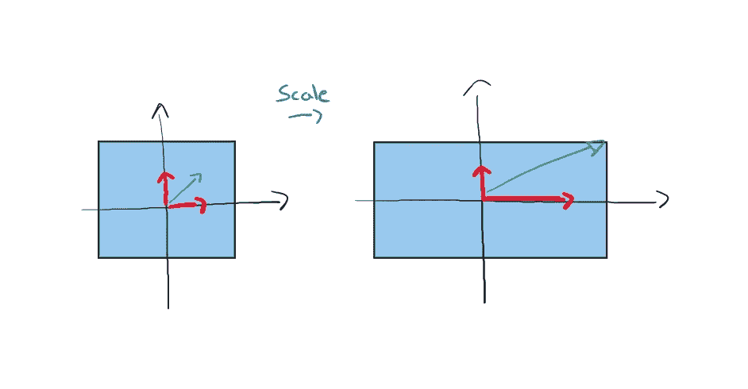

# 通过可视化线性代数入门机器学习：第二部分

> 原文：[`towardsdatascience.com/visualized-linear-algebra-to-get-started-with-machine-learning-part-2-2ef075edb28b`](https://towardsdatascience.com/visualized-linear-algebra-to-get-started-with-machine-learning-part-2-2ef075edb28b)


图片来源：[Michael Dziedzic](https://unsplash.com/@lazycreekimages?utm_source=medium&utm_medium=referral)于[Unsplash](https://unsplash.com/?utm_source=medium&utm_medium=referral)

## 掌握线性代数的基本元素，从简单和直观的基本概念讲解开始

[](https://medium.com/@marcellopoliti?source=post_page-----2ef075edb28b--------------------------------)[](https://towardsdatascience.com/?source=post_page-----2ef075edb28b--------------------------------) [Marcello Politi](https://medium.com/@marcellopoliti?source=post_page-----2ef075edb28b--------------------------------)

·发表于[Towards Data Science](https://towardsdatascience.com/?source=post_page-----2ef075edb28b--------------------------------) ·阅读时间 7 分钟·2023 年 2 月 28 日

--

## 介绍

在这篇文章中，我们继续在*“*[*通过可视化线性代数入门机器学习：第一部分*](https://medium.com/towards-data-science/visualized-linear-algebra-to-get-started-with-machine-learning-part-1-245c2b6487f0)*”*中开始的工作。我们以简单直观的方式探讨线性代数的新概念。这些文章旨在向你介绍线性代数的世界，并让你理解学习这一学科及其他数学学科与数据科学的紧密关系。

## 索引

+   解方程

+   行列式

+   高级换基

+   特征值和特征向量

+   计算特征值和特征向量

## 解方程

最后，让我们尝试理解如何同时解决方程。到现在你应该已经熟悉了如何使用矩阵和向量紧凑地写出方程，如本例所示。


方程（图像由作者提供）

寻找未知向量 r = [a,b]非常直接；我们只需**将方程的左右两侧分别乘以矩阵 A 的逆矩阵**。


解方程（图像由作者提供）

我们看到**A^-1 和 A 相互抵消**，**因为矩阵与其逆矩阵的乘积总是得到单位矩阵**（即主对角线上的所有元素都是 1，其余位置为零的矩阵）。因此，我们找到了 r 的值。

但为了做到这一点，我们必须**计算 A^-1，这可能并不简单**。通常编程语言中已经实现了非常高效的算法来计算逆矩阵，所以你将始终需要使用这些算法。但如果你想学习如何手动进行这个计算，你将需要使用[高斯消元法](https://en.wikipedia.org/wiki/Gaussian_elimination)。

这就是**如何使用 numpy 在 Python 中计算逆矩阵的示例**。

```py
import numpy as np

A = np.array([[6, 1, 1],
   [4, -2, 5],
   [2, 8, 7]])

# Calculating the inverse of the matrix
print(np.linalg.inv(A))
```

## 行列式

行列式是线性代数中的另一个基本概念。它通常在大学中教授如何计算，但不一定解释它的含义。**我们可以将一个值与每个矩阵关联，这个值正是行列式。**然而，**你可以将行列式视为变形空间的面积。**

我们已经看到每个矩阵实际上都是空间的变形。让我们举个例子。


行列式（图源作者）

如果我们计算新空间的面积，如图所示，**这个面积正是与起始矩阵相关的行列式**。在这种情况下，行列式 = a*d。

当然，我们有能够描述较复杂空间变形的矩阵，在这种情况下，计算面积即行列式可能并不那么简单。

为此，**有已知的公式用于计算行列式**。例如，我们来看一下计算 2x2 矩阵的行列式的公式。


计算 2x2 矩阵的行列式（图源作者）

你可以查看[这里](https://www.mathsisfun.com/algebra/matrix-determinant.html)了解如何在更大的矩阵的一般情况下计算行列式。

然而，**有些变换不会产生任何面积**。让我们看一个例子。


行列式等于零（图源作者）

在这个例子中，**矩阵不允许我们创建任何面积，所以行列式等于零**。

那么了解行列式有什么用呢？我们已经看到了解决联立方程时需要能够计算矩阵的逆。

但是**如果行列式等于零，矩阵的逆不存在**！这就是为什么了解如何计算行列式非常重要，以便知道是否存在问题的解决方案。

**你可以将逆矩阵视为将空间转换回原始空间的一种方法**。但当一个矩阵造成的不是一个面积，而只是一个线段，然后使我们从二维空间变到一维空间时，逆矩阵没有足够的信息，永远无法使我们从一维空间回到二维的原始空间。

## 高级基变换

我们已经在之前的文章中看到了基本的基变换示例，但现在让我们看一个稍微复杂一点的例子。

让我们**想象存在两个世界**，**我们的世界和纳尼亚的世界**。在我们的世界中，我们使用向量 e1 和 e2 作为我们的参考向量，即基向量。感谢这些向量，我们能够创建其他向量并给它们指定坐标。例如，我们可以创建向量[1,1]和[3,1]。


我们的世界（图像作者提供）

然而，在纳尼亚的世界中，他们使用不同的向量作为基。你能猜到他们使用的是哪些吗？就是我们称为[1,1]和[3,1]的那些。


纳尼亚的世界（图像作者提供）

纳尼亚的人们将使用他们的这个基来定义空间中的其他向量，例如，他们可能会定义向量[3/2, 1/2]。


纳尼亚世界中的向量（图像作者提供）

好的，现在我想要找出的就是：**如何根据我的世界中的坐标定义那个红色向量**？

我们已经看到这一点，我们取纳尼亚基的向量，但用我们世界中的坐标表示，即[1,1]和[3,1]。我们将它们放入一个矩阵中，并将这个矩阵与红色向量相乘。


改变基（图像作者提供）

现在我们问：**我们也能反向操作吗？我能根据纳尼亚使用的坐标来表达我们世界中的一个向量吗？当然可以！**

**只需做相同的过程，但改变视角**。但我们为什么要这么做？**当我们需要描述向量或变换时，如果使用不同的基，通常会有更简单的表示方法**。

**假设我们想对一个向量应用 R 变换。但是这个变换难以应用。那么我们可以先通过应用矩阵 N 将我的向量转换成纳尼亚世界中的向量。然后应用所需的变换 R。最后，用 N^-1 将一切带回到我们原来的世界。**

这在处理复杂变换时可以非常有用，使生活变得更简单。我希望我至少给你提供了一些见解；还有很多内容可以讨论。

## 特征值和特征向量

我们已经多次提到**对向量应用线性变换（一个矩阵）会改变那个向量**。

然而，在某些情况下，向量保持在相同的初始方向上。比如说，**如果我们只是缩放空间**。如果我们可视化**水平和垂直向量，它们虽然变长或变短，但仍保持在相同的方向上**。



缩放空间（图像作者提供）

从上面的图像中我们可以看到，这里的线性变换是缩放变换。但是如果我们试图理解每个单独向量发生了什么，我们会发现红色向量仍然保持相同的方向。

**这些保持相同方向的向量被称为描述该变换的矩阵的特征向量。**

具体来说，垂直的红色向量保持不变，所以我们可以说它的特征值是 =1，而另一个红色向量则翻倍了，所以我们可以说它的特征值是 =2。

显然，根据矩阵的不同，因此变换的不同，特征向量的数量可能会有所不同。

## 计算特征值和特征向量

现在让我们尝试将我们用文字表达的内容转换为数学公式。所以特征向量是指当矩阵作用于它们时，它们不发生变化，最多只是变长或变短。


计算特征向量（图片来源：作者）

在公式中，A 是一个矩阵，x 是一个向量，lambda 是一个标量。如果条件满足，我们称 x 是 A 的特征向量，对应的特征值为 lambda。

通过解前面的方程，我们可以找到解决该方程的特征值，来看一下如何做。


特征多项式（图片来源：作者）

一旦找到了特征值，只需将它们代入以下方程即可找到特征向量。


查找特征向量（图片来源：作者）

# 最终想法

我希望你在这篇文章中找到了一些有用的见解，并且能够毫费力气地理解它们。目的是让你对这些术语和线性代数元素有一点了解。这样，我希望下次你查看 sklearn 或其他库的文档时，能够更好地理解你使用的特定函数实际上在做什么！ [😊](https://emojipedia.org/smiling-face-with-smiling-eyes/)

# 结束

*Marcello Politi*

[Linkedin](https://www.linkedin.com/in/marcello-politi/), [Twitter](https://twitter.com/_March08_), [CV](https://march-08.github.io/digital-cv/)
