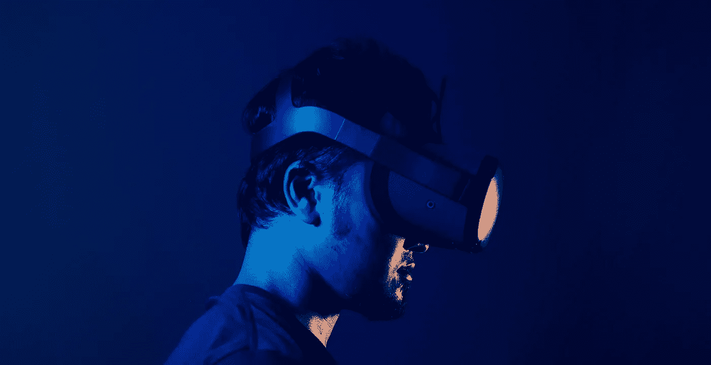

# 使用 Google Trends 可视化 AI 和科技炒作

> 原文：[`towardsdatascience.com/visualizing-ai-and-tech-hype-using-google-trends-chatgpt-bc1c5113b701?source=collection_archive---------6-----------------------#2023-12-19`](https://towardsdatascience.com/visualizing-ai-and-tech-hype-using-google-trends-chatgpt-bc1c5113b701?source=collection_archive---------6-----------------------#2023-12-19)

## 可视化教程

## 一个关于如何创建斜坡图可视化以评估技术趋势变化（如虚拟现实和生成式 AI）的教程。

 [Christabelle Pabalan](https://medium.com/@christabellecp?source=post_page-----bc1c5113b701--------------------------------)

·

[关注](https://medium.com/m/signin?actionUrl=https%3A%2F%2Fmedium.com%2F_%2Fsubscribe%2Fuser%2F4200eb8e8b26&operation=register&redirect=https%3A%2F%2Ftowardsdatascience.com%2Fvisualizing-ai-and-tech-hype-using-google-trends-chatgpt-bc1c5113b701&user=Christabelle+Pabalan&userId=4200eb8e8b26&source=post_page-4200eb8e8b26----bc1c5113b701---------------------post_header-----------) 发表在 [Towards Data Science](https://towardsdatascience.com/?source=post_page-----bc1c5113b701--------------------------------) · 9 分钟阅读 · 2023 年 12 月 19 日

--

2021 年底，当马克·扎克伯格向我们展示‘[元宇宙](https://www.youtube.com/watch?v=SAL2JZxpoGY)’时，空气中弥漫着忧虑——这是一个通过虚拟现实头戴设备可以访问的数字宇宙，旨在在逼真的虚拟环境中创造一种令人信服的身体存在感。因此，2022 年我们见证了对虚拟现实的兴趣复苏，引发了既令人兴奋又让人感到存在主义恐惧的情绪。

由[Minh Pham](https://unsplash.com/@minhphamdesign?utm_content=creditCopyText&utm_medium=referral&utm_source=unsplash)拍摄，图片来源于[Unsplash](https://unsplash.com/photos/man-in-black-crew-neck-shirt-wearing-black-headphones-AHCmAX0k_J4?utm_content=creditCopyText&utm_medium=referral&utm_source=unsplash)

虽然 2022 年元宇宙引起了关注，但它并不是唯一的变革力量；生成式 AI 的爆炸性增长迅速改变了集体关注的焦点。

在[*元宇宙与生成式 AI：展望人机互动的未来*](https://www.spglobal.com/en/research-insights/featured/special-editorial/metaverse-and-generative-ai-envisioning-the-future-of-human-computer-interaction)中，Ian Hughes 和 Sudeep Kesh 解释道，

> “2022 年和 2023 年在某些人工智能领域特别充满事件。尽管许多 AI 和机器学习的内容 […] 一直隐秘于公众视野之外……
