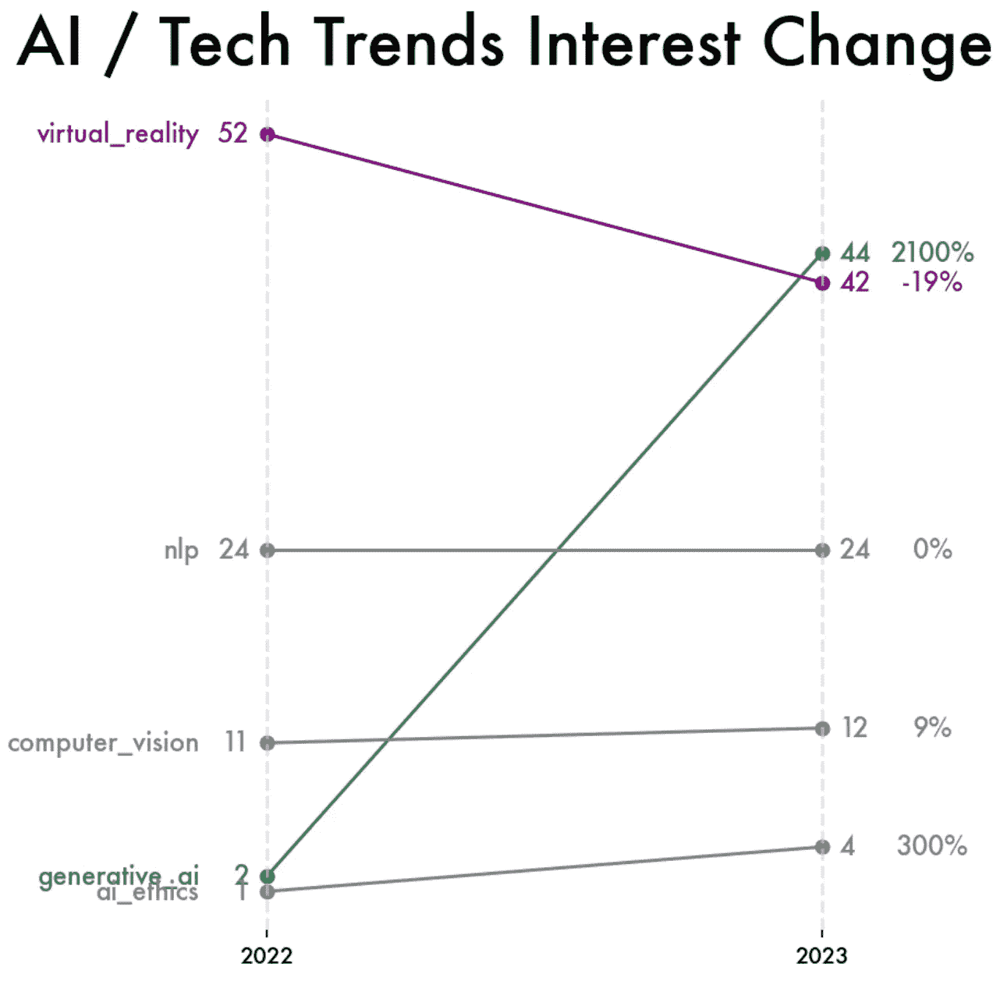

# 使用 Google Trends 可视化 AI 和技术炒作

> 原文：[`towardsdatascience.com/visualizing-ai-and-tech-hype-using-google-trends-chatgpt-bc1c5113b701`](https://towardsdatascience.com/visualizing-ai-and-tech-hype-using-google-trends-chatgpt-bc1c5113b701)

## 可视化教程

## 一份关于如何创建斜坡图可视化以评估技术趋势变化（如虚拟现实和生成性 AI）的教程。

[](https://medium.com/@christabellecp?source=post_page-----bc1c5113b701--------------------------------)[](https://towardsdatascience.com/?source=post_page-----bc1c5113b701--------------------------------) [Christabelle Pabalan](https://medium.com/@christabellecp?source=post_page-----bc1c5113b701--------------------------------)

· 发表在 [Towards Data Science](https://towardsdatascience.com/?source=post_page-----bc1c5113b701--------------------------------) · 9 分钟阅读 · 2023 年 12 月 19 日

--

2021 年末，马克·扎克伯格向我们展示了‘[元宇宙](https://www.youtube.com/watch?v=SAL2JZxpoGY)’ — 一个可以通过虚拟现实头显访问的数字宇宙，旨在在逼真的虚拟环境中创造一种真实的存在感。因此，在 2022 年，我们目睹了对虚拟现实的兴趣复苏，既激发了兴奋，也引发了存在主义的恐惧。


图片由[Minh Pham](https://unsplash.com/@minhphamdesign?utm_content=creditCopyText&utm_medium=referral&utm_source=unsplash)拍摄，来自[Unsplash](https://unsplash.com/photos/man-in-black-crew-neck-shirt-wearing-black-headphones-AHCmAX0k_J4?utm_content=creditCopyText&utm_medium=referral&utm_source=unsplash)

虽然元宇宙在 2022 年引发了兴趣，但它并不是唯一的变革力量；生成性 AI 的爆炸性发展迅速改变了集体关注点。

在 [*元宇宙与生成性 AI：展望人机交互的未来*](https://www.spglobal.com/en/research-insights/featured/special-editorial/metaverse-and-generative-ai-envisioning-the-future-of-human-computer-interaction) 中，Ian Hughes 和 Sudeep Kesh 解释道，

> “2022 年和 2023 年在某些人工智能分支中尤为多事。尽管人工智能和机器学习的许多方面[…]到目前为止一直未引起广泛关注，但普通网民突然能够通过 OpenAI 的 ChatGPT 和 Google 的 Bard 等界面与大型语言模型（LLMs）进行互动。[…]这一发展伴随着生成式 AI 在图像领域的崛起，DALL-E 和 Midjourney 等引领了潮流。[…] 一些搜索引擎已开始实现这一技术。[…] 像元宇宙一样，生成式 AI 有潜力影响我们与数字内容及彼此的每一次互动。”

过去几年证明了科技领域变化的速度和趋势的变革。面对不断的讨论，我们自然会对趋势波动产生直观感受。然而，这种不断增长的直觉常常引发对这些变化更客观、定量理解的需求。

幸运的是，我们可以访问数据和软件，这些工具允许我们量化和可视化对热门话题的兴趣升降。在本文中，我想介绍两个工具，这些工具结合使用可以帮助我们通过网络搜索捕捉公众兴趣：Google Trends 和斜率图。

## Google Trends 是什么？


Google Trends 主页。作者截图。

Google Trends 是一个突出显示人们好奇和搜索内容的工具。它通常用于市场研究和内容规划，因为它使用户能够快速查看公众兴趣和在线搜索行为的变化。


Google Trends Cybertruck 示例。作者截图。

在上面的截图中，你可以看到 Google Trends 提供了一个“**Interest Over Time**”（兴趣随时间变化）得分，代表特定术语在指定时间段和区域内的相对受欢迎程度或搜索兴趣。得分经过标准化和缩放，其中 100 代表该术语的最高受欢迎程度。

这意味着该指标提供的是相对数据，而非绝对搜索量。得分相对于时间序列中的最高点，而实际的搜索量或该术语的搜索次数并未披露。此外，Google Trends 允许你在同一图表中比较多个术语的搜索兴趣，使你更容易看到它们的受欢迎程度如何随时间变化。

## 斜率图是什么？

斜率图是一种有效的可视化工具，用于比较两个时间点之间类别排名的变化。它不仅展示了每个时期类别之间的排名情况，还展示了这两个时期之间这些排名如何变化。


作者截图

**初始排名 —** 坡度图左侧每个点的垂直位置表示该类别在第一个周期的初始排名。

**最终排名 —** 同一数据点在右侧的垂直位置表示该类别在第二个周期的最终排名。

**线条 —** 连接这些点的线条显示排名的变化。线条的坡度表示类别或项目的排名是上升还是下降，坡度的陡峭程度反映了变化的程度。

通过检查线条的坡度和方向，我们可以快速识别出排名发生变化的类别或项目，以及变化的方向（例如，提升或下降）。这使得坡度图在传达类别或项目相对位置如何演变方面非常有价值。

## 使用颜色来突出显著的变化

此外，**你可以使用颜色来突出特定的坡度**，从而强调特定的变化或趋势。例如，你可以使用醒目的颜色（例如紫色）来突出排名显著提升的类别。


作者截图

最后，进入教程…

# AI / 技术趋势应用

## 从 Google Trends 拉取数据

首先，你需要点击`+ Compare`按钮，添加所有你感兴趣的比较项。


作者截图

在下方截图中，我添加了以下术语：生成性 AI、虚拟现实、AI 伦理、计算机视觉和 NLP。


作者截图

接下来，选择你感兴趣的时间范围进行分析。


最后，使用蓝色高亮的下载图标导出数据。


作者截图

## 数据预处理以供可视化

**1. 加载数据**

```py
df = pd.read_csv('data.csv', skiprows=1)
```


作者截图

**2. 预处理数据**

```py
# Rename columns
df.columns = ['week',
              'generative_ai',
              'virtual_reality',
              'ai_ethics',
              'computer_vision',
              'nlp']

# Replace `<1` values with `1`
df = df.replace('<1', 1)

# Set index to the week
df = df.set_index('week')

# Change all data types to 'int'
df = df.astype(int)

# Extract Month and Year Columns
df['month'] = df.index.astype('datetime64[ns]').month
df['year'] = df.index.astype('datetime64[ns]').year.astype(str)

# Filter to use only data in the last 4 months of the year
df_end_year = df[df['month'].isin([9, 10, 11, 12])]

# Group by year and take the average interest score
df_average_interest = df_end_year.groupby('year').mean().round(1)

# Drop the month column
df_average_interest = df_average_interest.drop(columns='month')
```


作者截图

```py
# Change all values into integers and tranpose the dataframe
df_combined = df_average_interest.astype(int).T.reset_index()

# Rename the 'index' column to 'category'
df_combined = df_combined.rename(columns={'index': 'category'})

# Filter dataframe to only the years of interest
year1 = '2022'
year2 = '2023'
df_final = df_combined[['category', year1, year2]].copy()

def percent_change(new, old):
    return (100 * ((new - old)/old)).astype(int)

# Calculate the interest change between the two years and the % change
df_final['change'] = df_final[year2] - df_final[year1]
df_final['percent_change'] = percent_change(df_final[year2], df_final[year1])

# Sort the DataFrame by the absolute change for better visualization
df_final = df_final.sort_values(by='change', ascending=False)
```


作者截图

**3. 创建坡度图**

```py
# Create a dictionary to map categories to colors
dict_colors = {
    'generative_ai': 'seagreen',
    'ai_ethics': 'grey',
    'computer_vision': 'grey',
    'nlp': 'grey',
    'virtual_reality': 'purple'
}

# Set the figure size
plt.figure(figsize=(5, 7))

# Create a slopegraph by plotting lines between 2022 and 2023 values
for index, row in df_final.iterrows():

    # set color 
    color = dict_colors[row['category']]

    # Set the label color and pct change labels to match the line color 
    plt.text(-.03, 
             row[year1], 
             str(row[year1]), 
             ha='right', 
             va='center', 
             color=color, 
             fontsize=12)
    plt.text(1.03, 
             row[year2], 
             str(row[year2]), 
             ha='left', 
             va='center', 
             color=color, 
             fontsize=12)
    plt.text(1.2, 
             row[year2], 
             f'{row["percent_change"]:.0f}%', 
             ha='center', 
             va='center', 
             color=color, 
             fontsize=12)
    plt.text(-.12, 
             row[year1], 
             row['category'], 
             ha='right', 
             va='center', 
             fontsize=12, 
             color=color)

    # plot lineplot for each category
    x_values = [0, 1]
    y_values = [row[year1], row[year2]]
    plt.plot(x_values, y_values, marker='o', color=color)

# Set x and y ticks
plt.yticks([])
plt.xticks([0, 1], ['2022', '2023'])

# Remove spines
for spine in plt.gca().spines.values():
    spine.set_visible(False)

# Add vertical light grey lines at x-values 0 and 1
plt.axvline(x=0, color='lightgrey', linestyle='--', alpha=0.6)
plt.axvline(x=1, color='lightgrey', linestyle='--', alpha=0.6)

# Set title
plt.text(x=-.45,
         y=58,
         s='AI / Tech Trends Interest Change',
         ha='left',
         va='center',
         color='black',
         fontsize=30)

# Show plot
plt.show()
```



作者截图

在下图中，我将标题上移，并添加了副标题，以增强可视化叙事的效果。副标题提供背景信息，引导解读，并有助于整体叙事流程，使数据对更广泛的观众更具可访问性和吸引力，同时提升了图表的视觉美感。


作者截图

# 坡度图分析

## 生成性 AI 的崛起

生成式 AI 是人工智能的一个子领域，它包含能够基于数据中的潜在学习模式和结构生成原创输出的算法。生成式 AI 兴趣的 2100%激增紧随 2022 年底 OpenAI 的 ChatGPT 上线，该聊天机器人以其先进的语言生成能力而闻名。

对生成式 AI 的高度关注得到有影响力的科技领袖的积极反馈的支持。埃隆·马斯克称其为“有史以来最强大的创造力工具”。比尔·盖茨设想它在从日常便利到解决重大全球问题的方面以无法想象的方式改变世界。他表示，“生成式 AI 有潜力以我们无法想象的方式改变世界。它有能力创造新的想法、产品和服务，使我们的生活更轻松、更高效、更富有创造力。它也有潜力解决一些世界上最大的难题，比如气候变化、贫困和疾病。”

## 多面的数字时代

相比之下，虚拟现实 (VR) 的兴趣下降了 19%，但在科技领域的公众兴趣中仍保持强劲的相对地位。它创造沉浸式环境的能力持续革新游戏、教育和医学培训等领域。随着生成式 AI 的崛起，VR 的沉浸能力继续持有变革性潜力，提供其他技术无法复制的独特体验。在 VR 的确立存在与生成式 AI 的新兴主导地位之间，我们可以期待（或紧张地预期）一个多面的数字时代。

# Slopegraph 概述

## *适用性和优势*

Slopegraphs 非常适合可视化多数据系列随时间的变化。它们在需要强调总体趋势的情况下表现出色，例如某个系列显著上升或下降，而不是关注每个期间的波动。这种方法减少了在值波动的折线图中常见的视觉混乱。

## Slopegraphs 的局限性

+   *排除了中期数据：* Slopegraphs 的一个主要限制是它们关注起点和终点，忽视了中期数据。如果被遗漏的数据对背景很重要，这可能会造成问题。在这种情况下，折线图可能是更好的选择。

+   *不适合无关的分类数据：* Slopegraphs 在没有内在联系的分类数据中效果较差。不当使用时，可能会导致令人困惑的视觉效果。

+   *强调相对变化：* Slopegraphs 突出系列之间的相对变化或比较速率，而非绝对值。对于精确量化（例如确切的销售增长百分比），条形图更为合适。

# 最终说明

希望这篇文章能作为一个信息丰富且赋能的指南，帮助你深入了解如何有效使用 slopegraphs。

如果你正在寻找一些创意来为你的下一个项目增添活力，我强烈推荐你查看[数据故事讲述的 6 月 SWDChallenge 回顾：斜线图](https://www.storytellingwithdata.com/blog/2018/6/19/june-swdchallenge-recap-slopegraphs)。这个资源包含了来自世界各地的数据可视化爱好者创作的多样化斜线图作品集。

## 数据故事讲述

对于那些不熟悉的人来说，[数据故事讲述](https://www.storytellingwithdata.com/community)社区是一个数据可视化爱好者交流和学习的平台。他们每月举办一次挑战，鼓励参与者以创意和深刻的方式探索和展示数据。在斜线图挑战中，"#BREAKTHESTIGMA"条目给我留下了最深刻的印象，突显了 2014 年至 2015 年菲律宾自残事件的惊人上升。这一提交展示了数据故事讲述如何成为推动对关键社会和心理健康问题对话的强大催化剂。

我希望这篇文章和斜线图作品集能够激励你创造自己的作品！如果你有这样的计划，请随时联系我，我很乐意通过这里、LinkedIn，或者通过 christabellepabalan@gmail.com 听到你的消息。
