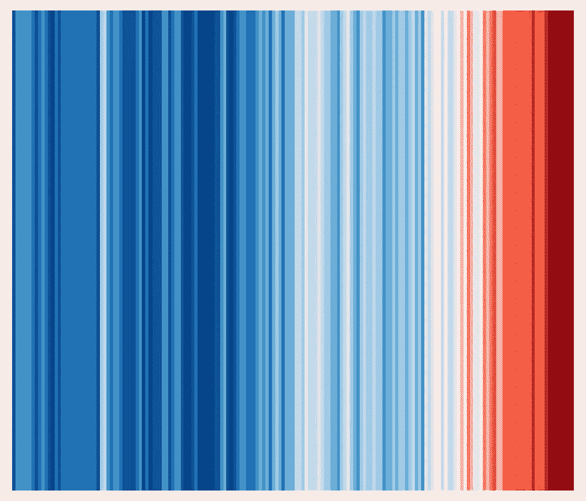
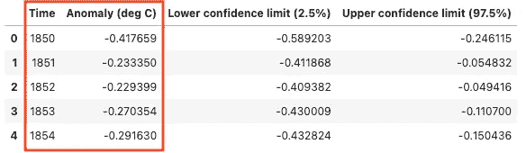
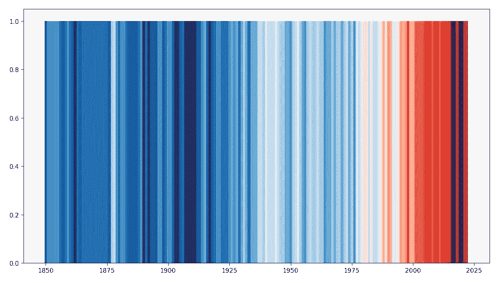
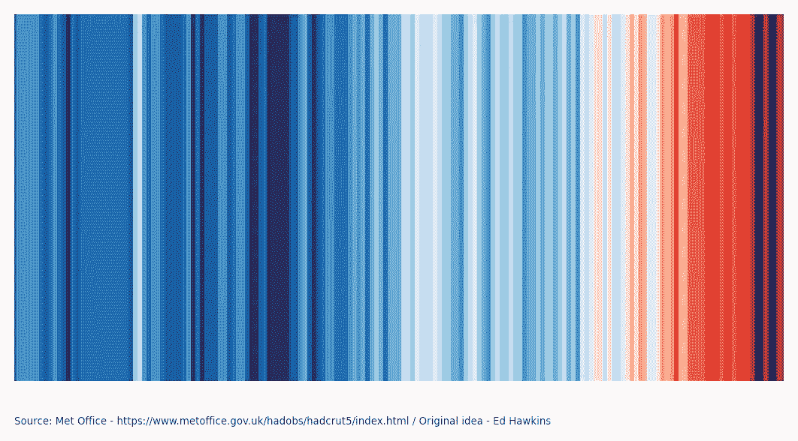
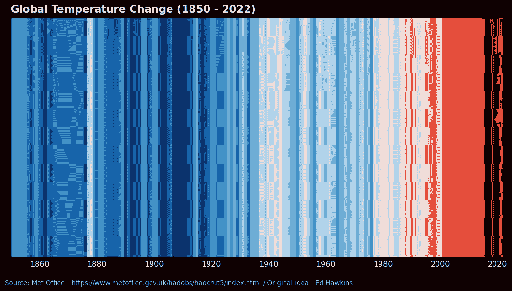

# 可视化气候变化：用 Python 重现气候条纹的逐步指南

> 原文：[`towardsdatascience.com/visualizing-climate-change-a-step-by-step-guide-to-reproduce-climate-stripes-with-python-ea1d440e8e8d`](https://towardsdatascience.com/visualizing-climate-change-a-step-by-step-guide-to-reproduce-climate-stripes-with-python-ea1d440e8e8d)

## 快速的 Matplotlib 教程，帮助你创建出色的可视化

[](https://guillaume-weingertner.medium.com/?source=post_page-----ea1d440e8e8d--------------------------------)[](https://towardsdatascience.com/?source=post_page-----ea1d440e8e8d--------------------------------) [**Guillaume Weingertner**](https://guillaume-weingertner.medium.com/?source=post_page-----ea1d440e8e8d--------------------------------)

·发布于 [**Towards Data Science**](https://towardsdatascience.com/?source=post_page-----ea1d440e8e8d--------------------------------) ·6 分钟阅读·2023 年 2 月 17 日

--



全球温度变化（1850–2022）— 作者提供的图像 — 创意来自**Ed Hawkins**

# 动机

气候变化是我们时代最紧迫的问题之一。为了提高意识并传达问题的紧迫性，科学家和数据分析师们开发了多种可视化气候数据的方法。其中一种特别有效的方法是“气候条纹”可视化，最早由**Ed Hawkins**（雷丁大学的气候科学家）推广。在这篇文章中，我们将逐步演示如何使用 Python 重现气候条纹，为任何有兴趣制作自己气候条纹可视化的人提供详细的指南。无论你是气候科学家、数据分析师，还是只是对这个问题感兴趣的普通人，这个指南将为你提供制作自己气候条纹和与他人分享的工具。

这种可视化的美在于其简洁。只需一瞥，读者就能理解信息，而无需陷入其背后的技术细节中。

自从发布以来，气候条纹已被广泛应用于各种媒体。2019 年 9 月，这一可视化甚至登上了《经济学人》的封面，进一步提升了其知名度。

**Ed Hawkins** 实际上不久前更新了条纹数据，增加了 2022 年的数据点，并在推特上发布了相关内容。剧透一下，趋势没有改变。

**Ed Hawkins** 更新气候条纹的新推文

# #1 数据

HadCRUT5 数据集包含相对于 1961-1990 年参考期的全球历史地表温度异常数据。可以在 [`www.metoffice.gov.uk/`](https://www.metoffice.gov.uk/) 上找到，并在 Morice、Kennedy 等人的论文中介绍 [1]。

HadCRUT5 是一个结合了来自船只和浮标的海表温度测量数据与来自陆地表面的气象站的近地面气温测量数据的综合数据集。

这个简短的解释无法体现测量方法的复杂性和处理数据偏差的工作。参考部分链接的论文提供了更完整的图景。

在这种项目中，我们处理的数据集往往干净到不需要任何数据清理，但这个数据集实际上确实是干净的。

我们只需导入经典库来读取和绘制数据，就基本完成了准备工作：

```py
import pandas as pd
import matplotlib.pyplot as plt
import matplotlib as mpl
from matplotlib.colors import ListedColormap

df = pd.read_csv('HadCRUT.5.0.1.0.analysis.summary_series.global.annual.csv')
df.head()
```



数据集提取—文中使用的列已突出显示 — 作者提供的图片

# #2 前提条件

## 色图

为了构建图表，我们将使用“[ColorBrewer](https://en.wikipedia.org/wiki/Cynthia_Brewer#ColorBrewer) 9 类单色调色板中的八种最饱和的蓝色和红色”，这在原始条纹中也有使用，感谢维基百科和辛西娅·布鲁尔 — [2] 和 [3]。

## 图表构建方法

本文中我们将使用的图表类型是一个简单的条形图，我们将去掉大部分元素。

我在另一篇文章中解释了如何构建引人注目的条形图，这在这里同样适用：

[](/5-steps-to-build-beautiful-bar-charts-with-python-3691d434117a?source=post_page-----ea1d440e8e8d--------------------------------) ## 使用 Python 构建漂亮条形图的 5 个步骤

### 如何利用 Matplotlib 的全部功能讲述更引人入胜的故事

towardsdatascience.com

# #3 代码部分

不再多说，让我们开始构建吧。

实际上，按照下面的步骤，只需几行代码就能生成第一个版本：

+   **创建图形对象**

+   **创建色图**

    使用前面部分描述的相关颜色

+   **将温度异常数据线性化到 [0,1] 区间** 这是在图表上正确使用色图的关键

+   **绘制条形图**，使用 X 轴上的年份和嵌入色图中的异常值，而不是 Y 轴。*这里的技巧是对所有条形图使用相同的高度（这里设为 1 单位），让色图讲述故事*

```py
# Create the figure and axes objects, specify the size and the dots per inches 
fig, ax = plt.subplots(figsize=(13.33,7.5), dpi = 96)

# Colours - Choose the colour map - 8 blues and 8 reds
cmap = ListedColormap([
    '#08306b', '#08519c', '#2171b5', '#4292c6',
    '#6baed6', '#9ecae1', '#c6dbef', '#deebf7',
    '#fee0d2', '#fcbba1', '#fc9272', '#fb6a4a',
    '#ef3b2c', '#cb181d', '#a50f15', '#67000d'])

# linearly normalizes data into the [0.0, 1.0] interval
norm = mpl.colors.Normalize(df['Anomaly (deg C)'].min(), df['Anomaly (deg C)'].max())

# Plot bars
bar = ax.bar(df['Time'], 1, color=cmap(norm(df['Anomaly (deg C)'])), width=1, zorder=2)
```

这就是我们得到的结果：



气候条纹第一部分 — 作者提供的图片

现在，只需清理图表并在其下方添加数据来源，一旦完成这一步骤就会变得非常简单：

+   **去除脊柱** 使图表尽可能简洁

+   **重新格式化 X 轴和 Y 轴** 无标签，无刻度，定义限制以避免空白区域

+   **添加来源**

    数据图表下方的部分

+   **调整边距**

    以确保图表居中

+   **设置白色背景**

    以避免以后出现任何透明度问题

```py
# Remove the spines
ax.spines[['top', 'left', 'bottom', 'right']].set_visible(False)

# Reformat x-axis label and tick labels
ax.set_xlabel('', fontsize=12, labelpad=10)
ax.set_xticks([])
ax.set_xlim([df['Time'].min()-1, df['Time'].max()+1])

# Reformat y-axis label and tick labels
ax.set_ylabel('', fontsize=12, labelpad=10)
ax.set_yticks([])
ax.set_ylim([0, 1]) 

# Set source text
ax.text(x=0.1, y=0.12, s="Source: Met Office - https://www.metoffice.gov.uk/hadobs/hadcrut5/index.html / Original idea - Ed Hawkins", transform=fig.transFigure, ha='left', fontsize=10, alpha=.7)

# Adjust the margins around the plot area
plt.subplots_adjust(left=0.1, right=None, top=None, bottom=0.2, wspace=None, hspace=None)

# Set a white background
fig.patch.set_facecolor('white')
ax.patch.set_facecolor('white')
```

这就是最终的**气候条纹**，去除所有元素，尽可能整洁，并显示数据来源：



气候条纹 — 作者图片

如果我们愿意，我们还可以：

+   在 X 轴上添加刻度以显示年份

+   将源文本设置为白色

+   为图表添加标题

+   重新调整边距，以考虑 X 刻度

+   将背景颜色设置为黑色

```py
# Reformat x-axis label and tick labels
ax.set_xlabel('', fontsize=12, labelpad=10)
ax.xaxis.set_tick_params(pad=2, labelbottom=True, bottom=True, labelsize=12, labelrotation=0, labelcolor='white')
ax.set_xlim([df['Time'].min()-1, df['Time'].max()+1])

# Set source text
ax.text(x=0.1, y=0.12, s="Source: Met Office - https://www.metoffice.gov.uk/hadobs/hadcrut5/index.html / Original idea - Ed Hawkins", transform=fig.transFigure, ha='left', fontsize=10, alpha=.7, color='white')

# Set graph title
ax.set_title('Global Temperature Change (1850 - 2022)', loc='left', color='white', fontweight="bold", size=16, pad=10)

# Adjust the margins around the plot area
plt.subplots_adjust(left=0.11, right=None, top=None, bottom=0.2, wspace=None, hspace=None)

# Set a black background
fig.patch.set_facecolor('black')
ax.patch.set_facecolor('black')
```

并获取最终版本：



气候条纹 — 最终版本 — 作者图片

# #4 最终思考

气候条纹已被证明是传达气候变化现实的一个极其强大的工具。通过提供一个简单但有影响力的温度趋势表示，这种可视化已成为突出问题紧迫性的广泛使用且易于识别的方式。

在这篇文章中，我试图强调，最令人惊叹和相关的可视化，有时并不是最复杂的构建。

希望有人会觉得它有用！

# 参考文献

[1] — [Morice, C.P., J.J. Kennedy, N.A. Rayner, J.P. Winn, E. Hogan, R.E. Killick, R.J.H. Dunn, T.J. Osborn, P.D. Jones and I.R. Simpson (in press) An updated assessment of near-surface temperature change from 1850: the HadCRUT5 dataset. Journal of Geophysical Research (Atmospheres) doi:10.1029/2019JD032361](https://www.metoffice.gov.uk/hadobs/hadcrut5/HadCRUT5_accepted.pdf)

[开放政府许可 v3](http://www.nationalarchives.gov.uk/doc/open-government-licence/version/3/)

[2] — [`en.wikipedia.org/wiki/Warming_stripes`](https://en.wikipedia.org/wiki/Warming_stripes)

[3] — [`colorbrewer2.org/#type=sequential&scheme=Reds&n=9`](https://colorbrewer2.org/#type=sequential&scheme=Reds&n=9)

*感谢你读到文章的最后。*

关注以获取更多信息！

如果你有任何问题或意见，请随时在下面留言，或通过* [*LinkedIn*](https://www.linkedin.com/in/guillaume-weingertner-a4a27972/) *与我联系！*
