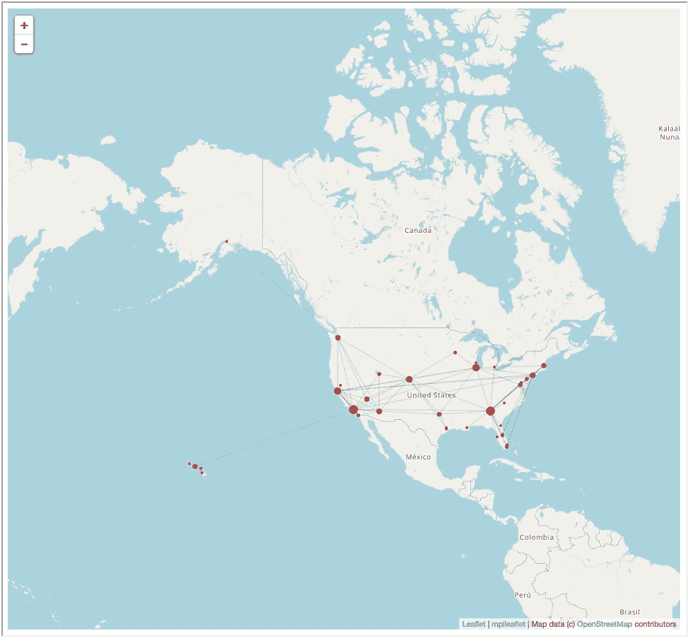
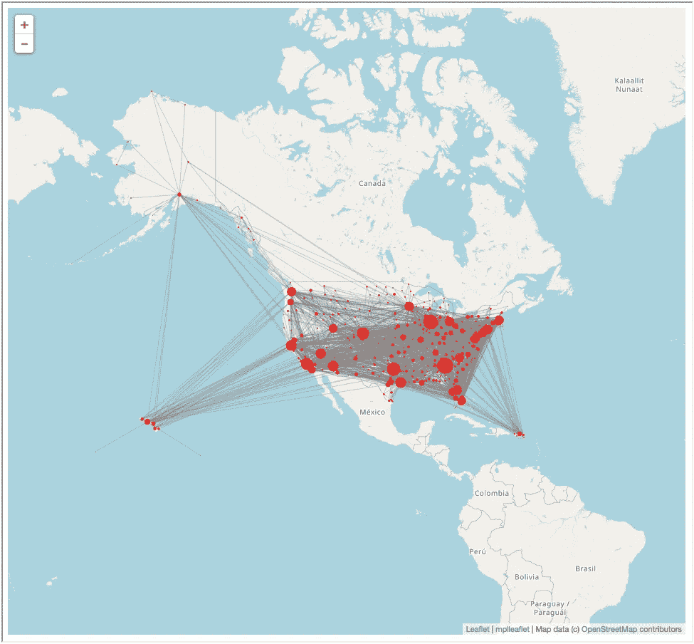

# 使用 Basemap 和 mplleaflet 可视化地理空间网络图

> 原文：[`towardsdatascience.com/visualizing-geospatial-network-graphs-using-basemap-and-mplleaflet-76a7f3d0c923`](https://towardsdatascience.com/visualizing-geospatial-network-graphs-using-basemap-and-mplleaflet-76a7f3d0c923)

## 学习如何在地图上绘制网络图

  [Wei-Meng Lee](https://weimenglee.medium.com/?source=post_page-----76a7f3d0c923--------------------------------)

·发表于 [Towards Data Science](https://towardsdatascience.com/?source=post_page-----76a7f3d0c923--------------------------------) ·阅读时间 9 分钟·2023 年 3 月 6 日

--


照片由 [Z](https://unsplash.com/@dead____artist?utm_source=medium&utm_medium=referral) 提供，来源于 [Unsplash](https://unsplash.com/?utm_source=medium&utm_medium=referral)

在我之前关于网络图的文章中，我展示了如何使用 NetworkX 和 pyvis 包绘制有向图和无向图。在本文中，我将使用航班延误数据集来可视化不同机场之间的航线，特别是展示如何使用地理空间网络图来进行可视化。

[## 使用 Python 绘制网络图](https://towardsdatascience.com/plotting-network-graphs-using-python-bc62f0d93b3f?source=post_page-----76a7f3d0c923--------------------------------)

### 学习如何使用 NetworkX 包来可视化复杂的网络

[## 使用 pyvis 构建互动网络图](https://towardsdatascience.com/plotting-network-graphs-using-python-bc62f0d93b3f?source=post_page-----76a7f3d0c923--------------------------------)

### 学习如何让你的网络图生动起来

[## 使用 pyvis 构建互动网络图](https://towardsdatascience.com/building-interactive-network-graphs-using-pyvis-5b8e6e25cf64?source=post_page-----76a7f3d0c923--------------------------------)

# 使用航班延误数据集

像往常一样，我将使用 **2015 年航班延误** 数据集。

> **2015 年航班延误数据集**（*airports.csv*）。*来源*：[`www.kaggle.com/datasets/usdot/flight-delays`](https://www.kaggle.com/datasets/usdot/flight-delays)。*许可证* — [CC0: 公共领域](https://creativecommons.org/publicdomain/zero/1.0/)

我将使用这个数据集中的两个文件：

+   **flights.csv**

+   **airports.csv**

首先，让我们将 **flights.csv** 文件加载到 Pandas DataFrame 中：

```py
import pandas as pd
df = pd.read_csv('flights.csv', 
                 usecols = ["ORIGIN_AIRPORT", "DESTINATION_AIRPORT","YEAR"])
df.head()
```

我们不需要加载文件中的所有列（文件很大！）——三列足够用于这篇文章。你应该能看到如下的数据框：


所有图片均由作者提供

一旦数据框加载完毕，我将继续统计从一个机场到另一个机场的航班数量：

```py
df_between_airports = df.groupby(by=["ORIGIN_AIRPORT", "DESTINATION_AIRPORT"]).count()
df_between_airports = df_between_airports['YEAR'].rename('COUNT').reset_index() 
df_between_airports = df_between_airports.query('ORIGIN_AIRPORT.str.len() <= 3 & DESTINATION_AIRPORT.str.len() <= 3')
df_between_airports = df_between_airports.sort_values(by="COUNT", 
                                                      ascending=False)
df_between_airports
```

结果输出如图所示：


由于航班组合超过 4500 个，让我们只选择前 800 个组合：

```py
top = 800
df_between_airports = df_between_airports.head(top)
df_between_airports
```


# 创建图形

NetworkX 包有一个叫做 `from_pandas_edgelist()` 的函数，你可以用来从 Pandas DataFrame 创建一个边列表。它返回一个图对象：

```py
import networkx as nx

G = nx.from_pandas_edgelist(df_between_airports, 
                            'ORIGIN_AIRPORT', 
                            'DESTINATION_AIRPORT',
                            create_using = nx.DiGraph())
```

在上述语句中，`G` 是一个有向图（`networkx.classes.digraph.DiGraph`）。如果你想创建一个无向图（`networkx.classes.graph.Graph`），只需省略 `creating_using` 参数。

现在图包含了从提供的数据框中得出的所有节点和边。在我们的案例中，节点是来自**ORIGIN_AIRPORT**和**DESTINATION_AIRPORT**列的所有机场。

现在你可以检查图中的节点：

```py
G.nodes()
```

你应该能看到如下内容：

```py
NodeView(('SFO', 'LAX', 'JFK', 'LAS', 'LGA', 'ORD', 'OGG', 'HNL', 'ATL', 
'MCO', 'DFW', 'SEA', 'BOS', 'DCA', 'FLL', 'PHX', 'DEN', 'TPA', 'SAN', 
'PHL', 'KOA', 'ANC', 'MSP', 'SJC', 'MIA', 'CLT', 'HOU', 'DAL', 'OAK', 
'SLC', 'LIH', 'BWI', 'MSY', 'SMF', 'JAX', 'EWR', 'DTW', 'IAH', 'MKE', 
'ITO', 'RDU', 'SAT', 'AUS', 'MDW', 'SJU', 'SNA', 'PBI', 'PDX', 'CLE', 
'CVG', 'RSW', 'IND', 'BUR', 'IAD', 'BNA', 'RIC', 'STL', 'MCI', 'CMH', 
'DSM', 'PIT', 'RNO', 'BHM', 'CHS', 'MSN', 'GEG', 'SAV', 'MEM', 'GRR', 
'ONT', 'CID', 'GRB', 'SDF', 'CHA', 'OKC', 'DAY', 'CAE', 'ORF', 'GSO', 
'TUS', 'TUL', 'GRK', 'XNA', 'PVD', 'BTR', 'GSP', 'ABQ', 'HSV', 'BUF', 
'AGS', 'BDL', 'ABI', 'JAN', 'LEX', 'SHV', 'PNS', 'FWA', 'MOB', 'SGF', 
'MHT', 'VPS', 'MGM', 'ICT', 'PIA', 'LFT', 'PSP', 'CRP', 'TLH', 'FAR', 
'TYS', 'SBA', 'GNV', 'COS', 'OMA', 'MAF', 'CAK', 'FSD', 'LIT'))
```

同样，你可以检查边：

```py
G.edges()
```

这是返回的部分边列表：

```py
EdgeView(('SFO', 'LAX'), ('SFO', 'JFK'), ('SFO', 'LAS'), ('SFO', 'ORD'), 
('SFO', 'SAN'), ('SFO', 'SEA'), ('SFO', 'DEN'), ('SFO', 'EWR'), 
('SFO', 'PHX'), ('SFO', 'DFW'), ('SFO', 'SNA'), ('SFO', 'PDX'), 
('SFO', 'BOS'), ('SFO', 'IAD'), ('SFO', 'IAH'), ('SFO', 'SLC'), 
('SFO', 'ATL'), ('SFO', 'MSP'), ('SFO', 'ONT'), ('SFO', 'PSP'), 
('SFO', 'SBA'), ('SFO', 'PHL'), ('SFO', 'HNL'), ('SFO', 'AUS'), 
('LAX', 'JFK'), ('LAX', 'LAS'), ('LAX', 'ORD'), ('LAX', 'SEA'), 
('LAX', 'PHX'), ('LAX', 'DFW'), ('LAX', 'SJC'), ('LAX', 'OAK'), 
('LAX', 'DEN'), ('LAX', 'ATL'), ('LAX', 'SMF'), ('LAX', 'SLC'), 
...
...
```

# 绘制图形

现在你可以绘制显示前 800 个机场之间航班的网络图：

```py
import matplotlib.pyplot as plt

plt.figure(figsize=(8, 8))

options = {
    'node_color':'yellow',
    'node_size': 1500,
    'width': 1,
    'arrowstyle': '-|>',
    'arrowsize': 18,
}

nx.draw_circular(G, with_labels = True,  **options)
```

网络图看起来是这样的：

![哎呀！显然我们有太多机场，这让网络图变得非常混乱。让我们通过将从数据框中提取的行数减少到 140 来减少机场数量：```pytop = 140df_between_airports = df_between_airports.head(top)df_between_airports```现在网络图看起来是这样的：

这现在是一个更干净的图！

# 地理空间映射

我们的数据集包含地理空间数据，如果不把数据映射到地图上，就无法充分利用我们的数据集！

在这一部分，我将展示如何将网络图绘制到地图上。我将使用以下包：

+   **basemap**

+   **mplleaflet**

## 安装 basemap

我将使用的第一个地图是**basemap**。

> Basemap 是一个非常有用的 matplotlib 扩展，适用于在 Python 中创建地图。

要安装 basemap，请使用 `pip` 命令：

```py
!pip install basemap
```

如果你使用的是 Windows，安装应该不会有问题。然而，在 Mac 上，你可能会收到一些关于缺失**geos**库的错误信息。要解决这个问题，请执行以下步骤：

```py
$ brew install geos
```

> 如果你还没有安装 Homebrew，请访问 [`brew.sh/`](https://brew.sh/)。

观察**geos**的安装位置。对于我的机器，**geos**安装在**/opt/homebrew/Cellar/geos/3.11.1**。接下来，在终端中输入以下命令，将目录指向**geos**的安装位置：

```py
$ export GEOS_DIR=/opt/homebrew/Cellar/geos/3.11.1
```

最后，重新启动你的 Jupyter Notebook。Basemap 应该现在已正确安装。

## 加载机场位置

为了在地图上绘制机场的位置，你需要每个机场的纬度和经度。幸运的是，这已经在**airports.csv**文件中提供：

```py
import pandas as pd

df_airports = pd.read_csv('airports.csv')
df_airports
```

这个 CSV 文件包含了所有机场的 IATA_CODE 以及它们对应的纬度和经度：


但是，有一件事需要注意。还有三个机场没有位置信息。你可以通过以下语句验证这一点：

```py
# check which airport does not have location information
df_airports[(df_airports['LATITUDE'].isna()==True) |
            (df_airports['LONGITUDE'].isna()==True)]
```

现在你可以看到以下机场没有位置信息——**ECP**、**PBG**和**UST**：


有两种解决办法：

+   删除所有没有位置信息的机场，或者

+   为这三个机场提供位置信息

我们将通过填写缺失的位置信息来完成后者：

```py
# ECP airport
df_airports.at[96,'LATITUDE'] = 30.354984
df_airports.at[96,'LONGITUDE'] = -85.79934

# PBG airport
df_airports.at[234,'LATITUDE'] = 44.6597091
df_airports.at[234,'LONGITUDE'] = -73.46722069999998

# UST airport
df_airports.at[313,'LATITUDE'] = 29.954352
df_airports.at[313,'LONGITUDE'] = -81.342935
```

## 绘制基础地图

我们现在准备绘制基础地图：

```py
from mpl_toolkits.basemap import Basemap as Basemap
import matplotlib.pyplot as plt

plt.figure(figsize = (10,9))

basemap = Basemap(
    projection = 'merc',
    llcrnrlon = -180, 
    urcrnrlon = -50,     
    llcrnrlat = -10,  
    urcrnrlat = 70,    
    lat_ts = 0,
    resolution = 'l',
    suppress_ticks = True)
```

上述代码片段使用墨卡托投影（`merc`）显示基础地图。

> 有关配置基础地图的更多详细信息，请参见：[`basemaptutorial.readthedocs.io/en/latest/`](https://basemaptutorial.readthedocs.io/en/latest/)

为了在基础地图上显示机场位置，你需要将纬度、经度转换为 x 和 y 地图投影坐标：

```py
# pass in lon, lat to convert to x/y map projection coordinates
basemap_x, basemap_y = basemap(df_airports['LONGITUDE'].values, 
                               df_airports['LATITUDE'].values)
```

接下来，我们需要创建一个如下格式的字典：`{IATA_CODE: (x,y)}`。你可以使用以下语句来完成：

```py
pos = {}
for i, IATA_CODE in enumerate (df_airports['IATA_CODE']):    
    pos[IATA_CODE] = (basemap_x[i], basemap_y[i])
```

`pos`变量现在看起来是这样的：

```py
{'ABE': (11626491.577256551, 6073282.907509623),
 'ABI': (8930961.032284452, 4930788.720997522),
 'ABQ': (8160681.891600923, 5282318.28670927),
 'ABR': (9071074.35752435, 6803760.994159843),
 'ABY': (10653083.864127252, 4815986.333659503),
 'ACK': (12224744.463780478, 6161722.945706454),
 ...
```

## 绘制节点、标签和边缘

获取到 x 和 y 地图投影坐标后，你现在可以开始将网络图绘制到基础地图上：

```py
ax = plt.figure(figsize=(13, 13))

nx.draw_networkx_nodes(G = G, 
                       pos = pos, 
                       nodelist = G.nodes(), 
                       node_color = 'r', 
                       alpha = 0.7, 
                       node_size = [sum(df_between_airports.query(f'DESTINATION_AIRPORT == "{x}"')['COUNT']) / 400 for x in G.nodes()]
                       )

nx.draw_networkx_labels(G = G, 
                       pos = pos,
                       labels =  {x:x for x in G.nodes()},
                       font_size = 10
                       )

nx.draw_networkx_edges(G = G, 
                       pos = pos, 
                       edge_color='g',
                       alpha=0.2, 
                       arrows = False)

basemap.drawcoastlines(linewidth = 0.5)
```

上述代码片段将节点、标签和边缘绘制到基础地图上：


如果你尝试使用正射投影（`ortho`）绘制地图：

```py
basemap = Basemap(projection='ortho',
                  lon_0 = -105,
                  lat_0 = 40,
                  resolution = 'l')
```

地图现在看起来是这样的：


很酷，对吧！

## 使用 mplleaflet 进行绘制

虽然你可以使用基础地图绘制网络图，但最大的缺点是你无法真正与其互动。能够平移地图以更详细地检查每个机场将是很有用的。这就是**mplleaflet**的用武之地。

> mplleaflet 是一个 Python 库，它将 matplotlib 图转换为包含可平移、缩放的 Leaflet 地图的网页。你可以在 Jupyter Notebook 中嵌入 Leaflet 地图。

让我们首先通过将所有位置转换为字典来准备每个机场的位置：

```py
import matplotlib.pyplot as plt
import mplleaflet
import networkx as nx

# load the nodes and edges
G = nx.from_pandas_edgelist(df_between_airports, 
                            'ORIGIN_AIRPORT', 
                            'DESTINATION_AIRPORT')

# create a dictionary of this format: { IATA_CODE: [LONGITUDE, LATITUDE] }
pos = df_airports[['IATA_CODE','LONGITUDE','LATITUDE']].set_index('IATA_CODE').T.to_dict('list')
```

`pos`变量现在是如下格式的字典：`{ IATA_CODE: [LONGITUDE, LATITUDE]}`：

```py
{'ABE': [-75.4404, 40.65236],
 'ABI': [-99.6819, 32.41132],
 'ABQ': [-106.60919, 35.04022],
 'ABR': [-98.42183, 45.44906],
 'ABY': [-84.19447, 31.53552],
 'ACK': [-70.06018, 41.25305],
 'ACT': [-97.23052, 31.61129],
 'ACV': [-124.10862, 40.97812],
 ...
 ...
```

现在你可以在`mplleaflet`地图上绘制节点和边缘：

```py
fig, ax = plt.subplots(figsize=(15,15))

# draw the nodes
nx.draw_networkx_nodes(G,
                       pos = pos,
                       node_size = [sum(df_between_airports.query(f'DESTINATION_AIRPORT == "{x}"')['COUNT']) / 1500 for x in G.nodes()],
                       node_color='red',
                       alpha = 0.8)

# draw the edges
nx.draw_networkx_edges(G,
                       pos = pos,
                       edge_color = 'gray', 
                       alpha=0.3)

# display the map
mplleaflet.display(fig=fig)
```

每个节点的大小与到达机场的航班数量成比例。地图现在显示了网络图：



> 如果你遇到像“AttributeError: ‘XAxis’ object has no attribute ‘_gridOnMajor’”这样的错误，你可能需要使用`pip`命令降级 matplotlib 版本：`pip install matplotlib==3.3.2`。

你可以缩放地图以及平移地图：


如果你删除代码的早期部分，其中我们仅选择了前 140 个航班组合：

```py
# top = 140
# df_between_airports = df_between_airports.head(top)
# df_between_airports
```

这就是显示所有机场后的地图样子：



**如果你喜欢阅读我的文章，并且这些文章对你的职业/学习有所帮助，请考虑注册成为 Medium 会员。每月费用为 5 美元，它可以让你无限制地访问 Medium 上的所有文章（包括我的文章）。如果你通过以下链接注册，我将获得一小笔佣金（对你没有额外费用）。你的支持意味着我可以花更多时间写像这样的文章。**

[](https://weimenglee.medium.com/membership?source=post_page-----76a7f3d0c923--------------------------------) [## 使用我的推荐链接加入 Medium — Wei-Meng Lee

### 阅读 Wei-Meng Lee（以及 Medium 上成千上万的其他作者）的每一篇故事。你的会员费用直接支持…

weimenglee.medium.com](https://weimenglee.medium.com/membership?source=post_page-----76a7f3d0c923--------------------------------)

# 总结

希望你在尝试本文中的代码时感到愉快！为了在**basemap**上绘制网络图，你需要做的主要工作是将纬度和经度转换为地图投影坐标的字典，而对于**mplleaflet**地图，你需要将纬度和经度放入字典中。**basemap**允许你尝试不同类型的投影（如墨卡托投影、正射投影等），但主要的缺点是它不具备交互性。另一方面，**mplleaflet**允许你与地图进行交互，但它不支持像**basemap**那样的投影。
