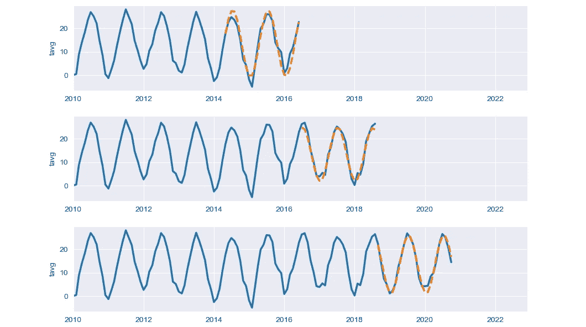

# 可视化 3 种 Sklearn 交叉验证：K-Fold，Shuffle & Split，以及时间序列拆分

> 原文：[`towardsdatascience.com/visualizing-sklearn-cross-validation-k-fold-shuffle-split-and-time-series-split-a13221eb5a56?source=collection_archive---------6-----------------------#2023-07-10`](https://towardsdatascience.com/visualizing-sklearn-cross-validation-k-fold-shuffle-split-and-time-series-split-a13221eb5a56?source=collection_archive---------6-----------------------#2023-07-10)

## 绘制 Sklearn K-Fold、Shuffle & Split 和时间序列拆分交叉验证的过程，并使用 Python 展示验证结果

 [Boriharn K](https://medium.com/@borih.k?source=post_page-----a13221eb5a56--------------------------------)

·

[关注](https://medium.com/m/signin?actionUrl=https%3A%2F%2Fmedium.com%2F_%2Fsubscribe%2Fuser%2Fe20a7f1ba78f&operation=register&redirect=https%3A%2F%2Ftowardsdatascience.com%2Fvisualizing-sklearn-cross-validation-k-fold-shuffle-split-and-time-series-split-a13221eb5a56&user=Boriharn+K&userId=e20a7f1ba78f&source=post_page-e20a7f1ba78f----a13221eb5a56---------------------post_header-----------) 发表于 [Towards Data Science](https://towardsdatascience.com/?source=post_page-----a13221eb5a56--------------------------------) ·11 分钟阅读·2023 年 7 月 10 日

--

图片由 [Ryoji Iwata](https://unsplash.com/ja/@ryoji__iwata?utm_source=medium&utm_medium=referral) 提供，来自 [Unsplash](https://unsplash.com/?utm_source=medium&utm_medium=referral)

## 什么是交叉验证？

基本上，交叉验证是一种用于评估学习算法的统计方法。设置固定数量的折（数据组）来进行分析。这些折将数据分成 2 组：训练集和测试（验证）集，在回合中交叉使用，使每个数据点都能得到验证。

主要目的是测试模型对未用于创建模型的独立数据的预测能力。这也有助于应对如[过拟合](https://en.wikipedia.org/wiki/Overfitting)或[选择偏差](https://en.wikipedia.org/wiki/Selection_bias)等问题。

本文中的交叉验证结果示例。图片由作者提供。

在本文中，我们将使用 Python 可视化来自[Scikit Learn](https://scikit-learn.org/stable/modules/cross_validation.html)库的 3 种交叉验证类型的过程。

+   K 折交叉验证

+   随机洗牌与拆分交叉验证

+   时间序列拆分交叉验证
