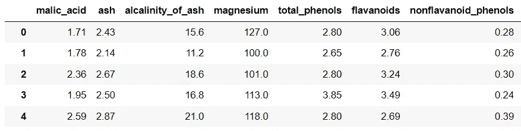

# 可视化 3 种 Sklearn 交叉验证：K-Fold、Shuffle & Split 和 Time Series Split

> 原文：[`towardsdatascience.com/visualizing-sklearn-cross-validation-k-fold-shuffle-split-and-time-series-split-a13221eb5a56`](https://towardsdatascience.com/visualizing-sklearn-cross-validation-k-fold-shuffle-split-and-time-series-split-a13221eb5a56)

## 绘制 Sklearn K-Fold、Shuffle & Split 和 Time Series Split 交叉验证的过程，并使用 Python 显示验证结果

[](https://medium.com/@borih.k?source=post_page-----a13221eb5a56--------------------------------)[](https://towardsdatascience.com/?source=post_page-----a13221eb5a56--------------------------------) [Boriharn K](https://medium.com/@borih.k?source=post_page-----a13221eb5a56--------------------------------)

·发表于 [Towards Data Science](https://towardsdatascience.com/?source=post_page-----a13221eb5a56--------------------------------) ·阅读时间 11 分钟·2023 年 7 月 10 日

--


图片由 [Ryoji Iwata](https://unsplash.com/ja/@ryoji__iwata?utm_source=medium&utm_medium=referral) 在 [Unsplash](https://unsplash.com/?utm_source=medium&utm_medium=referral) 提供

## 什么是交叉验证？

基本上，交叉验证是一种评估学习算法的统计方法。设置一个固定数量的折（数据组）来运行分析。这些折将数据分成 2 个集合：训练集和测试（验证）集，这些集合在轮次中交叉，使每个数据点都能被验证。

主要目的是测试模型预测独立数据的能力，这些数据在模型创建过程中没有使用。它也有助于应对诸如 [过拟合](https://en.wikipedia.org/wiki/Overfitting) 或 [选择偏差](https://en.wikipedia.org/wiki/Selection_bias) 等问题。


这篇文章中的交叉验证结果示例。图片由作者提供。

在本文中，我们将应用 Python 来可视化来自 [Scikit Learn](https://scikit-learn.org/stable/modules/cross_validation.html) 库的 3 种交叉验证类型的过程：

+   K-Fold 交叉验证

+   Shuffle & Split 交叉验证

+   Time Series Split 交叉验证

此外，验证结果也可以绘制出来以表达有见地的信息。

开始吧

# 1\. K-Fold 交叉验证

K-fold 是一种常见的交叉验证方法。首先，将所有数据划分为折。然后，从训练集（k-1 折）创建学习模型，并使用测试集（剩下的折）进行验证。

通常，从 K 折交叉验证中获得的折叠被尽可能均匀地划分。接下来，我们将深入了解 K 折交叉验证的过程。

## 导入库并加载数据

例如，本文将使用[葡萄酒数据集](https://archive.ics.uci.edu/dataset/109/wine)，可以从 Sklearn 库下载。该数据集是[UCI ML 葡萄酒数据](https://archive.ics.uci.edu/dataset/109/wine)的副本，采用[CC BY 4.0](https://creativecommons.org/licenses/by/4.0/)许可证。

总共有 13 种成分在三种类型的葡萄酒中发现。这些属性将用于构建一个用于分类葡萄酒类别的分类模型。

```py
import numpy as np
import pandas as pd
from sklearn.datasets import load_wine

data = load_wine()
X = pd.DataFrame(data=data.data, columns=data.feature_names)
y = pd.DataFrame(data=data.target, columns=['class'])
df = pd.concat([X, y], axis=1)
df.head()
```



下一步的过程可以解释为：我们将首先应用`KFold` [function](https://scikit-learn.org/stable/modules/generated/sklearn.model_selection.KFold.html)来将数据分组为训练集和测试集。可以通过*n_splits*参数指定折数。

然后，将创建支持向量机（[SVMs](https://en.wikipedia.org/wiki/Support_vector_machine)）以在每次迭代中使用`svm` [function](https://scikit-learn.org/stable/modules/svm.html#:~:text=Support%20vector%20machines%20(SVMs)%20are,classification,%20regression%20and%20outliers%20detection.)来分类葡萄酒类别。最后，将使用`score` [function](https://scikit-learn.org/stable/modules/generated/sklearn.svm.SVC.html#sklearn.svm.SVC.score)来衡量模型性能的平均准确性。

这些步骤可以使用 Python 中的 for-loop 函数来完成，如下方代码所示。

```py
from sklearn.model_selection import KFold
from sklearn import svm

kf = KFold(n_splits=10)
# a list for keeping training index, testing index and obtained score
keep = []      
for train, test in kf.split(df):
    X_train = df.iloc[list(train),:-1]
    y_train = df.iloc[list(train),-1]
    X_test = df.iloc[list(test),:-1]
    y_test = df.iloc[list(test),-1]
    clf = svm.SVC(kernel='linear').fit(X_train, y_train)
    score = clf.score(X_test, y_test)

    keep.append([train, test, score])
    print(score)
```


现在我们拥有来自迭代的数据和准确性分数，让我们定义一个函数来创建一个用于绘图的 DataFrame。

```py
def create_df(input_):
    df_train = pd.DataFrame(zip(input_[0], len(input_[0])*['train']),
                            columns = ['index','group'])
    df_test = pd.DataFrame(zip(input_[1], len(input_[1])*['test']),
                           columns = ['index','group'])
    df_comb = pd.concat([df_train, df_test])
    df_comb['score'] = len(df_comb)*[input_[2]]
    return df_comb

#create a DataFrame from the list
keep_df = [create_df(i) for i in keep]
df_in = pd.concat(keep_df)
df_in.reset_index(inplace=True, drop=True)
df_in.head()
```


将迭代的顺序编号分配给 DataFrame。

```py
#create a list of numbers for assigning the n th iteration
list_num = [i[0] + 1 for i in list(enumerate(keep))]
list_num.reverse()

list_it = [len(df)*[i] for i in list_num]
df_kf = pd.DataFrame(sum(list_it,[]), columns=['CV iteration'])
df_kf.reset_index(inplace=True, drop=True)

df_cv = pd.concat([df_in, df_kf], axis=1)
df_cv.head()
```


## 可视化 K 折交叉验证的迭代过程

接下来，我们可以使用[Plotly](https://plotly.com/python/line-and-scatter/)绘制散点图，这是一种有用的数据可视化库，可以用几行代码构建交互式图表。

```py
import plotly.express as px
fig1 = px.scatter(df_cv, x='index', y='CV iteration', color='group',
                  color_discrete_map={'test':'red','train':'blue'})

fig1.show()
```


绘制 K 折交叉验证的迭代过程。图片来源：作者。

从散点图中可以注意到，在每次迭代中，K 折交叉验证中的训练集和测试集在连续的轮次中交叉。

## 可视化 K 折交叉验证结果

让我们继续在图表上绘制准确性分数，以获取更多信息。通过选择仅包含测试集的行来过滤 DataFrame，以获取准确性分数。

```py
df_score = df_cv[df_cv['group'].isin(['test'])]
df_score.head()
```

使用颜色刻度绘制分数值。

```py
import plotly.express as px
fig2 = px.scatter(df_score, x='index', y='CV iteration', color='score',
                  color_continuous_scale=px.colors.sequential.YlOrRd_r,
                  range_color=(0.6,1))
fig2.update_layout(coloraxis_colorbar_x=-0.15)
fig2.show()
```


绘制 K 折交叉验证的结果。图片来源：作者。

绘制分数有助于比较结果。我们可以从图表中看出，SVM 在第 7 次迭代中获得的准确率与其他迭代相比最低。

## **奖励！！**

幸运的是，我们可以使用 Plotly 将散点图合并，以在同一图表中查看过程和验证分数。结果将以交互式图表形式呈现。

```py
import plotly.express as px
fig1 = px.scatter(df_cv, x='index', y='CV iteration', color='group',
                 color_discrete_map={'test':'red','train':'blue'})

fig2 = px.scatter(df_score, x='index', y='CV iteration', color='score',
                  color_continuous_scale=px.colors.sequential.YlOrRd_r,
                  range_color=(0.65,1))
fig2.update_layout(coloraxis_colorbar_x=-0.15)

fig2.add_traces(list(fig1.select_traces()))
fig2.show()
```

哒哒……


合并 K-fold 交叉验证迭代图和结果图。图片由作者提供。

# 2\. Shuffle & Split 交叉验证

正如其名，这种交叉验证技术将首先打乱数据，然后将其分为训练集和测试集。

通过应用 Sklearn 的 `ShuffleSplit` [函数](https://scikit-learn.org/stable/modules/generated/sklearn.model_selection.ShuffleSplit.html)，我们可以设置参数以控制拆分次数和数据集之间的比例。如果需要控制比例大小，这种方法可以作为 K-fold 的替代方案。

```py
from sklearn.model_selection import ShuffleSplit

kf = ShuffleSplit(n_splits=10, test_size=0.25, random_state=15)
keep = []
for train, test in kf.split(df):
    X_train = df.iloc[list(train),:-1]
    y_train = df.iloc[list(train),-1]
    X_test = df.iloc[list(test),:-1]
    y_test = df.iloc[list(test),-1]
    clf = svm.SVC(kernel='linear', C=1).fit(X_train, y_train)
    score = clf.score(X_test, y_test)
    keep.append([train, test, score])
    print(score)
```


由于创建 DataFrame 的过程与之前提到的相同，我们将重复如下所示的代码。

```py
#create a DataFrame from the list
keep_df = [create_df(i) for i in keep]
df_in = pd.concat(keep_df)
df_in.reset_index(inplace=True, drop=True)

#create a list of numbers for assigning the nth iteration 
list_num = [i[0] + 1 for i in list(enumerate(keep))]
list_num.reverse()

list_it = [len(df)*[i] for i in list_num]
df_kf = pd.DataFrame(sum(list_it,[]), columns=['CV iteration'])
df_kf.reset_index(inplace=True, drop=True)

df_cv = pd.concat([df_in, df_kf], axis=1)
df_cv.head()
```


## 可视化 Shuffle & Split 交叉验证迭代

现在我们已经准备好 DataFrame，让我们使用散点图来展示从 shuffle & split 交叉验证中获得的数据集。

```py
import plotly.express as px
fig1 = px.scatter(df_cv, x='index', y='CV iteration', color='group',
                  color_discrete_map={'test':'red','train':'blue'})

fig1.show()
```


绘制 shuffle & split 交叉验证迭代。图片由作者提供。

可以看出，在 shuffle & split 中，数据都被随机分为训练集和测试集，而在 K-fold 交叉验证中，数据被分组到训练集和测试集中。

让我们继续绘制验证结果。

## 可视化 Shuffle & Split 交叉验证结果

过滤 DataFrame 以获取准确率分数。

```py
df_score = df_cv[df_cv['group'].isin(['test'])]
df_score.head()
```


使用颜色尺度绘制结果以表达分数值。

```py
import plotly.express as px
fig2 = px.scatter(df_score, x='index', y='CV iteration', color='score',
                  color_continuous_scale=px.colors.sequential.YlOrRd_r,
                  range_color=(0.6,1))

fig2.update_layout(coloraxis_colorbar_x=-0.15)
fig2.show()
```


绘制 shuffle & split 交叉验证结果。图片由作者提供。

获取的图表效果不好。由于测试集中的数据没有分组，因此难以阅读。我们可以通过更改散点大小来改善结果。这可以通过添加大小参数来完成，如下面的代码所示。

```py
import plotly.express as px
fig2 = px.scatter(df_score, x='index', y='CV iteration',
                  size=[i**20 for i in df_score['score']], color='score',
                  color_continuous_scale=px.colors.sequential.YlOrRd_r,
                  range_color=(0.8,1))
fig2.update_layout(coloraxis_colorbar_x=-0.15)
fig2.update_traces(marker_line_width = 0.2)
fig2.show()
```


使用颜色和大小绘制 shuffle & split 结果以显示分数值。图片由作者提供。

更改散点大小有助于区分验证结果。从上面的结果来看，第 6 次迭代中测试集的 SVM 准确率返回了最低分，而第 1 次和第 3 次迭代返回了最高分。

# 3\. 时间序列分割交叉验证

该技术有助于在滚动基础上验证时间序列模型。时间序列拆分和 K 折的主要区别在于：每次迭代中的前`K`折是训练集，第`K+1`折是测试集。

## 导入库并加载数据

本文将使用气象数据作为示例。我们可以使用`Meteostat` [库](https://github.com/meteostat/meteostat-python)获取某地的温度随时间变化的数据。该库是一个有用的工具，提供了通过 Pandas 简单访问开放天气和气候数据的方式。

气象数据在[CC BY-NC 4.0](https://creativecommons.org/licenses/by-nc/4.0/deed.en_GB)许可证下使用。例如，让我们获取 2010–2022 年间纽约市的平均温度。

```py
from datetime import datetime
import matplotlib.pyplot as plt
import seaborn as sns
from meteostat import Point, Daily

# set date and GPS location
start = datetime(2010, 1, 1)
end = datetime(2022, 12, 31)
location = Point(40.75, -73.98)

data = Daily(location, start, end)
data = data.fetch()
data.head()
```


用折线图绘制平均温度数据。

```py
plt.figure(figsize=(10,5))
sns.set_style('darkgrid')
sns.lineplot(data=data, x="time", y="tavg")
plt.show()
```


折线图显示了纽约市 2010–2022 年的每日平均温度。图片作者提供。

将日期时间列分组以获得平均月温度，以便后续进行时间序列模型分析。

```py
# add a 'month-year' column 
data.reset_index(inplace=True)
data['my'] = [str(i)[0:7] for i in data['time']]

# group by to get average monthly data
data_g = data.groupby(['my']).mean()
data_g.reset_index(inplace=True)
data_g['my'] = data_g['my'].astype('datetime64[ns]')
data_g.set_index('my', inplace=True)
data_g.head()
```


现在进入交叉验证部分。我们将使用`TimeSeriesSplit` [函数](https://scikit-learn.org/stable/modules/generated/sklearn.model_selection.TimeSeriesSplit.html)来自 Sklearn 库进行时间序列拆分交叉验证。可以指定***n_splits***参数来设置拆分的数量。

```py
from sklearn.model_selection import TimeSeriesSplit
tscv = TimeSeriesSplit(n_splits=5)

keep = []
for train_p, test_p in tscv.split(data_g.tavg):
    keep.append([train_p, test_p])

# create DataFrame from each TimeSeriesSplit and keep them in a list
keep_df = []
for i in keep:
    df_train = pd.DataFrame(zip(i[0], ['train']*len(i[0])),
                            columns=['index','group'])
    df_test = pd.DataFrame(zip(i[1], ['test']*len(i[1])),
                           columns=['index','group'])
    df = pd.concat([df_train, df_test], axis=0)
    keep_df.append(df)
```

为每次迭代分配行号以进行绘图。

```py
list_num = [i[0] for i in list(enumerate(keep))]
list_num.reverse()
list_r = []
for i,j in zip(keep_df, list_num):
    i['k_fold']=[j]*len(i)
    list_r.append(i)

df_p = pd.concat(list_r, axis=0)
df_p.head()
```


## 可视化时间序列拆分交叉验证迭代

创建一个散点图，以显示时间序列拆分交叉验证的迭代。

```py
import plotly.express as px
fig = px.scatter(df_p, x='index', y='k_fold', color='group',
                 color_discrete_map={'test':'red','train':'blue'})

fig.update_layout(yaxis_showticklabels=False)
fig.show()
```


绘制时间序列拆分交叉验证迭代。图片作者提供。

尽管上述可视化可以展示过程，但气象数据并不是这条直线。接下来，我们将把实际数据和预测结果绘制在图表中。

## 可视化时间序列拆分交叉验证结果

对于交叉验证，我们可以使用自回归积分滑动平均（[ARIMA](https://en.wikipedia.org/wiki/Autoregressive_integrated_moving_average)）模型，这是一种基于历史时间序列数据进行预测的强大方法。本文中的 ARIMA 模型将使用`pmdarima` [库](https://pypi.org/project/pmdarima/)创建。

该过程可以解释为：在每次迭代中，ARIMA 模型是从训练集中的数据建立的。之后，将预测结果和测试集中的数据绘制在同一图表中以比较结果。

```py
import pmdarima as pm

for train_p, test_p in tscv.split(data_g.tavg):
    train = np.array(list(data_g.iloc[train_p,:]['tavg']))
    test = np.array(list(data_g.iloc[test_p,:]['tavg']))
    # fiting the model
    model = pm.auto_arima(train, seasonal=True, m=3)
    # forecasting
    forecasts = model.predict(len(test))

    df_tr = pd.DataFrame(data_g.iloc[train_p,:]['tavg'])
    df_tr.reset_index(inplace=True)
    df_ts = pd.DataFrame(data_g.iloc[test_p,:]['tavg'])
    df_ts.reset_index(inplace=True)
    df_ts['forecast'] = forecasts
    df_c = pd.concat([df_tr, df_ts], axis=0)
    df_index = pd.DataFrame(data_g.index)
    df_p = pd.merge(df_index, df_c, on='my', how='left')

    # Visualize the forecasts
    fig, ax = plt.subplots(figsize=(10.6,2))
    ax.set(xlim=(data_g.index[0], data_g.index[-1]))
    sns.lineplot(x=df_p.my, y=df_p.tavg, lw=2)
    sns.lineplot(x=df_p.my, y=df_p.forecast, lw=2, linestyle='dashed')
    plt.show()
```

瞧！


绘制时间序列拆分交叉验证与 ARIMA 预测结果。图片作者提供。

从图表中可以看出，ARIMA 模型在迭代过程中得到了改进。尽管第一次预测与测试集中的数据不完全匹配（重叠），但后续预测会越来越好。

## 摘要

交叉验证技术有助于验证学习算法。其主要概念是将数据分为训练集和测试集。然后，使用训练集创建模型，并使用测试集对模型进行验证。

这些方法也可以用来标记过拟合或选择偏差。

显然，交叉验证的类型比本文中提到的要多。顺便说一下，主要概念是相同的，它们都具有相同的目的：评估模型。

感谢阅读。

这里是一些你可能会感兴趣的文章：

+   可视化多重共线性对多重回归模型的影响 ([link](https://medium.com/towards-data-science/visualizing-the-effect-of-multicollinearity-on-multiple-regression-model-8f323ef542a9))

+   8 个用 Python 处理多时间序列数据的可视化 (link)

+   7 个用 Python 表达排名随时间变化的可视化 (link)

+   9 个用 Python 显示比例或百分比而不是饼图的可视化 (link)

+   9 个用 Python 制作的比条形图更引人注目的可视化 (link)

## 参考文献

+   Aeberhard, Stefan 和 Forina, M. （1991 年）。*Wine.* UCI 机器学习库。 [`doi.org/10.24432/C5PC7J`](https://doi.org/10.24432/C5PC7J)。

+   *交叉验证：评估估算器性能*。Scikit. （无日期）。 [`scikit-learn.org/stable/modules/cross_validation.html#cross-validation-iterators`](https://scikit-learn.org/stable/modules/cross_validation.html#cross-validation-iterators)

+   *机器学习中的交叉验证 — Javatpoint*。 [www.javatpoint.com.](http://www.javatpoint.com.) （无日期）。 [`www.javatpoint.com/cross-validation-in-machine-learning`](https://www.javatpoint.com/cross-validation-in-machine-learning)

+   Refaeilzadeh, P., Tang, L., Liu, H. （2009 年）。*交叉验证*。收录于：LIU, L., ÖZSU, M.T.（编辑）《数据库系统百科全书》。施普林格，波士顿，马萨诸塞州。 [`doi.org/10.1007/978-0-387-39940-9_565`](https://doi.org/10.1007/978-0-387-39940-9_565)

+   维基媒体基金会。（2023 年 6 月 17 日）。*交叉验证（统计学）*。维基百科。 [`en.wikipedia.org/wiki/Cross-validation_(statistics)`](https://en.wikipedia.org/wiki/Cross-validation_(statistics))

+   Cochrane, C. （2018 年 5 月 19 日）。*时间序列嵌套交叉验证*。Medium。 `towardsdatascience.com/time-series-nested-cross-validation-76adba623eb9`

+   Meteostat。（无日期）。*Meteostat/meteostat-python: 使用 Python 访问和分析历史天气与气候数据*。GitHub。[`github.com/meteostat/meteostat-python`](https://github.com/meteostat/meteostat-python)

+   *PMDARIMA*。PyPI。（无日期）。[`pypi.org/project/pmdarima`](https://pypi.org/project/pmdarima)
