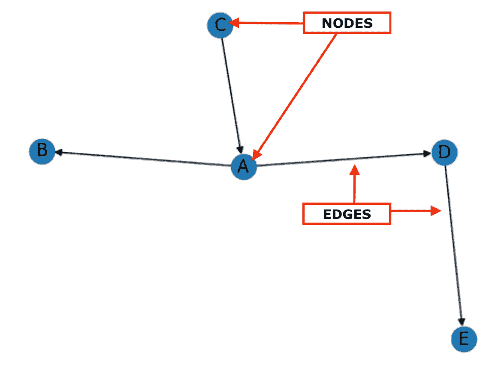

# 通过 Python 的 NetworkX 库可视化社交网络以获取更好的洞察：分析和映射社交关系

> 原文：[`towardsdatascience.com/visualizing-social-networks-for-better-insights-analyzing-and-mapping-social-relationships-with-efeb82ab853e`](https://towardsdatascience.com/visualizing-social-networks-for-better-insights-analyzing-and-mapping-social-relationships-with-efeb82ab853e)

## 初学者使用 Python 的 NetworkX 库进行社交网络分析的指南

[](https://christineegan42.medium.com/?source=post_page-----efeb82ab853e--------------------------------)[](https://towardsdatascience.com/?source=post_page-----efeb82ab853e--------------------------------) [Christine Egan](https://christineegan42.medium.com/?source=post_page-----efeb82ab853e--------------------------------)

·发表于 [Towards Data Science](https://towardsdatascience.com/?source=post_page-----efeb82ab853e--------------------------------) ·阅读时长 6 分钟·2023 年 5 月 20 日

--

在侦探节目中，[包含相关证据的软木板](https://tvtropes.org/pmwiki/pmwiki.php/Main/StringTheory)常常被描绘为一种方法，帮助调查人员可视化和追踪调查中个人和事件之间的联系。红色线条用于将不同的节点（通常用照片或便条表示）物理连接在一起，显示它们之间的关系。


图片由 [Volodymyr Hryshchenko](https://unsplash.com/@lunarts?utm_source=unsplash&utm_medium=referral&utm_content=creditCopyText) 提供，来源于 [Unsplash](https://unsplash.com/s/photos/investigation?utm_source=unsplash&utm_medium=referral&utm_content=creditCopyText)

这种普遍的情节被一些人描述为 [“线索理论”](https://tvtropes.org/pmwiki/pmwiki.php/Main/StringTheory)（不是那个 [弦理论](https://en.wikipedia.org/wiki/String_theory)），有些人将其称为 [“疯狂墙”](https://www.esquire.com/uk/culture/film/news/a7703/detective-show-crazy-walls/) 或 [“线索板”](https://slate.com/news-and-politics/2022/02/fbi-crazy-stringboard-recruiting-campaign.html)。在网络理论领域，这种分析人与组织或文件之间链接和联系的技术被称为 [链接分析](https://doc.arcgis.com/en/insights/latest/analyze/link-analysis.htm)，并且在执法、欺诈检测、社会学研究以及其他各种背景下已经使用了一个多世纪。

## 链接分析与社交网络分析

链接分析指的是分析任何类型实体之间的链接（或关系）的过程。这可以包括分析网页、电子邮件、金融交易或任何其他数据类型中实体之间的关系。社会网络分析是一种专注于人群及其相互关系的特定链接分析。

社会网络分析（SNA）之所以成为一个强大的工具，是因为能够在图中可视化这些关系，使用节点来表示个体，边来表示它们之间的连接。可视化个体和关系使我们能够更容易地直观理解社会影响的动态、社会群体的形成以及群体和个体之间信息的流动。

> 我们都像一张看不见的网那样相互连接。
> 
> — [出租车司机的智慧](https://archive.org/details/taxidriverwisdom0000unse)（1996）

## **使用 Python 和 NetworkX 进行社会网络分析**

[NetworkX](https://pypi.org/project/networkx/)是一个用于创建、操作和研究复杂网络的 Python 库。它可以处理拥有数百万个节点和边的网络，并提供生成随机网络、计算网络度量和可视化网络结构的功能。它还拥有广泛的社区检测、[链接预测](https://networkx.org/documentation/stable/reference/algorithms/link_prediction.html)和[网络可视化](https://networkx.org/documentation/stable/auto_examples/index.html)算法。尽管 NetworkX 功能强大，Python 用户会发现它易于使用和直观。 

## 社会网络分析的基本概念

那么我们可以使用什么概念来分析社会网络呢？一个好的起点是*节点*和*边*，它们是网络的基本组成部分。

**节点**代表网络中的个体，而**边**构成个体之间的关系。



一个节点和边标记的图示例。

为了演示，让我们用 Python 和 NetworkX 构建一个简单的网络，表示[Billy Corgan](https://en.wikipedia.org/wiki/Billy_Corgan)与[Smashing Pumpkins](https://smashingpumpkins.com/)其他创始成员之间的对称关系。

这将输出一个看起来像这样的网络图：


## **用中心性描述社会网络**

用于描述网络中个体和关系的一个标准是*中心性*。**中心性**是衡量网络中节点重要性或影响力的指标。中心性的两个衡量标准包括*度中心性*和*介数中心性*。

**度中心性** 是基于一个节点的连接数来衡量网络中节点重要性的指标。度中心性高的节点在网络中被认为更具影响力或更为中心。度中心性可以通过将节点的连接数除以网络中最大可能的连接数来计算。网络中一个节点的度中心性为 1 意味着该节点与网络中的所有其他节点直接连接。

**中介中心性** 衡量了每个节点在网络中的重要性，基于它出现在其他节点对之间最短路径上的频率。中介中心性允许我们评估网络中哪些节点被认为更具影响力，因为它们在连接网络的不同部分中发挥了关键作用。

中介中心性可以通过计算通过一个节点的最短路径数量并除以网络中所有最短路径的总数来计算。

## 使用 NetworkX 计算中心性

在下面的代码中，我们演示了如何使用我们用 NetworkX 构建的图对象来计算网络中节点的度中心性和中介中心性。

在下面的代码中，我们演示了如何使用我们用 NetworkX 构建的图对象来计算网络中节点的度中心性和中介中心性。在这段代码中，我们生成了一个图对象 `nx`，它表示 Billy Corgan 与 Smashing Pumpkins 成员之间的对称关系。然后，使用 `.degree_centrality` 方法生成一个字典，其中每个节点及其度中心性作为键值对存储。我们使用 `.betweenness_centrality` 方法重复这个过程，生成一个包含 `nx` 中每个节点及其中介中心性计算的字典。结果如下表：

```py
 node                degree        betweenness        
 ------- ------------------- ------------- ------------
     0    Billy Corgan          1.000000    1.0  
     1    James Iha             0.333333    0.0  
     2    D'arcy Wretzky        0.333333    0.0  
     3    Jimmy Chamberlin      0.333333    0.0 
```

那么我们如何解释这些结果呢？

## 解释度中心性

Billy Corgan 的度中心性为 1，这意味着他与其他乐队成员有最大数量的连接。如果你记得的话，这与我们的输入和我们构建网络以展示 Billy Corgan 和每个乐队成员之间的对称关系的方式是一致的。由于 Billy Corgan 出现在每个元组中，他将与每个其他节点都有一个链接。

另一方面，其他乐队成员只出现了一次。那么我们如何将度中心性公式应用于其他乐队成员以得到 0.333 的值呢？

作为回顾，度中心性是这样计算的：

`degree(node) / (total nodes — 1)`

由于度数是指与节点相连的边的数量，每个与 Billy Corgan 通过边连接的乐队成员将增加一个度数。

如果 `degree(node) = 3` 且 `(total nodes — 1) = (4–1) = 3`，那么 `degree centrality = 3/3 = 1`。

我们可以以类似的方式应用于每个乐队成员。由于他们每个人的度数都是 1，那么 `1/3 = .333`。

## 解读中介中心性

节点的中介中心性计算为所有最短路径中经过该节点的部分的总和，除以这些节点对之间的最短路径总数。

在我们的例子中，这并不是特别有意义，因为我们有一个小型网络，而且我们仅仅可视化了比利与 Smashing Pumpkins 乐队成员之间的关系，而没有涉及与其他乐队成员及其他可能参与的乐队的关系。

那么我们是如何得出比利·科根在这种情况下的中介中心性呢？一个节点的中介中心性为 1 意味着该节点位于网络中所有其他节点对之间的所有最短路径上。换句话说，它作为网络中不同部分之间的关键桥梁或连接点。


[比利·科根与 The Smashing Pumpkins 2008–02–18](https://commons.wikimedia.org/wiki/Category:The_Smashing_Pumpkins#/media/File:Billy_Corgan_with_The_Smashing_Pumpkins_2008-02-18.jpg); [CC BY 2.0](https://creativecommons.org/licenses/by/2.0)

当一个节点的中介中心性为 1 时，它意味着在网络内对信息或资源流动的影响和控制程度很高。任何通过网络传递的信息或互动很可能会经过该节点。因此，它可以被视为网络通信中的关键瓶颈或中介。

节点的**中介中心性**高通常被认为在网络动态中至关重要，因为它们可以控制信息传播，影响决策过程，或作为网络内高效沟通的关键连接点。

需要注意的是，中介中心性的解读应考虑分析网络的背景和特定特征。中介中心性为 1 的意义可能因网络的大小、结构和目的而异。在即将到来的教程中，我们将扩展比利的网络，探索这如何改变他的中介中心性。

🤖 Christine Egan | [Medium](https://medium.com/@christineegan42) | [LinkedIn](https://www.linkedin.com/in/christineegan42/) | [GitHub](https://github.com/christine-egan42)
