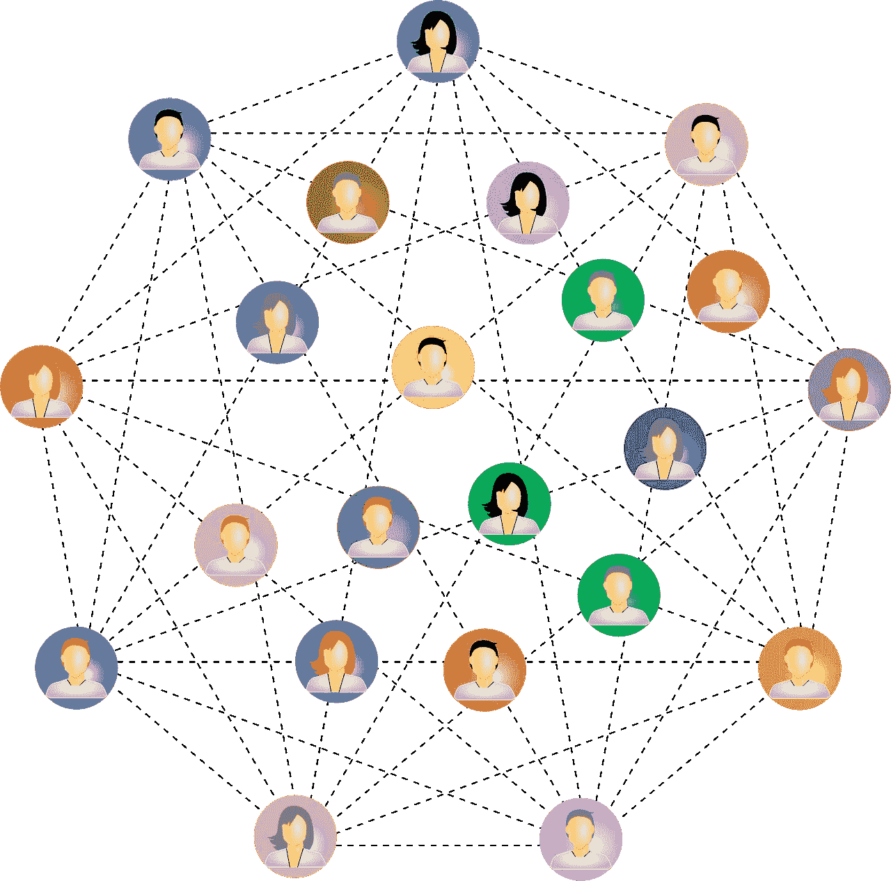
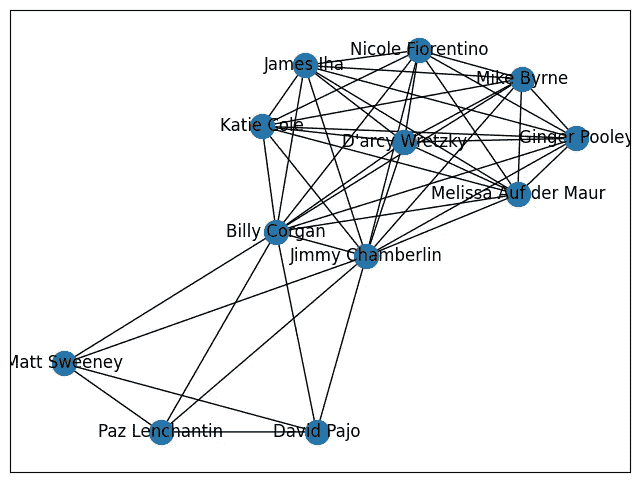

# 更好洞察的社会网络可视化：使用 Python 的 NetworkX 库分析和映射社会关系 — 第二部分

> 原文：[`towardsdatascience.com/visualizing-social-networks-for-better-insights-analyzing-and-mapping-social-relationships-with-f4a9cf6b6d57`](https://towardsdatascience.com/visualizing-social-networks-for-better-insights-analyzing-and-mapping-social-relationships-with-f4a9cf6b6d57)

## 继续介绍使用 Python 的 NetworkX 库进行社会网络分析的初学者指南

[](https://christineegan42.medium.com/?source=post_page-----f4a9cf6b6d57--------------------------------)[](https://towardsdatascience.com/?source=post_page-----f4a9cf6b6d57--------------------------------) [Christine Egan](https://christineegan42.medium.com/?source=post_page-----f4a9cf6b6d57--------------------------------)

·发布于 [数据科学前沿](https://towardsdatascience.com/?source=post_page-----f4a9cf6b6d57--------------------------------) ·阅读时间 6 分钟·2023 年 6 月 10 日

--

在第一部分，我们探讨了链接分析，特别是社会网络分析 在调查和理解个体与实体之间的关系时。社会网络分析（SNA）是一种特定类型的链接分析，专注于人群和群体及其关系。我们回顾了 SNA 的基本概念，包括节点（代表个体）和边（代表个体之间的连接）。然后，我们讨论了如何利用度中心性和中介中心性等指标，通过比利·科根及其与 Smashing Pumpkins 创始成员的关系这一简单示例来理解社会影响、群体形成和信息流。



图片由 [Gordon Johnson](https://pixabay.com/users/gdj-1086657/?utm_source=link-attribution&utm_medium=referral&utm_campaign=image&utm_content=2099068) 提供，自 [Pixabay](https://pixabay.com//?utm_source=link-attribution&utm_medium=referral&utm_campaign=image&utm_content=2099068)

在那个例子中，我们保持了网络的小规模和简单性。在本教程中，我们将继续使用 Python 和 NetworkX 来研究比利·科根的影响范围。我们还将扩展比利·科根的网络，使其更复杂，并加深对**度中心性**和**中介中心性**的理解。在处理这个例子时，我们将讨论上下文，以及如何利用**领域知识**来最大化社会网络分析的收益。

## 上下文中的社会网络分析

领域知识和研究是社会网络分析的重要组成部分，因为它们提供了必要的背景、理论框架，以及对塑造社会网络的社会和文化因素的理解。没有这种理解，你有可能得出误导性或不正确的结论，未能准确捕捉社会网络数据的复杂性和细微差别。

***在你开始之前……***

1.  *你对 Python 有基本的了解吗？如果没有，* [*从这里开始*](https://medium.com/towards-data-science/virtual-environments-for-python-data-science-projects-on-mac-os-big-sur-with-pyenv-and-virtualenv-60db5516bf06)*。*

1.  *你是否熟悉社会网络分析中的基本概念，比如节点和边，或者中心性等指标？如果没有，* *从这里开始**。*

## 收集数据以分析社会网络

那么，我们需要什么样的数据来开始调查比利·科根的影响力范围？让我们从 Smashing Pumpkins 的所有乐队伙伴开始，无论是现任还是前任。

使用维基百科，我们可以获得自 1988 年以来在 Smashing Pumpkins 中演奏的所有音乐家的一个相当可靠的列表。顺便问一下——你知道[比利·科根（短暂地）有另一个叫 Zwan 的乐队](https://en.wikipedia.org/wiki/Zwan)在[早期的零年代](https://www.urbandictionary.com/define.php?term=The+Aughties)吗？剧透警告，这并没有一个好的结局。让我们也列出这些人。

然后，打开你喜欢的 IDE，导入相关库，并创建两个列表——一个用于 Smashing Pumpkins，一个用于 Zwan。

## 描述社会网络中的关系

我们的下一步任务是构建一些元组列表，以表示比利·科根与这些乐队成员之间的关系。我们还需要考虑每个乐队成员与所有其他乐队成员之间的关系。

在图论中，这种关系被称为***对称的***。如果比利与吉米在一个乐队中，那么吉米也在一个乐队中与比利。

为了实现这一点，我们可以使用 Python 构建一个简单的函数，该函数将接收每个乐队成员列表，并返回所有可能的配对组合。

然后，我们可以应用到每个列表，并结合结果，创建一个包含 Zwan 和 Smashing Pumpkins 所有乐队成员之间关系的元组列表。

输出将类似于以下内容：

```py
[('Billy Corgan', 'James Iha'),
 ('Billy Corgan', 'Jimmy Chamberlin'),
 ('Billy Corgan', 'Katie Cole'),
 ('Billy Corgan', "D'arcy Wretzky"),
 ('Billy Corgan', 'Melissa Auf der Maur'),
 ('Billy Corgan', 'Ginger Pooley'),
 ('Billy Corgan', 'Mike Byrne'),
 ('Billy Corgan', 'Nicole Fiorentino'),
 ('James Iha', 'Jimmy Chamberlin'),
 ('James Iha', 'Katie Cole'),
 ('James Iha', "D'arcy Wretzky"),
 ('James Iha', 'Melissa Auf der Maur'),
 ('James Iha', 'Ginger Pooley'),
 ('James Iha', 'Mike Byrne'),
 ('James Iha', 'Nicole Fiorentino'),
 ('Jimmy Chamberlin', 'Katie Cole'),
 ('Jimmy Chamberlin', "D'arcy Wretzky"),
 ('Jimmy Chamberlin', 'Melissa Auf der Maur'),
 ('Jimmy Chamberlin', 'Ginger Pooley'),
 ('Jimmy Chamberlin', 'Mike Byrne'),
 ('Jimmy Chamberlin', 'Nicole Fiorentino'),
 ('Katie Cole', "D'arcy Wretzky"),
 ('Katie Cole', 'Melissa Auf der Maur'),
 ('Katie Cole', 'Ginger Pooley'),
 ('Katie Cole', 'Mike Byrne'),
 ('Katie Cole', 'Nicole Fiorentino'),
 ("D'arcy Wretzky", 'Melissa Auf der Maur'),
 ("D'arcy Wretzky", 'Ginger Pooley'),
 ("D'arcy Wretzky", 'Mike Byrne'),
 ("D'arcy Wretzky", 'Nicole Fiorentino'),
 ('Melissa Auf der Maur', 'Ginger Pooley'),
 ('Melissa Auf der Maur', 'Mike Byrne'),
 ('Melissa Auf der Maur', 'Nicole Fiorentino'),
 ('Ginger Pooley', 'Mike Byrne'),
 ('Ginger Pooley', 'Nicole Fiorentino'),
 ('Mike Byrne', 'Nicole Fiorentino'),
 ('Billy Corgan', 'Jimmy Chamberlin'),
 ('Billy Corgan', 'Paz Lenchantin'),
 ('Billy Corgan', 'David Pajo'),
 ('Billy Corgan', 'Matt Sweeney'),
 ('Jimmy Chamberlin', 'Paz Lenchantin'),
 ('Jimmy Chamberlin', 'David Pajo'),
 ('Jimmy Chamberlin', 'Matt Sweeney'),
 ('Paz Lenchantin', 'David Pajo'),
 ('Paz Lenchantin', 'Matt Sweeney'),
 ('David Pajo', 'Matt Sweeney')]
```

接下来，我们可以遍历元组列表，以使用 Network X 生成图形。

这将生成以下图形：



让我们讨论从这个图中可以提取出的两个关键观察点。

1.  Smashing Pumpkins 乐队成员出现在右上角的位置比 Zwan 的成员出现在左下角的地方要复杂，因为 Zwan 的成员较少。

1.  比利·科根和吉米·钱伯林出现在中心位置，因为他们在两个乐队中都出现过。

接下来，让我们考虑这些观察结果如何反映在度中心性和中介中心性中。

## 使用 NetworkX 的度中心性和中介中心性

在第一部分中，我们计算了比利·科根和 Smashing Pumpkins 的创始成员的度中心性和中介中心性。为此，我们调用了 NetworkX 中的两种方法，并编写了一个简单的脚本来执行它们。这次，由于我们已经组装了图形，我们可以直接输入图形来计算中心性指标。

这将生成以下输出：

让我们讨论如何解读这些结果。

***这张表告诉我们所有乐队成员的度中心性如何？***

1\. 比利·科根的度中心性得分为 1.000，表示他在 Smashing Pumpkins 和 Zwan 中有最多的联系或合作。他与两个乐队的每个其他成员都有直接联系。

2. [吉米·查伯林](https://twitter.com/jccomplex)的度中心性得分也是 1.000，这表明他和比利·科根一样，与两个乐队的每个成员都有直接联系。

3\. James Iha、Katie Cole、D’arcy Wretzky、Melissa Auf der Maur、Ginger Pooley、Mike Byrne、Nicole Fiorentino、Paz Lenchantin、David Pajo 和 Matt Sweeney 的度中心性得分均为 0.727273，这表明他们在乐队中的联系或合作水平相似。


Jimmy Chamberlin, 约 2014 年 — 来自芝加哥的 swimfinfan，CC BY-SA 2.0 <[`creativecommons.org/licenses/by-sa/2.0`](https://creativecommons.org/licenses/by-sa/2.0)>, 通过维基共享资源

***这张表告诉我们所有乐队成员的中介中心性如何？***

1\. 比利·科根和吉米·查伯林的中介中心性得分也最高，为 0.190909，表明他们可能是乐队成员之间在沟通或合作方面的重要中介或桥梁。

2\. 除比利·科根和吉米·查伯林外，乐队成员的中介中心性得分均为零，这表明他们在乐队成员之间的桥接连接中并不重要。

## 通过领域知识加强推断

虽然中心性指标提供了我们可以推断的数据点，但这些推断仅基于表中提供的信息。

要对比利·科根的影响范围得出更具体的结论，你需要了解九十年代的另类音乐及音乐家，以便对这些乐队成员之间的动态提出完整的假设。

**所以如果你是九十年代音乐爱好者，请在评论中告诉我你对这些结果的看法。务必关注第三部分，在那里我们将扩展网络，以便探讨紧密中心性、聚类和社交网络分析中的社区。**

如果你想要[这个教程的完全注释 Python 脚本](https://github.com/christine-egan42/sna-billy-corgan/blob/main/SNA-2-Centrality-Measures.ipynb)，请访问我的[GitHub](https://github.com/christine-egan42)!

👩🏻‍💻 Christine Egan | [medium](https://christineegan42.medium.com/) | [github](https://github.com/christine-egan42) | [linkedin](https://www.linkedin.com/in/christineegan42/)
