# 可视化多重共线性对多重回归模型的影响

> 原文：[`towardsdatascience.com/visualizing-the-effect-of-multicollinearity-on-multiple-regression-model-8f323ef542a9`](https://towardsdatascience.com/visualizing-the-effect-of-multicollinearity-on-multiple-regression-model-8f323ef542a9)

## 使用 Python 进行数据可视化，解释多重共线性对多重回归的影响

[](https://medium.com/@borih.k?source=post_page-----8f323ef542a9--------------------------------)[](https://towardsdatascience.com/?source=post_page-----8f323ef542a9--------------------------------) [Boriharn K](https://medium.com/@borih.k?source=post_page-----8f323ef542a9--------------------------------)

·发布在[Towards Data Science](https://towardsdatascience.com/?source=post_page-----8f323ef542a9--------------------------------) ·11 分钟阅读·2023 年 6 月 12 日

--


图片由[Alex](https://unsplash.com/@brizmaker?utm_source=medium&utm_medium=referral)提供，发布在[Unsplash](https://unsplash.com/?utm_source=medium&utm_medium=referral)上

## **什么是多重共线性？**

在多重回归中，多重共线性发生在预测变量（自变量）与模型中的一个或多个其他预测变量高度相关时。

## **为什么这很重要？**

```py
### Multiple regression equation:

Y = β₀ + β₁X₁ + β₂X₂ + ... + βᵢXᵢ + ε
```

理论上，如我们在方程中所见，多重回归使用多个预测变量来预测因变量的值。

顺便提一下，多重回归通过确定在保持其他预测变量不变的情况下，预测变量单位均值变化对因变量的影响来工作。

如果一个预测变量与其他变量高度相关，那么在不改变其他变量的情况下很难改变它。

## **多重共线性的影响**

简单来说，多重共线性会影响模型系数。数据的微小变化可能会影响系数估计。因此，解释每个自变量的作用变得困难。

本文将通过数据可视化解释和展示这一现象。在开始之前，让我们讨论如何判断模型是否存在多重共线性。

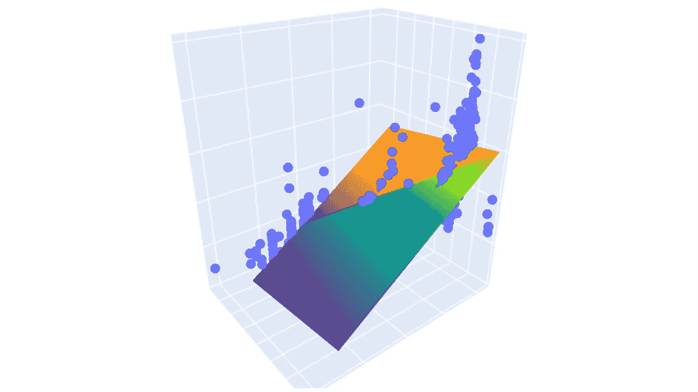

本文中的一个结果示例。图像来源：作者。

## **如何检测多重共线性？**

```py
### VIF (Variance Inflation Factor) equation:

VIF = 1/(1 - Rᵢ²)
```

我们可以使用 VIF（方差膨胀因子）来估计由于多重共线性而导致的回归系数方差的膨胀程度。

计算是通过将一个预测变量与其他预测变量回归以获得 R 平方值完成的。然后，获得的 R 平方值将用于计算 VIF 值。方程中的'i'代表预测变量。

可以使用以下标准来解释结果：

```py
#1 : not correlated
#1–5 : moderately correlated
#> 5 : highly correlated
```

现在我们完成了解释部分。让我们继续到模型创建部分。

# 多重回归模型

开始为绘图准备多重回归模型。首先，我们将从数据集中创建两个模型；一个具有中等相关变量，另一个具有高度相关变量。

然后我们将稍微修改数据，看看哪个模型会受到更大的影响。首先导入库。

```py
import numpy as np
import pandas as pd
import matplotlib.pyplot as plt
import seaborn as sns

%matplotlib inline
```

## 获取数据

例如，这篇文章将使用[*汽车数据*](https://data.world/dataman-udit/cars-data)数据集，该数据集具有[公有领域](https://en.wikipedia.org/wiki/Public_domain)许可。可以通过[Seaborn](https://seaborn.pydata.org/generated/seaborn.load_dataset.html)库的`seaborn.load_dataset()`函数自由直接下载。

数据集包含 1970 年至 1982 年间在美国、欧洲和日本的 392 辆汽车的价格和特征。有关数据集的更多信息可以在这里找到：[链接](https://data.world/dataman-udit/cars-data)。

```py
data = sns.load_dataset('mpg')
data.dropna(inplace=True)       #remove null rows
data.head()
```

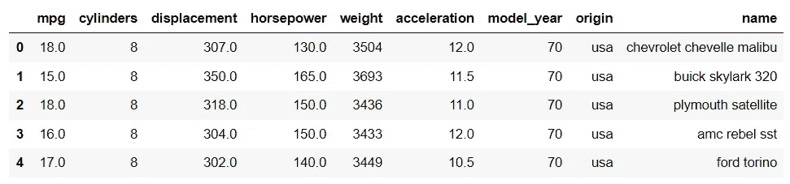

进行探索性数据分析以了解数据集总是一个好主意。

```py
data.describe()
```

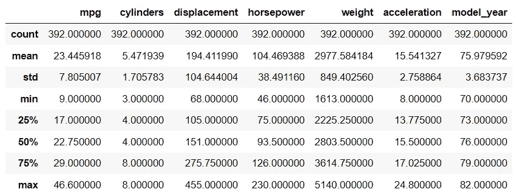

列中的范围（最大值 - 最小值）差异较大。因此，执行[标准化](https://scikit-learn.org/stable/modules/generated/sklearn.preprocessing.StandardScaler.html)有助于后续解释系数。

```py
data = data.iloc[:,0:-2]    # select columns

from sklearn.preprocessing import StandardScaler
scaler = StandardScaler()
df_s = scaler.fit_transform(data)
df = pd.DataFrame(df_s, columns=data.columns)
df.head()
```

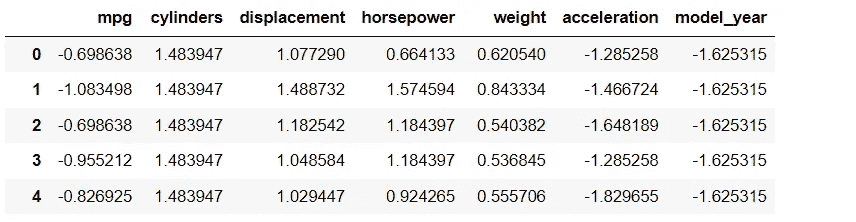

接下来绘制一个[热图](https://seaborn.pydata.org/generated/seaborn.heatmap.html)以展示变量之间的相关性。

```py
plt.figure(figsize=(9, 6))
sns.heatmap(df.corr(), cmap='coolwarm', annot=True)
plt.show()
```

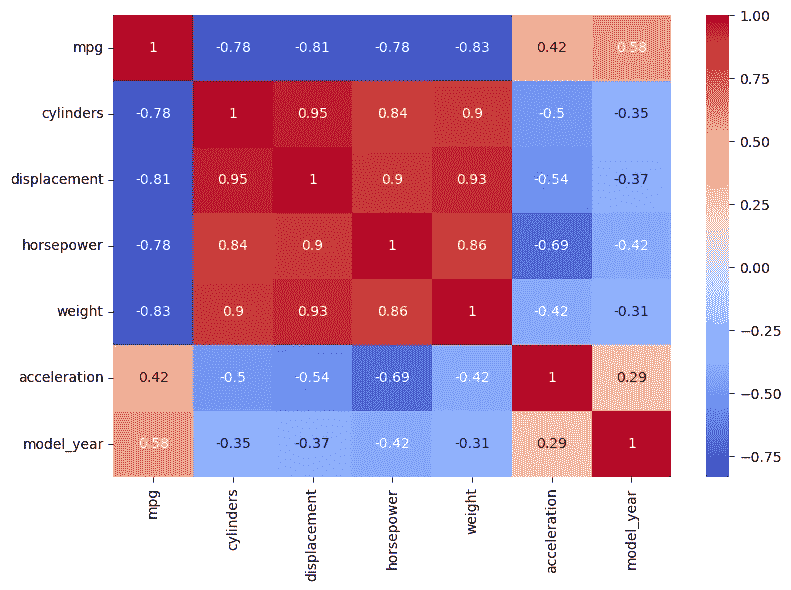

结果显示有些变量与其他变量高度相关。如果每个预测变量都被放入多重回归模型来预测'mpg'值，多重共线性将影响模型。

## 计算 VIF 值

这可以通过计算[Statsmodels](https://www.statsmodels.org/dev/generated/statsmodels.stats.outliers_influence.variance_inflation_factor.html)库中的 VIF 值来快速证明。

```py
from statsmodels.stats.outliers_influence import variance_inflation_factor as vif

vif_data = pd.DataFrame()
vif_data["feature"] = df.columns
# calculating VIF for each feature
vif_data["VIF"] = [vif(df.values, i) for i in range(len(df.columns))]

print(vif_data)
```

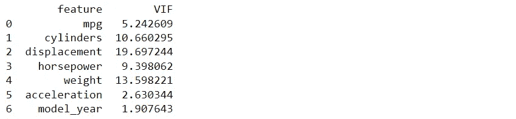

一些 VIF 值相当高（> 5），可以解释为高度相关。如果我们直接将每个预测变量放入多重回归模型中，该模型可能会遭受多重共线性问题。

接下来，将仅选择一些预测变量。这篇文章将使用两个模型：一个包含中等相关的变量，另一个包含高度相关的变量。

第一个多重回归模型使用'气缸数'和'加速度'来预测'mpg'，而第二个模型使用'气缸数'和'位移'。让我们再次计算 VIF 值。

```py
df1 = df[['mpg', 'cylinders', 'acceleration']]
df2 = df[['mpg', 'cylinders', 'displacement']]

# VIF dataframe1
vif_data1 = pd.DataFrame()
vif_data1['feature'] = df1.columns
vif_data1['VIF'] = [vif(df1.values, i) for i in range(len(df1.columns))]
print('model 1')
print(vif_data1)

# VIF dataframe2
vif_data2 = pd.DataFrame()
vif_data2['feature'] = df2.columns
vif_data2['VIF'] = [vif(df2.values, i) for i in range(len(df2.columns))]
print('model 2')  
print(vif_data2)
```

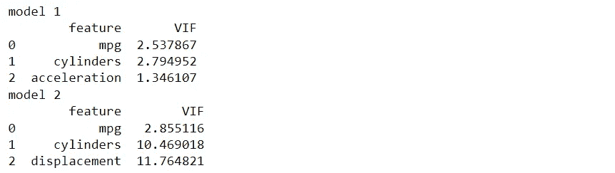

两个模型的 VIF 值。图片由作者提供。

这两个模型之间的区别在于将变量从'加速度'改为'位移'。然而，可以注意到第一个模型中的 VIF 值都没有超过 5，而第二个模型的 VIF 值则相对较高，超过了 10。

## 创建多重回归模型

我们将使用[OLS](http://statsmodels.regression.linear_model.OLS)函数来自 statsmodels 库创建一个多重回归模型。

```py
import statsmodels.api as sm
y1 = df1[['mpg']]
X1 = df1[['cylinders', 'acceleration']]

lm1 = sm.OLS(y1, X1)
model1 = lm1.fit()
model1.summary()
```

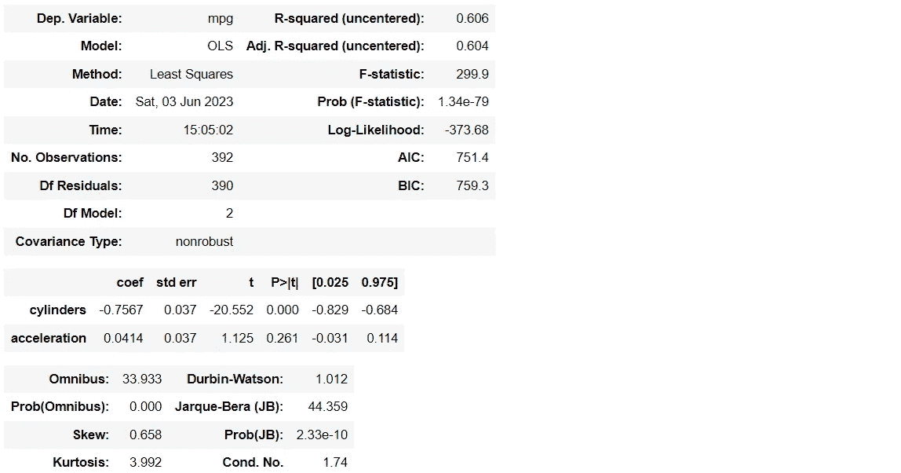

具有中等相关变量的多重回归模型的总结表。图片由作者提供。

## 绘制模型

从获得的模型中，我们将定义一个函数，在网格上运行模型，以便在下一步中使用。

```py
def run_model(v1, v2, pd_):
    mesh_size = 0.02
    x_min, x_max = pd_[[v1]].min()[0], pd_[[v1]].max()[0] 
    y_min, y_max = pd_[[v2]].min()[0], pd_[[v2]].max()[0] 
    xrange = np.arange(x_min, x_max, mesh_size)
    yrange = np.arange(y_min, y_max, mesh_size)
    xx, yy = np.meshgrid(xrange, yrange)
    return xx, yy, xrange, yrange
```

这部分非常有趣。让我们使用[Plotly](https://plotly.com/python/ml-regression/)库绘制模型，它可以轻松创建交互式图表。因此，我们可以与可视化进行互动，比如缩放或旋转。

```py
import plotly.express as px
import plotly.graph_objects as go
from sklearn.svm import SVR

#run and apply the model
xx1, yy1, xr1, yr1 = run_model('cylinders', 'acceleration', X1)
pred1 = model1.predict(np.c_[xx1.ravel(), yy1.ravel()])
pred1 = pred1.reshape(xx1.shape)

# plot the result
fig = px.scatter_3d(df1, x='cylinders', y='acceleration', z='mpg')
fig.update_traces(marker=dict(size=5))
fig.add_traces(go.Surface(x=xr1, y=yr1, z=pred1, name='pred1'))
fig.show()
```

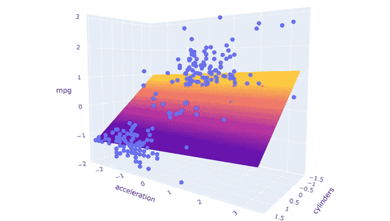

具有中等相关变量的多重回归模型。图片由作者提供。

我们可以对第二个存在多重共线性问题的模型执行相同的过程。

```py
y2 = df2[['mpg']]
X2 = df2[['cylinders', 'displacement']]

lm2 = sm.OLS(y2, X2)
model2 = lm2.fit()
model2.summary()
```

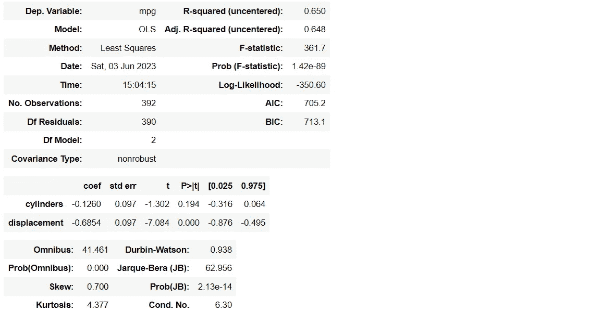

多重回归模型与多重共线性的总结表。图片由作者提供。

```py
#run and apply the model
xx2, yy2, xr2, yr2 = run_model('cylinders', 'displacement', X2)
pred2 = model2.predict(np.c_[xx2.ravel(), yy2.ravel()])
pred2 = pred2.reshape(xx2.shape)

# plot the result
fig = px.scatter_3d(df2, x='cylinders', y='displacement', z='mpg')
fig.update_traces(marker=dict(size=5))
fig.add_traces(go.Surface(x=xr2, y=yr2, z=pred2, name='pred2'))
fig.show()
```

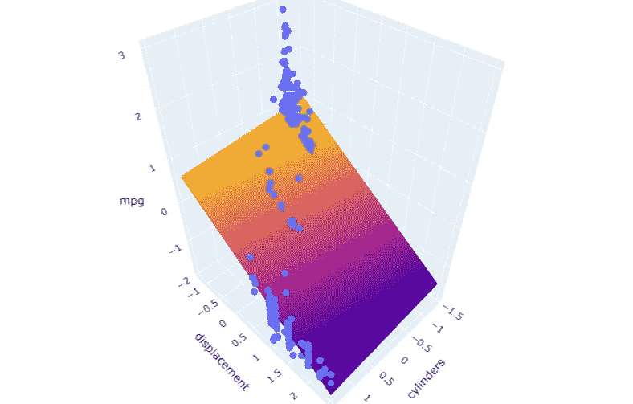

具有高度相关变量的多重回归模型。图片由作者提供。

## 修改数据集

如前所述，数据中的小修改可能会影响系数估计。为了证明这一点，我们将随机选择一行并更改其值。例如，它们将乘以 1.25。

然后，我们可以进行相同的过程，并将新的和原始的多重回归模型绘制在同一个图中以查看结果。

```py
# randomly modify a row in the dataframe 
from random import *
x = randint(1, len(df))
mod_list = [i*1.25 for i in df.iloc[x,:]]   #multiply by 1.25
df_m = df.copy()
df_m.iloc[x] = mod_list
df_m
```

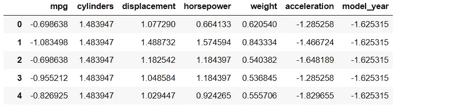

## 计算 VIF 值

从修改后的数据集中计算 VIF 值以比较差异。

```py
df_m1 = df_m[['mpg', 'cylinders', 'acceleration']]
df_m2 = df_m[['mpg', 'cylinders', 'displacement']]

# VIF dataframe1
vif_data1 = pd.DataFrame()
vif_data1['feature'] = df_m1.columns
vif_data1['VIF'] = [vif(df_m1.values, i) for i in range(len(df_m1.columns))]
print('model m1')
print(vif_data1)

###
# VIF dataframe2
vif_data2 = pd.DataFrame()
vif_data2['feature'] = df_m2.columns
vif_data2['VIF'] = [vif(df_m2.values, i) for i in range(len(df_m2.columns))]
print('model m2')  
print(vif_data2)
```

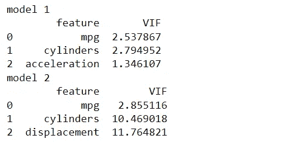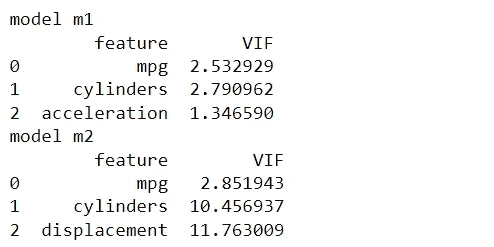

从原始模型和修改后的模型计算的 VIF 值。图片由作者提供。

从修改后的数据集中计算的新 VIF 值略有变化。两个模型保持相同的条件：第一个模型的预测变量为中等相关，第二个模型的预测变量则为高度相关。

## 创建多重回归模型

为了比较模型系数的变化，让我们从新数据集中构建模型并进行绘制。

```py
y_m1 = df_m1[['mpg']]
X_m1 = df_m1[['cylinders', 'acceleration']]

lm_m1 = sm.OLS(y_m1, X_m1)
model_m1 = lm_m1.fit()
model_m1.summary()
```

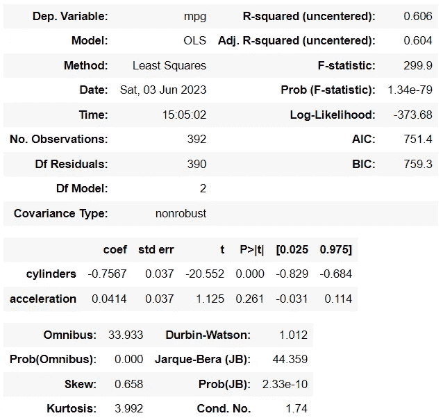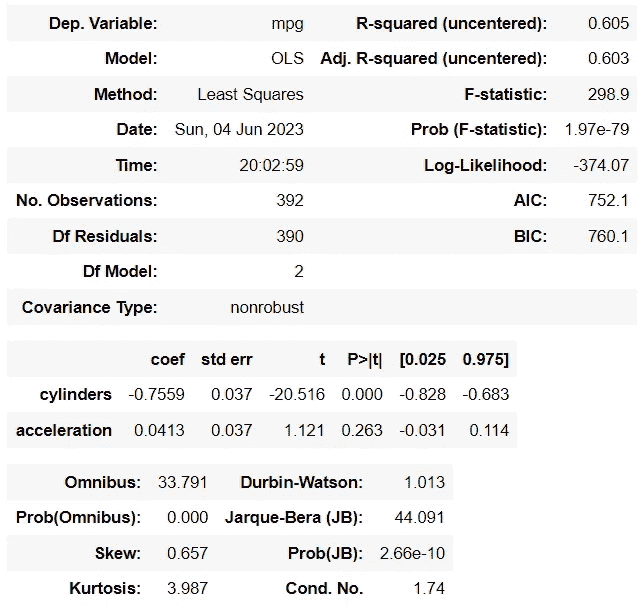

中等相关变量的模型总结：原始模型和修改后的模型，分别如图所示。图像由作者提供。

接下来，对具有高度相关预测变量的第二个模型进行相同的处理。

```py
y_m2 = df_m2[['mpg']]
X_m2 = df_m2[['cylinders', 'displacement']]

lm_m2 = sm.OLS(y_m2, X_m2)
model_m2 = lm_m2.fit()
model_m2.summary()
```

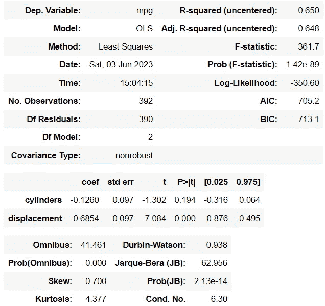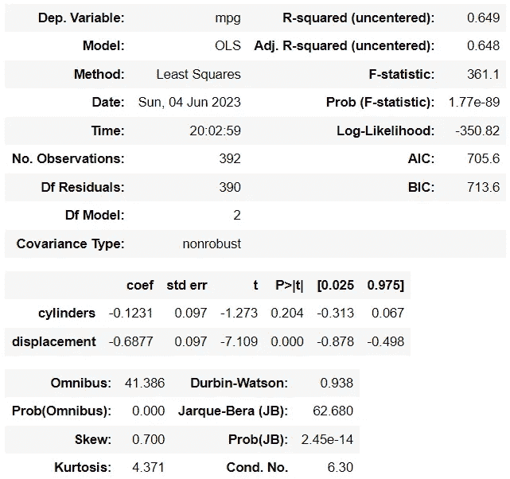

高度相关变量模型的总结：原始模型和修改后的模型，分别如图所示。图像由作者提供。

从上表来看，它们的系数变化似乎很小。顺便提一下，这种情况发生是因为我们随机修改了数据集中的一行。这还不够，也过早地假设多重共线性影响模型系数是不成立的。

根据目前的概念和代码，*for loop*函数将在 Python 中应用于逐行修改每个值。然后，比较与原始模型的系数绝对变化。

首先定义一个函数来比较系数值。

```py
def compare_cef(base_m, mod_m, col):
    val_base = base_m.summary().tables[1].as_html()
    ml = pd.read_html(val_base, header=0, index_col=0)[0]

    val_diff = mod_m.summary().tables[1].as_html()
    ml_m = pd.read_html(val_diff, header=0, index_col=0)[0]

    df_ = pd.DataFrame(abs(ml.iloc[:,0] - ml_m.iloc[:,0]))
    df_.rename(columns={'coef': 'r '+str(col+1)}, inplace=True)
    return df_
```

使用*for loop*函数一次修改一行。

```py
keep_df1, keep_df2 = [], []
for n in range(len(df)):
    mod_list = [i*1.25 for i in df.iloc[n,:]]
    df_m = df.copy()
    df_m.iloc[n] = mod_list

    df_m1 = df_m[['mpg', 'cylinders', 'acceleration']]
    y_m1, X_m1 = df_m1[['mpg']], df_m1[['cylinders', 'acceleration']]
    lm_m1 = sm.OLS(y_m1, X_m1)
    mdl_m1 = lm_m1.fit()

    df_m2 = df_m[['mpg', 'cylinders', 'displacement']]
    y_m2, X_m2 = df_m2[['mpg']], df_m2[['cylinders', 'displacement']]
    lm_m2 = sm.OLS(y_m2, X_m2)
    mdl_m2 = lm_m2.fit()

    df_diff1 = compare_cef(model1, mdl_m1, n)
    df_diff2 = compare_cef(model2, mdl_m2, n)
    keep_df1.append(df_diff1)
    keep_df2.append(df_diff2)

df_t1 = pd.concat(keep_df1, axis=1)
df_t2 = pd.concat(keep_df2, axis=1)
df_t = pd.concat([df_t1, df_t2], axis=0)
df_t
```

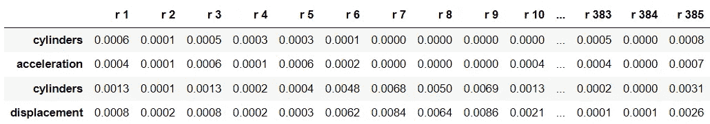

使用热力图可视化获得的 DataFrame。

```py
plt.figure(figsize=(16,2.5))
sns.heatmap(df_t, cmap='Reds')
plt.xticks([])
plt.show()
```

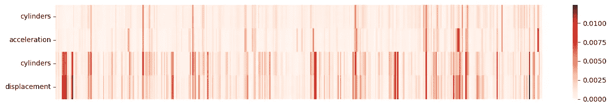

热力图显示模型系数的绝对差异。图像由作者提供。

从热力图绘制中可以看出，前两行显示了中等相关变量模型在数据轻微变化前后的系数绝对变化。

最后两行比较了高度相关变量模型在数据轻微修改前后的系数绝对变化。

可以解释为，当数据发生变化时，具有高度相关预测变量的模型系数趋向于更加不稳定，而具有中等相关预测变量的模型则受到的影响较小。

## 绘制多重回归模型

为了可视化系数的变化，以一个示例，我将修改数据集中的一行，创建一个新模型，并将其与原始模型进行比较。新模型将使用'viridis'色盘（黄绿），而原始模型则用默认颜色（橙蓝）绘制。

如果你想手动选择和修改其他行，请更改下面的代码。

```py
x = 6     #select row number
mod_list = [i*1.25 for i in df.iloc[x,:]]
df_m = df.copy()
df_m.iloc[x] = mod_list

y_m1 = df_m[['mpg']]
X_m1 = df_m[['cylinders', 'acceleration']]
lm_m1 = sm.OLS(y_m1, X_m1)
model_m1 = lm_m1.fit()

y_m2 = df_m[['mpg']]
X_m2 = df_m[['cylinders', 'displacement']]
lm_m2 = sm.OLS(y_m2, X_m2)
model_m2 = lm_m2.fit()
```

运行并绘制中等相关预测变量的多重回归模型。

```py
# run the model
pred_m1 = model_m1.predict(np.c_[xx1.ravel(), yy1.ravel()])
pred_m1 = pred_m1.reshape(xx1.shape)

# plot the result
fig = px.scatter_3d(df_m, x='cylinders', y='acceleration', z='mpg')
fig.update_traces(marker=dict(size=5))
fig.add_traces(go.Surface(x=xr1, y=yr1, z=pred1, name='pred'))
fig.add_traces(go.Surface(x=xr1, y=yr1, z=pred_m1, name='pred_m1',
                          colorscale = 'viridis_r'))
fig.show()
```

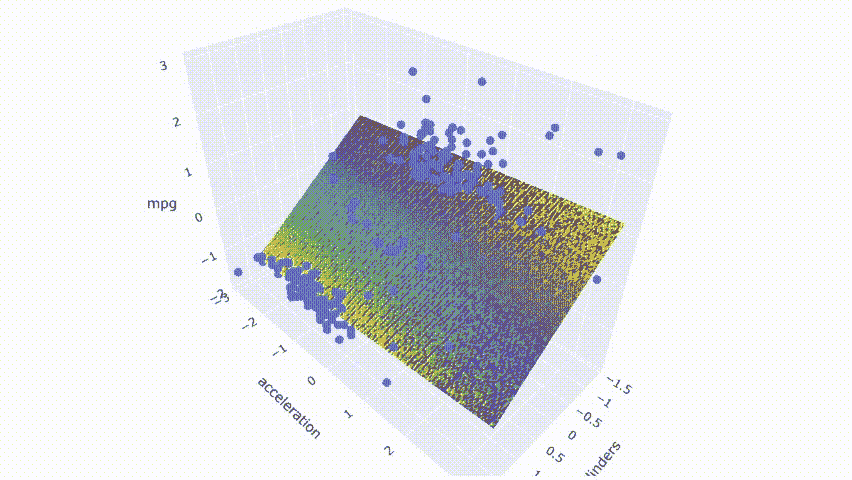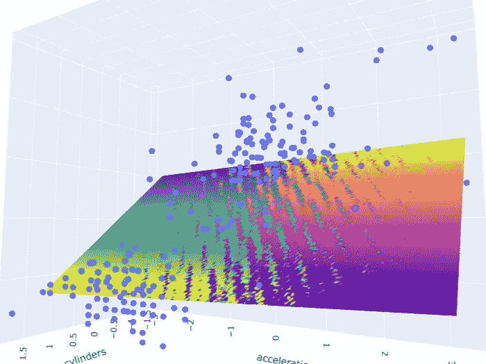

绘制中等相关预测变量的模型。图像由作者提供。

可以看到，两种模型重叠，因为两个平面的颜色在结果中混合在一起。最后，对中等相关预测变量的模型进行相同的处理。

```py
# run the model
pred_m2 = model_m2.predict(np.c_[xx2.ravel(), yy2.ravel()])
pred_m2 = pred_m2.reshape(xx2.shape)

# plot the result
fig = px.scatter_3d(df_m, x='cylinders', y='displacement', z='mpg')
fig.update_traces(marker=dict(size=5))
fig.add_traces(go.Surface(x=xr2, y=yr2, z=pred2, name='pred'))
fig.add_traces(go.Surface(x=xr2, y=yr2, z=pred_m2, name='pred_m2',
                          colorscale = 'viridis_r'))
fig.show()
```

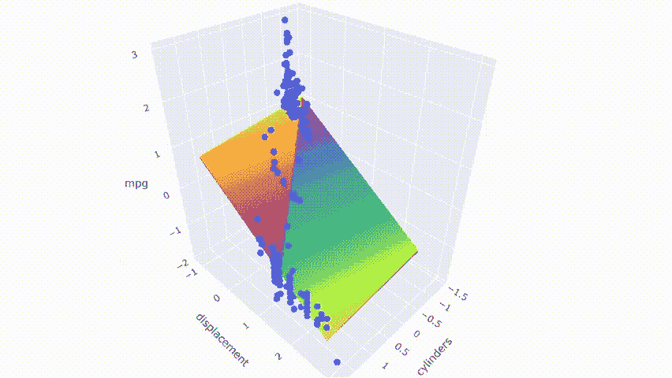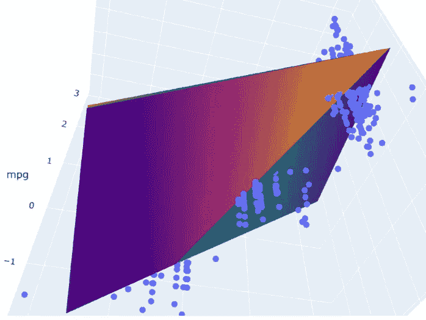

绘制具有多重共线性的模型。图像由作者提供。

结果显示，两个模型并没有完全重叠。它们相互交叉，模型之间产生了一个小的间隙。

请注意，这些图表是通过随机修改数据集中的一行进行选择的。第一个模型并不完全没有多重共线性。它仍然有中等相关的预测变量。从热图中也可以看出，在某些情况下，它受到了变化的影响。然而，与第二个模型相比，这种变化造成的后果较少。

# 总结

本文通过比较两个模型，一个具有中等相关预测变量，另一个具有高度相关预测变量，应用数据可视化来表达多重共线性对多元回归模型的影响。同时，也进行了修改原始数据的操作，以查看哪些模型在数据的小变化中受影响更大。

结果显示，模型中具有高度相关预测变量的情况越多，模型系数在数据不稳定变化时受影响的程度越大。因此，解释每个存在多重共线性问题的模型中的预测变量可能会变得困难。

这些是我认为你可能感兴趣的数据可视化文章：

+   8 种使用 Python 处理多个时间序列数据的可视化方式 (链接)

+   9 种比条形图更引人注目的 Python 可视化方式 (链接)

+   7 种使用 Python 表达排名随时间变化的可视化方式 (链接)

+   大逃杀 — 7 种用于互动金融图表的 Python 库比较 ([链接](https://medium.com/@borih.k/battle-royale-comparison-of-7-python-libraries-for-interactive-financial-charts-bbdcc28989bc))

## 参考文献

+   Wikimedia Foundation. (2023 年 2 月 22 日). *多重共线性*。维基百科. [`en.wikipedia.org/wiki/Multicollinearity`](https://en.wikipedia.org/wiki/Multicollinearity)

+   Choueiry, G. (2020 年 6 月 1 日). *量化健康*。QUANTIFYING HEALTH. [`quantifyinghealth.com/vif-threshold/`](https://quantifyinghealth.com/vif-threshold/)

+   Frost, J. (2023 年 1 月 29 日). *回归分析中的多重共线性：问题、检测与解决方案*。Statistics By Jim. [`statisticsbyjim.com/regression/multicollinearity-in-regression-analysis/`](https://statisticsbyjim.com/regression/multicollinearity-in-regression-analysis/)

+   Rob Taylor, P. (2022 年 12 月 1 日). *多重共线性：问题还是不问题？* Medium. `towardsdatascience.com/multicollinearity-problem-or-not-d4bd7a9cfb91`

+   Stephanie. (2020 年 12 月 16 日). *方差膨胀因子*。Statistics How To. [`www.statisticshowto.com/variance-inflation-factor/`](https://www.statisticshowto.com/variance-inflation-factor/)

+   *汽车数据 — dataman-udit 提供的数据集*。 data.world。（2020 年 5 月 24 日）。[`data.world/dataman-udit/cars-data`](https://data.world/dataman-udit/cars-data)
