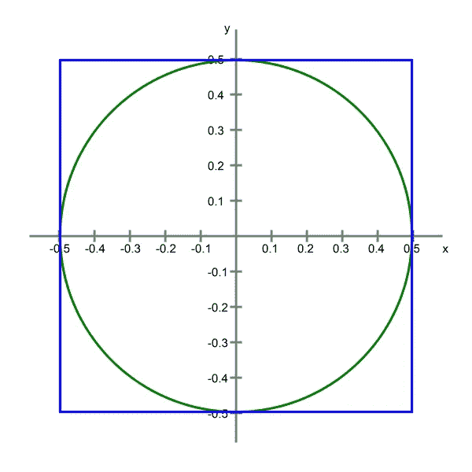
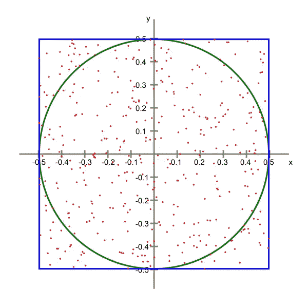
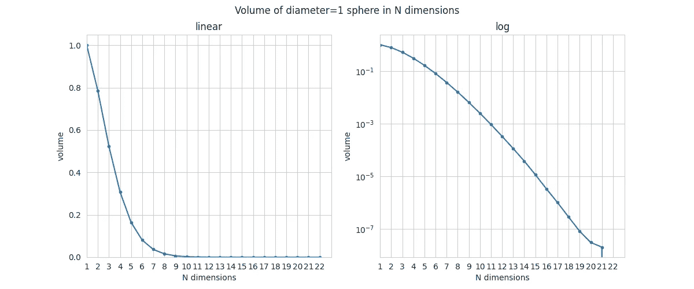
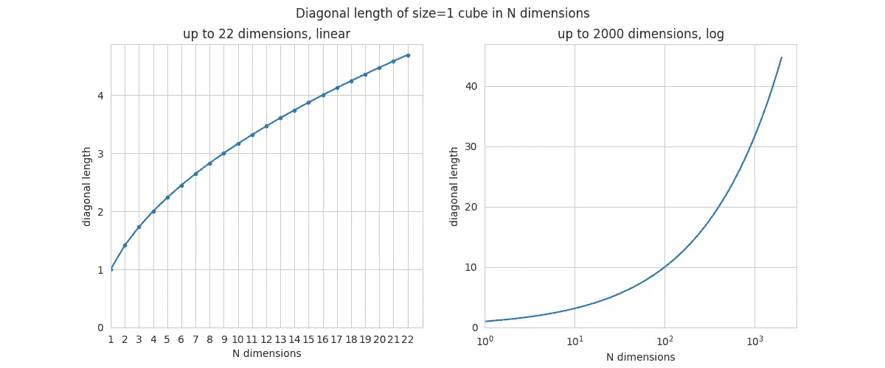
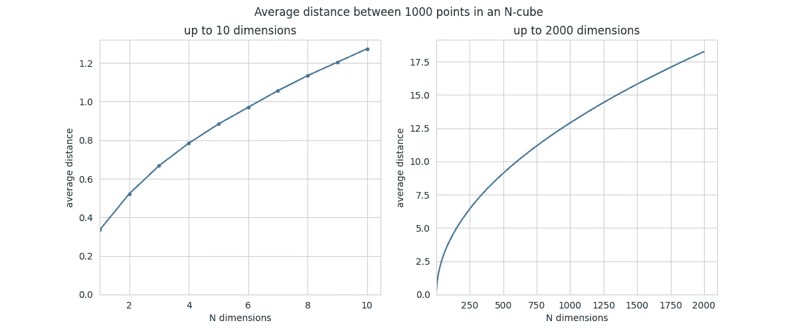
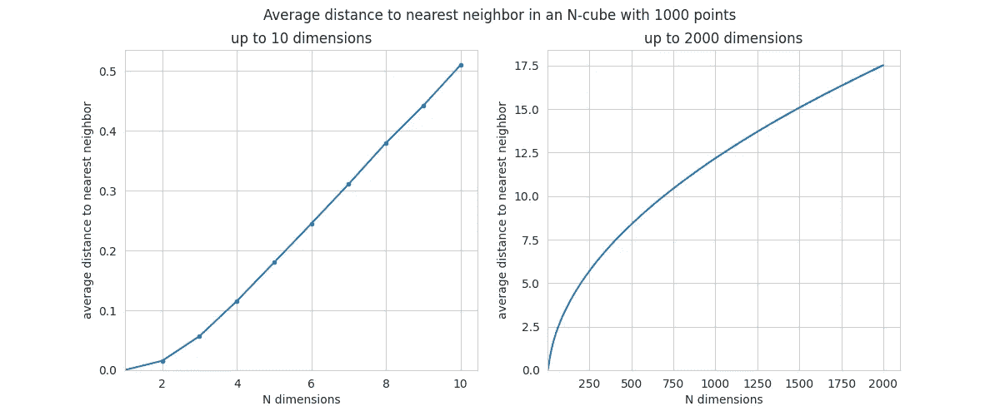
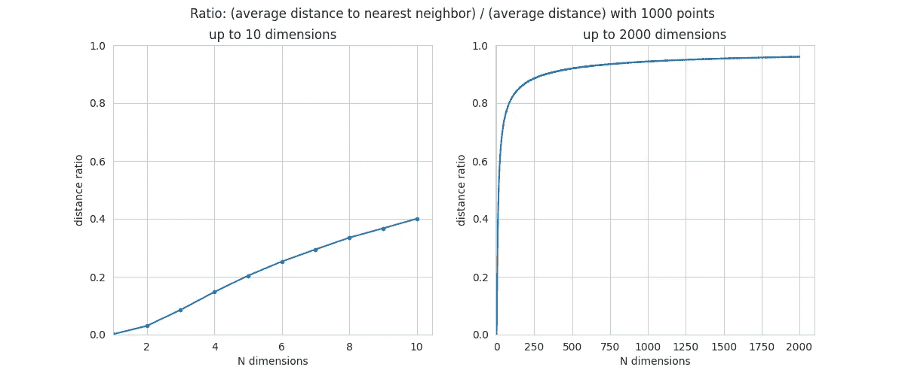

# 直观地展示维度诅咒的真实程度

> 原文：[`towardsdatascience.com/visualizing-the-full-extent-of-the-curse-of-dimensionality-5556ff6852bb?source=collection_archive---------6-----------------------#2023-06-29`](https://towardsdatascience.com/visualizing-the-full-extent-of-the-curse-of-dimensionality-5556ff6852bb?source=collection_archive---------6-----------------------#2023-06-29)

## 使用蒙特卡洛方法来直观展示具有非常多特征的观察值的行为

[](https://florin-andrei.medium.com/?source=post_page-----5556ff6852bb--------------------------------)[](https://towardsdatascience.com/?source=post_page-----5556ff6852bb--------------------------------) [Florin Andrei](https://florin-andrei.medium.com/?source=post_page-----5556ff6852bb--------------------------------)

·

[关注](https://medium.com/m/signin?actionUrl=https%3A%2F%2Fmedium.com%2F_%2Fsubscribe%2Fuser%2Faeaeb9d7d248&operation=register&redirect=https%3A%2F%2Ftowardsdatascience.com%2Fvisualizing-the-full-extent-of-the-curse-of-dimensionality-5556ff6852bb&user=Florin+Andrei&userId=aeaeb9d7d248&source=post_page-aeaeb9d7d248----5556ff6852bb---------------------post_header-----------) 发表在 [Towards Data Science](https://towardsdatascience.com/?source=post_page-----5556ff6852bb--------------------------------) ·10 min read·2023 年 6 月 29 日[](https://medium.com/m/signin?actionUrl=https%3A%2F%2Fmedium.com%2F_%2Fvote%2Ftowards-data-science%2F5556ff6852bb&operation=register&redirect=https%3A%2F%2Ftowardsdatascience.com%2Fvisualizing-the-full-extent-of-the-curse-of-dimensionality-5556ff6852bb&user=Florin+Andrei&userId=aeaeb9d7d248&source=-----5556ff6852bb---------------------clap_footer-----------)

--

[](https://medium.com/m/signin?actionUrl=https%3A%2F%2Fmedium.com%2F_%2Fbookmark%2Fp%2F5556ff6852bb&operation=register&redirect=https%3A%2F%2Ftowardsdatascience.com%2Fvisualizing-the-full-extent-of-the-curse-of-dimensionality-5556ff6852bb&source=-----5556ff6852bb---------------------bookmark_footer-----------)

想象一个数据集，由若干观察值组成，每个观察值都有 N 个特征。如果你将所有特征转换为数值表示，你可以说每个观察值是在一个 N 维空间中的一个点。

当 N 较低时，点之间的关系就是你直观上所期望的样子。但有时 N 会变得非常大——例如，如果你通过独热编码创建了很多特征等。在 N 的非常大值下，观察值的行为就像是稀疏的，或者它们之间的距离比你期望的要大。

这个现象是真实的。随着维度 N 的增加，而其他条件保持不变，包含你观察的 N-体积确实会在某种意义上增加（或者至少自由度变得更大），观察之间的欧几里得距离也会增加。点的分布实际上会变得更加稀疏。这是[维度诅咒](https://en.wikipedia.org/wiki/Curse_of_dimensionality)的几何基础。模型和技术在数据集上的表现会受到这些变化的影响。

如果特征数量非常大，很多事情可能会出错。特征比观察值多是模型在训练中过拟合的典型设置。在这样的空间中进行任何暴力搜索（例如 GridSearch）变得效率更低——你需要更多的试验才能覆盖相同的线性区间限制。一个微妙的效应会影响任何基于距离或邻近度的模型：**随着维度的增长到非常大的值，如果你考虑观察中的任何一点，所有其他点似乎都远离，并且几乎是等距离的**——由于这些模型依赖于距离来完成工作，距离差异的平衡使得它们的工作变得更加困难。例如，如果所有点似乎几乎等距离，聚类效果不会很好。

出于这些原因，还有更多原因，创建了诸如 PCA、LDA 等技术——旨在远离具有非常多维度的空间的特殊几何，并将数据集精炼到与其中实际信息更兼容的维度数。

直观上很难感知这个现象的真正规模，而超过 3 维的空间极其难以可视化，因此我们来做一些简单的 2D 可视化来帮助我们的直觉。维度如何成为问题的几何基础就是我们要在这里可视化的内容。如果你以前没有见过这些结果，可能会感到惊讶——高维空间的几何远比典型直觉所能建议的要复杂得多。

# 体积

考虑一个大小为 1 的正方形，位于原点。然后在正方形中内切一个圆。



一个内切于正方形的圆

这是 2 维的设置。现在考虑一般的 N 维情况。在 3 维中，你有一个内切于立方体的球体。再往上，你有一个内切于 N-立方体的 N-球体，这是最一般的描述方式。为了简化，我们将这些对象称为“球体”和“立方体”，不论它们有多少维度。

立方体的体积是固定的，总是 1。问题是：当维度 N 变化时，球体的体积会发生什么？

我们通过实验来回答这个问题，使用蒙特卡洛方法。我们将生成大量点，这些点在立方体内均匀但随机分布。对于每个点，我们计算它到原点的距离——如果该距离小于 0.5（球体的半径），那么这个点就在球体内部。



随机点

如果我们将球体内部的点数除以总点数，这将近似球体体积和立方体体积的比例。由于立方体的体积为 1，比例将等于球体的体积。当总点数较大时，近似值会更好。

换句话说，比例`inside_points / total_points`将近似球体的体积。

代码相当直接。由于我们需要很多点，必须避免显式循环。我们可以使用 NumPy，但它仅支持 CPU 并且是单线程的，因此速度较慢。潜在的替代方案：CuPy（GPU）、Jax（CPU/GPU）、PyTorch（CPU/GPU）等。我们将使用 PyTorch——但 NumPy 代码看起来几乎相同。

如果你跟随嵌套的`torch`语句，我们生成 1 亿个随机点，计算它们到原点的距离，统计在球体内的点数，并将点数除以总点数。`ratio`数组将包含不同维度中球体的体积。

可调参数设置为 24 GB 内存的 GPU——如果你的硬件不同，请调整这些参数。

```py
device = torch.device("cuda:0" if torch.cuda.is_available() else "cpu")
# force CPU
# device = 'cpu'

# reduce d_max if too many ratio values are 0.0
d_max = 22
# reduce n if you run out of memory
n = 10**8

ratio = np.zeros(d_max)

for d in tqdm(range(d_max, 0, -1)):
    torch.manual_seed(0)
    # combine large tensor statements for better memory allocation
    ratio[d - 1] = (
        torch.sum(
            torch.sqrt(
                torch.sum(torch.pow(torch.rand((n, d), device=device) - 0.5, 2), dim=1)
            )
            <= 0.5
        ).item()
        / n
    )

# clean up memory
torch.cuda.empty_cache()
```

让我们来可视化结果：



球体的体积

N=1 是简单的：“球体”和“立方体”都是线段，它们是相等的，所以“球体”的“体积”是 1。对于 N=2 和 N=3，你应该记住高中几何的结果，并注意到这个模拟非常接近实际值。

但随着 N 的增加，会发生非常戏剧性的变化：球体的体积急剧下降。当 N=10 时，它已经接近 0，并且在 N 约为 20 之后，它会低于此模拟的浮点精度。超过这一点，代码计算球体的体积为 0.0（这只是一个近似值）。

```py
>>> print(list(ratio))
[1.0, 0.78548005, 0.52364381, 0.30841056, 0.16450286, 0.08075666, 0.03688062, 0.015852, 0.00645304, 0.00249584, 0.00092725, 0.00032921, 0.00011305, 3.766e-05, 1.14e-05, 3.29e-06, 9.9e-07, 2.8e-07, 8e-08, 3e-08, 2e-08, 0.0]
```

一种解释是：对于较大的 N 值，几乎整个立方体的体积都集中在角落中。与之相比，包含球体的中心区域变得微不足道。在高维空间中，角落变得非常重要。大部分体积“迁移”到角落。这种变化随着 N 的增加极其迅速。

另一种看法：球体是原点的“邻域”。**随着 N 的增加，点会从那个邻域中消失。原点实际上并没有特别之处，因此原点的邻域发生的情况，必须发生在所有邻域中。** “邻域”的概念经历了巨大的变化。随着 N 的增加，邻域会变得空旷。

我几年前第一次运行了这个模拟，我清楚地记得这个结果是多么震惊——当 N 增加时，球体的体积迅速下降到 0。检查代码后没有发现错误，我的反应是：保存工作，锁定屏幕，出去散步，思考刚才看到的内容。:)

# 线性距离

让我们计算立方体的对角线作为 N 的函数。这是很简单的，因为对角线实际上是`sqrt(N)`，所以代码过于简单，不需要在这里展示。这些是结果：



对角线长度

再次，对于 N=2 和 N=3，你应该能从几何学中识别出结果（正方形和普通三维立方体的对角线）。但随着 N 的增加，对角线也会增加，其增长是无限的。

这可能听起来非常违反直觉，但即使立方体的边长保持不变（等于 1），其对角线也可以随着 N 的增加而无限变大。已经对于 N=1000，对角线长度约为 32。如果立方体的边长是 1 米，那么在非常多维度的空间中，立方体的对角线长度将达到 1 公里。

**即使沿边的距离保持不变，对角线也会无限增长，与维度数量一起增长。**

每次向空间中添加一个新维度时，更多的边、面等就会出现，角落区域的配置变得更加复杂，具有更多的自由度，对角线的测量会稍微长一点。

# 观测之间的距离

观测点或点之间的距离怎么样？假设我们生成固定数量的随机点，然后计算任意两个点之间的平均距离，以及任何点到最近邻居的平均距离。所有点始终都包含在立方体中。随着 N 的增加，平均距离会发生什么变化？让我们再运行一次模拟。

请注意内存管理的保守方法。这很重要，因为这里使用的数据结构相当大。

```py
n_points_d = 10**3
# how many pairs of points are there
dist_count = n_points_d * (n_points_d - 1) / 2
# we use the full pair-wise matrix of distances,
# so each distance will be counted twice
dist_count = 2 * dist_count
d_max = d_max_diag

avg_dist = np.zeros(d_max)
avg_dist_nn = np.zeros(d_max)

for d in tqdm(range(d_max, 0, -1)):
    torch.manual_seed(0)
    # generate random points
    point_coordinates = torch.rand((n_points_d, d), device=device)
    # compute differences of point coordinates on all axes
    coord_diffs = point_coordinates.unsqueeze(1) - point_coordinates
    del point_coordinates
    # square the coordinate differences
    diffs_squared = torch.pow(coord_diffs, 2)
    del coord_diffs
    # compute distances between any 2 points
    distances_full = torch.sqrt(torch.sum(diffs_squared, dim=2))
    del diffs_squared
    # compute average distance between points
    avg_dist[d - 1] = torch.sum(distances_full).item() / dist_count
    # compute distances to nearest neighbors
    distances_full[distances_full == 0.0] = np.sqrt(d) + 1
    distances_nn, _ = torch.min(distances_full, dim=0)
    del distances_full
    # compute average distance to nearest neighbors
    avg_dist_nn[d - 1] = torch.mean(distances_nn).item()
    del distances_nn

torch.cuda.empty_cache()
```

我们在这里使用的点数远少于此（仅 1000 个），因为主要数据结构的大小随着`N²`增加，因此如果生成太多点，我们很快就会耗尽内存。即便如此，近似结果应该足够接近实际值。

这是任何两个点之间的平均距离，基于 1000 个点，作为 N 的函数：



点之间的平均距离

对于小的 N 值，平均距离大约是 0.5 或 1。然而，随着 N 的增加，平均距离开始增长，当 N=2000 时已经接近 18。增长是显著的。

这是到最近邻居的平均距离，作为 N 的函数：



到最近邻居的平均距离

增加的效果更为显著，因为当 N 低于 10 时，值相当微小，点在低维空间中挤在一起。对于大的 N 值，最近邻的平均距离实际上接近任何两个点之间的平均距离——换句话说，临近空旷的情况主导了测量结果。



距离比率

这就是为什么我们一开始说**在高维空间中点变得几乎等距**——平均距离和最短距离变得几乎相同。这里有来自模拟的证据，以及对现象强度的直观理解。

随着维度 N 的增加，所有点彼此逐渐远离，即使它们的坐标被限制在相同的狭窄范围（-0.5, +0.5）。通过仅仅增加更多维度，点的群体变得越来越稀疏。当维度从几单位增加到几千单位时，这种增加跨度达到几个数量级。这是一个非常大的增加。

# 结论

维度诅咒是一个真实的现象，其基础在于 N 维空间的几何。

在其他条件相同的情况下，当你增加维度（或特征）数量时，点（或观测值）会迅速远离彼此。实际上，虽然轴上的线性间隔保持不变，但这里的空间变得更大了。所有邻域都变得空旷，每个点最终都孤立地坐在一个高维空间中。

这应该提供一些直观的理解，即一些技术（如聚类、各种模型等）在特征数量大幅变化时表现不同。少量观测值结合大量特征可能会导致次优结果——尽管维度诅咒不是唯一原因，但它可能是原因之一。

一般来说，观测值的数量应该“跟上”特征的数量——具体规则依赖于许多因素。

如果没有其他，这篇文章应该提供了一个对高维空间特性的直观概述，这些特性难以可视化。一些趋势极为强烈，现在你应该对它们的强度有一些了解。

本文中使用的所有代码都在这里：

[](https://github.com/FlorinAndrei/misc/blob/master/curse_dimensionality_article/n_sphere.ipynb?source=post_page-----5556ff6852bb--------------------------------) [## misc/curse_dimensionality_article/n_sphere.ipynb 在 master · FlorinAndrei/misc

### 随机内容。通过在 GitHub 上创建一个账户来贡献于 FlorinAndrei/misc 的开发。

github.com](https://github.com/FlorinAndrei/misc/blob/master/curse_dimensionality_article/n_sphere.ipynb?source=post_page-----5556ff6852bb--------------------------------)

本文中使用的所有图像都是作者创作的（见上面的代码链接）。
