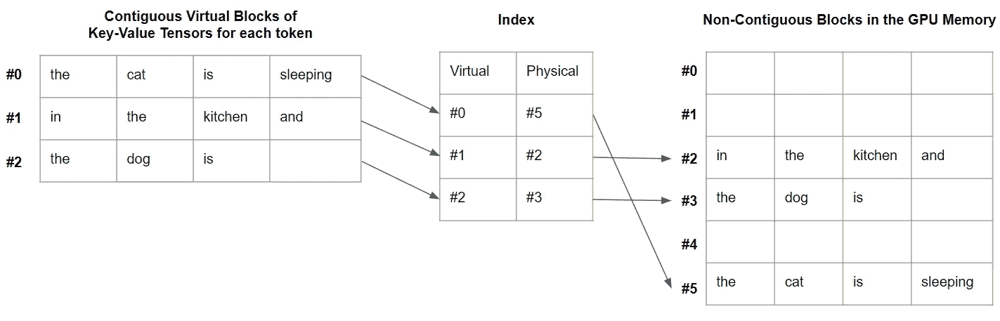

# vLLM：PagedAttention 实现 24 倍更快的 LLM 推理

> 原文：[`towardsdatascience.com/vllm-pagedattention-for-24x-faster-llm-inference-fdfb1b80f83?source=collection_archive---------3-----------------------#2023-06-24`](https://towardsdatascience.com/vllm-pagedattention-for-24x-faster-llm-inference-fdfb1b80f83?source=collection_archive---------3-----------------------#2023-06-24)

## 在推理过程中更高效的 Transformer 注意力计算方法

 [Benjamin Marie](https://medium.com/@bnjmn_marie?source=post_page-----fdfb1b80f83--------------------------------)

·

[关注](https://medium.com/m/signin?actionUrl=https%3A%2F%2Fmedium.com%2F_%2Fsubscribe%2Fuser%2Fad2a414578b3&operation=register&redirect=https%3A%2F%2Ftowardsdatascience.com%2Fvllm-pagedattention-for-24x-faster-llm-inference-fdfb1b80f83&user=Benjamin+Marie&userId=ad2a414578b3&source=post_page-ad2a414578b3----fdfb1b80f83---------------------post_header-----------) 发布于 [Towards Data Science](https://towardsdatascience.com/?source=post_page-----fdfb1b80f83--------------------------------) · 6 分钟阅读 · 2023 年 6 月 24 日

--

PagedAttention 用于一个提示“猫在厨房里睡觉，狗在”。用于注意力计算的 Key-Value 张量对被存储在虚拟连续块中，这些块映射到 GPU 内存中的非连续块。 — 作者提供的图片

几乎所有的大型语言模型（LLM）都依赖于 Transformer 神经架构。尽管这种架构因其高效性而受到赞誉，但它也存在一些众所周知的计算瓶颈。

在解码过程中，其中一个瓶颈是计算每个输入 token 的 key-value 张量对的注意力。所有这些张量必须存储在内存中。

*注意：我不会在本文中解释这些键值对的作用。这是 Transformer 架构中最复杂且最有趣的方面之一。如果你不太了解这个概念，我强烈推荐阅读* [*Jay Alammar 的《图解 Transformer》*](https://jalammar.github.io/illustrated-transformer/)*。*

随着 LLM 接受越来越长的输入，例如 LLM Claude 接受 100k 令牌长的输入，这些张量消耗的内存可能会非常大。

天真地将所有这些张量存储在内存中会导致内存过度预留和碎片化。这种碎片化可能使内存访问非常低效，特别是对于长序列的令牌而言。至于过度预留，系统这样做是为了确保分配足够的内存给张量，即使它并没有全部使用。
