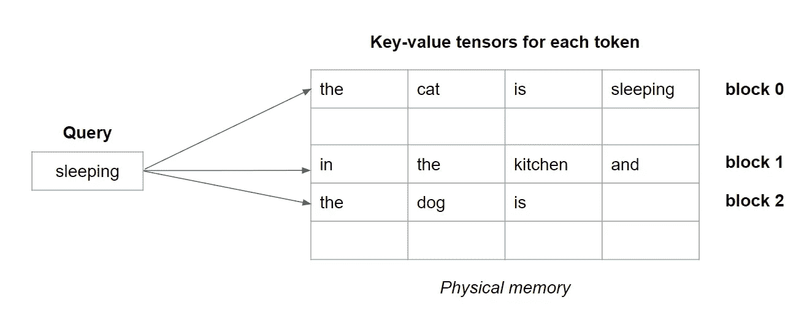
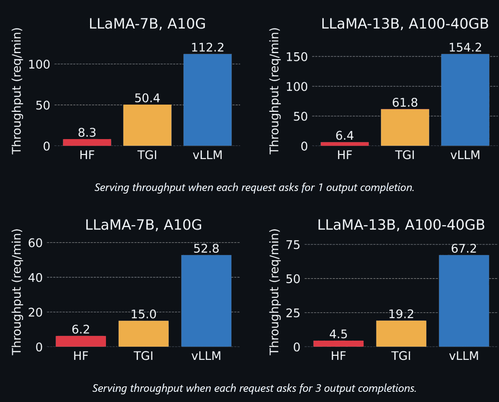

# vLLM：PagedAttention 实现 24 倍更快的 LLM 推理

> 原文：[`towardsdatascience.com/vllm-pagedattention-for-24x-faster-llm-inference-fdfb1b80f83`](https://towardsdatascience.com/vllm-pagedattention-for-24x-faster-llm-inference-fdfb1b80f83)

## 在推理过程中，更高效地计算 Transformer 的注意力

[](https://medium.com/@bnjmn_marie?source=post_page-----fdfb1b80f83--------------------------------)[](https://towardsdatascience.com/?source=post_page-----fdfb1b80f83--------------------------------) [Benjamin Marie](https://medium.com/@bnjmn_marie?source=post_page-----fdfb1b80f83--------------------------------)

·发表于 [Towards Data Science](https://towardsdatascience.com/?source=post_page-----fdfb1b80f83--------------------------------) ·6 分钟阅读·2023 年 6 月 24 日

--


PagedAttention 用于提示“the cat is sleeping in the kitchen and the dog is”。用于注意力计算的键值对张量存储在映射到 GPU 内存中非连续块的虚拟连续块中。— 图片由作者提供

几乎所有的大型语言模型（LLM）都依赖于 Transformer 神经架构。虽然这一架构因其高效性而受到赞誉，但也存在一些众所周知的计算瓶颈。

在解码过程中，一个瓶颈是在计算每个输入标记的键值对张量的注意力。这些张量必须全部存储在内存中。

*注意：本文不会解释这些键值对的作用。这是 Transformer 架构中最复杂且最有趣的方面之一。如果你对此不了解，我强烈建议阅读* [*Jay Alammar 的《图解 Transformer》*](https://jalammar.github.io/illustrated-transformer/)*。*

随着 LLM 接受越来越长的输入，例如，LLM Claude 接受 100k 标记长的输入，这些张量消耗的内存可能变得非常大。

盲目地将所有这些张量存储在内存中会导致内存过度预留和碎片化。这种碎片化会使内存访问变得非常低效，特别是对于长序列的标记。至于过度预留，系统这样做是为了确保为张量分配足够的内存，即使它没有完全使用这些内存。

为了缓解这些问题，UC Berkeley 提出了 PagedAttention。

PagedAttention 被实现于 [vLLM](https://github.com/vllm-project/vllm)（Apache 2.0 许可），该项目由 LMSYS 部署，LMSYS 是一个由 UC Berkeley 的学生和教师以及 UCSD 和 CMU 的帮助下成立的开放研究组织。

在这篇文章中，我解释了什么是 PagedAttention 以及它为何显著加速解码。我将在文章的最后部分展示如何开始使用 vLLM 利用 PagedAttention 来进行推理和在你的计算机上服务 LLMs。

# Transformer 的 PagedAttention

[Kwon 等人 (2023)](https://vllm.ai/) 提出了 PagedAttention。

目标是在 GPU VRAM 的不连续空间中更高效地存储键值张量。

简而言之，PagedAttention 背后的思想是创建映射到 GPU 内存中物理块的连续虚拟块。

每个块被设计用来存储预定义数量标记的键值对张量。所有块在虚拟上是连续的，并且映射到物理上不连续的块，这些块在推理过程中按需分配，在碎片化的 GPU 内存中。内存中还创建了一个简单的索引表，以将虚拟块与物理块关联起来。

PagedAttention 的内核根据需要提取这些块。这是高效的，因为系统由于块的大小限制而提取较少的键值张量。

让我们用以下提示进行说明：

*猫正在厨房里睡觉，而狗则*

我们为每个标记提供了键值张量。使用 PageAttention，我们可以（任意地）将块大小设置为 4。每个块包含 4 个键值张量，除了最后一个块，只包含 3 个键值张量。块在虚拟上是连续的，但在 GPU 内存中不一定是连续的，如本文引言中的图所示。

在注意力计算中，对于每个查询标记，系统逐个提取块，如下所示。



说明包含最多 4 个标记的虚拟块 —— 作者提供的图像

通过按块提取键值张量，而不是整个张量序列，注意力计算要快得多。

# 推理的并行采样

PagedAttention 的另一个优势是虚拟块在推理时可以共享。所有通过采样或束搜索并行生成的序列可以使用相同的虚拟块，从而避免重复。

在他们的实验中，LMSYS 观察到束搜索解码的内存使用减少了 55%。

# LMSYS 报告的 PagedAttention 性能

在我们亲自尝试之前，先看看作者（UC Berkeley/LMSYS）在使用 vLLM 中实现的 PagedAttention 与 Hugging Face 开发的文本生成推理库相比的性能报告。



LLaMa 模型在输出完成任务中的性能，包括原始 Hugging Face 库 (HF)、文本生成推理库 (TGI) 和使用 PagedAttention (vLLM) 的 vLLM —— [由 UC Berkeley 和 LMSYS 绘制的图](https://github.com/vllm-project/vllm)

根据这些结果，vLLM 看起来要快得多，特别是在多次输出完成的情况下。TGI 和 vLLM 之间的差距在更大的模型中会增加。这是预期中的，因为更大的模型需要更多内存，因此更容易受到内存碎片化的影响。

总体而言，vLLM 的速度比 Hugging Face Transformers 库快多达 24 倍。

*注意：实际上，我对 HF 到 TGI 的改进也感到很惊讶。我还没有在我的博客上覆盖 TGI，但我可能会写一篇关于它的指南。TGI 在 Hugging Face 的生产环境中使用。虽然它似乎比 vLLM 慢很多，但 TGI 还有其他优点，比如支持更多的模型和功能。*

# 如何在你的计算机上设置 vLLM

*注意：vLLM 还不支持 CUDA 12。请使用较低版本，例如 11.8。*

在本节中，我只会讲解如何在你的计算机上设置和运行 vLLM 的基本步骤。有关更高级的用法，你可以查看 [vLLM 文档](https://vllm.readthedocs.io/en/latest/)。

当我写这篇文章时，[vLLM 仅支持几种类型的模型](https://vllm.readthedocs.io/en/latest/models/supported_models.html)：

+   GPT-2

+   基于 GPT-NeoX 和 Pythia

+   基于 LLaMa

+   基于 OPT

你可以通过遵循 [这些说明](https://vllm.readthedocs.io/en/latest/models/adding_model.html) 来添加对其他模型的支持。

在下面的代码中，我使用 Dolly V2（MIT 许可证）。这是一个基于 [Pythia](https://github.com/EleutherAI/pythia) 的聊天模型，由 [DataBricks](https://www.databricks.com/) 训练。

我选择了 [最小的 30 亿参数版本](https://huggingface.co/databricks/dolly-v2-3b)。它可以在配备 24 GB VRAM 的消费级 GPU 上运行，例如 nVidia RTX 3080/3090。

安装 vLLM 最直接的方法是使用 pip：

```py
pip install vllm
```

*注意：这可能需要最多 10 分钟。*

但在我的情况下，无论是在我的计算机上还是 Google Colab 上，pip 都无法安装 vllm 库。vLLM 的作者确认某些 nvcc 版本和环境存在问题。然而，对于大多数配置，pip 应该能够顺利安装 vLLM。

如果你和我处于相同的情况，解决方法就是使用 Docker 镜像。这一个对我有效：

```py
docker run --gpus all -it --rm --shm-size=8g nvcr.io/nvidia/pytorch:22.12-py3
```

*注意：进入 docker 后，作者建议在安装 vLLM 之前卸载 Pytorch：pip uninstall torch。然后，“pip install vllm” 应该可以正常工作。*

然后，我们可以开始编写 Python 代码。

我们首先需要导入 vllm，然后用 vllm 加载模型。推理通过 llm.generate() 触发。

```py
from vllm import LLM

prompts = ["Tell me about gravity"] #You can put several prompts in this list
llm = LLM(model="databricks/dolly-v2-3b")  # Load the model
outputs = llm.generate(prompts)  # Trigger inference
```

你也可以使用 vLLM 来服务 LLM。它的工作方式类似于 TGI。它也比 我在之前文章中描述的 NVIDIA Triton 推理服务器 更加简单。

你首先需要启动服务器：

```py
 python -m vllm.entrypoints.openai.api_server --model databricks/dolly-v2-3b
```

*注意：服务器将监听 8000 端口。确保该端口可用或在 vLLM 配置文件中更改它。*

然后，你可以使用以下提示查询服务器：

```py
curl http://localhost:8000/v1/completions \
    -H "Content-Type: application/json" \
    -d '{
        "model": "databricks/dolly-v2-3b",
        "prompt": "Tell me about gravity",
        "max_tokens": 200
    }'
```

就这样！你在计算机上运行了一个非常高效的 LLM 服务器。

# 结论

PagedAttention 显著加速了推理。这是向更实惠的 AI 迈出的另一大步。

在进一步的实验中，我确认 vLLM 在处理批量提示时特别高效。为了充分利用 vLLM，请考虑优化你的推理批处理策略。

尽管大束的束搜索可能在标准注意力计算中是不可行的，但使用 PagedAttention 的束搜索更快且内存更高效。

我的一个下一个实验是将 PagedAttention 与 QLoRa 结合，以减少内存使用。这应该很简单。它将使在消费级硬件上运行 LLM 更加高效。

*如果你喜欢这篇文章并且有兴趣阅读接下来的文章，支持我工作的最佳方式是通过这个链接成为 Medium 会员：*

[](https://medium.com/@bnjmn_marie/membership?source=post_page-----fdfb1b80f83--------------------------------) [## 通过我的推荐链接加入 Medium - 本杰明·玛丽

### 作为 Medium 会员，你的一部分会员费将会转到你阅读的作家那里，而且你可以全面访问每一篇故事…

medium.com](https://medium.com/@bnjmn_marie/membership?source=post_page-----fdfb1b80f83--------------------------------)

*如果你已经是会员并且想要支持这项工作，* [*只需在 Medium 上关注我*](https://medium.com/@bnjmn_marie)*。*
