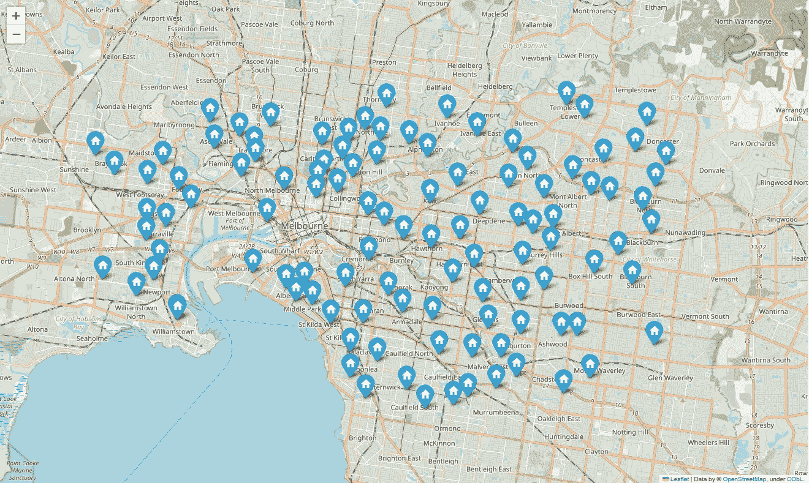

# Voronoi 网格：一种实际应用

> 原文：[`towardsdatascience.com/voronoi-grids-a-practical-application-7e6ee3b1daf0`](https://towardsdatascience.com/voronoi-grids-a-practical-application-7e6ee3b1daf0)

## 快速成功数据科学

## 在墨尔本，澳大利亚，绘制学校区域

[](https://medium.com/@lee_vaughan?source=post_page-----7e6ee3b1daf0--------------------------------)[](https://towardsdatascience.com/?source=post_page-----7e6ee3b1daf0--------------------------------) [李·沃恩](https://medium.com/@lee_vaughan?source=post_page-----7e6ee3b1daf0--------------------------------)

·发表于 [走向数据科学](https://towardsdatascience.com/?source=post_page-----7e6ee3b1daf0--------------------------------) ·10 分钟阅读·2023 年 11 月 28 日

--


被 Leonardo.ai DreamShaper v7 设想为彩绘玻璃窗的墨尔本

*Voronoi 网格*，也称为 Voronoi *图*，用于将平面划分为围绕一组给定*种子点*的离散区域。对于每个种子点，都有一个对应的区域，称为 Voronoi *单元*，其中平面上的所有点都比其他点更接近*该*种子点。

Voronoi 图在许多领域都有应用，包括计算机科学、地理学、生物学和城市规划。一个特别重要的应用是绘制需要紧急降落的飞机的最近机场。

澳大利亚墨尔本政府使用该工具制作*学校学区*地图。“学区”指的是那些居住在特定区域内并且被保证入读特定学校的学生。由于学生有资格就读*离家最近*的小学或中学——以欧几里得距离为标准——学校区域地图默认是一个 Voronoi 图。


墨尔本学校学区地图 ([维多利亚州教育部](https://www.findmyschool.vic.gov.au/)，CC-BY 4.0)

在这个*快速成功数据科学*项目中，我们将通过制作自己版本的墨尔本学区地图来深入了解 Voronoi 图的概念。我们将使用大都市区的小学子集，并用 SciPy 库的`Voronoi`类对其进行网格化。然后，我们将使用 Folium 库将 Voronoi 图叠加在墨尔本的街道地图上。

# 数据集

为了生成数据集，我使用了维多利亚政府的[*Find My School*](https://www.findmyschool.vic.gov.au/#school=1283701)网站查找墨尔本大都市区 109 所小学的地址。然后使用[LatLong.net](https://www.latlong.net/convert-address-to-lat-long.html)将地址转换为十进制度数，并将结果存储在这个[GitHub Gist](https://gist.github.com/rlvaugh/7a59c99c41bc6d6b10cd5047a109453b)的 CSV 文件中。



该项目使用的墨尔本地区小学位置（由作者提供）

# SciPy Voronoi 实现

Python 的*SciPy*科学库旨在数学、科学和工程领域，解决科学计算中的许多标准问题。它基于并补充了*Numerical Python* ([*NumPy*](https://numpy.org/))，并提供了许多用户友好且高效的数值例程。

为了制作 Voronoi 图，SciPy 提供了`scipy.spatial.voronoi()`类，该类使用[Qhull 库](http://www.qhull.org/)来计算 Voronoi 网格。如前所述，网格单元内的所有位置应该比其他种子点更接近生成该单元的种子点。

下图取自 SciPy 文档，种子点按正交方式排列，形成了一个简单的网格模式，其中种子点位于单元格的*中心*。


正交 Voronoi 网格（来自 SciPy 文档）

种子点显示为蓝色。图中线条交汇的*顶点*为橙色。种子点之间的*脊*（线条）为黑色，这些脊构成了 Voronoi 单元的边界。

由于前图中的大多数种子点位于地图的*边缘*，只有中心种子点与*有限*的单元或区域相关联，因此它被*有限*的脊包围。其他脊为虚线，因为它们延伸到无穷大，从而界定了*无限*的单元，这些单元永远不会“闭合”，因为没有外部种子点来计算插入的脊。

下图也来自文档，由*非正交*排列的种子点构建，因此单元格更为复杂。请注意，一些脊用实线绘制，另一些则用虚线绘制。


非正交 Voronoi 网格（来自 SciPy 文档）

实线绘制的脊在*某处*汇聚，形成一个封闭且有限的区域。虚线是发散的，永不相交，因此它们的单元具有无限的面积。在实际应用中，这些无限单元通常被忽略或人为地限制，比如使用地图边缘多边形。

我们可以通过 `voronoi.regions`、`voronoi.vertices`、`voronoi.ridge_vertices` 和 `voronoi.ridge_points` 等属性访问区域（单元格）的列表和用于定义这些区域的坐标。我们稍后会用这些来创建可以绘制的 Voronoi 单元格多边形。

# 代码

下面的代码在 JupyterLab 中编写，遵循以下步骤：

1.  加载学校名称和位置的 CSV 文件。

1.  使用学校位置创建 Voronoi 网格。

1.  将 Voronoi 网格转换为可以绘制的多边形。

1.  使用方形边界框截断边缘单元格。

1.  在墨尔本的街道地图上绘制学校和 Voronoi 网格。

## 导入库和准备数据

为了完成任务，我们需要 pandas、geopandas、shapely（与 geopandas 捆绑）、Folium 和 SciPy。pandas 和 geopandas 库允许数据的加载和处理，shapely 创建可绘制的多边形，Folium 允许映射，SciPy 提供构建 Voronoi 网格的算法。

如果你不熟悉，[*GeoPandas*](https://geopandas.org/en/stable/docs.html) 是一个开源的第三方库，旨在支持 Python 中的地理空间映射。它扩展了 [pandas](https://pandas.pydata.org/docs/) 库使用的数据类型，使地理空间矢量数据的处理类似于表格数据的处理。它还使 Python 中的操作成为可能，而这些操作通常需要专用的地理空间数据库，如 Post GIS。

```py
import pandas as pd
import geopandas as gpd
import folium
from shapely.geometry import Polygon
from scipy.spatial import Voronoi

# Load the school locations CSV file into a DataFrame:
df = pd.read_csv('https://bit.ly/3MYYegT')

# Create a GeoDataFrame with Point geometries:
gdf = gpd.GeoDataFrame(df, 
                       geometry=gpd.points_from_xy(df['Longitude'], 
                                                   df['Latitude']), 
                       crs='EPSG:4326')
```

导入必要库后，我们使用 pandas 读取 CSV 文件，并使用 geopandas 将学校坐标转换为 *点几何*。

*GeoDataFrame* 是一个 pandas DataFrame，具有一个特殊的“几何”列用于位置数据。此列将几何对象类型（如点、线串、多边形等）与绘制它所需的坐标（经度和纬度）捆绑在一起。


示例“几何”列（框选）来自 GeoDataFrame（作者的 [Python Tools for Scientists](https://a.co/d/eUoO01X)）。

注意，在创建 GeoDataFrame 时，我们需要使用 `crs=EPSG:4326` 参数提供 *坐标参考系统*。“EPSG” 代表 “欧洲石油勘探组” 数据集，4326 代码由 *全球定位系统*（*GPS*）使用。该系统将我们 3D 行星上的纬度和经度坐标投影到地图的平面表面上。你可以在 [这里](https://en.wikipedia.org/wiki/EPSG_Geodetic_Parameter_Dataset) 阅读更多信息。

## 创建 Voronoi 网格

下一步是通过将 GeoDataFrame 的“经度”和“纬度”列传递给 SciPy 库的 `Voronoi()` 类来创建 Voronoi 网格。

```py
# Create a Voronoi diagram using the GeoDataFrame.
# Use -1 to check for and exclude regions that extend to infinity:
vor = Voronoi(gdf[['Longitude', 'Latitude']])
voronoi_polygons = [Polygon(vor.vertices[region]) 
                    for region in vor.regions 
                    if region and -1 not in region]

# Create a GeoDataFrame with the Voronoi polygons:
gdf_voronoi = gpd.GeoDataFrame(geometry=voronoi_polygons, 
                               crs='EPSG:4326')
```

接下来，我们制作一个 Voronoi 多边形的列表，并删除空区域和延伸到无穷远的区域。这需要使用 `Voronoi()` 类返回的 `vor` 对象的 `regions` 属性。如果该属性以 -1 开头，那么我们知道该区域永远不会关闭。作为过程的一部分，我们将 `vertices` 属性传递给 shapely 的 `Polygon()` 类，该类生成可绘制的多边形，我们将其添加到新的 GeoDataFrame 中。

## 截断 Voronoi 单元

因为我们没有使用该区域内的所有小学，许多边缘单元将没有约束，可能会延伸到极其远的距离。为了处理这些情况，我们将创建一个边界框，并使用它来截断任何超出其范围的 Voronoi 单元（多边形）。


无约束的网格。天哪！（由作者提供）

```py
# Define the bounding box lat-lon limits:
max_lat, min_lat, max_lon, min_lon = (-37.75, -37.9, 
                                      145.18, 144.84)

# Create the bounding box as a Shapely Polygon
bounding_box = Polygon.from_bounds(min_lon, min_lat, 
                                   max_lon, max_lat)

# Truncate each Voronoi polygon with the bounding box:
truncated_polygons = [polygon.intersection(bounding_box) for 
                      polygon in gdf_voronoi.geometry]

# Create a GeoDataFrame with the truncated polygons:
gdf_truncated = gpd.GeoDataFrame(geometry=truncated_polygons, 
                                 crs='EPSG:4326')
```

我们首先定义边界框的经纬度限制，使用比 CSV 文件中找到的值略大的值。然后再次调用 `Polygon()` 创建可绘制的多边形，然后使用列表推导式和 shapely 的 `Polygon` `intersection()` 方法来截断 GeoDataFrame 中的每个多边形。注意我们如何使用特殊的 `geometry` 列（`gdf_voronoi.geometry`）。最后，我们创建一个新的 GeoDataFrame 来保存截断后的多边形。

## 绘制地图

如果没有将其与现实世界关联的方式，Voronoi 图是无用的。因此，我们将使用 Folium 将其绘制在城市的街道地图上（通过选择 `OpenStreetMap` 作为 `tiles` 参数）。

我们还需要学校的位置和相关信息。这需要遍历 GeoDataFrame 并将每个标记添加到地图中。我们可以通过将 `icon` 参数设置为“家”符号来控制标记*内部*的图标。你可以在 [Glyphicons 页面](https://getbootstrap.com/docs/3.3/components/) 上找到类似的图标列表。你也可以创建自定义图标，如 这篇文章 中所述。

```py
# Create a Folium map centered on the average coordinates of the schools:
map_center = [gdf['Latitude'].mean(), gdf['Longitude'].mean()]
school_map = folium.Map(location=map_center, 
                        zoom_start=12, 
                        tiles='OpenStreetMap')

# Plot the truncated Voronoi polygons on the map:
folium.GeoJson(gdf_truncated).add_to(school_map)

# Add markers for each school:
for index, school in gdf.iterrows():
    folium.Marker(
        location=[school['Latitude'], school['Longitude']],
        popup=f"{school['School']}\n\
        {school['Street Address']}\n{school['Town']}",
        icon=folium.Icon(color='blue', icon='home')
    ).add_to(school_map)

# Save the map as an HTML file (optional):
# school_map.save('school_voronoi_map_truncated.html')

# Display the map in the notebook:
school_map
```

这是结果地图，允许缩放和平移。


最终地图（由作者提供）

图示边缘的一些学校没有被着色，因为它们的“山脊”延伸到无穷远而没有收敛。这些可以通过将 Voronoi 单元与其他多边形合并来“修复”。我们稍后会讨论这个选项。

点击标记会弹出一个包含学校名称和地址的窗口。


带有学校信息的弹出窗口（由作者提供）

要关闭多边形的蓝色填充颜色，只需在创建 `folium.GeoJson` 对象时修改 `style_function` 参数，如下所示。

```py
folium.GeoJson(gdf_truncated, 
               style_function=lambda x: {'fillColor': 'none'}).add_to(school_map)
```

现在你只会看到单元边界。


设置填充颜色为“无”的最终地图（由作者提供）

## 合并市政多边形

你可以在本文开头查看实际的墨尔本集水区地图，访问[*Find My School*](https://www.findmyschool.vic.gov.au/)网站（点击学校图标以激活网格），或在[mangomap.com](https://mangomap.com/schoolcatchment/maps/56116/schoolcatchment.com.au-Victoria--Melbourne-Primary-School-Zone-Map?#)上查看。

与我们的地图不同，真实的学校区域*融合*了 Voronoi 多边形与*其他边界*，例如 Port Philip 湾沿岸线。将所有这些附加边界纳入超出了本文的范围，但我们可以通过使用墨尔本市的*市政边界多边形*来了解其实现方法。

城市提供了一个*shapefile*格式的多边形。Shapefile 是一种地理空间矢量数据格式，用于地理信息系统（GIS）软件。尽管它的名字是“shapefile”，但它不是一个单一的文件，而是一个*文件集合*，位于一个文件夹中。你可以在[这里](https://medium.com/python-in-plain-english/shape-up-your-maps-with-shapefiles-8fb3d9403e16)了解更多信息。

要下载 shapefile，首先访问[*City of Melbourne’s Open Data* *site*](https://data.melbourne.vic.gov.au/explore/dataset/municipal-boundary/export/)的*市政边界*页面，然后导出 shapefile（作为“完整数据集”）。这些数据在*CC Attribution 4.0 International license*下共享。

将压缩文件夹存放在与你的 Python 脚本或笔记本相同的文件夹中，以便使用下面提供的代码。***请勿解压缩文件夹。***


市政边界文件夹

这是剪裁并将现有多边形与市政边界合并的代码。它类似于用于边界框的剪裁过程，并假设你已经运行了之前的代码（针对在笔记本中运行代码的用户）。

```py
# Read in shapefile of Melbourne City Limits as GeoDataFrame:
city_limits = gpd.read_file('municipal-boundary.zip')

# Truncate Voronoi polygons by the city_limits polygon:
truncated_polygons = [polygon.intersection(city_limits.geometry.iloc[0]) 
                      for polygon in gdf_voronoi.geometry]

# Create a GeoDataFrame with the truncated polygons:
gdf_truncated = gpd.GeoDataFrame(geometry=truncated_polygons, 
                                 crs='EPSG:4326')

# Create a Folium map centered on the average coordinates of the schools:
map_center = [gdf['Latitude'].mean(), gdf['Longitude'].mean()]
school_map = folium.Map(location=map_center, 
                        zoom_start=12, 
                        tiles='OpenStreetMap')

# Plot truncated Voronoi polygons on the map:
folium.GeoJson(gdf_truncated).add_to(school_map)

# Add markers for each school:
for index, school in gdf.iterrows():
    folium.Marker(
        location=[school['Latitude'], school['Longitude']],
        popup=f"{school['School']}\n\
        {school['Street Address']}\n{school['Town']}",
        icon=folium.Icon(color='blue', icon='home')
    ).add_to(school_map)

# Display map in notebook:
school_map
```

新地图，如下所示，只包含**墨尔本市界**内的 Voronoi 单元。许多单元边界现在符合与 Voronoi 无关的特征，如 Yarra 河、码头和主要道路。


剪裁到墨尔本市政边界的 Voronoi 多边形（作者提供）

一些单元与其各自的学校隔离。这是因为墨尔本市政多边形实际上并未用于定义学校区域。我们在这里使用它来*演示*如何在你拥有所有正确的多边形集合后创建最终地图。如你所见，这是一个简单的过程。

# 摘要

Voronoi 图是一种最近邻映射，让你将平面用*n*个生成点划分为*n*个凸多边形。每个多边形包含一个生成点，并且每个位置在给定的多边形中距离其生成点比距离其他任何生成点都近。

在这个例子中，我们使用 Voronoi 图将澳大利亚墨尔本的地图划分为学校招生区域。每个区域的学生离关联的主要学校比其他任何城市中的主要学校都要近。由于我们没有使用所有学校或包含所有修改多边形（如河流和海岸线），因此这张地图与实际情况有所不同。

Python 的 SciPy 库包含生成 Voronoi 网格的内置功能。借助额外的第三方库，如 geopandas 和 Folium，你可以将这些网格投影到地图上，用于实际应用。

# 进一步阅读

如果你想了解更多关于 Voronoi 图的信息，可以查看 Francesco Bellilli 的这篇信息丰富的文章。

[对 Voronoi 图的迷人世界](https://towardsdatascience.com/the-fascinating-world-of-voronoi-diagrams-da8fc700fa1b?source=post_page-----7e6ee3b1daf0--------------------------------) [## Voronoi 图的迷人世界

### 关于这个普遍模式及其应用的简要介绍

[对 Voronoi 图的迷人世界](https://towardsdatascience.com/the-fascinating-world-of-voronoi-diagrams-da8fc700fa1b?source=post_page-----7e6ee3b1daf0--------------------------------)

# 谢谢！

感谢阅读，请关注我，了解未来更多*快速成功的数据科学*项目。
