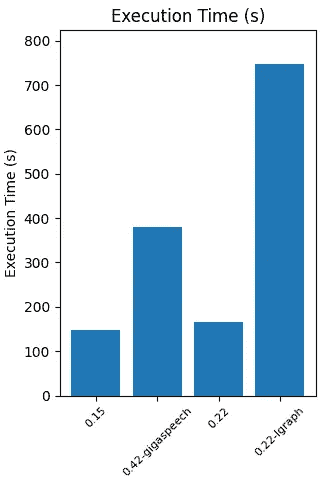

# Vosk：高效企业级语音识别的评估与实施指南

> 原文：[`towardsdatascience.com/vosk-for-efficient-enterprise-grade-speech-recognition-an-evaluation-and-implementation-guide-87a599217a6c`](https://towardsdatascience.com/vosk-for-efficient-enterprise-grade-speech-recognition-an-evaluation-and-implementation-guide-87a599217a6c)

## 对实现和评估基于 Vosk 的语音识别系统的全面指南

[](https://medium.com/@luisroque?source=post_page-----87a599217a6c--------------------------------)[](https://towardsdatascience.com/?source=post_page-----87a599217a6c--------------------------------) [Luís Roque](https://medium.com/@luisroque?source=post_page-----87a599217a6c--------------------------------)

·发表于 [Towards Data Science](https://towardsdatascience.com/?source=post_page-----87a599217a6c--------------------------------) ·9 分钟阅读·2023 年 5 月 15 日

--

# 引言

在我们最新的文章中，我们广泛地使用了不同的模型和方法来进行语音识别。开源社区在过去几年中一直在开发这方面的解决方案，给我们提供了许多选择。我们尝试了 Whisper、WhisperX 和 Whisper-JAX。它们都基于最近由 OpenAI 训练并开源的 Whisper 模型。它是一个在多语言和多任务上训练的自动语音识别（ASR）系统，使其在语音甚至语言任务中都具有通用性。

Whisper 的一个缺点是运行所需的资源，特别是在较长音频文件的执行时间方面。在本文中，我们将引导你通过使用 Vosk，一个开源离线语音识别工具包，来开发企业级语音识别模型。这些模型显著更快，在许多使用案例中，这是一个决定性因素。

我们深入探讨了四个 Vosk 语音识别模型的性能，突出了它们在准确性、执行时间和模型大小方面的优缺点。我们的发现揭示了有趣的见解，比如从较小的模型过渡到更大的模型时准确性提高了 20%。我们还揭示了速度和准确性之间的权衡。


图 1：语音转文本使我们更接近机器（[来源](https://unsplash.com/photos/zoG585VYsV8)）

本文属于“**大型语言模型编年史：探索 NLP 前沿**”这一新周刊系列文章，将探讨如何利用大型模型的力量来处理各种 NLP 任务。通过深入研究这些前沿技术，我们旨在帮助开发者、研究人员和爱好者掌握 NLP 的潜力，开启新的可能性。

到目前为止发表的文章：

1.  [使用 ChatGPT 总结最新的 Spotify 发布内容](https://medium.com/towards-data-science/summarizing-the-latest-spotify-releases-with-chatgpt-553245a6df88)

1.  [在大规模下掌握语义搜索：使用 FAISS 和 Sentence Transformers 索引数百万文档，实现闪电般快速的推理时间](https://medium.com/towards-data-science/master-semantic-search-at-scale-index-millions-of-documents-with-lightning-fast-inference-times-fa395e4efd88)

1.  [释放音频数据的力量：使用 Whisper、WhisperX 和 PyAnnotate 进行高级转录和分段](https://medium.com/towards-data-science/unlock-the-power-of-audio-data-advanced-transcription-and-diarization-with-whisper-whisperx-and-ed9424307281)

1.  [Whisper JAX 与 PyTorch：揭示 GPU 上 ASR 性能的真相](https://medium.com/towards-data-science/whisper-jax-vs-pytorch-uncovering-the-truth-about-asr-performance-on-gpus-8794ba7a42f5)

一如既往，代码可在我的 [Github](https://github.com/luisroque/large_laguage_models) 上找到。

# 理解语音识别

语音识别是使计算机和其他设备能够理解和处理人类语音的技术，将口语转换为书面文本。这些系统学习将语音转换为文本的过程包括几个步骤。它们自动提取原始音频波形，实质上是音频信号的声学特征。然后，它们将这些特征映射到音素，并使用语言模型将音素映射到单词。更先进的系统还结合了上下文信息和语义理解，以精炼转录结果。

语音识别面临着许多挑战，因为人类语音的复杂性以及引入变异性和模糊性的因素。一些挑战包括说话人变异、背景噪声、言语流畅性问题和填充词、以及同音词和共鸣现象。说话人变异源于不同说话人的独特口音、说话风格和发音。背景噪声，如嘈杂环境中的噪音，会干扰语音信号的清晰度，对准确识别构成挑战。言语流畅性问题和填充词是另一个障碍，因为在自然语言中常出现犹豫、重复和填充词（例如“呃”和“嗯”）。最后，同音词和共鸣现象带来额外的障碍。一些单词发音相同但含义不同（同音词）。另一些单词的发音可能会根据其在句子中的位置而改变（共鸣现象）。所有这些因素都为识别任务引入了模糊性，使得我们的模型在某些任务中更难准确执行。

# 《构建企业级语音识别模型的实用指南》

我们利用 Vosk 的强大功能，这是一个开源的离线语音识别工具包，用于构建自定义语音识别系统。Vosk 提供了一个灵活高效的解决方案，能够在包括 Android、iOS、Windows、Linux 和 Raspberry Pi 等各种平台上实现语音识别。其关键特性包括支持多种语言、说话人识别、与小型设备兼容以及大规模服务器部署。

在接下来的部分中，我们将指导您如何使用 Vosk 创建语音识别系统。我们将讨论流行的框架和库，概述数据收集、预处理和模型训练的步骤，并提供针对特定用例的模型微调技巧。

## 数据收集

为了评估不同的模型，我们将使用 [LibriSpeech](https://www.openslr.org/12) ASR 语料库数据集（CC BY 4.0）。该数据集包括大约 1000 小时的朗读英语语音录音。LibriSpeech 数据集非常适合用来评估语音识别模型，因为它提供了多种口音、说话风格、发音和背景噪声。正如我们之前讨论的，这些因素通常会对模型的表现产生重大影响。我们希望测试 Vosk 是否能够在这些具有挑战性的环境中有效工作。

## 转录与单词表示

Vosk API 非常丰富；我们可以访问每个转录单词的几个属性。它返回以下属性：

+   `conf`：识别单词的置信度，范围从 0 到 1。

+   `start`：发音开始时间，以秒为单位。

+   `end`：发音结束时间，以秒为单位。

+   `word`：识别出的单词。

为了简化我们的过程，我们创建了一个 `WordVosk` 类，用于表示 Vosk API 返回的每个单词：

```py
class WordVosk:
    """A class representing a word from the JSON format for Vosk speech recognition API."""

    def __init__(self, conf: float, start: float, end: float, word: str) -> None:
        """
        Initialize a Word object.

        Args:
            conf (float): Degree of confidence, from 0 to 1.
            start (float): Start time of pronouncing the word, in seconds.
            end (float): End time of pronouncing the word, in seconds.
            word (str): Recognized word.
        """
        self.conf = conf
        self.start = start
        self.end = end
        self.word = word

    def to_dict(self) -> Dict[str, Union[float, str]]:
        """Return a dictionary representation of the Word object."""
        return {
            "conf": self.conf,
            "start": self.start,
            "end": self.end,
            "word": self.word,
        }

    def to_string(self) -> str:
        """Return a string describing this instance."""
        return "{:20} from {:.2f} sec to {:.2f} sec, confidence is {:.2f}%".format(
            self.word, self.start, self.end, self.conf * 100
        )

    def to_json(self) -> str:
        """Return a JSON representation of the Word object."""
        return json.dumps(self, default=lambda o: o.__dict__, sort_keys=True)
```

由于我们主要关注获取转录，我们创建了一个 `Transcription` 类，该类接受一个 `WordVosk` 对象的列表。`to_raw_text` 方法生成最终的原始转录：

```py
class Transcription:
    def __init__(self, words: List[WordVosk]) -> None:
        self.words = words

    def to_dict(self) -> List[Dict[str, Union[float, str]]]:
        """Return a dictionary representation of the Transcription object."""
        return [word.to_dict() for word in self.words]

    def to_raw_text(self) -> str:
        """Generate raw transcription text from the list of WordVosk objects."""
        return " ".join(word.word for word in self.words)
```

这些类有助于更高效地管理 Vosk 语音识别 API 的输出，从而更方便地处理转录结果。

## 实现主模型类

`ModelSpeechToText` 类旨在使用 Vosk API 处理语音转文本转换。它接受一个音频文件和一个 Vosk 模型作为输入，并返回一个转录后的单词列表。

```py
class ModelSpeechToText:
    def __init__(self, audio_path: str, model_path: str) -> None:
        self.audio_path = audio_path
        self.wf = wave.open(self.audio_path)
        self.model = Model(model_path)
```

`speech_to_text` 方法使用 Vosk API 将语音转录为文本。它按块读取音频文件，并使用 `KaldiRecognizer` 处理每块。转录结果被收集到 `results` 列表中。

```py
 def speech_to_text(self) -> List[Dict[str, Any]]:
        """Transcribe speech to text using the Vosk API."""
        rec = KaldiRecognizer(self.model, self.wf.getframerate())
        rec.SetWords(True)

        results = []
        frames_per_second = 44100
        i = 0
        print("Starting transcription process...")
        while True:
            data = self.wf.readframes(4000)
            i += 4000
            if len(data) == 0:
                break
            if rec.AcceptWaveform(data):
                part_result = json.loads(rec.Result())
                results.append(part_result)
            if i % (frames_per_second * 60) == 0:
                print(f"{i / frames_per_second / 60} minutes processed")
        part_result = json.loads(rec.FinalResult())
        results.append(part_result)
        self.wf.close()
        print("Transcription process completed.")
        return results
```

`results_to_words` 方法接受转录结果，并将其转换为 `WordVosk` 对象的列表。这个方法使我们能够轻松地处理和处理转录后的单词。

```py
 @staticmethod
    def results_to_words(results: List[Dict[str, Any]]) -> List[WordVosk]:
        """Convert a list of Vosk API results to a list of words."""
        list_of_words = []
        for sentence in results:
            if len(sentence) == 1:
                continue
            for ind_res in sentence["result"]:
                word = WordVosk(
                    conf=ind_res["conf"],
                    start=ind_res["start"],
                    end=ind_res["end"],
                    word=ind_res["word"],
                )

                list_of_words.append(word)
        return list_of_words
```

`ModelSpeechToText` 是我们高效使用 Vosk API 所需的最终抽象。它允许我们对音频文件进行转录，并获得转录后的单词列表，这些单词以 `WordVosk` 对象的形式表示。

## 使用字错误率评估语音识别模型

要评估语音识别模型，我们可以使用字错误率（WER）指标。它是将假设转录转换为参考转录所需的插入、删除和替换的平均数量，除以参考转录中的总单词数。WER 值越低，表示性能越好。

`calculate_wer` 函数计算参考转录和假设转录之间的平均 WER：

```py
def calculate_wer(
    reference_transcriptions: List[str], hypothesis_transcriptions: List[str]
) -> float:
    """Calculate the average Word Error Rate (WER) between reference and hypothesis transcriptions.

    Args:
        reference_transcriptions: List of reference transcriptions.
        hypothesis_transcriptions: List of hypothesis transcriptions.

    Returns:
        The average Word Error Rate (WER).
    """
    assert len(reference_transcriptions) == len(
        hypothesis_transcriptions
    ), "Reference and hypothesis lists should have the same length"
    total_wer = 0
    for ref, hyp in zip(reference_transcriptions, hypothesis_transcriptions):
        total_wer += wer(ref, hyp)
    return total_wer / len(reference_transcriptions)
```

`evaluate_models` 函数使用给定的评估数据集评估多个语音识别模型：

```py
def evaluate_models(
    models: List[ModelSpeechToText],
    evaluation_dataset: List[Tuple[str, str]],
) -> List[Tuple[float, float, float]]:
    """Evaluate multiple speech-to-text models using a given evaluation dataset.

    Args:
        models: A list of ModelSpeechToText instances.
        evaluation_dataset: A list of tuples containing the paths of the WAV files and their transcriptions.

    Returns:
        A list of tuples containing WER, execution time, and RAM usage for each model.
    """
    if not evaluation_dataset:
        print("The evaluation dataset is empty. Please check the dataset processing.")
        return []

    audio_files, reference_transcriptions = zip(*evaluation_dataset)

    metrics = []
    for model in models:
        start_time = time.time()

        hypothesis_transcriptions = transcribe_audio_files(model, audio_files)

        memory = psutil.Process().memory_info().rss
        elapsed_time = time.time() - start_time

        wer = calculate_wer(reference_transcriptions, hypothesis_transcriptions)

        metrics.append((wer, elapsed_time, memory / 1024 ** 3))

        del model
        gc.collect()

    return metrics
```

# 评估 Vosk 语音识别模型：准确性、执行时间和内存消耗

首先，让我们介绍一下我们正在测试的四个模型。这些模型在大小和复杂性上有所不同，这可能会影响它们的性能。我们从准确性、执行时间和内存消耗方面对它们进行了比较。这些模型及其各自的大小如下：

1.  vosk-model-small-en-us-0.15（大小：40M）

1.  vosk-model-en-us-0.22（大小：1.8G）

1.  vosk-model-en-us-0.22-lgraph（大小：128M）

1.  vosk-model-en-us-0.42-gigaspeech（大小：2.3G）

## 比较模型性能

在对含有丰富口音和复杂句子的 数据集 上评估四种 Vosk 模型后，我们观察到了它们性能的显著差异。就准确性而言，最佳模型是 0.42-gigaspeech 和 0.22，其中后者相比更小的 0.15 和 0.22-lgraph 模型的准确性提高了约 20%。这种改进可以归因于 0.42-gigaspeech 和 0.22 模型的更大尺寸，使它们能够更好地处理各种口音和复杂的语言结构。


图 2：每个测试模型的词错误率（WER）（图片由作者提供）

在执行时间方面，0.22 和 0.15 模型表现最佳，完成转录过程大约需要 150 秒。另一方面，0.22-lgraph 模型所需时间较长，超过 750 秒。这突显了准确性和速度之间的有趣权衡，0.22 模型作为一个吸引人的选择，在性能和准确性之间达到了良好的平衡。



图 3：每个测试模型的执行时间（图片由作者提供）

考虑到结果，0.22 模型提供了准确性和效率的有希望的组合，使其适用于广泛的应用场景。

# 结论

在这篇文章中，我们评估了四种不同的 Vosk 语音识别模型，以比较它们在准确性和执行时间方面的表现。我们观察到，0.42-gigaspeech 和 0.22 模型的准确性优越，其中 0.22 模型比较小的 0.15 和 0.22-lgraph 模型表现出 20%的改进。这一改进归因于 0.42-gigaspeech 和 0.22 模型的更大尺寸，使它们能够更好地处理不同的口音和复杂的语言结构。

在考虑执行时间时，0.22 和 0.15 模型表现最佳。特别是 0.22 模型，作为一个吸引人的选择，它在性能和准确性之间达到了良好的平衡。需要注意的是，选择最佳模型取决于每个项目的具体要求。始终考虑速度和准确性之间的权衡。

保持联系：[LinkedIn](https://www.linkedin.com/in/luisbrasroque/)
