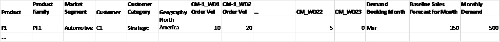
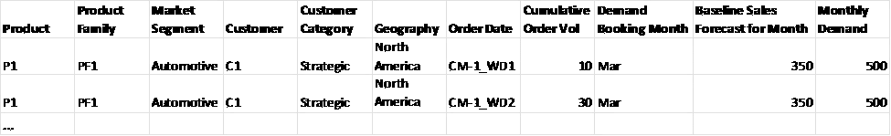
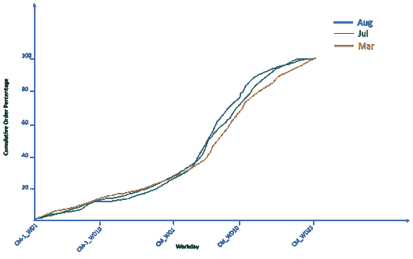
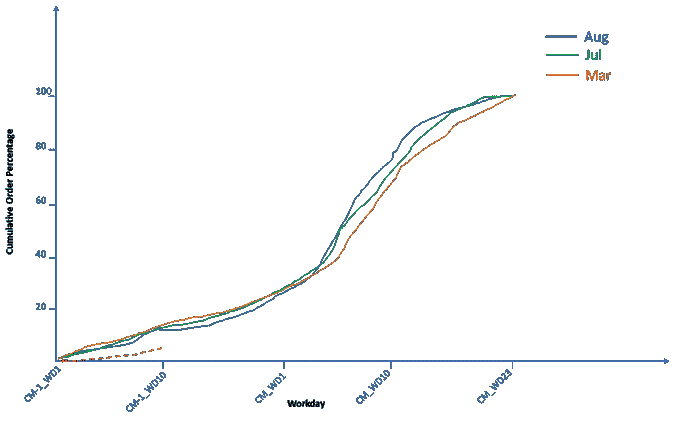
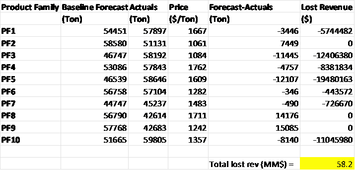

# 想提升你的短期预测？试试需求感知

> 原文：[`towardsdatascience.com/want-to-improve-your-short-term-forecasting-try-demand-sensing-50baa4380de3`](https://towardsdatascience.com/want-to-improve-your-short-term-forecasting-try-demand-sensing-50baa4380de3)

## 当传统的预测方法在准确性上达到瓶颈时，我们如何推动进一步的改进？

 [Ramkumar K](https://medium.com/@rkumar5680?source=post_page-----50baa4380de3--------------------------------)

·发布在[Towards Data Science](https://towardsdatascience.com/?source=post_page-----50baa4380de3--------------------------------) ·12 分钟阅读·2023 年 6 月 20 日

--

照片由[JJ Ying](https://unsplash.com/@jjying?utm_source=medium&utm_medium=referral)拍摄，发布在[Unsplash](https://unsplash.com/?utm_source=medium&utm_medium=referral)上。

# 介绍

需求预测是一个估算组织在未来某一时间范围内销售情况的过程。短期需求预测通常考虑 1–3 个月的时间范围，而中期预测可以涵盖 6–18 个月。长期预测通常可以达到 3–5 年。预测帮助企业决定销售什么、何时销售以及销售多少，持有多少库存，并确定未来在容量上的投资以应对动态的客户需求。公司通常依赖于历史趋势，并结合客户的反馈，同时考虑促销活动或清仓销售来创建需求预测。

需求预测重要的原因有几个。它位于销售与运营规划（S&OP）过程的顶端，在这个阶段生成的预测会传递到其他阶段，包括供应规划、生产调度、物流规划和库存优化。需求预测的准确性至关重要，以避免由于库存过多或过少而产生的成本。预测过高可能导致过多的流动资金被锁定在库存中。另一方面，持续的预测不足可能会导致库存短缺或需要在紧急情况下使用更昂贵的原材料进行订单处理，并且需要在短时间内通过更昂贵的运输进行发货。准确的计划有助于避免这些情况，通过驱动在正确的地点和时间制造适量的产品，促进高服务水平和降低储存成本。

# 挑战在预测中

*“预测是非常困难的，特别是当它涉及未来时。”*

这句名言通常归于 20 世纪的杰出物理学家尼尔斯·玻尔（虽然是否确实是他所说还有一些争议），虽然这是对预测的轻松看法，但它突显了预测的内在挑战。除了无法预测未来，还有其他与预测方法相关的挑战。

· 商业环境的变化 — 例如，替代品可能会取代某个产品，从而导致其需求下降。或者，产品的新应用可能会导致需求相比历史趋势上升。

· 商业模式的变化 — 组织可能会改变其运营模式和商业战略。例如，一家化工公司可能选择将其业务从普通化学品转向更多的特种产品，因此历史需求模式可能不再适用。

· 数据可用性 — 历史销售数据、客户和产品层级数据以及实时订单数据可能存储在不同的系统中。

· 数据质量 — 这可能包括由于输入错误导致的不准确数据，或数据在不同数据元素之间以不同且不一致的粒度进行捕获的问题。

# 预测方法

由 [Chris Liverani](https://unsplash.com/@chrisliverani?utm_source=medium&utm_medium=referral) 拍摄的照片，刊登在 [Unsplash](https://unsplash.com/?utm_source=medium&utm_medium=referral)

预测可以基于定量或定性方法。定量方法主要是时间序列分析，我们尝试基于历史数据捕捉趋势（例如增长、季节性）。在其他定量情况下，我们可能会构建经济计量模型，将需求预测与业务相关因素相关联。采用定性方法时，我们依赖于“群体智慧”，并尝试基于专家的集体意见或调查来估计未来。网络上有许多关于预测技术的有见地的资源；以下是部分示例：

 [## 需求预测方法终极指南：提升销售和优化库存 - nexocode

### 在我们的指南中发现需求预测的秘密！了解方法、挑战、好处以及人工智能的作用……

nexocode.com](https://nexocode.com/blog/posts/what-is-demand-forecasting/?source=post_page-----50baa4380de3--------------------------------)  [## 需求预测：你需要知道的一切

### 对于在快速增长或动荡市场中的公司来说，需求预测至关重要，因为它帮助他们了解未来的……

www.netsuite.com](https://www.netsuite.com/portal/resource/articles/inventory-management/demand-forecasting.shtml?source=post_page-----50baa4380de3--------------------------------)  [## 如何选择合适的预测技术

### 每位经理应了解不同类型的预测及其使用时机。

hbr.org](https://hbr.org/1971/07/how-to-choose-the-right-forecasting-technique?source=post_page-----50baa4380de3--------------------------------)  [## 6 种需求预测及其预期收益

### 需求预测帮助企业做出更明智的库存和能力决策。我们回顾了需求的类型…

www.thefulfillmentlab.com](https://www.thefulfillmentlab.com/blog/demand-forecasting?source=post_page-----50baa4380de3--------------------------------)

# 短期需求感知

短期需求感知是一种利用领先指标预测产品销售的预测技术，主要在短期内进行预测。它结合了历史数据和实时信息，以每日或每周为单位进行预测。通过这种方式，它捕捉到市场中的一些关键动态，尤其是在波动时期。因此，它帮助计划人员调整生产和物流计划，使预测更精确，从而提高供应链的韧性，并减少库存和运输成本。关于需求感知的在线资源有很多，以下是一些例子：

 [## 什么是需求感知 - AI/ML 解决方案与服务 | 顶级 Google Cloud 合作伙伴

### 参数 传统需求预测 需求感知 传统的需求预测方法依赖于历史数据…

pluto7.com](https://pluto7.com/what-is-demand-sensing/?source=post_page-----50baa4380de3--------------------------------)  [## 文章 - Kearney

### 编辑描述

www.kearney.com](https://www.kearney.com/service/analytics/article/-/insights/modern-retail-requires-modern-demand-sensing?source=post_page-----50baa4380de3--------------------------------)

需求感知预计将具有很高的经济价值（在节省成本或避免收入损失方面），仅仅因为运输量的巨大。由于预测的粒度和刷新频率，需求感知可能在数据和计算上非常密集。但是随着计算能力的提升，预计可行性会很高。需求感知的结果通常具有较高的解释性，因为我们通常使用基于线性回归的模型进行这些应用。结果往往可以分析得很清楚，从而向利益相关者解释预测。需求感知提供的预测更新建议是可操作的，因为更改生产基于预测变化是组织的内部决策。需求感知应用在输入数据刷新方面也大多是可持续的，因为它们依赖于每日生成的实时订单数据。

# 一个简化的需求感知方法

需求感知依赖相关的领先指标来估计销售预测。客户订单的下达速度可能是短期需求的一个领先指标。在一些行业，如石化行业，客户通常会提前几周下订单以进行预定。在本文中，我们讨论了一种基于客户订单的需求感知方法，适用于化工公司。

在这种方法中，前提是如果订单的下达速度比历史订单下达趋势更快，最终的月需求量将会很高，反之亦然。建议的做法是通过在每个月中旬进行客户订单趋势分析，以预测下个月的产品需求，从而增强传统的预测过程。这种提前的洞察对于供应链和产品经理在调整生产和定价方面将非常有帮助。分析还会识别那些可能下订单低于预测的客户，从而使剩余的量可以提供给那些希望购买超出其预测量的客户。这将有助于主动“调换”两个客户群体之间的产品，减少订单阻塞和延迟，并提升客户体验。

为了构建一个*需求感知*用例的机器学习解决方案，我们遵循一系列步骤，包括数据收集、探索性数据分析、数据处理（清洗和特征工程）、模型开发和优化、可操作的洞察以及建议。主要目标是基于客户订单属性，以给定的粒度（例如产品系列、客户类别）预测*当前和下个月*的需求。每个步骤的详细信息列在下面：

**a. 数据收集** — 根据在商品公司环境中这一用例的典型情况，我们假设每个产品（或产品系列）都有数十或数百个客户提前下订单。为了捕捉客户订单的年度和季节性趋势，我们收集至少过去 36 个月的数据。我们收集包括请求量、销售订单日期、需求预定月份、客户信息（包括客户类别和地理位置）、产品属性（包括产品系列、市场细分）的销售订单。我们从需求预定月份开始，寻找从前一个月的第一个工作日（CM-1）到需求预定月份结束（CM）期间每天（工作日，排除周末和节假日）的总产品需求量。这假设在该日期之前没有订单（前一个月的第一个工作日）。我们还需要从分析中去除取消订单或退货订单。表 1 显示了数据框中的样本数据。

表 1\. 来自历史销售订单的样本数据（数据框格式）

*WD — 工作日*

**b. 探索性数据分析** — 我们首先了解数据的大小（行和列）以及特征的数量和类型（数值型 vs 分类型）。我们还识别每列中的空值数量。我们通过直方图和箱线图可视化数值列，以查看数据的形状（包括均值、中位数、偏度、异常值），通过条形图可视化分类数据，以确认唯一值并识别需要处理的任何异常值。

**c. 数据处理** — 在此步骤中，我们去除异常值（例如，数值列中的负值或极高值）。我们还选择特征并进行特征工程。在这个用例中，我们选择的特征是在预测变量之上的更高层次的聚合。例如，如果我们预测产品系列需求，我们选择市场细分、地理位置、累计订单量和每月基线销售预测作为预测特征。给定工作日的累计订单（表 2）是通过日订单量作为特征工程的一部分得出的。图 1 显示了累计订单如何随工作日变化的示例。

表 2\. 历史订单数据框（具有特征工程属性）

图 1\. 选择月份的工作日累计订单百分比

**d. 模型开发与优化** — 推荐使用多元线性回归来处理这种情况。预计这是一个‘分段’解决方案，其中我们为每个工作日有不同的回归函数。通过 36 个月的数据，每个产品系列有数百个客户，我们将为每个产品系列拥有数千个训练数据点。我们从定义损失函数开始，以帮助我们建立提供最准确需求预测的模型。我们选择几个准确性测量指标，包括平均绝对误差（MAE）、平均绝对百分比误差（MAPE）和 R2，并测试不同模型在这些指标上的表现（我们希望 R2 高而误差低）。原始误差只是月度需求预测与产品系列历史实际值之间的差异。在数据准备方面，我们首先将数据分为训练集（80%的数据）和测试集（20%的数据）。缺失或空值在每个数据集中分别处理，以避免数据泄露。如果缺失值占特征的大部分，我们可能会完全删除该特征，因为它几乎没有预测能力。如果空值只出现在少数几行中，我们可以删除这些缺失值的行。我们也可以用中央趋势来填补缺失值，比如列的中位数（如果是数值型）或众数（如果是分类变量）。此外，我们还将分类变量转换为*独热编码*的数值格式。为了将数据缩放到线性回归模型中，我们将因变量（每月需求预测）除以基线销售预测，并将累计订单（自变量）除以基线销售预测。回归模型系数提供了特征在解释预测变量变化中的重要性。

**e. 可操作的见解和建议** — AI 应用预测的需求可能高于或低于基线销售预测。为向利益相关者解释结果，一种方法是将历史订单曲线与实时订单进行比较（见图 2）。

图 2\. 累计订单百分比比较：历史数据与实时数据

*这里仅展示了 3 个月的历史累计订单百分比曲线以作说明；在实际讨论中，我们会包含至少 12 个月的数据。*

在该图中，历史累计订单百分比曲线以实线绘制，而实时累计订单（作为下个月基线销售预测的百分比）则以虚线绘制。我们可以看到，在选择的历史月份中，大约 12%的总需求在前一个月的第 10 个工作日已下单，但我们当前的趋势约为 5%的预测，表明需求比基线预测预期的要低。以此例子为例，通过更新需求预测获得利益相关者的支持后，我们可以通知决策者减少相关产品系列的生产，同时识别出下单低于其提供的预测的客户。一般来说，预测可以每天运行，以向制造部门提供生产和库存信号，并向销售团队提供需求弱点或强度的信号。人工智能/机器学习模型可以每季度重新训练一次或在业务重组时进行重新训练。

# 经济价值估算

图片由 [Ibrahim Boran](https://unsplash.com/@ibrahimboran?utm_source=medium&utm_medium=referral) 提供，来自 [Unsplash](https://unsplash.com/?utm_source=medium&utm_medium=referral)

预测不准确的货币化思路可以通过库存短缺导致的收入损失和由于过剩未售库存而增加的储存成本来考虑。虽然预测波动在较长时间内可能会平衡，但预测的一致性偏差可能会导致产品组合的不平衡。短期库存短缺的收入损失可能对业务产生长期影响，如果客户选择永久离开组织而转向竞争对手。我们通过下表中的简单例子来说明收入损失，其中一个关键假设是组织没有足够的库存来覆盖预测不准确性。该表提供了基线预测（未应用人工智能）和每月来自客户的实际需求，涵盖了 10 个产品系列：PF1 到 PF10。每个产品系列的价格也提供了。这些数字的规模代表了商品化学品。

表 3\. 假设性示例以说明由于预测不准确而导致的收入损失

我们可以看到，对于一些产品，我们的预测过高（预测 > 实际），而对于其他产品，我们的预测过低（预测 < 实际）。对于预测不足的产品，我们假设缺乏库存来弥补这一不足，并通过将价格与缺口相乘来计算损失的收入。总的损失收入估计约为 ~$58MM。通过一个能够利用每日实时订单感知未来每月需求的 AI 应用，更新预测并生产适量的产品，我们可以减少这一损失收入。即便预测误差改善 20%（这种应用中并不罕见），组织每月的损失收入也会减少$11.6MM。

# 总结

使用实时客户订单进行短期需求感知可能比传统预测方法更进一步，因为它利用实时信息来提高预测的准确性。不过，我们需要注意的是，这种方法可能并不适用于所有用例或业务情况。当订购模式有一定规律且订单提前下达时，这种方法效果最佳。结合市场情报来理解观察背后的商业洞察，这种技术效果更佳。由于客户通常不会提前下单超过 6-8 周，因此该方法不适用于更长期的预测。

本文中描述的方法也可以用于其他目的。例如，我们可以使用这种方法来估计每个客户/产品组合之间的预期需求和实际订单的偏差。这可以帮助识别那些下单量过少或过多的客户，这些订单量与其基线销售预测相比偏离了历史订购模式。

最后，我们希望建立机制，以便在更新的预测可用时采取行动。这可能包括增加/减少生产量或跟进那些超出预测分配量或尚未提取任何量的客户。

感谢阅读。希望你觉得这篇文章有用。欢迎将你的评论发送至 rkumar5680@gmail.com。我们可以在 [LinkedIn](https://www.linkedin.com/in/ramkumar-karuppiah-4458414/) 上联系。
