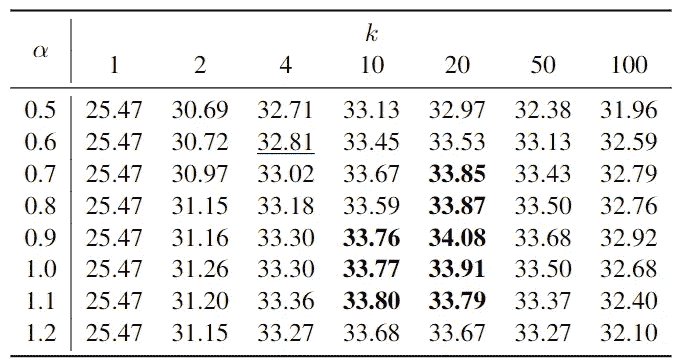

# 注意你的束搜索超参数

> 原文：[`towardsdatascience.com/watch-out-for-your-beam-search-hyperparameters-9c4daf6668d6`](https://towardsdatascience.com/watch-out-for-your-beam-search-hyperparameters-9c4daf6668d6)

## 默认值永远不是最佳的

[](https://medium.com/@bnjmn_marie?source=post_page-----9c4daf6668d6--------------------------------)[](https://towardsdatascience.com/?source=post_page-----9c4daf6668d6--------------------------------) [Benjamin Marie](https://medium.com/@bnjmn_marie?source=post_page-----9c4daf6668d6--------------------------------)

·发表于[Towards Data Science](https://towardsdatascience.com/?source=post_page-----9c4daf6668d6--------------------------------) ·阅读时间 6 分钟·2023 年 1 月 11 日

--


图片由[Paulius Dragunas](https://unsplash.com/@paulius005?utm_source=medium&utm_medium=referral)提供，来源于[Unsplash](https://unsplash.com/?utm_source=medium&utm_medium=referral)

在使用神经模型开发应用时，尝试不同的超参数来训练模型是很常见的。

例如，学习率、学习计划和丢弃率是对模型学习曲线产生重要影响的超参数。

更少见的是**最佳解码超参数**的搜索。如果你阅读深度学习教程或处理自然语言处理应用的科学论文，很可能**用于推理的超参数甚至未被提及**。

大多数作者，包括我自己，不会费心寻找最佳解码超参数，而是使用默认值。

然而，这些超参数实际上可能对结果产生显著影响，无论你使用什么解码算法，总会有一些**需要微调以获得更好结果的超参数**。

在这篇博客文章中，我展示了使用简单 Python 示例和机器翻译应用程序的解码超参数的影响。我专注于束搜索，因为这是迄今为止最受欢迎的解码算法，以及两个特定的超参数。

# 框架和要求

为了展示每个超参数的效果和重要性，我将展示一些使用[Hugging Face Transformers 包](https://huggingface.co/docs/transformers/index)在 Python 中生成的示例。

要安装此包，请在终端中运行以下命令（我建议在单独的 conda 环境中执行）：

```py
pip install transformers
```

我将使用 GPT-2（MIT 许可证）生成简单句子。

我还将使用 Marian (MIT 许可证) 运行其他机器翻译示例。我在 Ubuntu 20.04 上安装了它，按照[官方说明](https://marian-nmt.github.io/docs/)。

# Beam Size 和 Length Penalty

Beam search 可能是语言生成任务中最受欢迎的解码算法。

它在每一步，即为每个新生成的标记，保持模型推断中*最可能的*k 个假设，其余的假设被丢弃。

最终，在解码结束时，概率最高的假设将作为输出。

*k*，通常称为“beam size”，是一个非常重要的超参数。

**更高的*k*会得到更可能的假设**。注意，当*k*=1 时，我们称之为“贪心搜索”，因为我们只保留每一步中最可能的假设。

默认情况下，在大多数应用中，*k* 是**任意**设置在 1 到 10 之间。这个值可能看起来非常低。

这有两个主要原因：

+   增加 *k* **会增加解码时间和内存**需求。换句话说，它变得更加昂贵。

+   更高的 *k* **可能会产生更可能但更差的结果**。这主要是由于假设的长度，但不仅仅是由于长度。**较长的假设往往概率较低**，因此 beam search 会倾向于促进较短的假设，这对于某些应用可能不太可能。

第一点可以通过进行更好的批量解码和投资更好的硬件来直接解决。

长度偏差可以通过另一个超参数来控制，该超参数通过每一步的长度（标记数）来标准化假设的概率。执行这种标准化的方法有很多。最常用的方程之一是由[Wu et al. (2016)](https://arxiv.org/pdf/1609.08144.pdf) 提出的：

```py
lp(Y) = (5 + |Y|)α / (5 + 1)α
```

其中 |Y| 是假设的长度，*α* 是一个通常设置在 0.5 和 1.0 之间的超参数。

然后，分数 lp(Y) 用来修改假设的概率，以便在给定 *α* 的情况下，偏向于解码并生成较长或较短的假设。

Hugging Face transformers 中的实现可能略有不同，但有一个*α*可以作为“length_penalty”传递给*generate*函数，如以下示例所示（改编自[Transformers’ documentation](https://huggingface.co/docs/transformers/main_classes/text_generation)）：

```py
from transformers import AutoTokenizer, AutoModelForCausalLM

#Download and load the tokenizer and model for gpt2
tokenizer = AutoTokenizer.from_pretrained("gpt2")
model = AutoModelForCausalLM.from_pretrained("gpt2")

#Prompt that will initiate the inference
prompt = "Today I believe we can finally"

#Encoding the prompt with tokenizer
input_ids = tokenizer(prompt, return_tensors="pt").input_ids

#Generate up to 30 tokens
outputs = model.generate(input_ids, length_penalty=0.5, num_beams=4, max_length=20)

#Decode the output into something readable
print(tokenizer.batch_decode(outputs, skip_special_tokens=True))
```

这个代码示例中的“num_beams”是我们的另一个超参数*k*。

使用这个代码示例，提示“Today I believe we can finally”，k=4 和 α=0.5 时，我们得到：

```py
outputs = model.generate(input_ids, length_penalty=0.5, num_beams=4, max_length=20)
```

```py
Today I believe we can finally get to the point where we can make the world a better place.
```

当 k=50 和 α=1.0 时，我们得到：

```py
outputs = model.generate(input_ids, length_penalty=1.0, num_beams=50, max_length=30)
```

```py
Today I believe we can finally get to where we need to be," he said.\n\n"
```

你可以看到结果并不完全相同。

***k*和*α*应在你的目标任务上独立微调**，使用一些开发数据集。

让我们在机器翻译中举一个具体的例子，看看如何进行简单的*网格搜索*来找到最佳超参数及其在实际应用中的影响。

# 机器翻译实验

在这些实验中，我使用了 Marian 和训练在 [TILDE RAPID 语料库](https://tilde-model.s3-eu-west-1.amazonaws.com/Tilde_MODEL_Corpus.html)（CC-BY 4.0）上的机器翻译模型进行法语到英语的翻译。

我仅使用了数据集的前 100k 行进行训练，最后的 6k 行作为开发测试集。我将开发测试集分成两部分，每部分 3k 行：第一部分用于验证，第二部分用于评估。注意：*RAPID 语料库的句子按字母顺序排列。因此，我的训练/开发测试集划分在实际使用案例中并不理想。我建议在划分语料库之前，先打乱语料库的行顺序，同时保留句子对。在本文中，我保持了字母顺序，并没有打乱，以使以下实验更具可重复性。*

我使用 [COMET](https://unbabel.github.io/COMET/html/index.html)（Apache 许可证 2.0）来评估翻译质量。

要通过网格搜索来寻找 *k* 和 *α* 的最佳值对，我们首先必须定义每个超参数的一组值，然后尝试所有可能的组合。

由于我们在这里搜索的是解码超参数，因此这一搜索相对快速且直接，与搜索训练超参数相比。

我为此任务选择的值集如下：

+   *k*: {1,2,**4**,10,20,50,100}

+   *α*: {0.5,**0.6**,0.7,0.8,1.0,1.1,1.2}

我将机器翻译中默认使用的最常见值加粗。对于大多数自然语言生成任务，应该尝试这些值集，除了 k=100，通常这个值不容易产生最佳结果，同时解码代价较高。

我们有 7 个 *k* 的值和 7 个 *α* 的值。我们想尝试所有组合，所以我们需要对评估数据集进行 7*7=49 次解码。

我们可以通过一个简单的 bash 脚本来实现：

```py
for k in 1 2 4 10 20 50 100 ; do
  for a in 0.5 0.6 0.7 0.8 0.9 1.0 1.1 1.2 ; do
    marian-decoder -m model.npz -n $a -b $k  -c model.npz.decoder.yml < test.fr > test.en
  done;
done;
```

然后，对每个解码输出运行 COMET 以评估翻译质量。

根据所有结果，我们可以绘制出每对值的 COMET 分数表：



作者提供的表格

如你所见，使用默认超参数（下划线）获得的结果低于 26 个其他超参数值获得的结果。

实际上，所有加粗的结果在统计上都**显著优于**默认结果。注意：*在这些实验中，我使用了测试集来计算表中展示的结果。在实际情况中，这些结果应该在另一个开发/验证集上计算，以决定在测试集上使用的值对，或用于真实世界应用。*

因此，对于你的应用程序，确实值得微调解码超参数，以在付出非常小的工程努力的情况下获得更好的结果。

# 结论

在这篇文章中，我们只调整了 beam search 的两个超参数。还应微调更多参数。

其他解码算法，如温度采样和核采样，具有一些超参数，你可能想要查看这些参数，而不是使用默认值。

显然，随着我们增加超参数的数量进行调整，网格搜索的成本会更高。只有你**在应用中的经验和实验**才能告诉你是否值得对特定的超参数进行调整，以及哪些值更有可能产生令人满意的结果。
