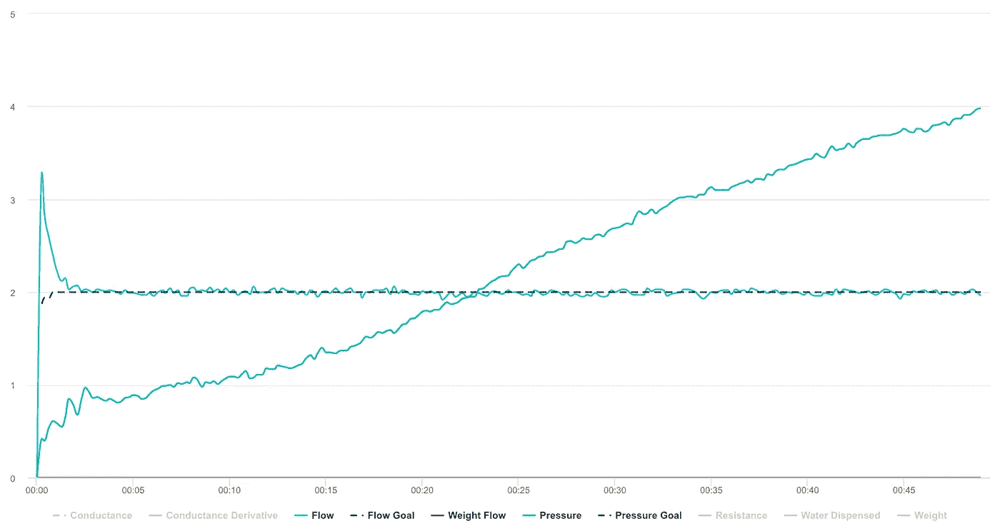
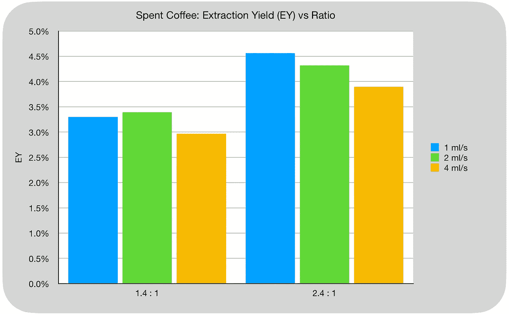

# 水接触时间与浓缩咖啡中的萃取：一个实验

> 原文：[`towardsdatascience.com/water-contact-time-and-extraction-in-espresso-an-experiment-9987bd24d35d?source=collection_archive---------18-----------------------#2023-02-10`](https://towardsdatascience.com/water-contact-time-and-extraction-in-espresso-an-experiment-9987bd24d35d?source=collection_archive---------18-----------------------#2023-02-10)

## 咖啡数据科学

## 一个短期实验以隔离变量

 [Robert McKeon Aloe](https://rmckeon.medium.com/?source=post_page-----9987bd24d35d--------------------------------)

·

[关注](https://medium.com/m/signin?actionUrl=https%3A%2F%2Fmedium.com%2F_%2Fsubscribe%2Fuser%2Fae592466d35f&operation=register&redirect=https%3A%2F%2Ftowardsdatascience.com%2Fwater-contact-time-and-extraction-in-espresso-an-experiment-9987bd24d35d&user=Robert+McKeon+Aloe&userId=ae592466d35f&source=post_page-ae592466d35f----9987bd24d35d---------------------post_header-----------) 发表在 [Towards Data Science](https://towardsdatascience.com/?source=post_page-----9987bd24d35d--------------------------------) ·5 分钟阅读·2023 年 2 月 10 日

--

咖啡是一种奇妙的饮料，像茶一样，需要一定的浸泡时间来提取其精华。这段浸泡时间或水接触时间需要与从咖啡中提取的风味平衡。在浓缩咖啡中，这尤其具有挑战性，因为水在较短的浸泡时间内以压力流过咖啡，比其他冲泡方法更具挑战。

有一种理论认为，较高的水接触时间会导致浓缩咖啡中的提取率更高。虽然有人对这种观点提出了异议，但像许多事情一样，这个理论是可以测试的。关键是设计一个良好的实验（DOE），所以我们来设计一个实验并收集一些数据来开始回答这个问题。

**总溶解固体 (TDS)** 使用折射仪测量，这个数字与射击的输出重量和咖啡的输入重量结合使用，以确定杯中提取的咖啡百分比，称为**提取产率 (EY)**。这是我们试图测量的主要变量。

# DOE：修改研磨颗粒大小

最简单的实验设计是修改研磨颗粒大小，这将减慢流量。然而，这会混合两个其他变量：

1.  较小的研磨颗粒会在局部层面上更快地提取。

1.  较小的研磨颗粒更容易受到通道效应的影响，从而在全球层面上导致提取不足。

EY 和时间与研磨颗粒大小的关系，所有图像均由作者提供

在这两个变量之间是提取产率的火山图。因此，如果你使用了这个实验，你会看到随着研磨变小，提取产率上升直到某个峰值，之后提取产率会下降。从这样的实验中可能得出较长的水接触时间不会导致更高提取的结论，而这个结论是不准确的。

所以实验必须更好，并减少变量。

# DOE：使用流量控制

使用带有流量控制的浓缩咖啡机（例如我拥有的 Decent Espresso (DE)），可以使用单一的研磨度，并进行 3 种不同的流量配置。这可以控制由于颗粒分布变化导致的提取速率变化。

恒定流量控制的电子邮件。

然而，这仍然可能受到群头设计的影响。许多机器在水进入篮子时将水推到边缘，从而导致侧面通道效应。DE 由于水分配器的[独特水分布](https://medium.com/nerd-for-tech/water-distribution-for-espresso-cd361bc0734)导致水在左侧稍微比右侧流入得快。

# DOE：流量控制 + 混合废咖啡

为了减少水输入变量，我们可以使用一些废咖啡。废咖啡不容易受到通道效应的影响，因为它没有 CO2 和可提取的溶解物质很少。因此，我们可以混合单一咖啡研磨度，并使用多种流量配置。

另一个改进是拉取一种萨拉米咖啡，以便更好地理解提取速率。

# 测试用废咖啡

对于这个测试，我制作了一些使用过的咖啡，与以前的测试一样。然而，我认为可以借此机会在更大实验前获取一些数据。这些咖啡渣来自多个使用过的咖啡饼，我将它们彻底混合在一起。然后，我打算进行 2:1 的萃取并分成两个杯子。然而，第一个萃取时间稍长，所以我对其他两个萃取保持了相同的比例。

这个结果表明，较高的流速会降低 EY，并且通常支持水接触时间更长更好的观点（即较慢的流速）。

然后我对这些咖啡饼进行了 4 ml/s 105C 的萃取，直到液体变清。我把咖啡饼晾干，并通过一个 800um 的 Kruve 筛网去除任何结块。

那么让我们进入大实验吧。

# 大实验

这个实验是在 Decent Espresso 机器上完成的，使用了 3 种不同的平流速率控制曲线。我在 90C 下进行这些萃取，因为我想避免过多的蒸汽，因为[蒸汽](https://medium.com/nerd-for-tech/steam-pre-infusion-for-espresso-a-summary-1c58c65a937a)对咖啡的影响仍在被发现。

然后我将新鲜研磨的咖啡与使用过的咖啡混合，并进行简单的 WDT 和自动水平压实。8 克新鲜咖啡与 13 克使用过的咖啡混合。

我在 1 ml/s 的流量下对使用过的咖啡进行了对照萃取，以去除使用过的咖啡对其他测量的影响。

提取过程使用了 5 杯来处理三种流量曲线。对于 TDS，尽管 4 ml/s 的样品提取时间稍长，但每个样品的 TDS 趋势仍然较高。这一结果由 EY 标准化。

4 ml/s 流量的提取结果难以得到相同的输出重量。我还去除了这些累计 EY 数字中使用过的咖啡渣的影响。

添加了 Pump&Dump 作为参考。

这些结果显示，随着流量的增加，提取产率会下降。这在所有的萃取比例中都成立，并支持了较长水接触时间能够提取更多咖啡的观点。

咖啡的提取在浓缩咖啡中具有挑战性，因为有许多变量相互影响。我希望这个实验能帮助揭示如何将单一变量隔离并进行检查。这个实验表明，较长的水接触时间会导致更高的提取，而以前对接触时间的看法与细磨浓缩咖啡的通道效应混淆在一起。

这个实验也可以只使用新鲜咖啡进行重复，这将是一个有趣的实验。我不确定其他变量如何可能混淆测量结果。

如果你喜欢，可以在[Twitter](https://mobile.twitter.com/espressofun)、[YouTube](https://m.youtube.com/channel/UClgcmAtBMTmVVGANjtntXTw)和[Instagram](https://www.instagram.com/espressofun/)上关注我，我会发布各种机器上的浓缩咖啡镜头和相关内容。你还可以在[LinkedIn](https://www.linkedin.com/in/dr-robert-mckeon-aloe-01581595)找到我，也可以在[Medium](https://towardsdatascience.com/@rmckeon/follow)和[订阅](https://rmckeon.medium.com/subscribe)上关注我。

# [进一步阅读](https://rmckeon.medium.com/story-collection-splash-page-e15025710347)：

[我的书](https://www.kickstarter.com/projects/espressofun/engineering-better-espresso-data-driven-coffee)

[我的链接](https://rmckeon.medium.com/my-links-5de9eb69c26b)

[浓缩咖啡文章合集](https://rmckeon.medium.com/a-collection-of-espresso-articles-de8a3abf9917?postPublishedType=repub)

[工作与学校故事合集](https://rmckeon.medium.com/a-collection-of-work-and-school-stories-6b7ca5a58318)
