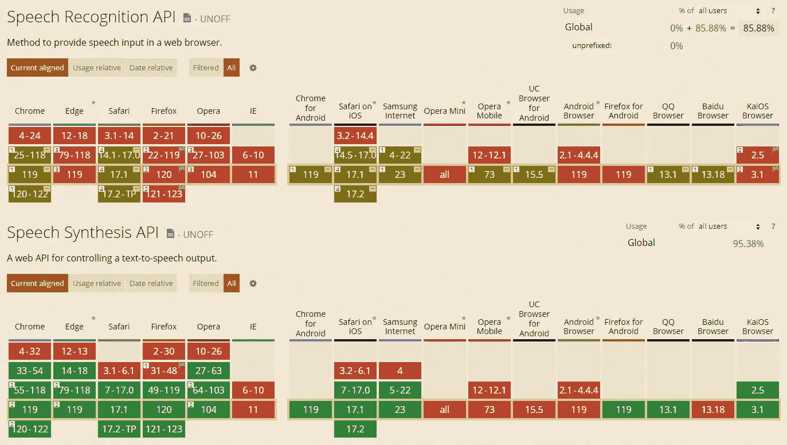

# Web Speech API：什么有效，什么无效，以及如何通过将其与 GPT 语言模型连接来改进它

> 原文：[`towardsdatascience.com/web-speech-api-what-works-what-doesnt-and-how-to-improve-it-by-linking-it-to-a-gpt-language-dc1afde54ced`](https://towardsdatascience.com/web-speech-api-what-works-what-doesnt-and-how-to-improve-it-by-linking-it-to-a-gpt-language-dc1afde54ced)

## 系列文章的一部分，探讨现代人工智能和其他技术如何帮助更高效的人机交互

[](https://lucianosphere.medium.com/?source=post_page-----dc1afde54ced--------------------------------)[](https://towardsdatascience.com/?source=post_page-----dc1afde54ced--------------------------------) [LucianoSphere (Luciano Abriata, PhD)](https://lucianosphere.medium.com/?source=post_page-----dc1afde54ced--------------------------------)

·发表于[Towards Data Science](https://towardsdatascience.com/?source=post_page-----dc1afde54ced--------------------------------) ·阅读时间 15 分钟·2023 年 12 月 6 日

--


照片由[palesa](https://unsplash.com/@palesa08?utm_source=medium&utm_medium=referral)提供，来源于[Unsplash](https://unsplash.com/?utm_source=medium&utm_medium=referral)

我认为现代技术使得人机交互变得比目前的软件所提供的要简单和自然得多。实际上，我认为技术已经足够成熟，我们可以不依赖传统接口，向用户体验的革命迈进。

大型语言模型无疑引发了这场革命的一个阶段，特别是在我们询问信息的方式上。然而，我认为技术仍然可以提供更多。例如，尽管虚拟现实头显的成本在降低，我们仍然主要使用平面屏幕；尽管眼动追踪、语音识别和身体部位追踪等技术已达到较高水平，我们仍然使用鼠标、键盘和触控手势来操作设备；尽管语音合成技术取得了重大进展，我们仍然在大量阅读。

> 我认为，当前的技术已经足够成熟，能够提供几乎像《星际迷航》中那样的人机交互（如果你不明白我的意思，[请查看这个](https://www.youtube.com/watch?v=Drr6_zikuZQ)），然而我们却仍然想停留在过去。

在这篇文章中，我开始了一系列短文，专注于现代技术如何使人机交互发生根本性改变，这些技术**已经非常成熟**，你将通过我分享的代码片段和示例应用来亲自测试。

忠于我的风格，我将特别讨论这些现代技术的基于网页的实现。我将从集成到网页浏览器中的 Web Speech API 开始，讨论其功能，展示一些用例，强调其局限性，并举例说明如何通过将其与大型语言模型结合来克服这些局限性。

> 本系列基于我最近参与的一个项目，旨在构建一种首创的网络应用程序，提供沉浸式、多用户的分子图形和建模功能，名为 HandMol：

[](https://pub.towardsai.net/coupling-four-ai-models-to-deliver-the-ultimate-experience-in-immersive-visualization-and-modeling-9f52a4bd1443?source=post_page-----dc1afde54ced--------------------------------) [## 结合四种 AI 模型以提供终极沉浸式可视化和建模体验

### 继续阅读关于这款名为 HandMol 的新免费应用程序如何实现沉浸式、协作式的可视化和建模…

pub.towardsai.net](https://pub.towardsai.net/coupling-four-ai-models-to-deliver-the-ultimate-experience-in-immersive-visualization-and-modeling-9f52a4bd1443?source=post_page-----dc1afde54ced--------------------------------)

# （现代）语音识别和语音合成

特别是语音识别和语音合成这两项技术，已经存在近二十年，并在推动更自然的人机互动方面提供了很多可能性。

语音识别，或称 ASR（自动语音识别）或 STT（语音转文本），将口语语言转换为书面文本。它有两个主要的广泛应用：

+   通过口头指令控制如智能手机或计算机等硬件，最好以自然的方式进行。想象一下你如何通过语音命令使用智能手机、Alexa 或 Siri。

+   转录（或许随后显示、存储或分析）对话中所说的内容。考虑一下会议转录、视频字幕等。

这两个应用程序直接相关于本博客文章的主题，并通过 Web Speech API 实现了对网页程序员的支持。

语音合成，或称 TTS（文本转语音），将书面文本转换为口语语言。它使计算机和其他设备能够生成类似人类的语音，使信息能够以听觉方式访问，就像你在 Medium 文章中看到的那样。

语音合成在各种场景中都有应用，包括为视力障碍用户提供的辅助功能、交互式语音响应系统以及多媒体内容的丰富化。

语音转录（STT）和语音合成（TTS）使与数字内容的互动更加包容和多样化，开辟了免提和免屏操作以及个性化用户体验的机会。

## 语音识别和语音合成技术的简要历史

语音识别和合成在近年来取得了显著进展，特别是随着现代 AI 模型的整合和机器学习技术的进步。它们可以追溯到 20 世纪中期，当时首次尝试使用计算机进行语言处理。早期模型在处理口音、方言、同音词和语音细微差别时面临挑战，无论是在语音生成还是理解方面。统计模型和符号自然语言处理的进步逐步改善了 ASR 系统，但在 2010 年代末期，随着变换器的引入，尤其是对 ASR 的突破性进展：通过利用注意机制，新的语音识别方法能够捕捉长期依赖关系和上下文理解，从而显著提高了语音转文本转换的准确性。

STT 比 TTS 更复杂一些，因为需要考虑更多的变量。然而，最现代的方法表现非常出色。虽然不深入细节，但现代 STT 涉及一个复杂的过程，多个阶段和 AI 模型协同工作。关键阶段包括音频输入的预处理、特征提取、音素提取、语言模型决策和解码成单词序列。现代 ASR 模型通常在所有阶段使用变换器，保留信息中的长期耦合，以提高准确性和连贯性。最先进的 ASR 系统包括直接内置在核心模块中的语言模型元素；这种原生集成被证明对高转录和识别准确性至关重要。

现代 ASR 和 TTS 技术确实能做得远远不止单纯的语音识别或合成，实际上接近于“对口语的理解”。比如，最先进的 STT 和 TTS 模型可以将音频转录为文本或从文本合成音频，支持多种语言，有些甚至能够自动识别语言，适应上下文，检测或模拟不同的说话者，用时间戳注释转录词汇，处理标点符号和非语言发声，允许自定义词典等。

如果你对 Web Speech API 中所有这些功能以及在你的 Web 应用中利用它们感到兴奋，你需要了解一些限制，这可能会让你失望，因为浏览器支持的功能还不是最先进的。然而，幸运的是，将 Web Speech API 与大型语言模型结合使用可以缓解这些问题，就像许多现代 ASR 和 TTS 技术一样，我将在这里通过编程使用 GPT-3.5-turbo 或 GPT-4 来展示这一点。如果这还不够，你还会发现有些公司提供他们自己的（付费）API 来进行最先进的 ASR 和 TTS。

# Web Speech API、其组件及其可用性

Web Speech API 是一个网络标准，允许 web 应用将语音数据融入其功能中。它有两个部分：SpeechRecognition，允许语音输入和识别，以及 SpeechSynthesis，允许语音输出和合成。

Web Speech API 最早由 Google 在 2010 年提出，并在 2013 年的 Chrome 25 中实现。从那时起，它得到了其他浏览器的支持，但兼容性和功能性各不相同。根据 caniuse.com 的报告，截至 2023 年 12 月，支持情况非常不均衡，尤其是在语音识别方面：



截图来自[`caniuse.com/?search=web%20speech%20api`](https://caniuse.com/?search=web+speech+api)

根据我的经验，我发现 API 的语音识别模块仅在 Safari 和 Chrome 中表现良好，包括它们的 iOS 和 Android 版本。请注意，其他基于 Chromium 的浏览器，如 Brave 或 Oculus Browser（Meta 的 Quest 虚拟现实浏览器）不支持语音识别。这是因为 Google 的语音识别服务是专有的，需要许可证使用，而 Google 不授予其他浏览器使用许可证。值得注意的是，由于 Chrome 中的语音识别由基于云计算的系统处理，以用户隐私为中心的浏览器如 Brave 将面临一个艰难的决定，如果 Google 允许它们使用自己的资源进行语音识别。哦，顺便提一下，谈到隐私，请注意，所有通过 Web Speech API 进行的语音识别都需要调用的网页通过 https 提供服务！

与语音识别相反，语音合成在计算机上的所有主要浏览器（除了已被 Microsoft 的 Edge 替代的旧版 Internet Explorer，它现在支持语音合成）和大多数智能手机浏览器中都能得到妥善处理。对于 TTS，当前不强制要求 https。

接下来，我将专注于 Web Speech API 以及如何在 Chrome 中使用它，尽管原则上核心元素在所有其他支持该 API 的浏览器中应该工作相同。

# 使用 Chrome 的 Web Speech API

要以编程方式使用 Web Speech API，你需要创建 SpeechRecognition 或 SpeechSynthesis 接口的实例，具体取决于你想使用语音输入还是输出——或者你也可以创建两者，并在同一个应用中使用它们！

## 语音识别

例如，要创建一个语音识别对象，你可以简单地这样做：

```py
var recognition = new SpeechRecognition();
```

然而，你最好检查一下 ASR 在浏览器中是否实际上已启用。然后，最简单的代码块看起来如下：

```py
const SpeechRecognition = window.SpeechRecognition || window.webkitSpeechRecognition;

window.onload = function () {
  if (typeof SpeechRecognition === “undefined”) {  //Check browser can do speech recognition
    console.log(“Speech api failed”);
  } else {
    console.log(“Speech api ok”);
    const recognition = new SpeechRecognition();  //Create speech recogn object
    recognition.continuous = true;                //Define behaviour and properties, for ex. ask for continuous ASR,
    recognition.interimResults = true;            //Show partial results of ASR (i.e. when results are not yet final because speech recognition keeps going as audio progresses)
    recognition.lang = "en-US";                   //Language must be defined upfront
    recognition.onresult = (event) => {           //Triggered when a word or sentence has been recognized
      const res = event.results[last];            //If there's a list of several recognized words/sentences, retrieve the last one
      var text = res[0].transcript.trim();        //Extract and clean up text
      … //Process text
    }
    recognition.start();            //With all setup ready, start recognition
  }
}
```

你可以使用如上所示的对象的方法和属性来控制语音识别服务，并以最佳方式使用它。最常用的命令和属性包括**start**、**stop**、**abort**、**lang**、**interimResults**等。你还可以添加事件监听器来处理对象触发的事件，例如**onstart**、**onend**、**onresult**、**onerror**等。

一个特别值得关注的属性，遗憾的是因为负面的原因，是“grammars”。语音识别的“grammars”应该允许一个进行 ASR 的代码理解它通常无法理解或排名较低的词汇。这个功能对于纠正发音和使用名字、行话、地方表达等尤其重要。你可以在[这里](https://developer.mozilla.org/en-US/docs/Web/API/SpeechRecognition/grammars)找到一些信息，但我不会深入细节，因为……它确实不起作用，很多人对此表示抱怨；此外，还有一个整体的趋势是从 API 中删除“grammars”，因为目前没有浏览器支持它（见[这里](https://github.com/WICG/speech-api/pull/58)）。

要了解有关 SpeechRecognition 对象的属性和事件的更多信息，[查看此处](https://developer.mozilla.org/en-US/docs/Web/API/SpeechRecognition)。

以及如何使用 Web 语音 API 进行语音识别的全球完整示例，请查看这个官方示例，它展示了如何通过口头命令更改网页的背景颜色：

[## dom-examples/web-speech-api/speech-color-changer/script.js at main · mdn/dom-examples](https://github.com/mdn/dom-examples/blob/main/web-speech-api/speech-color-changer/script.js?source=post_page-----dc1afde54ced--------------------------------)

### 附带各种 MDN DOM 和 Web API 文档页面的代码示例……

[github.com](https://github.com/mdn/dom-examples/blob/main/web-speech-api/speech-color-changer/script.js?source=post_page-----dc1afde54ced--------------------------------)

## 语音合成

类似地，要创建一个语音合成对象，你可以写：

```py
var synthesis = window.speechSynthesis;
```

然后，你可以创建**SpeechSynthesisUtterance**接口的实例，这些实例代表你希望合成的特定语音请求。你可以设置 utterance 的属性，例如文本、声音、语速、音调、音量等。你可以使用对象的方法和属性来控制语音合成服务，例如 speak、pause、resume、cancel、getVoices 等。你还可以添加事件监听器来处理 utterance 触发的事件，例如 onstart、onend、onerror 等。例如，要合成文本并在开始和结束时记录日志，你可以这样写：

```py
var utterance = new SpeechSynthesisUtterance(‘Hello world, I'm talking thanks to the Web Speech API!’);
utterance.onstart = function(event) {
  console.log(‘Speech started’);
};
utterance.onend = function(event) {
  console.log(‘Speech ended’);
};
synthesis.speak(utterance);
```

我在我的 Web 应用程序中真正喜欢做的是创建一个可以接收字符串并将其朗读出来的函数。我称这个函数为 speakUp()，它看起来是这样的：

```py
function speakup(TextToSpeak) {
  if (“speechSynthesis” in window) {                            //Check TTS is supported
    const toSpeak = new SpeechSynthesisUtterance(TextToSpeak);  //Create utterance
    toSpeak.lang = “en-US”;                                     //Set language
    window.speechSynthesis.speak(toSpeak);                      //Speak!
  } else {
    console.log(“Speech synthesis not supported by browser.”);
  }
}
```

# 通过 Web Speech API 进行 ASR 和 TTS 的问题，以及如何使用大型语言模型纠正其中的一些问题

Web Speech API 使用起来非常简单，如你所见。它也是免费的，不需要任何 API 密钥，也没有调用次数和频率的限制。

然而，通过反复尝试，我发现系统经常出现故障，尤其是在 ASR 方面。此外，API 有时似乎会自行关闭，许多人对此提出了问题但没有明确的解决方案。最糟糕的是，虽然免费的 API 在某些应用中可以使用，但无论是语音识别还是合成，都远未达到最先进的水平。与我在介绍中提到的现代 ASR 系统相比，Chrome 的 ASR 服务几乎无法提供任何实质性的功能！

语音识别的准确性和可靠性都不高，也不耐受口音和方言。即使有一些噪音，它也几乎没有用。它无法自动检测语言，无法识别同一对话中的多个人，标点处理还可以，但对声音化表达感到困惑等。

语音识别服务存在隐私和安全问题，因为语音数据被传输到外部服务器或第三方，而未经用户同意或了解。

语音合成服务的声音不够自然或富有表现力，尤其是对于英语以外的语言。

此外，正如我们所见，语音识别和合成服务在浏览器和设备上非常依赖，可能在不同的平台和地区不可用或不一致。

由于其能力有限，它们可能会带来伦理和社会影响，如偏见、歧视、欺骗、操控或冒充。

作为开发者和用户，你应该意识到这些局限性和挑战，并负责任且恰当地使用 Web Speech API。

## 通过使用大型语言模型缓解语音识别问题

上述问题中，与 ASR 相关的问题是最重要的。解决这些问题中的许多需要在最基础的识别层面采取行动。然而，与转录准确性和术语补全相关的最重要的问题可以通过大型语言模型解决，正如我通过 GPT-3.5-turbo 或 GPT-4 在 JavaScript 中编程实现的那样。

***这如何工作***

本质上，你通过一个提示调用语言模型，解释输入内容的样子和这些输入的输出应该是什么，然后是来自 API 识别的实际（原始）转录。

在[触发所有这些工作的 Web 应用程序](https://medium.com/towards-artificial-intelligence/coupling-four-ai-models-to-deliver-the-ultimate-experience-in-immersive-visualization-and-modeling-9f52a4bd1443)中，语音识别用于触发命令。例如，如果用户说“放大”或“扩大”或类似的命令，那么可视化（该应用程序用于分子图形）必须放大。该应用程序的提示如下：

```py
let theprompt = [];         //Initializing an array that will contain the prompt

theprompt.push({
  role: "system",           //Tell the mode what it will be doing
  content: "You receive texts from speech recognition and act accordingly by triggering commands, effectively correcting speech recognition as in the examples provided below. If you don't understand the request or the request is not in the list, you run the command didntUnderstand()",
  });

theprompt.push(                                      //Provide examples from hereon
 { role: “user”, content: “Make molecules bigger” },
 { role: “assistant”, content: “scale(+)” }
);
theprompt.push(
 { role: "user", content: "Zoom in" },
 { role: "assistant", content: "scale(+)" }
);
theprompt.push(
 { role: "user", content: "Enlarge" },
 { role: "assistant", content: "scale(+)" }
);
theprompt.push(
 { role: "user", content: "Zoom out" },
 { role: "assistant", content: "scale(-)" }
);
theprompt.push(
 { role: "user", content: "Make smaller" },
 { role: "assistant", content: "scale(-)" }
);
```

让我们详细了解一下。以下是提示的**系统**元素：

> 你从语音识别中接收文本并据此执行命令，实际上纠正语音识别，如下面提供的示例。如果你不理解请求或请求不在列表中，你将运行命令 didntUnderstand()。

然后，看看用户/助手对的示例如何提供可能的输入，这些输入会产生相同或相关的输出，例如“放大”和“扩大”都导致调用 scale(+)，而“缩小”调用 scale(-)。

在代码的其他部分，你会发现一些条目“教”语言模型以一种可以防止程序崩溃的方式来纠正输入，同时增加产生正确输出的机会。例如，我说的“最小化”经常被识别为“mini mice”，“ANI”这个非标准英语单词被识别为“Annie”。然后我可以用这样的示例来指导语言模型：

```py
theprompt.push(
 { role: "user", content: "Minimize with ANI" },
 { role: "assistant", content: "minimize(ANI)" }
);
theprompt.push(
 { role: "user", content: "Minimize with Annie" },
 { role: "assistant", content: "minimize(ANI)" }
);
theprompt.push(
 { role: "user", content: "Mini mice with Annie" },
 { role: "assistant", content: "minimize(ANI)" }
);
...etc.
```

这个技巧效果非常好，这并不奇怪，因为归根结底，这正是现代语言模型如 Whisper 的核心，这些模型将语言模型直接嵌入到语音识别过程中！

在结束这一部分时，为了完整性，当然完整的提示必须包含在从语言模型获取的承诺中，在我的情况下，通常是 OpenAI 的 GPT-3.5-turbo 或 GPT-4：

```py
fetch(`https://api.openai.com/v1/chat/completions`, {    //Main call to speech API
  body: JSON.stringify({
  model: “gpt-3.5-turbo”,                     //Or GPT-4, as of December 2023
  messages: theprompt,                    //The prompt just created
  temperature: 0,                         //Keep this low to avoid hallucination
  max_tokens: 20,                         //The outputs should be small commands, so this should be low
}),
  method: “POST”,
  headers: {
    “content-type”: “application/json”,
    Authorization: “Bearer “ + stringWithYourAPIKey,    //API key from openAI for GPT models!
  },
}).then((response) => {
  if (response.ok) {
    response.json().then((json) => {
    var command = json.choices[0].message.content.trim();    //Extract text, which will contain commands
    console.log(command);
    if (command == ....                 //List and execute tasks 
```

# Chrome 的 Web Speech API 的一些应用案例

除了触发这一系列博客文章的应用程序（[在这里](https://pub.towardsai.net/coupling-four-ai-models-to-deliver-the-ultimate-experience-in-immersive-visualization-and-modeling-9f52a4bd1443)），我还可以与你分享其他使用语音识别和/或合成 API 的项目：

在这个示例中，我结合了 Chrome 的语音识别功能和 GPT-3，创建了一个从你的口述笔记和指南中编写电子邮件的 Web 应用程序：

[## 一个基于 GPT-3 的自动化电子邮件写作 Web 应用程序，来自语音笔记

### 我将 Chrome 的语音识别引擎与 GPT-3 结合起来，创建了一个从你的口述笔记中编写电子邮件的 Web 应用程序……

[pub.towardsai.net](https://pub.towardsai.net/a-web-app-for-automated-e-mail-writing-from-voice-notes-using-gpt-3-e8e98e4ffb6f?source=post_page-----dc1afde54ced--------------------------------)

在这里，我展示了如何构建一个类似 chatGPT 的机器人，它可以听你说话并口头回复；同样，这将 Chrome 的 Web Speech API 用于识别和合成，与 GPT-3 作为驱动聊天机器人“脑力”的语言模型结合：

[](/coupling-gpt-3-with-speech-recognition-and-synthesis-to-achieve-a-fully-talking-chatbot-that-runs-abfcb7bf580?source=post_page-----dc1afde54ced--------------------------------) ## 将 GPT-3 与语音识别和合成结合，实现一个完全对话的聊天机器人...

### 我是如何创建这个网页应用的，你可以自然地与 GPT-3 谈论任何你想要的话题，全基于网页的...

towardsdatascience.com

在这个其他示例中，使用 Chrome 的语音识别功能来控制一个网页应用，在这种情况下使用 GPT-3 将口头请求转化为命令：

[](/control-web-apps-via-natural-language-by-casting-speech-to-commands-with-gpt-3-113177f4eab1?source=post_page-----dc1afde54ced--------------------------------) ## 通过将语音转化为命令来控制网页应用，与 GPT-3 一起使用

### 最后一篇文章展示了 GPT-3 的实际应用，详细解释了工作流程和细节...

towardsdatascience.com

# 超越 Web Speech API

我在上面描述了某些网页浏览器不支持语音合成，大多数也不支持语音识别。我还解释了 Chrome 的内置语音 API 并不出色，尤其是对于语音识别，并且这些限制的一些问题可以通过语言模型来克服；然而，并非所有问题都可以用这种策略解决，因此许多现代 ASR 系统具有的功能是完全缺失的。

在这种情况下，了解浏览器可能支持语音识别和合成是重要的，通过使用替代服务或解决方案——这些服务或解决方案是付费的，相比于 Chrome 的免费 API，原则上更强大。

仅提及一些提供此 API 服务的公司，可以查看 Gladia、Speechly、AssemblyAI、Deepgram、Spechmatics（这个有一个很棒的示例[在这里](https://www.speechmatics.com/)），以及其他一些公司。即使是 Google 也有一个与他们在 Chrome 中免费提供的系统不同的 ASR 系统，它显然效果更好，其他科技巨头如 Microsoft 和 AWS 也通过 API 提供了他们自己的产品。你甚至可以下载 OpenAI 的开源 Whisper，并设置一个专门为你运行的服务，甚至可以根据你的需求进行定制——不过你还是直接去找一个通过 API 提供的公司，比如[Gladia.io](https://www.gladia.io/)。

当然，除非你做的是封闭实现（例如在本地服务器上使用 Whisper），否则大多数这些服务都需要你将音频发送到他们的服务器，这可能会危及隐私。然而，对于非敏感任务来说，它们可能是一个完美的选择，即使在许多情况下成本相对较低。

# 进一步阅读

[](https://developer.mozilla.org/en-US/docs/Web/API/Web_Speech_API?source=post_page-----dc1afde54ced--------------------------------) [## Web Speech API - Web APIs | MDN

### Web Speech API 使你能够将语音数据集成到网络应用程序中。Web Speech API 有两个部分…

developer.mozilla.org](https://developer.mozilla.org/en-US/docs/Web/API/Web_Speech_API?source=post_page-----dc1afde54ced--------------------------------) [](https://developer.mozilla.org/en-US/docs/Web/API/Web_Speech_API/Using_the_Web_Speech_API?source=post_page-----dc1afde54ced--------------------------------) [## Using the Web Speech API - Web APIs | MDN

### 语音识别涉及通过设备的麦克风接收语音，然后由语音…

developer.mozilla.org](https://developer.mozilla.org/en-US/docs/Web/API/Web_Speech_API/Using_the_Web_Speech_API?source=post_page-----dc1afde54ced--------------------------------)

[***www.lucianoabriata.com***](https://www.lucianoabriata.com/) *我写关于我广泛兴趣领域的一切：自然、科学、技术、编程等。* [***订阅以获取我的新故事***](https://lucianosphere.medium.com/subscribe) ***通过电子邮件****。要* ***咨询小型工作*** *请查看我的* [***服务页面在这里***](https://lucianoabriata.altervista.org/services/index.html)*。你可以* [***在这里联系我***](https://lucianoabriata.altervista.org/office/contact.html)***。*** *你可以* [***在这里给我小费***](https://paypal.me/LAbriata)*.*
