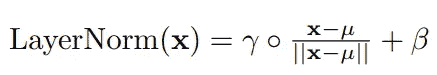
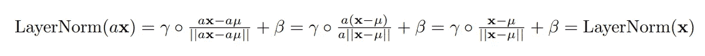
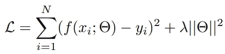

# 权重衰减在没有残差连接的情况下能有效吗？

> 原文：[`towardsdatascience.com/weight-decay-is-useless-without-residual-connections-ef65197e5944?source=collection_archive---------13-----------------------#2023-02-21`](https://towardsdatascience.com/weight-decay-is-useless-without-residual-connections-ef65197e5944?source=collection_archive---------13-----------------------#2023-02-21)

## 残差连接如何秘密地对抗过拟合？

 [Guy Dar](https://guydar.medium.com/?source=post_page-----ef65197e5944--------------------------------)

·

[关注](https://medium.com/m/signin?actionUrl=https%3A%2F%2Fmedium.com%2F_%2Fsubscribe%2Fuser%2Ffab216dbde3e&operation=register&redirect=https%3A%2F%2Ftowardsdatascience.com%2Fweight-decay-is-useless-without-residual-connections-ef65197e5944&user=Guy+Dar&userId=fab216dbde3e&source=post_page-fab216dbde3e----ef65197e5944---------------------post_header-----------) 发布于 [Towards Data Science](https://towardsdatascience.com/?source=post_page-----ef65197e5944--------------------------------) ·9 min read·2023 年 2 月 21 日

--

图片由 ThisisEngineering RAEng 提供，来源于 Unsplash

# 引言

在这篇文章中，我们将用数学方法（使用*简单*的数学，别担心！）展示如果没有残差连接，LayerNorm 可能会导致神经网络的过拟合问题。过拟合是机器学习中的一个严重问题，科学家们真的希望避免这种情况。粗略来说，过拟合意味着网络记住了训练集，而不是学习任务并推广到新的未见数据上。权重衰减是一种用于对抗过拟合的正则化技术。然而，我们将展示在相当标准的前馈网络中，它们需要残差连接才能有效（在下面的解释中我会进一步澄清）。残差连接以其在反向传播过程中稳定训练的作用而闻名。另一方面，Normalization 层（如 LayerNorm）则在输入通过网络层时稳定输入。Normalization 层的想法是我们希望内部表示的范数保持在一定范围内。在 LayerNorm 中，我们通过其范数来除以每个内部表示向量（此时我省略了一些细节）。一些先前的工作建议将 LayerNorm 添加到残差网络中[*Liu et al, 2020*]，这有助于提高它们的性能。我们的研究则是另一个方向——为什么从理论上讲，你可能不应该在没有残差连接的情况下使用 LayerNorm。实际上，即使是后规范残差连接（无论那是什么意思……）也会遭遇同样的问题。

从广义上讲，思想相当简单：通过将权重衰减设得非常小（除了最后一层，它虽然令人头疼，但仍使大部分权重衰减变得无用），我们可以使权重衰减几乎没有实际用处。简单回顾一下什么是权重衰减：权重衰减是一种正则化技术，用于防止神经网络收敛到不能推广到未见数据的解决方案（即过拟合）。如果我们训练神经网络只去最小化训练数据上的损失，我们可能会找到一个专门为这特定数据及其特性量身定制的解决方案。为避免这种情况，我们添加一个与网络权重矩阵的范数相关的项。这旨在鼓励优化过程收敛到可能对训练数据不是最优的解决方案，但在范数上具有较小权重矩阵的解决方案。其思路是，具有高范数权重的模型不够自然，可能试图拟合特定的数据点以进一步降低损失。在某种程度上，这是一种将奥卡姆剃刀（哲学观点认为简单的解决方案可能是正确的）集成到损失中的方式——其中简单性由权重的范数来体现。我们在这里不会讨论权重衰减的更深层次的理论依据。

**TL;DR**：在这篇文章中，我们展示了在没有残差连接的 ReLU 前馈网络中，添加 LayerNorm 后，权重衰减正则化不会改变最优损失值（*除了讨厌的最后一层，我们稍后会讨论为什么我们认为这还不够）。 

# 理论游戏时间

## **ReLU 网络的正尺度性**

线性网络和 ReLU 网络具有以下尺度特性：设 **a** > 0 为正标量。那么 **ReLU(ax) = a ReLU(x)**。最终，在任何由矩阵乘法堆叠后跟 ReLU 激活组成的网络中，这个属性仍然有效。这是最普通的神经网络——没有归一化层，也没有残差连接。然而，这种之前曾广泛存在的前馈 (FF) 网络展示了这样一种结构化行为确实令人惊讶：将输入乘以正标量，结果输出**正好**按相同的因子缩放。这就是我们所称的 *(正向)* ***尺度等变性***（这意味着输入的尺度变换会传递到输出的尺度变换，而 *不变性* 则表示输入的尺度变化不会对输出产生影响）。但还有更多：如果我们在过程中对任何权重矩阵（以及相应的偏置项）进行同样的操作——效果也是一样的：输出将按相同因子放大。不错吧？当然。但是我们能利用它吗？让我们看看。

让我们看看添加 LayerNorm 后会发生什么。首先，什么是 LayerNorm？简单回顾一下：

其中 **µ** 是 **x** 条目的平均值，*◦* 表示逐元素乘法，**β, γ** 是向量。

那么，当我们添加 LayerNorm 时，尺度特性会发生什么变化？当然，在添加 LayerNorm 之前，情况不会改变，因此如果我们在此之前将权重矩阵缩放了 **a** > 0，那么 LayerNorm 的输入会被 **a** 缩放，然后发生的情况是：

所以，我们得到一个新的属性，这次尺度缩放只是使输出 *保持不变——* **正尺度 *不变性***。而且，这即将变得令人遗憾……

***注意：*** 当我们讨论 LayerNorm 时，其他形式的归一化，如 BatchNorm，满足正尺度不变性属性，因此它们也像 LayerNorm 一样容易受到讨论中提到的问题的影响。

## 如何完全消失

让我们提醒自己我们正在尝试最小化什么：

其中训练集表示为一组 {***(x_i, y_i)***} 的对，神经网络的参数（权重）***f*** 由 **Θ** 指定。这个表达式由两部分组成：需要最小化的经验损失——神经网络在训练集上的损失，以及旨在使模型达到“更简单”解决方案的正则化项。在这种情况下，简单性被量化为网络权重具有低范数。

但问题在于，我们发现了一种绕过权重规模限制的方法。我们可以将每个权重矩阵按任意小的因子进行缩放，仍然能得到相同的输出。换句话说——**函数 *f***，即原始网络和缩放网络实现的函数是完全相同的！内部可能不同，但输出是相同的。这适用于每一个具有这种架构的网络，不管参数的实际值是什么。聪明的读者可能会注意到**β, γ**也是参数，因此也应考虑，但由于下一个 LayerNorm 的尺度不变性，它们也可以被缩放（*除了那个恼人的最后一层）。

记住，我们的目标是对未见数据进行泛化。如果正则化项趋近于零，网络就可以自由地过拟合训练数据，正则化项也就变得无用。正如我们所见，对于每一个具有这种架构的网络，我们可以设计一个等效的网络（即计算完全相同的函数），其权重矩阵范数可以任意小，这意味着正则化项可以趋近于零而不影响经验损失项。换句话说，我们可以去掉权重衰减项，它不会有太大影响。

最后一层的技术细节仍然是我们面临的一个小问题，我们不能去掉它的权重衰减项，因为最后一层通常没有跟随 LayerNorm，而且：最后的 LayerNorm 无法重新缩放，因为它后面没有任何 LayerNorm，因此我们还要考虑它的**β, γ**。所以我们剩下的只有最后一层的范数和 LayerNorm 的参数。为什么这并不是那么糟糕？过拟合可能发生在整个网络中，因此我们可以几乎所有参数进行过拟合。更重要的是，模型的内部层是学习关注点的特征提取器，而最后一层是对学习到的特征进行分类的分类器。至少从直观上看，它在过拟合中的作用可能相比于特征提取要小得多。

还有一句警告：尽管理论上，模型应该找到一个过拟合训练数据的解决方案，但观察到优化可能会收敛到泛化解决方案，即使没有显式正则化。这与优化算法有关。我们使用局部优化算法，例如梯度下降、SGD、Adam、AdaGrad 等。它们不能保证收敛到最***全局***最优的解决方案。这有时反而是一种福气。一项有趣的研究（例如，[*Neyshabur, 2017*]）表明，即使没有显式正则化，这些算法也属于**隐式正则化**的一种形式！虽然并非万无一失，但有时模型会收敛到一个泛化解决方案——即使没有正则化项！

# 残差连接如何解决这个问题？

让我提醒你什么是残差连接。残差连接将层的输入加到输出上。如果该层正在计算的原始函数是 ***f(x) = ReLU(Wx)***，那么新函数是 ***x + f(x)***。

现在，这一新层的权重缩放特性被打破了。这是因为在表达式的残差部分前没有学习到系数。因此，***f(x)*** 部分由于权重缩放而被一个常数缩放，但***x*** 部分保持不变。现在，当我们对其应用 LayerNorm 时，缩放因子无法再被抵消：***LayerNorm(x + a f(x)) ≠ LayerNorm(x + f(x))***。重要的是，只有在残差连接应用在 LayerNorm ***之前*** 时才会出现这种情况。如果我们先应用 LayerNorm，然后再进行残差连接，则会发现我们仍然获得 LayerNorm 的缩放不变性：***x + LayerNorm(a f(x)) = x + LayerNorm(f(x))***。

第一个变体通常被称为 ***pre-norm 变体***（更准确地说，实际上是 ***x + f(LayerNorm(x))*** 被称作这种方式，但我们可以将 LayerNorm 归因于前一层，并将下一层的 LayerNorm 视为上面的表达式，除了第一层和最后一层的边缘情况）。第二个变体被称为 ***post-norm 变体***。这些术语常用于 transformer 架构中，而这些超出了本文的范围。然而，值得一提的是，一些研究如 [*Xioang et al, 2020*] 发现 pre-norm 更易于优化（他们讨论了不同的原因）。然而，请注意这可能与这里讨论的缩放不变性无关。Transformer 预训练数据集通常包含大量数据，过拟合问题变得不那么严重。此外，我们还没有讨论 transformer 架构本身。但这仍然值得考虑。

# 结论

在本文中，我们观察到了一些没有预归一化残差连接的前馈神经网络的有趣特性。具体来说，我们注意到，如果它们不包含 LayerNorm，它们会将输入缩放和权重缩放传播到输出。如果它们包含 LayerNorm，它们是尺度不变的（除了最后一层），而权重/输入缩放完全不会影响输出。我们利用这一特性展示了这样的网络的**最佳**解决方案可以避免特征提取中的权重范数惩罚（仅保留分类器惩罚），因此网络可以收敛到一个或多或少相同的函数，这个函数是它在没有这些技术的情况下会收敛的。虽然这是一个关于最优性的声明，但是否这些解决方案实际上是通过梯度下降找到的仍然是一个问题。我们可能会在未来的文章中探讨这一点。我们还讨论了（预归一化）残差连接如何破坏尺度不变性，从而似乎解决了上述理论问题。仍然可能存在一些残差连接无法避免的类似特性，我可能未曾考虑。像往常一样，感谢你的阅读，我们下篇文章见！

# 参考文献

F. Liu, X. Ren, Z. Zhang, X. Sun, 和 Y. Zou. *重新思考带有层归一化的残差连接*，2020.

B. Neyshabur. *深度学习中的隐式正则化*，2017\. 网址 [`arxiv.org/abs/1709.01953`](https://arxiv.org/abs/1709.01953).

R. Xiong, Y. Yang, D. He, K. Zheng, S. Zheng, C. Xing, H. Zhang, Y. Lan, L. Wang, 和 T.-Y. Liu. *关于 Transformer 架构中的层归一化*，2020\. 网址 [`arxiv.org/abs/2002.04745`](https://arxiv.org/abs/2002.04745).
