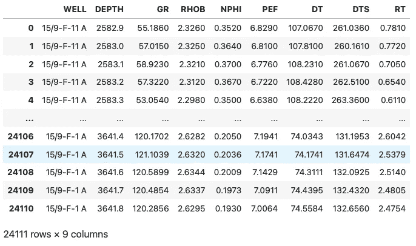
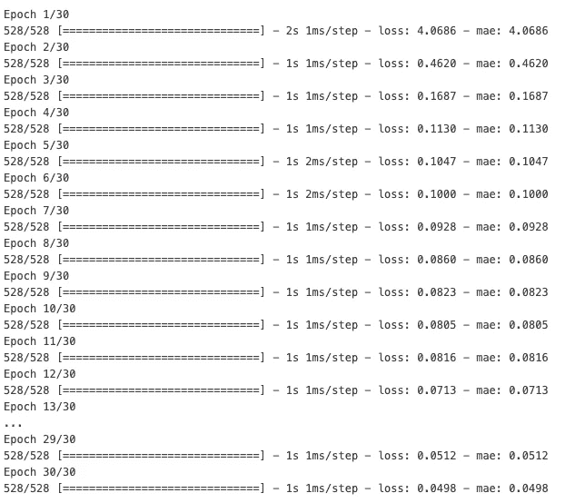
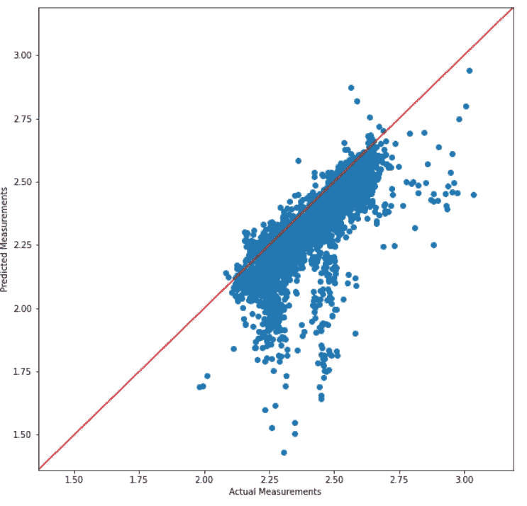
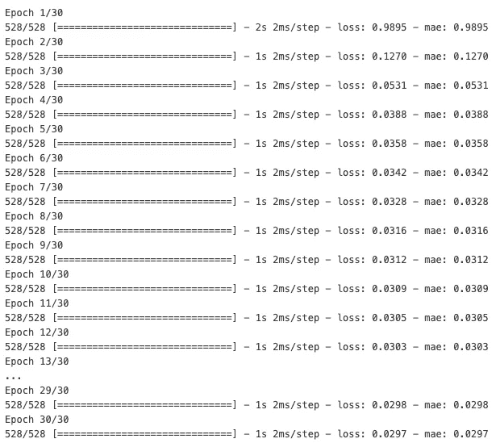
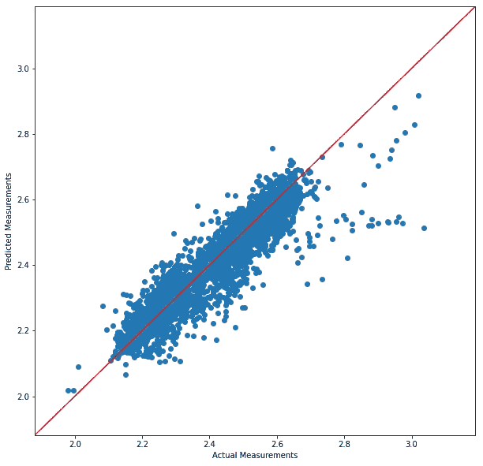

# 使用 Keras 进行测井数据预测的神经网络

> 原文：[`towardsdatascience.com/well-log-measurement-prediction-using-neural-networks-with-keras-ef7dfed94077`](https://towardsdatascience.com/well-log-measurement-prediction-using-neural-networks-with-keras-ef7dfed94077)

## 使用 Keras 预测体积密度（RHOB）的示例，并说明归一化对预测结果的影响

[](https://andymcdonaldgeo.medium.com/?source=post_page-----ef7dfed94077--------------------------------)[](https://towardsdatascience.com/?source=post_page-----ef7dfed94077--------------------------------) [Andy McDonald](https://andymcdonaldgeo.medium.com/?source=post_page-----ef7dfed94077--------------------------------)

·发布于 [Towards Data Science](https://towardsdatascience.com/?source=post_page-----ef7dfed94077--------------------------------) ·阅读时间 11 分钟·2023 年 10 月 26 日

--


代表神经网络与自然景观相结合的图像。图像由 DALL-E 3 生成。

全球每天都有大量数据从井中获取。然而，这些数据的质量可能会显著变化，从缺失数据到受到传感器故障和钻孔条件影响的数据。这可能对地下项目的其他部分产生连锁反应，例如延误和不准确的假设与结论。

由于缺失数据是我们在测井数据质量中最常遇到的问题之一，因此已经开发了许多方法和技术来估计值并填补空白。这包括应用机器学习技术——在过去几十年中随着 TensorFlow 和 PyTorch 等库的普及而越来越受欢迎。

在本教程中，我们将使用 Keras，它是一个运行在 TensorFlow 之上的高级神经网络 API。我们将利用它来演示构建机器学习模型的过程，从而允许预测体积密度（RHOB）。这是一个常见的测井测量，但它可能会受到孔眼条件不良的显著影响，或者在某些情况下，工具可能会出现故障，导致关键区间没有测量数据。

我们将从一个非常简单的模型开始，该模型不考虑输入的归一化，这是机器学习工作流程中的一个常见步骤。然后，我们将建立一个具有归一化输入的第二个模型，并说明其对最终预测结果的影响。

# 导入库和加载数据

本教程的第一步是导入我们将使用的库。

对于本教程，我们需要 4 个库：

+   [**Pandas**](https://pandas.pydata.org/): 用于加载和操作我们的数据集

+   [**sklearn.model_selection:**](https://scikit-learn.org/stable/) 用于创建我们的训练和测试数据划分

+   [**Tensorflow**](https://www.tensorflow.org/): 用于构建和运行我们的神经网络

+   [**matplotlib**](https://matplotlib.org/): 用于可视化预测结果

这些是按以下方式导入的：

```py
import pandas as pd
from sklearn.model_selection import train_test_split
import tensorflow as tf
import matplotlib.pyplot as plt
```

一旦导入了库，我们需要加载将用于训练和测试模型的数据。

对于本教程，我们将使用一个包含来自挪威西海岸 Volve 油田 3 口井的系列测井数据的数据集。这些数据来自公开的 Equinor Volve 数据集。

该数据集的完整详细信息可以在文章末尾找到。

要读取我们的 CSV 文件，我们只需调用：

```py
df = pd.read_csv("Data/Volve/VolveNN.csv")
df
```

当我们查看数据框时，我们可以看到其中包含哪些测井数据，以及数据的前 5 行和最后 5 行。



用于神经网络建模的三个选定 Volve 井的数据框视图。图像由作者提供。

对于本教程，我们将假设所有的数据准备步骤已经完成，并且数据已由岩石物理学家/地球科学家进行了质量检查。

不过，如果我们想要再次检查是否所有列都充满了数据且没有空值行，我们可以调用`df.describe()`。当我们这样做时，我们需要检查所有列/测量中的计数行是否为 24,111。

**值得注意的是，在应用机器学习之前确保数据质量非常重要，因为这可能导致错误和其他问题。**

# 数据拆分为训练和测试

对于本教程，我们将尝试预测体积密度（RHOB）。由于各种原因，这种测井测量有时会在测井数据集中缺失。这些原因包括数据对钻井目标并不重要，或者为了节省钻井和测井成本，数据被简单地排除在外。

因此，我们通常需要使用现有的测井数据集，其中包含 RHOB 测量，以构建一个机器学习模型，该模型可以用于预测其他井中的测量结果，尽管这些井中并未获取这些测量。

我们的下一步是将数据拆分为两个部分。

`X`变量中放置的数据将作为我们模型的输入，而`y`包含我们的目标输出——在这种情况下是 RHOB。

```py
# Define feature variables (X) and target variable (y)
X = df[['DTS', 'GR', 'NPHI', 'PEF', 'DT']]
y = df['RHOB']
```

我们可以继续使用现有的数据进行构建、训练和预测，但我们将无法真正了解模型的表现情况。

这是我们将数据拆分为两个子集的地方。一个子集用于训练模型，另一个子集用于验证和调整模型。理想情况下，我们还会有第三个数据集，用于测试模型在完全未见数据上的表现。

不过，在这个例子中，我们将坚持使用两个子集。

为了拆分数据，我们调用 sklearn 的 `train_test_split` 方法，并传入我们的 `X` 和 `y` 变量。

我们还将设置拆分比例为 70% 进行训练，其余 30% 用于验证和微调数据。这个比例可以根据数据集的大小进行调整。例如，对于较小的数据集，您可能希望有更大的训练子集。

```py
# Split the dataset into 70% training and 30% testing
X_train, X_test, y_train, y_test = train_test_split(X, y, test_size=0.3)
```

我们可以通过检查 X_train 和 `X_test` 的长度来验证拆分是否成功。

```py
len(X_train), len(X_test)
```

它返回一个包含子集大小的元组：

```py
(16877, 7234)
```

在标准工作流程中，我们通常会对数据进行归一化/标准化，以考虑不同的数据范围。然而，对于我们的第一个模型，我们将使用未归一化的数据，然后在第二个模型中应用归一化，以查看是否能改善结果。

# 构建和训练 Keras 模型

在使用 keras 构建模型时，有两种主要的方式来创建神经网络模型。这些是 Sequential API 和 Functional API 方法。

使用 Sequential 方法，我们只需将层线性地堆叠在一起，而 Functional API 提供了更多灵活性，可以用于创建具有多个输入和输出及共享层的更复杂模型。

在本教程中，我们将使用 Sequential API，因为它是最简单的使用方法，容易上手。

## 定义 Keras 神经网络模型

要开始使用 Sequential API，我们首先创建模型如下。

在构建神经网络时，最好从简单和小规模开始，逐渐增加复杂性，直到对结果满意。

在这个例子中，我们将创建一个非常简单的神经网络，由一个包含 8 个神经元的隐藏层组成，`relu` 作为激活函数。这个层通过应用多个权重、偏差和激活函数来转换输入数据，然后将其传递到最终的输出层。这个层设置为提供一个代表声学剪切迟缓曲线的数值输出。

要了解更多关于不同激活函数及其工作原理的信息，我建议查看以下页面：

```py
# Define a simple Neural Network using Keras Sequential API
model = tf.keras.Sequential([
    tf.keras.layers.Dense(8, activation='relu'),
    tf.keras.layers.Dense(1)
])
```

## 编译 Keras 神经网络模型

一旦我们定义了模型，接下来需要对其进行编译。这将配置和设置模型如何学习。

为了保持模型简单，我们将使用平均绝对误差（MAE）作为损失函数（用于量化模型对目标特征的表现）和指标（也用于判断模型表现——但如果使用不同的损失函数，它可以是更易于理解的评分）。

我们还将优化器设置为‘Adam’。这是一个常见的优化器模型，用于根据选择的损失函数确定模型如何更新其权重。

```py
# Compile the model
model.compile(loss='mae',
             optimizer='Adam',
             metrics='mae')
```

## 拟合/训练 Keras 神经网络模型

创建模型的最后一步是将模型“拟合”到训练数据中。这将开始我们定义模型的训练过程。

我们还将设置训练的周期数为 30。这代表数据在神经网络中的一次完整传递。每次传递后，模型权重会被更新，以最小化所选的损失函数。

在构建模型时，将模型拟合结果保存到历史变量中是一个好主意。这将允许我们绘制结果并记录训练历史。

```py
history = model.fit(X_train, y_train, epochs=30, 
                    validation_data=(X_test, y_test))
```

一旦我们开始运行模型，我们将获得以下文本输出，详细说明模型的进展以及每个周期的表现。



Keras 神经网络模型训练输出。图像由作者提供。

模型完成后，我们可以通过生成一个 matplotlib 图形来以图形形式查看历史记录。

```py
plt.figure(figsize=(10, 8))
pd.DataFrame(history.history).plot()
plt.xlabel('Epochs')
plt.ylabel('Mean Absolute Error (MAE)')
```


Keras 神经网络模型训练过程中的损失曲线。图像由作者提供。

在上面的图像中，蓝色曲线（损失）和橙色曲线（mae）分别表示训练损失和性能指标（MAE）。

两条曲线在开始时急剧下降，这表明模型正在学习并改善其在初始周期中的表现。然而，随着周期数的增加，损失和指标的下降变得更加缓慢。这可能表明我们的模型已达到收敛并得到了最终解决方案。

# 将 Keras 模型应用于测试数据

一旦我们的模型经过训练，我们可以应用该模型并预测测试子集目标特征中的值。

这是通过调用以下代码来完成的。

```py
y_pred = model.predict(X_test)
```

一旦我们运行这一行，我们将看到 Keras 进行预测。

```py
227/227 [==============================] - 0s 1ms/step
```

# 评估模型性能

在模型进行预测后，我们可以通过调用 Keras 中的几个指标来评估其在测试数据上的表现。

这些是平均绝对误差（MAE）——表示实际值和预测值之间的平均绝对差异——和均方根误差（RMSE）——表示实际值和预测值之间的平均误差幅度。

为了将我们预测的变量传递到这些指标中，我们首先需要去除生成结果中的任何额外维度。这确保了`y_test`和`y_pred`的形状是相同的。

```py
mae_1 = tf.keras.metrics.mae(y_test, tf.squeeze(y_pred)).numpy()
mse_1 = np.sqrt(tf.keras.metrics.mse(y_test, tf.squeeze(y_pred)).numpy()
mae_1, mse_1
```

当我们查看指标时，我们得到以下分数。

```py
(0.07578269, 0.11054294)
```

这告诉我们，平均而言，我们的预测结果与实际结果相差 0.0757 g/cc，RMSE 为 0.1105，表明我们有一些结果与实际值差异显著的实例。

## 误差结果的可视化

仅仅查看指标虽然很好，但仅凭这两个数字来判断我们模型的表现可能会很困难。

我们可以通过实际和真实测量值的简单散点图来可视化我们的结果。

```py
def create_scatter_comparison(ytrue, ypreds):
    # Auto calculate the min and max scales for the data
    minscale = min(ytrue.min(), ypreds.min())*0.95
    maxscale = max(ytrue.max(), ypreds.max())*1.05

    plt.figure(figsize=(10, 10))
    plt.scatter(ytrue, ypreds)

    # Create a 1:1 relationship line
    line_points = np.linspace(minscale, maxscale, 100) 
    plt.plot(line_points, line_points, c='red')

    plt.xlim(minscale, maxscale)
    plt.ylim(minscale, maxscale)
    plt.xlabel('Actual Measurements')
    plt.ylabel('Predicted Measurements')
    plt.show()
```

然后，我们可以通过传入实际值和预测值来调用我们的图表。

```py
create_scatter_comparison(y_test, y_pred)
```

当我们运行这个时，我们会得到以下图表。



预测测量值与实际测量值的散点图。图片由作者提供。

总体来说，模型在预测体积密度（RHOB）方面表现良好——大多数数据点接近 1:1 关系线。然而，还有一些领域可以通过改进模型来受益。

我们可以看到在 2.2g/cc 到 2.6 g/cc 之间的数值分布更广，这表明我们的模型在这个范围内低估了体积密度。

# 通过对输入数据应用 MinMaxScaler 来改进 Keras 模型

一些机器学习模型，包括神经网络，当数据归一化到标准范围时表现更好。

在井测量中，我们有时会有数据缩放从 0 到 0.5，而其他数据达到几万。这可能导致某些输入曲线比其他曲线具有更大的权重。

为了在建模时让每个输入曲线具有相同的基础，我们需要将输入数据更改为标准范围。此外，这也可以提高模型训练时间和模型预测准确性。

归一化值的一种方法是使用[MinMaxScaler](https://scikit-learn.org/stable/modules/generated/sklearn.preprocessing.MinMaxScaler.html)来自[sklearn](https://scikit-learn.org/stable/index.html)。

这个函数会将数据缩放到 0 和 1 之间。

一旦`MinMaxScaler`被导入，我们就可以拟合和转换我们的`X_train`和`X_test`数据。

我们不需要改变目标特征。

```py
from sklearn.preprocessing import MinMaxScaler
scaler = MinMaxScaler()

X_train_s = scaler.fit_transform(X_train)
X_test_s = scaler.transform(X_test)
```

然后，我们可以传入我们新缩放的变量并重新运行模型。

```py
# Create a model
model = tf.keras.Sequential([
    tf.keras.layers.Dense(8, activation='relu'),
    tf.keras.layers.Dense(1)
])

# Compile model
model.compile(loss='mae',
             optimizer='Adam',
             metrics='mae')

# Fit the model
history = model.fit(X_train_s, y_train, epochs=30)
```

再次，Keras 将在运行时报告模型的进展。

我们立即注意到，mae 值比原始运行时更小。希望这意味着模型更好。



使用缩放输入进行预测时 Keras 的进展。图片由作者提供。

然后，我们可以通过重新评估关键指标来进行新的预测。

```py
y_pred = model.predict(X_test_s)

mae_1 = tf.keras.metrics.mae(y_test, tf.squeeze(y_pred)).numpy()
rmse_1 = np.sqrt(tf.keras.metrics.mse(y_test, tf.squeeze(y_pred)).numpy()) 
```

这给我们提供了 0.0292 g/cc 的 MAE 和 0.0455 的 RMSE。这表明，通过应用我们的 MinMaxScaler，模型得到了改进。

```py
(0.029252911, 0.04554793)
```

我们可以通过将新的预测结果传入散点图并将结果与之前的模型进行比较来进一步确认这一点。



Keras 预测的比较，归一化前（左）和归一化后（右）使用 MinMaxScaler。比较时请注意不同的尺度。图片由作者提供。

尽管图表的尺度不同，我们可以看到在 2.2g/cc 和 2.6 g/cc 范围内有显著改善。这证实了将归一化应用于数据已产生更好的预测结果。

# 总结

在本教程中，我们已经看到如何构建一个非常简单的 Keras 神经网络模型，以使用其他可用的井日志数据来预测常见的井日志测量。这在数据缺失或受差井条件（如洗井）影响的数据的情况下极其有用。

尽管本教程在对模型进行一次修订后停止，但尝试不同的模型设置变体和不同的输入组合总是明智的。

请记住，构建成功的机器学习模型的整个过程涉及多次迭代以达到最终模型。即使模型已经部署，也可以在有新数据时进行修订。

最后，使用机器学习技术进行预测不应被视为领域专业知识的直接替代品。相反，领域专业知识应与建模和预测过程相结合。这可以确保准确性，并捕捉到任何错误结果。

# 数据集使用情况

本教程中使用的数据是 Equinor 在 2018 年发布的 Volve 数据集的一个子集。数据集的详细信息，包括许可证，可以在以下链接找到

[](https://www.equinor.com/energy/volve-data-sharing?source=post_page-----ef7dfed94077--------------------------------) [## Volve 领域数据集

### Equinor 已发布 2008-2016 年 Volve 领域的完整数据集。点击此处下载以供研究、学习……

www.equinor.com](https://www.equinor.com/energy/volve-data-sharing?source=post_page-----ef7dfed94077--------------------------------)

Volve 数据许可证基于 CC BY 4.0 许可证。许可证协议的详细信息可以在这里找到：

[`cdn.sanity.io/files/h61q9gi9/global/de6532f6134b9a953f6c41bac47a0c055a3712d3.pdf?equinor-hrs-terms-and-conditions-for-licence-to-data-volve.pdf`](https://cdn.sanity.io/files/h61q9gi9/global/de6532f6134b9a953f6c41bac47a0c055a3712d3.pdf?equinor-hrs-terms-and-conditions-for-licence-to-data-volve.pdf=)

*感谢阅读。在您离开之前，您绝对应该订阅我的内容，将我的文章送入您的收件箱。* [***您可以在这里进行订阅！***](https://andymcdonaldgeo.medium.com/subscribe)*此外，如果您喜欢这些内容并想表示感谢，请考虑为它点赞。*
