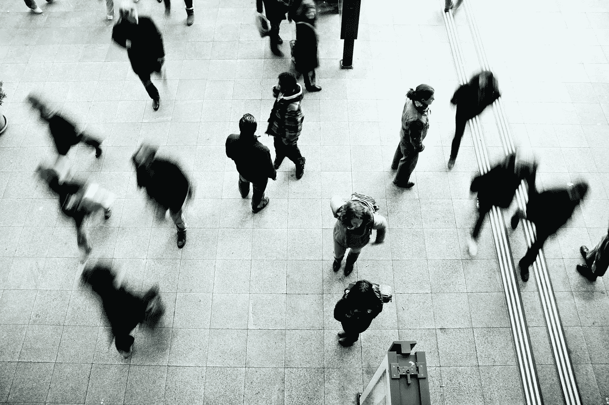

# 50 多次机器学习面试（作为面试官）教会了我什么

> 原文：[`towardsdatascience.com/what-50-ml-interviews-as-an-interviewer-have-taught-me-6a72f7344eb1`](https://towardsdatascience.com/what-50-ml-interviews-as-an-interviewer-have-taught-me-6a72f7344eb1)

## 作为面试官，你能做些什么以在结果不论如何的情况下给候选人留下积极的印象？

 [Thushan Ganegedara](https://thushv89.medium.com/?source=post_page-----6a72f7344eb1--------------------------------)

·发表于 [Towards Data Science](https://towardsdatascience.com/?source=post_page-----6a72f7344eb1--------------------------------) ·6 分钟阅读·2023 年 7 月 7 日

--

图片由 [charlesdeluvio](https://unsplash.com/@charlesdeluvio?utm_source=unsplash&utm_medium=referral&utm_content=creditCopyText) 提供，来自 [Unsplash](https://unsplash.com/photos/rRWiVQzLm7k?utm_source=unsplash&utm_medium=referral&utm_content=creditCopyText)

如果你觉得面对技术面试很困难，那么尝试进行面试吧。我说的不是那些给人留下刺耳印象的尴尬面试官，他们傲慢地看着你，你只希望痛苦早点结束。我说的是那些留下积极印象、你会珍惜的面试官。

面试是一项巨大的责任。你是某人职业生涯的把关人。因此，你必须尽你所能对他们尽量公平。

我将提到的所有要点都围绕一个关键价值展开：

> 同理心！

如果你掌握了同理心，你可能甚至不需要阅读这篇文章。我在这里讨论的一切都是我的个人观点，不代表我雇主的看法。

> 为了提供背景，我是一名机器学习工程师，我讨论的是技术或编码面试。

阅读完这篇文章后，你将（希望）获得一些经验，这些经验将使你成为一个更好的面试官，给候选人留下积极的印象（无论结果如何）。

让我们先跳过候选人的明显检查，先理清思路：

+   展现出对语言和工具的扎实技术知识

+   在解决问题时思考

+   友好与合作

任何没有打勾的项都是值得关注的。

# 协作优于审查

图片由 [Mitchell Luo](https://unsplash.com/@mitchel3uo?utm_source=unsplash&utm_medium=referral&utm_content=creditCopyText) 拍摄，发布在 [Unsplash](https://unsplash.com/s/photos/collaboration?utm_source=unsplash&utm_medium=referral&utm_content=creditCopyText)

面试官进行面试的风格对面试结果起着重要作用。如果面试官表现得像一个无法满足的权威人物，即使是最优秀的候选人也可能会紧张并感到不安。当候选人面前有一个亲切的人时，他们的表现会更好。

我的一种方法是将面试几乎变成一场对偶编程的会话，我们两个人共同努力解决问题，而不是默默地（有些悲惨地）观察候选人对问题的痛苦挣扎。

我不会撒谎，我曾经支持“审查团队”。那时，我认为评估候选人的最重要标准是看他们是否能自己找到解决方案。在工作中，解决问题的时间很少仅仅依赖于你的技术知识。相反，它更多地受到以下因素的影响……

+   知道应该问什么问题（当然是对的人）

+   交流你到目前为止的工作

+   解释和执行他人的提示/建议

对偶编程给了你一个黄金机会来测试候选人的这些“软技能”。因此，与其孤军奋战，不如组成一个团队，共同努力达到最终解决方案。为了推动候选人朝正确方向前进或在他们卡住时打破僵局，我会使用诸如“*告诉我你在想什么*”或“*也许从伪代码开始*”这样的短语。我不是说你应该把解决方案直接交给他们，而是帮助他们成功。

这种方法不仅有助于你评估候选人的一系列硬技能和软技能，而且还让候选人感受到成就感（而不是在他们遇到困难时被抛弃）。

# 情境意识

图片由 [Timon Studler](https://unsplash.com/@derstudi?utm_source=unsplash&utm_medium=referral&utm_content=creditCopyText) 拍摄，发布在 [Unsplash](https://unsplash.com/s/photos/situation?utm_source=unsplash&utm_medium=referral&utm_content=creditCopyText)

你必须培养的一个关键技能不是记住问题的答案（尽管这很重要），而是具有敏锐的情境意识。每个候选人都是不同的，每次面试的体验也是不同的。作为面试官，你必须能够适应那个独特的情境。

如果候选人显得紧张，多微笑一点，问问天气，并让他们知道你在这里如果需要帮助。如果候选人在解决问题时需要一些个人空间，给予他们这些空间。如果候选人在面试开始时遇到技术困难，给他们一点额外的时间来弥补丧失的时间。

不仅在面试过程中需要这样做，而且在面试后也要这样做。在评估候选人时，通过排除噪音建立他们表现的公平形象。问自己一些问题，例如，

+   如果他们不紧张的话，表现是否会更好？

+   候选人是否有文化/语言障碍？

+   这是一个我会期待与之合作的人吗？

候选人通常会随着面试阶段的进行变得越来越自信/舒适。也许候选人正经历非常糟糕的一天！因此，作为面试官，你需要能够穿透这些，评估候选人的技能。我不是说你应该完全忽略这些事实。记下它们并与其他面试官/招聘人员沟通。但如果你期待面试者总是处于最佳状态，你会感到失望。记住我们都是人！这也引出了第二点。

# 写详细的反馈

[Aaron Burden](https://unsplash.com/@aaronburden?utm_source=unsplash&utm_medium=referral&utm_content=creditCopyText) 在 [Unsplash](https://unsplash.com/s/photos/write?utm_source=unsplash&utm_medium=referral&utm_content=creditCopyText) 提供的照片

这是作为面试官最难掌握的事情之一：写出全面且公平的评估。为什么困难？因为在一个小时或 45 分钟的时间窗口内，你需要评估候选人的许多方面，同时你的精神带宽有限。和其他事情一样，掌握这项技能需要时间。

一些可以帮助你的事项有，

+   使用模板在面试过程中记笔记。可以是面试中的每个任务，他们做得好的地方和做得不好的地方。一个重要的点是要有具体的例子，而不是模糊的陈述。

+   查看其他人写的反馈（如果你能看到的话）

+   不要拖延记笔记——确保在面试结束时你的笔记是完整的。否则，你将**总是**忘记在面试过程中做出的重要观察。

# 准时

[Aron Visuals](https://unsplash.com/@aronvisuals?utm_source=unsplash&utm_medium=referral&utm_content=creditCopyText) 在 [Unsplash](https://unsplash.com/s/photos/time?utm_source=unsplash&utm_medium=referral&utm_content=creditCopyText) 提供的照片

作为面试官，容易产生一种皇室感。可能会出现这样的想法：“他们应该在等我进来，而不是我等他们。”个人而言，更重要的是我以他们（或我）对待自己时间的方式来珍惜别人的时间。

我不必提醒你面试前的兴奋（以一种可怕的方式）是怎样的。而且 99%的候选人肯定会准时参加面试。作为面试官，我也应当对候选人做到这一点，这才公平。

# 结论

进行一次出色的面试不是一门科学，没有一个万能的配方可以总是奏效。这更多地依赖于你解读情况和候选人的能力。

重要的是将这些建议/学习看作参考。它们不是精确的规则，也没有确切的衡量标准。例如，我并不是说你应该仅仅因为候选人紧张而放弃他们。但如果候选人回答了 80%的问题，并且你知道他们已经很久没有面试，并且他们非常紧张，那么可以给他们第二次机会。

此外，作为一个“善良的人”可以帮助使面试过程更加愉快。遗憾的是，我曾见过面试官在面试后嘲笑候选人的弱点。对大多数人来说，面试是一个非常紧张的经历，我们都有过犯错的时候。所以尽量避免这样做。

感谢你的阅读！我希望这些建议能帮助你成为更出色的技术面试官！

如果你喜欢这个故事，欢迎 [订阅](https://thushv89.medium.com/membership) Medium，你将会收到我发布的新内容通知，并且可以解锁访问成千上万来自其他作者的精彩故事。

[## 通过我的推荐链接加入 Medium — Thushan Ganegedara](https://thushv89.medium.com/membership?source=post_page-----6a72f7344eb1--------------------------------)

### 作为 Medium 的会员，你的会员费的一部分会支付给你阅读的作者，你将获得每个故事的全面访问权限……

[thushv89.medium.com](https://thushv89.medium.com/membership?source=post_page-----6a72f7344eb1--------------------------------)
