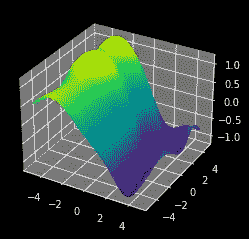
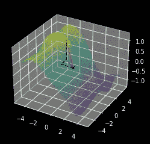
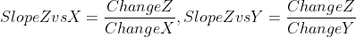
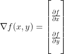
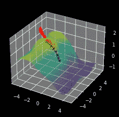
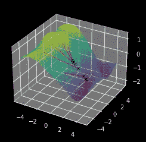
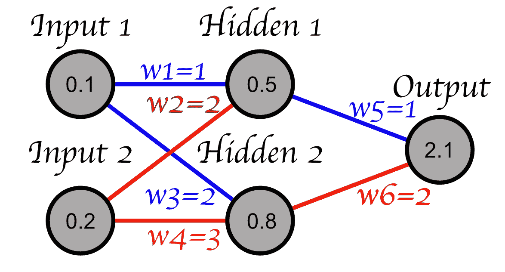
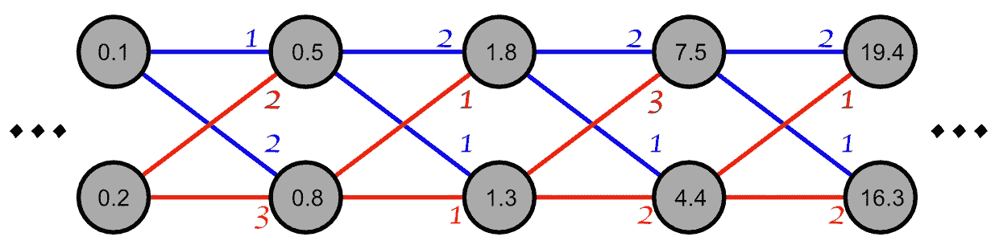
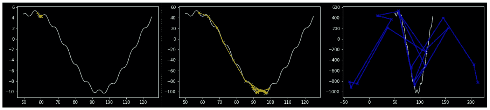

# 什么是梯度，为什么会爆炸？

> 原文：[`towardsdatascience.com/what-are-gradients-and-why-do-they-explode-add23264d24b`](https://towardsdatascience.com/what-are-gradients-and-why-do-they-explode-add23264d24b)

## 阅读这篇文章，你将对深度学习中最重要的概念有一个坚定的理解。

[](https://medium.com/@danielwarfield1?source=post_page-----add23264d24b--------------------------------)[](https://towardsdatascience.com/?source=post_page-----add23264d24b--------------------------------) [Daniel Warfield](https://medium.com/@danielwarfield1?source=post_page-----add23264d24b--------------------------------)

·发布于 [Towards Data Science](https://towardsdatascience.com/?source=post_page-----add23264d24b--------------------------------) ·10 分钟阅读·2023 年 6 月 12 日

--


“梯度爆炸”，由 MidJourney 制作。所有图像均由作者提供，除非另有说明。

梯度可以说是机器学习中最重要的基础概念。在这篇文章中，我们将探讨梯度的概念、使梯度消失和爆炸的原因，以及如何控制梯度。

**这对谁有用？** 对初学者到中级的数据科学家有用。我将包括一些可能对更高级读者有用的数学参考。

**你将从这篇文章中获得什么？** 对梯度的深入概念理解，它们如何与机器学习相关，梯度带来的问题，以及用来减轻这些问题的方法。

# 目录

点击链接以导航到特定部分

**1)** **什么是梯度？** **2)** **实际梯度（数学上）** **3)** **简单模型中的梯度（一个例子）** **4)** **什么是梯度爆炸和消失？** **5)** **为什么梯度爆炸和消失不好？** **6)** **我们如何修复梯度爆炸和消失？**

# 什么是梯度？

目录

想象你有一些表面，有山丘和山谷。这个表面由一些多维函数（具有多个输入的函数）定义。

```py
"""
Making a 3d surface with hills and vallys, for demonstrative purposes
"""

import matplotlib.pyplot as plt 
from matplotlib import cm
from matplotlib.ticker import LinearLocator
import numpy as np

#creating wide figure
fig, ax = plt.subplots(subplot_kw={"projection": "3d"})

# Make data.
X = np.arange(-5, 5, 0.25)
Y = np.arange(-5, 5, 0.25)
X, Y = np.meshgrid(X, Y)
R = np.sqrt(X**2 + Y**2)
Z = 0.2*np.sin(X+Y + R) - 1*np.sin(X/2)

# Plot the surface.
surf = ax.plot_surface(X, Y, Z, cmap=cm.viridis,
                       linewidth=0, antialiased=False)

plt.show()
```



一些表面，有山丘和山谷

**梯度告诉你，** **对于表面上的任何给定点，它既指明了到达更高点的方向，也描述了该点表面的陡峭程度。**

因为这是一个三维表面（输入是 x 和 y，输出是 z），我们可以通过计算在 X 轴和 Y 轴上某个点的坡度来计算梯度的简化版本。

```py
"""
Calculating a simplified gradient using slopes along the X and Y direction
"""

def computeZ(x,y):
    """
    calculates any point on the surface
    """
    r = np.sqrt(x**2 + y**2)
    z = 0.2*np.sin(x+y + r) - 1*np.sin(x/2)

    return z

def plot_pseudo_gradient(x,y):
    """
    Calculates an approximation of the gradient using slope calculations
    of neighboring points offset by a small dx and dy.
    """

    #computing value at point
    z = computeZ(x,y)

    #defining some small distance to traverse 
    dx = 0.9
    dy = 0.9

    #getting the change in Z as a result of the change in X and Y
    dzx = (computeZ(x+dx,y) - computeZ(x,y))
    dzy = (computeZ(x,y+dy) - computeZ(x,y))

    #calculating the slope along the x and y axis.
    #these together tell you the direction of increase
    #and the slope of the current point, so these together
    #are the actual pseudo gradient
    slope_x = dzx/dx
    slope_y = dzy/dy

    #to scale the vectors for visability
    scale = 7

    #calculating the value at the end of the pseudo gradient
    #so I can draw a tangent line along the surface in the direction
    #of the gradient
    dz = computeZ(x+slope_x*scale,y+slope_y*scale)

    xs = [x, x+slope_x* scale]
    ys = [y, y+slope_y* scale]
    zs = [z, z+dz]

    #plotting the actual gradient
    ax.plot([xs[0], xs[1]],
            [ys[0],ys[1]],
            [zs[0],zs[0]], 'b')

    #plotting the tangent line
    ax.plot(xs, ys, zs, 'r')

    #plotting vector components of the tangent line
    ax.plot([xs[0],xs[1],xs[1],xs[1]],
            [ys[0],ys[0],ys[1],ys[1]],
            [zs[0],zs[0],zs[0],zs[1]], '--k')

    ax.scatter([x],[y],[z], marker='x', c=['k'])

#creating a figure
fig, ax = plt.subplots(subplot_kw={"projection": "3d"})
ax.computed_zorder=False #unfortunatly, zorder has pervasive bugs in 3d plots

# Plot the surface.
surf.set_zorder(1)
surf = ax.plot_surface(X, Y, Z, cmap=cm.viridis, linewidth=0, antialiased=False, alpha=0.2)
surf.set_zorder(1)

#plotting the pseudo gradient at x=0 and y=0
plot_pseudo_gradient(0,0)

#rendering
plt.show()

#for later use in traversal with the gradient
return slope_x, slope_y
```



蓝色的梯度描述了“x”标记的点的最大增加方向。红线描述了如果你沿着梯度走一段距离，你会到达哪里。

所以，从概念上总结一下，**梯度计算了最大增加的方向，以及这种增加的陡峭程度，通过计算输出相对于函数所有输入的斜率。**

# 实际梯度

目录

在之前的示例中，我计算了我称之为“简化梯度”的内容。我计算了 z 相对于 x 和 y 的小变化的斜率。



用于计算伪梯度的比率。 SlopeZvsX 和 SlopeZvsY 被用来构造图像中的蓝线。

实际上，梯度是使用**偏导数**计算的，这意味着它是**相对于单个变量（x 或 y）的函数的导数。** 如果你对微积分不熟悉，你可以观看一个关于导数的 [视频](https://www.youtube.com/watch?v=rAof9Ld5sOg) 和另一个关于 [偏导数](https://www.khanacademy.org/math/multivariable-calculus/multivariable-derivatives/partial-derivatives/v/partial-derivatives-introduction) 的视频来快速了解数学。不过，无论数学如何，简化梯度和实际梯度的概念是相同的。



这是一个具有 x 和 y 维度的函数的梯度的数学符号。梯度是一个由函数相对于每个输入的偏导数组成的向量，表示为一个向量。真实梯度比我在之前示例中计算的“伪梯度”更加准确且计算更快。从概念上讲，你仍然是在计算给定 x 和 y 变化时的斜率。

# 简单模型中的梯度

目录

在研究机器学习时，你会发现到处都是可微性；可微损失函数、可微激活函数等等。原因是，如果一切都是可微的，你可以快速计算梯度（你需要调整输入以获得更好输出的方向）。

例如，假设我们有一个具有两个参数 x 和 y 的机器学习模型。我们还有一个函数，告诉我们这些参数如何将模型拟合到一组数据。我们可以使用梯度通过在梯度方向上采取一系列步骤来尝试找到最佳模型参数。

```py
"""
Using Gradients to iteratively search for the maximum of the surface
"""

#creating a figure
fig, ax = plt.subplots(subplot_kw={"projection": "3d"})
ax.computed_zorder=False #unfortunatly, zorder has pervasive bugs in 3d plots

# Plot the surface.
surf.set_zorder(1)
surf = ax.plot_surface(X, Y, Z, cmap=cm.viridis, linewidth=0, antialiased=False, alpha=0.3)
surf.set_zorder(1)

#iteratively following the gradient
x,y = 0,0
for _ in range(10):
    dx,dy = plot_pseudo_gradient(x,y)
    x,y = x+dx, y+dy

#rendering
plt.show()

#printing result
print("ideal parameters: x={}, y={}".format(x,y))
```



从 x=0 和 y=0 进行迭代梯度搜索到局部最大值。 “x” 点标记了每次迭代的位置。在这种情况下，梯度优化的结果是 x=-3.104，y=0.789。

当人们谈论训练时，他们有时会提到“损失景观”。**当你将一个问题转化为机器学习问题时，你实际上是在创建一个参数的景观，这些参数表现得比其他参数好或差**。你定义什么是好，什么是坏（损失函数），以及一个复杂的函数，它具有一组可微分的参数，可以调整以解决问题（机器学习模型）。这两者共同创建了一个理论上的*损失景观*，通过梯度下降（模型训练）来遍历这个景观。**但** **什么是梯度下降？**

数学上，梯度用于指向函数中的更大值。在机器学习中，我们通常优化以减少错误率，因此我们希望我们的损失函数（错误数量）更小，而不是更大。数学上几乎是相同的；你只需将一些 + 变成 -。

```py
"""
reworking the previous example to find the minumum with gradient descent
"""

fig, ax = plt.subplots(subplot_kw={"projection": "3d"})
ax.computed_zorder=False

surf.set_zorder(1)
surf = ax.plot_surface(X, Y, Z, cmap=cm.viridis, linewidth=0, antialiased=False, alpha=0.3)
surf.set_zorder(1)

x,y = 0,0
for _ in range(10):
    dx,dy = plot_pseudo_gradient(x,y)
    x,y = x-dx, y-dy #<----------- this is the only part that changed

plt.show()

print("ideal parameters: x={}, y={}".format(x,y))
```



梯度下降，通常在机器学习中使用的方法。

# 什么是梯度爆炸和梯度消失？

目录

首先，让我们看一个简化的神经网络。我们将忽略激活函数和偏置，仅将神经网络视为一系列权重。在这种简化的条件下，神经网络看起来像这样：



这是一个小型神经网络的例子，它仅使用权重。Hidden 1 的值是 input1*w1 + input2*w2，这等于 0.5。在一般情况下，感知器将每个输入乘以其各自的权重，然后将这些值加在一起。

当我们有更深层的神经网络时，梯度爆炸和梯度消失的问题就会出现。想象一个网络，其中有几个更多的层在进行乘法和加法，不断地进行乘法和加法等等。



神经网络深层部分的快照

如你所见，当你持续乘以大于 1 的数字时，值会迅速增大。如果权重小于 1，值会因为乘以越来越小的值而迅速缩小。

我们可以看到，网络中的值会因为模型中的权重而迅速变大或变小，但我们也可以将每个感知器中的值看作**变化**，而不是具体的值。


想象一下感知器中的数字不是感知器的值，而是感知器值的**变化**。正如你所看到的，由于重复的乘法，当你深入网络时，变化的速度会增加。

关键点是：**如果权重大于 1，重复的乘法会导致变化率（梯度）变得非常大；如果权重小于 1，变化率会变得非常小。** 换句话说，梯度可能会**爆炸或消失**。

# 为什么梯度爆炸和梯度消失不好？

目录

大梯度，小梯度，那又如何？

小梯度移动缓慢，并且有可能陷入浅层的局部最小值。因此，梯度消失可能导致模型无法改进。另一方面，梯度爆炸移动过快，并可能出现不稳定的情况，从而导致模型无法收敛到最小值。

```py
"""
Plotting 3 similar landscapes scaled vertically
to have small, moderate, and large gradients
"""

def f(x, scale):
    """
    Function to represent the landscape we are attempting to optimize
    scaling the function vertically will scale the gradients proportionally
    """
    return scale*(0.3*np.sin(x*0.1) +0.5* np.sin(np.cos(x)) + 0.1*np.sin(x*0.3+2) + 4*np.cos(x*0.1) + 6*np.sin(x*0.05))

def f_slope(x, scale):
    """
    Using a pseudo derivative instead of computing the actual derivative
    """
    dx = 0.00001
    slope = (f(x+dx, scale)-f(x, scale))/dx
    return slope

#defining range
X = np.linspace(50,125,10000)

for gradient_scale, color in zip([1,10,100], ['r', 'y', 'b']):
    #computing landscape
    Y = np.array(list(map(f, X, [gradient_scale]*len(X))))

    point = 58
    explored_x = []
    explored_y = []
    for _ in range(20):

        #marking point as explored
        explored_x.append(point)
        explored_y.append(f(point,gradient_scale))

        #traversing along gradient
        point = point-f_slope(point, gradient_scale)

    #plotting landscape
    plt.plot(X,Y)
    #plotting traversal
    plt.plot(explored_x, explored_y, 'x-'+color)
    #rendering
    plt.show()
```



三种形状相似的景观，一种梯度几乎为零（左），一种梯度适中（中），一种梯度爆炸（右）。梯度消失导致模型改进不足，而梯度爆炸则导致不稳定性。

当你考虑到**不仅仅是更大的模型有梯度，每个感知机也有自己的梯度**时，这个问题变得更加普遍。这意味着网络中的不同感知机可以有非常不同的梯度。理论上，**一个模型在不同的部分可以同时存在梯度消失和梯度爆炸**。

# 我们如何解决梯度爆炸和梯度消失的问题？

目录

## 1) 调整学习率

学习率通过梯度进行乘法运算，以控制每次迭代沿梯度方向的步长。较小的学习率会导致较小的步伐，而较大的学习率则会导致较大的步伐（我在之前的示例中做了大致等效的操作）。这在一定程度上可能有用，但梯度消失和梯度爆炸的问题在于梯度在模型中会发生变化（一些感知机的变化很小，其他的变化很大）。因此，虽然学习率是一个关键的超参数，但通常不被视为专门处理梯度消失和梯度爆炸的解决方法。

## **2) 更改激活函数**

出于各种原因，感知机并不会只是将其输入乘以某些权重，将结果加在一起，然后输出结果。几乎所有网络都会将这一操作的结果通过一个称为激活函数的函数。激活函数都是可微分的，因此在影响网络深度中的梯度方面具有多种特性。

## **4) 更改模型架构**

简单地缩短网络可以有所帮助。然而，如果这不是一个选项，几种网络架构被专门设计来处理这个问题。LSTM 被设计得比经典 RNN 在处理梯度爆炸方面更具鲁棒性，残差和跳跃连接也被设计用来帮助解决这种现象。

## **5) 使用批量归一化**

批量归一化是机器学习中的一种主要正则化策略。它不是通过单一梯度来更新模型参数，而是通过使用一批样本的平均梯度来更新参数。

## **6) 梯度裁剪**

你可以设置梯度的最大允许阈值。如果梯度超过这个值，就将梯度的大小设为这个阈值。

## 7) 使用权重正则化

L1 和 L2 正则化用于对高权重值的模型施加惩罚。添加这种形式的正则化可以减少梯度爆炸。

## 8) 截断上下文窗口

无论你使用的是递归网络还是其他使用上下文窗口的网络，缩小窗口的大小可以帮助最小化复合梯度问题。

# 结论

就这样！在这篇文章中，我们了解了梯度以及其背后的数学。我们了解到，你可以使用梯度在某些维度空间中上下移动表面，并且了解了如何利用这来优化机器学习模型。我们还了解到，随着模型规模的增大，梯度可能会爆炸成很大的数值，或消失成很小的数值，这两者都可能破坏模型的学习能力。我们还讨论了修正梯度消失和梯度爆炸的一些方法。

# 关注以获取更多信息！

在未来的文章中，我将描述一些机器学习领域的标志性论文，重点介绍实用和直观的解释。我还会有关于不常讨论的机器学习概念的文章。
