# 如何使用 Hugging Face 代理进行 NLP 任务

> 原文：[`towardsdatascience.com/what-are-hugging-face-agents-48c175bd33e3`](https://towardsdatascience.com/what-are-hugging-face-agents-48c175bd33e3)

## 一步步教程，教你如何使用 Transformers 工具和代理。

[](https://medium.com/@fmnobar?source=post_page-----48c175bd33e3--------------------------------)[](https://towardsdatascience.com/?source=post_page-----48c175bd33e3--------------------------------) [Farzad Mahmoodinobar](https://medium.com/@fmnobar?source=post_page-----48c175bd33e3--------------------------------)

·发表于[Towards Data Science](https://towardsdatascience.com/?source=post_page-----48c175bd33e3--------------------------------) ·阅读时间约 11 分钟·2023 年 5 月 17 日

--


由[Alev Takil](https://unsplash.com/@alevisionco?utm_source=unsplash&utm_medium=referral&utm_content=creditCopyText)拍摄，图片来自[Unsplash](https://unsplash.com/photos/3syTDiVAc7w?utm_source=unsplash&utm_medium=referral&utm_content=creditCopyText)

[Hugging Face](https://huggingface.co)，一个为机器学习从业者提供的开源 AI 社区，最近将工具和代理的概念集成到了其流行的[Transformers](https://huggingface.co/docs/transformers/index)库中。如果你已经使用 Hugging Face 进行自然语言处理（NLP）、计算机视觉和音频/语音处理任务，你可能会好奇工具和代理为生态系统带来了什么价值。代理为用户增加了一个可以说是重要的便利性——让我来解释一下。

假设我想使用 Hugging Face Hub 上的模型将英文翻译成法文。在这种情况下，我需要进行一些研究以找到一个好的模型，然后弄清楚如何实际使用该模型，最后编写代码生成翻译。但是，如果你已经有一个 Hugging Face 专家在手，他们已经知道所有这些信息呢？换句话说，你只需告诉专家你想将一个句子从英文翻译成法文，然后专家会负责寻找一个好的模型、编写代码并返回结果——而且专家的速度远远快于你和我能做的。这正是代理的作用！我们用简单的英文描述我们想要的，然后代理查看其工具箱中的可用工具并执行它！这非常类似于请求 ChatGPT 翻译一个句子，然后 ChatGPT 处理剩下的。但是现在，代理不仅限于 ChatGPT 使用的少数几个模型（即 [Open AI 模型](https://platform.openai.com/docs/models)，例如 GPT 3.5 或 GPT-4），代理还可以访问 Hugging Face 上的许多模型。

现在我们了解了代理和工具的作用，让我们看看如何实现它们。

[## 通过我的推荐链接加入 Medium](https://medium.com/@fmnobar/membership?source=post_page-----48c175bd33e3--------------------------------)

### 阅读 Farzad（以及 Medium 上的其他作者）的每个故事。你的会员费直接支持 Farzad 和其他…

[medium.com](https://medium.com/@fmnobar/membership?source=post_page-----48c175bd33e3--------------------------------)

# Transformers 代理 — 实现

对于这一部分，我主要依赖于 Hugging Face [文档](https://huggingface.co/docs/transformers/transformers_agents) 关于代理，并使用我自己的示例进行了实现。

# 步骤 1 — 要求

让我们开始导入我们在这个练习中将要使用的一些库。请注意，我在结果中包含了这些库的版本，以便你想创建一个相同的环境。

```py
import transformers, huggingface_hub, diffusers, torch
from platform import python_version
print(f'python: {python_version()}')
print(f'transformers: {transformers.__version__}')
print(f'huggingface_hub: {huggingface_hub.__version__}')
print(f'diffusers: {diffusers.__version__}')
print(f'torch: {torch.__version__}')
```

结果：

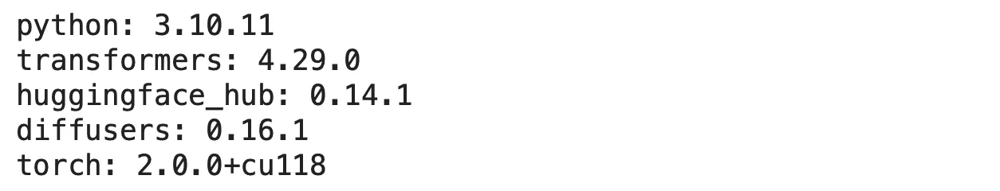

如果你的环境中没有一个或多个这些库，你可能会从上述代码块中遇到错误。如果是这样，你可以运行下面的单元格来安装这些库。我假设如果你正在阅读这篇文章，你的环境中已经有 Python，因此下面没有包含。

> **技巧提示：** 如果你需要运行一行命令，例如在 Jupyter notebook 或类似环境中安装 transformers，你可以使用 `!pip install transformers==4.29.0`。在下面的代码块中，我使用了 `%%sh`，这是一个魔法命令，表示此单元格中的所有内容都作为命令运行。

```py
%%sh

pip install transformers==4.29.0

pip install huggingface_hub==0.14.1

pip install diffusers==0.16.1

pip install --upgrade torch torchvision

pip install openai==0.27.6
```

# 步骤 2 — Hugging Face 登录

现在我们的环境已经准备好，我们需要登录到 Hugging Face 以访问他们的推理 API。此步骤需要一个免费的 Hugging Face 令牌。如果你没有，可以按照[这个链接](https://huggingface.co/docs/api-inference/quicktour)中的说明（我花了不到 5 分钟）为自己创建一个。

让我们登录。

```py
import huggingface_hub
from huggingface_hub import login

my_hf_token = 'ADD_YOUR_TOKEN_HERE'

login(my_hf_token)
```

结果：

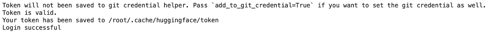

结果显示登录成功。

在下一步中，我们将实例化代理。请注意，Hugging Face 支持各种代理（本质上是大型语言模型或 LLM）。有些代理是收费的，如 Open AI 的，有些是开源的，如 BigCode 和 OpenAssistant。对于这篇文章，我选择了 BigCode 提供的一个免费开源选项[Starcoder](https://huggingface.co/bigcode/starcoder)，因为这将更方便刚入门的用户尝试这些模型。如果你对使用其他代理感兴趣，Hugging Face 提供了一个易于阅读的教程，链接在[这里](https://huggingface.co/docs/transformers/transformers_agents)。

让我们继续进行下一步并实例化我们的代理。

# 第 3 步 — 实例化代理

下面的代码块实例化了来自 BigCode 的[Starcoder](https://huggingface.co/bigcode/starcoder)代理。

```py
import transformers
from transformers import HfAgent

# Starcoder
agent_starcoder = HfAgent("https://api-inference.huggingface.co/models/bigcode/starcoder")
```

现在我们的代理准备好了，让我们看看它能做什么！

# 第 4 步 — 执行任务

我们将要求模型生成一张图片，这是第一个任务。我们的做法是将我们想要的内容传达给代理，然后代理会完成它。让我们来看一个例子。

```py
task = "Draw me a picture of the ocean"

picture_ocean = agent_starcoder.run(task)

picture_ocean
```

结果：

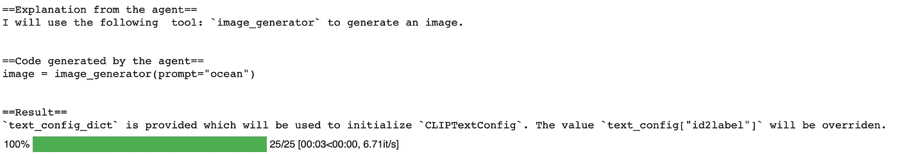

由[Hugging Face Agent](https://huggingface.co/docs/transformers/transformers_agents)生成的海洋图片

这很有趣！从结果来看，我们可以看到代理解释了它采取的一些步骤。例如，代理使用了`image_generator`工具来生成我们要求的图片。

我们提到我们的代理是一个 LLM，我们知道输出是随机生成的，并且期望在重新运行模型时会有所变化。让我们看看如果再运行一次相同的任务会得到什么结果。

```py
picture_ocean = agent_starcoder.run(task)

picture_ocean
```

结果：

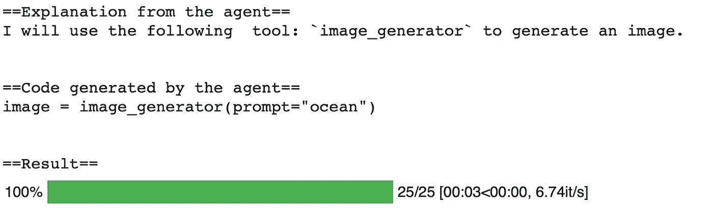

由[Hugging Face Agent](https://huggingface.co/docs/transformers/transformers_agents)生成的海洋图片

正如预期的那样，图片不同。但是，如果在看到图片后，我们想对图片进行修改会怎么样呢？例如，看到这张图片中有一艘船会很不错。让我们要求我们的代理在同一张图片上添加一艘船。

```py
picture_ocean_updated = agent.run("Transform the image in `picture_ocean` to add a ship to it.", picture=picture_ocean)

picture_ocean_updated
```

结果：

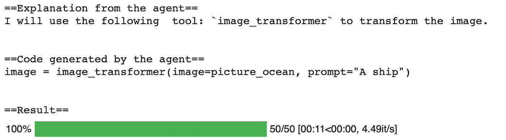

由[Hugging Face Agent](https://huggingface.co/docs/transformers/transformers_agents)生成的海洋和船只图片

如我们所见，这次代理使用了一个不同的工具叫做`image_transform`，因为它不再需要生成整张图像，而是通过在提供的图像中添加一艘船来*转换*图像。我们可以看到图像左上角的那个小船。表现得还不错！

不过这时候你可能会问，代理实际上在做什么？我们将在接下来回答这个问题。

# 第 5 步 — 代理实际上做了什么？

正如我们之前所学，代理是执行我们提供的提示的 LLM。换句话说，代理接收我们的提示，然后根据要求，代理收集他们认为有用的工具并运行这些代码。Hugging Face 提供了一种查看代理代码的方法，即在我们的运行命令中添加`return_code=True`。换句话说，我们可以要求代理仅返回代码块，然后我们可以自己修改和/或运行代码。

让我们重新运行我们的命令，如下所示，并查看结果：

```py
task = "Draw me a picture of the ocean"

agent_starcoder.run(task, return_code=True)
```

结果：

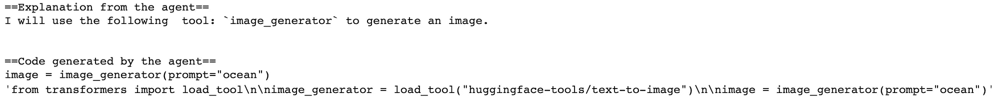

我已经清理并重新编写了代理返回的内容如下：

```py
from transformers import load_tool
image_generator = load_tool("huggingface-tools/text-to-image")
image = image_generator(prompt="ocean")
```

让我们运行这段代码并查看结果。

```py
 from transformers import load_tool

image_generator = load_tool("huggingface-tools/text-to-image")

image = image_generator(prompt="ocean")

image
```

结果：

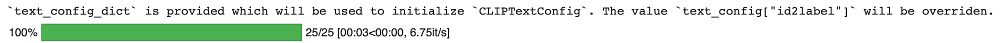

海洋的图片，由[Hugging Face 代理](https://huggingface.co/docs/transformers/transformers_agents)生成

结果如预期那样工作。换句话说，我们不再需要依赖代理为我们创建代码，我们可以直接使用`huggingface-tools/text-to-image`工具生成图片。

现在我们了解了代理如何选择工具并工作的过程，让我们看看一些额外的工具。

# 第 6 步 — 额外工具

在本节中，我们将涵盖代理可以使用的其他一些工具，如下所示：

+   图像描述

+   问题解答

+   翻译

+   混合请求

## 6.1\. 图像描述

这是一个有趣的练习。首先，我们将使用`text-to-image`工具生成一张玩具车的图片。然后我们将保存该图片，并要求代理对其进行描述。

让我们开始创建一张玩具车的图片。

```py
from transformers import load_tool

image_generator = load_tool("huggingface-tools/text-to-image")

image_generator(prompt="toy car")
```

结果：

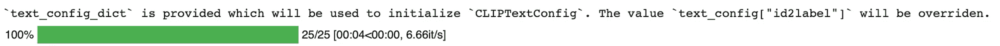

玩具车的图片，由[Hugging Face 代理](https://huggingface.co/docs/transformers/transformers_agents)生成

然后，我将其保存到本地驱动器，然后使用[Python Imaging Library 或 PIL](https://pillow.readthedocs.io/en/latest/handbook/tutorial.html)读取它。之后，我们将提示代理对该图像进行描述。

下面是代码块：

```py
from PIL import Image

task = 'Caption the following image'

image = Image.open('/content/picture.png')

agent_starcoder.run(task, image=image)
```

结果：

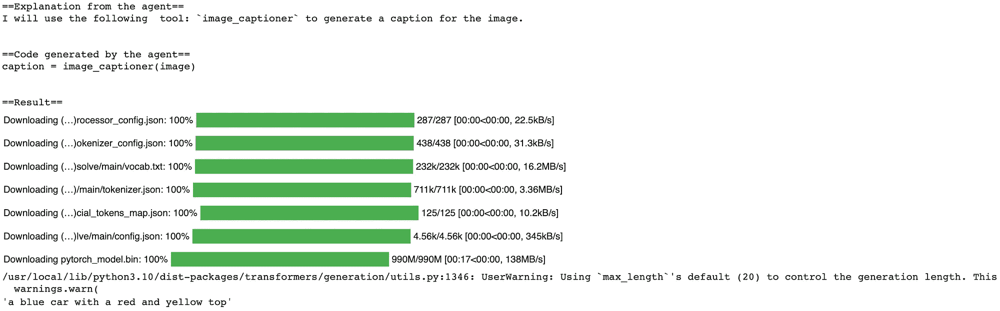

看看最后一句话——这是一个很好的描述！代理描述了这辆车，这似乎相当准确。如果你对幕后发生的事情感到好奇，让我们让代理返回代码，看看使用了哪些工具以及如何使用，如下所示：

```py
agent_starcoder.run(task, image=image, return_code=True)
```

结果：

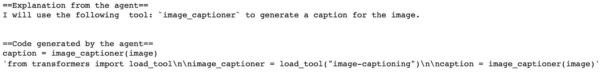

让我们将代码块清理如下：

```py
from transformers import load_tool
image_captioner = load_tool("image-captioning")
caption = image_captioner(image)
```

代理所做的是加载`image-captioning`工具，然后为我们提供的图像生成标题。听起来很简单！让我们继续下一个例子。

## 6.2\. 问答

问答是显而易见的，但让我们让它更有趣。与其提供一段文字给代理并询问有关提供信息的问题，不如提供一张图像，并询问代理有关图像的内容。

我在一个 Word 文档中写了几行文字，然后将其保存为`*.jpg`图像在本地。我们首先使用 PIL 查看如下图像：

```py
from PIL import Image
image = Image.open('/content/jack.jpg')
image.show()
```

结果：

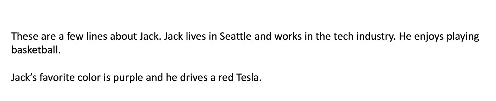

如你所见，图像中有几句关于我在西雅图的虚构朋友 Jack 的句子。接下来，让我们向代理提问，并看看它如何回应。我想问代理 Jack 最喜欢的颜色是什么，如下所示：

```py
task = "in the following 'document', what is Jack's favorite color?"

agent_starcoder.run(task, document=image)
```

结果：

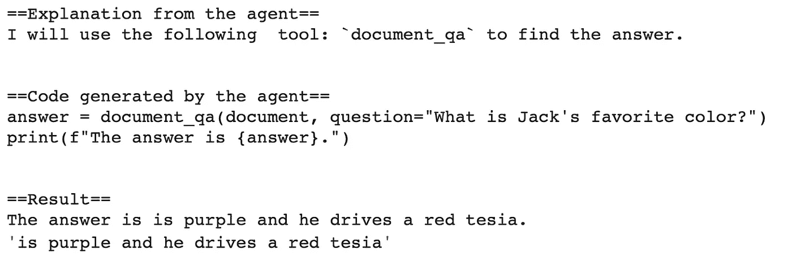

再次查看底部的最后一句——这相当不错！我们可以看到文本提取并不完美，例如，它将 Tesla 提取为‘tesia’，但代理仍然返回了相关的图像部分，回答了我们的问题。

让我们看看代理究竟使用了哪些工具：

```py
task = "in the following 'document', what is Jack's favorite color?"

agent_starcoder.run(task, document=image, return_code=True)
```

结果：

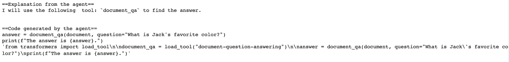

让我们将代码清理如下：

```py
from transformers import load_tool

document_qa = load_tool("document-question-answering")

answer = document_qa(document, question="What is Jack's favorite color?")
print(f"The answer is {answer}.")
```

我们可以看到代理使用了`document-question-answering`工具，然后以问答任务的形式提出了问题。

接下来，让我们看看代理是否能执行翻译。

## 6.3\. 翻译

这部分相当简单。让我们让代理翻译一个句子，然后看看它使用了哪些工具。

```py
text = 'this is a sentence in English'

task = "translate the following 'document' to French"

agent_starcoder.run(task, document=text)
```

结果：

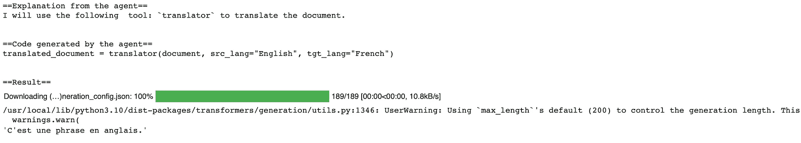

太棒了！我们看到了结果，这是所提供句子的法语翻译。让我们看看代理使用了什么工具：

```py
agent_starcoder.run(task, document=text, return_code=True)
```

结果：

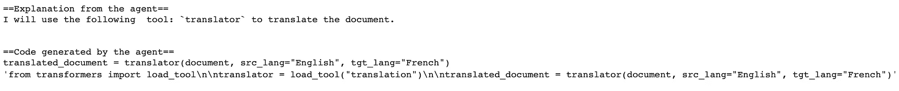

让我先清理一下代码：

```py
from transformers import load_tool
translator = load_tool("translation")
translated_document = translator(document, src_lang="English", tgt_lang="French")
```

这看起来相当简单。代理使用了`translation`工具，并且代理正确地识别了源语言（`src_lang`）和目标语言（`tgt_lang`），这是基于我们要求的！

到这一步，我在想代理是否能够处理更复杂的任务。我们接下来会看看。

6.4\. 混合请求

如果我们将问答和翻译结合起来呢？让我们问代理 Jack 最喜欢的颜色是什么，同时要求答案必须用法语返回。

```py
task = "in the following 'document', what is Jack's favorite color? After you answer the question, translate the answer to French"

agent_starcoder.run(task, document=image)
```

结果：

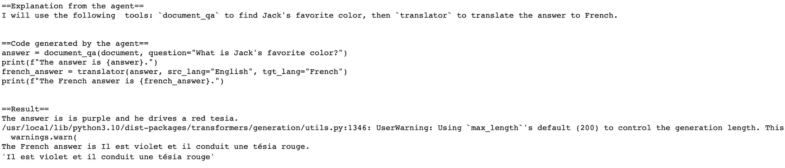

看看最后一句——这很好！我们看到代理首先返回了英文答案，然后按照我们的要求将响应翻译成了法语！

# 结论

-   代理和工具是一个强大的组合。我认为代理对技术用户（即机器学习和 AI 从业者）和非技术用户都很有益。对于技术用户，代理可以加快过程——代理可以帮助选择多个工具中的一个，并返回代码供技术用户根据需求进行修改。另一方面，不熟悉机器学习的非技术用户，只需用简单的英语提出需求，代理将处理其余的工作。

-   希望你喜欢这篇关于代理和工具的简要教程！如果你对在 Hugging Face 中实现自然语言处理（NLP）任务感兴趣，请查看下面的帖子。

[](/implement-nlp-tasks-using-hugging-face-77dfdcad65fd?source=post_page-----48c175bd33e3--------------------------------) ## 使用 Hugging Face 实现 NLP 任务

### -   介绍如何使用 Hugging Face 进行 NLP 任务的教程。

[towardsdatascience.com

# -   感谢阅读！

-   如果你觉得这篇帖子有帮助，请 [在 Medium 上关注我](https://medium.com/@fmnobar) 并订阅以接收我最新的帖子！

-   *(除非另有说明，所有图片均由作者提供。)*
