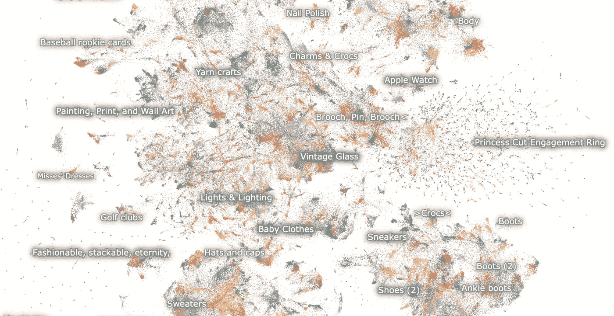
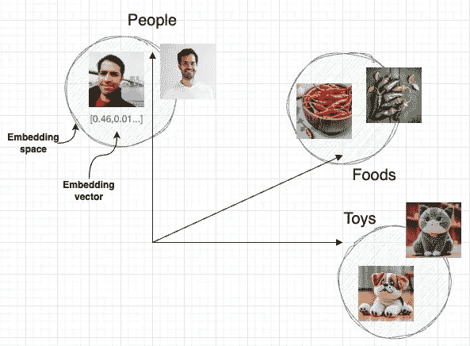
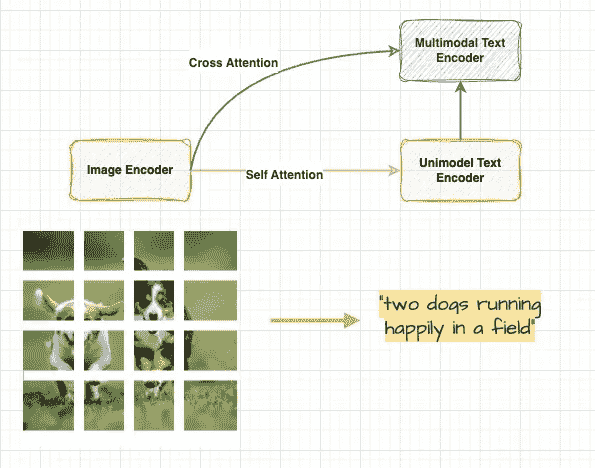
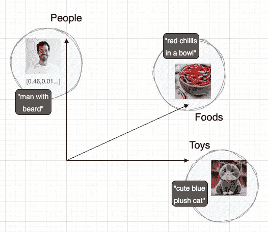
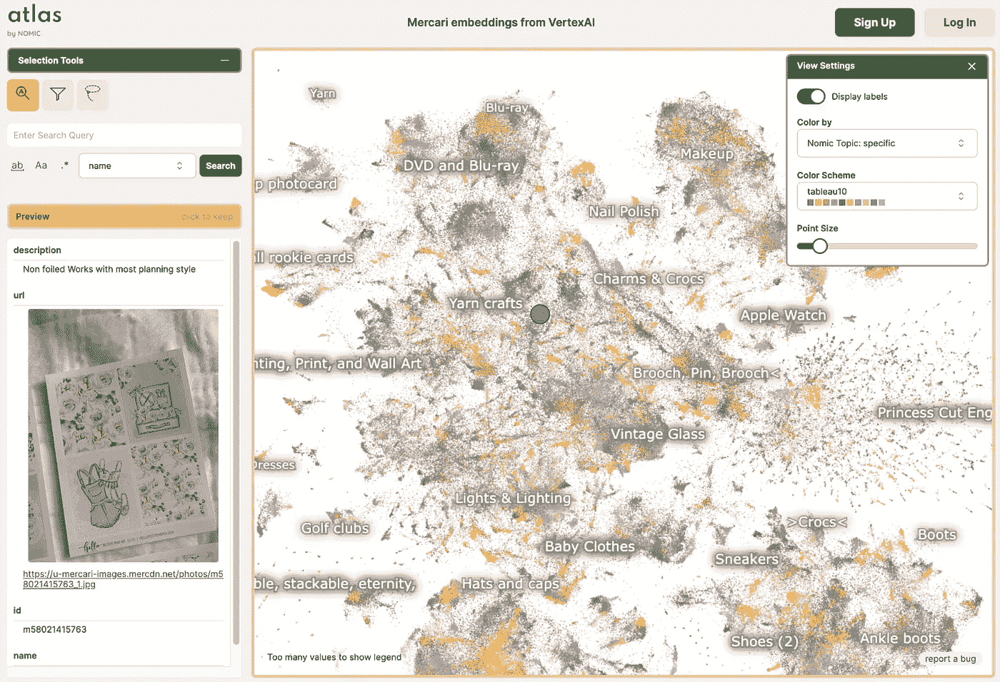

# 什么是多模态模型？

> 原文：[`towardsdatascience.com/what-are-multimodal-models-fe118f3ef963`](https://towardsdatascience.com/what-are-multimodal-models-fe118f3ef963)

## 赋予大型语言模型（LLM）视觉能力！

 [Omer Mahmood](https://medium.com/@omermx?source=post_page-----fe118f3ef963--------------------------------)

·发表于 [Towards Data Science](https://towardsdatascience.com/?source=post_page-----fe118f3ef963--------------------------------) ·阅读时间 6 分钟·2023 年 10 月 16 日

--

在 Atlas by Nomic 上运行的 [Mecari 文本与图像嵌入演示](https://atlas.nomic.ai/map/vertex-mercari) 截图。

## 这篇文章适合谁？

+   **读者群体 [🟢⚪️⚪️]：** AI 初学者，熟悉流行概念、模型及其应用

+   **等级 [🟢🟢️⚪️]：** 中级话题

+   **复杂度 [🟢⚪️⚪️]：** 容易理解，没有数学公式或复杂理论

# ❓为什么这很重要

基础的大型语言模型（LLM），经过在庞大数据集上的预训练，在通过零-shot、few-shot 或迁移学习的提示下处理通用、多任务时相当高效。

确实，这些模型的例子如 [PaLM2](https://ai.google/discover/palm2/) 和 [GPT4](https://openai.com/research/gpt-4) 已经彻底改变了我们与计算机交互的方式，**使用文本作为输入**，但是……

+   如果有一种方法可以通过使这些模型使用不同的输入模态，如照片、音频和视频，来扩展它们的智能会怎样？**换句话说，让它们变成多模态的！**

+   这可能会大大改善我们在网络上搜索信息的方式，甚至在现实世界应用中，例如医学和病理学，帮助我们理解周围的世界。

+   有解决方案！多模态深度学习模型可以结合不同类型输入的嵌入，使得例如一个大型语言模型（LLM）能够“看到”你所询问的内容，并返回相关结果。

**⚡️继续关注** 如果你想了解更多关于这一切如何运作的知识，并试用一个实际的演示！

# 🔥 这如何运作？

## **它从嵌入开始**

训练深度学习模型的最强大构建模块之一是创建嵌入向量。

在训练过程中，模型将遇到的不同类别（例如，人、食物和玩具）编码成其数值表示，即嵌入，这些嵌入存储为数字向量。

嵌入在我们想从类别（或类）的稀疏表示（例如一长串文本或图像）转变为更紧凑的形式，并且可以在其他模型中重用时非常有用。

简而言之，嵌入为我们提供了一种以简写形式存储事物含义的方法，机器可以用来快速比较和搜索！

更具体地说，通过对不同图像进行训练的视觉模型，具有相似外观和含义的图像将在它创建的嵌入空间中被紧密放置在一起。

*图 1：表示不同类别图像和同一嵌入空间中相似图像的嵌入可视化。由作者插图。*

“模型可以将图像映射到嵌入，这是空间中的一个位置。因此，如果你在嵌入周围查看，你可以找到其他具有相似外观和含义的图像。这就是图像相似性搜索的工作原理！”[1]

## **图像和文本对的训练**

类似于前面的示例，深度学习模型也可以通过相关的文本和图像配对进行训练。这是通过结合其他模型来实现的，如下图所示：

*图 2：使用模型组合对图像和文本对进行训练，即“CoCa”。由作者插图。*

让我们来解析一下当我们传入一个图像和文本对时发生了什么：

+   **图像编码器：** 用于获取图像嵌入的模型，

+   **单模态文本编码器：** 一种用于获取文本嵌入的模型。该模型由图像编码器模型输入，接受源图像嵌入作为输入，产生图像和文本对的序列表示，即**自注意力**。

+   **多模态文本编码器：** 一种学习图像和文本之间关系的模型。更正式地说，这种技术称为**交叉注意力**：一种在 Transformer 架构中混合两种不同嵌入序列的注意力机制，或者在我们的案例中是图像和描述它们的文本。

这种设计，或结合模型的一种方式，被称为对比字幕或简单地‘CoCa’，如果你想深入了解，可以查看[这里](https://arxiv.org/abs/2205.01917)！

## **“结果：一个基础的‘视觉语言模型（VLM）’…**

我们建立了一个具有固定维度的共享嵌入空间，用于图像和文本，按照它们的含义组织。在这个空间中，含义相似的图像和文本被放在一起。”[1]

*图 3：相关图像和文本的嵌入可视化。由作者插图。*

这意味着你可以根据文本搜索图像（文本到图像搜索），或者根据图像搜索文本（图像到文本搜索）。

这是 Google 搜索如何在图像和文本中找到相关结果的基本思路。

# 🔍 试一下快速演示！

## 想看看文本和图像嵌入在现实世界应用中的效果吗？

你可以通过使用在 Nomic 提供的 Altas 上运行的演示免费进行体验。

“Atlas 使你能够与非结构化文本、图像和音频数据进行互动、发现洞察并进行构建。”[2]

这里有一个搜索演示，将 Mercari 网站（一个日本电子商务零售商）上可用的项目的文本和图像嵌入结合在一起。

1\. 导航至：[`atlas.nomic.ai/map/vertex-mercari`](https://atlas.nomic.ai/map/vertex-mercari)（你可能需要创建一个免费账户以获得访问权限）。

图 4：Nomic 的 Atlas 用户界面的截图，运行 Mecari 嵌入演示。

2\. 你可以在表示嵌入空间的“点云”可视化上移动鼠标光标，以进行搜索。

在界面右上角的“选择工具”中，你可以输入文本搜索查询，按某些属性进行筛选或使用‘套索’工具进行自定义选择。

真的就这么简单！如果你想了解更多关于它的组装过程，可以查看 [这里](https://ai-demos.dev/)。

# 🍱 多模态语言模型

是的，这比我们讨论的内容还要多。对于大型语言模型，复杂的 [变换器](https://en.wikipedia.org/wiki/Transformer_(machine_learning_model)) 架构用于通过标记化、位置编码和嵌入层将文本和其他数据转换为向量并进行反向转换。

但总的来说，我们之前讨论过的相同原理，使得我们可以利用图像来补充传递给大型语言模型（即多模态语言模型）的文本提示，这允许用户指定任何视觉或语言任务。

多模态语言模型是最近的一个强大发展，像 [GPT-4V](https://openai.com/research/gpt-4) 和 [MedPalm M](https://medika.life/a-new-era-in-medical-ai-the-power-of-med-palm-m/) 这样的例子正在推动我们使用大型语言模型的边界，因为它们可以根据图像和文本输入提供丰富的响应。

例如，MedPalm M 使得基于 X 射线图像让模型对患者进行诊断成为可能，结果可与合格的医生相媲美！

重要的是要注意，多模态语言模型并不完美，仍然可能受到早期模型局限性的影响。

它们仍然不是完全可靠的（即，它们可能“幻想”事实并产生推理错误）。在使用语言模型输出时，尤其是在高风险情境下（如医疗诊断），应特别小心。

确保适当的保护措施和流程到位是至关重要的（例如人工审核、附加背景信息的基础，或甚至完全避免高风险用例）。

这是一个令人兴奋的领域，代表了大型语言模型的下一次进化！

# 🏁 总结

## 在这篇文章中，我们介绍了：

+   嵌入是如何被用于使模型捕捉（编码）它们训练时输入的数据的。

+   多模态深度学习模型的概念通常由多个单模态神经网络组成，这些网络分别处理每种输入模态。

+   一个简单的演示，结合文本和图像嵌入，以说明在网站上搜索产品时的多模态搜索用例。

+   最后，我们还讨论了一些潜在的用例以及实际的多模态 LLM 应用实例。

**👋🏼感谢你的光临，希望你喜欢这篇文章，我们下次见！**

# 📚 参考资料及进一步阅读

[1] “什么是多模态搜索：‘具有视觉能力的 LLM’如何改变业务” - [`cloud.google.com/blog/products/ai-machine-learning/multimodal-generative-ai-search`](https://cloud.google.com/blog/products/ai-machine-learning/multimodal-generative-ai-search)

[2] [`atlas.nomic.ai/`](https://atlas.nomic.ai/)

## **出版物：**

+   “面向通用生物医学 AI”又名 MedPalm M 论文，arXiv:2307.14334v1 [cs.CL] 2023 年 7 月 26 日: [`arxiv.org/pdf/2307.14334.pdf?ref=maginative.com`](https://arxiv.org/pdf/2307.14334.pdf?ref=maginative.com)

+   “CoCa: 对比式字幕生成器是图像-文本基础模型”，arXiv:2205.01917v2 [cs.CV] 2022 年 6 月 14 日: [`arxiv.org/pdf/2205.01917.pdf`](https://arxiv.org/pdf/2205.01917.pdf)
