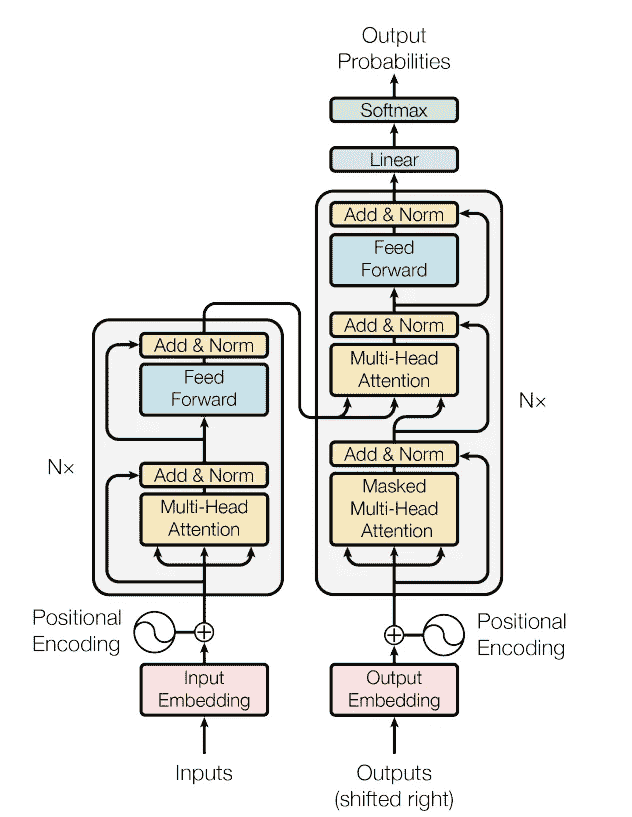
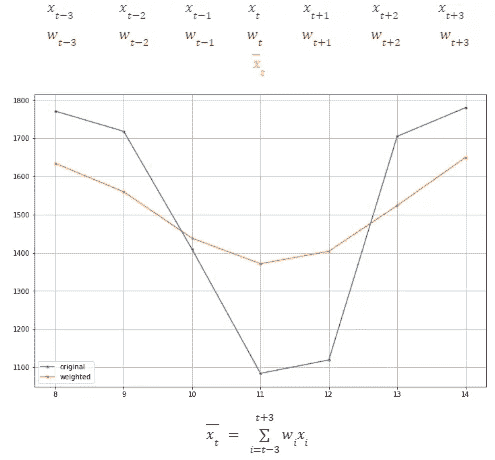
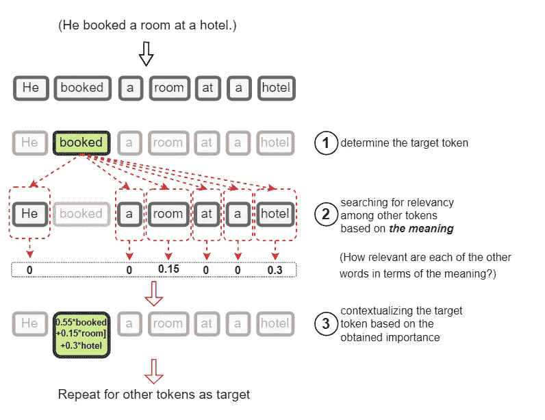
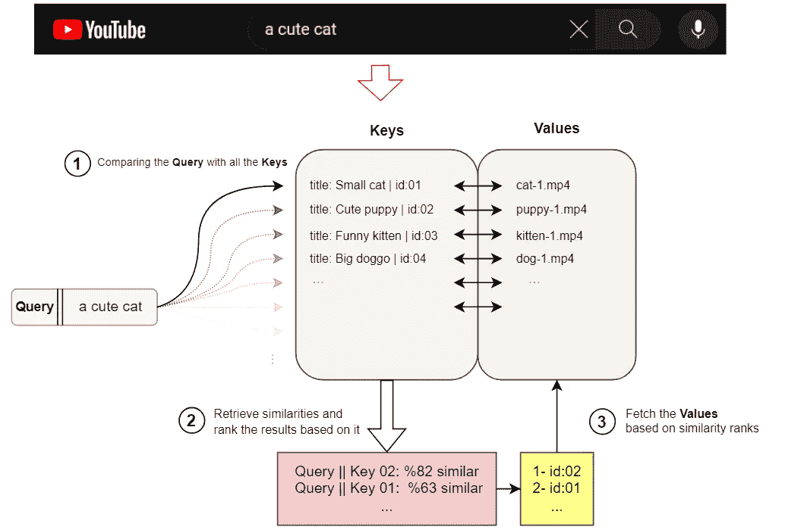
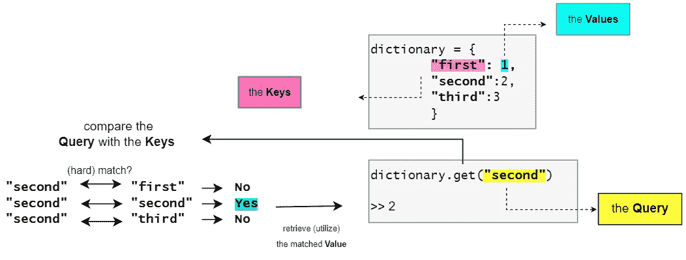
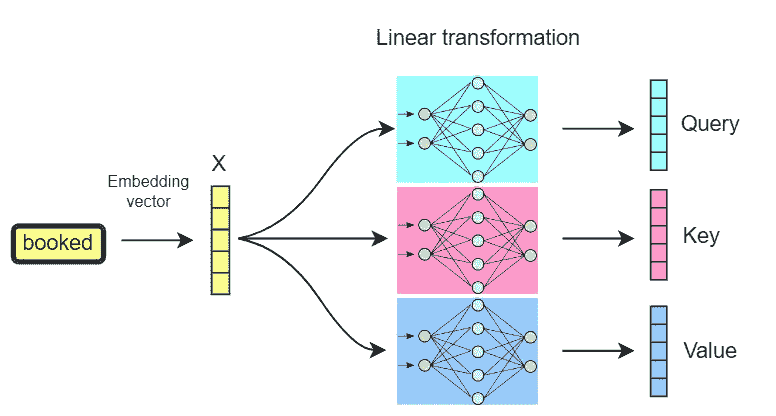
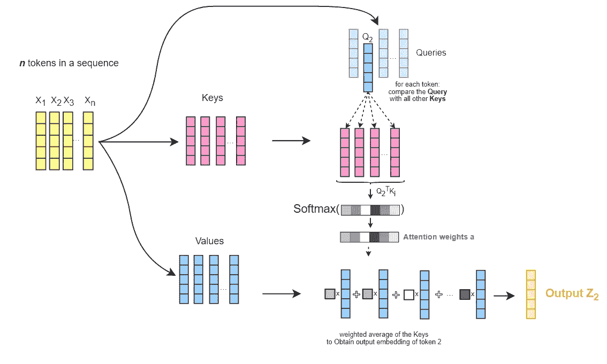
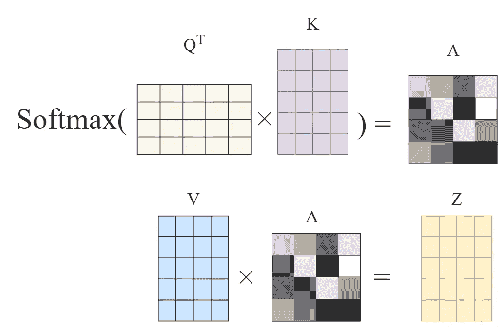
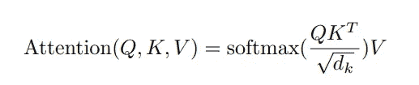
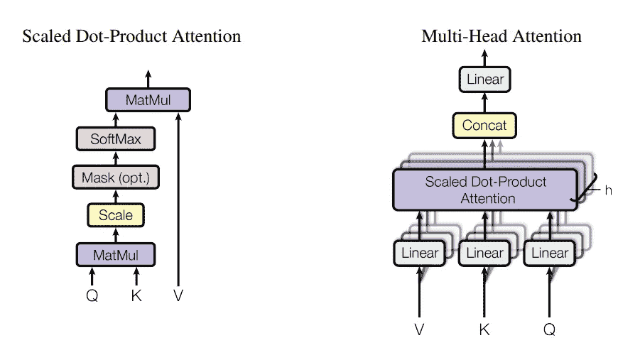

# Transformer 架构中的 Query、Key 和 Value 是什么？它们为什么被使用？

> 原文：[`towardsdatascience.com/what-are-query-key-and-value-in-the-transformer-architecture-and-why-are-they-used-acbe73f731f2`](https://towardsdatascience.com/what-are-query-key-and-value-in-the-transformer-architecture-and-why-are-they-used-acbe73f731f2)

## 对 Transformer 架构中 Key、Query 和 Value 概念背后的直觉进行分析，以及为何使用它们。

 [Ebrahim Pichka](https://ebrahimpichka.medium.com/?source=post_page-----acbe73f731f2--------------------------------)

·发布于 [Towards Data Science](https://towardsdatascience.com/?source=post_page-----acbe73f731f2--------------------------------) ·阅读时间 10 分钟·2023 年 10 月 5 日

--

作者提供的图像 — 由 [**Midjourney**](https://www.midjourney.com/) 生成

# 介绍

近年来，Transformer 架构在自然语言处理（NLP）领域引起了轰动，在机器翻译、语言建模、文本摘要等多种任务中取得了最先进的成果，并且在其他 AI 领域（如视觉、语音、强化学习等）也有所应用。

Vaswani 等人（2017 年）首次在他们的论文*“Attention Is All You Need”*中介绍了 Transformer，其中他们使用了自注意力机制，而没有加入递归连接，同时模型可以选择性地关注输入序列的特定部分。

Transformer 模型架构 — 来自 Vaswani 等人（2017 年）论文的图像（来源：[**arXiv:1706.03762v7**](https://arxiv.org/abs/1706.03762v7)）

特别是，之前的序列模型，例如递归编码器-解码器模型，在捕捉长期依赖关系和并行计算方面存在限制。实际上，在 2017 年 Transformer 论文发布之前，大多数 NLP 任务的最先进性能是通过在 RNN 上使用注意力机制获得的，所以注意力在 Transformer 之前就已存在。通过引入多头注意力机制，并去掉 RNN 部分，Transformer 架构通过允许多个独立的注意力机制解决了这些问题。

在这篇文章中，我们将深入探讨该架构的一个细节，即查询（Query）、键（Key）和值（Value），并尝试理解这部分所使用的直觉。

请注意，这篇文章假设你已经熟悉一些基本的自然语言处理和深度学习概念，如**嵌入**、**线性（密集）层**，以及一般的简单神经网络的工作原理。

# 注意！

首先，让我们了解注意力机制试图实现什么。为了简化起见，我们从**一个简单的例子**开始，了解我们要解决的具体问题，而不深入讨论*注意力机制*的所有术语。

## 上下文很重要

考虑**平滑时间序列数据**的情况。时间序列已知是最基本的序列数据之一，因为它已经是数值化和结构化的形式，并且通常处于低维空间。因此，提出一个好的起始示例是合适的。

为了平滑一个高度变化的时间序列，一种常见的技术是计算每个时间步的“**加权平均值**”，如图 1 所示，权重通常基于相邻时间步距离目标时间步的远近来选择。例如，在高斯平滑中，这些权重是从以当前步为中心的高斯函数中提取的。

时间序列平滑示例 — 作者提供的图像。

从某种意义上说，我们所做的是：

1.  我们取了**一系列值**，

1.  对于序列中的每一步，我们**添加了（加权的）上下文**来自其邻近值，而添加的上下文（**权重**）仅与它们的**接近度**相关。

1.  最后，我们获得了一个新的**上下文化**的序列，这使得我们可以更容易地理解和分析。

**这个示例中有两个关键点/问题：**

+   它仅使用**接近度**和**顺序位置**的值来获取上下文的权重。

+   权重是通过对所有点应用固定的任意规则来计算的。

## 语言的案例

在机器学习中，文本数据通常需要用实值向量（即**嵌入**）来表示。因此，我们假设标记（或单词）的主要含义被编码在这些向量中。现在，对于文本序列数据，如果我们想要像上述示例那样对序列中的每个标记进行**上下文化**，使每个标记的新嵌入包含更多关于其上下文的信息，我们将遇到一些问题，接下来我们将讨论这些问题：

首先，在上面的示例中，我们**仅仅**使用了**标记的接近度**来确定要添加的上下文的重要性（权重），而**单词的工作方式并非如此**。

在语言中，单词在句子中的上下文不仅仅基于顺序距离和接近度。我们不能仅仅依赖接近度来融入其他单词的上下文。

其次，仅通过对上下文标记的嵌入的（加权）平均值来添加上下文可能不够直观。一个标记的嵌入可能包含有关该标记的不同句法、语义或词汇方面的信息。所有这些信息可能与要添加的目标标记无关。因此，最好不要将所有信息作为整体添加为上下文。

那么，如果我们有一些（向量）表示序列中的词，**我们如何获得权重**和**相关的上下文**以重新加权和上下文化序列中的每个标记？

> 从广义上讲，答案是我们必须基于标记意义的某些特定方面（可以是语义的、句法的或其他任何方面）“**搜索**”它。在此**搜索**过程中，根据相关性或重要性分配**权重**和**上下文信息**。
> 
> 这意味着，对于序列中的每个标记，我们必须**遍历序列中的所有其他标记**，并根据我们用来比较目标标记与其他标记的相似性度量，为它们分配**权重**和**上下文信息**。**它们在期望上下文中的相似性越大，权重就越大**。

因此，一般来说，我们可以说注意力机制基本上是（1）**为序列中的其他标记分配权重**，（2）从其他标记中提取**相关上下文**，以根据它们与目标标记的相关性或重要性（即关注它们）。

我们说过，为了找到相关性/重要性，我们需要**在序列中进行搜索**并逐一比较标记。

在序列中搜索与标记相关的上下文以进行添加——图片由作者提供。

**这就是*查询*、*键*和*值*找到意义的地方。**

# ***查询*、*键*和*值***

为了更清楚地理解，可以想象一下你在 YouTube 上搜索内容的情形。例如，假设 YouTube 将所有视频存储为一对“*视频标题*”和“*视频文件*”本身。我们称之为**键值对**，其中键是视频标题，值是视频本身。

你在搜索框中输入的文本在搜索术语中称为**查询**。所以从某种意义上讲，当你搜索某个内容时，**YouTube 将你的搜索查询与所有视频的键进行比较**，然后衡量它们之间的相似性，并根据相似性从高到低排序它们的**值**。

一个基本的搜索过程展示了键、查询和值的概念——图片由作者提供。

在我们的问题中，我们有一个标记向量的序列，我们想要搜索**权重**以重新加权和上下文化序列中的每个标记（词）嵌入，我们可以从以下方面考虑：

1.  你想要查找的是**查询**。

1.  你正在搜索的是**键值对**。

1.  查询会与所有的键进行比较，以衡量**相关性/重要性/相似性**。

1.  **值**根据分配的相似性度量来使用。

另一个有用的相关类比是字典（或哈希表）数据结构。字典以键值对的形式存储数据，将键映射到其相应的值对。当你尝试**获取特定的**值时，你必须提供一个**查询**来匹配其对应的**键**，然后它**在这些键中搜索**，**与查询进行比较**，**如果匹配**，则返回所需的值。

然而，这里的区别在于这是一个“硬匹配”情况，其中查询要么**完全匹配**键，要么不匹配，中间的相似性不会被测量。

字典查询与键值对匹配 — 图片来源于作者

我们之前提到，我们只处理实值向量（标记嵌入）。因此，查询、键和值也需要是向量。然而，到目前为止，我们只有**每个标记的一个向量**，即其嵌入向量。那么，我们应该如何获得查询、键和值向量呢？

我们**构造它们**使用线性投影（线性变换即单个密集层，具有不同的权重集合：Wq、Wₖ、Wᵥ）对每个标记的嵌入向量进行变换。这意味着我们为查询、键和值分别使用**可学习**的权重向量，对词嵌入进行线性变换，以**获取相应的查询、键和值向量**。

对词嵌入进行线性变换以获取查询、键和值向量 — 图片来源于作者

一个标记的嵌入可能代表该标记的不同上下文、结构和语法方面或含义。通过使用**可学习的线性变换层**来从标记的嵌入构造这些向量，我们允许网络：

1.  **提取**并将信息的有限特定部分传递到***Q***、***K***和***V***向量中。

1.  确定一个更狭窄的上下文，在其中进行搜索和匹配。

1.  **学习**在嵌入中哪些信息更重要。

现在，手中有了***Q***、***K***和***V***向量，我们能够执行之前讨论的“**搜索和比较**”过程。这导致了注意力机制的最终推导，如（Vaswani et al 2017）中所提。

对于每个标记：

+   我们将其**查询向量**与所有其他标记的**键向量**进行比较。

+   计算每两个之间的**向量相似性**分数（即原始论文中的点积相似性）

+   将这些相似性**分数**转换为**权重**，通过将它们缩放到 [0,1]（即 Softmax）

+   并通过加权其对应的**值向量**来增加加权的上下文。

点积注意力过程 — 图片来源于作者

因此，***Q***、***K***和***V***向量的整个概念就像是一个**软**词典，用于模拟***搜索与匹配过程***，从中我们学习两个序列令牌的相关性（权重）以及**应该添加什么**作为上下文（值）。还要注意，这一过程不必按顺序进行（一个令牌一次）。这一切通过矩阵操作并行进行。

请注意，在下面的插图中，矩阵的维度与原始论文中的维度有所不同（***n_tokens*** 乘 ***dim*** 而不是 ***dim*** 乘 ***n_tokens***）。稍后在本文中，您将看到注意力机制的原始和完整公式，其顺序与此相反。

点积注意力的矩阵形式 — 作者绘制的图片

这导致了对每个令牌的上下文感知嵌入，其中添加的上下文基于令牌之间的相关性，并通过***Q***、***K***、***V***向量转换学习得到。因此，使用了点积注意力机制。Vaswani 等人（2017）的原始注意力机制也缩放了***K***和***Q***向量的点积，即将结果向量除以***sqrt(d)***，其中***d***是查询向量的维度。因此得名***“缩放点积注意力”***。这种缩放有助于在传递到 Softmax 函数之前减少点积的方差。

注意力机制公式 — Vaswani 等人（2017）（来源：[**arXiv:1706.03762v7**](https://arxiv.org/abs/1706.03762v7)）

最后，我们提到将嵌入转换为***Q***、***K***、***V***的线性层可能只提取嵌入中的特定模式以找到注意力权重。为了使模型能够学习序列令牌之间的不同复杂关系，创建并使用这些***Q***、***K***、***V***的多个不同版本，以便每个版本关注嵌入中存在的不同模式。这些多个版本称为**注意力头**，因此得名“多头注意力”。这些头部也可以向量化，并使用当前流行的深度学习框架并行计算。

多头缩放点积注意力 — 图片来自 Vaswani 等人（2017）的论文（来源：[**arXiv:1706.03762v7**](https://arxiv.org/abs/1706.03762v7)）

# 结论

总结一下，在这篇文章中，我试图描绘和分析 Query、Key 和 Value 的直觉，这些是注意力机制中的关键组件，初次接触时可能有点难以理解。

本文讨论的注意力机制是提出在变换器架构中，这种架构在(Vaswani et al, 2017)的论文“Attention is all you need”中介绍，并且自此以来，在深度学习的多个任务和基准中一直是表现最优的架构之一。鉴于其广泛的应用和适用性，了解这一架构中的细节和使用原因将会很有帮助。

我在解释这个话题时尽量做到清晰和基础，通过举例和插图尽可能地说明。

# 参考文献

[1] Vaswani, Ashish, Noam Shazeer, Niki Parmar, Jakob Uszkoreit, Llion Jones, Aidan N. Gomez, Lukasz Kaiser, and Illia Polosukhin. “*Attention Is All You Need.*” arXiv, 2023 年 8 月 1 日。 [`doi.org/10.48550/arXiv.1706.03762`](https://doi.org/10.48550/arXiv.1706.03762)。
